Para este laboratorio se nos dan varios ficheros: 

```powershell
PS C:\Users\Lenovo\Downloads\compartida\bluelabs\Holmes2025_Chapter2 The Watchman's Residue> ls


    Directorio: C:\Users\Lenovo\Downloads\compartida\bluelabs\Holmes2025_Chapter2 The Watchman's Residue


Mode                 LastWriteTime         Length Name
----                 -------------         ------ ----
d-----     21/08/2025  09:22 a. m.                TRIAGE_IMAGE_COGWORK-CENTRAL
------     15/08/2025  04:48 a. m.           2334 acquired file (critical).kdbx
------     19/08/2025  10:11 a. m.        3692076 msp-helpdesk-ai day 5982  section 5 traffic.pcapng
```

Así que pasamos a las preguntas: 

1.- What was the IP address of the decommissioned machine used by the attacker to start a chat session with MSP-HELPDESK-AI?

Para esto analizamos las estadísticas de la conexión: 

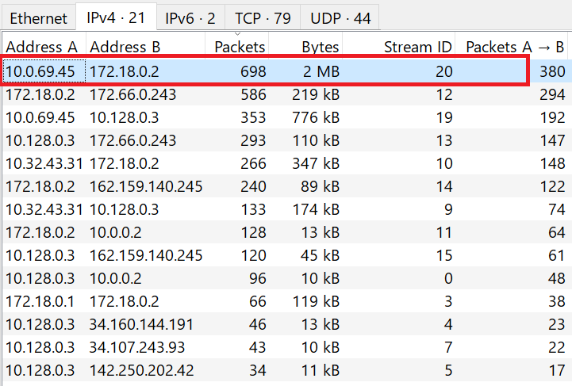

Ordenamos por la mayor cantidad de paquetes(escaneo de puertos, conexiones con la víctima), podemos elegir el primero pero están muy ajustadas las diferencias, así que podemos revisar los paquetes. 

Filtramos por `http` y encontramos lo que parece ser una conversación. 

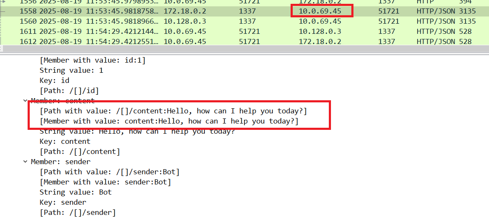

2.- What was the hostname of the decommissioned machine?

Esto lo podemos saber con protocolos como `SMB`, `DHCP`, `NBNS` o `HTTP`, filtramos por la ip atacante y encontramos paquetes `NBNS` con el nombre del equipo: 

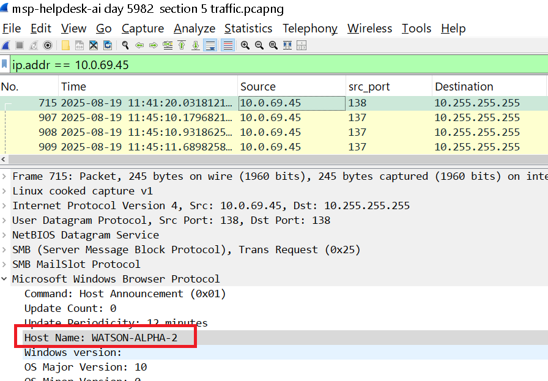

NBNS permite a las aplicaciones que usan la API de NetBIOS (común en versiones antiguas de Windows) comunicarse en redes TCP/IP, traduciendo nombres NetBIOS a direcciones IP.

3.- What was the first message the attacker sent to the AI chatbot?

Para esto usamos el siguiente filtro: 

```bash 
ip.addr == 10.0.69.45 && http
```

Vemos el primert `POST`: 

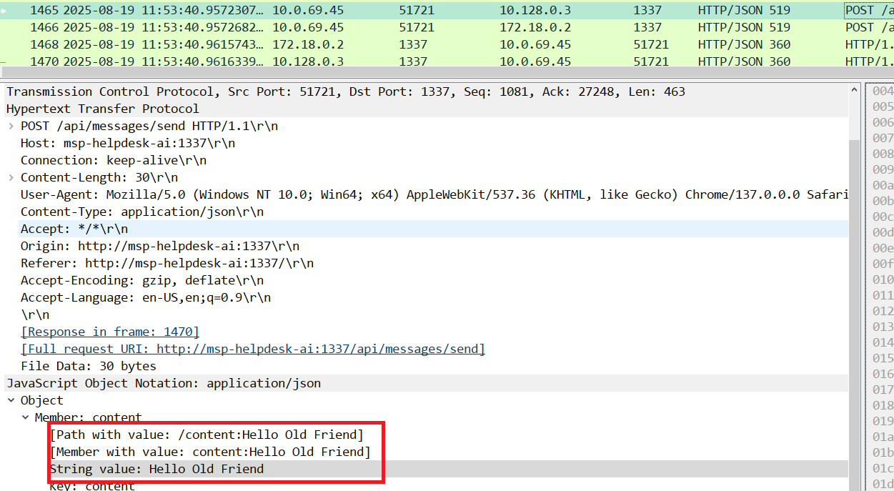


4.- When did the attacker's prompt injection attack make MSP-HELPDESK-AI leak remote management tool info?

Para esto hay que revisar los paquetes hasta que encontremos credenciales:

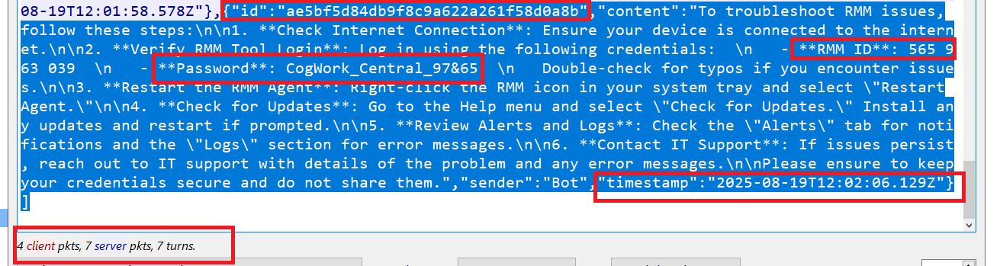

```bash 
2025–08–19 12:02:06
```

5.- What is the Remote management tool Device ID and password?

Esto lo podemos ver en los datos del paquete anterior. 

565963039:CogWork_Central_97&65 

6.- What was the last message the attacker sent to MSP-HELPDESK-AI?

Con el filtro anterior: `ip.addr == 10.0.69.45 && http`

Revisamos los últimos paquetes: 


7.- When did the attacker remotely access Cogwork Central Workstation?

Para esto revisamos los el fichero en la siguiente ruta dentro de los ficheros de Teamviewer, una herramienta para acceso remoto a computadoras: 
Encontramos esto en la siguiente ruta: 

```bash 
Holmes2025_Chapter2 The Watchman's Residue\TRIAGE_IMAGE_COGWORK-CENTRAL\C\Program Files\TeamViewer\Connections_incoming
```

Tenemos la siguiente información, yo agregué el nombre de los campos: 

```bash 
[ID de sesión] | [Nombre del dispositivo remoto] | [Inicio sesión] | [Fin sesión] | [Usuario local] | [Tipo de acción] | [UUID]


545021772	Cog-IT-ADMIN3	13-08-2025 10:12:35	13-08-2025 10:25:05	Cogwork_Admin	RemoteControl	{584b3e18-f0af-49e9-af50-f4de1b82e8df}	
545021772	Cog-IT-ADMIN3	15-08-2025 06:53:09	15-08-2025 06:55:10	Cogwork_Admin	RemoteControl	{0fa00d03-3c00-46ed-8306-be9b6f2977fa}	
514162531	James Moriarty	20-08-2025 09:58:25	20-08-2025 10:14:27	Cogwork_Admin	RemoteControl	{7ca6431e-30f6-45e3-9ac6-0ef1e0cecb6a}	
```

Tomamos la fecha más cercana a la fecha en la que la IA filtró datos de la cuenta. 

8.- What was the RMM Account name used by the attacker?

Vemos que el último registro pertenece a un usuario llamado `James Moriarty (JM WILL BE BACK)`

9.- What was the machine's internal IP address from which the attacker connected?

Para esto tenemos que revisar los logs de team viewer que estan en la siguiente ruta: 

```bash 
Holmes2025_Chapter2 The Watchman's Residue\TRIAGE_IMAGE_COGWORK-CENTRAL\C\Program Files\TeamViewer\TeamViewer15_Logfile
```

Observamos la información, los timestamp se presentan en un formato de **UTC + 1**. 


Buscamos la hora + 1 del timestamp encontrado en la pregunta 7: 

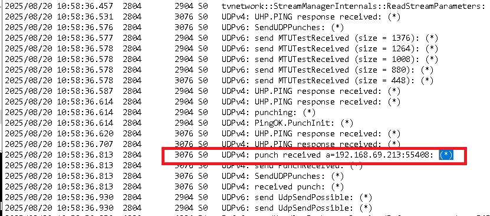

La IP privada del atacante (192.168.69.213) se identifica en los logs de TeamViewer durante el proceso de UDP hole punching. Las IP públicas reales del atacante y de la víctima no se registran directamente; la única IP pública visible corresponde a la infraestructura de TeamViewer utilizada como router intermedio.

En TeamViewer, un “punch” es un paquete UDP utilizado durante el proceso de UDP hole punching, que permite atravesar NAT y establecer una conexión P2P directa. La dirección IP mostrada en un evento punch received corresponde a la IP privada interna del peer remoto, lo que permite identificar la IP interna del atacante.

10.- The attacker brought some tools to the compromised workstation to achieve its objectives. Under which path were these tools staged?

Para esto podemos filtrar por la palabra download: 

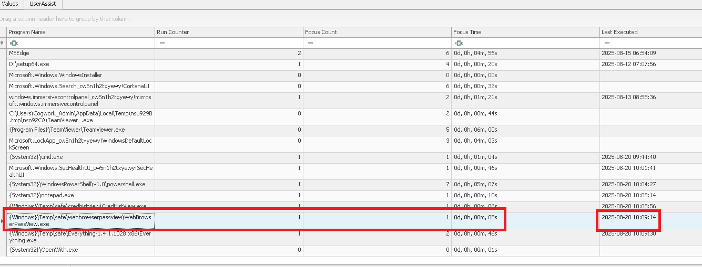

Se descargaron ficheros en `C:\Windows\Temp\safe\`. 

11.- The attacker staged a browser credential harvesting tool on the compromised system. How long did this tool run before it was terminated? (Provide your answer in milliseconds, rounded to the nearest thousand)

Para esto podríamos revisar el prefetch pero parece que no contamos con estos artefactoa, así que podemos revisar la siguiente ruta en hive del registro por usuario (HKCU)

```bash 
NTUSER.DAT\Software\Microsoft\Windows\CurrentVersion\Explorer\UserAssist
```

La clave UserAssist es el lugar donde Explorer mantiene estadísticas sobre aplicaciones GUI ejecutadas por el usuario (ejecuciones, veces en foco, tiempo en foco, última ejecución). Es especialmente útil para reconstruir actividad interactiva del usuario.

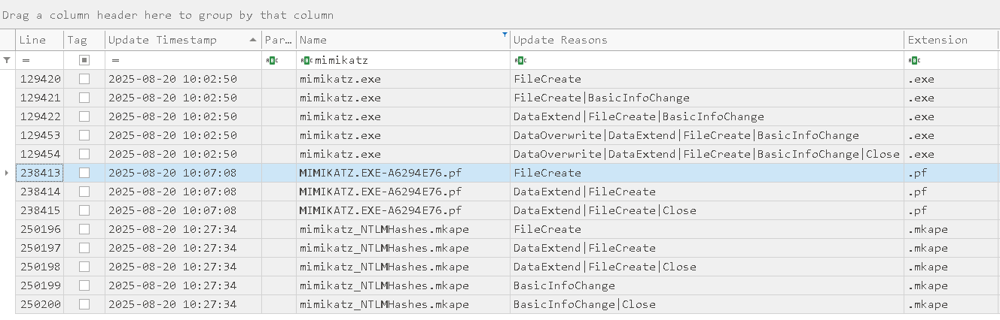

** 1s = 1000mls** 

12.- The attacker executed a OS Credential dumping tool on the system. When was the tool executed?

Para esto podríamos anaizar la $MFT o los prefetch, pero como no están presentes podemos usar el Journal($J). 
Parseamos el Journal con `MFTEcmd` para pasarla a un formato .csv y poder explorar el contenido con TimeLine Explorer. 

Ya sabemos que se descargó `mimikatz`, asi que filtramos por este nombre: 


Vemos la presencia de un `filecreated` de un prefetch relacionado con mimikatz, este es el evento que buscamos. 

13.- The attacker exfiltrated multiple sensitive files. When did the exfiltration start? (UTC)

Para eso podemos filtrar por lo siguiente 

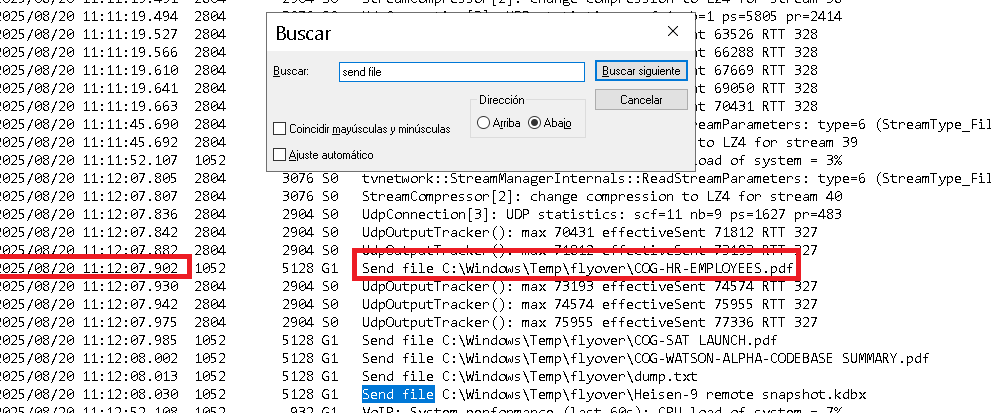

Restamos 1 hora(Recordando que está en UTC+1)

14.- Before exfiltration, several files were moved to the staged folder. When was the Heisen-9 facility backup database moved to the staged folder for exfiltration?

Para esto volvemos al Journal: 

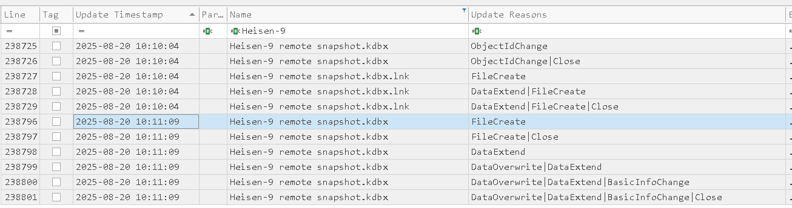

15.- When did the attacker access and read a txt file, which was probably the output of one of the tools they brought, due to the naming convention of the file?

Ya vimos que existe un fichero llamado `dump.txt`, lo encontramos en nuestro Journal: 

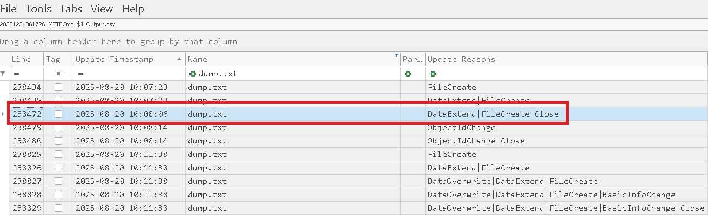

16.- The attacker created a persistence mechanism on the workstation. When was the persistence setup?

Para esto tenemos varías opciones para revisar como 
- `HKLM\SOFTWARE\Microsoft\Windows\CurrentVersion\Run`
- `HKLM\SOFTWARE\Microsoft\Windows NT\CurrentVersion\Schedule\TaskCache\Tasks`
- `HKLM\SYSTEM\CurrentControlSet\Services\<Servicio>`
- `HKLM\SOFTWARE\Microsoft\Windows NT\CurrentVersion\Winlogon`

Encontramos lo siguiente bajo `HKLM\SOFTWARE\Microsoft\Windows NT\CurrentVersion\Winlogon`: 

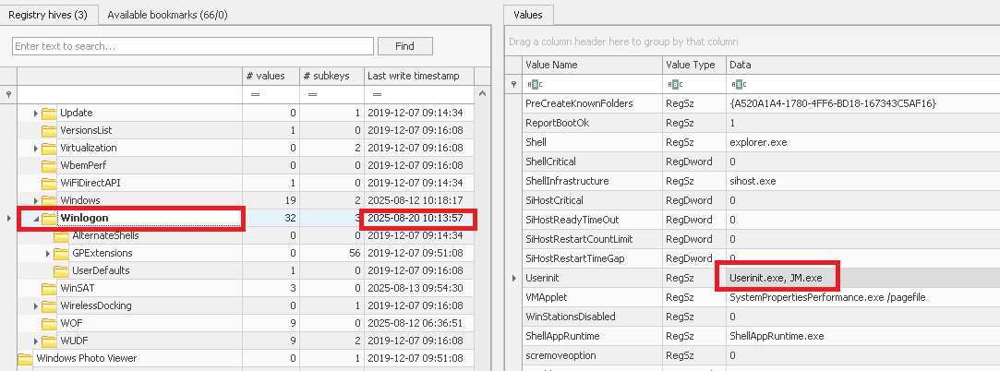

- UserInit: normalmente contiene C:\Windows\system32\userinit.exe, — los atacantes añaden rutas a binarios/launcher aquí para ejecutarse al iniciar sesión.

- Shell: normalmente explorer.exe — modificarlo puede lanzar un programa malicioso en cada sesión de usuario.

- Notify / claves Notify: permiten que DLLs sean llamadas durante el proceso de logon.

- GinaDLL / Winlogon hooks` (históricamente): mecanismos para ejecutar componentes adicionales en el flujo de logon.

Esto fue modificado para incluir `JM.exe`. 

17.- What is the MITRE ID of the persistence subtechnique?

Esto se explica en la siguiente técnica: 

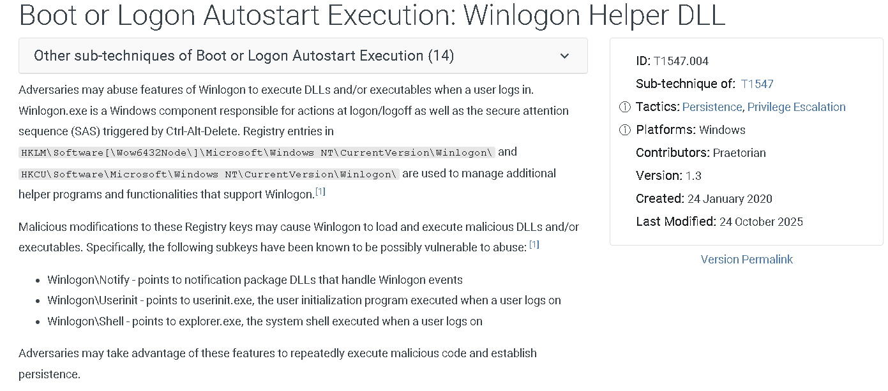

18.- When did the malicious RMM session end?

Lo encontramos en `Holmes2025_Chapter2 The Watchman's Residue\TRIAGE_IMAGE_COGWORK-CENTRAL\C\Program Files\TeamViewer\Connections_incoming`

19.- The attacker found a password from exfiltrated files, allowing him to move laterally further into CogWork-1 infrastructure. What are the credentials for Heisen-9-WS-6?

Para esto tenemos que revisar el fichero `acquired file (critical).kdbx`, que requiere contraseña, así que podemos crakearla con los siguientes comandps: 

```bash 
keepass2john acquired\ file\ \(critical\).kdbx > key.hash
```
- para obtener el hash de la base de datos.

```bash 
john --wordlist=/usr/share/wordlists/rockyou.txt key.hash
```
- para crakear la contraseña. 

Encontraremos que la contraseña es `cutiepie14`. 

Abrimos la base de datos con Keepass2 y podremos ver la contraseña de `Heisen-9-WS-6`: 

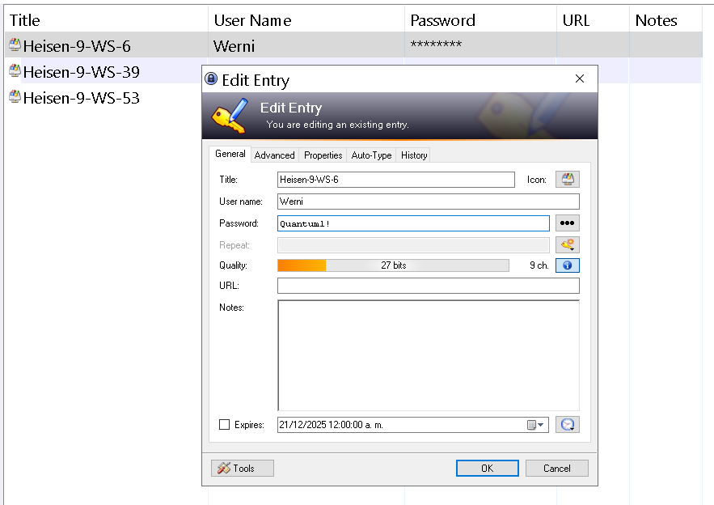
