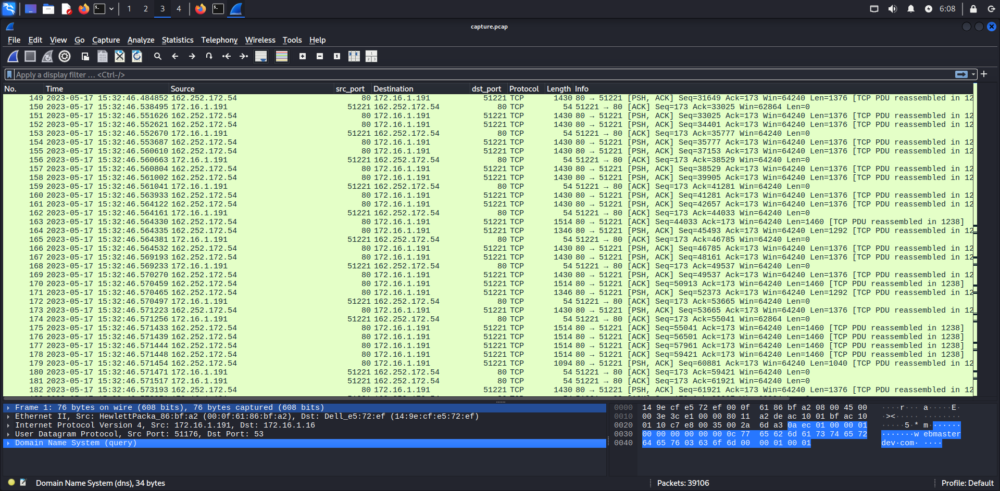
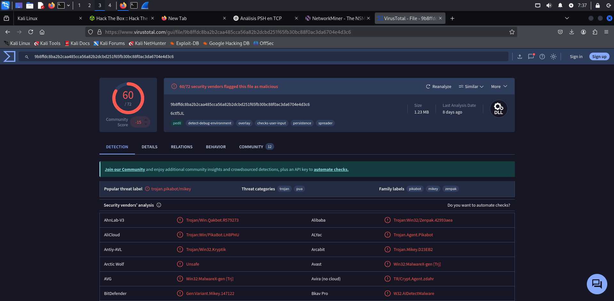
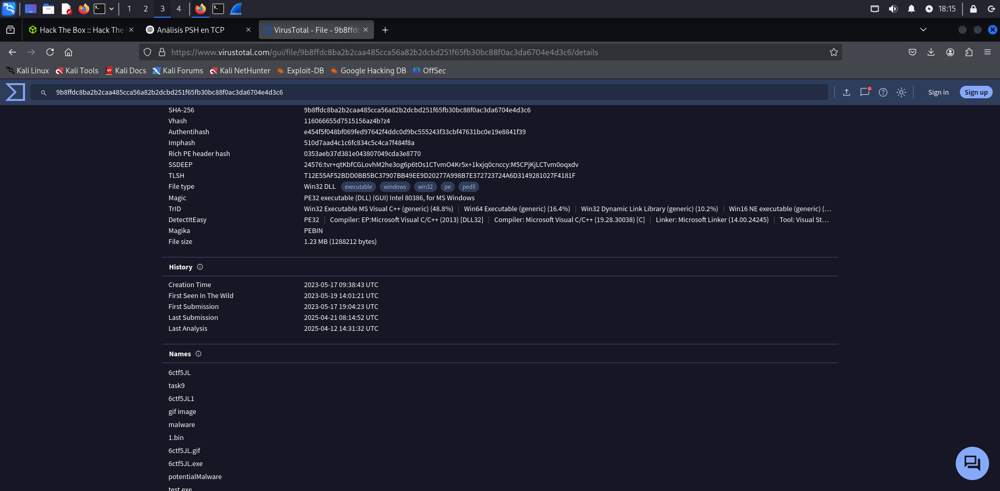

# **Sherlock - Compromised**

---
**task 1**

¿Cuál es la dirección IP utilizada para el acceso inicial?

Bien, para responder a esto podemos revisar el pcap y si exploramos un poco vemos demasiado tráfico por el puerto http y https, 80 y 443 respectivamente. 



Recordemos que la flag PSH sirve para indicar que los datos que se están transmitiendo en un segmento TCP deben ser entregados a la aplicación receptora tan pronto como se reciban, sin esperar a que se llene el búfer de recepción

funcionamiento del buffer de TCP:  
- Tiene **buffers** (almacenes temporales) en ambos extremos.
- Normalmente **espera** a que haya suficiente información (datos) antes de entregarla a la aplicación, para ser más eficiente.

### **Flujo cuando **NO** se usa PSH**

1. El cliente (por ejemplo, un navegador) envía datos a un servidor (como una petición HTTP).
2. El receptor (el servidor) **guarda esos datos en el buffer TCP**, sin pasarlos aún a la aplicación (como Apache o Nginx).
3. TCP espera a tener "suficientes" datos (o a que se cumplan ciertas condiciones como tiempo o tamaño del buffer).
4. Una vez listo, **pasa el bloque completo** a la aplicación.

Esto mejora la eficiencia de red (menos interrupciones, menos llamadas al sistema), pero puede causar algo de **latencia**.

### ¿Qué cambia con el **PSH**?

Cuando el emisor pone la bandera **PSH**:
- Le está diciendo al receptor: **“¡Entregá esto *ya mismo* a la aplicación, no lo retengas en el buffer!”**
- Esto se usa cuando se quiere que la app procese los datos en tiempo real o inmediato.

Entonces es algo que ya levanta las alarmas de que podríamos estar ante un ataque. 

---
**task 2**

¿Cuál es el hash SHA256 del malware?

Bien, ya sabemos ocurrió un ataque, lo lógico sería buscar peticiones GET para identificar el malware que se descargó en el sistema: 
```bash 
─$ tshark -r capture.pcap -Y "http.request.method == GET"
  116  41.895371 172.16.1.191 51221 162.252.172.54 80 HTTP 226 GET /9GQ5A8/6ctf5JL HTTP/1.1 
24053 5813.567513 172.16.1.191 51388 104.18.32.68 80 HTTP 214 GET /SectigoRSADomainValidationSecureServerCA.crt HTTP/1.1
``` 

Parece que es lo que buscamos, usamos el networkminer para saber de qué se trata, y ya en la extensión podemos ver que es un dll. 
Si miramos los detalles del fichero podremos ver el hash sha256: 


Esto también podemos hacerlo desde `File>export objects>HTTP`, guardar el fichero que nos interesa y obtener el hash desde la terminal. 

```bash 
└─$ ls 
6ctf5JL  capture.pcap  compromised.zip
                                                                                                                                                                                            
┌──(kali㉿kali)-[~/blue-labs/ufo/Reaper]
└─$ file 6ctf5JL 
6ctf5JL: PE32 executable (DLL) (GUI) Intel 80386, for MS Windows, 6 sections
                                                                                                                                                                                            
┌──(kali㉿kali)-[~/blue-labs/ufo/Reaper]
└─$ sha256sum 6ctf5JL
9b8ffdc8ba2b2caa485cca56a82b2dcbd251f65fb30bc88f0ac3da6704e4d3c6  6ctf5JL
``` 

---
**task 3**

¿Cuál es la etiqueta de familia del malware? 



El archivo resultó ser una **DLL maliciosa** de la familia **Pikabot**, definitivamente estás tratando con un malware real (o una réplica muy fiel). Te explico todo lo importante de Pikabot:

**Pikabot** es un **troyano de acceso remoto (RAT)** moderno, diseñado para:

- **Infectar sistemas Windows**
- Ejecutar comandos arbitrarios del atacante
- Descargar y ejecutar cargas adicionales (como ransomware o stealers)
- Funcionar como parte de **botnets** (redes de máquinas infectadas)

### Comportamento típico:

1. **Fase inicial:**
   - Llega usualmente a través de phishing o archivos maliciosos (como `.dll`, `.docm`, `.js`, etc.).
   - A veces disfrazado de imágenes, instaladores, etc.
   - Puede usar técnicas de **inyección en procesos legítimos** (`svchost.exe`, `explorer.exe`, etc.)

2. **Persistencia y ejecución:**
   - Se ejecuta como DLL inyectada
   - Se comunica con un **C2 (Command and Control)** vía HTTP/S o TCP
   - Puede descargar más malware (por ejemplo: **Cobalt Strike**, **RATs**, o **ransomware** como **BlackCat**)

3. **Técnicas anti-análisis:**
   - Obfuscación de código
   - Cadenas cifradas
   - Anti-debugging
   - Evita entornos virtuales o sandboxes


### Relevancia reciente

Desde mediados de **2023 hasta 2024**, Pikabot fue **muy usado como loader alternativo** a Emotet, especialmente por grupos de ransomware como **Conti**, **BlackBasta**, y otros.
Incluso reemplazó a **Qakbot** en algunas campañas luego de que ese fuera desmantelado.

---
**task 4** 

¿Cuándo se vio el malware por primera vez en la naturaleza (UTC)?



Si vemos, debajo del historial aparencen los nombres con el que lo encontramos en el pcap. 

---
**task 5**


