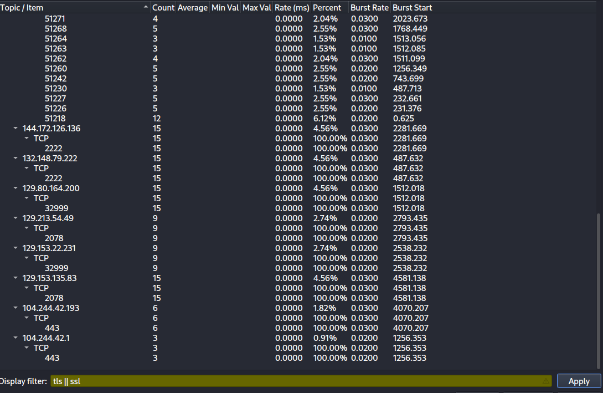
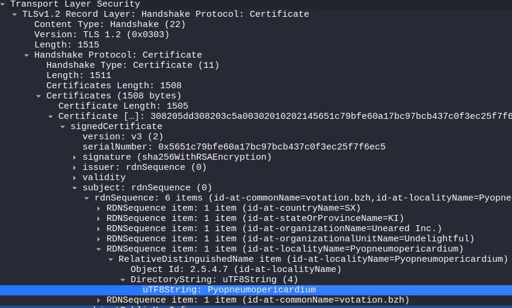

# **Sherlock - Compromised**

---
**task 1**

¿Cuál es la dirección IP utilizada para el acceso inicial?

Bien, para responder a esto podemos revisar el pcap y si exploramos un poco vemos demasiado tráfico por el puerto http y https, 80 y 443 respectivamente. 


Recordemos que la flag PSH sirve para indicar que los datos que se están transmitiendo en un segmento TCP deben ser entregados a la aplicación receptora tan pronto como se reciban, sin esperar a que se llene el búfer de recepción

funcionamiento del buffer de TCP:  
- Tiene **buffers** (almacenes temporales) en ambos extremos.
- Normalmente **espera** a que haya suficiente información (datos) antes de entregarla a la aplicación, para ser más eficiente.

### **Flujo cuando **NO** se usa PSH**

1. El cliente (por ejemplo, un navegador) envía datos a un servidor (como una petición HTTP).
2. El receptor (el servidor) **guarda esos datos en el buffer TCP**, sin pasarlos aún a la aplicación (como Apache o Nginx).
3. TCP espera a tener "suficientes" datos (o a que se cumplan ciertas condiciones como tiempo o tamaño del buffer).
4. Una vez listo, **pasa el bloque completo** a la aplicación.

Esto mejora la eficiencia de red (menos interrupciones, menos llamadas al sistema), pero puede causar algo de **latencia**.

### ¿Qué cambia con el **PSH**?

Cuando el emisor pone la bandera **PSH**:
- Le está diciendo al receptor: **“¡Entregá esto *ya mismo* a la aplicación, no lo retengas en el buffer!”**
- Esto se usa cuando se quiere que la app procese los datos en tiempo real o inmediato.

Entonces es algo que ya levanta las alarmas de que podríamos estar ante un ataque. 

---
**task 2**

¿Cuál es el hash SHA256 del malware?

Bien, ya sabemos ocurrió un ataque, lo lógico sería buscar peticiones GET para identificar el malware que se descargó en el sistema: 
```bash 
─$ tshark -r capture.pcap -Y "http.request.method == GET"
  116  41.895371 172.16.1.191 51221 162.252.172.54 80 HTTP 226 GET /9GQ5A8/6ctf5JL HTTP/1.1 
24053 5813.567513 172.16.1.191 51388 104.18.32.68 80 HTTP 214 GET /SectigoRSADomainValidationSecureServerCA.crt HTTP/1.1
``` 

Parece que es lo que buscamos, usamos el networkminer para saber de qué se trata, y ya en la extensión podemos ver que es un dll. 
Si miramos los detalles del fichero podremos ver el hash sha256: 


Esto también podemos hacerlo desde `File>export objects>HTTP`, guardar el fichero que nos interesa y obtener el hash desde la terminal. 

```bash 
└─$ ls 
6ctf5JL  capture.pcap  compromised.zip
                                                                                                                                                                                            
┌──(kali㉿kali)-[~/blue-labs/ufo/Reaper]
└─$ file 6ctf5JL 
6ctf5JL: PE32 executable (DLL) (GUI) Intel 80386, for MS Windows, 6 sections
                                                                                                                                                                                            
┌──(kali㉿kali)-[~/blue-labs/ufo/Reaper]
└─$ sha256sum 6ctf5JL
9b8ffdc8ba2b2caa485cca56a82b2dcbd251f65fb30bc88f0ac3da6704e4d3c6  6ctf5JL
``` 

---
**task 3**

¿Cuál es la etiqueta de familia del malware? 


El archivo resultó ser una **DLL maliciosa** de la familia **Pikabot**, definitivamente estás tratando con un malware real (o una réplica muy fiel). Te explico todo lo importante de Pikabot:

**Pikabot** es un **troyano de acceso remoto (RAT)** moderno, diseñado para:

- **Infectar sistemas Windows**
- Ejecutar comandos arbitrarios del atacante
- Descargar y ejecutar cargas adicionales (como ransomware o stealers)
- Funcionar como parte de **botnets** (redes de máquinas infectadas)

### Comportamento típico:

1. **Fase inicial:**
   - Llega usualmente a través de phishing o archivos maliciosos (como `.dll`, `.docm`, `.js`, etc.).
   - A veces disfrazado de imágenes, instaladores, etc.
   - Puede usar técnicas de **inyección en procesos legítimos** (`svchost.exe`, `explorer.exe`, etc.)

2. **Persistencia y ejecución:**
   - Se ejecuta como DLL inyectada
   - Se comunica con un **C2 (Command and Control)** vía HTTP/S o TCP
   - Puede descargar más malware (por ejemplo: **Cobalt Strike**, **RATs**, o **ransomware** como **BlackCat**)

3. **Técnicas anti-análisis:**
   - Obfuscación de código
   - Cadenas cifradas
   - Anti-debugging
   - Evita entornos virtuales o sandboxes


### Relevancia reciente

Desde mediados de **2023 hasta 2024**, Pikabot fue **muy usado como loader alternativo** a Emotet, especialmente por grupos de ransomware como **Conti**, **BlackBasta**, y otros.
Incluso reemplazó a **Qakbot** en algunas campañas luego de que ese fuera desmantelado.

---
**task 4** 

¿Cuándo se vio el malware por primera vez en la naturaleza (UTC)?


Si vemos, debajo del historial aparencen los nombres con el que lo encontramos en el pcap. 

---
**task 5**

Para esto podemos irnos a la sección de `Statistics>IPv4 Statistics>Destinations and protocols` y aplicamos el filtro `tls || ssl` 



Vemos los puertos  2078, 2222, 32999


---
**task 6**

¿Cuál es el id-at-localityName del certificado autofirmado asociado a la primera IP maliciosa?

En los certificados digitales (como los de TLS/SSL), hay una sección llamada **Subject** que identifica al dueño del certificado. Este subject tiene varios campos, como:

- `C` = Country (país)
- `ST` = State or Province (estado o provincia)
- `L` = **Locality** (ciudad o localidad) ← esto es lo que se refiere a `id-at-localityName`
- `O` = Organization
- `CN` = Common Name

El campo `L` o `localityName` representa la **ciudad** o **localidad** en la que se dice que está registrada la entidad que emite el certificado. El identificador técnico para este campo es **`id-at-localityName`**.

En la captura de la pregunta pasada vimos las direcciones ip relacionadas con los puertos que nos pedían buscar: 45.85.235.39

Así que filtramos primero por el tráfico tls:
```bash 
─$ tshark -r capture.pcap -Y "tls"
    6   0.246093 172.16.1.191 51218 184.168.98.68 443 TLSv1.2 571 Client Hello (SNI=webmasterdev.com)
    8   0.492764 184.168.98.68 443 172.16.1.191 51218 TLSv1.2 1514 Server Hello
   13   0.624758 184.168.98.68 443 172.16.1.191 51218 TLSv1.2 1430 Certificate, Certificate Status
   14   0.624936 184.168.98.68 443 172.16.1.191 51218 TLSv1.2 77 Server Key Exchange, Server Hello Done
   16   0.626446 172.16.1.191 51218 184.168.98.68 443 TLSv1.2 147 Client Key Exchange, Change Cipher Spec, Encrypted Handshake Message
   18   0.626588 172.16.1.191 51218 184.168.98.68 443 TLSv1.2 159 Application Data
   20   0.626718 172.16.1.191 51218 184.168.98.68 443 TLSv1.2 541 Application Data
   22   0.866526 184.168.98.68 443 172.16.1.191 51218 TLSv1.2 344 New Session Ticket, Change Cipher Spec, Encrypted Handshake Message
   23   0.866957 184.168.98.68 443 172.16.1.191 51218 TLSv1.2 111 Application Data
   25   0.867165 172.16.1.191 51218 184.168.98.68 443 TLSv1.2 92 Application Data
   27   1.107699 184.168.98.68 443 172.16.1.191 51218 TLSv1.2 92 Application Data
   29   2.426736 184.168.98.68 443 172.16.1.191 51218 TLSv1.2 1430 
   43   2.662083 184.168.98.68 443 172.16.1.191 51218 TLSv1.2 1514 Application Data
   61   3.028627 184.168.98.68 443 172.16.1.191 51218 TLSv1.2 1430 Application Data
   79   3.270225 184.168.98.68 443 172.16.1.191 51218 TLSv1.2 1514 Application Data
   93   3.379606 184.168.98.68 443 172.16.1.191 51218 TLSv1.2 1094 Application Data
  106   3.511337 184.168.98.68 443 172.16.1.191 51218 TLSv1.2 255 Application Data
  108   8.377100 184.168.98.68 443 172.16.1.191 51218 TLSv1.2 138 Application Data, Encrypted Alert
 1246 231.084815 172.16.1.191 51226 45.85.235.39 2078 TLSv1.2 201 Client Hello
 1248 231.375840 45.85.235.39 2078 172.16.1.191 51226 TLSv1.2 1430 Server Hello
 1249 231.376008 45.85.235.39 2078 172.16.1.191 51226 TLSv1.2 838 Certificate, Server Key Exchange, Server Hello Done
 1252 231.399719 172.16.1.191 51226 45.85.235.39 2078 TLSv1.2 147 Client Key Exchange, Change Cipher Spec, Encrypted Handshake Message
 1254 231.577723 45.85.235.39 2078 172.16.1.191 51226 TLSv1.2 296 New Session Ticket, Change Cipher Spec, Encrypted Handshake Message
 1256 231.580440 172.16.1.191 51226 45.85.235.39 2078 TLSv1.2 554 Application Data
```
Estamos viendo **una negociación TLS** (el famoso *handshake*) entre una máquina interna (`172.16.1.191`) y una IP externa. Este proceso ocurre **antes** de que empiece el cifrado real, y es donde se intercambian cosas como el **certificado del servidor**.

### donde

| Nº de paquete | Descripción                          | ¿Qué contiene? |
|---------------|--------------------------------------|----------------|
| `6`           | `Client Hello`                       | El cliente inicia la conexión TLS. |
| `8`           | `Server Hello`                       | El servidor responde, eligiendo los parámetros. |
| `13` / `1249` | `Certificate` (de parte del servidor)| Aquí es donde el servidor envía su certificado digital (el que contiene el campo `id-at-localityName` que te están pidiendo). |
| `14`          | `Server Key Exchange` + `Hello Done` | El servidor termina su parte del handshake. |
| `16`          | `Client Key Exchange`                | El cliente responde y se completa el intercambio de claves. |
| `18+`         | `Application Data`                   | Ya todo está cifrado y empieza el tráfico de datos "real". |


Así que ya podemos pasar al paquete `1249` para buscar la respuesta: 


O desde la terminal: 
```bash 
─$ tshark -r capture.pcap -Y "frame.number eq 1249" -T fields -e x509sat.uTF8String
KI,Uneared Inc.,Undelightful,Pyopneumopericardium,votation.bzh,KI,Uneared Inc.,Undelightful,Pyopneumopericardium,votation.bzh
```

---
**task 7**

¿Cuál es la hora notBefore (UTC) de este certificado autofirmado?

En los certificados TLS (como los que se envían en conexiones HTTPS), hay un campo llamado validez (Validity), que define el intervalo de tiempo en el que el certificado es válido.

Ese campo tiene dos subcampos importantes:

- `notBefore`: la fecha y hora desde la cual el certificado es válido.
- `notAfter`: la fecha y hora en la que el certificado expira.

Así que para esto podemos seguir revisando el paquete anterior, el `1249`, con el siguiente campo: 

```bash 
─$ tshark -r capture.pcap -Y "frame.number eq 1249" -T fields -e x509af.utcTime | tr ',' '\n'
2023-05-14 08:36:52 (UTC)
2024-05-13 08:36:52 (UTC)
```
La primera fecha es la que nos piden. 

---
**task 8**

¿Cuál fue el dominio usado para realizar tunneling?

El DNS tunneling es una técnica donde un atacante encapsula datos (como comandos, exfiltración de información, etc.) dentro de consultas DNS, especialmente en registros como TXT o A.
Se usa porque muchos firewalls permiten DNS libremente, así que es una forma sigilosa y astuta de pasar datos sin levantar sospechas.

Aplicamos un filtro para tráfico dns:

```bash 
$ tshark -r capture.pcap -Y "dns" | head -n 50
    1   0.000000 172.16.1.191 51176 172.16.1.16  53 DNS 76 Standard query 0x0aec A webmasterdev.com
    2   0.000293  172.16.1.16 53 172.16.1.191 51176 DNS 92 Standard query response 0x0aec A webmasterdev.com A 184.168.98.68
 1432 1256.155791 172.16.1.191 63562 172.16.1.16  53 DNS 71 Standard query 0x30f0 A twitter.com
 1433 1256.169569  172.16.1.16 53 172.16.1.191 63562 DNS 135 Standard query response 0x30f0 A twitter.com A 104.244.42.1 A 104.244.42.65 A 104.244.42.193 A 104.244.42.129
 1639 2282.671298 172.16.1.191 63893 172.16.1.16  53 DNS 83 Standard query 0x6394 TXT aaa.h.dns.steasteel.net
 1640 2282.696693 172.16.1.191 63893 172.16.1.16  53 DNS 83 Standard query 0x6394 TXT aaa.h.dns.steasteel.net
 1647 2282.818779  172.16.1.16 53 172.16.1.191 63893 DNS 351 Standard query response 0x6394 TXT aaa.h.dns.steasteel.net TXT
 1648 2282.819772 172.16.1.191 52094 172.16.1.16  53 DNS 83 Standard query 0xb328 TXT baa.h.dns.steasteel.net
 1655 2282.852309 172.16.1.191 52094 172.16.1.16  53 DNS 83 Standard query 0xb328 TXT baa.h.dns.steasteel.net
 1656 2282.971855  172.16.1.16 53 172.16.1.191 52094 DNS 351 Standard query response 0xb328 TXT baa.h.dns.steasteel.net TXT
 1657 2282.972753 172.16.1.191 52151 172.16.1.16  53 DNS 83 Standard query 0x28cf TXT caa.h.dns.steasteel.net
 1658 2283.011816 172.16.1.191 52151 172.16.1.16  53 DNS 83 Standard query 0x28cf TXT caa.h.dns.steasteel.net
 1659 2283.142078  172.16.1.16 53 172.16.1.191 52151 DNS 351 Standard query response 0x28cf TXT caa.h.dns.steasteel.net TXT
 1660 2283.143221 172.16.1.191 49422 172.16.1.16  53 DNS 83 Standard query 0xf622 TXT daa.h.dns.steasteel.net
 1661 2283.176865 172.16.1.191 49422 172.16.1.16  53 DNS 83 Standard query 0xf622 TXT daa.h.dns.steasteel.net
 1662 2283.292605  172.16.1.16 53 172.16.1.191 49422 DNS 351 Standard query response 0xf622 TXT daa.h.dns.steasteel.net TXT
 1663 2283.293699 172.16.1.191 51247 172.16.1.16  53 DNS 83 Standard query 0x8d0e TXT eaa.h.dns.steasteel.net
 1664 2283.332384 172.16.1.191 51247 172.16.1.16  53 DNS 83 Standard query 0x8d0e TXT eaa.h.dns.steasteel.net
 1665 2283.462531  172.16.1.16 53 172.16.1.191 51247 DNS 351 Standard query response 0x8d0e TXT eaa.h.dns.steasteel.net TXT
 1666 2283.463690 172.16.1.191 53606 172.16.1.16  53 DNS 83 Standard query 0xc57e TXT faa.h.dns.steasteel.net
``` 

Y vemos que efectivamente se están mandando muchos registros TXT por DNS, que es problable que por aquí viaje la información que se está exfiltrando.
