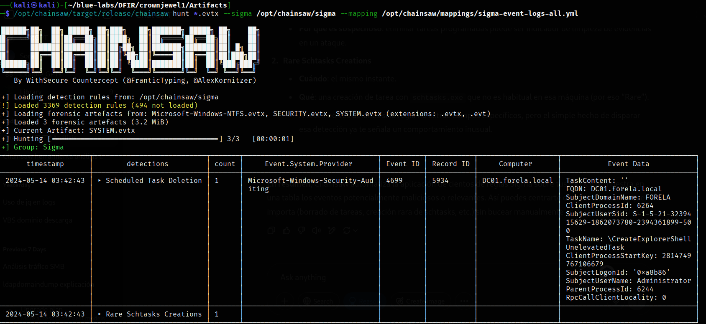
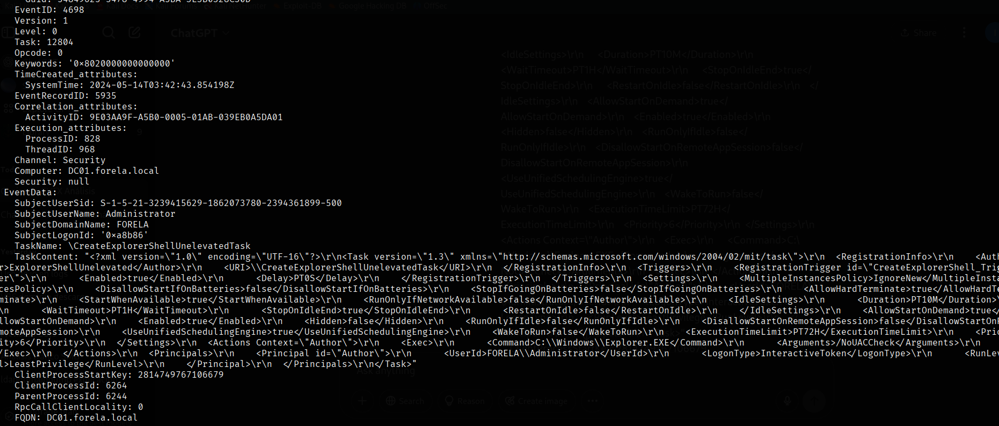

# **Sherlosck - CrownJewel1**

En este laboratorio vamos a analizar ficheros de registro de eventos de Windows(.evtx) para investigar un ataque de `NTDS.dump`, que es bastate común en entornos de Active Directory. 

Se nos proporcionan dos dos directorios para este laboratorio, uno con los ficherso .evtx y otro directorio con un `$MTF`. 

Vamos a utilizar **Chainsaw** para analizar los .evtx. Chainsaw es un motor de “hunting” de código abierto orientado a la detección de comportamientos sospechosos en ficheros de logs (EVTX, JSON, syslog, etc.) que usa reglas Sigma. Es un un CLI escrito en Rust para aplicar de forma masiva y paralela reglas Sigma sobre tus logs, normalizando los campos gracias a mappings (YAML) que traducen la estructura interna de cada formato (EVTX, JSON…) a nombres genéricos entendibles por las reglas.

Sive para: 
- Automatizar la búsqueda de indicadores de compromiso definidos por la comunidad (por ejemplo, borrado de tareas, conexiones inusuales, cambios en privilegios…).
- Reducir el ruido: solo muestra los eventos que “hacen match” con alguna regla de interés.
- Facilitar la integración con pipelines (salida JSON, CSV, table, integrable en scripts, SIEM, etc.).


A continuación detallo el proceso de instalación: 

----
Instalación aquí
----


Una vez instalado Chainsaw podemos ejecutar el siguiente comando: 

```bash 
/opt/chainsaw/target/release/chainsaw hunt *.evtx --sigma /opt/chainsaw/sigma --mapping /opt/chainsaw/mappings/sigma-event-logs-all.yml

```

Donde: 
- hunt” sobre archivos EVTX
  Lee todos los ficheros *.evtx del directorio actual (los logs de Windows exportados) y los procesa en busca de patrones definidos por reglas Sigma.
- Reglas Sigma (--sigma)
  Le indicas la carpeta donde están las reglas Sigma (lenguaje agnóstico para describir detecciones en logs). Cada regla describe “¿qué buscamos?” (por ejemplo, “Scheduled Task Deletion”, “Rare Schtasks Creations”, etc.).
- Mapping (--mapping)
  Le proporcionas un YAML que mapea los campos nativos de los eventos de Windows (event provider, event data, record ID…) a nombres genéricos que usan las Sigma rules. Así Chainsaw sabe dónde encontrar cada dato en el XML binario de los EVTX.

Y podemos ver la siguiente salida: 



Vemos que  se borró la tarea programada `\CreateExplorerShellUnelevatedTask`.

- Fue el usuario Administrator en DC01.forela.local (SubjectUserName y Computer).
- Proceso padre con PID 6244 hizo la llamada (ParentProcessId), y el TaskName coincide.
eliminar tareas programadas puede ser indicador de limpieza de evidencias en un ataque.

Así que aplicamos un filtro en Chainsaw para buscar por el `ParentProcessId` y en el ultimo registro que se ve en la salida vemos lo siguiente: 



<p style="#FFF59D">**Con esto podemos afirmar que se trata de un falso positivo**</p>

La razón: 
<URI>\\CreateExplorerShellUnelevatedTask</URI> dentro de TaskContent, **este XML corresponde a una tarea programada “de fábrica” de Windows**, no a un payload malicioso que alguien haya subido.

1. **Evento 4698 (“Scheduled Task Created”)**  
   - En el segundo registro aparece el contenido completo de la tarea en XML.  
   - Bajo `<RegistrationInfo>` ves `<Author>ExplorerShellUnelevated</Author>` y `<URI>\\CreateExplorerShellUnelevatedTask</URI>`.  
   - Esa tarea es parte del sistema (la usa Explorer para permitir lanzar procesos sin UAC), no es algo que un atacante haya “inyectado” manualmente.

2. **¿Por qué la regla Sigma la disparó?**  
   - La detección “Rare Schtasks Creations” activa en cualquier creación de tarea que no sea habitual en ese host.  
   - Como Chainsaw no distingue entre “tarea de Windows” y “tarea de usuario”, marcó esta creación estándar como “rara”.

3. **Confirmación de benignidad**  
   - El XML monstruoso (con triggers, settings, actions) corresponde exactamente al esquema oficial de Microsoft para esa tarea.  
   - No hay ningún comando extraño ni ruta a un ejecutable externo; simplemente `Explorer.EXE /NoUACCheck`.

Revisado esto, aplicamos el siguiente comando para parsear los ejentos en formato json para que nos resulte màs cómodo para trabajar, podemos hacerlo con el siguiente comando: 

```bash 
┌──(kali㉿kali)-[~/blue-labs/DFIR/crownjewel1/Artifacts]
└─$ /opt/chainsaw/target/release/chainsaw dump *.evtx --json > ../events.json

 ██████╗██╗  ██╗ █████╗ ██╗███╗   ██╗███████╗ █████╗ ██╗    ██╗
██╔════╝██║  ██║██╔══██╗██║████╗  ██║██╔════╝██╔══██╗██║    ██║
██║     ███████║███████║██║██╔██╗ ██║███████╗███████║██║ █╗ ██║
██║     ██╔══██║██╔══██║██║██║╚██╗██║╚════██║██╔══██║██║███╗██║
╚██████╗██║  ██║██║  ██║██║██║ ╚████║███████║██║  ██║╚███╔███╔╝
 ╚═════╝╚═╝  ╚═╝╚═╝  ╚═╝╚═╝╚═╝  ╚═══╝╚══════╝╚═╝  ╚═╝ ╚══╝╚══╝
    By WithSecure Countercept (@FranticTyping, @AlexKornitzer)

[+] Dumping the contents of forensic artefacts from: Microsoft-Windows-NTFS.evtx, SECURITY.evtx, SYSTEM.evtx (extensions: *)
[+] Loaded 3 forensic artefacts (3.2 MiB)
[+] Done
``` 

Con esto ya podemos empezar a aplicar filtros para obtener, por ejemplo, los SystemEventId de cada evento con el poder de bash, usemos el sigiente comando: 

```bash 
```

#### `jq '.[].Event'`
Este es un paso clave. Asume que el JSON tiene esta estructura de **array de objetos**, donde cada objeto tiene una clave `"Event"`, algo así como:
```json
[
  { "Event": { ... } },
  { "Event": { ... } },
  ...
]
```
La expresión `.[].Event`:
- `.` → el objeto raíz (es el array completo).
- `[]` → accede a cada elemento del array uno por uno.
- `.Event` → extrae el valor de la clave `"Event"` de cada objeto del array.

Entonces: **recorre cada evento y se queda solo con la parte del contenido del evento**.

#### `select(.System.Channel == "System")`
Este es un **filtro lógico**.

- `.System.Channel` hace referencia al campo `"Channel"` dentro del subobjeto `"System"` de cada evento.
- `== "System"` indica que **solo quieres aquellos eventos cuyo canal sea `System`** (excluye "Security", "Application", etc.).

### Obtenemos como resultado sólo los eventos que provienen del canal **"System"** de Windows, que suelen estar relacionados a:
- Cambios en servicios (como el `Service Control Manager`).
- Cambios en drivers.
- Errores del sistema operativo.
- Eventos de arranque y apagado, etc.

Podemo usar el siguiente comando para ver todos los canales de eventos que estan presentes en los logs: 
```bash
─$ cat events.json | jq '.[].Event | .System.Channel ' | sort | uniq  
"Microsoft-Windows-Ntfs/Operational"
"Security"
"System"
``` 

Con esto ya estamos listos para pasar a responder las preguntas. 

---
**task 1**

Los atacantes pueden abusar de la utilidad vssadmin para crear *volume shadow snapshots* y luego extraer archivos confidenciales como NTDS.dit para eludir los mecanismos de seguridad. Identifique el momento en el que el servicio Volume Shadow Copy entró en estado de ejecución.

Para esto podemos aplicar el siguiente filtro: 
```bash 
└─$ cat events.json | jq '.[].Event | select(.System.EventID == 7036) | .EventData.param1' | grep -i volume
"Volume Shadow Copy"
``` 

### ¿Qué significa el Event ID 7036?

Este evento es generado por el Service Control Manager (SCM) y se registra cada vez que un servicio cambia de estado (por ejemplo, de "detenido" a "en ejecución" o viceversa).

- Event ID: 7036
- Fuente: Service Control Manager
- Mensaje típico:
  "The <nombre del servicio> service entered the <estado> state."

En este caso:
> "The Volume Shadow Copy service entered the running state."

Ahora ya podemos grepear por el "volume shadow copy" para ver la hora en la que se inició este servicio: 
```bash 
─$ cat events.json | jq '.[].Event | select(.System.EventID == 7036) | select(.EventData.param1 == "Volume Shadow Copy")
pipe quote> '
{
  "System": {
    "Provider_attributes": {
      "Name": "Service Control Manager",
      "Guid": "{555908d1-a6d7-4695-8e1e-26931d2012f4}",
      "EventSourceName": "Service Control Manager"
    },
    "EventID_attributes": {
      "Qualifiers": 16384
    },
    "EventID": 7036,
    "Version": 0,
    "Level": 4,
    "Task": 0,
    "Opcode": 0,
    "Keywords": "0x8080000000000000",
    "TimeCreated_attributes": {
      "SystemTime": "2024-05-14T03:42:16.783105Z"
    },
    "EventRecordID": 2984,
    "Correlation": null,
    "Execution_attributes": {
      "ProcessID": 784,
      "ThreadID": 916
    },
    "Channel": "System",
    "Computer": "DC01.forela.local",
    "Security": null
  },
  "EventData": {
    "param1": "Volume Shadow Copy",
    "param2": "running",
    "Binary": "5600530053002F0034000000"
  }
}
``` 

**También podríamos usar el siguiente comando:**
```bash 
└─$ cat events.json | jq '.[].Event' -c | grep -i shadow | grep -i runn | jq .
```

--- 
**task 2** 

Cuando se crea una snapshot del volume shadow, el servicio Volume shadow copy valida los privilegios utilizando la cuenta de máquina y enumera los grupos de usuarios. Busque los dos grupos de usuarios que consulta el proceso de instantánea de volumen y la cuenta de máquina que lo hizo.

Para buscar esto podemos aplicar el sigiente filtro: 

```bash 
─$ cat events.json | jq '.[].Event | select(.System.EventID == 4799) | select(.EventData.CallerProcessName == "C:\\Windows\\System32\\VSSVC.exe") | .EventData.TargetUserName'| sort  | uniq    
"Administrators"
"Backup Operators"
``` 

*+Filtramos por VSSVC.exe y por el EvetID 4799 porque**

- El Event ID 4799 se produce cuando un proceso del sistema (como VSSVC.exe) enumera los     grupos de seguridad (Security-Enabled Local Group Membership) a los que pertenece un usuario o cuenta de máquina.

- Antes de realizar operaciones sensibles, como crear una instantánea de volumen, el servicio VSS valida los permisos de la cuenta que ejecuta la acción, que puede ser la cuenta de equipo (MACHINE$).

  Durante esta validación:
   - VSS consulta si esa cuenta pertenece a grupos privilegiados como:
      - Administrators
      - Backup Operators
   - Esta consulta genera un evento 4799.

El Event ID 4799 es crucial porque permite identificar cuándo VSS validó los permisos de una cuenta, lo cual es una etapa obligatoria antes de crear una copia de volumen. 

Para obtener el nombre de la cuenta: 

```bash 
─$ cat events.json | jq '.[].Event | select(.System.EventID == 4799) | select(.EventData.CallerProcessName == "C:\\Windows\\System32\\VSSVC.exe") | .EventData.SubjectUserName' | sort | uniq 
"DC01$"
``` 

---
**task 3**

Busque el valor Volume ID/GUID asignado a la instantánea de Shadow copy cuando se montó.

Podemos aplciar el siguiente filtro: 

```bash 
┌──(kali㉿kali)-[~/blue-labs/DFIR/crownjewel1]
└─$ cat events.json | jq '.[].Event | select(.System.EventID == 4799) | select(.EventData.CallerProcessName == "C:\\Windows\\System32\\VSSVC.exe") | .EventData.CallerProcessId ' | sort | uniq | tr -d '"'
0x1190
```

**En eventos como el Event ID 4799, el campo:**
- CallerProcessId: contiene el ID del proceso (PID) que realizó la acción que disparó el evento.
- En este caso, identifica el proceso que consultó los grupos de pertenencia de una cuenta de usuario o de máquina.

Este nùmero lo podemos convertir a decimal con python: 

```bash 
┌──(kali㉿kali)-[~/blue-labs/DFIR/crownjewel1]
└─$ python3
Python 3.13.2 (main, Mar 13 2025, 14:29:07) [GCC 14.2.0] on linux
Type "help", "copyright", "credits" or "license" for more information.
>>> 0x1190
4496
>>> 0x1190
``` 

---
**task 4**

Busque el valor Volume ID/GUID asignado a la instantánea de Shadow copy cuando se montó.

Para esto podemos aplicar el siguiente filtro: 

```bash 
┌──(kali㉿kali)-[~/blue-labs/DFIR/crownjewel1]
└─$ cat events.json| jq '.[].Event.EventData' -c | egrep -i "[a-z0-9]{8}-[a-z0-9]{4}-"| grep -i shadow | jq .VolumeCorrelationId 
"06C4A997-CCA8-11ED-A90F-000C295644F9"
"06C4A997-CCA8-11ED-A90F-000C295644F9"
"06C4A997-CCA8-11ED-A90F-000C295644F9"
"06C4A997-CCA8-11ED-A90F-000C295644F9"
"06C4A997-CCA8-11ED-A90F-000C295644F9"
```
> - egrep -i "[a-z0-9]{8}-[a-z0-9]{4}-": egrep para aplicar expresiones regulares, y filtrar por un patron de GUID

El Volume ID / GUID (VolumeCorrelationId) es un identificador único que referencia una copia de volumen creada por VSS. Es fundamental en análisis forense porque te permite:
- Vincular eventos dispersos relacionados con la misma copia.
- Rastrear el uso y abuso de esa snapshot por parte del atacante.
- Establecer una línea de tiempo clara de lo ocurrido.

---
**task 5**

Identifique la ruta completa de la base de datos NTDS volcada en disco.

Para esto tendremos que analizar el segundo recurso que se nos proporcionò, el $MFT, podemos parsearla con el siguiente comando, podemos cambiar el nombre al fichero para evitar problemas con el simbolo `$`:

```bash 
┌──(kali㉿kali)-[~/…/DFIR/crownjewel1/Artifacts/C]
└─$ ls
'$MFT'
                                                                                            
┌──(kali㉿kali)-[~/…/DFIR/crownjewel1/Artifacts/C]
└─$ mv \$MFT mft.bin
                                                                                            
┌──(kali㉿kali)-[~/…/DFIR/crownjewel1/Artifacts/C]
└─$ /opt/chainsaw/target/release/chainsaw dump mft.bin --json > ../../mft.json 

 ██████╗██╗  ██╗ █████╗ ██╗███╗   ██╗███████╗ █████╗ ██╗    ██╗
██╔════╝██║  ██║██╔══██╗██║████╗  ██║██╔════╝██╔══██╗██║    ██║
██║     ███████║███████║██║██╔██╗ ██║███████╗███████║██║ █╗ ██║
██║     ██╔══██║██╔══██║██║██║╚██╗██║╚════██║██╔══██║██║███╗██║
╚██████╗██║  ██║██║  ██║██║██║ ╚████║███████║██║  ██║╚███╔███╔╝
 ╚═════╝╚═╝  ╚═╝╚═╝  ╚═╝╚═╝╚═╝  ╚═══╝╚══════╝╚═╝  ╚═╝ ╚══╝╚══╝
    By WithSecure Countercept (@FranticTyping, @AlexKornitzer)

[+] Dumping the contents of forensic artefacts from: mft.bin (extensions: *)
[+] Loaded 1 forensic artefacts (100.5 MiB)
[+] Done
``` 
**Con esto ya podemos aplicar el siguiente comando:**

```bash 
┌──(kali㉿kali)-[~/blue-labs/DFIR/crownjewel1]
└─$ cat mft.json | jq .[] -c | grep -i ntds.dit | jq . | grep -i "fullpath" | sort | uniq
  "FullPath": "Users/Administrator/Documents/backup_sync_dc/ntds.dit",
  "FullPath": "Windows/NTDS/ntds.dit",
  "FullPath": "Windows/System32/ntds.dit",
  "FullPath": "Windows/WinSxS/amd64_microsoft-windows-d..rvices-domain-files_31bf3856ad364e35_10.0.20348.1_none_247a0bbe0c66a485/ntds.dit",
  "FullPath": "Windows/WinSxS/amd64_microsoft-windows-d..services-adam-setup_31bf3856ad364e35_10.0.20348.1_none_c594354a472858dc/adamntds.dit",
``` 

La respuesta es Users/Administrator/Documents/backup_sync_dc/ntds.dit, pero veamos por qué: 

Ubicación fuera del sistema:
  - Las rutas como Windows/NTDS/ o System32/ son originales del sistema, no copias hechas por un atacante.
  - Una ruta en Users/Administrator/Documents/ indica que el archivo fue movido o copiado manualmente, lo cual es típico en un dump malicioso.

Nombre del directorio:
  - backup_sync_dc sugiere un intento de ocultar el propósito real del archivo (dump del DC), disfrazándolo como una tarea legítima de respaldo o sincronización.

### ¿Por qué **no** las otras rutas?

### ❌ `Windows/NTDS/ntds.dit`
- Ruta **original** del archivo en el sistema.
- Está bloqueada por el sistema cuando AD está en funcionamiento.

### ❌ `Windows/System32/ntds.dit`
- Posible copia temporal o de sistema, pero **no es un destino típico** para un atacante.

### ❌ Rutas bajo `Windows/WinSxS/`
- Son componentes de sistema, backups automáticos de Windows, o librerías de instalación.
- No indican actividad maliciosa por sí mismas.

---
**task 6**

¿Cuándo se ha creado el nuevo archivo ntds.dit en el disco?

Bien, ya tenemos el nombre de la ruta donde se creó el nuevo **NTDS.dit**, apliquemos el siguiente filtro para ver la fecha de creación: 

```bash 
┌──(kali㉿kali)-[~/blue-labs/DFIR/crownjewel1]
└─$ cat mft.json | jq .[] -c | grep -i ntds.dit | jq . | grep -iB 20 "Users/Administrator/Documents/backup_sync_dc/ntds.dit"
  "EntryId": 97945,
  "Sequence": 6,
  "BaseEntryId": 0,
  "BaseEntrySequence": 0,
  "HardLinkCount": 1,
  "Flags": "ALLOCATED",
  "UsedEntrySize": 344,
  "TotalEntrySize": 1024,
  "FileSize": 16777216,
  "IsADirectory": false,
  "IsDeleted": false,
  "HasAlternateDataStreams": false,
  "StandardInfoFlags": "FILE_ATTRIBUTE_ARCHIVE",
  "StandardInfoLastModified": "2023-03-27T14:02:43.932074Z",
  "StandardInfoLastAccess": "2024-05-14T03:44:22.844960Z",
  "StandardInfoCreated": "2024-05-14T03:44:22.813756Z",
  "FileNameFlags": "FILE_ATTRIBUTE_ARCHIVE",
  "FileNameLastModified": "2024-05-14T03:44:22.813756Z",
  "FileNameLastAccess": "2024-05-14T03:44:22.813756Z",
  "FileNameCreated": "2024-05-14T03:44:22.813756Z",
  "FullPath": "Users/Administrator/Documents/backup_sync_dc/ntds.dit",
``` 

---
**task 7**

Junto con la base de datos NTDS se ha volcado también una *hive registry* . ¿Qué *registry hive* se ha volcado y cuál es su tamaño en bytes?


Una **colmena del registro** (registry hive) es un **archivo que representa una porción del Registro de Windows**. El Registro es una **base de datos jerárquica** que almacena configuraciones y opciones del sistema operativo, de los controladores, servicios, cuentas de usuario, y más.

Cada colmena contiene:
- Una **raíz (root key)** como `HKEY_LOCAL_MACHINE\SYSTEM`,
- Subclaves y valores organizados jerárquicamente,
- Un encabezado y una estructura interna bien definida (binaria).

---

### Archivos físicos de colmenas

En disco, las colmenas existen como archivos. Por ejemplo:

| Clave del Registro                        | Archivo en Disco                                 |
|-------------------------------------------|--------------------------------------------------|
| HKEY_LOCAL_MACHINE\SYSTEM                 | `C:\Windows\System32\config\SYSTEM`              |
| HKEY_LOCAL_MACHINE\SAM                    | `C:\Windows\System32\config\SAM`                 |
| HKEY_LOCAL_MACHINE\SECURITY               | `C:\Windows\System32\config\SECURITY`            |
| HKEY_LOCAL_MACHINE\SOFTWARE               | `C:\Windows\System32\config\SOFTWARE`            |
| HKEY_USERS\.DEFAULT                       | `C:\Windows\System32\config\DEFAULT`             |
| HKEY_CURRENT_USER                         | `C:\Users\username\NTUSER.DAT`                   |

Cada uno de estos archivos **contiene una colmena completa del registro**.

###  ¿Por qué son importantes para un atacante?

En el contexto de un **NTDS.dit dump**, la colmena `SYSTEM` es **crítica** porque:

- Contiene la **clave de arranque (Boot Key)** usada para proteger otros secretos del sistema, incluyendo la **encriptación de los hashes de contraseñas** almacenados en `ntds.dit`.
- Herramientas como `secretsdump.py` de Impacket requieren **ntds.dit + SYSTEM** para poder **descifrar los hashes de contraseña de Active Directory**.

Es decir:
> Sin la colmena SYSTEM, extraer hashes utilizables desde ntds.dit no es posible.

Sabiendo esto, podemoa aplicar el siguietne filtro: 

```bash 
┌──(kali㉿kali)-[~/blue-labs/DFIR/crownjewel1]
└─$ cat mft.json | jq .[] -c | grep -i backup.sync_dc | jq . 
```

Y podremos ver el siguente registro: 
```bash 
{
  "Signature": "FILE",
  "EntryId": 663,
  "Sequence": 4,
  "BaseEntryId": 0,
  "BaseEntrySequence": 0,
  "HardLinkCount": 1,
  "Flags": "ALLOCATED",
  "UsedEntrySize": 336,
  "TotalEntrySize": 1024,
  "FileSize": 17563648,
  "IsADirectory": false,
  "IsDeleted": false,
  "HasAlternateDataStreams": false,
  "StandardInfoFlags": "FILE_ATTRIBUTE_ARCHIVE",
  "StandardInfoLastModified": "2023-03-25T14:40:36.021159Z",
  "StandardInfoLastAccess": "2024-05-14T03:44:42.485735Z",
  "StandardInfoCreated": "2024-05-14T03:44:42.344933Z",
  "FileNameFlags": "FILE_ATTRIBUTE_ARCHIVE",
  "FileNameLastModified": "2024-05-14T03:44:42.344933Z",
  "FileNameLastAccess": "2024-05-14T03:44:42.344933Z",
  "FileNameCreated": "2024-05-14T03:44:42.344933Z",
  "FullPath": "Users/Administrator/Documents/backup_sync_dc/SYSTEM",
  "DataStreams": []
}
``` 

Que claramente hace referencia a la *registry hive* **SYSTEM**
