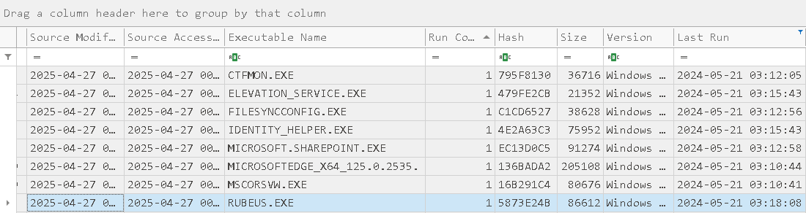

**task 1**

Analizando los registros de seguridad del controlador de dominio, ¿puede confirmar la fecha y hora en que se produjo la actividad de kerberoasting?

Para un primer análisis vamos al fichero con los logs del domain controler, vamos a filtrar por el **`EventID 4769`** -> “A Kerberos service ticket was requested.” que se genera siempre que el Key Distribution Center (KDC) emite un ticket de servicio (TGS) en un controlador de dominio.: 

```bash
┌──(kali㉿kali)-[~/blue-labs/DFIR/campfire1]
└─$ cat  dc_results.jsonl | jq '.Event | select(.System.EventID == 4769)' 
```

veremos varios logs, pero tenemos que excluir aquellas que en el campo `ServiceName` no tengan *krbtgt* o que terminen en $.
- krbtgt es la cuenta de emisión de TGT (Ticket Granting Ticket), no un servicio de aplicación. No aporta al kerberoast, pues kerberoasting ataca tickets de servicios expuestos (SPNs) de cuentas de usuario.
- Las cuentas de equipo siempre acaban en $ (ej. DC01$). Aunque tienen SPN, sus contraseñas se rotan automáticamente y no suelen ser objetivo práctico para kerberoasting. El foco son cuentas de servicio con SPN asociadas a usuarios. 

**Campos clave**

- Subject:Account Name/Domain → Quién lo solicitó.
- Service Name → El SPN del servicio al que se quiere acceder.
- Ticket Encryption Type → Indica el algoritmo de cifrado usado para ese ticket.
- Client Address/Port → Dirección IP/origen de la petición.

Aplicamos el siguiente comando para acotar los resultados: 

```bash 
┌──(kali㉿kali)-[~/blue-labs/DFIR/campfire1]
└─$ cat dc_results.jsonl | jq '.Event | select(.System.EventID == 4769) | select((.EventData.ServiceName != "krbtgt") and (.EventData.ServiceName | endswith("$") | not))'
{
  "System": {
    "Provider_attributes": {
      "Name": "Microsoft-Windows-Security-Auditing",
      "Guid": "54849625-5478-4994-A5BA-3E3B0328C30D"
    },
    "EventID": 4769,
    "Version": 0,
    "Level": 0,
    "Task": 14337,
    "Opcode": 0,
    "Keywords": "0x8020000000000000",
    "TimeCreated_attributes": {
      "SystemTime": "2024-05-21T03:18:09.459682Z"
    },
    "EventRecordID": 6672,
    "Correlation": null,
    "Execution_attributes": {
      "ProcessID": 748,
      "ThreadID": 5376
    },
    "Channel": "Security",
    "Computer": "DC01.forela.local",
    "Security": null
  },
  "EventData": {
    "TargetUserName": "alonzo.spire@FORELA.LOCAL",
    "TargetDomainName": "FORELA.LOCAL",
    "ServiceName": "MSSQLService",
    "ServiceSid": "S-1-5-21-3239415629-1862073780-2394361899-1105",
    "TicketOptions": "0x40800000",
    "TicketEncryptionType": "0x17",
    "IpAddress": "::ffff:172.17.79.129",
    "IpPort": "58107",
    "Status": "0x0",
    "LogonGuid": "59F3B9B1-65ED-A449-5AC0-8EA1F68478EE",
    "TransmittedServices": "-"
  }
}

```

Aqui ya podemos ver que efectivamente tiene el tipo de encriptación en 0x17, el timestamp y el nombre de servicio que nos interesa. 

---
**task 2**

¿Cuál es el nombre del servicio atacado?

Esto podemos encontrarlo en el log proporcionado en la pregunta anterior: 

```json
    "ServiceName": "MSSQLService",    
```


---
**task 3**

Es muy importante identificar la estación de trabajo desde la que se produjo esta actividad. ¿Cuál es la dirección IP de la estación de trabajo?

Esti también lo podemos encontrar en el log de la pregunta 1: 

```json
    "IpAddress": "::ffff:172.17.79.129",
``` 

---
**task 4** 

Ahora que hemos identificado la estación de trabajo, le proporcionamos un triaje que incluye los registros de PowerShell y los archivos Prefetch para obtener información más detallada y poder comprender cómo se produjo esta actividad en el endpoint. ¿Cuál es el nombre del archivo utilizado para Enumerar objetos de Active Directory y posiblemente encontrar cuentas Kerberoastable en la red?

Bien, podemos filtrar primero por el EventID 4001. Este evento se genera cuando PowerShell ejecuta un bloque de script. Es parte del Script Block Logging, una característica de PowerShell para registrar los scripts que se ejecutan, incluso si son maliciosos o estaban ofuscados. 
Es muy útil en forense, porque captura:
- Scripts lanzados manualmente
- Scripts cargados en memoria (sin pasar por el disco)
- Comandos maliciosos, incluso si están ofuscados
- Actividad de malware fileless (sin archivos)

Posteriormente veremos que tenemos una campo llamado `Path` que nos indica la ruta del ejecutable que fue lanzado por terminal: 

```bash 
┌──(kali㉿kali)-[~/blue-labs/DFIR/campfire1]
└─$ cat workstation.jsonl | jq '.Event | select(.System.EventID == 4104) | .EventData.Path'
""
"C:\\Users\\alonzo.spire\\Downloads\\powerview.ps1"
"C:\\Users\\alonzo.spire\\Downloads\\powerview.ps1"
"C:\\Users\\alonzo.spire\\Downloads\\powerview.ps1"
"C:\\Users\\alonzo.spire\\Downloads\\powerview.ps1"
"C:\\Users\\alonzo.spire\\Downloads\\powerview.ps1"
"C:\\Users\\alonzo.spire\\Downloads\\powerview.ps1"
"C:\\Users\\alonzo.spire\\Downloads\\powerview.ps1"
"C:\\Users\\alonzo.spire\\Downloads\\powerview.ps1"
"C:\\Users\\alonzo.spire\\Downloads\\powerview.ps1"
"C:\\Users\\alonzo.spire\\Downloads\\powerview.ps1"
"C:\\Users\\alonzo.spire\\Downloads\\powerview.ps1"
"C:\\Users\\alonzo.spire\\Downloads\\powerview.ps1"
"C:\\Users\\alonzo.spire\\Downloads\\powerview.ps1"
"C:\\Users\\alonzo.spire\\Downloads\\powerview.ps1"
"C:\\Users\\alonzo.spire\\Downloads\\powerview.ps1"
"C:\\Users\\alonzo.spire\\Downloads\\powerview.ps1"
"C:\\Users\\alonzo.spire\\Downloads\\powerview.ps1"
"C:\\Users\\alonzo.spire\\Downloads\\powerview.ps1"
"C:\\Users\\alonzo.spire\\Downloads\\powerview.ps1"
"C:\\Users\\alonzo.spire\\Downloads\\powerview.ps1"
"C:\\Users\\alonzo.spire\\Downloads\\powerview.ps1"
"C:\\Users\\alonzo.spire\\Downloads\\powerview.ps1"
"C:\\Users\\alonzo.spire\\Downloads\\powerview.ps1"
"C:\\Users\\alonzo.spire\\Downloads\\powerview.ps1"
"C:\\Users\\alonzo.spire\\Downloads\\powerview.ps1"
"C:\\Users\\alonzo.spire\\Downloads\\powerview.ps1"
"C:\\Users\\alonzo.spire\\Downloads\\powerview.ps1"
"C:\\Users\\alonzo.spire\\Downloads\\powerview.ps1"
``` 

**PowerView** es un **script de PowerShell** desarrollado por **Will Schroeder (harmj0y)** como parte del proyecto **PowerSploit**.
- Es una **herramienta de post-explotación** que permite **enumerar Active Directory** de manera silenciosa (sin necesidad de usar comandos que generen mucho ruido como `net user`, `dsquery`, etc.).
- Se usa muchísimo en ataques internos, pentests y red team **para mapear la red** después de comprometer una máquina.

Con PowerView se puede:
- **Listar** usuarios, computadoras, grupos, GPOs, dominios, trusts, etc.
- **Buscar cuentas Kerberoasteables** (`Get-DomainUser`, `Get-DomainSPNTicket`, etc.)
- **Identificar delegaciones** (service accounts con permisos especiales)
- **Descubrir admins** locales o de dominio
- **Buscar sesiones activas** en otros equipos
- **Detectar controladores de dominio**
- **Pivotar** más fácilmente en la red

---
**task 5** 


Para esto podemos usar el siguiente comando para fijarnos en el primer timestamp que aparece si filtramos por la ruta de `powerview.ps1`

```bash 
┌──(kali㉿kali)-[~/blue-labs/DFIR/campfire1]
└─$ cat workstation.jsonl | jq '.Event | select(.System.EventID == 4104 and .EventData.Path == "C:\\Users\\alonzo.spire\\Downloads\\powerview.ps1") | .System.TimeCreated_attributes.SystemTime'
"2024-05-21T03:16:32.588340Z"
"2024-05-21T03:16:32.588383Z"
"2024-05-21T03:16:32.588419Z"
"2024-05-21T03:16:32.588444Z"
<SNIP>
``` 

---
**task 6** 


Para esto ya tenemos que pasar el Timeline Explorer, tenemos que aplicar un filtro en `Last Run > Is same day` y ordenar por el conteo de ejecuciones, veremos una bien conocida herramienta de enumeración y post-explotación 



La ruta la podemos encontrar en el campo File Loaded: 

```json
C:\USERS\ALONZO.SPIRE\DOWNLOADS\RUBEUS.EXE
```
**Rubeus** es una **herramienta para atacar Kerberos** en entornos Windows.
- Escrito en **C#** por **@GhostPack** (el mismo grupo detrás de Seatbelt, SharpHound, etc.).
- Funciona como un **"cuchillo suizo" de Kerberos** para pentesters y red teamers.

---

### ¿Qué puede hacer Rubeus?

➡️ **Kerberoasting**:  
- Solicitar tickets de servicio (TGS) y extraer sus hashes para crackear contraseñas offline.

➡️ **AS-REP Roasting**:  
- Atacar cuentas que no requieren preautenticación Kerberos (`Do not require Kerberos preauthentication`).

➡️ **Pass-the-Ticket**:  
- Inyectar tickets Kerberos en memoria para autenticarse como otros usuarios (sin necesidad de contraseña).

➡️ **Ticket Harvesting**:  
- Enumerar y extraer tickets activos en una máquina comprometida.

➡️ **S4U Attacks**:
- Escalar privilegios con `S4U2Self` y `S4U2Proxy`.

➡️ **Golden Ticket / Silver Ticket**:
- Generar e inyectar tickets falsificados para moverse lateralmente.

➡️ **Renewal / Overpass-the-Hash**:
- Renovar tickets existentes o autenticarse usando NTLM hashes.

--- 
**task 7**


¿Cuándo se ejecutó la herramienta para volcar las credenciales?

En la captura mostrada en la pregunta pasada podemos ver que la herramienta se ejecutó 1 segundo antes de que soliitara el TGS para el servicio de MSSQLService.


 
