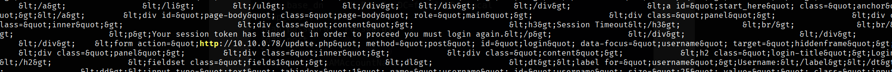

**task 1** 

¿Cuál era el nombre de usuario del contratista externo?

Empecemos explorando la base de datos que nos proporcionan, es probable que ahí esté registrado todo lo que tenga que ver con la aplicación. 

```bash 
sqlite> .tables
phpbb_acl_groups           phpbb_oauth_tokens       
phpbb_acl_options          phpbb_poll_options       
phpbb_acl_roles            phpbb_poll_votes         
phpbb_acl_roles_data       phpbb_posts              
phpbb_acl_users            phpbb_privmsgs           
phpbb_attachments          phpbb_privmsgs_folder    
phpbb_banlist              phpbb_privmsgs_rules     
phpbb_bbcodes              phpbb_privmsgs_to        
phpbb_bookmarks            phpbb_profile_fields     
phpbb_bots                 phpbb_profile_fields_data
phpbb_config               phpbb_profile_fields_lang
phpbb_config_text          phpbb_profile_lang       
phpbb_confirm              phpbb_ranks              
phpbb_disallow             phpbb_reports            
phpbb_drafts               phpbb_reports_reasons    
phpbb_ext                  phpbb_search_results     
phpbb_extension_groups     phpbb_search_wordlist    
phpbb_extensions           phpbb_search_wordmatch   
phpbb_forums               phpbb_sessions           
phpbb_forums_access        phpbb_sessions_keys      
phpbb_forums_track         phpbb_sitelist           
phpbb_forums_watch         phpbb_smilies            
phpbb_groups               phpbb_styles             
phpbb_icons                phpbb_teampage           
phpbb_lang                 phpbb_topics             
phpbb_log                  phpbb_topics_posted      
phpbb_login_attempts       phpbb_topics_track       
phpbb_migrations           phpbb_topics_watch       
phpbb_moderator_cache      phpbb_user_group         
phpbb_modules              phpbb_user_notifications 
phpbb_notification_types   phpbb_users              
phpbb_notifications        phpbb_warnings           
phpbb_oauth_accounts       phpbb_words              
phpbb_oauth_states         phpbb_zebra
```

La tabla de interés es `phpbb_users`, esta es parte de las columnas de la tabla: 

```bash 
sqlite> .headers on 
sqlite> .mode column 
sqlite> PRAGMA table_info(phpbb_users);
cid  name                      type          notnull  dflt_value   pk
---  ------------------------  ------------  -------  -----------  --
0    user_id                   INTEGER       1                     1 
1    user_type                 INTEGER       1        0            0 
2    group_id                  INTEGER       1        3            0 
3    user_permissions          mediumtext    1                     0 
4    user_perm_from            INTEGER       1        0            0 
5    user_ip                   varchar(40)   1        ''           0 
6    user_regdate              INTEGER       1        0            0 
7    username                  varchar(255)  1        ''           0 
8    username_clean            varchar(255)  1        ''           0 
9    user_password             varchar(255)  1        ''           0 
10   user_passchg              INTEGER       1        0            0 
11   user_email                varchar(100)  1        ''           0 
12   user_email_hash           INTEGER       1        0            0 
13   user_birthday             varchar(10)   1        ''           0 
14   user_lastvisit            INTEGER       1        0            0 
15   user_lastmark             INTEGER       1        0            0 
16   user_lastpost_time        INTEGER       1        0            0 
17   user_lastpage             varchar(200)  1        ''           0 
18   user_last_confirm_key     varchar(10)   1        ''           0 
19   user_last_search          INTEGER       1        0            0 
20   user_warnings             INTEGER       1        0            0
<SNIP>
```

Usamos el siguiente comando para ver la información: 

```bash 
sqlite> SELECT user_id, username, user_ip, user_email, user_lastvisit FROM phpbb_users;
user_id  username                   user_ip       user_email                  user_lastvisit
-------  -------------------------  ------------  --------------------------  --------------
1        Anonymous                                                            0             
2        admin                      10.255.254.2  admin@forela.co.uk          1681298759    
3        AdsBot [Google]                                                      0             
4        Alexa [Bot]                                                          0             
5        Alta Vista [Bot]                                                     0             
6        Ask Jeeves [Bot]                                                     0             
7        Baidu [Spider]                                                       0             
8        Bing [Bot]                                                           0             
9        Exabot [Bot]                                                         0             
10       FAST Enterprise [Crawler]                                            0             
11       FAST WebCrawler [Crawler]                                            0             
12       Francis [Bot]                                                        0             
13       Gigabot [Bot]                                                        0             
14       Google Adsense [Bot]                                                 0             
15       Google Desktop                                                       0             
16       Google Feedfetcher                                                   0             
17       Google [Bot]                                                         0             
18       Heise IT-Markt [Crawler]                                             0             
19       Heritrix [Crawler]                                                   0             
20       IBM Research [Bot]                                                   0             
21       ICCrawler - ICjobs                                                   0             
22       ichiro [Crawler]                                                     0             
23       Majestic-12 [Bot]                                                    0             
24       Metager [Bot]                                                        0             
25       MSN NewsBlogs                                                        0             
26       MSN [Bot]                                                            0             
27       MSNbot Media                                                         0             
28       Nutch [Bot]                                                          0             
29       Online link [Validator]                                              0             
30       psbot [Picsearch]                                                    0             
31       Sensis [Crawler]                                                     0             
32       SEO Crawler                                                          0             
33       Seoma [Crawler]                                                      0             
34       SEOSearch [Crawler]                                                  0             
35       Snappy [Bot]                                                         0             
36       Steeler [Crawler]                                                    0             
37       Telekom [Bot]                                                        0             
38       TurnitinBot [Bot]                                                    0             
39       Voyager [Bot]                                                        0             
40       W3 [Sitesearch]                                                      0             
41       W3C [Linkcheck]                                                      0             
42       W3C [Validator]                                                      0             
43       YaCy [Bot]                                                           0             
44       Yahoo MMCrawler [Bot]                                                0             
45       Yahoo Slurp [Bot]                                                    0             
46       Yahoo [Bot]                                                          0             
47       YahooSeeker [Bot]                                                    0             
48       phpbb-admin                10.255.254.2  phpbb-admin@mailinator.com  1682506869    
49       test                       10.255.254.2                              1681298949    
50       rsavage001                 10.255.254.2                              1681833634    
51       apoole                     10.10.0.78    apoole@contractor.net       0             
52       apoole1                    10.10.0.78    apoole1@contractor.net      1682425447 
```

Parece que **`apoole1`** es nuestro hombre, pues es el único que ha estado activo en el sitio. 

---
**task 2**

¿Qué dirección IP utilizó el contratista para crear su cuenta?

Por la información en la tabla, la ip es la **`10.10.0.78`**

---
**task 3** 

¿Cuál es el post_id del post malicioso que hizo el contratista?

Bien, ya tenemos el usuario, el ID, la ip, el correo, vamos a relacionar esto con la tabla `phpbb_posts`: 

```bash 
sqlite> PRAGMA table_info(phpbb_posts);
cid  name                type          notnull  dflt_value  pk
---  ------------------  ------------  -------  ----------  --
0    post_id             INTEGER       1                    1 
1    topic_id            INTEGER       1        0           0 
2    forum_id            INTEGER       1        0           0 
3    poster_id           INTEGER       1        0           0 
4    icon_id             INTEGER       1        0           0 
5    poster_ip           varchar(40)   1        ''          0 
6    post_time           INTEGER       1        0           0 
7    post_reported       INTEGER       1        0           0 
8    enable_bbcode       INTEGER       1        1           0 
9    enable_smilies      INTEGER       1        1           0 
10   enable_magic_url    INTEGER       1        1           0 
11   enable_sig          INTEGER       1        1           0 
12   post_username       varchar(255)  1        ''          0 
13   post_subject        varchar(255)  1        ''          0 
14   post_text           mediumtext    1                    0 
15   post_checksum       varchar(32)   1        ''          0 
16   post_attachment     INTEGER       1        0           0 
17   bbcode_bitfield     varchar(255)  1        ''          0 
18   bbcode_uid          varchar(8)    1        ''          0 
19   post_postcount      INTEGER       1        1           0 
20   post_edit_time      INTEGER       1        0           0 
21   post_edit_reason    varchar(255)  1        ''          0 
22   post_edit_user      INTEGER       1        0           0 
23   post_edit_count     INTEGER       1        0           0 
24   post_edit_locked    INTEGER       1        0           0 
25   post_visibility     INTEGER       1        0           0 
26   post_delete_time    INTEGER       1        0           0 
27   post_delete_reason  varchar(255)  1        ''          0 
28   post_delete_user    INTEGER       1        0           0
```

```bash 
sqlite> SELECT post_id, post_time, poster_ip, post_username FROM phpbb_posts;
post_id  post_time   poster_ip     post_username
-------  ----------  ------------  -------------
1        1681296980  10.255.254.2               
2        1681832510  10.255.254.2               
9        1682425042  10.10.0.78   
```

El post **`9`** es tiene la misma ip que `apoole1`. 

---
**task 4** 

¿Cuál es el URI completo al que el ladrón de credenciales envía sus datos?

Bien, podemos encontrar esto en el campo `post_text` del post con id 9, podemos guardar el contenido para analizarlo después con lo siguiente: 

```bash 
sqlite> .headers off
sqlite> .mode plain
sqlite> .output post.txt
sqlite> SELECT post_text FROM phpbb_posts WHERE post_id = 9;
sqlite> .output stdout
```

Esto nos guada el contenido en el fichero post.txt, si filtramos desde el comando `less` por cadenas tìpicas de una URL podemos encontrar esto: 



El atacante se mandaba las credenciales a si mismo. 

---
**task 5**

¿Cuándo entró el contratista en el foro como administrador? (UTC)

Ya sabemos que el atacante creó lo que parece ser un panel de login, lo más probable es que el administrador accederia al panel falso e ingresara sus contraseñas, el atacante las obtuvo y pudo acceder al sistema. 
Analicemos la tabla para ver cuando el atacante accedió como administrador.

```bash 
sqlite> SELECT log_ip, log_time, log_operation, log_data FROM phpbb_log  WHERE log_ip == "10.10.0.78"; 
log_ip      log_time    log_operation           log_data                                         
----------  ----------  ----------------------  -------------------------------------------------
10.10.0.78  1682506392  LOG_ADMIN_AUTH_SUCCESS                                                   
10.10.0.78  1682506431  LOG_USERS_ADDED         a:2:{i:0;s:14:"Administrators";i:1;s:6:"apoole";}
10.10.0.78  1682506471  LOG_DB_BACKUP 
```

Con esto confirmamos el acceso, en el campo `log_operation`, vemos un registro de `LOG_ADMIN_AUTH_SUCCES` de la ip del atacante. 

Convertimos el tiempo a un formato que podamos leer, pues es un formato epoch, que representa la cantidad de segundos desde el 1 de enero de 1970 (UTC).
Lo podemos hacer con sql de la siguiente manera: 

```bash 
sqlite> SELECT datetime(1682506392, 'unixepoch');
datetime(1682506392, 'unixepoch')
---------------------------------
2023-04-26 10:53:12 
```

Podemos indicarlo desde sql incluso: 

```sql 
sqlite> SELECT log_ip, datetime(log_time, 'unixepoch'), log_operation, log_data FROM phpbb_log  WHERE log_ip == "10.10.0.78"; 
log_ip      datetime(log_time, 'unixepoch')  log_operation           log_data                                         
----------  -------------------------------  ----------------------  -------------------------------------------------
10.10.0.78  2023-04-26 10:53:12              LOG_ADMIN_AUTH_SUCCESS                                                   
10.10.0.78  2023-04-26 10:53:51              LOG_USERS_ADDED         a:2:{i:0;s:14:"Administrators";i:1;s:6:"apoole";}
10.10.0.78  2023-04-26 10:54:31              LOG_DB_BACKUP  
```

O desde la terminal:

```bash 
┌──(kali㉿kali)-[~/blue-labs/DFIR]
└─$ date -u -d @1682506392
Wed Apr 26 10:53:12 AM UTC 2023
```

---
**task 6** 

En el foro hay credenciales en texto plano para la conexión LDAP, ¿cuál es la contraseña?

Esto finalmente podemos encontrarlo en la tabla phpbb_config: 


---
**task 7**

¿Cuál es el agente de usuario del usuario Administrador?

Ya conocemos la ip del administrador: "10.255.254.2", podemos filtrar por esta ip en el fichero access.log: 

```bash 
┌──(kali㉿kali)-[~/blue-labs/DFIR]
└─$ grep "10\.255\.254\.2" access.log | head -n 5 
10.255.254.2 - - [25/Apr/2023:12:08:42 +0100] "GET /adm/index.php?sid=ac1490e6c806ac0403c6c116c1d15fa6&i=12 HTTP/1.1" 403 9412 "http://10.10.0.27/adm/index.php?sid=ac1490e6c806ac0403c6c116c1d15fa6&i=1" "Mozilla/5.0 (Macintosh; Intel Mac OS X 10_15_7) AppleWebKit/537.36 (KHTML, like Gecko) Chrome/112.0.0.0 Safari/537.36"
10.255.254.2 - - [25/Apr/2023:12:08:42 +0100] "GET /app.php/feed?sid=09806b0063764bf3f30292abbad0801f HTTP/1.1" 200 1725 "-" "Mozilla/5.0 (Macintosh; Intel Mac OS X 10_15_7) AppleWebKit/537.36 (KHTML, like Gecko) Chrome/112.0.0.0 Safari/537.36"
10.255.254.2 - - [25/Apr/2023:12:08:42 +0100] "GET /app.php/feed/topics?sid=09806b0063764bf3f30292abbad0801f HTTP/1.1" 200 1758 "-" "Mozilla/5.0 (Macintosh; Intel Mac OS X 10_15_7) AppleWebKit/537.36 (KHTML, like Gecko) Chrome/112.0.0.0 Safari/537.36"
10.255.254.2 - - [25/Apr/2023:12:08:43 +0100] "GET /ucp.php?mode=login&sid=09806b0063764bf3f30292abbad0801f HTTP/1.1" 200 3436 "http://10.10.0.27/adm/index.php?sid=ac1490e6c806ac0403c6c116c1d15fa6&i=12" "Mozilla/5.0 (Macintosh; Intel Mac OS X 10_15_7) AppleWebKit/537.36 (KHTML, like Gecko) Chrome/112.0.0.0 Safari/537.36"
10.255.254.2 - - [25/Apr/2023:12:08:43 +0100] "GET /app.php/feed/topics?sid=09806b0063764bf3f30292abbad0801f HTTP/1.1" 200 1757 "-" "Mozilla/5.0 (Macintosh; Intel Mac OS X 10_15_7) AppleWebKit/537.36 (KHTML, like Gecko) Chrome/112.0.0.0 Safari/537.36"
```

---
**task 8** 

¿A qué hora se añadió el contratista al grupo de administradores? (UTC) 

Anteriormente ya vimos los logs relacionados con la ip del atacante: 

```bash
sqlite> SELECT datetime(log_time, "unixepoch"), log_operation, log_data FROM phpbb_log WHERE log_ip == "10.10.0.78"; 
datetime(log_time, "unixepoch")  log_operation           log_data                                         
-------------------------------  ----------------------  -------------------------------------------------
2023-04-26 10:53:12              LOG_ADMIN_AUTH_SUCCESS                                                   
2023-04-26 10:53:51              LOG_USERS_ADDED         a:2:{i:0;s:14:"Administrators";i:1;s:6:"apoole";}
2023-04-26 10:54:31              LOG_DB_BACKUP
```
Vemos que el usuario `apoole1` se agregó al grupo de administradores.

---
**task 9**

¿A qué hora descargó el contratista la copia de seguridad de la base de datos? (UTC)

Si seguinos revisando los logs, vemos que hubo una realización de un backup: 

```bash 
sqlite> SELECT datetime(log_time, "unixepoch"), log_operation, log_data FROM phpbb_log; 
datetime(log_time, "unixepoch")  log_operation               log_data                                                    
-------------------------------  --------------------------  ------------------------------------------------------------
2023-04-24 16:10:16              LOG_CLEAR_ADMIN                                                                         

2023-04-24 16:17:18              LOG_CONFIG_REGISTRATION                                                                 

2023-04-24 16:19:26              LOG_ACL_ADD_FORUM_LOCAL_F_  a:2:{i:0;s:7:"Welcome";i:1;s:41:"<span class="sep">Registere
                                                             d users</span>";}                                           

2023-04-25 11:09:07              LOG_ADMIN_AUTH_SUCCESS                                                                  

2023-04-25 11:09:20              LOG_USER_NEW_PASSWORD       a:1:{i:0;s:6:"apoole";}                                     

2023-04-25 11:09:22              LOG_USER_USER_UPDATE        a:1:{i:0;s:6:"apoole";}                                     

2023-04-25 11:09:23              LOG_USER_USER_UPDATE        a:1:{i:0;s:6:"apoole";}                                     

2023-04-25 11:46:07              LOG_EXT_ENABLE              a:1:{i:0;s:13:"rokx/dborldap";}                             

2023-04-25 11:47:31              LOG_CONFIG_AUTH                                                                         

2023-04-25 11:48:06              LOG_USER_NEW_PASSWORD       a:1:{i:0;s:6:"apoole";}                                     

2023-04-25 11:48:06              LOG_USER_USER_UPDATE        a:1:{i:0;s:6:"apoole";}                                     

2023-04-25 12:13:56              LOG_CONFIG_AUTH                                                                         

2023-04-26 10:53:12              LOG_ADMIN_AUTH_SUCCESS                                                                  

2023-04-26 10:53:51              LOG_USERS_ADDED             a:2:{i:0;s:14:"Administrators";i:1;s:6:"apoole";}           

2023-04-26 10:54:31              LOG_DB_BACKUP
```

Revisamos los logs en `accesss.log`: 

```bash 
┌──(kali㉿kali)-[~/blue-labs/DFIR]
└─$ grep "10\.10\.0\.78" access.log | grep -i "backup" | grep -i "get"
10.10.0.78 - - [26/Apr/2023:11:54:17 +0100] "GET /adm/index.php?sid=eca30c1b75dc3eed1720423aa1ff9577&i=acp_database&mode=backup HTTP/1.1" 200 3768 "http://10.10.0.27/adm/index.php?sid=eca30c1b75dc3eed1720423aa1ff9577&i=25" "Mozilla/5.0 (Windows NT 10.0; Win64; x64; rv:109.0) Gecko/20100101 Firefox/112.0"
10.10.0.78 - - [26/Apr/2023:11:54:24 +0100] "GET /adm/index.php?i=acp_database&sid=eca30c1b75dc3eed1720423aa1ff9577&mode=backup HTTP/1.1" 200 3771 "http://10.10.0.27/adm/index.php?i=acp_database&sid=eca30c1b75dc3eed1720423aa1ff9577&mode=backup&action=download" "Mozilla/5.0 (Windows NT 10.0; Win64; x64; rv:109.0) Gecko/20100101 Firefox/112.0"
10.10.0.78 - - [26/Apr/2023:11:56:28 +0100] "GET /adm/index.php?i=acp_database&sid=eca30c1b75dc3eed1720423aa1ff9577&mode=backup HTTP/1.1" 200 3770 "http://10.10.0.27/adm/index.php?i=acp_database&sid=eca30c1b75dc3eed1720423aa1ff9577&mode=backup&action=download" "Mozilla/5.0 (Windows NT 10.0; Win64; x64; rv:109.0) Gecko/20100101 Firefox/112.0"
10.10.0.78 - - [26/Apr/2023:11:56:32 +0100] "GET /adm/index.php?sid=eca30c1b75dc3eed1720423aa1ff9577&i=acp_database&mode=restore HTTP/1.1" 200 3100 "http://10.10.0.27/adm/index.php?i=acp_database&sid=eca30c1b75dc3eed1720423aa1ff9577&mode=backup" "Mozilla/5.0 (Windows NT 10.0; Win64; x64; rv:109.0) Gecko/20100101 Firefox/112.0"
10.10.0.78 - - [26/Apr/2023:11:57:07 +0100] "GET /adm/index.php?sid=eca30c1b75dc3eed1720423aa1ff9577&i=acp_database&mode=backup HTTP/1.1" 200 3770 "http://10.10.0.27/adm/index.php?sid=eca30c1b75dc3eed1720423aa1ff9577&i=acp_logs&mode=admin" "Mozilla/5.0 (Windows NT 10.0; Win64; x64; rv:109.0) Gecko/20100101 Firefox/112.0"
10.10.0.78 - - [26/Apr/2023:11:57:36 +0100] "GET /adm/index.php?sid=eca30c1b75dc3eed1720423aa1ff9577&i=21 HTTP/1.1" 200 3431 "http://10.10.0.27/adm/index.php?sid=eca30c1b75dc3eed1720423aa1ff9577&i=acp_database&mode=backup" "Mozilla/5.0 (Windows NT 10.0; Win64; x64; rv:109.0) Gecko/20100101 Firefox/112.0"
10.10.0.78 - - [26/Apr/2023:12:01:09 +0100] "GET /adm/index.php?sid=eca30c1b75dc3eed1720423aa1ff9577&i=acp_database&mode=backup HTTP/1.1" 200 3770 "http://10.10.0.27/adm/index.php?sid=eca30c1b75dc3eed1720423aa1ff9577&i=25" "Mozilla/5.0 (Windows NT 10.0; Win64; x64; rv:109.0) Gecko/20100101 Firefox/112.0"
10.10.0.78 - - [26/Apr/2023:12:01:38 +0100] "GET /store/backup_1682506471_dcsr71p7fyijoyq8.sql.gz HTTP/1.1" 200 34707 "-" "Mozilla/5.0 (Windows NT 10.0; Win64; x64; rv:109.0) Gecko/20100101 Firefox/112.0"
10.10.0.78 - - [26/Apr/2023:12:01:52 +0100] "GET /ucp.php?mode=logout&sid=eca30c1b75dc3eed1720423aa1ff9577 HTTP/1.1" 302 949 "http://10.10.0.27/adm/index.php?sid=eca30c1b75dc3eed1720423aa1ff9577&i=acp_database&mode=backup" "Mozilla/5.0 (Windows NT 10.0; Win64; x64; rv:109.0) Gecko/20100101 Firefox/112.0"
10.10.0.78 - - [26/Apr/2023:12:01:53 +0100] "GET /index.php?sid=be3cc6e2de08bafa4044f552813e2cbe HTTP/1.1" 200 3796 "http://10.10.0.27/adm/index.php?sid=eca30c1b75dc3eed1720423aa1ff9577&i=acp_database&mode=backup" "Mozilla/5.0 (Windows NT 10.0; Win64; x64; rv:109.0) Gecko/20100101 Firefox/112.0"
```

Vemos que el primer intento fue a las `26/Apr/2023:12:01:38 +0100` para obtener el backup en la ruta `/store`, la hora está adelantada al tiempo UTC, le restamos uno y obtenemos el timestamp correecto.

| Zona horaria | Acción para convertir a UTC |
|--------------|------------------------------|
| `+HHMM`      | Resta `HHMM`                 |
| `-HHMM`      | Suma `HHMM`                  |

----
**task 10**

¿Cuál era el tamaño en bytes de la copia de seguridad de la base de datos tal y como se indica en access.log?

En la misma linea podemos ver el tamaño de la descarga: 

```bash 
10.10.0.78 - - [26/Apr/2023:12:01:38 +0100] "GET /store/backup_1682506471_dcsr71p7fyijoyq8.sql.gz HTTP/1.1" 200 34707 "-" "Mozilla/5.0 (Windows NT 10.0; Win64; x64; rv:109.0) Gecko/20100101 Firefox/112.0"
```

`34707`


