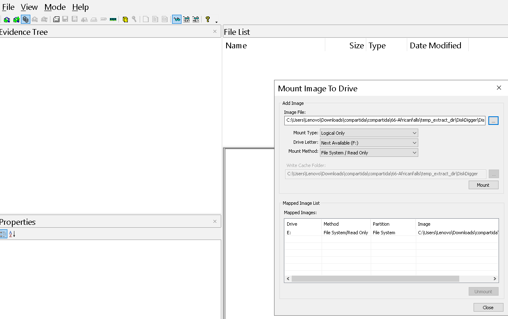
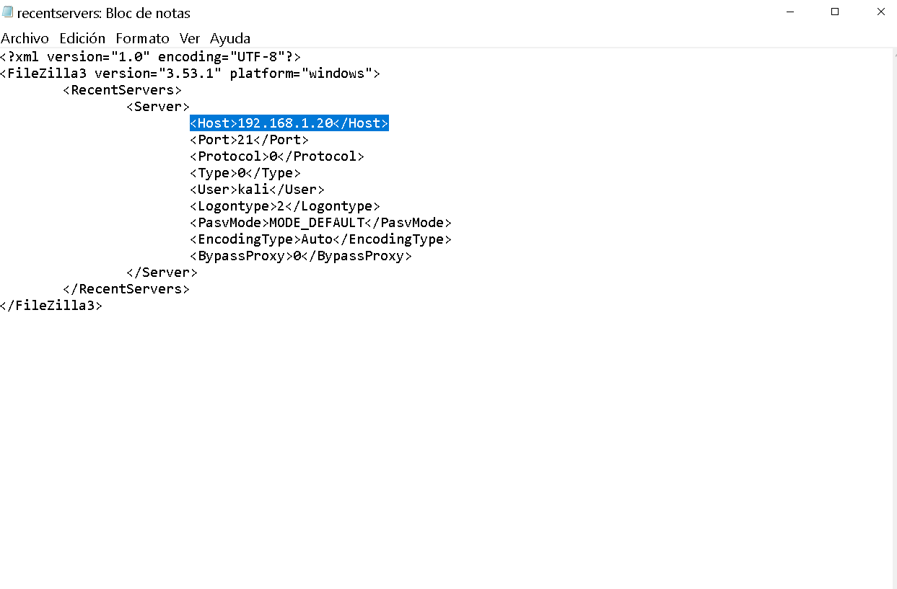
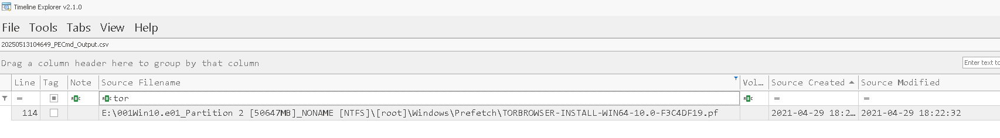
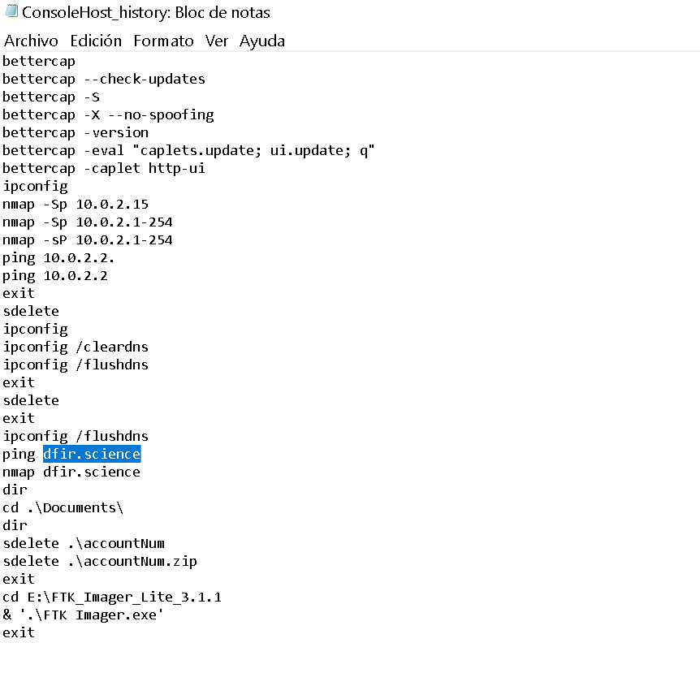
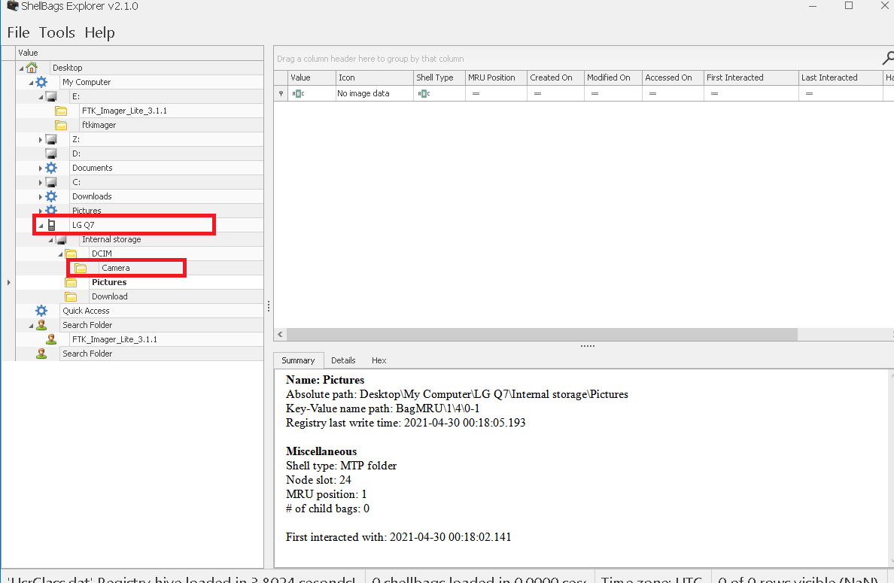
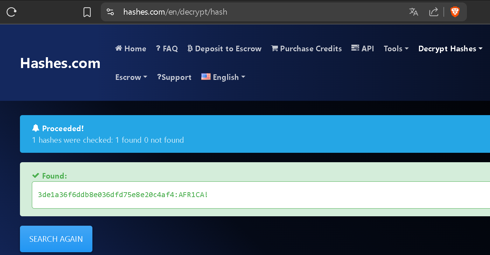
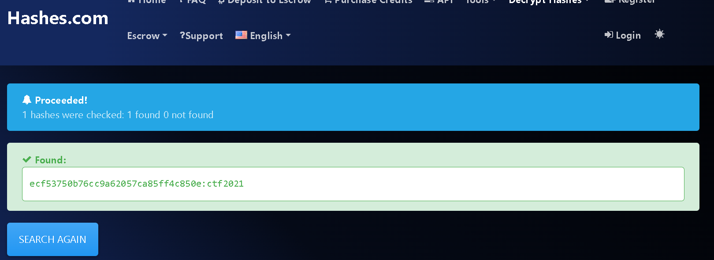

Se le acusa a John Doe, un usuario dentro de la organización, de realizar actividades ilegales dentro de ésta, se tomó una imagen .ad1 de su laptop, nuestro trabajo como analista SOC es analizar la imgen para entender qué fue lo que pasó.

Se nos proporciona un fichero `.ad1`, la vamos a montar con FTK Imager. 



Con esto ya podemos exporar el disco desde nuestra pc.

---
<h3 style="color: #0d6efd;">Q1. ¿Cuál es el valor hash MD5 del disco sospechoso?</h3>

Esto es importante para mantener la integridad de las pruebas forenses. 
Se nos proporcionan un fichero `.txt` que contiene información general de nuestra imagen. 

```bash
[Computed Hashes]
 MD5 checksum:    9471e69c95d8909ae60ddff30d50ffa1
 SHA1 checksum:   167aa08db25dfeeb876b0176ddc329a3d9f2803a
```

---
<h3 style="color: #0d6efd;"> </h3>

Para esto podemos explorar la sigiente ruta para encontrar el fichero de historia de búsqueda, cache y otra información sobre la actividad del usuario. 

```bash
E:\001Win10.e01_Partition 2 [50647MB]_NONAME [NTFS]\[root]\Users\John Doe\AppData\Local\Google\Chrome\User Data\Default\
```

```bash
┌──(kali㉿kali)-[~/blue-labs/africanfalls/temp_extract_dir/DiskDigger]
└─$ file history
history: SQLite 3.x database, last written using SQLite version 3034000, file counter 18, database pages 44, cookie 0x16, schema 4, UTF-8, version-valid-for 18
```

Es un fichero sqlite, que podemos navegar usando la terminal: 
```bash
┌──(kali㉿kali)-[~/blue-labs/africanfalls/temp_extract_dir/DiskDigger]
└─$ sqlite3 history

sqlite> .headers on
sqlite> .mode column
```

Explorando las tablas con comando como `.tables` y `.schema urls`, es en esta tabla en donde encontramos el historial de las urls visitaas, se nos da un timestamp para buscar, pero el timestamp que vemos en la tabla viene en un formato diferente. 
```bash
sqlite> SELECT * FROM urls LIMIT 1;
id  url                       title        visit_count  typed_count  last_visit_time    hidden
--  ------------------------  -----------  -----------  -----------  -----------------  ------
1   https://news.google.com/  Google News  1            0            13263849947125695  0
```

Este formato es almacenados en el formato de Chrome’s Webkit time format, que representa el número de microsegundos desde el 1 de enero de 1601 (UTC).
Podemos reconvertir esta fecha desde nuestra query en SQLite: 
```bash
sqlite> SELECT id, url, title, visit_count, datetime(last_visit_time / 1000000 - 11644473600, 'unixepoch') AS visit_time_utc FROM urls WHERE datetime(last_visit_time / 1000000 - 11644473600, 'unixepoch') = '2021-04-29 18:17:38';
id  url                                                           title                                    visit_count  visit_time_utc
--  ------------------------------------------------------------  ---------------------------------------  -----------  -------------------
88  https://www.google.com/search?q=password+cracking+lists&rlz=  password cracking lists - Google Search  2            2021-04-29 18:17:38
    1C1VDKB_enUS951US951&ei=CPiKYNSlKsu0tQaZo43IAg&oq=password+c
    racking+lists&gs_lcp=Cgdnd3Mtd2l6EAMyAggAMgYIABAWEB4yBggAEBY
    QHjIGCAAQFhAeMgYIABAWEB46CAgAEJECEIsDOgQIABBDOggIABCxAxCDATo
    CCC46BQguELEDOgUIABCxAzoHCAAQsQMQCjoHCAAQQxCLAzoFCAAQiwM6Cgg
    uELEDEEMQiwM6CwgAELEDEJECEIsDOgcIABCxAxBDOgIIKToICC4QxwEQowI
    6CwguELEDEMcBEKMCUNmFA1j0sANgv7IDaAVwAXgCgAGbBogB5TKSAQ0wLjI
    uNi40LjIuMy4xmAEAoAEBqgEHZ3dzLXdperABCrgBAsABAQ&sclient=gws-
    wiz&ved=0ahUKEwjUycr5h6TwAhVLWs0KHZlRAykQ4dUDCA4&uact=5
```

Tambien podemos usar [DCode](https://www.digital-detective.net/dcode/) para convertir formatos de fechas. 

---
<h3 style="color: #0d6efd;">Q3. ¿Cuál es la dirección IPv4 del servidor FTP al que se conectó el sospechoso?</h3>

Para esto podemos irnos al directorio: 
```bash
\Users\John Doe\AppData\Roaming\FileZilla
```
Que es el directorio de datos «roaming» de FileZilla, es decir, donde el cliente FTP FileZilla guarda toda la configuración y el estado de usuario, vemos varios ficheros: 


- sitemanager.xml: los servidores guardados (Site Manager) con credenciales, rutas remotas, etc.
- recentservers.xml: listado de los últimos servidores a los que el usuario se ha conectado.
- filezilla.xml (o similar): ajustes generales de la aplicación (interfaz, comportamiento, atajos).
- queue.xml: la cola de transferencia si se cerró FileZilla con descargas pendientes.
- logs/: (si está activado) subcarpeta con los registros de sesiones FTP.
- bookmarks.xml: marcadores de carpetas remotas locales que haya guardado el usuario.

La dirección IPv4 que buscó el sospechoso se anota en recentservers.xml, dentro del elemento <Host>



---
<h3 style="color: #0d6efd;">Q4. ¿En qué fecha y hora se borró una lista de contraseñas en UTC? (AAAA-MM-DD HH:MM:SS UTC)</h3>

Para esto podemos inspeccionar la **Papelera de Reciclaje de Windows** (directorio `E:\001Win10.e01_Partition 2 [50647MB]_NONAME [NTFS]\[root]\$Recycle.Bin`), que en versiones Vista en adelante ya **no usa** un único archivo INFO2, sino que genera por cada fichero eliminado dos archivos:

* **\$R…**
  Contiene los datos reales del fichero eliminado (renombrado con `$R` + identificador).

* **\$I…**
  Un archivo binario que almacena la **metainformación** del borrado:

  1. Versión de formato (8 bytes)
  2. Tamaño original en bytes (8 bytes)
  3. Timestamp de borrado en formato Windows FILETIME (8 bytes)
  4. Longitud de la ruta original (4 bytes)
  5. Ruta original en UTF-16 (n bytes)

Al inspeccionar `C:\$Recycle.Bin\S-<SID>\`, se pueden encontrar muchos pares `$R…` / `$I…`. Aunque el contenido real (`$R`) puede estar oculto, el `$I` permite:
* Reconstruir el **nombre** y **ruta** original.
* Obtener la **fecha y hora exacta** de eliminación (FILETIME).

Si analizamos la ruta `E:\001Win10.e01_Partition 2 [50647MB]_NONAME [NTFS]\[root]\$Recycle.Bin\S-1-5-21-3061953532-2461696977-1363062292-1001` podemos ver varios fichers que indica que ahí hubo algún fichero con contraseñas. 

Para esto vamos a usar [rifiuti2](https://abelcheung.github.io/rifiuti2/), que es la versión de línea de comandos de la utilidad **Rifiuti2** especializada en formatos Vista y posteriores.
* **Parsear** automáticamente todos los `$I…` de un directorio de Recycle Bin.
* Extraer para cada fichero: nombre original, ruta, tamaño y timestamp de borrado.
* Obtener la salida en texto tabulado o en formato XML listo para procesar.

Nos la descargamos, descomprimimos y podemos analizar: 

```bash
PS C:\Users\Lenovo\Downloads\compartida\rifiuti2-0.8.2-win64\rifiuti2-0.8.2-win64> .\rifiuti-vista.exe -f xml -o resultados.xml C:\Users\Lenovo\Downloads\compartida\compartida\africanfalls_docs\S-1-5-21-3061953532-2461696977-1363062292-1001

PS C:\Users\Lenovo\Downloads\compartida\rifiuti2-0.8.2-win64\rifiuti2-0.8.2-win64> type .\resultados.xml
<?xml version="1.0" encoding="UTF-8"?>
<recyclebin format="dir" version="2">
  <filename><![CDATA[C:\Users\Lenovo\Downloads\compartida\compartida\africanfalls_docs\S-1-5-21-3061953532-2461696977-1363062292-1001]]></filename>
  <record index="$IW9BJ2Z.txt" time="2021-04-29T18:22:17Z" gone="false" size="754">
    <path><![CDATA[C:\Users\John Doe\Downloads\10-million-password-list-top-100.txt]]></path>
  </record>
</recyclebin>
```

> También podemos hacer que la salida sea en .txt "C:\Users\Lenovo\Downloads\compartida\rifiuti2-0.8.2-win64\rifiuti2-0.8.2-win64> .\rifiuti-vista.exe -n -o C:\Users\Lenovo\Downloads\compartida\compartida\africanfalls_docs\S-1-5-21-3061953532-2461696977-1363062292-1001 > resultados.txt" 

---
<h3 style="color: #0d6efd;">Q4. ¿En qué fecha y hora se borró una lista de contraseñas en UTC? (AAAA-MM-DD HH:MM:SS UTC)</h3>

Para esto podemos usar el directorio `prefetch`, que ya conocemos. 
Su objetivo es acelerar el arranque de aplicaciones que se ejecutan con frecuencia.

Cuando se ejecuta por primera vez un programa, Windows:
- Crea un archivo .pf en C:\Windows\Prefetch
- Guarda datos sobre el ejecutable: nombre, ruta, frecuencia de uso, y hora de la última ejecución

Parseamos usando la herramienta de Eric Zimmerman `PECmd.exe`: 
```bash
PS C:\Users\Lenovo\Downloads\compartida\PECmd> .\PECmd.exe -d "E:\001Win10.e01_Partition 2 [50647MB]_NONAME [NTFS]\[root]\Windows\Prefetch" --csv resultados.csv
```

Abrimos con Timeline Explorer, otra herramietna de Zimmerman y podemos ver lo siguiente: 



---
<h3 style="color: #0d6efd;">Q5. ¿Cuántas veces se ejecutó el Navegador Tor en el ordenador del sospechoso? (sólo número)</h3>

Vemos solo el ejecutable que descarga `Tor`, pero en ningún momento se inicia el ejecutable para abrir este navegador. 

---
<h3 style="color: #0d6efd;">Q6. ¿Cuál es la dirección de correo electrónico del sospechoso?</h3>

Para esto guardé el contenido de la tabla urls, en la que ya había visto alguna referencia a algun correo. 

```bash
sqlite> .output urls.txt
sqlite> SELECT * FROM urls;
sqlite> .output stdout
```

Y aplicando un filtro con grep: 
bash
```bash
┌──(kali㉿kali)-[~/blue-labs/africanfalls/temp_extract_dir/DiskDigger]
└─$ grep -i "\@" urls.txt
108  https://mail.protonmail.com/inbox                             Inbox | dreammaker82@protonmail.com | ProtonMail              1            0            13264218311766873  0
109  https://mail.protonmail.com/inbox/bny065irncZH3RBv_sI_lHrGx1  Inbox | dreammaker82@protonmail.com | ProtonMail              1            0            13264218318593571  0
```

---
<h3 style="color: #0d6efd;">Q7. ¿Cuál es el FQDN que escaneó el puerto sospechoso?</h3>

Para esto podemos pensar en Nmap, o un escaner de este tipo, sabemos que normalmente se lanza desde la línea de comando, aunque tiene una muy deconocida aplicación gráfica. 
Buscamos en el historial de powershell del usuario en la siguiente ruta: 

```bash
E:\001Win10.e01_Partition 2 [50647MB]_NONAME [NTFS]\[root]\Users\John Doe\AppData\Roaming\Microsoft\Windows\PowerShell\PSReadLine
```

En el fichero ConsoleHost_history, podemos ver lo siguiente: 



Vemos varios escaneos, pero nos piden un nombre de dominio. 
---
<h3 style="color: #0d6efd;"> </h3>

Para esto podemos usar exiftool, herramietna bastante conocida en linux para obtener medatados. 

```bash
┌──(kali㉿kali)-[~/blue-labs/africanfalls/temp_extract_dir/DiskDigger]
└─$ exiftool 20210429_152043.jpg
<SNIP>
Shutter Speed                   : 1/1419
Create Date                     : 2021:04:29 15:20:43.367153
Date/Time Original              : 2021:04:29 15:20:43.367153
Modify Date                     : 2021:04:29 15:33:32.367153
Thumbnail Image                 : (Binary data 9000 bytes, use -b option to extract)
GPS Latitude                    : 16 deg 0' 0.00" S
GPS Longitude                   : 23 deg 0' 0.00" E
Focal Length                    : 3.7 mm
GPS Position                    : 16 deg 0' 0.00" S, 23 deg 0' 0.00" E
Light Value                     : 13.7
```

Podemos ver las coordenadas,las ponemos en alguna página que las localice: 


---
<h3 style="color: #0d6efd;"> </h3>

Bien, para eso primero obtenemos los metadatos de la imagen y podemos notar algo interesante: 

```bash
┌──(kali㉿kali)-[~/blue-labs/africanfalls/temp_extract_dir/DiskDigger]
└─$ exiftool 20210429_151535.jpg
ExifTool Version Number         : 13.25
File Name                       : 20210429_151535.jpg
Directory                       : .
File Size                       : 9.4 MB
File Modification Date/Time     : 2021:04:29 11:15:36-04:00
File Access Date/Time           : 2025:05:13 08:16:04-04:00
File Inode Change Date/Time     : 2025:05:13 08:15:52-04:00
File Permissions                : -rw-rw-r--
File Type                       : JPEG
File Type Extension             : jpg
MIME Type                       : image/jpeg
Exif Byte Order                 : Big-endian (Motorola, MM)
Camera Model Name               : LM-Q725K
```

El modelo de la camara pertenece a la marca de celulares `Motorola`, lo que nos indica que la imagen pudo ser movida desde un dispositivo móvil al equipo equipo del sospechoso. 
Aquí tendremos que apoyarnos de los ShellBags: 

Las **ShellBags** son artefactos forenses del sistema operativo Windows que registran metadatos sobre cómo el usuario ha navegado y visualizado carpetas en el Explorador de Windows (File Explorer). En concreto:

* **¿Qué almacenan?**

  * Rutas de carpetas que el usuario ha abierto, incluso si luego esas carpetas fueron borradas o movidas.
  * Configuraciones de vista (iconos grandes/pequeños, lista, detalles, etc.).
  * Tamaño y posición de la ventana del Explorador para cada carpeta.
  * Última vez que se accedió o modificó esa carpeta.

* **¿Dónde se guardan?**

  * En el hive de registro `NTUSER.DAT` de cada perfil de usuario (Windows 7 y anteriores).
  * En `NTUSER.DAT` y en `USRCLASS.DAT` (Windows 8, 10, 11) bajo las claves de registro:

    * `Software\Microsoft\Windows\Shell\BagMRU`
    * `Software\Microsoft\Windows\Shell\Bags`
    * Y sus equivalentes bajo la ruta de clases de usuario en `USRCLASS.DAT`.

* **¿Por qué son útiles forensemente?**

  * **Reconstruir actividad de usuario:** Permiten saber qué carpetas vio o manipuló, aunque después se hayan borrado del sistema de archivos.
  * **Líneas de tiempo detalladas:** Los timestamps de acceso y modificación ayudan a establecer cuándo ocurrió dicha interacción.
  * **Recuperar rutas anteriores:** Si una carpeta fue renombrada o movida, ShellBags puede revelar su ubicación original.

* **Limitaciones:**

  * No registran archivos individuales, solo carpetas.
  * Existe un límite por defecto en el número de “bags” que Windows almacena (por ejemplo 5000), aunque puede ajustarse en el registro.
  * No siempre retienen la ruta completa si el registro se ha limpiado o truncado.

Basicamente, las ShellBags son como un “historial” de carpetas del Explorador de Windows que vive en el registro, y que los analistas forenses usan para reconstruir la navegación de carpetas y descubrir pistas sobre la actividad del usuario.

Para ver esto vamos a usar la herramienta de `ShellBags Explorer` de Eric Zimmerman. 

Una vez que hemos lanzado ShellBags Explorer, podemos navegar hasta la ruta `E:\001Win10.e01_Partition 2 [50647MB]_NONAME [NTFS]\[root]\Users\John Doe\AppData\Local\Microsoft\Windows` y cargar el `UsrClass.dat`, aquí veremos lo siguiente: 



Comprobrando que efectivamente vino de un dispositivo móvil que fue conectado al equipo del sospechos para posteriormente mover fotografías a su láptop, siendo más precisos, desde la ruta `Internal storage/DCIM/Camera`, pero el laboratorio nos piden solo el último directorio. 


---
<h3 style="color: #0d6efd;">Q10. A continuación se muestra el hash de la contraseña de Windows para una cuenta. ¿Cuál es la contraseña del usuario? Anon:1001:aad3b435b51404eeaad3b435b51404ee:3DE1A36F6DDB8E036DFD75E8E20C4AF4:::</h3>

El string,
```
Anon:1001:aad3b435b51404eeaad3b435b51404ee:3DE1A36F6DDB8E036DFD75E8E20C4AF4:::
```

sigue el formato clásico de **pwdump / fgdump** (o de la exportación del SAM de Windows), que es:
```
<usuario>:<RID>:<LM-hash>:<NTLM-hash>:::
```
1. **Usuario**: “Anon”
2. **RID** (Relative Identifier): 1001
3. **LM-hash**: `aad3b435b51404eeaad3b435b51404ee`

   * Ese valor fijo indica un hash LM vacío o “deshabilitado”.
4. **NTLM-hash**: `3DE1A36F6DDB8E036DFD75E8E20C4AF4`

Como el LM está deshabilitado (hash vacío), sólo necesitamos atacar el **NTLM**. Hay dos herramientas muy comunes:

### 1. Con **Hashcat**

1. Crea un fichero `hashes.txt` que contenga únicamente la parte NTLM (o todo el string). Por ejemplo:

   ```
   3DE1A36F6DDB8E036DFD75E8E20C4AF4
   ```

   o, si se prefiere respetar el formato completo de pwdump:

   ```
   Anon:1001:aad3b435b51404eeaad3b435b51404ee:3DE1A36F6DDB8E036DFD75E8E20C4AF4:::
   ```

2. Lanza hashcat en modo NTLM (`-m 1000`):

   ```bash
   hashcat -m 1000 hashes.txt /path/to/wordlist.txt
   ```

   * `-m 1000` → NTLM
   * `/path/to/wordlist.txt` → tu lista de palabras (Diccionario), p. ej. `rockyou.txt`.

3. Opcional: añadir reglas (`-r rules/best64.rule`) o usa ataques por máscara (`-a 3`).

### 2. Con **John the Ripper**

1. Crea un fichero `hashes.nt` con el hash en formato NT:

   ```
   Anon:3DE1A36F6DDB8E036DFD75E8E20C4AF4
   ```

   (John ignora el LM-hash si lo pones tras “:”, o bien se puede poner directamente la parte NT.)

2. Lanza John en formato NT:

   ```bash
   john --format=NT hashes.nt --wordlist=/path/to/wordlist.txt
   ```

3. Para ver resultados:

   ```bash
   john --show hashes.nt
   ```

* **Diccionarios**: Empieza con listas grandes como `rockyou.txt`, `darkc0de.lst` o colecciones de SecLists.
* **Reglas**: Aplica transformaciones (añadir números, mayúsculas/minúsculas, sustituciones) para cubrir variantes.
* **Máscaras**: Si conoces la longitud aproximada o patrones (p. ej. cuatro letras + dos dígitos), un ataque de máscara (`-a 3`) puede ser más rápido.
* **GPU vs CPU**: Hashcat en GPU es significativamente más rápido que John en CPU para NTLM.

Tambien se diponen de herramietnas en línea como [hashes.com](https://hashes.com/en/decrypt/hash):



---
<h3 style="color: #0d6efd;">Q11. ¿Cuál es la contraseña de acceso a Windows del usuario "John Doe"? </h3>

Para esto tendremos que usar los fichero `SAM` y `SYSTEM`, que son dos “hives” (colmenas) del registro que guardan información crítica para la autenticación y la configuración del sistema en Windwos:

1. **SAM (Security Account Manager)**

   * Ruta típica: `C:\Windows\System32\config\SAM`
   * Contiene la base de datos de cuentas locales: usuarios, grupos y, muy importante, los **hashes** (LM y NTLM) de sus contraseñas.
   * Está cifrado en disco y sólo puede leerse directamente si tienes elevado privilegio (SYSTEM) o lo extraes junto con la clave que reside en el hive SYSTEM.

2. **SYSTEM**

   * Ruta típica: `C:\Windows\System32\config\SYSTEM`
   * Almacena configuración global del sistema operativo, incluyendo servicios, controladores y valores de arranque.
   * También contiene la **Boot Key** (clave de arranque) — una serie de valores dispersos en varias subclaves — que se usa para descifrar el hive SAM y poder leer los hashes de las contraseñas.

* El SAM está cifrado usando la Boot Key que está en SYSTEM, herramientas como Mimikatz, Impacket (`secretsdump.py`) o `bkhive`/`samdump2` requieren ambos ficheros para poder derivar la clave de cifrado y “desbloquear” el SAM.

En este caso voy a estar usando secretsdump.py para extraer los hashes: 

```bash
┌──(kali㉿kali)-[~/blue-labs/africanfalls/temp_extract_dir/DiskDigger]
└─$ /home/kali/entorno/bin/secretsdump.py -sam SAM -system SYSTEM LOCAL
Impacket v0.12.0 - Copyright Fortra, LLC and its affiliated companies

[*] Target system bootKey: 0xba508bdf20f883c63e72ad2c4d9f6fe2
[*] Dumping local SAM hashes (uid:rid:lmhash:nthash)
Administrator:500:aad3b435b51404eeaad3b435b51404ee:31d6cfe0d16ae931b73c59d7e0c089c0:::
Guest:501:aad3b435b51404eeaad3b435b51404ee:31d6cfe0d16ae931b73c59d7e0c089c0:::
DefaultAccount:503:aad3b435b51404eeaad3b435b51404ee:31d6cfe0d16ae931b73c59d7e0c089c0:::
WDAGUtilityAccount:504:aad3b435b51404eeaad3b435b51404ee:69dbee1a98d4f53fbccb1fe5ce37c851:::
John Doe:1001:aad3b435b51404eeaad3b435b51404ee:ecf53750b76cc9a62057ca85ff4c850e:::
[*] Cleaning up...
```

La ponemos el hash ntlm en hashes.com y podemos ver la flag: 


