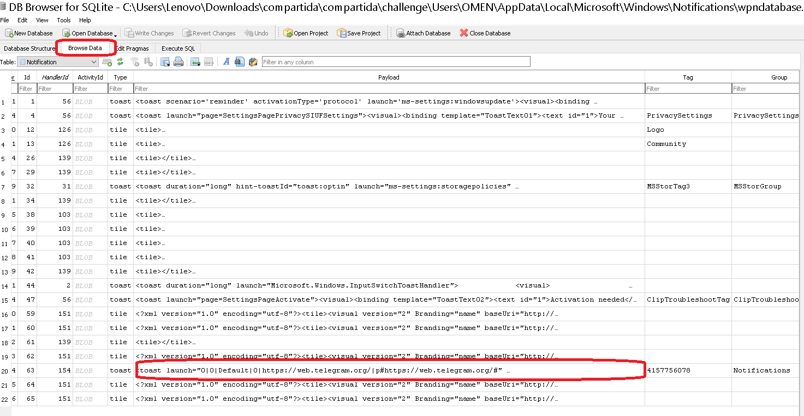
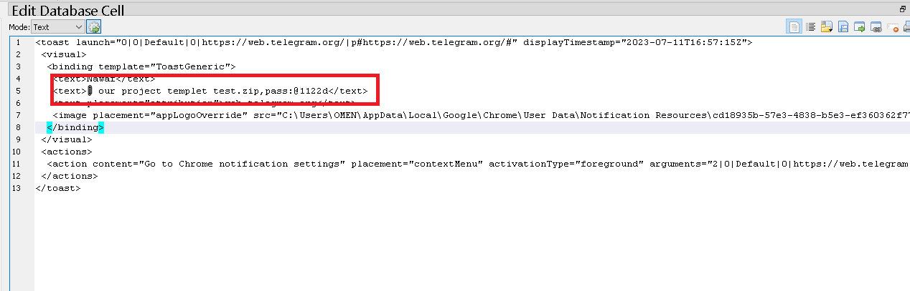
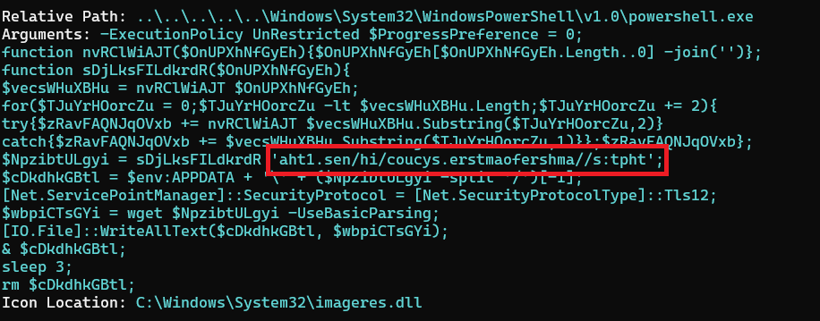
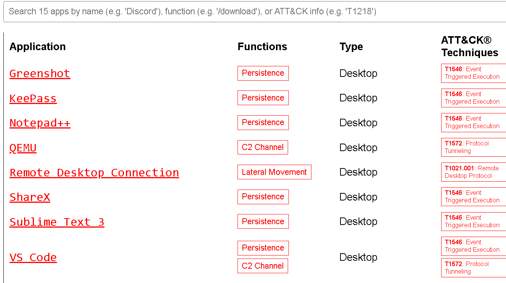
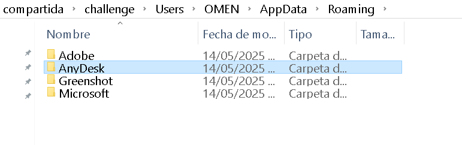

En este laboratorio estaremos analizando la computadora de un empleado que, al ser explotado laboralmente, recurrió a buscar a un tercero para que le ayudara con el trabaja, dando lugar así a una posible intrusión en la organización, nuestro trabajo será investigar qué fue lo que pasó. 

Se nos da parte de la información del disco del empleado, estaremos usando herramientas como `DB Browser for SQLite` y `TimeLine Explorer`. 

---
<h3 style="color: #0d6efd;">Q1. ¿Qué aplicación de mensajería web utilizó el empleado para hablar con el agresor?</h3>

Bien, en la pista que nos da el laboratorio se nos indica que podemos buscar en el directorio de `C:\Users\Lenovo\Downloads\compartida\compartida\challenge\Users\OMEN\AppData\Local\Microsoft\Windows\Notifications`, que es donde se guardan los artefactos de notificación en windows. 

Las notificaciones en Windows son mensajes generados por el sistema operativo o por aplicaciones para alertar al usuario sobre eventos (nuevos correos, actualizaciones, alarmas, etc.). Estas notificaciones dejan rastros forenses (artefactos) que pueden ser analizados para entender el comportamiento del usuario o actividad del sistema.

Estos artefactos persisten en el disco incluso después de que el usuario haya descartado la notificación visualmente, lo que los convierte en una valiosa fuente de evidencia. 

En Windows existen **numerosos artefactos forenses** que se pueden utilizar para reconstruir la actividad del usuario, el uso del sistema, la ejecución de aplicaciones, acceso a archivos, conexión de dispositivos, navegación web, entre otros.

## 📂 1. Artefactos de Actividad del Usuario

| Artefacto                         | Ubicación                                                                                | Descripción                                                                              |
| --------------------------------- | ---------------------------------------------------------------------------------------- | ---------------------------------------------------------------------------------------- |
| **Jump Lists**                    | `%APPDATA%\Microsoft\Windows\Recent\AutomaticDestinations\` y `CustomDestinations\`      | Lista de archivos y carpetas abiertos recientemente por aplicación (acceso rápido).      |
| **LNK Files** (Accessos directos) | `%USERPROFILE%\Recent\`                                                                  | Registra accesos a archivos, con timestamp y metadatos del archivo objetivo.             |
| **Shellbags**                     | Registro: `HKCU\Software\Classes\Local Settings\Software\Microsoft\Windows\Shell\BagMRU` | Registra vista y estructura de carpetas accedidas, útil para ver directorios eliminados. |
| **UserAssist**                    | Registro: `HKCU\Software\Microsoft\Windows\CurrentVersion\Explorer\UserAssist`           | Registra programas ejecutados por el usuario (rot13 codificado).                         |
| **RecentDocs**                    | Registro: `HKCU\Software\Microsoft\Windows\CurrentVersion\Explorer\RecentDocs`           | Lista de documentos abiertos recientemente.                                              |

## 🧭 2. Artefactos de Navegación Web

| Artefacto                              | Ubicación                                          | Descripción                                        |
| -------------------------------------- | -------------------------------------------------- | -------------------------------------------------- |
| **Historial de Edge/Chrome/Firefox**   | Archivos SQLite en `AppData\Local`                 | Historial de URLs visitadas, búsquedas, descargas. |
| **WebCacheV01.dat (IE y Edge Legacy)** | `%LocalAppData%\Microsoft\Windows\WebCache\`       | Contiene caché, historial, cookies.                |
| **Cookies y Local Storage**            | En bases de datos SQLite o archivos `.ldb`, `.log` | Información de sesión y uso de sitios web.         |

## 💻 3. Artefactos de Ejecución de Programas

| Artefacto                      | Ubicación                                                                                  | Descripción                                                                  |
| ------------------------------ | ------------------------------------------------------------------------------------------ | ---------------------------------------------------------------------------- |
| **Prefetch**                   | `C:\Windows\Prefetch\`                                                                     | Indica programas ejecutados recientemente, con timestamps y DLLs utilizadas. |
| **AmCache.hve**                | `C:\Windows\AppCompat\Programs\Amcache.hve`                                                | Registro de ejecución de binarios con hashes y rutas.                        |
| **ShimCache (AppCompatCache)** | Registro: `HKLM\SYSTEM\CurrentControlSet\Control\Session Manager\AppCompatCache`           | Historial de ejecución de binarios, incluso si ya no existen.                |
| **MUICache**                   | Registro: `HKCU\Software\Classes\Local Settings\Software\Microsoft\Windows\Shell\MUICache` | Registra descripciones de ejecutables abiertos por el usuario.               |

## ⌚ 4. Artefactos de Tiempo (TimeLine y Timestamps)

| Artefacto                                 | Ubicación                                                      | Descripción                                                                                          |
| ----------------------------------------- | -------------------------------------------------------------- | ---------------------------------------------------------------------------------------------------- |
| **Windows Timeline (ActivitiesCache.db)** | `%LocalAppData%\ConnectedDevicesPlatform\L\ActivitiesCache.db` | Actividad del usuario sincronizada (apps abiertas, sitios, documentos).                              |
| **\$MFT, \$LogFile, \$USN Journal**       | Volumen NTFS                                                   | Metadatos del sistema de archivos que permiten análisis de creación/modificación/acceso de archivos. |

## 🧩 5. Artefactos de Registro de Eventos (Event Logs)

| Artefacto         | Ubicación                                                                     | Descripción                                                                                                             |
| ----------------- | ----------------------------------------------------------------------------- | ----------------------------------------------------------------------------------------------------------------------- |
| **.evtx files**   | `C:\Windows\System32\winevt\Logs\`                                            | Contienen logs del sistema, seguridad, aplicación, etc. Útiles para rastrear logins, errores, actividad administrativa. |
| **Security.evtx** | Contiene eventos de autenticación, creación de cuentas, borrado de logs, etc. |                                                                                                                         |

## 📲 6. Artefactos de Dispositivos Conectados

| Artefacto              | Ubicación                                    | Descripción                                                                  |
| ---------------------- | -------------------------------------------- | ---------------------------------------------------------------------------- |
| **USBSTOR (Registro)** | `HKLM\SYSTEM\CurrentControlSet\Enum\USBSTOR` | Lista de dispositivos USB conectados. Incluye número de serie, tipo, nombre. |
| **SetupAPI Logs**      | `C:\Windows\inf\setupapi.dev.log`            | Información detallada sobre instalación de drivers, incluidas unidades USB.  |

## 🌐 7. Artefactos de Red

| Artefacto                                | Ubicación                                                                 | Descripción                                                                        |
| ---------------------------------------- | ------------------------------------------------------------------------- | ---------------------------------------------------------------------------------- |
| **SRUM (System Resource Usage Monitor)** | `%SystemRoot%\System32\sru\SRUDB.dat`                                     | Contiene datos sobre uso de red, batería, procesos, muy útil en análisis temporal. |
| **ARPCache**                             | Registro: `HKLM\SOFTWARE\Microsoft\Windows NT\CurrentVersion\NetworkList` | Información de redes conectadas, perfiles de red.                                  |

## 📧 8. Artefactos de Correo y Aplicaciones

| Artefacto                           | Ubicación                                              | Descripción                                                        |
| ----------------------------------- | ------------------------------------------------------ | ------------------------------------------------------------------ |
| **Notificaciones (wpndatabase.db)** | `AppData\Local\Microsoft\Windows\Notifications\`       | Ya explicado. Notificaciones de apps como correo, calendario, etc. |
| **Outlook PST/OST**                 | Generalmente en `Documents\Outlook Files\` o `AppData` | Bases de datos de correos enviados/recibidos, agenda, contactos.   |
| **Teams/Slack/Zoom artefacts**      | `AppData\Roaming` o `AppData\Local`                    | Conversaciones, logs, archivos descargados. Depende del cliente.   |

Así que abrimos esta ruta en `DB Browser for SQLite`, y en la tabla de notificaciones podemos ver esto: 



---

<h3 style="color: #0d6efd;">Q2. ¿Cuál es la contraseña del archivo ZIP protegido enviado por el atacante al empleado? </h3>

Esto lo podemos ver en la línea en la que encontramos la respuesta de la pregunta anterior: 



---

<h3 style="color: #0d6efd;">Q3. ¿Qué dominio utilizó el atacante para descargar la segunda fase del malware? </h3>

Bien, para esto usamos la herramienta `LECmd.exe`, propiedad de Eric Zimmerman, aplicamos el siguiente comando: 

```bash 
PS C:\Users\Lenovo\Downloads\compartida\LECmd> .\LECmd.exe -f "C:\Users\Lenovo\Downloads\compartida\compartida\challenge\Users\OMEN\Downloads\project templet test\templet.lnk"
```

Dentro de lo que nos muestra podemos ver lo siguiente: 



Ya parece un tipo de direccion URL.

Para este tipo de cadenas “raras” lo primero es identificar si se trata de una **ofuscación por reversión** o por **substitución simple**. En tu caso:

**Reversión completa**
   Si invertimos la cadena entera

   ```
   aht1.sen/hi/coucys.erstmaofershma//s:tpht  
   ```

   obtenemos:

   ```
   thpt:s//amhsrefoamtsre.sycuoc/ih/nes.1tha
   ```

   Ya aparece algo parecido a un esquema de URL (`thpt:s//…`) y un nombre de host (`amhsrefoamtsre.sycuoc`).

**Detectar el esquema HTTP(S)**
   Ese `thpt:s//` muy probablemente es **“http(s)://”** tras un par de sustituciones:

   * Cambio sistemático de “t↔h” en la palabra `http`
   * Posiblemente también un desplazamiento de caracteres (por ejemplo, un **Caesar** de ±1 en ASCII)

   Esto daría:

   ```
   nes.1tha/ih/ahmsreofatsmrest.ycsuoc//http:s
   ```

   que, si luego se vuelve a invertir globalmente o se corrigen letras, apunta a

   ```
   http(s)://couycs.tersmofear…/hi/…  
   ```

   —es decir, un host obfuscado y luego la ruta real.

Entonces usamos el siguiente cógido para desofuscarlo:
```python
input_string = 'aht1.sen/hi/coucys.erstmaofershma//s:tpht'[::-1]
output_string = ''

for i in range(0, len(input_string), 2):
    try:
        tmp = input_string[i] + input_string[i + 1]
        print("\n")
        print(tmp)
        print("\n")
        output_string += tmp[::-1]
        print(output_string)
    except:
        output_string += input_string[i]

print(output_string)
```

Y si lo ejecutamos podemos obtener la dirección. 

---

<h3 style="color: #0d6efd;">Q4. ¿Cuál es el nombre del comando que el atacante inyectó utilizando uno de los LOLAPPS instalados en la máquina para lograr la persistencia?</h3>

**LOLAPPS** es un acrónimo de “**Living Off The Land Applications**”. Se trata de un concepto (y también de un proyecto colaborativo) que amplía la idea de los **LOLBINs** (“Living Off the Land Binaries”) para incluir **aplicaciones completas**, tanto propias de Windows como de terceros, que pueden ser **abusadas** por un atacante para ejecutar código, mantener persistencia o evadir controles de seguridad sin necesidad de introducir binarios externos.

* **Origen y propósito**

  * El proyecto “LOLAPPS” documenta cómo se pueden explotar funciones legítimas de aplicaciones instaladas en el sistema para realizar acciones maliciosas (por ejemplo, ejecución de scripts, descarga de payloads, escalada de privilegios) [lolapps-project.github.io](https://lolapps-project.github.io/).
  * La meta es ofrecer un catálogo de técnicas y vectores basados en aplicaciones que, al estar firmadas o ser de confianza, pasan desapercibidas para los mecanismos de defensa.

* **Diferencia con LOLBAS/LOLBINs**

  * Mientras que **LOLBINs**(lon archivos binarios nativos del sistema operativo que pueden utilizarse para alcanzar los objetivos de un atacante sin descargar ni instalar nuevas herramientas ni malware.) se centra en binarios nativos de Windows (p. ej. `powershell.exe`, `mshta.exe`, `certutil.exe`), **LOLAPPS** incluye cualquier aplicación —nativa o de terceros— que pueda invocarse de forma legítima pero con fines maliciosos.
  * Por ejemplo, un atacante podría abusar de un navegador instalado, de herramientas de Office que permiten ejecución de macros, o de utilidades de impresión para persistencia y movimiento lateral.

Visitando el proyecto podemos ver la lista: 



Y buscando en el "`home`" del usuario, en la siguiente ruta, encontramos algo una de estas aplicaciones: 

`challenge\Users\OMEN\AppData\Local\Greenshot\Greenshot.ini`

Aplicando un strings podemos ver lo siguiente: 
```bash 
┌──(kali㉿kali)-[~/…/OMEN/AppData/Roaming/Greenshot]
└─$ strings Greenshot.ini | grep -i "command"
; Optional command to execute on a temporary PNG file, the command should overwrite the file and Greenshot will read it back. Note: this command is also executed when uploading PNG's!
OptimizePNGCommand=
; Arguments for the optional command to execute on a PNG, {0} is replaced by the temp-filename from Greenshot. Note: Temp-file is deleted afterwards by Greenshot.
OptimizePNGCommandArguments="{0}"
; Greenshot ExternalCommand Plugin configuration
[ExternalCommand]
; The commands that are available.
Commands=MS Paint,jlhgfjhdflghjhuhuh
; Redirect the standard error of all external commands, used to output as warning to the greenshot.log.
; Redirect the standard output of all external commands, used for different other functions (more below).
; Depends on 'RedirectStandardOutput': Show standard output of all external commands to the Greenshot log, this can be usefull for debugging.
; The commandline for the output command.
Commandline.MS Paint=C:\Windows\System32\mspaint.exe
Commandline.jlhgfjhdflghjhuhuh=C:\Windows\system32\cmd.exe
; The arguments for the output command.
; Should the command be started in the background.
; If a build in command was deleted manually, it should not be recreated.
DeletedBuildInCommands=
; Show command
WindowShowCommand=Normal
```

---

<h3 style="color: #0d6efd;"> </h3>

Bien, analizando este malware podemos ver varias rutas: 

```bash
┌──(kali㉿kali)-[~/…/OMEN/AppData/Roaming/Greenshot]
└─$ strings Greenshot.ini | grep -i "C\:"
OutputFilePath=C:\Users\OMEN\Desktop
OutputFileAsFullpath=C:\Users\OMEN\Desktop\dummy.png
Commandline.MS Paint=C:\Windows\System32\mspaint.exe
Commandline.jlhgfjhdflghjhuhuh=C:\Windows\system32\cmd.exe
Argument.jlhgfjhdflghjhuhuh=/c "C:\Users\OMEN\AppData\Local\Temp\templet.lnk"
```

Vemos que la última ruta se apunta al directorio `/temp`, tipico para alojar malware.

---
<h3 style="color: #0d6efd;">Q6. ¿Cuál es el nombre de la aplicación que utilizó el atacante para la filtración de datos?</h3>

Buscando la información de las aplicaciones, encuentro la siguiente: 



Esto es una app de escritorio remoto bastante conocida, cubre todas las especificaciones para mantener persistencia en el sistema. 

---

<h3 style="color: #0d6efd;">Q7. ¿Cuál es la dirección ip del atacante? </h3>

Analizando los ficheros, buscando ip's, encuentro el siguiente: 

```bash
┌──(kali㉿kali)-[~/…/OMEN/AppData/Roaming/AnyDesk]
└─$ grep -i "log" ad.trace | grep -E '([0-9]{1,3}\.){3}[0-9]{1,3}'
   info 2023-07-12 08:56:16.466       lsvc   6572   5380   22                anynet.any_socket - Logged in from 77.232.122.31:4026 on relay 872f8937.
   info 2023-07-12 08:58:58.835       lsvc   6572   5380   48                anynet.any_socket - Logged in from 77.232.122.31:4026 on relay 872f8937.
   info 2023-07-12 09:01:15.942       lsvc   6572   5380   53                anynet.any_socket - Logged in from 77.232.122.31:4026 on relay 872f8937.
   info 2023-07-12 09:08:04.503       lsvc   7024   7008   20                anynet.any_socket - Logged in from 77.232.122.31:3974 on relay 872f8937.
   info 2023-07-12 09:08:44.847       lsvc   7024   7008   43                anynet.any_socket - Logged in from 77.232.122.31:3974 on relay 872f8937.
```


