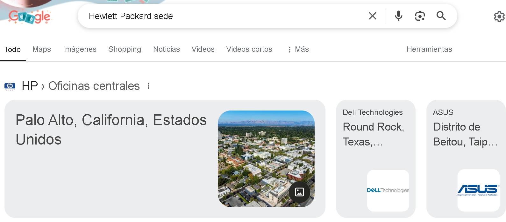
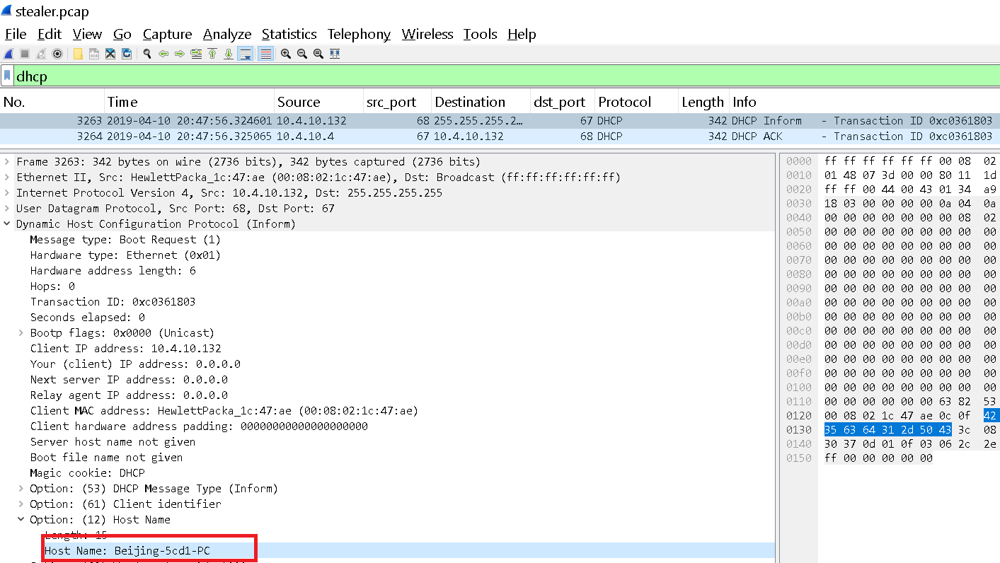
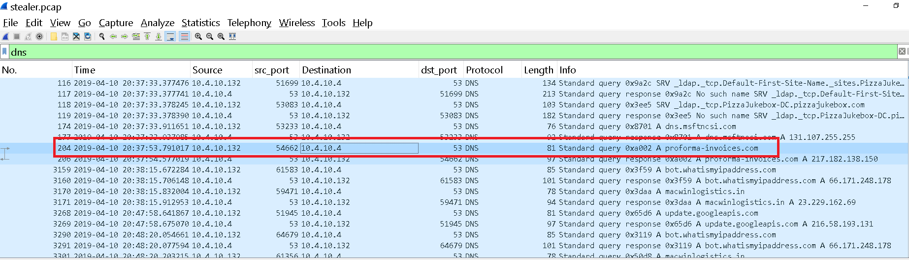
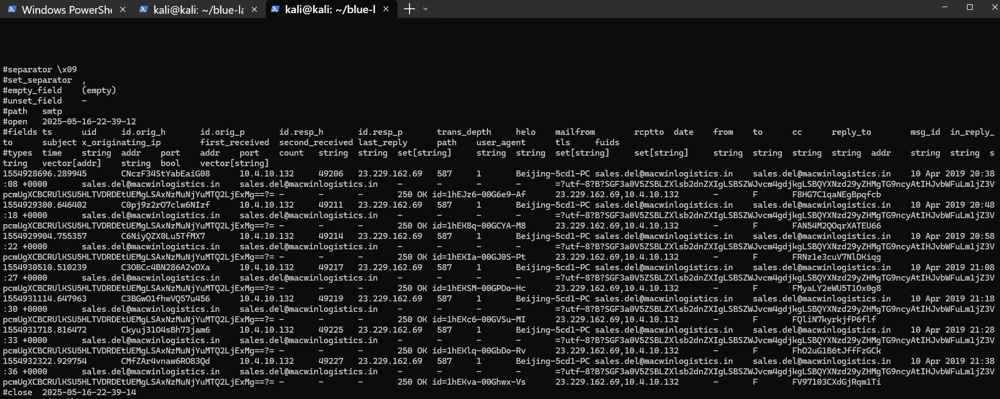
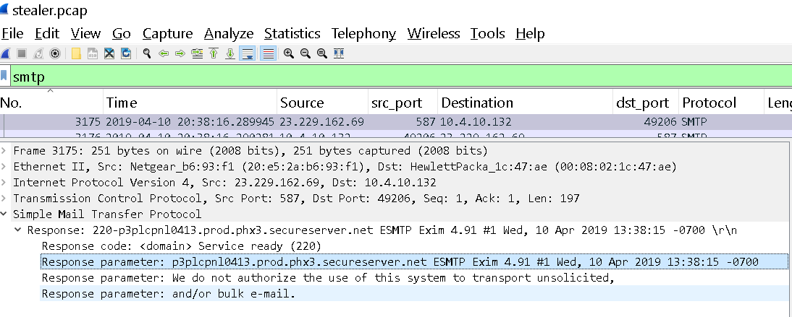
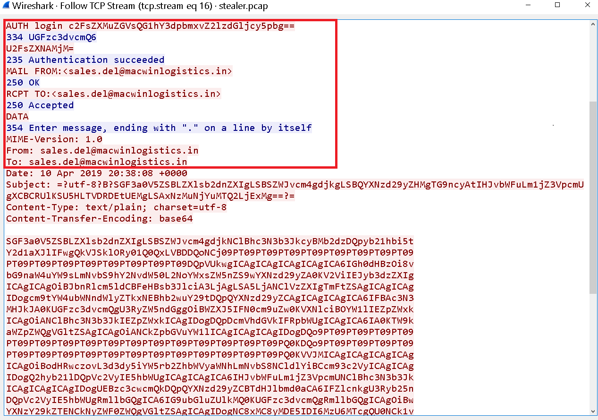
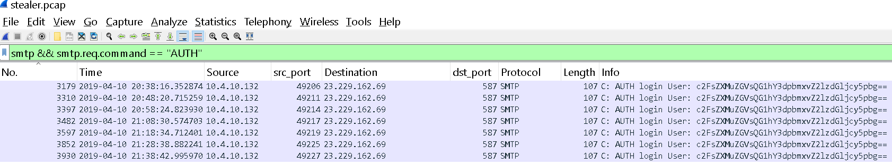

<h4 style="color: #0d6efd;">Q1. ¿Cuántos paquetes tiene la captura? </h4>

Esto podemos verlo facilmente con tshark:

```bash
┌──(kali㉿kali)-[~/blue-labs/hawkeye]
└─$ tshark -r stealer.pcap| tail -n 1
 4003 3821.561233  10.4.10.132 49228 10.4.10.4    445 TCP 54 49228 → 445 [ACK] Seq=3836 Ack=1073 Win=64512 Len=0
```

----

<h4 style="color: #0d6efd;">Q2. ¿A qué hora se capturó el primer paquete?</h4>

Con tshark:

```bash
┌──(kali㉿kali)-[~/blue-labs/hawkeye]
└─$ TZ=UTC tshark -r stealer.pcap -t ad | head -n 1
    1 2019-04-10 20:37:07.129730  10.4.10.132 49190 10.4.10.4    88 TCP 66 49190 → 88 [SYN] Seq=0 Win=8192 Len=0 MSS=1460 WS=256 SACK_PERM
```

Hay que usar la opción -t ad para mostrar tiempo absoluto con fecha, y además, usar la opción -z, o bien establecer explícitamente la zona horaria con TZ.

---

<h4 style="color: #0d6efd;">Q3. ¿Cuál es la duración de la captura? </h4>

Tenemos varias formas.

En wireshark: 

`Statistics` → `Capture File Properties…`


En bash: 

```bash
┌──(kali㉿kali)-[~/blue-labs/hawkeye]
└─$ capinfos -u stealer.pcap
File name:           stealer.pcap
Capture duration:    3821.561233 seconds
```
Solo calculamos la diferencia de tiempos. 


```bash 
┌──(kali㉿kali)-[~/blue-labs/hawkeye]
└─$ start=$(tshark -r stealer.pcap -T fields -e frame.time_epoch -c 1); end=$(tshark -r stealer.pcap -T fields -e frame.time_epoch | tail -n1); duration=$(printf "%.6f\n" "$(echo "$end - $start" | bc -l)"); date -u -d "@$duration" +%T
```

---

<h4 style="color: #0d6efd;">Q4. ¿Cuál es el ordenador más activo a nivel de enlace? </h4>

Aquí lo que nos están pidiendo es la dirección MAC que más aparece en la captura, y esta dirección MAC se usa para en el protocolo Ethernet, en la capa de enlace de datos en el modelo OSI y TCP/IP.
Podemos hacerlo de varias formas: 

En wireshark: `Statistics → Endpoints → Ethernet`

Con tshark: 

```bash
┌──(kali㉿kali)-[~/blue-labs/hawkeye]
└─$ tshark -r stealer.pcap -T fields -e eth.src -e eth.dst \
  | tr '\t' '\n' \
  | sort \
  | uniq -c \
  | sort -nr \
  | head -n 5
   4003 00:08:02:1c:47:ae
   3352 20:e5:2a:b6:93:f1
    513 a4:1f:72:c2:09:6a
     74 01:00:5e:7f:ff:fa
     31 ff:ff:ff:ff:ff:ff
```

O

```bash 
┌──(kali㉿kali)-[~/blue-labs/hawkeye]
└─$ tshark -n -r stealer.pcap -q -z endpoints,eth
================================================================================
Ethernet Endpoints
Filter:<No Filter>
                       |  Packets  | |  Bytes  | | Tx Packets | | Tx Bytes | | Rx Packets | | Rx Bytes |
00:08:02:1c:47:ae           4003       2390126       1993          212202        2010         2177924
20:e5:2a:b6:93:f1           3352       2241975       1776         2132341        1576          109634
a4:1f:72:c2:09:6a            513        113639        234           45583         279           68056
01:00:5e:7f:ff:fa             74         28970          0               0          74           28970
ff:ff:ff:ff:ff:ff             31          3534          0               0          31            3534
01:00:5e:00:00:16             23          1258          0               0          23            1258
01:00:5e:00:00:fc             10           750          0               0          10             750
================================================================================
```
- -n desactiva toda resolución de nombres (DNS, servicios, fabricantes, etc.).
- -q silencia la salida de cada paquete
- -z endpoints,eth genera un resumen de direcciones MAC vistas como src y dst

---

<h4 style="color: #0d6efd;">Q5. ¿Fabricante del NIC del sistema más activo a nivel de enlace?</h4>

Esto también podemos verlo en wireshark, en `Statistics -> Resolved Addresses`


También podemos buscar por internet en páginas que buscan por el nombre del manufactor de la tarjeta de red basándose en la MAC. 

---

<h4 style="color: #0d6efd;">Q6. ¿Dónde está la sede de la empresa que fabricó el NIC del ordenador más activo a nivel de enlace?</h4>

Buscando en internet: 



---

<h4 style="color: #0d6efd;">Q6. La organización trabaja con direccionamiento privado y máscara de red /24. ¿Cuántos ordenadores de la organización participan en la captura?</h4>

Para esto podemos contar las ip con tshark: 

```bash 
┌──(kali㉿kali)-[~/blue-labs/hawkeye]
└─$ tshark -r stealer.pcap| awk '{print $3" "$5}' | tr ' ' '\n' | sort | uniq -c
   4003 10.4.10.132
     42 10.4.10.2
     30 10.4.10.255
    513 10.4.10.4
     20 216.58.193.131
   2947 217.182.138.150
     10 224.0.0.252
    280 23.229.162.69
     74 239.255.255.250
      1 255.255.255.255
     63 66.171.248.178
     23 IGMPv3
```

Vemos un rango de ip´s privadas, no contamos la dirección `10.4.10.255`, que es la dirección de broadcast. 

En redes IPv4, un broadcast es un tipo de comunicación unidifusión dirigida a todos los dispositivos de una red local (LAN), sin necesidad de conocer sus direcciones IP o MAC individuales.
Cuando un host envía un paquete a 10.4.10.255 (el broadcast de su subred), la capa de enlace (Ethernet) usa la dirección MAC especial:

```bash
ff:ff:ff:ff:ff:ff
```
Esto significa que todos los equipos de la red local (que estén conectados y no filtren el tráfico) reciben ese paquete.

---

<h4 style="color: #0d6efd;">Q8. ¿Cuál es el nombre del ordenador más activo de la red?</h4>


Esto lo podemos encontrar en los paquetes DCHP, en el momento en el que el cliente inicia una comunicación con el servidor, el cliente manda su información al servidor. 



---

<h4 style="color: #0d6efd;">Q9. ¿Cual es el nombre del servidor DNS de la organización?</h4>

Esto lo podemos ver en la imagen de la pregunta anterior, el cliente solicita envía un paquete `DHCPINFORM` a la dirección de broadcast: 

Este mensaje DHCP Inform (o DHCPINFORM) es uno de los tipos de mensajes del protocolo DHCP (Dynamic Host Configuration Protocol). Este tipo de mensaje se utiliza cuando un cliente ya tiene una dirección IP configurada (manual o estática) pero necesita obtener información adicional del servidor DHCP, como:

- Dirección del servidor DNS
- Dominio local
- Opciones personalizadas de red (por ejemplo, servidores NTP, WINS, etc.)

Escenario típico:
- Un equipo (por ejemplo, una impresora o un servidor) tiene una IP estática configurada manualmente.
- Ese equipo necesita información de red adicional, como los servidores DNS.
- El equipo envía un mensaje DHCPINFORM a la red.
- El servidor DHCP responde con un mensaje DHCPACK, sin asignar una IP, pero incluyendo las opciones de configuración solicitadas.

La dirección que responde a dicho mensaje es, claramente, la del servidor. 

---

<h4 style="color: #0d6efd;">Q10. ¿Por qué dominio pregunta la víctima en el paquete 204? </h4>

Cuando nos hablan de un dominio rápidamente pensamos en el protodolo DNS, aplicamos este filtro en wireshark y vemos que efectivamente aparece el paquete 204: 



| Tipo de registro | Nombre completo     | Propósito                                          | Ejemplo de respuesta             |
| ---------------- | ------------------- | -------------------------------------------------- | -------------------------------- |
| `A`              | Address Record      | Asocia un nombre de dominio con una dirección IPv4 | `ejemplo.com -> 93.184.216.34`   |
| `AAAA`           | IPv6 Address Record | Asocia un nombre de dominio con una dirección IPv6 | `ejemplo.com -> 2606:2800:220::` |

----

<h4 style="color: #0d6efd;">Q11. ¿Cuál es la IP del dominio de la pregunta anterior?</h4>

En la imagen de la pregunta anterior podemos ver la respuesta del servidor DNS. 

---

<h4 style="color: #0d6efd;">Q12. Indique el país al que pertenece el IP del apartado anterior.</h4>

Aplicando un `whois` a la ip: 

```bash 
┌──(kali㉿kali)-[~/blue-labs/hawkeye]
└─$ whois 217.182.138.150
<SNIP>
person:         Octave Klaba
address:        OVH SAS
address:        2 rue Kellermann
address:        59100 Roubaix
address:        France
phone:          +33 9 74 53 13 23
nic-hdl:        OK217-RIPE
mnt-by:         OVH-MNT
created:        1970-01-01T00:00:00Z
last-modified:  2017-10-30T21:44:51Z
source:         RIPE # Filtered

<SNIP>
```

---

<h4 style="color: #0d6efd;">Q12. ¿Qué sistema operativo utiliza el ordenador de la víctima? </h4>

Esto lo podemos encontrar en los paquetes http, en la cabecera `User-Agent`: 

```bash 
┌──(kali㉿kali)-[~/blue-labs/hawkeye]
└─$ tshark -r stealer.pcap -Y "http" | head -n 1
  210  47.597546  10.4.10.132 49204 217.182.138.150 80 HTTP 392 GET /proforma/tkraw_Protected99.exe HTTP/1.1

┌──(kali㉿kali)-[~/blue-labs/hawkeye]
└─$ tshark -r stealer.pcap -Y "http" -T fields -e "http.user_agent" | head -n 1
Mozilla/4.0 (compatible; MSIE 7.0; Windows NT 6.1; WOW64; Trident/7.0; SLCC2; .NET CLR 2.0.50727; .NET CLR 3.5.30729; .NET CLR 3.0.30729; Media Center PC 6.0; .NET4.0C; .NET4.0E)
```

---

<h4 style="color: #0d6efd;">Q13. ¿Cuál es el nombre del archivo malicioso descargado por el contable? </h4>

Esto podemos hacerlo con el siguiente filtro, para ver que recursos solicitó el cliente víctima: 

```bash 
┌──(kali㉿kali)-[~/blue-labs/hawkeye]
└─$ tshark -r stealer.pcap -Y 'http.request.method == "GET"'
  210  47.597546  10.4.10.132 49204 217.182.138.150 80 HTTP 392 GET /proforma/tkraw_Protected99.exe HTTP/1.1
 3164  68.640169  10.4.10.132 49205 66.171.248.178 80 HTTP 129 GET / HTTP/1.1
 3295 673.005938  10.4.10.132 49210 66.171.248.178 80 HTTP 129 GET / HTTP/1.1
 3382 1277.329651  10.4.10.132 49213 66.171.248.178 80 HTTP 129 GET / HTTP/1.1
 3467 1883.097476  10.4.10.132 49216 66.171.248.178 80 HTTP 129 GET / HTTP/1.1
 3582 2487.212975  10.4.10.132 49218 66.171.248.178 80 HTTP 129 GET / HTTP/1.1
 3837 3091.379849  10.4.10.132 49224 66.171.248.178 80 HTTP 129 GET / HTTP/1.1
 3915 3695.523251  10.4.10.132 49226 66.171.248.178 80 HTTP 129 GET / HTTP/1.1
```

Ya en la primera petición vemos que se solicitó un `.exe` "extraño", en el sentido de que no es algún software conocido. 


---

<h4 style="color: #0d6efd;">Q14. ¿Cuál es el hash md5 del archivo descargado? </h4>

Para esto nos descargamos el `.exe`, podemos verlo con Networkminer o en wireshark en `File -> Export Obects -> HTTP`

```bash 
┌──(kali㉿kali)-[~/blue-labs/hawkeye]
└─$ md5sum tkraw_Protected99.exe
71826ba081e303866ce2a2534491a2f7  tkraw_Protected99.exe
```

---

<h4 style="color: #0d6efd;">Q15. ¿Qué software ejecuta el servidor web que aloja el malware?</h4>

Esto lo podemos ver en la respuesta a la petición que hizo el cliente: 


Esto es un software de servidor web que se destaca por su alta velocidad y eficiencia. Es una alternativa popular a servidores web como Apache y Nginx, y se enfoca en optimizar el rendimiento de un sitio web

---

<h4 style="color: #0d6efd;">Q17. ¿Cuál es la IP pública del ordenador de la víctima? </h4>

Esto puede ser un poco truculento porque normalmente en una captura .pcap en escenarios en redes corporativas o domésticas, los clientes usan direcciones privadas (RFC 1918), y su comunicación hacia el exterior (Internet) pasa por un NAT (Network Address Translation), generalmente implementado en el router o firewall. Debido a esto, en un fichero .pcap capturado dentro de la red interna, no siempre es posible ver directamente la IP pública del cliente.

Aunque puede haber algunas excepciones: 


### 1. **STUN (Session Traversal Utilities for NAT)**

* Usado por aplicaciones de VoIP, WebRTC (como Zoom, Google Meet).
* El cliente envía una solicitud a un servidor STUN externo y este le responde con **la IP pública y puerto mapeado por NAT**.
* Puedes encontrarlo con:

```bash
tshark -r captura.pcap -Y "stun"
```

En la respuesta STUN verás líneas como:

```
Mapped Address: 93.84.21.142:54321
```

> Esa es la IP pública del cliente que el servidor STUN ve desde fuera.

### 2. **UPnP (Universal Plug and Play) con solicitudes a routers NAT**

* Algunos dispositivos intentan descubrir su IP pública preguntando al router por medio de UPnP (protocolo SSDP sobre UDP/1900).
* Este tráfico puede incluir la IP pública en una respuesta del router.

### 3. **Solicitudes HTTP/HTTPS hacia servicios "mi IP"**

Si el cliente accedió a páginas como:

* `https://ifconfig.me`
* `https://api.ipify.org`
* `https://checkip.amazonaws.com`

Puede que haya tráfico HTTP donde se vea la petición y la respuesta, revelando la IP pública.

Filtro en Wireshark:

```
http contains "ipify" or http contains "ifconfig"
```

Y buscar la IP en la respuesta del servidor.

### 4. **Aplicaciones P2P (BitTorrent, etc.)**

En protocolos P2P, el cliente puede anunciar su propia IP pública a otros nodos. Si estás analizando tráfico de este tipo, también podrías ver la IP pública anunciada.

### 5. **Encabezados HTTP (a veces)**

En redes mal configuradas o en proxies, algunos clientes pueden agregar su IP pública en los headers HTTP. Por ejemplo:

```
http.header contains "X-Forwarded-For"
```

**No puede aparecer en**: 
- En protocolos típicos como DHCP, ARP, NetBIOS, etc., solo verás IPs privadas.
- En tráfico generado antes del NAT (es decir, dentro de una red privada), no puedes ver la IP pública porque todavía no se ha hecho la traducción.

Pero antes de buscar, podemos ir al análisis que nos realizó zeek, en el fichero de `http.log`:

```bash 
1554928674.727276       CzKH2K3UPcyfeNszae      10.4.10.132     49204   217.182.138.150 80      1       GET     proforma-invoices.com   /proforma/tkraw_Protected99.exe -       1.1     Mozilla/4.0 (compatible; MSIE 7.0; Windows NT 6.1; WOW64; Trident/7.0; SLCC2; .NET CLR 2.0.50727; .NET CLR 3.5.30729; .NET CLR 3.0.30729; Media Center PC 6.0; .NET4.0C; .NET4.0E)       -       0       2025472 200     OK       -       -       (empty) -       -       -       -       -       -       F8Fzcua6pCqZ7Jpb8       -       application/x-dosexec
1554928695.769899       CHsJ2T2IJpzGrf3yJ6      10.4.10.132     49205   66.171.248.178  80      1       GET     bot.whatismyipaddress.com       /       -       1.1     -       -       0       14      200      OK      -       -       (empty) -       -       -       -       -       -       FsRUCH3B4XGFEha6Me      -       text/plain
1554929300.135668       CYGZEG4zwmjezFBKtk      10.4.10.132     49210   66.171.248.178  80      1       GET     bot.whatismyipaddress.com       /       -       1.1     -       -       0       14      200      OK      -       -       (empty) -       -       -       -       -       -       FxrFwufBLn7eQH9I6       -       text/plain
1554929904.459381       CzcMRRMfLycrne4Dj       10.4.10.132     49213   66.171.248.178  80      1       GET     bot.whatismyipaddress.com       /       -       1.1     -       -       0       14      200      OK      -       -       (empty) -       -       -       -       -       -       FzAnEt2b85Zw5MHz76      -       text/plain
```

Un servicio que solicita la ip publica del usuario, si abrimos nos descargamos uno de estos ficheros y lo leemos podemos ver lo siguiente: 

```bash 
┌──(kali㉿kali)-[~/blue-labs/hawkeye/files_pcap]
└─$ cat '%2f'                                                                                                                                                                                            173.66.146.112
```

---

<h4 style="color: #0d6efd;">Q17. ¿En qué país se encuentra el servidor de correo electrónico al que se envía la información robada? </h4>

Para esto podemos pensar en el protocolo `SMTP`, que significa Protocolo Simple de Transferencia de Correo (Simple Mail Transfer Protocol), es un protocolo de red utilizado para enviar y recibir correos electrónicos entre diferentes dispositivos como ordenadores, teléfonos móviles, impresoras, entre otros.

Para esto zeek ya nos realizó un análisis, consultamos el `smtp.log`: 



Me di cuenta que aqui también se puede encontrar el nombre del equipo que nos solicitan en la pregunta 8.

Aplicando un whois a la ip: 

```bash 
┌──(kali㉿kali)-[~/blue-labs/hawkeye]
└─$ whois 23.229.162.69
<SNIP>
OrgName:        GoDaddy.com, LLC
OrgId:          GODAD
Address:        2155 E GoDaddy Way
City:           Tempe
StateProv:      AZ
PostalCode:     85284
Country:        US
RegDate:        2007-06-01
Updated:        2024-11-25
Comment:        Please send abuse complaints to abuse@godaddy.com
Ref:            https://rdap.arin.net/registry/entity/GODAD
<SNIP>
```

---

<h4 style="color: #0d6efd;">Q19. Analizar la primera extracción de información. Qué software ejecuta el servidor de correo electrónico al que se envían los datos robados? </h4>

Para esto podemos inspeccionar el primer paquete SMPT que aparece en la captura de red: 



Exim es un software de agente de transferencia de mensajes (MTA) que puede ser configurado para funcionar con el protocolo SMTP, el protocolo de transferencia de correo electrónico estándar. Exim puede ser utilizado para enviar y recibir correo electrónico, y se puede configurar para autenticar con servidores SMTP, lo que significa que puede verificar la identidad del remitente antes de aceptar el correo.

---

<h4 style="color: #0d6efd;">Q20. ¿A qué cuenta de correo electrónico se envía la información robada? </h4>

Esto lo podemos ver en la captura del protocolo smtp que nos proporcionó zeek, pero veamos mas a fondo los paquetes: 




- El cliente SMTP (la máquina “Beijing-5cd1-PC”) abre una conexión al servidor de correo (puerto 25, 465 o 587).
- Envía el comando MAIL FROM:<sales.del@macwinlogistics.in>.
- Envía el comando RCPT TO:<sales.del@macwinlogistics.in>.
- Vemos datos en lo que parece ser base64, comun para exfiltrar datos, que los datos exfiltrados no sean tan legibles o pasar de binario a un formato mas manejable como lo es base64. 


---

<h4 style="color: #0d6efd;">  </h4>

Bien, en la captura de la imagen anterior podemos mensajes de loggin, parecen estar en base64 como ya mencionamos, vamos a desencodearlos para ver que contienen: 

```bash
┌──(kali㉿kali)-[~/blue-labs/hawkeye]
└─$ echo "c2FsZXMuZGVsQG1hY3dpbmxvZ2lzdGljcy5pbg==" | base64 -d
sales.del@macwinlogistics.in                                                                                                                                                                             
┌──(kali㉿kali)-[~/blue-labs/hawkeye]
└─$ echo "UGFzc3dvcmQ6"  | base64 -d
Password:                                                                                                                                                                                                
┌──(kali㉿kali)-[~/blue-labs/hawkeye]
└─$ echo "U2FsZXNAMjM=" | base64 -d
Sales@23
```


---

<h4 style="color: #0d6efd;">Q22. ¿Qué variante de malware exfiltró los datos?</h4>


Esto es la **salida de un keylogger** (en concreto **HawkEye Keylogger – Reborn v9**), es decir, el registro de todas las pulsaciones de teclado y datos de formularios que ese malware ha capturado en el sistema infectado. Vamos a desglosar cada bloque:

### 1. Identificación del keylogger

```
HawkEye Keylogger - Reborn v9
Passwords Logs
roman.mcguire \ BEIJING-5CD1-PC
```

* **HawkEye Keylogger – Reborn v9**: nombre y versión de la herramienta maliciosa.
* **Passwords Logs**: indica que lo que sigue son registros de contraseñas.
* **roman.mcguire \ BEIJING-5CD1-PC**: usuario de Windows (`roman.mcguire`) y nombre de host (`BEIJING-5CD1-PC`) donde se ha instalado el keylogger.

### 2. Sección de cada credencial

Cada `==================================================` separa un conjunto de datos de un “evento” o “sitio” distinto. Por ejemplo:

#### a) AOL Login

```
URL               : https://login.aol.com/account/challenge/password
Web Browser       : Internet Explorer 7.0 - 9.0
User Name         : roman.mcguire914@aol.com
Password          : P@ssw0rd$
Password Strength : Very Strong
```

* Se ha capturado la petición al formulario de login de AOL.
* El keylogger informa qué navegador se está usando y ha registrado el **correo** y la **contraseña** tal cual el usuario los tecleó.

#### b) Bank of America

```
URL               : https://www.bankofamerica.com/
Web Browser       : Chrome
User Name         : roman.mcguire
Password          : P@ssw0rd$
Created Time      : 4/10/2019 2:35:17 AM
Filename          : C:\Users\roman.mcguire\…\Login Data
```

* Similar al anterior, pero con la web de Bank of America en **Chrome**.
* Incluye además la ruta local donde Chrome guarda sus credenciales (`Login Data`), lo que sugiere que el keylogger leyó también archivos de base de datos de contraseñas.

#### c) Configuración de correo Outlook

```
Name              : Roman McGuire
Application       : MS Outlook 2002/2003/2007/2010
Email             : roman.mcguire@pizzajukebox.com
Server            : pop.pizzajukebox.com
Server Port       : 995
Type              : POP3
User              : roman.mcguire
Password          : P@ssw0rd$
SMTP Server       : smtp.pizzajukebox.com
SMTP Server Port  : 587
```

* El keylogger también ha extraído la **configuración de cliente de correo** (POP3/SMTP) de Outlook, incluyendo servidor, puertos y credenciales.


---

<h4 style="color: #0d6efd;">Q23. ¿Cuáles son las credenciales de acceso a bankofamerica? (nombre de usuario:contraseña) </h4>

En la pregunta anterior ya vimos que las credenciales son `roman.mcguire:P@ssw0rd$`

---

<h4 style="color: #0d6efd;">Q24. ¿Cada cuántos minutos se filtran los datos recogidos?</h4>

Para esto podemo fijarnos, por ejemplo, en los intervalos de tiempos en los que se autentica la cuenta del atacante para poder exfiltrar datos: 


