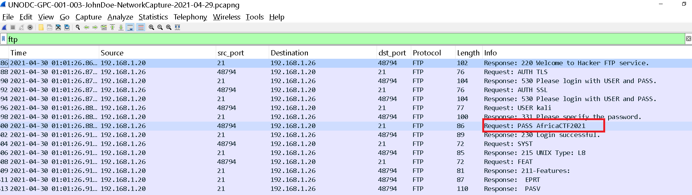
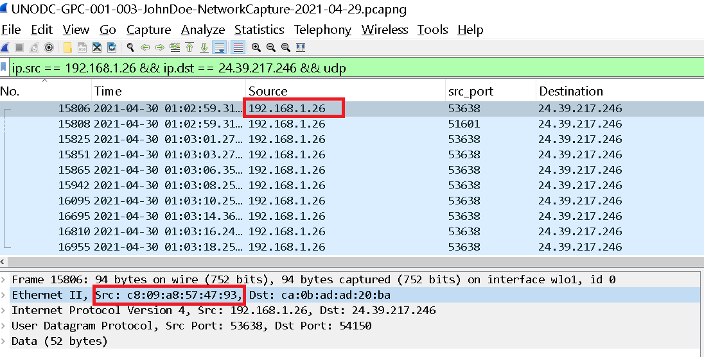
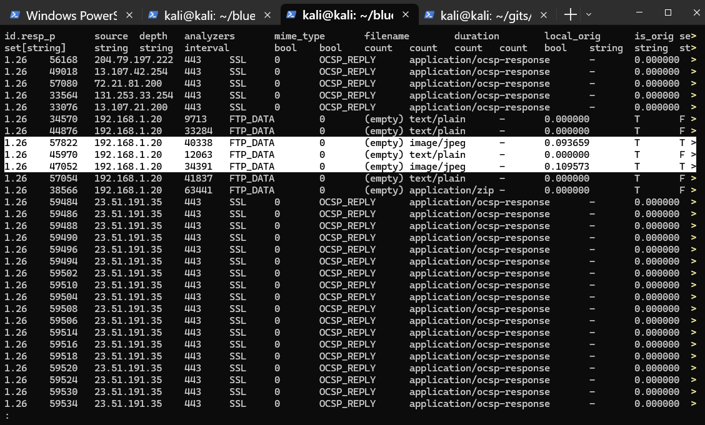
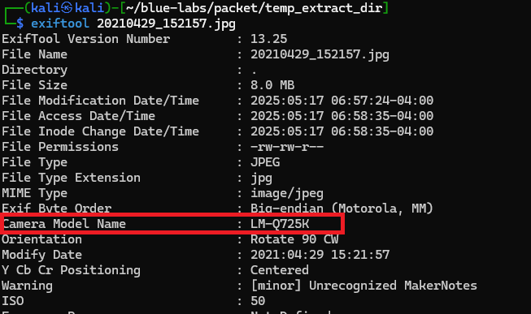
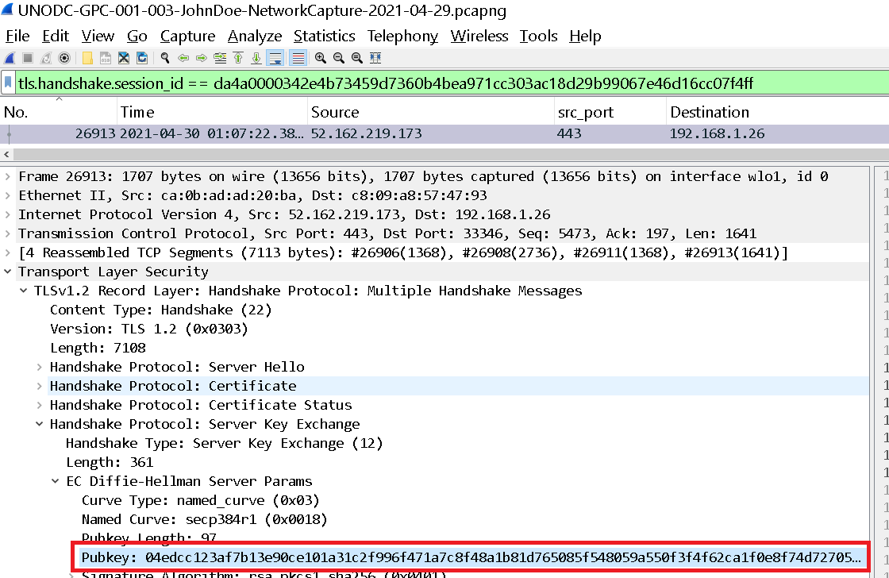
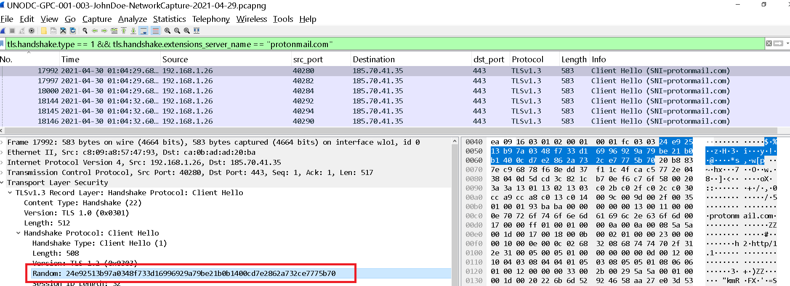
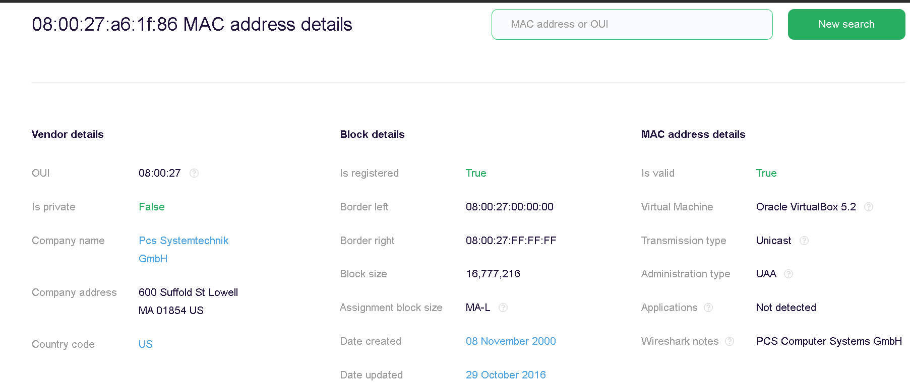
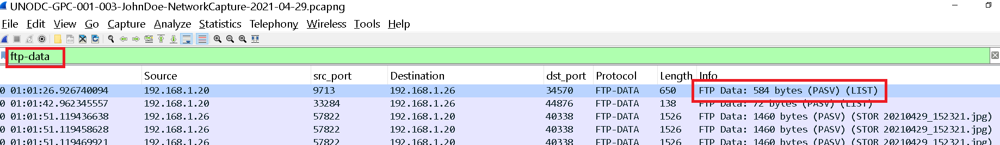
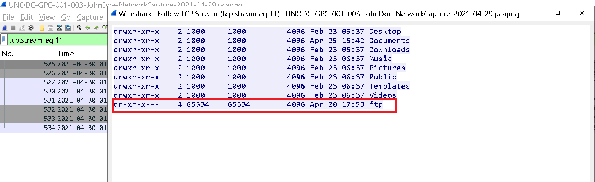
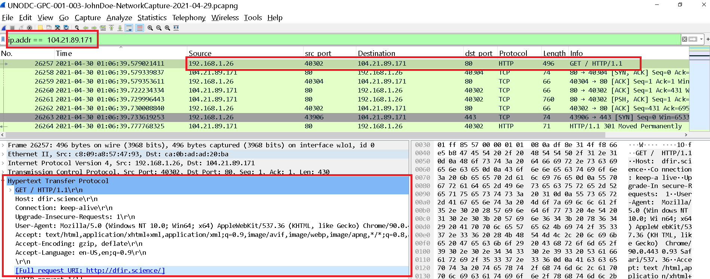

Se nos proporciona un unico fichero, una captura de red `.pcap`. 
Iniciamos nuestro análisis con `zeek`:
```bash
┌──(kali㉿kali)-[~/blue-labs/packet/temp_extract_dir/c50-AfricanFalls3]
└─$ ls
conn.log  files.log  http.log  packet_filter.log  ssl.log     UNODC-GPC-001-003-JohnDoe-NetworkCapture-2021-04-29.pcapng  x509.log
dns.log   ftp.log    ocsp.log  quic.log           tunnel.log  weird.log
```

---

<h3 style="color: #0d6efd;">Q1. ¿Cuál es la contraseña FTP?</h3>

Aplicamos un filtro por ftp:



---

<h3 style="color: #0d6efd;">Q2. ¿Cuál es la dirección IPv6 del servidor DNS utilizado por 192.168.1.26? </h3>

Aplicamos un filtro por `dns` y podemos ver lo siguiente: 



Vemos direcciones ipv4 e ipv6, y sabemos que se trata del mismo cliente por la dirección MAC.

---

<h3 style="color: #0d6efd;">Q3. ¿Qué dominio está buscando el usuario en el paquete 15174? </h3>

```bash 
┌──(kali㉿kali)-[~/blue-labs/packet/temp_extract_dir/c50-AfricanFalls3]
└─$ tshark -r UNODC-GPC-001-003-JohnDoe-NetworkCapture-2021-04-29.pcapng -Y "frame.number == 15174"
15174 126.315295572 fe80::b011:ed39:8665:3b0a 44447 fe80::c80b:adff:feaa:1db7 53 DNS 104 Standard query 0x1ad5 A www.7-zip.org OPT
```

---

<h3 style="color: #0d6efd;">Q4. ¿Cuántos paquetes UDP se enviaron desde 192.168.1.26 a 24.39.217.246? </h3>

```bash 
┌──(kali㉿kali)-[~/blue-labs/packet/temp_extract_dir/c50-AfricanFalls3]
└─$ tshark -r UNODC-GPC-001-003-JohnDoe-NetworkCapture-2021-04-29.pcapng -Y "ip.src == 192.168.1.26 && ip.dst == 24.39.217.246 && udp" | wc -l
10
```

---

<h3 style="color: #0d6efd;">Q5. ¿Cuál es la dirección MAC del sistema investigado en el archivo PCAP? </h3>

Bien, con las preguntas que hemos respondido hasta ahora podemos afirmar que la ip bajo investigación es `192.168.1.26`

Obtenemos la MAC: 


O con bash 

```bash 
┌──(kali㉿kali)-[~/blue-labs/packet/temp_extract_dir/c50-AfricanFalls3]
└─$ tshark -r UNODC-GPC-001-003-JohnDoe-NetworkCapture-2021-04-29.pcapng -Y "frame.number == 15174" -T fields -e eth.src
c8:09:a8:57:47:93
```

---

<h3 style="color: #0d6efd;">Q6. ¿Cuál era el nombre del modelo de cámara con el que se tomó la fotografía 20210429_152157.jpg? </h3>

Para saber en dónde se encuentra este fichero podemos revisar el fichero `files.log` para ver por dónde se descargó contenido `jpg`



Nos descargamos esto, ya sabeoms, `File > Export Objects > FTP_DATA`

Y con exiftool obtenemos los metadatos:



---

<h3 style="color: #0d6efd;">Q7. ¿Cuál es la clave pública efímera proporcionada por el servidor durante el handshake TLS en la sesión con el ID de sesión: da4a0000342e4b73459d7360b4bea971cc303ac18d29b99067e46d16cc07f4ff? </h3>

## Diffie-Hellman (DH)

Imaginemos que bob y alice quieren comunicarse y para generar sus llaves criptográficas usan colores:

1. **Pintura base pública**: Eligen juntos un color base (por ejemplo, amarillo). Cualquiera puede verlo.
2. **Mezcla privada**:Bob se lleva un poco de amarillo y le añade un color secreto (digamos, algo de rojo que sólo bob conoce). Alice hace lo mismo con su color secreto (azul).
3. **Intercambio de mezclas**: Bob envía su mezcla (amarillo+rojo), y Alice envía la suya (amarillo+azul). Nadie más sabe rojo ni azul.
4. **Mezcla final**: Bob toma la mezcla de Alice (amarillo+azul) y le añade su rojo, y yo Alice toma la mezcla de Bob (amarillo+rojo) y añade su azul. El resultado en los dos casos es el mismo color (amarillo+rojo+azul), pero un observador externo solo vio las mezclas intermedias y no puede reproducir el color final.

Ese “color final compartido” es la **clave secreta** que ambos usaron para cifrar la comunicación.

---

## DHE y ECDHE

* **DHE (Diffie-Hellman Ephemeral)**:
  Usa el DH “clásico” con números muy grandes para generar la clave. “Ephemeral” (efímero) significa que cada sesión crea un nuevo par de mezclas (un nuevo color rojo/azul), nunca se reutiliza.

* **ECDHE (Elliptic Curve Diffie-Hellman Ephemeral)**:
  En lugar de trabajar con números muy grandes, usa curvas elípticas (ECC), que son matemáticamente más eficientes. Produce la misma seguridad con “mezclas” más pequeñas, haciendo el proceso más rápido y ligero.

---

## ¿Qué es la llave pública efímera?

En el ejemplo de la pintura:

* Cada uno envía una “muestra intermedia” (Bob amarillo+rojo o Alice con su amarillo+azul).
* Esa muestra es tu **llave pública efímera**: sirvió para que ellos, con sus secretos ocultos, obtuviesen después el color final.

“Efímera” porque sólo se usa en esa conversación: para la siguiente sesión escogen nuevos secretos (rojo-2, azul-2) y habrá nuevas muestras.

## Cómo encaja esto en TLS

1. **Cliente** y **servidor** acuerdan parámetros públicos (el “amarillo” y la “curva elíptica” o los números primos).
2. El **servidor** envía su **llave pública efímera** (por ejemplo, el punto de la curva) en el mensaje **ServerKeyExchange**.
3. El **cliente** hace lo propio: usa su secreto para crear su propia llave efímera y la envía al servidor.
4. Con ambas llaves efímeras y sus secretos privados, cliente y servidor calculan la misma **clave compartida**.
5. Esa clave compartida se usa para cifrar todos los datos de esa sesión TLS.

### Resumen sencillo

* **Diffie-Hellman**: receta para mezclar “colores” secretos y llegar a un color compartido sin mostrar los secretos.
* **DHE/ECDHE**: versiones “efímeras” (nuevas mezclas cada vez), con ECDHE usando curvas para ser más eficientes.
* **Llave pública efímera**: la muestra intermedia que se envía (la mezcla) para que, sumada a la del otro, se obtenga el secreto final.


Así que podemos aplicar el sigiente filtro: 

```bash 
tls.handshake.session_id == da4a0000342e4b73459d7360b4bea971cc303ac18d29b99067e46d16cc07f4ff
```



---

<h3 style="color: #0d6efd;">Q8. ¿Cuál es el primer cliente aleatorio TLS 1.3 que se utilizó para establecer una conexión con protonmail.com? </h3>

Expliquemos primero un poco de lo que nos hablan aquí: 

## El **Client Hello**: la invitación a hablar seguros

1. **Cliente → Servidor**: el cliente envía un mensaje inicial, el **Client Hello**.
2. En él incluye:

   * **Client Random**: un número aleatorio (32 bytes) para la “mezcla secreta”.
   * **Versiones soportadas**: las versiones de TLS que puede usar.
   * **Extensiones**: como el nombre del sitio (ej. protonmail.com) y dónde poner la llave efímera (key\_share).

## El **Server Hello**: la respuesta del servidor

1. **Servidor → Cliente**: contesta con el **Server Hello**.
2. Incluye:

   * **Server Random**: otro número aleatorio (32 bytes) propio del servidor.
   * La versión de TLS que finalmente usarán.
   * Su parte de la **key\_share** (su llave pública efímera para ECDHE).

## Ingredientes para la “clave secreta”

Para cocinar la clave que cifrará la sesión, se usan tres cosas:

1. **Client Random** (del Client Hello)
2. **Server Random** (del Server Hello)
3. **Pre-Master Secret**

   * En TLS 1.2: se genera mezclando las llaves públicas efímeras (Diffie–Hellman).
   * En TLS 1.3: ya no hay mensaje aparte de ServerKeyExchange; en su lugar, ambos envían la **extensión key\_share** con sus llaves ECDHE.

Con esos tres ingredientes y un “extractor” interno (HKDF), cliente y servidor obtienen la **Master Secret**, que luego sirve para generar todas las claves de cifrado y de integridad.

## Mensajes posteriores

1. **ChangeCipherSpec** (en TLS 1.2): aviso de “ahora todo lo que venga va cifrado”.
2. **Finished**: cada lado envía un resumen cifrado de lo hablado hasta ahora, confirmando que nadie ha metido mano.
3. A partir de aquí, **toda** la comunicación va ya cifrada con la clave compartida.

En TLS 1.3 estos pasos se afinan, pero la idea es la misma: acordar secretos con Client/Server Random + key\_share, confirmar con “Finished” y a cifrar.

Así, de forma sencilla, TLS monta un canal seguro usando números aleatorios y llaves efímeras sin exponer tus secretos.

Con est explicado, ya podemos aplicar el siguiente filtro: 

```bash 
tls.handshake.type == 1 && tls.handshake.extensions_server_name == "protonmail.com"
```



Tomamos el primero, que es el que nos piden. 

---

<h3 style="color: #0d6efd;">Q9. ¿En qué país está registrado el fabricante de la dirección MAC del servidor FTP? </h3>

Bien, filtramos por ftp en wireshark, ya conocemos la ip que investigamos, entonces ya sabríamos determinal la ip del servidor y por ende su mac, buscamos informacion en internet y:



---

<h3 style="color: #0d6efd;">Q10. ¿A qué hora se creó una carpeta no estándar en el servidor FTP el 20 de abril? </h3>

Aqui, en la mayoria de writeups, mencionaban que hay que filtrar por `ftp` en wireshark para enontrar el `tcp.stream 11`, pero en realidad se filtra por `ftp-daa`: 

Cuando se ven dos “protocolos” en tshark llamados **ftp** y **ftp-data**, en realidad se ven los dos canales que usa FTP:

1. **ftp**

   * Es el **canal de control**, el que corre siempre sobre el puerto 21.
   * Allí llegan y salen los comandos (USER, PASS, CWD, MKD, LIST, RETR, STOR, etc.) y sus respuestas (“200 OK”, “550 No such file”, …).
   * Si se quiere saber cuándo se creó un directorio (MKD), hay que mirar este canal.

2. **ftp-data**

   * Es el **canal de datos**, que se negocia dinámicamente en un puerto alto (o pasa por un túnel pasivo).
   * Aquí viaja el contenido real de los listados (`LIST`), de las descargas (`RETR`) y de las subidas (`STOR`).
   * No se verán comandos, sólo bloques de bytes de los ficheros o el listado de directorios.

Por eso al filtrar solo “ftp” se ven streams 10, 13 y 19 (sesiones de control) y al filtrar “ftp-data” salen 11, 12, 14, 15, 17, 18 y 20 (sesiones de transferencia de datos).

   ```bash 
   ┌──(kali㉿kali)-[~/blue-labs/packet/temp_extract_dir/c50-AfricanFalls3]
   └─$ tshark -r UNODC-GPC-001-003-JohnDoe-NetworkCapture-2021-04-29.pcapng -Y "ftp" -T fields -e tcp.stream  | sort | uniq
   10
   13
   19

   ┌──(kali㉿kali)-[~/blue-labs/packet/temp_extract_dir/c50-AfricanFalls3]
   └─$ tshark -r UNODC-GPC-001-003-JohnDoe-NetworkCapture-2021-04-29.pcapng -Y "ftp-data" -T fields -e tcp.stream  | sort | uniq
   11
   12
   14
   15
   17   
   18
   20
   ```
   * El canal **ftp-data** no incluye comandos, solo el tráfico de los archivos y listados.

Sabiendo esto, ahora si podemos filtrar por `ftp-data`: 





**el directorio `ftp` no es estandar en distribuciones linux.**

---

<h3 style="color: #0d6efd;">Q11. ¿Qué URL visitó el usuario y se conectó a la dirección IP 104.21.89.171? </h3>

Aqui simplemente podemos aplicar un filtro en wireshark con la ip que nos indican: 


