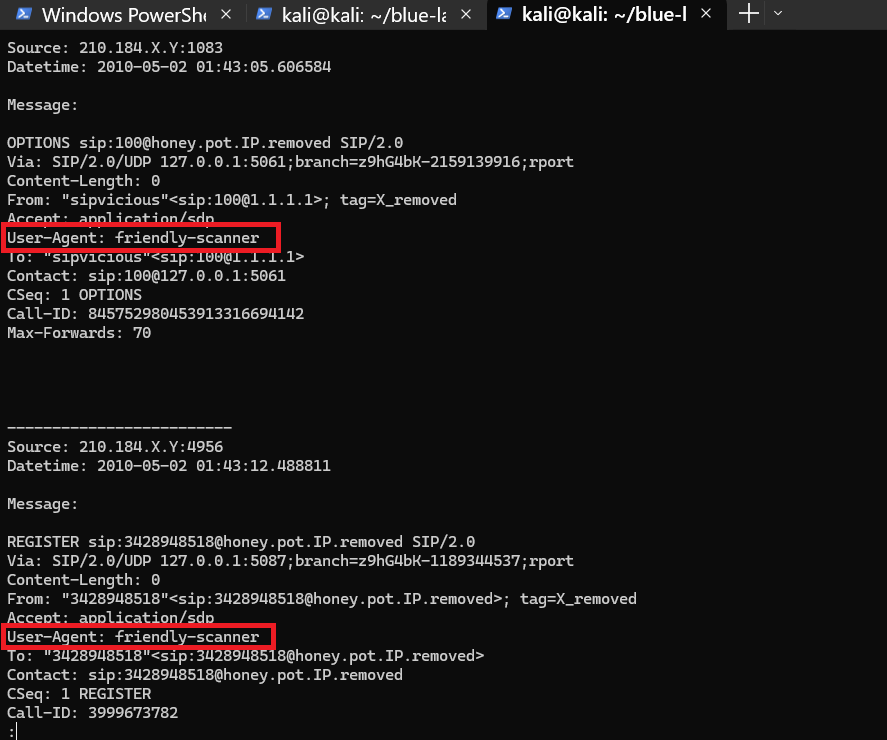
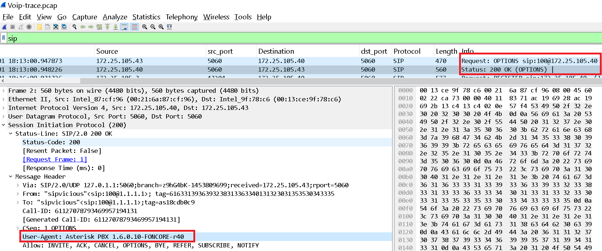
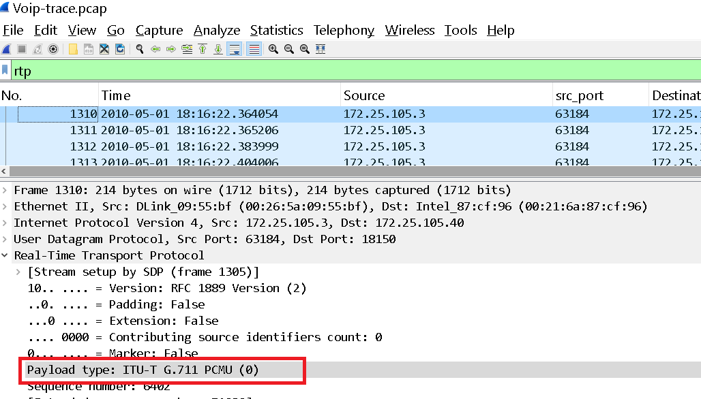
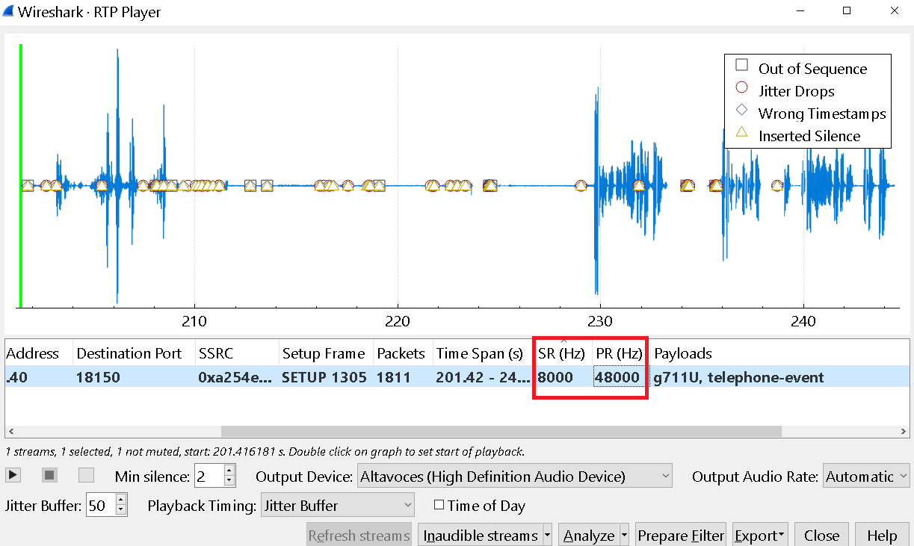
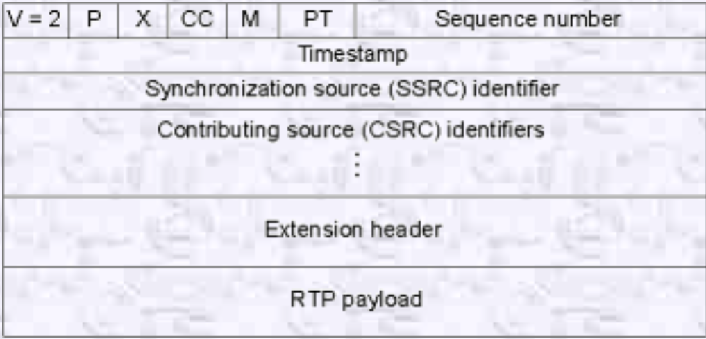

Se nos proporciona un fichero .pcap y uno que contiene lo que parecen ser logs, empezamos nuestro análisis con zeek para que tengamos una visioón general de la captura:

```bash 
┌──(kali㉿kali)-[~/blue-labs/voip/pcap]
└─$ docker run -v $(pwd):/mnt -it zeek/zeek sh
# cd /mnt
# bash
root@daf2804e2798:/mnt# ls
Voip-trace.pcap
root@daf2804e2798:/mnt# zeek -r Voip-trace.pcap
root@daf2804e2798:/mnt# ls
Voip-trace.pcap  analyzer.log  conn.log  dpd.log  files.log  http.log  packet_filter.log  sip.log  weird.log
root@daf2804e2798:/mnt#
```

Perfecto, estás entrando en un terreno muy interesante del análisis de tráfico relacionado con VoIP (Voice over IP). Vamos a analizar cada uno de esos archivos que mencionas y, en particular, explicarte qué son `SIP`, `DPD` y `VoIP-trace`.

---

## 1. **SIP (`sip.log`)**

**SIP (Session Initiation Protocol)** es un protocolo de señalización utilizado en VoIP para **establecer, modificar y finalizar sesiones de comunicación** (como llamadas de voz y video a través de Internet).

### Características clave:

* Usa principalmente **puerto UDP 5060**.
* No transmite voz directamente, solo se encarga de **negociar la llamada** (quién llama, a quién, desde qué IP/puerto, codecs, etc.).
* Se combina con **RTP (Real-time Transport Protocol)** para transmitir el audio/video.

### Ejemplo de uso:

```text
INVITE sip:bob@192.168.1.5 SIP/2.0
From: Alice <sip:alice@192.168.1.2>
```

Esto indica que Alice está invitando a Bob a iniciar una sesión VoIP.

Zeek extrae información como:

* ID de llamada (Call-ID)
* Usuarios origen/destino
* Mensajes SIP como `INVITE`, `ACK`, `BYE`
* Estados de la llamada

## 2. **DPD (`dpd.log`)**

**DPD (Dynamic Protocol Detection)** es un sistema que utiliza Zeek para **detectar dinámicamente qué protocolo se está usando** en una conexión, **sin depender del número de puerto**.

Esto es útil porque, por ejemplo:

* HTTP puede ir por un puerto distinto al 80.
* SIP puede usar puertos no estándar.

Este log registra:

* Qué protocolo se detectó dinámicamente.
* Qué servicio esperaba Zeek según el puerto.
* Si hubo conflicto o no.


Sabiendo esto, podemos pasar a las preguntas.

---

<h3 style="color: #0d6efd;">Q1. ¿Cuál es el protocolo de transporte utilizado? </h3>

Se utiliza UDP en VoIP porque:

1. **Baja latencia**: UDP omite el establecimiento de conexión y la confirmación de recepción, evitando retrasos de ida y vuelta (RTT) que en tráfico de voz, donde cada paquete suele tener un tamaño de 20 ms, resultan inaceptables en términos de calidad percibida.
2. **Sin retransmisiones**: Al no retransmitir paquetes perdidos, se evita el “jitter” y la acumulación de retrasos; en VoIP es preferible perder un paquete de audio puntual a retrasar toda la conversación.
3. **Menor sobrecarga**: El encabezado UDP (8 bytes) es más ligero que el TCP (20 bytes más opciones), reduciendo el consumo de ancho de banda en cada paquete RTP.
4. **Control de calidad en capa superior**: Protocolos como RTP gestionan el orden y la sincronización de paquetes, dejando a UDP la tarea de transporte simple y eficiente.

----

<h3 style="color: #0d6efd;">Q2. El atacante utilizó varias herramientas de escaneo que pertenecen a la misma suite. Indique el nombre del conjunto.</h3>

Revisando el fichero `log.txt` podemos ver lo siguiente: 



SIPVicious es un conjunto de herramientas de código abierto diseñado para auditar la seguridad de sistemas VoIP basados en SIP. Incluye, entre otros:
Esta utilidad se compone de 5 herramientas muy útiles en este tipo de auditorias:

- svmap -> se trata de un escaner de dispositivos SIP. Permite escanear una única IP o una red completa. Descubre hosts con puerto SIP abierto mediante envíos de paquetes OPTIONS o INVITE.
- svwar -> escanea una centralita PBX buscando el numero de extensiones existentes y la protección de la cual disponen. Realiza “war-dialing” de extensiones y cuentas enviando peticiones REGISTER.
- svcrack -> se encarga de intentar obtener las contraseñas utilizadas en las diferentes extensiones descubiertas. Tiene la posibilidad también de realizar un ataque por diccionario.
- svreport -> se trata de una herramienta de reporte. Permite administrar las sesiones creadas por el resto de herramientas de la suite y exportar los resultados en diferentes formatos como son pdf, xml, csv y texto plano.
- svcrash -> responde a los mensajes SIP obtenidos con svwar y svcrack con un mensaje que provoca que se bloqee al atacante. Se trata de una herramienta muy útil para contrarestar los ataques realizados con esta utilidad.

“friendly-scanner” es el User-Agent que emplea SIPVicious cuando envía solicitudes SIP REGISTER para sondear redes VoIP. Puede operar en modo ligero (una petición cada hora) o en modo agresivo (más de 80 REGISTER/s), llegando incluso a provocar una denegación de servicio si se configura sin control de ritmo.

---

<h3 style="color: #0d6efd;"> </h3>

Bien, ya sabemos que se trata de un escaneo, filtramos por `sip` que es el protocolo que se usa aquí: 



- Asterisk PBX
  Es una plataforma de código abierto (Open Source) para comunicaciones VoIP (telefonía IP), muy usada como centralita (PBX)[1].

- 1.6.0.10
  Indica la versión exacta de Asterisk. La serie 1.6 fue lanzada en 2009–2010 y alcanzó el “feature freeze” en 2011; la sub-versión 1.6.0.10 incluye correcciones menores y actualizaciones de seguridad liberadas alrededor de abril de 2010[2].

- FONCORE
  Es el nombre de una distribución o “fork” de Asterisk mantenida por el proyecto Foncore (ahora parte de Fonvirtual). Estas distribuciones suelen integrar módulos o parches específicos, por ejemplo conectividad a gateways analógicos/digitales o mejoras en el Web-GUI.

- r40
  Corresponde al “revision number” del repositorio interno de Foncore. El sufijo r40 significa que es la revisión 40 de ese mantenimiento personalizado (es decir, van 39 commits/parches aplicados sobre la rama 1.6.0.10 base).

---

<h3 style="color: #0d6efd;">Q4. ¿Qué herramienta se utilizó unicamente contra las siguientes extensiones: 100,101,102,103, y 111?</h3>

En el contexto de VoIP y de una centralita SIP, una **extensión** es simplemente un identificador interno —normalmente un número— que representa a un usuario o un dispositivo registrado en la PBX. Funciona así:

1. **Identificador de usuario**
   Cada teléfono IP, softphone o gateway se da de alta usando un “username” (extensión) y una contraseña. Por ejemplo, la extensión **100** puede corresponder al terminal del departamento de Finanzas, la **101** a Recepción, etc.

2. **URI SIP**
   Cuando un dispositivo quiere llamar o registrarse, construye una dirección SIP así:

   ```
   REGISTER sip:100@midominio.local SIP/2.0
   INVITE sip:101@midominio.local SIP/2.0
   ```

   Ahí, el “100” u “101” es la extensión.

3. **Mapeo interno**
   La PBX traduce esa extensión a una dirección IP/puerto y la asocia a un buzón de voz, un grupo de llamada o una ruta de salida.

4. **Usos en escaneo**

   * En un war-dialing envias REGISTER a una lista de extensiones (100, 101, 102…) para ver cuáles existen.
   * En un OPTIONS preguntas por capacidades (“¿estás activo?”) a cada extensión.

5. **Analogía**
   Es como el número de interno de un empleado en una empresa: tú marcas “100” y tu PBX sabe que debe conectar esa llamada al teléfono físico o softphone de ese usuario.

Con esto, cada “extensión” es la forma de nombrar y direccionar a un endpoint dentro de tu sistema VoIP.


Sabiendo esto, podemos usar las pistar, nos sugieren revisar las herramientas, en este caso, su código, y dentro del código de `svcrack.py`:

```python
def makeRequest(method, fromaddr, toaddr, dsthost, port, callid, srchost='', branchunique=None, cseq=1,
    auth=None, localtag=None, compact=False, contact='sip:123@1.1.1.1', accept='application/sdp', contentlength=None,
    localport=5060, extension=None, contenttype=None, body='', useragent='friendly-scanner', requesturi=None):
Because of the useragent variable, which match logged user-agent inside log.txt, we can answer svcrack.py.
```

Y por lo que vemos en el `log.txt`, que tiene el mismo user agent que el que vemos en el código de `svcrack.py`, podemos afirmar esto. 

---

<h3 style="color: #0d6efd;">Q5. ¿Qué extensión del honeypot NO requiere autenticación? </h3>


Bien, para esto podemos aplicar el siguiente filtro: 
```bash 

```

Y vemos líneas como la siguiente: 

```text
Authorization: Digest username="102",
               realm="localhost",
               nonce="2932135223",
               uri="sip:honey.pot.IP.removed",
               response="MD5_hash_removedXXXXXXXXXXXXXXXX",
               algorithm=MD5
```

…no es más que la **cabecera SIP de autenticación Digest** que el dispositivo con extensión **102** envía cuando quiere completar su registro (REGISTER) tras recibir un reto `401 Unauthorized`. En otras palabras:

* **Authorization:** indica que este mensaje lleva credenciales.
* **Digest**: el esquema de autenticación (igual que en HTTP).
* **username="102"**: la extensión (usuario) que se está autenticando.
* **realm, nonce, uri, response, algorithm**: parámetros del protocolo Digest que permiten al servidor verificar que efectivamente conoces la contraseña sin enviarla en claro.

La única extensión que no vemos es la `100`, por lo que ésta no requiere. 

---

<h3 style="color: #0d6efd;">Q6. ¿Cuántas extensiones se han escaneado en total? </h3>


Esto lo logré con el siguiente script: 

```bash 
┌──(kali㉿kali)-[~/blue-labs/voip]
└─$ cat log.txt | grep "User-Agent: friendly-scanner" -A2 | grep "honey" | cut -d '"' -f2 | grep -v Contact | sort -u | wc -l
2652
```


1. **`cat log.txt`**
   Emite todo el contenido de tu fichero de logs.

2. **`grep "User-Agent: friendly-scanner" -A2`**
   Filtra únicamente las líneas que contienen el encabezado

   ```
   User-Agent: friendly-scanner
   ```

   y las **2 líneas siguientes** (opción `-A2`), que en el formato de log incluyen el campo `To:` o la línea de la petición REGISTER donde aparece la extensión.

3. **`grep "honey"`**
   De ese bloque de 3 líneas (User-Agent + 2 líneas), deja solo las que contienen la cadena `honey`, es decir, las que tienen la URI destino `sip:<extensión>@honey.pot.IP.removed`.

4. **`cut -d '"' -f2`**
   Divide cada línea por comillas (`"`) y extrae el **segundo** campo (`-f2`).
   En tu log, la línea es algo como:

   ```
   To: "102"<sip:102@honey.pot.IP.removed>
   ```

   y al partir por comillas obtiene `102`.

5. **`grep -v Contact`**
   Descarta (`-v`) cualquier línea que contenga la palabra `Contact`, para evitar capturar las cabeceras `Contact: "..."`.

6. **`sort -u`**
   Ordena alfabéticamente (`sort`) y elimina duplicados (`-u`), dejándote solo **una vez cada** extensión.

7. **`wc -l`**
   Cuenta el número de líneas resultantes, que coincide con el **total de extensiones distintas** que fueron escaneadas por `friendly-scanner`.


---

<h3 style="color: #0d6efd;">q7. Hay una traza para un cliente SIP real. ¿Cuál es el agente de usuario correspondiente? (dos palabras, un espacio entre ellas)</h3>

Esto lo hacemos con el siguiente comando:

```bash 
┌──(kali㉿kali)-[~/blue-labs/voip]
└─$ grep -Ei 'User-Agent:' log.txt|uniq
User-Agent: friendly-scanner
User-Agent: Zoiper rev.6751
```

O con:

```bash 
┌──(kali㉿kali)-[~/blue-labs/voip]
└─$ grep -v "User-Agent: friendly-scanner" log.txt

-------------------------
Source: 89.42.194.X:47357
Datetime: 2010-05-05 10:01:48.058434

Message:

REGISTER sip:honey.pot.IP.removed;transport=UDP SIP/2.0
Via: SIP/2.0/UDP 89.42.194.X:47357;branch=z9hG4bK-d8754z-6d7ce863ce784e7d-1---d8754z-
Max-Forwards: 70
Contact: <sip:100@89.42.194.X:47357;rinstance=40ab3fc74606e4e6;transport=UDP>;expires=0
To: "Unknown"<sip:100@honey.pot.IP.removed;transport=UDP>
From: "Unknown"<sip:100@honey.pot.IP.removed;transport=UDP>;tag=X_removed
Call-ID: NDZlYTcyYzQwYWVkYTg5NTAyMjZiNGE2ZjBiY2ZiOTA.
CSeq: 2 REGISTER
Allow: INVITE, ACK, CANCEL, BYE, NOTIFY, REFER, MESSAGE, OPTIONS, INFO, SUBSCRIBE
User-Agent: Zoiper rev.6751
Allow-Events: presence
Content-Length: 0

-------------------------
```

Zoiper rev.6751 es una versión específica del software Zoiper, un softphone VoIP (Voz sobre IP) que permite realizar llamadas de voz y video a través de internet.

---

<h3 style="color: #0d6efd;">Q8. Se han marcado varios números de teléfono del mundo real. ¿Cuál fue el último número de 11 dígitos marcado desde la extensión 101?</h3>

Esto se puede hacer con los siguientes comandos: 

```bash 
┌──(kali㉿kali)-[~/blue-labs/voip]
└─$ grep -Ei 'From: "Unknown"<sip:101' log.txt -B8|grep INVITE
INVITE sip:900114382089XXXX@honey.pot.IP.removed;transport=UDP SIP/2.0
INVITE sip:00112322228XXXX@honey.pot.IP.removed;transport=UDP SIP/2.0
INVITE sip:00112524021XXXX@honey.pot.IP.removed;transport=UDP SIP/2.0
```

```bash 
┌──(kali㉿kali)-[~/blue-labs/voip]
└─$ cat log.txt | grep -v "User-Agent: friendly-scanner" | grep "CSeq: 1 INVITE" -B7
```

En SIP, cada método tiene una finalidad distinta:

* **REGISTER** se usa para que un endpoint (“extensión”) se autentique y registre su ubicación (IP/puerto) en la PBX.
* **OPTIONS** pregunta por las capacidades o el estado de otro endpoint sin iniciar una llamada.
* **INVITE** es el **único** método con el que realmente se **inicia** una sesión de llamada: contiene el URI destino con el número marcado y, opcionalmente, la descripción de la sesión (SDP) para acordar códecs y puertos RTP.

Por eso, si el objetivo es extraer **los números de teléfono reales** que se marcaron desde la extensión 101, **solo** los mensajes **INVITE** llevan esa información en la Request-URI:

```
INVITE sip:00112524021XXXX@honey.pot.IP.removed;transport=UDP SIP/2.0  
```

Filtrando por `INVITE` se asegura de:

1. **Capturar exclusivamente** las solicitudes de **inicio de llamada**, sin el “ruido” de registros (REGISTER) ni sondas (OPTIONS),
2. **Obtener** la parte de la URI que indica el número marcado (lo que buscas),
3. **Mantener contexto** cronológico para identificar cuál fue la **última** INVITE válida con un número de 11 dígitos.

En resumen, se aíslan los **INVITE** porque son los únicos mensajes SIP que realmente contienen el número de teléfono al que se está llamando.

---

<h3 style="color: #0d6efd;">Q9. ¿Cuáles son las credenciales por defecto utilizadas en el intento de autenticación básica? (el formato es nombre de usuario:contraseña) </h3>

Esto lo logramos con el filtro

```bash 
http contains "Authorization: Basic"  
```

En HTTP Basic Authentication las credenciales viajan en la cabecera Authorization codificadas en Base64, precedidas de la palabra clave Basic. Al aplicar ese filtro en Wireshark (o tshark) obtienes directamente todos los paquetes que llevan intento de autenticación HTTP Basic.

Podemos usar también `http.authbasic`

O con tshark: 

```bash 
┌──(kali㉿kali)-[~/blue-labs/voip]
└─$ tshark -r pcap/Voip-trace.pcap -Y http.authbasic -T fields -e http.authbasic  | head -n 1
maint:password
```

---

<h3 style="color: #0d6efd;">Q10. ¿Qué códec utiliza el flujo RTP? (3 palabras, 2 espacios entre ellas) </h3>

Un **codec** (coder-decoder) en un flujo RTP es el algoritmo que comprime y descomprime la señal de voz para enviarla por paquetes IP. Define:

1. **Formato de codificación**: cómo se transforma la onda de audio en datos binarios.
2. **Tasa de bits**: cuántos kilobits por segundo se usan (por ejemplo, 64 kbps para G.711).
3. **Calidad y retraso**: diferentes codecs equilibran compresión frente a latencia y uso de ancho de banda.

En SIP/SDP el endpoint negocia el codec durante el **INVITE** (en el bloque SDP), y luego los paquetes RTP llevan ese payload type específico.

Filtrando por `RTP` e inspeccionando cualquier paquete podemos encontrarlo: 



---

<h3 style="color: #0d6efd;"> </h3>

El **tiempo de muestreo** (sampling time) es el intervalo de tiempo que transcurre entre dos muestras sucesivas de la señal de audio. En VoIP esto se aplica a dos niveles:

1. **Periodo de muestreo del codec**

   * Define cuántas veces por segundo el audio se “toma” y convierte en datos digitales.
   * Por ejemplo, si un codec opera a **8 kHz**, eso son 8000 muestras por segundo, es decir un **tiempo de muestreo de 1/8000 s = 0,125 ms** (125 μs) entre cada muestra.

2. **Intervalo de packetización (packetization interval)**

   * La mayoría de implementaciones agrupan varias muestras en cada paquete RTP.
   * Un valor muy común es **160 muestras por paquete**, que a 8 kHz ocupa **160/8000 s = 0,02 s = 20 ms** de audio por paquete.
   * A ese valor a veces se le llama también “sampling time” en análisis de RTP, porque es el tiempo de audio cubierto por cada paquete.

Esto lo podemos encontrar aplicando un filtro por `RTP`, luego en `Telephony->RTP->RTP Stream Analysis.`. En la ventana que nos sale, en la parte de abajo vamos `Play Streams`



En las columnas SR(Hz) y PR(Hz) se muestra la tasa de muestreo en Hz. Por lo tanto, toca realizar un cálculo de conversión de Hz a milisegundo.

1Hz. representa un ciclo por cada segundo, entendiendo por ciclo la repetición de un suceso.

1Hz = 1 segundo, y 1 segundo tiene 1.000 milisegundos.

Por lo tanto, la conversión quedaría de la siguiente manera (1/8000) * 1000 = 0,125.

---

<h3 style="color: #0d6efd;">Q12. ¿Cuál era la contraseña de la cuenta con el nombre de usuario 555? </h3>

Para esto podemos buscar en el fichero `sip_custom.conf`.

Pero como no lo tenemos, podemos realizar un ataque de fuerza bruta usando sipdump y sipcrack, que forman parte del conjunto de herramientas SIPVicious, orientadas a la auditoría de redes VoIP basadas en SIP:

sipcrack: toma el fichero con los hashes (hash.txt) y, usando un diccionario de contraseñas, trata de “crackear” cada Digest-response por fuerza bruta o diccionario.

sipdump: lee un fichero PCAP (Voip-trace.pcap), detecta automáticamente transacciones SIP (REGISTER con Digest, OPTIONS, INVITE, etc.) y extrae los campos de autenticación Digest (usuario, realm, nonce, URI y response) volcándolos en un fichero de texto (hash.txt).: 

```bash 
┌──(kali㉿kali)-[~/blue-labs/voip/pcap]
└─$ sipdump -p Voip-trace.pcap hash.txt

SIPdump 0.2
---------------------------------------

* Using pcap file 'Voip-trace.pcap' for sniffing
* Starting to sniff with packet filter 'tcp or udp'

* Dumped login from 172.25.105.40 -> 172.25.105.3 (User: '555')
* Dumped login from 172.25.105.40 -> 172.25.105.3 (User: '555')
* Dumped login from 172.25.105.40 -> 172.25.105.3 (User: '555')

* Exiting, sniffed 3 logins
```

Y usamos el rockyou: 

```bash 
┌──(kali㉿kali)-[~/blue-labs/voip/pcap]
└─$ sipcrack hash.txt -w /usr/share/wordlists/rockyou.txt

SIPcrack 0.2
----------------------------------------

* Found Accounts:

Num     Server          Client          User    Hash|Password

1       172.25.105.3    172.25.105.40   555     1ac95ce17e1f0230751cf1fd3d278320
2       172.25.105.3    172.25.105.40   555     aa533f6efa2b2abac675c1ee6cbde327
3       172.25.105.3    172.25.105.40   555     0b306e9db1f819dd824acf3227b60e07

* Select which entry to crack (1 - 3): 1

* Generating static MD5 hash... c3e0f1664fde9fbc75a7cbd341877875
* Loaded wordlist: '/usr/share/wordlists/rockyou.txt'
* Starting bruteforce against user '555' (MD5: '1ac95ce17e1f0230751cf1fd3d278320')
* Tried 1077 passwords in 0 seconds

* Found password: '1234'
* Updating dump file 'hash.txt'... done
```
---

<h3 style="color: #0d6efd;">Q11. ¿Qué campo de la cabecera del paquete RTP se puede utilizar para reordenar los paquetes RTP desincronizados en la secuencia correcta? </h3>




El campo **Timestamp** del encabezado RTP indica el instante de muestreo de la primera octeto del paquete dentro de la secuencia de la señal multimedia (por ejemplo, audio o vídeo). Se utiliza para reordenar y reproducir los paquetes de forma correcta por dos motivos principales:

1. **Referencia temporal al contenido**

   * Cada paquete RTP lleva un valor de timestamp que avanza de manera proporcional al número de muestras transmitidas (p. ej., a 8 kHz, el timestamp aumenta en 800 muestras cada 100 ms).
   * Aunque los paquetes lleguen fuera de orden o con variaciones de retraso (jitter), el timestamp refleja el orden real en que fueron capturados por el emisor.
   * El búfer de jitter compara los timestamps de los paquetes recibidos para colocarlos en la cola de reproducción según su hora original de muestreo, no según el orden de llegada.

2. **Sincronización y cálculo de playout**

   * Además de reordenar, el timestamp permite calcular exactamente **cuándo** debe reproducirse cada paquete.
   * Si dos paquetes RTP llegan con los mismos números de secuencia o con secuencias discontinuas, el timestamp asegura que el reproductor inserte silencios o rellenos apropiados para mantener la continuidad temporal de la señal.

### Ejemplo simplificado

Supongamos una transmisión de audio muestreado a 8 kHz (1 muestra = 1/8000 s):

| Paquete | Número de secuencia | Timestamp | Hora de muestreo (segundos) |
| ------- | ------------------- | --------- | --------------------------- |
| A       | 101                 | 16000     | 16000 / 8000 = 2,00 s       |
| B       | 102                 | 16800     | 16800 / 8000 = 2,10 s       |
| C       | 103                 | 17600     | 17600 / 8000 = 2,20 s       |

Si B y C llegan antes que A, el búfer de jitter:

1. Lee los timestamps: 2,10 s (B), 2,20 s (C) y 2,00 s (A).
2. Ordena los paquetes internamente: A → B → C.
3. Programa la reproducción: A a los 2,00 s, B a los 2,10 s, C a los 2,20 s.

De este modo, **el timestamp** garantiza tanto el orden **temporal** real de los datos como su **sincronía** al reproducir, independientemente de variaciones en la entrega de los paquetes.


----

<h3 style="color: #0d6efd;">12. El rastro incluye un mensaje secreto oculto. ¿Puedes oírlo? </h3>

Para esto aplicamos el filtro `rtp`, luego vamos a `Telephony > RTP > RTP Player`, en la ventana que sale le damos `Play Streams`, luego en la nueva ventana y le damos al botón de `play`. 


