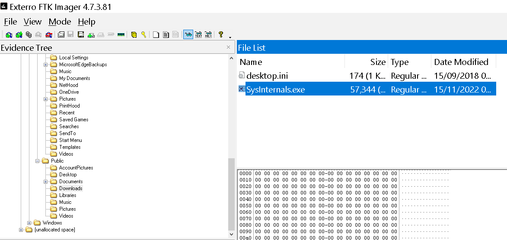
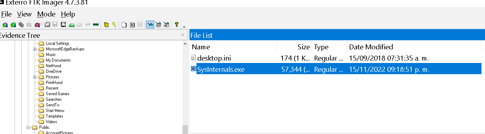
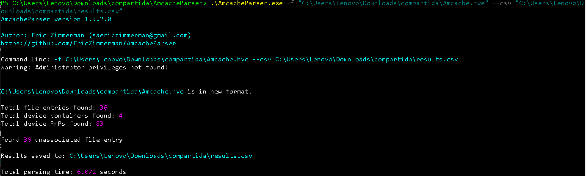
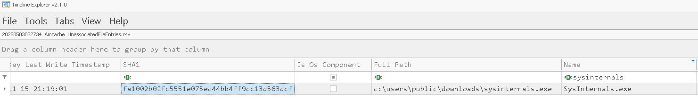
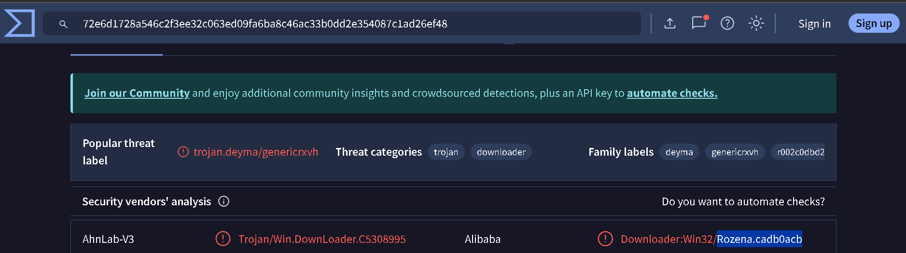
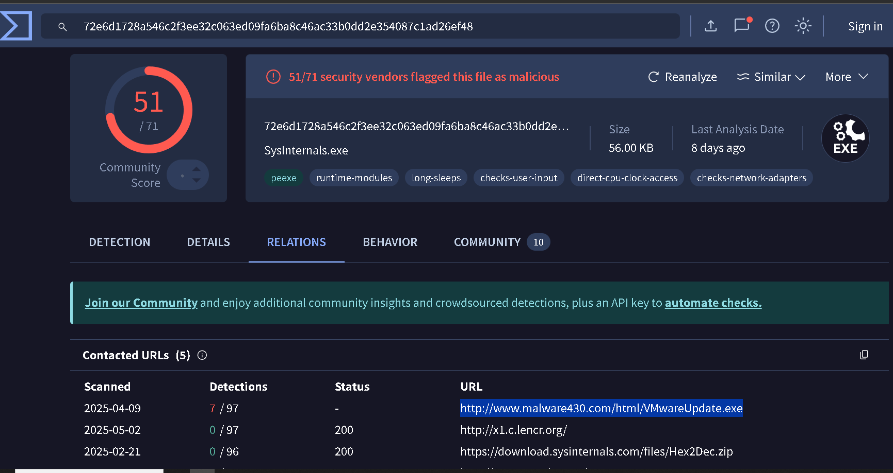
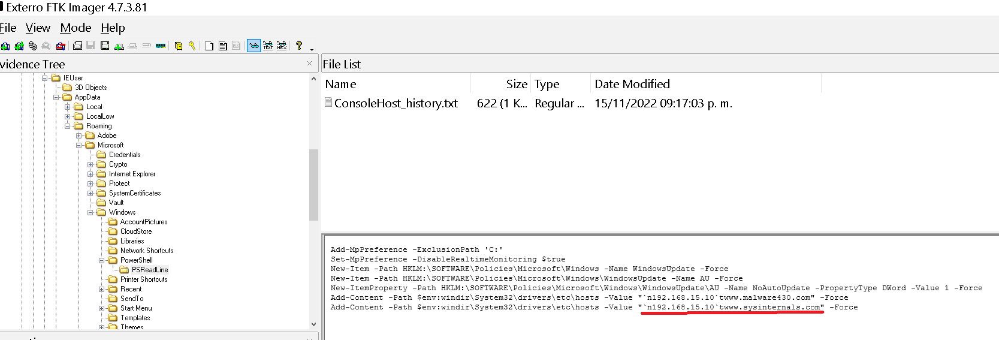
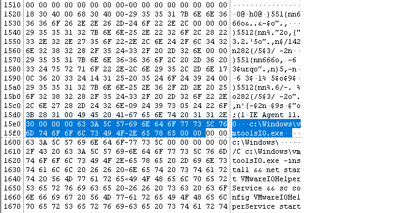
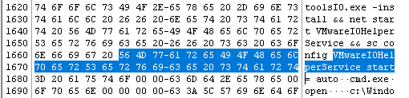

1. ¿Cuál era el nombre del archivo ejecutable malicioso que descargó el usuario?

Para encontrar esto podemos ir explorando lso directorios que nos proporciona el .E01, el ejecutable malicioso podemos encontrarlo en `Windows10>root>Users>Public>Downloads`



---
2. ¿Cuándo fue la última vez que se modificó el archivo ejecutable malicioso?

Esto ya se puede ver en la sección `last modified`, en la misma sección de la pregunta anterior.



---
3. ¿Cuál es el valor hash SHA1 del malware?

- Amcache.hve es un hive del Registro de Windows que almacena metadatos muy valiosos sobre ejecutables que han existido o sido invocados en el sistema.
- Introducido por Microsoft a partir de Windows 8.1 y presente en Windows 10/11.
- Su nombre completo en disco suele ser:

Esto sirve para: 
- Registro de actividad de aplicaciones: guarda rutas de archivos, marcas de tiempo (instalación, ejecución) y diversos hashes (SHA1, MD5, PE-Header hash).
- Persistencia tras borrado: incluso si el .exe se elimina, Amcache conserva su metadata.
- Correlación: puedes cruzar con Prefetch, ShimCache, Event Logs, y extraer artefactos para reconstruir cronologías.

**La encontramos en:**                                                                                                  ```                                                                                                                     C:\Windows\AppCompat\Programs\Amcache.hve                                                                               ```  

Click derecho en `Amcache.hve`, `exportfiles` y la vamos a analizar con la herramienta `AmcacheParser.exe` de **Eric Zimmerman**.

Usamos el siguiente comando para parsear: 



Y revisamos con la herramienta de `Timeline Explorer`, también de Zimmerman, aplicamos un filtro por nombre: 




---
4. Según el proveedor de Alibaba, ¿cuál es la familia del malware?

Analizamos el fichero en virustotal y vemos lo siguiente: 



Rozena es una **familia de malware de tipo backdoor sin archivos** (“fileless”) diseñada para sistemas Microsoft Windows. Sus principales características y modus operandi son:

* **Distribución y llegada al sistema**

  * Puede desplegarse a través de documentos maliciosos que explotan vulnerabilidades como **CVE-2022-30190 (Follina)**, descargándose desde servicios como el CDN de Discord y ejecutándose mediante `msdt.exe` y PowerShell.
  * También aparece como ejecutable disfrazado (por ejemplo, con icono de Word) que, al ejecutarse, crea y ejecuta múltiples scripts ofuscados en memoria.

* **Técnica “fileless”**

  * No deja en disco un binario persistente: utiliza PowerShell en memoria para descargar, descifrar e inyectar código malicioso directamente en procesos legítimos como `powershell.exe`.
  * Emplea varios pasos (CREATOR, DECODER, INJECTOR) para ocultar el payload final y saltarse controles de integridad.

* **Funcionalidad de backdoor**

  * Abre una **conexión inversa (reverse shell)** hacia un servidor de control (“C\&C”), lo que permite al atacante ejecutar comandos arbitrarios, transferir archivos o pivotar en la red interna de la víctima.
  * Suele usar técnicas de codificación polimórfica (por ejemplo, Shikata Ga Nai) para evadir detección.

* **Evolución histórica**

  * Registrado por primera vez en 2015 y renovado en 2018 con la adopción de la técnica fileless, ganando mayor sigilo frente a soluciones antivirus tradicionales. 

Basicamente, **Rozena** es un troyano de tipo backdoor que opera íntegramente en memoria, abusa de PowerShell y vulnerabilidades como Follina para permanecer oculto y otorgar al atacante **acceso remoto total** sobre sistemas Windows.

---
5. ¿Cuál es el nombre de dominio completo (FQDN) del primer dominio asignado?



La `URL` es: http://www.malware430.com/html/VMwareUpdate.exe

Lo que nos piden es: `www.malware430.com`

Una URL (Uniform Resource Locator) como

```
http://www.malware430.com/html/VMwareUpdate.exe
```

se compone de varias partes claramente delimitadas. A continuación te las describo:

| Componente              | Descripción                                                                                                                     | Ejemplo en tu URL                        |
| ----------------------- | ------------------------------------------------------------------------------------------------------------------------------- | ---------------------------------------- |
| **Esquema o protocolo** | Indica el protocolo de comunicación que usará el navegador o cliente para conectar con el servidor.                             | `http://` → HTTP (puerto 80 por defecto) |
| **FQDN (Host)**         | Fully Qualified Domain Name; combinación de subdominio y dominio registrado. Identifica de forma única al servidor en Internet. | `www.malware430.com`                     |
|  – Subdominio           | División lógica o servicio específico dentro del dominio principal.                                                             | `www`                                    |
|  – Dominio              | Nombre principal registrado.                                                                                                    | `malware430`                             |
|  – TLD                  | Top-Level Domain, la extensión de nivel superior, que define tipo o país.                                                       | `.com`                                   |
| **Puerto**              | Número de puerto de red para la conexión. Si no se especifica, se usa el predeterminado del protocolo (80 para HTTP).           | (implícito) `:80`                        |
| **Ruta (path)**         | Carpeta o estructura en el servidor donde reside el recurso solicitado.                                                         | `/html/`                                 |
| **Recurso (archivo)**   | Nombre del fichero o recurso final al que se accede. Puede incluir extensión y parámetros.                                      | `VMwareUpdate.exe`                       |
| **Cadena de consulta**  | (Opcional) Parámetros adicionales separados por `?` y `&` que se envían al servidor.                                            | (no aplica en esta URL)                  |
| **Fragmento**           | (Opcional) Referencia interna dentro del recurso, tras `#`.                                                                     | (no aplica en esta URL)                  |


### Desglose detallado de la URL

1. **Protocolo:**

   * `http://`
   * Significa que se usará **HTTP**, sin cifrado, a través del puerto 80 por defecto.

2. **Host (FQDN):**

   * `www.malware430.com`
   * **Subdominio:** `www`
   * **Dominio:** `malware430`
   * **TLD:** `.com`

3. **Ruta:**

   * `/html/`
   * Indica que el archivo está dentro de la carpeta “html” en la raíz del sitio web.

4. **Recurso:**

   * `VMwareUpdate.exe`
   * Nombre de un ejecutable Windows, que en este caso probablemente sea el malware disfrazado.


> **Nota:** el término **FQDN** (`www.malware430.com`) abarca tanto el nombre de host (`www`) como el dominio (`malware430.com`), garantizando una referencia única dentro del espacio de nombres de Internet.

---
6. El dominio mapeado está vinculado a una dirección IP. Cuál es esa dirección IP?

Ya sabemos que el malware en un trojano que ejecuta comandos en powershell,

**El directorio PSReadLine y el archivo ConsoleHost\_history.txt**

* **¿Qué es PSReadLine?**
  PSReadLine es un módulo para PowerShell (incluido por defecto desde Windows 10, PowerShell 5.1 en adelante) que mejora la experiencia en consola, aportando:

  * **Historial persistente** de los comandos ejecutados.
  * **Edición en línea** (movimiento por palabra, eliminar texto, etc.).
  * **Autocompletado** y sugerencias basadas en el historial.

* **Ubicación de los archivos**
  PSReadLine almacena su configuración y, sobre todo, el historial en un directorio dentro del perfil de usuario:

  ```
  Users\IEUser\AppData\Roaming\Microsoft\Windows\PowerShell\PSReadLine
  ```

  Allí se encuentran varios archivos, entre ellos:

  * `ConsoleHost_history.txt`
  * `ConsoleHost_history.txt.config`
  * Posiblemente backups o archivos temporales.

* **¿Qué contiene ConsoleHost\_history.txt?**

  * Es un archivo de texto plano (`.txt`), **una línea por cada comando** que se ha ejecutado en la sesión de PowerShell.
  * Se **guarda al cerrar** la consola (o periódicamente), de modo que persiste entre reinicios.
  * Cada línea incluye exactamente la cadena del comando (por ejemplo, `Get-Process`, `Invoke-WebRequest http://…`, etc.), **sin timestamps** ni metadatos extra.



---
7. ¿Cuál es el nombre del ejecutable descartado por el ejecutable de la primera fase?

Esto en teoría debería estar en el fichero que reportamos en la pregunta 1, pero como está corrupto(para hacerlo más dificil), podemos encontrar este mismo ejecutable en la siguiente ruta: 

```txt
Users/IEUser/AppData/Local/Packages/Microsoft.MicrosoftEdge_8wekyb3d8bbwe/AC/#!001/MicrosoftEdge/Cache/WMFWC1O7/SysInternals[1].exe
```

En el mismo FTK imager, podemos hacer click en el fichero, `control + f` para aplicar una búsqueda, buscamos por `.exe` y vemos lo siguiente: 



---
9. ¿Cuál es el nombre del servicio instalado por el ejecutable de la segunda fase?

Seguimos con el ejecutable de la pregunta pasada, revisando el comando vemos lo siguiente. 




