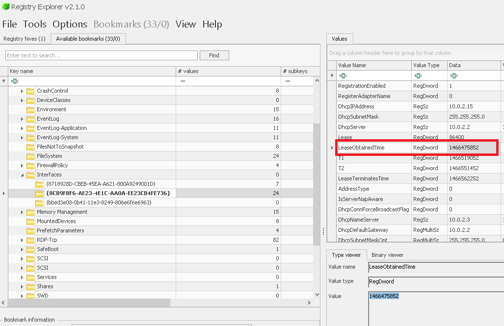
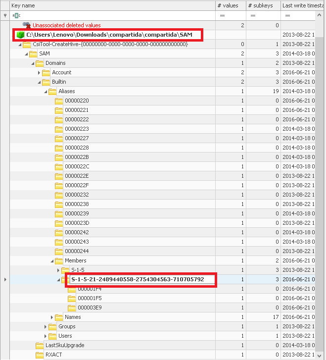
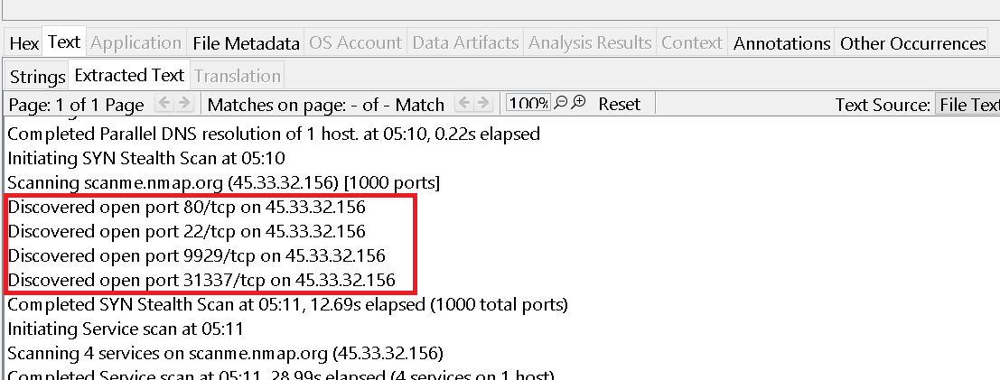
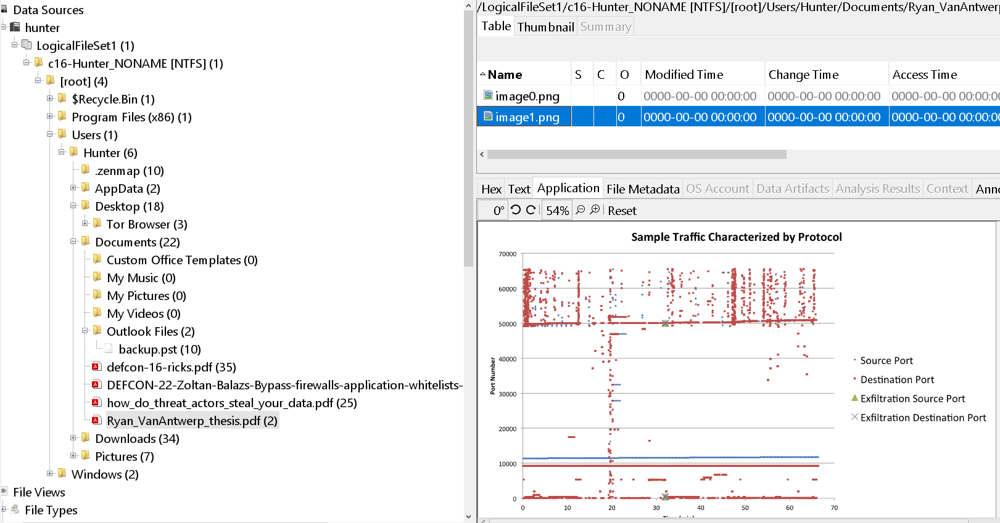
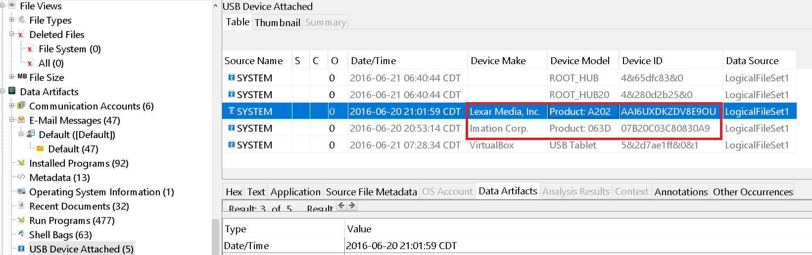

Para este laboratorio se nos da un fichero `.ad1`, un archivos de imagen relacionado con el Forensic Toolkit FTK Imager Image

Lo  abrimos con `FTK Imager` y podemos empezar a responder las preguntas:


---
<h3 style="color: #0d6efd;">Q1. What is the computer name of the suspect machine? </h3>

Para esto podemos descargarnos la "hive" SYSTEM, que contiene la configuración de hardware, drivers, servicios, “Control Sets”...

Lo obtenemos en la siguiente ruta del .ad1: `Windows\System32\config\SYSTEM`

Lo descargamos, lo cargamos en Registry Explorer de Zimmerman y en `ComputerName` vemos la respuesta:


Otas hives importante:

- SOFTWARE: información de software y componentes instalados.
- SAM: cuentas de usuario y grupos locales.
- SECURITY: políticas de seguridad.

---

<h3 style="color: #0d6efd;">Q2. What is the computer IP? </h3>

En esta misma hive, en la sección de interfaz, podemos ver la configuración de red y la dirección ip que el servidor dhcp le asignó al equipo que investigamos:


----

<h3 style="color: #0d6efd;">Q3. What was the DHCP LeaseObtainedTime? </h3>

Esto lo encontramos también en la misma sección de interfaz:



Está en formato UNIX epoch (número de segundos desde el 1 de enero de 1970 UTC).
Podemos convertirlo de la siguiente forma con linux:

```bash
┌──(kali㉿kali)-[~/blue-labs/hunter/temp_extract_dir/c16-Hunter]
└─$ date -u -d @1466475852
Tue Jun 21 02:24:12 AM UTC 2016
```

También podríamos hacerlo con `DCode`

----

<h3 style="color: #0d6efd;">Q4. What is the computer SID? </h3>

Esto lo podemos ver en la hive `SAM`, después de cargarlo en Regsitry Explorer:



---

<h3 style="color: #0d6efd;">Q5. What is the Operating System(OS) version? </h3>

Esto podemos verlo cargando la hive `Software` en Registry Explorer, en `Microsoft > Microsoft NT > CurrentVersion`


---

<h3 style="color: #0d6efd;">Q6. What was the computer timezone? </h3>

Podemos ver esto en la hive `SYSTEM`, en la ruta `ControlSet001 > Control > TimeZoneInformation`


La hora estándar del Pacífico (**PST**, por *Pacific Standard Time*) está **desfasada 8 horas menos respecto a UTC**, es decir:

> **PST = UTC - 8 horas**

### Ejemplo:

Si en UTC son las **18:00 (6:00 PM)**, en **PST** serán:

> 18:00 - 8 = **10:00 (10:00 AM)** PST

### Nota adicional:

Durante el horario de verano en EE.UU. se utiliza **PDT** (*Pacific Daylight Time*), que está desfasado **7 horas menos** con respecto a UTC:

> **PDT = UTC - 7 horas**

Este cambio ocurre típicamente entre **marzo y noviembre**.

----

<h3 style="color: #0d6efd;">Q7. How many times did this user log on to the computer? </h3>

En la hive `SAM` podemos encontrar esto:


Igual podemos exportar el fichero c16-Hunter.NONAME[NIFTS] de FTK imager y la subimos a Autopsy. 
En la sección de OS Accounts, ya conocemos el SID del usuario que estamos analizando: 


----

<h3 style="color: #0d6efd;">Q8. When was the last login time for the discovered account? Format: one-space between date and time </h3>

Para esto, exportamos el fichero c16-Hunter.NONAME[NIFTS] de FTK imager y la subimos a Autopsy.

En la sección de OS Accounts, ya conocemos el SID del usuario que estamos analizando:


Este formato `CDT` solo le añadimos 5 horas para convertirlo a UTC: 

```txt
2016-06-20 20:42:40 + 5 horas = 2016-06-21 01:42:40 UTC
```

O con la terminal: 

```bash 
Lenovo@DESKTOP-8IOU1HC MINGW64 ~/Desktop
$ date -d '2016-06-20 20:42:40 +5 hours' -u
Mon Jun 20 16:42:40 UTC 2016
```

----

<h3 style="color: #0d6efd;">Q9. There was a “Network Scanner” running on this computer, what was it? And when was the last time the suspect used it? Format: program.exe,YYYY-MM-DD HH:MM:SS UTC </h3>

Lo podemos ver en `Run Programs`: 


Zenmap, la versión gráfica de nmap. Convertimos la fecha a UTC sumando 5 horas. 

------

<h3 style="color: #0d6efd;">Q10. When did the port scan end? (Example: Sat Jan 23 hh:mm:ss 2016) </h3>

En el escritorio del usuario encontramos lo que parece ser el resultado de un escaneo hecho con nmap, en formato xml, la opción -oX <archivo.xml>


Vemos la fecha en la que terminó el escaneo. 

------

<h3 style="color: #0d6efd;">Q11. How many ports were scanned? </h3>

Lo podemos ver enlas opciones de escaneo:


----

<h3 style="color: #0d6efd;">Q12. What ports were found "open"?(comma-separated, ascending) </h3>




--------

<h3 style="color: #0d6efd;">Q13. What was the version of the network scanner running on this computer? </h3>


----

<h3 style="color: #0d6efd;">Q14. The employee engaged in a Skype conversation with someone. What is the skype username of the other party? </h3>

Esto lo podemos ver desde 2 rutas en Autopsy: 

`Data > E-Mail Messages > Default > Default`


En este correo, el usuario `linux-rul3z` menciona una reunión por zoom. 

O en: 

`logicalFileSet1 > c16-Hunter >root > users > Hunter > AppData >> Roaming >> Skype > Hunterehpt >Extract file main.db`

-----

<h3 style="color: #0d6efd;">Q15. ¿Cuál es el nombre de la aplicación que ambas partes acordaron utilizar para exfiltrar datos y proporcionar acceso remoto al atacante externo en su conversación de Skype? </h3>

Siguiendo lo que se habla en los correos, parece que usarán TeamViewer: 


-----

<h3 style="color: #0d6efd;">Q16. What is the Gmail email address of the suspect employee? </h3>

La respuesta el el correo que envió el correo de la pregunta anterior. 

-----

<h3 style="color: #0d6efd;">Q17. It looks like the suspect user deleted an important diagram after his conversation with the external attacker. What is the file name of the deleted diagram? </h3>

Esto lo encontramos en la siguiente ruta: 

```bash 
logicalfileset1 > c16-Hunter > root > Users > [usuario] > Documents > Outlook Files
```

es un archivo de datos de Outlook que contiene correos electrónicos, contactos, calendarios, tareas y archivos adjuntos. Su extensión .pst significa Personal Storage Table, y es utilizado por Microsoft Outlook para almacenar localmente toda esa información, especialmente en configuraciones POP3 o cuando se hace un respaldo manual.


-----

<h3 style="color: #0d6efd;">Q18. The user Documents' directory contained a PDF file discussing data exfiltration techniques. What is the name of the file? </h3>

En esta misma ruta podemos ver varios pdf, parece que se trata del Ryan_VanAntwerp_thesis.pdf



-----

<h3 style="color: #0d6efd;">Q19. What was the name of the Disk Encryption application Installed on the victim system? (two words space separated) </h3>

Yendo a la ruta de `Program Files` vemos algo bastante interesante: 


BCWipe es una herramienta de borrado seguro de datos desarrollada por Jetico Inc., utilizada para eliminar archivos de manera que no puedan ser recuperados, ni siquiera con técnicas forenses avanzadas.

Crypto Swap es una función avanzada de BCWipe que cifra el archivo de intercambio (swap file) en lugar de solo limpiarlo. Esto es importante porque el archivo de intercambio puede contener:

- Fragmentos de contraseñas.
- Conversaciones.
- Documentos abiertos.
- Datos de memoria RAM que se "descargan" al disco.

En lugar de simplemente sobrescribirlo al apagar el sistema, Crypto Swap cifra el contenido dinámicamente mientras se usa, proporcionando protección en tiempo real de la información que pasa por el espacio de intercambio.

------

<h3 style="color: #0d6efd;">20. What are the serial numbers of the two identified USB storage? </h3>

En `USB Device Attached` vemos lo siguiente: 



El resto son dispositivos virtuales o hubs del sistema, que son componentes internos del controlador USB del sistema operativo. No son dispositivos físicos conectados como un pendrive o disco externo, sino partes del hardware interno que gestionan los puertos USB.

Cuando se conecta un dispositivo USB a un computador:

- El sistema operativo (Windows, por ejemplo) detecta primero el controlador raíz USB, que se representa como ROOT_HUB o ROOT_HUB20.
- Estos "hubs" actúan como intermediarios entre el hardware del sistema y los dispositivos USB.
- Luego se registra el dispositivo real (por ejemplo, una memoria Lexar o Imation), conectado a través de ese hub.

> También se puede encontrar en la hive SYSTEM, en USB. 

-----

<h3 style="color: #0d6efd;">21. One of the installed applications is a file shredder. What is the name of the application? (two words space separated) </h3>

Ya sabemos que se trata de Jetico BCwipe.

Igual podríamos verlo en FTK imager, en `Program Files > Jetico > BCWipe > wipelist.txt`

----

<h3 style="color: #0d6efd;">Q22. How many prefetch files were discovered on the system? </h3>

Primero, en FTK exportamos el prefetch en la ruta: 

Lluego cargamos ese contenido en `WinPrefecthView` en `Options → Advanced Options → Choose file`


Si no contamos los que tienen contenido, nos quedan 174. 

----

<h3 style="color: #0d6efd;">Q23. How many times was the file shredder application executed? </h3>

Revisando  este prefetch contamo 5 ejecuciones cd BCWipe.exe.


----

<h3 style="color: #0d6efd;">Q24. Using prefetch, determine when was the last time ZENMAP.EXE-56B17C4C.pf was executed? </h3>


Más 5 horas, que ya sabemos que está en formato `CDT`.

-----

<h3 style="color: #0d6efd;">Q25. A JAR file for an offensive traffic manipulation tool was executed. What is the absolute path of the file? </h3>

Un fichero .jar (Java ARchive) es un archivo comprimido que se utiliza para empaquetar múltiples archivos relacionados con una aplicación Java, como clases, bibliotecas y recursos (imágenes, configuración, etc.), en un solo archivo ejecutable o reutilizable.

Buscando en `Downloads` en Autopsy: 


----

<h3 style="color: #0d6efd;">Q26. The suspect employee tried to exfiltrate data by sending it as an email attachment. What is the name of the suspected attachment? </h3>

Volviendo a los correos electrónicos, vemos que hay un fichero adjunto. 


---

<h3 style="color: #0d6efd;">Q27. Shellbags shows that the employee created a folder to include all the data he will exfiltrate. What is the full path of that folder? </h3>

Las ShellBags son artefactos forenses del sistema operativo Windows que registran información sobre carpetas que el usuario ha navegado o abierto usando el Explorador de archivos (Windows Explorer). Aunque a simple vista puede parecer un detalle trivial, en análisis forense pueden ser una fuente valiosa de evidencia sobre la actividad del usuario.

Navegando a esta sección en autopsy vemos un directorio con un nombre bastante descriptivo relacionado con el fichero en el que se exfiltraron los datos: 


-----

<h3 style="color: #0d6efd;">Q28. The user deleted two JPG files from the system and moved them to $Recycle-Bin. What is the file name that has the resolution of 1920x1200? </h3>

El directorio $Recycle.Bin (antes llamado Recycler en versiones antiguas de Windows) es el contenedor del sistema operativo Windows donde se almacenan los archivos eliminados por los usuarios, es decir, la Papelera de reciclaje.

Explorando el $Recycle-Bin: 


Explorando el directorio de imágines nos encontramos la imagen: 


-----

<h3 style="color: #0d6efd;">Q29. Provide the name of the directory where information about jump lists items (created automatically by the system) is stored? </h3>

En Windows, las Jump Lists son esas listas de “elementos recientes” o “más usados” que aparecen al hacer clic derecho sobre un icono en la barra de tareas o en el menú Inicio. Se generan automáticamente para acelerar el acceso a archivos, carpetas o tareas frecuentes asociadas a cada aplicación.

En Windows, las **Jump Lists** son esas listas de “elementos recientes” o “más usados” que aparecen al hacer clic derecho sobre un icono en la barra de tareas o en el menú Inicio. Se generan **automáticamente** para acelerar el acceso a archivos, carpetas o tareas frecuentes asociadas a cada aplicación.

Windows guarda la información de las Jump Lists en tu perfil de usuario, concretamente en dos carpetas dentro de:

```
%APPDATA%\Microsoft\Windows\Recent\
```

Las dos subcarpetas son:

1. **AutomaticDestinations**
   → Aquí encontrarás los archivos que representan las Jump Lists **creadas y mantenidas automáticamente** por el sistema (basadas en uso y frecuencia).

2. **CustomDestinations**
   → En esta carpeta se guardan las Jump Lists **personalizadas**, es decir, aquellas entradas que tú “fijas” (pin) manualmente en la lista de una aplicación.

----

<h3 style="color: #0d6efd;">Q30. Using JUMP LIST analysis, provide the full path of the application with the AppID of "aa28770954eaeaaa" used to bypass network security monitoring controls. </h3>

Navegamos a esta ruta: 


Exportamos `AutomaticDestinations` y `CustomDestinations`, lo abrimos en `JumpList Explorer` de Zimmerman, buscamos el ID y encontramos la ruta en las propiedades: 


