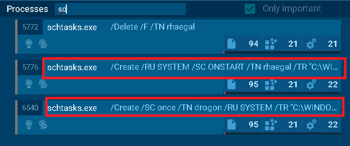

Para este laboratorio se nos proporciona lo siguiente: 

```bash 
┌──(kali㉿kali)-[~/blue-labs/rrabit]
└─$ ls
 218-BRabbit.zip   'Urget Contract Action.eml'  'Urget Contract Action.zip'   Warning.txt
```

Un .eml que podemos abrir con thunderbird: 

```bash 
┌──(kali㉿kali)-[~/blue-labs/rrabit]
└─$ thunderbird Urget\ Contract\ Action.eml
```

Con esto podemos pasar rapidamente a las preguntas: 

-----

<h3 style="color: #0d6efd;">Q1. The phishing email used to deliver the malicious attachment showed several indicators of a potential social engineering attempt. Recognizing these indicators can help identify similar threats in the future.
What is the suspicious email address that sent the attachment? </h3>

Una vez que abrimos el email podemos analizarlo: 


Notamos que la direcciòn del que envía el correo parece tener el dominio `drumbo`, pero si nos fijamos bien, en realidad dice `drurnbo`, que si uno no se fija bien puede engañar al usuario para visitar sitios malicioso o descargar malware, de hecho el correo ya tiene un fichero adjunto que podemos descargar. 

----

<h3 style="color: #0d6efd;">Q2. The ransomware was identified as part of a known malware family. Determining its family name can provide critical insights into its behavior and remediation strategies.
What is the family name of the ransomware identified during the investigation? </h3>

Para esto nos descargamos el fichero adjunto, obtenemos su hash: 

```bash 
┌──(kali㉿kali)-[~/blue-labs/rrabit]
└─$ sha256sum attatchment       
630325cac09ac3fab908f903e3b00d0dadd5fdaa0875ed8496fcbb97a558d0da  attatchment
```

Lo subimos a virus total y podemos ver a la familia que pertenece: 


----

<h3 style="color: #0d6efd;">Q3. Upon execution, the ransomware dropped a file onto the compromised system to initiate its payload. Identifying this file is essential for understanding its infection process.
What is the name of the first file dropped by the ransomware? </h3>

Esto lo podemos ver directamente en un sandobox como [ANY.RUN](https://app.any.run/)


- El dropper principal (Urgent Contract Action.pdf.exe) lo que hace al arrancar es desplegar su payload en disco. Ese payload viene empaquetado dentro del propio ejecutable y se extrae como un fichero llamado infpub.dat bajo C:\Windows.
- Tras escribir infpub.dat, el dropper invoca a rundll32.exe para cargar ese fichero como si fuera una librería DLL (el parámetro ,#1 indica el export a ejecutar).

----

<h3 style="color: #0d6efd;">Q4. Inside the dropped file, the malware contained hardcoded artifacts, including usernames and passwords that could provide clues about its origins or configuration.
What is the only person's username found within the dropped file? </h3>

Bien, para esto podemos buscar más información sobre el primer fichero que tira el dropper, podemos obtener el hash directamente en el análisis de virus total. 

Podemos buscar en google directamente por el nombre del dropper principal y por la palabra "usernames list" para buscar reportes sobre este ransomware:


Y vemos que el único nombre personal es "alex": 


BadRabbit recorre esta lista intentando autenticarse contra cada equipo del mismo dominio o subred.

-----

<h3 style="color: #0d6efd;">Q5. After execution, the ransomware communicated with a C2 server. Recognizing its communication techniques can assist in mitigation.
What MITRE ATT&CK sub-technique describes the ransomware’s use of web protocols for sending and receiving data? </h3>

Esto lo podemos ver en la sección de ATT&CK en el análisis de ANY.RUN, en la sección cd C&C, Application Layer Protocol, en la sección de `Subtechniques`


----

<h3 style="color: #0d6efd;">Q6. Persistence mechanisms are a hallmark of sophisticated ransomware. Identifying how persistence was achieved can aid in recovery and prevention of reinfection.
What is the MITRE ATT&CK Sub-Technique ID associated with the ransomware’s persistence technique? </h3>

También lo vemos en la sección de ATT&CK: 


---

<h3 style="color: #0d6efd;">Q7. As part of its infection chain, the ransomware created specific tasks to ensure its continued operation. Recognizing these tasks is crucial for system restoration. What are the names of the tasks created by the ransomware during execution? </h3>

En el análisis de ANY.RUN: 



Otra cosa interesante además de que usan nombre relacionados con Game of Thrones son las tareas que van a realizar:

schtasks /Create /RU SYSTEM /SC ONSTART /TN rhaegal /TR "C:\WINDOWS\system32\cmd.exe /C Start \"C:\Windows\dispci.exe\" -id 3585595109 && exit" -> Inicia un ejecutable malicioso. 

schtasks /Create /SC once /TN drogon /RU SYSTEM /TR "C:\WINDOWS\system32\shutdown.exe /r /t 0 /f" /ST 14:51:00 -> apaga el sistema. 

------

<h3 style="color: #0d6efd;">Q8. the malicious binary dispci.exe displayed a suspicious message upon execution, urging users to disable their defenses. This tactic aimed to evade detection and enable the ransomware's full execution. What suspicious message was displayed in the Console upon executing this binary? </h3>

Bien, parece que al momento de ejecutarse el dispci.exe se nos muestra el siguiente mensaje: 


-----

<h3 style="color: #0d6efd;">Q9. To modify the Master Boot Record (MBR) and encrypt the victim’s hard drive, the ransomware utilized a specific driver. Recognizing this driver is essential for understanding the encryption mechanism.
What is the name of the driver used to encrypt the hard drive and modify the MBR? </h3>

El MBR (Master Boot Record) es el sector 0 del disco duro (los primeros 512 bytes) y contiene:

- Un pequeño programa de arranque (bootloader) que carga el sistema operativo.
- La tabla de particiones del disco.
Si un malware sobrescribe el MBR, pasa a controlar el proceso de arranque (por ejemplo, mostrando su propia pantalla de rescate antes de que Windows cargue).

Para emepzar a contestar esto podemo revisar el fichero `dispci.exe`, podemos acceder directamente al análisis de este fichero desde el análisis principal que hemos venido haciendo en virus total. 

En la sección de detalles podemos ver lo siguiente: 


El sitio http://diskcryptor.net/ es la página oficial de DiskCryptor, un proyecto de software libre y de código abierto para Windows que proporciona cifrado de disco completo y de volúmenes individuales. 

DiskCryptor es una herramienta de cifrado “full-disk” (whole-disk encryption) similar a BitLocker, pero gratuita y de código abierto bajo licencia GPL. Permite cifrar discos duros, particiones, unidades extraíbles (USB, discos externos) e incluso el registro de arranque (MBR).

Por lo que podemos pensar que el ransomware cifra todo y modifica el MRB para dejar una nota de rescate. 

-----

<h3 style="color: #0d6efd;">Q10. Attribution is key to understanding the threat landscape. The ransomware was tied to a known attack group through its tactics, techniques, and procedures (TTPs).
What is the name of the threat actor responsible for this ransomware campaign? </h3>

Para esto podemos visitar malpedia para buscar mas información sobre este malware: 


-----

<h3 style="color: #0d6efd;">Q11. The ransomware rendered the system unbootable by corrupting critical system components. Identifying the technique used provides insight into its destructive capabilities.
What is the MITRE ATT&CK ID for the technique used to corrupt the system firmware and prevent booting? </h3>

Para esto podemos visitar la página de [MITE ATT&CK](https://attack.mitre.org/techniques/T1495/)


