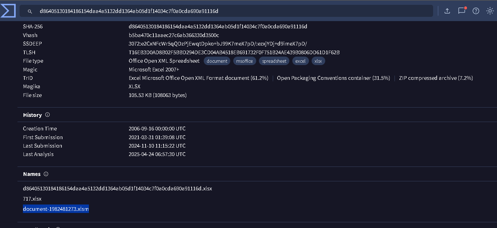
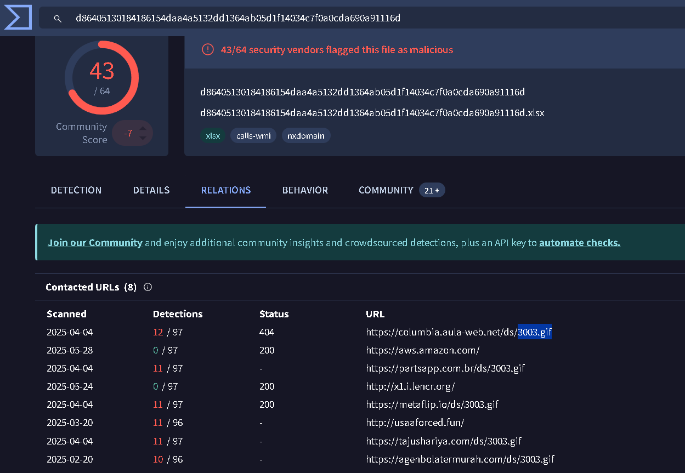
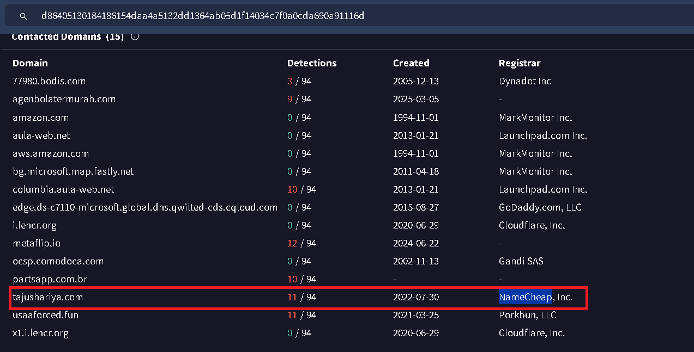
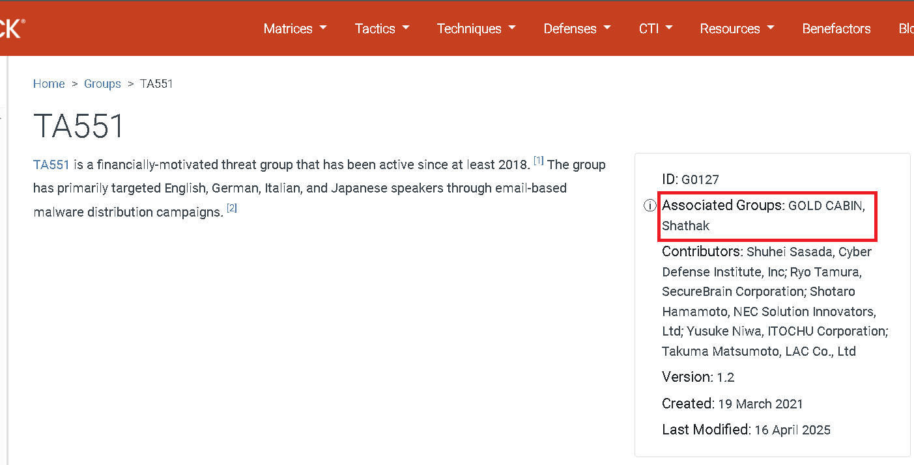
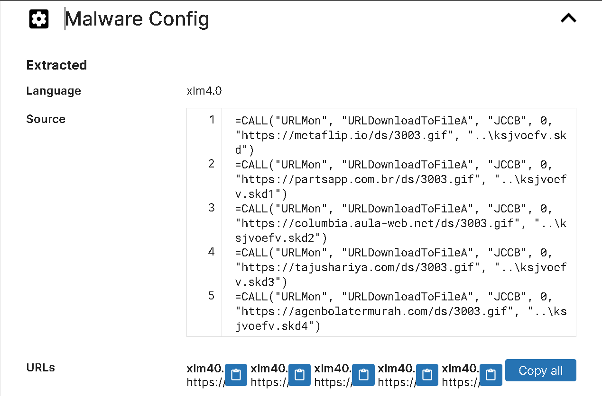

Para este laboratorio se nos proporciona un unico fichero: 

```bash 
┌──(kali㉿kali)-[~/blue-labs/ice]
└─$ ls
hash.txt

┌──(kali㉿kali)-[~/blue-labs/ice]
└─$ file hash.txt
hash.txt: ASCII text

┌──(kali㉿kali)-[~/blue-labs/ice]
└─$ cat hash.txt
191eda0c539d284b29efe556abb05cd75a9077a0


Use this hash on online threat intel platforms (e.g., VirusTotal, Hybrid Analysis) to complete the lab analysis.
```

Así que pasamos brevemente a las preguntas: 

<h3 style="color: #0d6efd;">Q1. What is the name of the file associated with the given hash? </h3>

Subimos el hash a virus total, y en la sección de `Details` podemos ver los nombre del fichero relacionado con este hash: 



----

<h3 style="color: #0d6efd;">Q2. Can you identify the filename of the GIF file that was deployed? </h3>

Esto lo podemos ver rapidamente en la sección de `Relations` de este hash: 



----

<h3 style="color: #0d6efd;">Q3. How many domains does the malware look to download the additional payload file in Q2? </h3>

En la imagen anterior podemos ver que se obtiene `3003.gif` de hasta 5 direcciones. 

----

<h3 style="color: #0d6efd;">Q4. From the domains mentioned in Q3, a DNS registrar was predominantly used by the threat actor to host their harmful content, enabling the malware's functionality. Can you specify the Registrar INC? </h3>

Esto lo podemos ver en la sección de contacted domains en el reporte de virus total que hemos estado sigiente, el que nos piden es NameCheap, uno de los que tiene más conteo de detecciones. 



-----

<h3 style="color: #0d6efd;">Q5. Could you specify the threat actor linked to the sample provided? </h3>

Para esto tenemos que investigar más sobre el malware. En virus total vemos que se trata del malware IceId. 

Buscando más sobre este malware llegamos a una página de Mitre Att&ck que relaciona al grupo TA551, que a su vez está relacionado con los grupos GOLD CABIN, Shathak. 



----

<h3 style="color: #0d6efd;">Q6. In the Execution phase, what function does the malware employ to fetch extra payloads onto the system? </h3>

Para esto usamos Triage, en el siguiente [análisis](https://tria.ge/241110-ncqlyavnct) y en el comportamiento del malware podemos ver parte de su comportamiento: 



