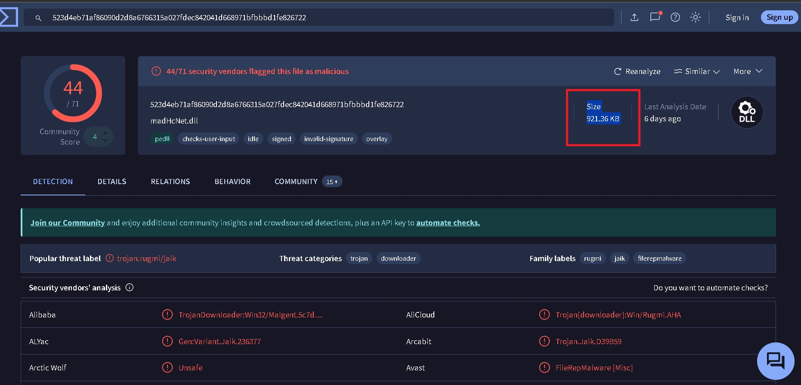
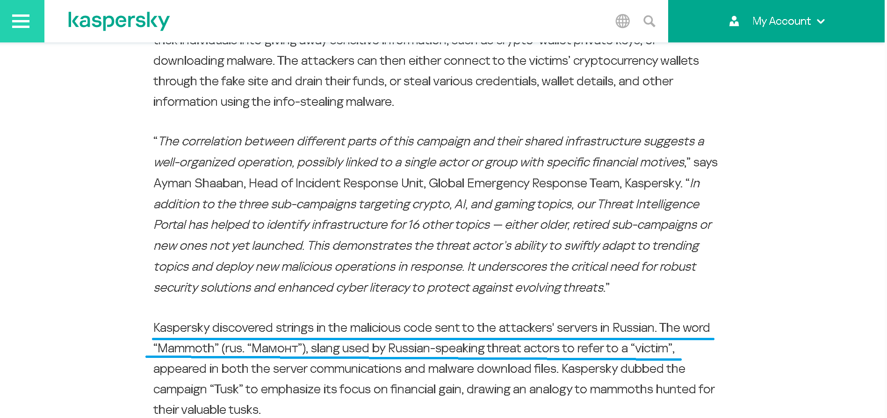
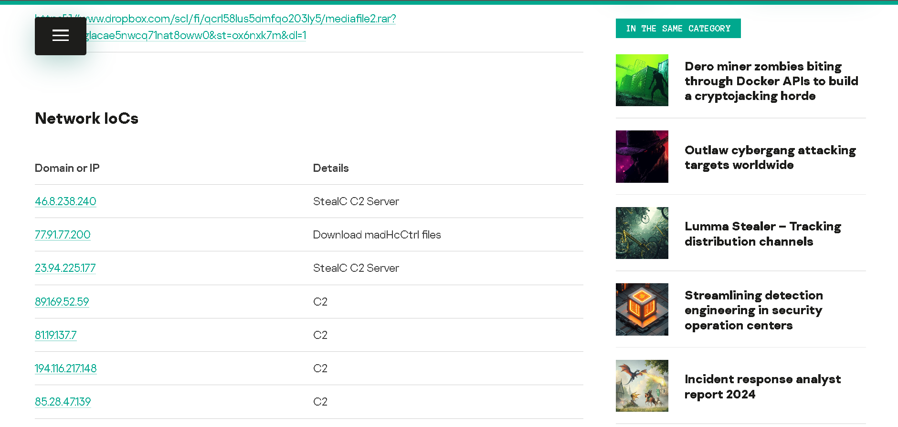
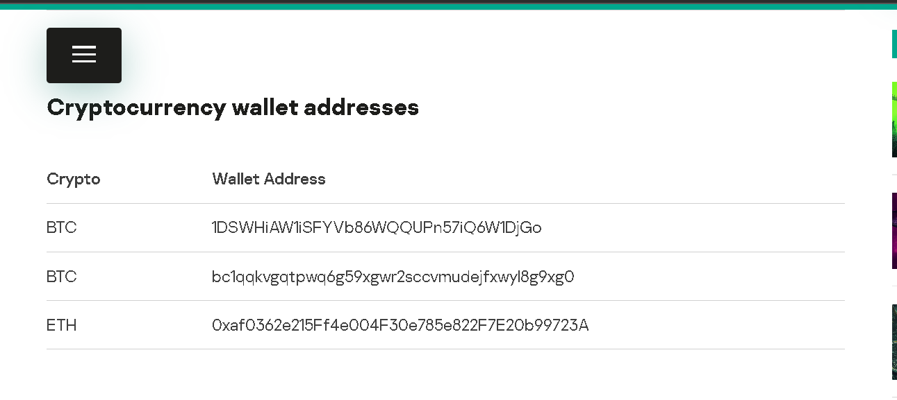

Para este laboratorio se nos proporcionan un unico fichero: 
```bash 
┌──(kali㉿kali)-[~/blue-labs/tusk]
└─$ cat temp_extract_dir/hash.txt
MD5: E5B8B2CF5B244500B22B665C87C11767


Use this hash on online threat intel platforms (e.g., VirusTotal, Hybrid Analysis) to complete the lab analysis.
```

Así que pasamos rápidamente a las preguntas: 

---

<h3 style="color: #0d6efd;">Q1. In KB, what is the size of the malicious file? </h3>

Primeramente subimos el hash a virus total y ya podremos empezar a ver los detalles: 



------

<h3 style="color: #0d6efd;"> </h3>

Pregunta bastante interesante, buscando en la sección de `Community`  en  virus total encontramos que se trata de `Tusk infostealer`. Buscando en internet nos encontramos este [Kaspersky](https://www.kaspersky.com/about/press-releases/kaspersky-discovers-tusk-active-information-and-crypto-stealing-campaign)

Leyendo un poco podemos ver como es que los atacantes se referían a las víctimas: 



----

<h3 style="color: #0d6efd;">Q3. The threat actor set up a malicious website to mimic a platform designed for creating and managing decentralized autonomous organizations (DAOs) on the MultiversX blockchain (peerme.io). What is the name of the malicious website the attacker created to simulate this platform? </h3>

En la misma sección de `Community` en virus total vemos que un usuario subió un link al siguiente [reporte](https://securelist.com/tusk-infostealers-campaign/113367/)

En este reporte mencionan que el sitio malicioso se hacía pasar por otro sitio destinado para la cumunidad de criptomonedas. 

----

<h3 style="color: #0d6efd;">Q4. Which cloud storage service did the campaign operators use to host malware samples for both macOS and Windows OS versions?</h3>

Leyendo el reporte de la pregunta anterior mencionan que al interactuar con la página se llega a un formulario para crear un perfil, es en este momento en el que se empieza la descarga de un fichers maliciosos. 

Uno de estos fichero, llamado tidyme.exe, contiene un fichero de configuración llamado `config.json`, que es elque contiene direciones URL encodeadas en base64: 

```json

{
 "archive": "aHR0cHM6Ly93d3cuZHJvcGJveC5jb20vc2NsL2ZpL2N3NmpzYnA5ODF4eTg4dHprM29ibS91cGRhdGVsb2FkLnJhcj9ybGtleT04N2c5NjllbTU5OXZub3NsY2dseW85N2ZhJnN0PTFwN2RvcHNsJmRsPTE=",
 "password": "newfile2024",
 "bytes": "aHR0cDovL3Rlc3Rsb2FkLnB5dGhvbmFueXdoZXJlLmNvbS9nZXRieXRlcy9m"
}
```

Desencodeando el fichero: 

```bash 
┌──(kali㉿kali)-[~/blue-labs]
└─$ echo "aHR0cHM6Ly93d3cuZHJvcGJveC5jb20vc2NsL2ZpL2N3NmpzYnA5ODF4eTg4dHprM29ibS91cGRhdGVsb2FkLnJhcj9ybGtleT04N2c5NjllbTU5OXZub3NsY2dseW85N2ZhJnN0PTFwN2RvcHNsJmRsPTE=" | base64 -d
https://www.dropbox.com/scl/fi/cw6jsbp981xy88tzk3obm/updateload.rar?rlkey=87g969em599vnoslcglyo97fa&st=1p7dopsl&dl=1 
```

---

<h3 style="color: #0d6efd;">Q5. The malicious executable contains a configuration file that includes base64-encoded URLs and a password used for archived data decompression, enabling the download of second-stage payloads. What is the password for decompression found in this configuration file? </h3>

Bien, esto lo podemos ver en el contenido del json que dimos en la pregunta anterior, la contraseña está en texto plano: `newfile2024`

------

<h3 style="color: #0d6efd;">Q6. What is the name of the function responsible for retrieving the field archive from the configuration file? </h3>

En el reporte mencionan que la funcionalidad para descargar el malware se encuentra e nun fichero llamado `preload.js`, que contiene 2 funciones, `downloadAndExtractArchive` y `loadFile`, la función `downloadAndExtractArchive` es la que obtiene el contenido almacenado en dropbox. 

----

<h3 style="color: #0d6efd;">Q7. In the third sub-campaign carried out by the operators, the attacker mimicked an AI translator project. What is the name of the legitimate translator, and what is the name of the malicious translator created by the attackers? </h3>

Esto también se menciona en el reporte que venimos siguiendo desde la pregunta 3. 

------

<h3 style="color: #0d6efd;">Q8. The downloader is tasked with delivering additional malware samples to the victim’s machine, primarily infostealers like StealC and Danabot. What are the IP addresses of the StealC C2 servers used in the campaign? </h3>

Esto también se menciona en el reporte: 



----

<h3 style="color: #0d6efd;">Q9. What is the address of the Ethereum cryptocurrency wallet used in this campaign? </h3>

En el reporte: 



