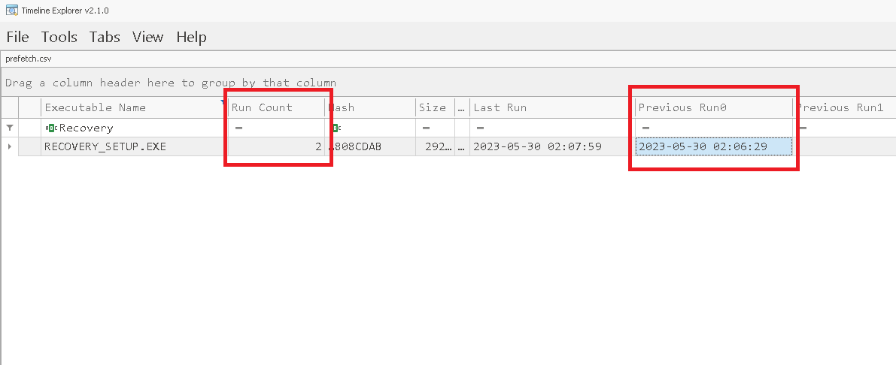

<h3 style="color: #9FEF00;">Task 1. What is the build version of the operating system? </h3>

Esto podemos obtenerlo a partir del volcado de memoria que se nos proporciona, el `memory.vmem`, usamos el siguiente comando: `windows.info`, que extrae y muestra información básica del sistema operativo desde la memoria RAM volcada. 

```bash 
┌──(venv)─(kali㉿kali)-[~/blue-labs/trojan/memory capture]
└─$ vol -f memory.vmem windows.info
Volatility 3 Framework 2.11.0
Progress:  100.00               PDB scanning finished
Variable        Value

Kernel Base     0xf8073e400000
DTB     0x1ad000
Symbols file:///home/kali/blue-labs/volatility3/venv/lib/python3.13/site-packages/volatility3/symbols/windows/ntkrnlmp.pdb/CA8E2F01B822EDE6357898BFBF862997-1.json.xz
Is64Bit True
IsPAE   False
layer_name      0 WindowsIntel32e
memory_layer    1 VmwareLayer
base_layer      2 FileLayer
meta_layer      2 FileLayer
KdVersionBlock  0xf8073f00f368
Major/Minor     15.19041
MachineType     34404
KeNumberProcessors      2
SystemTime      2023-05-30 02:09:03+00:00
NtSystemRoot    C:\Windows
NtProductType   NtProductWinNt
NtMajorVersion  10
NtMinorVersion  0
PE MajorOperatingSystemVersion  10
PE MinorOperatingSystemVersion  0
PE Machine      34404
PE TimeDateStamp        Wed Jan  4 04:27:11 1995
```

Nos fijamos en las siguientes lineas: 

```txt
NtMajorVersion  10
NtMinorVersion  0
Major/Minor     15.19041
```

En sistemas Windows, el número de versión del sistema operativo se compone normalmente de:

```plaintext
Major.Minor.Build.Revision
```
Por ejemplo: 10.0.19041.2728

En este formato:

- Major: versión principal (ej. 10 = Windows 10)
- Minor: versión secundaria (generalmente 0 en Windows modernos)
- Build: el número de compilación (lo que te están pidiendo)
- Revision: número de actualización del build (parches)

Lo importante aquí es el número 19041, que aparece como parte del campo Major/Minor.

Este número 19041 corresponde a la build version de Windows 10 versión 2004, lanzada en mayo de 2020. Este número de build se mantiene en actualizaciones posteriores como la 20H2 y 21H1 (con distintos números de revisión).

-----

<h3 style="color: #9FEF00;">Task 2. What is the computer hostname? </h3>

Bien, aqui necesitamos analizar el fichero `.pcapng` que se nos proporciona, podemos iniciar nuestro análisis usando zeek para tener una visión general de la captura: 

```bash 
┌──(kali㉿kali)-[~/blue-labs/trojan/packet capture]
└─$ docker run -v "$(pwd)":/mnt -it zeek/zeek sh
# bash
root@c4d608a7fb02:/# cd mnt
root@c4d608a7fb02:/mnt# ls
network.pcapng
root@c4d608a7fb02:/mnt# zeek -r network.pcapng
root@c4d608a7fb02:/mnt# ls
analyzer.log  conn.log  dhcp.log  dns.log  files.log  http.log  network.pcapng  ocsp.log  packet_filter.log  quic.log  ssl.log  x509.log
```

Y en el fichero `dhcp.log` podemos ver esto: 

```bash 
#fields ts      uids    client_addr     server_addr     mac     host_name      
1685429397.996235       C26uXu1rALf6lVnb7e,CCpTde3ZRrFOdexTGi   192.168.116.133 192.168.116.254 00:0c:29:be:f4:91       DESKTOP-38NVPD0 
```

Igual podemos verlo también en wireshark, en el paquete dhcp discover, que es el paquete en el que se manda información general del usuario que quiere obtener una dirección ip dentr de una red: 


O en la información que se comparte por el protocolo NetBios: 


----

<h3 style="color: #9FEF00;">Task 3. What is the name of the downloaded ZIP file? </h3>

Esto lo podemos obtener facilmente con el análisis realizado con zeek: 

```bash 
┌──(kali㉿kali)-[~/blue-labs/trojan/packet capture]
└─$ grep -i "zip" *.log
files.log:1685429765.372208     Fenp8CZjM8MHstVJ9       CAvW7V7cDrkCKZiI1       192.168.116.133 65041   145.14.144.155  80      HTTP    0       (empty) application/zip -       12.391198       F       F      2149533  2149533 0       0       F       -       -       -       -       -       -       -
http.log:1685429764.873630      CAvW7V7cDrkCKZiI1       192.168.116.133 65041   145.14.144.155  80      1       GET     praetorial-gears.000webhostapp.com      /wp-content/uploads/2023/05/Data_Recovery.zip  -1.1     Mozilla/5.0 (Windows NT 10.0; Win64; x64) AppleWebKit/537.36 (KHTML, like Gecko) Chrome/92.0.4515.131 Safari/537.36 Edg/92.0.902.67     -       0       2149533 200     OK      -       -       (empty)--       -       -       -       -       Fenp8CZjM8MHstVJ9       -       application/zip
```

---

<h3 style="color: #9FEF00;">Task 4. What is the domain of the website (including the third-level domain) from which the file was downloaded? </h3>

Esto podemos verlo en el fragmento del anális que realizó zeek. 
En un nombre de dominio como praetorial-gears.000webhostapp.com, cada parte separada por puntos (.) se llama un label. Desde derecha a izquierda:

| Nivel                         | Ejemplo            |
| ----------------------------- | ------------------ |
| **Top-Level Domain (TLD)**    | `.com`             |
| **Second-Level Domain (SLD)** | `000webhostapp`    |
| **Third-Level Domain**        | `praetorial-gears` |

Por lo tanto, el "third-level domain" es la parte que está antes del segundo nivel, por lo que, con  "el dominio incluyendo el third-level", nos piden el FQDN completo (nombre de dominio completamente calificado):
```plaintext
praetorial-gears.000webhostapp.com
```

-----

<h3 style="color: #9FEF00;">Task 5. The user then executed the suspicious application found in the ZIP archive. What is the process PID?The user then executed the suspicious application found in the ZIP archive. What is the process PID? </h3>

Bien, se menciona que el usuario extrajo el contenido del .zip y después lo ejecutó, así que vamos a hacer esto, pero solo a descomprimir el contenido, no ejecutemos nada. 

En wireshar -> `File > Export Objects > HTTP`, guardamos el `Data_Recovery.zip` y extraemos el contenido, vemos lo siguiente: 

```bash 
┌──(kali㉿kali)-[~/blue-labs/trojan/files]
└─$ ls
Data_Recovery.zip  Recovery_Setup.exe
```

Ahora obtenemos la lista de procesos del volcado de memoria: 

```bash 
┌──(venv)─(kali㉿kali)-[~/blue-labs/trojan/memory capture]
└─$ vol -f memory.vmem windows.pslist > pslist
```

Y buscando entre los procesos, encontramos lo siguiente: 

```bash 
┌──(venv)─(kali㉿kali)-[~/blue-labs/trojan/memory capture]
└─$ cat pslist
Volatility 3 Framework 2.11.0

PID     PPID    ImageFileName   Offset(V)       Threads Handles SessionId       Wow64   CreateTime      ExitTime        File output
<SNIP>
5392    1692    audiodg.exe     0xb381770e2080  4       -       0       False   2023-05-30 02:06:14.000000 UTC  N/A     Disabled
5876    616     svchost.exe     0xb38176fb5080  4       -       0       False   2023-05-30 02:06:31.000000 UTC  N/A     Disabled
5312    764     WmiPrvSE.exe    0xb38176db2080  5       -       0       False   2023-05-30 02:07:41.000000 UTC  N/A     Disabled
5608    3068    cmd.exe 0xb3817696c080  0       -       1       True    2023-05-30 02:07:49.000000 UTC  2023-05-30 02:07:59.000000 UTC  Disabled
5640    5608    conhost.exe     0xb38176d7d340  0       -       1       False   2023-05-30 02:07:50.000000 UTC  2023-05-30 02:07:59.000000 UTC  Disabled
484     60      Recovery_Setup  0xb38176d4d080  1       -       1       True    2023-05-30 02:07:59.000000 UTC  N/A     Disabled
5956    484     is-NJBAT.tmp    0xb38176f43080  5       -       1       True    2023-05-30 02:07:59.000000 UTC  N/A     Disabled
4012    5956    Rec528.exe      0xb38176f97080  9       -       1       True    2023-05-30 02:08:01.000000 UTC  N/A     Disabled
1780    4012    a32mcDkSYsUq.e  0xb38176f13340  0       -       1       True    2023-05-30 02:08:04.000000 UTC  2023-05-30 02:08:14.000000 UTC  Disabled
```

Podemos identificar el nombre del ejecutable con un proceso de mismo nombre. 

----

<h3 style="color: #9FEF00;">Task 6. What is the full path of the suspicious process? </h3>

Para esto podemos aplicar el siguiente comando con volatility3: 

```bash 
┌──(venv)─(kali㉿kali)-[~/blue-labs/trojan/memory capture]
└─$ vol -f memory.vmem windows.cmdline > cmdline
```

Una vez obtenido el contenido, podemos bucar el nombre del proceso ya identiicado: 

```bash 
┌──(venv)─(kali㉿kali)-[~/blue-labs/trojan/memory capture]
└─$ cat cmdline
Volatility 3 Framework 2.11.0

PID     Process Args
<SNIP>
5392    audiodg.exe     C:\Windows\system32\AUDIODG.EXE 0x4cc
5876    svchost.exe     C:\Windows\System32\svchost.exe -k LocalSystemNetworkRestricted -p -s WdiSystemHost
5312    WmiPrvSE.exe    C:\Windows\system32\wbem\wmiprvse.exe
5608    cmd.exe Required memory at 0x2800020 is not valid (process exited?)
5640    conhost.exe     Required memory at 0x82f87ef020 is not valid (process exited?)
484     Recovery_Setup  "C:\Users\John\Downloads\Data_Recovery\Recovery_Setup.exe"
5956    is-NJBAT.tmp    "C:\Users\John\AppData\Local\Temp\is-VIBV9.tmp\is-NJBAT.tmp" /SL4 $A033C "C:\Users\John\Downloads\Data_Recovery\Recovery_Setup.exe" 1937767 52224
4012    Rec528.exe      "C:\Program Files (x86)\FLSCover\Rec528\Rec528.exe"
1780    a32mcDkSYsUq.e  Required memory at 0x2af020 is not valid (process exited?)
```

-----

<h3 style="color: #9FEF00;">Task 7. What is the SHA-256 hash of the suspicious executable? </h3>

Ya tenemos el ejecutable, obtenemos el hash: 

```bash 
┌──(kali㉿kali)-[~/blue-labs/trojan/files]
└─$ sha256sum Recovery_Setup.exe
c34601c5da3501f6ee0efce18de7e6145153ecfac2ce2019ec52e1535a4b3193  Recovery_Setup.exe
```

-----

<h3 style="color: #9FEF00;">Task 8. When was the malicious program first executed? </h3>

Para esto podemos analizar el prefetch que se encuentra en el .ad1, que podemos abrir con FTK Imager. 

Una vez que exportamos el contenido del prefetch en la ruta `C:\NONAME\root\Windows\Prefetch` en FTK Imager, lo parseamos con `PECmd.exe`, herramienta de Eric Zimmerman, usando el siguiente comando:

```powershell
PS C:\Users\Lenovo\Downloads\compartida\PECmd> .\PECmd.exe -d "C:\Ruta\Prefetch exportado" --csv "C:\Ruta\Salida" --csvf prefetch.csv
```

Una vez que termina de parsearse podemos abrirlo con TimeLine Explorer, otra herramienta de Zimmerman, filtramos por el nombre del proceso y vemos lo siguiente: 



Se cuentan 2 ejecuciones, el que nos interesa está en el campo `Previus Run0`

-----

<h3 style="color: #9FEF00;">Task 9. How many times in total has the malicious application been executed? </h3>

Ya vimos en la pregunta anterior que se cuentan 2 ejecuciones. 

----

<h3 style="color: #9FEF00;">Task 10. The malicious application references two .TMP files, one is IS-NJBAT.TMP, which is the other? </h3>

Esta fue un poco difícil para mí, primeramente intenté bucar strings en el ejecutable malicioso: 

```bash
┌──(kali㉿kali)-[~/blue-labs/trojan/files]
└─$ strings Recovery_Setup.exe| grep -i "tmp"
.tmp
.tmp
fEtMp
```

También en los ficheros del volcado de memoria: 

```bash 
┌──(venv)─(kali㉿kali)-[~/blue-labs/trojan/memory capture]
└─$ grep "\.tmp" filescan
0xb381744b1700  \DumpStack.log.tmp
0xb38175dba6b0  \Users\John\AppData\Local\Microsoft\Windows\Notifications\WPNPRMRY.tmp
0xb38176ca8b10  \Users\John\AppData\Local\Temp\wct4C37.tmp
0xb38176cb7d40  \Users\John\AppData\Local\Temp\b93805ba-237f-4e67-8d80-1411289ac6d8.tmp
0xb38176cd6b00  \Users\John\AppData\Local\Temp\wctD2BC.tmp
0xb38177318df0  \Users\John\AppData\Local\Temp\4efae22e-f2bb-472d-a55c-c63c39ed5bc6.tmp
0xb3817731b370  \Users\John\AppData\Local\Temp\wct4C36.tmp
0xb3817732fa00  \Users\John\AppData\Local\Temp\BITFBA4.tmp
0xb381773322a0  \Users\John\AppData\Local\Temp\wct4C36.tmp
0xb381773341e0  \Users\John\AppData\Local\Temp\wctD2BC.tmp
0xb38177402370  \Windows\System32\config\systemprofile\AppData\Local\Microsoft\Windows\Notifications\WPNPRMRY.tmp
0xb381776b47b0  \Users\John\AppData\Local\Temp\is-LKSST.tmp\_iscrypt.dll
0xb38177760b50  \Users\John\AppData\Local\Temp\0e6698f4-8a77-4c8d-a36f-cafac2052795.tmp
0xb38177888590  \Users\John\AppData\Local\Temp\is-LKSST.tmp\_isetup\_shfoldr.dll
0xb381778924f0  \Users\John\AppData\Local\Temp\is-CL7BS.tmp\_iscrypt.dll
0xb3817789da30  \Users\John\AppData\Local\Temp\is-CL7BS.tmp\_isetup\_shfoldr.dll
0xb38177999360  \Users\John\AppData\Local\Microsoft\Edge\User Data\Default\Service Worker\CacheStorage\3cedfb74d44f2e84198d23075aef16c34a668ceb\index.txt.tmp
0xb3817799e950  \Users\John\AppData\Local\Temp\is-VIBV9.tmp\is-NJBAT.tmp
0xb3817799f440  \Users\John\AppData\Local\Temp\is-VIBV9.tmp\is-NJBAT.tmp
```

Pero solo hacen referencia al fichero mencionado en la pregunta, revisando en virus total, es más que obvio que el fichero se genera con un nombre aleatorio, pr lo que los nombres que aparecen en virus total no serían los correctos. 

Finalmente recordé que esto podríamos verlo en el prefetch, que almacena datos de un ejecutable cuando se ejecuta pro primera vez una aplicación. 


Posteriormente descubrí que se puede ver también aplicando un `strings` al volcado de memoria: 

```bash 
┌──(venv)─(kali㉿kali)-[~/blue-labs/trojan/memory capture]
└─$ strings memory.vmem| grep "\.tmp"
\Device\HarddiskVolume3\Users\John\AppData\Local\Temp\is-T97VD.tmp\is-R7RFP.tmp
\Device\HarddiskVolume3\Users\John\AppData\Local\Temp\is-VIBV9.tmp\is-NJBAT.tmp
is-NJBAT.tmp
is-R7RFP.tmp
is-R7RFP.tmp
is-NJBAT.tmp
C:\Users\John\AppData\Local\Temp\is-VIBV9.tmp\is-NJBAT.tmp
packageidc:\users\john\appdata\local\temp\is-t97vd.tmp\is-r7rfp.tmpd
x_exe_pathc:\users\john\appdata\local\temp\is-t97vd.tmp\is-r7rfp.tmpd
x_exe_pathc:\users\john\appdata\local\temp\is-t97vd.tmp\is-r7rfp.tmpd
C:\Users\John\AppData\Local\Temp\is-VIBV9.tmp\is-NJBAT.tmp
C:\Program Files (x86)\FLSCover\Rec528\is-I9KFV.tmp
\_setup64.tmp
%s%s%d.tmp
is-NJBAT.tmp
index.txt.tmp
\_setup64.tmp
```


-----

<h3 style="color: #9FEF00;">Task 11. How many of the URLs contacted by the malicious application were detected as malicious by VirusTotal? </h3>

Ponemos el hash en virus total y revisamos: 


Contamos hasta 4 direcciones marcadas como maliciosas. 

Para confirmar, buscamos las conexiones que tenemos en nuestro análisis de zeek: 


----

<h3 style="color: #9FEF00;">Task 12. The malicious application downloaded a binary file from one of the C2 URLs, what is the name of the file? </h3>

Para esto podemos fijarnos en el fichero solicitado en la primera dirección. 

Podemos verlo en wireshark: 


----

<h3 style="color: #9FEF00;"> </h3>

Esto fue dificil, intenté buscar alguna referencia en el historial de búsqueda del usuario, en el `History` bajo la ruta `C:\Users\<usuario>\AppData\Local\Google\Chrome\User Data\Default\`, pero no encontré nada. 

Intenté buscar en wireshak, alguna referencia a la página, pero tampoco había nada. 

Finalmente, revisando los reportes de análisis del malware en la sección de `Intelligence` en MalwareBazar:  https://bazaar.abuse.ch/sample/c34601c5da3501f6ee0efce18de7e6145153ecfac2ce2019ec52e1535a4b3193/#intel

Particularmete encontré una referencia al nombre en el análisis de JoeSandbox: 


