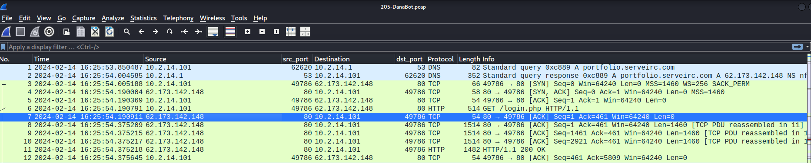
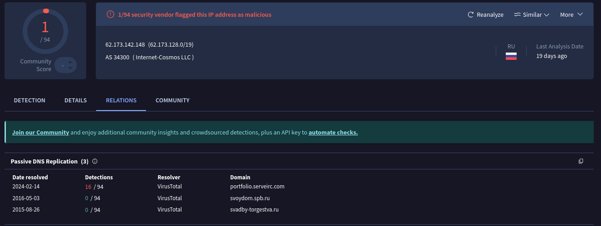
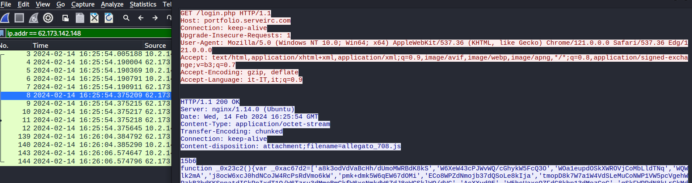

# **Cyberdefenders - DanaBot**

El equipo SOC detecta tráfico malicioso, nos proporcionan un fichero .pcap para investigar que fue lo que pasó.

---
<p style="color: blue;">1. ¿Qué dirección IP utilizó el atacante durante el acceso inicial?</p>

Para esto podemos abrir el .pcap con `wireshark`, y rápidamente podemos ver tráfico DNS donde se puede ver que se resuelve una `URL`



Una ip marcada como maliciosa, que resuelve a una sitio marcado también como malicioso: 



---
<p style="color: blue;">2. ¿Cuál es el nombre del archivo malicioso utilizado para el acceso inicial?</p>

Para esto, ya conocemos la IP, ahora aplicamos un filtro por esta IP y vemos una petición "GET", inspeccionamos el contenido: 



El fichero está en el campo `Content-Disposition`

```txt
Content-Disposition: attachment; filename=allegato_708.js
```
Indica que el servidor está **forzando al navegador a descargar un archivo** llamado `allegato_708.js`, en lugar de intentar mostrarlo en el navegador. Es muy común en malware que se entregue vía HTTP, ya que así el navegador descarga automáticamente el archivo y lo guarda con un nombre que parece inofensivo.

### ¿Qué es `Content-Disposition`?

* Es una cabecera de **respuesta HTTP** que le dice al cliente (por ejemplo, un navegador) cómo manejar el contenido.
* El valor `attachment` indica que se debe descargar.
* `filename=...` especifica el nombre sugerido para guardar el archivo.

| Cabecera                                 | Significado                                                                                    |
| ---------------------------------------- | ---------------------------------------------------------------------------------------------- |
| `Server: nginx/...`                      | El tipo de servidor web usado (aquí, Nginx sobre Ubuntu).                                      |
| `Date: ...`                              | Fecha en que se generó la respuesta.                                                           |
| `Content-Type: application/octet-stream` | Es un archivo binario genérico (no HTML, no imagen, etc.).                                     |
| `Transfer-Encoding: chunked`             | La respuesta se envía en fragmentos (chunks), común cuando el tamaño no se conoce de antemano. |
| `Connection: keep-alive`                 | Mantiene la conexión abierta para más solicitudes HTTP.                                        |


---
<p style="color: blue;">3. ¿Cuál es el hash SHA-256 del archivo malicioso utilizado para el acceso inicial?</p>

Bien, ya sabemos que se hizo un GET a la ip maliciosa, se pide un fichero como `login.php` y se guarda como `allegato_708.js`, así que vamos a `File>Export Objects>HTTP', descargamos `login.php` y sacamos el sha256: 

```bash 
┌──(kali㉿kali)-[~/blue-labs/danabot]
└─$ sha256sum login.php      
847b4ad90b1daba2d9117a8e05776f3f902dda593fb1252289538acf476c4268  login.php
```

---
<p style="color: blue;">4. ¿Qué proceso se utilizó para ejecutar el archivo malicioso?</p>

Bien, esto podemos verlo en virus total, subimos el hash, que marca como malicioso, y en la parte de `Behavior` podemos ver lo siguiente: 


`wscript.exe` es el **Windows Script Host** — un intérprete legítimo de Microsoft para ejecutar scripts en **VBScript** (`.vbs`) o **JScript/JavaScript** (`.js`) desde el entorno gráfico.

### Ruta del ejecutable:

```
C:\Windows\System32\wscript.exe
```
Es el equivalente gráfico de `cscript.exe`, que hace lo mismo pero en la consola.

Esto indica que **el atacante ejecutó un JavaScript malicioso usando el intérprete de scripts de Windows**, probablemente como parte de una **técnica de ejecución inicial tras phishing o descarga engañosa**.

* `wscript.exe` es una herramienta legítima, pero **muy usada por malware** para ejecutar payloads sin levantar sospechas.
* Puede usarse para descargar más payloads, ejecutar comandos, moverse lateralmente, etc.
* Es común en campañas de malware como Emotet, QakBot, AgentTesla, etc.

---
<p style="color: blue;">5. ¿Cuál es la extensión del segundo fichero malicioso utilizado por el atacante?</p>

Esto podemos verlo con un filtro para peticiones GET: 

```bash 
┌──(kali㉿kali)-[~/blue-labs/danabot]
└─$ tshark -r danabot.pcap -Y "http.request.method == GET"    
    6   0.340304  10.2.14.101 49786 62.173.142.148 80 HTTP 514 GET /login.php HTTP/1.1 
  228  57.117112  10.2.14.101 49798 192.229.221.95 80 HTTP 294 GET /MFEwTzBNMEswSTAJBgUrDgMCGgUABBQ50otx%2Fh0Ztl%2Bz8SiPI7wEWVxDlQQUTiJUIBiV5uNu5g%2F6%2BrkS7QYXjzkCEAUZZSZEml49Gjh0j13P68w%3D HTTP/1.1 
  250  61.833925  10.2.14.101 49799 188.114.97.3 80 HTTP 320 GET /resources.dll HTTP/1.1 
10142 170.389075  10.2.14.101 49803 23.10.249.35 80 HTTP 165 GET /connecttest.txt HTTP/1.1
```

Solicita un `.dll`, ya bastante sospechoso. 

---
<p style="color: blue;">6. ¿Cuál es el hash md5 del segundo fichero malicioso?</p>

Nos descargamos el fichero y obtenemos el hash: 

```bash 
┌──(kali㉿kali)-[~/blue-labs/danabot]
└─$ md5sum resources.dll            
e758e07113016aca55d9eda2b0ffeebe  resources.dll
```
