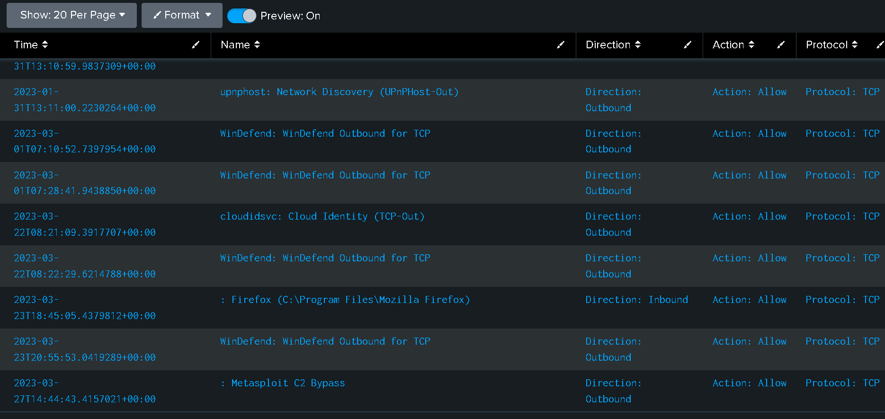

Este laboratorio ya lo resolví usando chanisaw para parsear los `.evtx` a formato json, y usando jq para inspeccionarlos desde la terminal. 
Esta vez los resolveré usando `Splunk`, resolviéndolo completamente con Splunk porque en mi primera resolución solo dijé que lo haría de dicha forma pero terminé usando `jq` jajaja. 

Se nos proporciona lo siguiente: 

```bash 
┌──(kali㉿kali)-[~/blue-labs/DFIR/logjamer/Event-Logs]
└─$ ls -lt 
total 17748
-rw-rw-r-- 1 kali kali  2166784 Mar 27  2023  System.evtx
-rw-rw-r-- 1 kali kali 12652544 Mar 27  2023  Powershell-Operational.evtx
-rw-rw-r-- 1 kali kali  1118208 Mar 27  2023 'Windows Defender-Operational.evtx'
-rw-rw-r-- 1 kali kali  1118208 Mar 27  2023 'Windows Firewall-Firewall.evtx'
-rw-rw-r-- 1 kali kali  1118208 Mar 27  2023  Security.evtx 
```

Podemos parsear todo con `EvtxEcmd`, una herramienta de Erik Zimmerman, yo usé el siguiente comando: 
```powershell
 .\EvtxECmd.exe -d "C:\Ruta\a\logjammer\Event-Logs\"  --json "C:\Ruta\salida\events.json"
```

En splunk creas un nuevo índice, en mi caso se llama `logjammer`, después añades nuevos datos, seleccionas `logjammer` como índíce y listo. 


Una pequeña introducción de lo que podemos encontrar en cada fuente de datos: 

- Security: El registro de Seguridad contiene eventos relacionados con la autenticación, autorización y administración de cuentas en Windows. Esto incluye inicios de sesión (logons), cierres de sesión (logoffs), cambios de contraseña, creación/borrado de cuentas, asignación de privilegios, uso de privilegios elevados, auditoría de objetos, etc.
- System: El registro de Sistema contiene eventos generados por componentes del propio sistema operativo, controladores (drivers), servicios de Windows y la capa del kernel. Se usa para monitorear el estado de arranque, apagado y errores de componentes internos.
- Poweshell: El registro de PowerShell (usualmente en Microsoft-Windows-PowerShell/Operational.evtx o Windows PowerShell/Operational.evtx) registra la ejecución de comandos, scripts y módulos de PowerShell. Incluye información sobre comandos invocados, parámetros, duración de ejecución y, dependiendo de la configuración de auditoría, el contenido del script (o un hash del mismo).
- Windows Defender: Este registro contiene eventos relacionados con la actividad de Windows Defender (el antivirus/antimalware nativo de Windows). Incluye detección de malware, análisis bajo demanda, actualizaciones de definiciones y bloqueos de objetos sospechosos.
- Windows Firewall: El registro de Firewall (Windows Firewall with Advanced Security) registra eventos de conexiones de red permitidas o bloqueadas, tanto de entrada como de salida, según las reglas configuradas. Cada evento incluye la dirección IP origen/destino, puertos, protocolos, aplicación involucrada y el resultado (permitido/bloqueado).

Con esto podemos pasar a las preguntas: 

-------

<h3 style="color: #9FEF00;">Task 1. When did the cyberjunkie user first successfully log into his computer? (UTC) </h3>

Aquí, podemos usar uno de los siguientes filtros en splunk: 

`index="logjammer" Channel=Security EventId=4624 "cyberjunkie"`

O:

`index="logjammer" EventId=4624 Provider="Microsoft-Windows-Security-Auditing" Cyberjunkie`

O simplemente: 

`index="logjammer" EventId=4624 cyberjunkie`

Pero todos usan la búsqueda de texto libre, lo cual recorre todo el raw en busca de la cadena “cyberjunkie”. La búsqueda de texto libre es más lenta y menos fiable (p. ej., puede coincidir con “DESKTOP\cyberjunkie” o con cualquier otra ocurrencia dentro del raw), es importante tener en cuenta esto.

Finalmente podríamos ordenar por tiempo de creación: 

`index="logjammer" EventId=4624 cyberjunkie | sort by TimeCreated`

Nos fijamos en el primer evento retornado: 


-----

<h3 style="color: #9FEF00;">Task 2. The user tampered with firewall settings on the system. Analyze the firewall event logs to find out the Name of the firewall rule added? </h3>

Para esto, podemos usar el siguiente comando: 

`index="logjammer" Channel="Microsoft-Windows-Windows Firewall With Advanced Security/Firewall" EventId=2004`

Y con esto vemos bastantes fuentes como Microsoft Edge, firefox, algunos juegos, podemos intentar excluirlos de la siguiente forma: 

`index="logjammer"
Channel="Microsoft-Windows-Windows Firewall With Advanced Security/Firewall"
EventId=2004
NOT (PayloadData1="*Microsoft Edge*" OR PayloadData1="*Chrome*" OR PayloadData1="*Firefox*" OR PayloadData1="*Windefend*" OR PayloadData1="*Games*")`

Pero con esto último no acabaríamos nunca, así que podemos acotar más los resultados con un filtro que obtenga solo reglas activas hacia el exterior: 

`index="logjammer"  Provider="Microsoft-Windows-Windows Firewall With Advanced Security" EventId="2004" PayloadData3"Direction: Outbound" PayloadData4="Action: Allow"`

Y podríamos seguir acotando, por ejemplo, con registros que tengan un número de puerto en el campo `RemoteHost`: 

`index="logjammer"  Provider="Microsoft-Windows-Windows Firewall With Advanced Security" EventId="2004" PayloadData3"Direction: Outbound" PayloadData4="Action: Allow" | where match(RemoteHost, ".*: [0-9]+$")`

En este punto ya podríammos crear una tabla para ver los nombres de las reglas: 

```bash 
index="logjammer"
Provider="Microsoft-Windows-Windows Firewall With Advanced Security"
EventId=2004
PayloadData4="Action: Allow"
| where match(RemoteHost, ".*: [0-9]+$")
| table TimeCreated, PayloadData1, PayloadData3, PayloadData4, PayloadData5
| rename TimeCreated as Time
         PayloadData1 as Name
         PayloadData3 as Direction
         PayloadData4 as Action
         PayloadData5 as Protocol
| sort 0 Time 
```

Pero aquí me di cuenta que podemos filtrar por el tipo de protocolo para la conexión, que siempre se usa TCP para conectarse a un C2 o una Shell reversa, entonces esto acota más los resultados. Además no podemos dar por hecho que la dirección de la conexión sea una conexión saliente. La query final quedaría algo así: 

```bash 
index="logjammer"
Provider="Microsoft-Windows-Windows Firewall With Advanced Security"
EventId=2004
PayloadData4="Action: Allow"
PayloadData5="Protocol: TCP" 
| table TimeCreated, PayloadData1, PayloadData3, PayloadData4, PayloadData5
| rename TimeCreated as Time
         PayloadData1 as Name
         PayloadData3 as Direction
         PayloadData4 as Action
         PayloadData5 as Protocol
| sort 0 Time
```



Es bastante obvio cual es el que nos interesa.

----

<h3 style="color: #9FEF00;">Task 3. Whats the direction of the firewall rule? </h3>

En la imagen anterior podemos ver la dirección de la conexión. 

----

<h3 style="color: #9FEF00;">Task 4. The user changed audit policy of the computer. Whats the Subcategory of this changed policy? </h3>

Para esto podemoa aplicar el siguiente filtro: 

`index="logjammer" audit policy`

De igual forma, el event id para esto es el `4179` así que aplicamos ese filtro y obtenemos lo siguiente: 

: 

![}(../assets/images/splunk-log/4.png)

Parece que tiene que ver con creación de tareas programadas, una técnica para mantener persistencia. 

-----

<h3 style="color: #9FEF00;">Task 5. The user "cyberjunkie" created a scheduled task. Whats the name of this task?  </h3>

Para esto podemos buscar por el siguiente `EventId 4698``, aplicamos la siguiente query: 

`index="logjammer" EventId=4698`


------

<h3 style="color: #9FEF00;">Task 6. Whats the full path of the file which was scheduled for the task? </h3>

Esto podemos verlo en el contenido del log, también vemos una forma de ver el nombre de la tarea: 


- `<Command>` : Indica el archivo o script que se ejecutará.

----

<h3 style="color: #9FEF00;">Task 7. What are the arguments of the command? </h3>


- <Arguments>: Son los parámetros que se le pasan a ese archivo/script cuando se ejecuta.

Esto significa que la tarea programada ejecutará el siguiente comando completo:

```powershell
C:\Users\CyberJunkie\Desktop\Automation-HTB.ps1 -A cyberjunkie@hackthebox.eu
```

-----

<h3 style="color: #9FEF00;">Task 8. The antivirus running on the system identified a threat and performed actions on it. Which tool was identified as malware by antivirus?  </h3>

Para esto podemos filtrar por el Canal `"Microsoft-Windows-Windows Defender/Operational"`
Aparecerán muchos logs, podemos primero analizar los event ID, tenemos varias formas de hacerlo: 
Podemos usar dedup para ver los EventId, una vez cada uno: 
```bash 
index="logjammer" Channel="Microsoft-Windows-Windows Defender/Operational"
| dedup EventId
| table EventId
```

Tambien podemos hacer esto con `stats`: 

```bash
index="logjammer" Channel="Microsoft-Windows-Windows Defender/Operational"
| stats values(EventId) as UniqueEventIds
```

Otra alternativa:

```bash 
index="logjammer" Channel="Microsoft-Windows-Windows Defender/Operational"
| stats values(EventId) as UniqueEventIds
| mvexpand UniqueEventIds
| rename UniqueEventIds as EventId
| table EventId
```

Para contar cuantas veces aparece cada uno: 

```bash 
index="logjammer" Channel="Microsoft-Windows-Windows Defender/Operational"
| stats count by EventId
```

Así que usamos este último, y podemos notar 2 cosas interesantes: 


Esos 2 eventsid significan lo siguiente: 

1116: Microsoft Defender Antivirus detectó malware u otro software potencialmente no deseado. Para obtener más información, consulte los siguientes detalles:

1117: Microsoft Defender Antivirus tomó medidas para proteger esta máquina de malware u otro software potencialmente no deseado. Para obtener más información, consulte los siguientes detalles:

Entonces, se detecta un malware, y el antivirus toma acciones, podemos buscar info en estos registros. 

Podemos aplicar el siguiente filtro: 


Nos preguntan por una herramienta, en este caso, Sharphound.

SharpHound es una herramienta de reconocimiento activo utilizada en entornos Active Directory (AD) para mapear relaciones de confianza entre usuarios, equipos, grupos y permisos. Es parte fundamental del proyecto BloodHound, una suite utilizada para la enumeración y análisis de privilegios en redes Windows.

-----

<h3 style="color: #9FEF00;">Task 9. Whats the full path of the malware which raised the alert? </h3>

Para esto, podemos aplicar el siguiente filtro y obtenemos la ruta del campo `payload`

```bash 
index="logjammer" Channel="Microsoft-Windows-Windows Defender/Operational" EventId=1117 
PayloadData1="Malware name: HackTool:MSIL/SharpHound!MSR"
```

-----

<h3 style="color: #9FEF00;">Task 10. What action was taken by the antivirus? </h3>

Esto podemos verlo en el campo `payload`, bajo el nombre: 

```bash
{"@Name":"Action ID","#text":"2"},{"@Name":"Action Name","#text":"Quarantine"},
```

------

<h3 style="color: #9FEF00;">Task 11. The user used Powershell to execute commands. What command was executed by the user? </h3>

Podemos usar el siguiente comando para ver los EventId: 

```bash 
index="logjammer"  Provider="Microsoft-Windows-PowerShell" 
| dedup EventId
| table EventId
```

Los que nos interesan son: 

Evento 4103 – "Registro de comandos usados dentro de scripts"
  Guarda los comandos que se usan dentro de scripts de PowerShell.

Evento 4104 – "Registro del contenido del script"
  Guarda el código completo que se ejecutó, línea por línea.


Así que podemos aplicar el siguiente comando: 

```bash 
index="logjammer"  Provider="Microsoft-Windows-PowerShell" EventId=4104
| dedup PayloadData2 
| table PayloadData2
```

En los primeros campos podemos ver lo siguiente: 

`ScriptBlockText: Get-FileHash -Algorithm md5 .\Desktop\Automation-HTB.ps1`

Esto para obtener el hash de un fichero que ya conocemos de anteriores preguntas. 

---- 

<h3 style="color: #9FEF00;">Task 12. We suspect the user deleted some event logs. Which Event log file was cleared? </h3>

Para esto, podemos aplicar el siguiente comando para ir jugando con las fechas: 

```bash 
index="logjammer" EventId=104 
|  where TimeCreated >= "2023-03-27T14:37:09"
```

Esto nos lanzará un único registro, la respuesta está en el campo `PayloadData1:`

------

Así que finalmente, la correlación de eventos quedaría así: 

| Timestamp           | Event                                         | Origin     | Event ID |
|---------------------|-----------------------------------------------|------------|----------|
| 2023-03-27T14:37:09 | CyberJunkie first login                       | Security   | 4624     |
| 2023-03-27T14:38:32 | CyberJunkie second login                      | Security   | 4624     |
| 2023-03-27T14:42:34 | SharpHound zip detected                       | Defender   | 1116     |
| 2023-03-27T14:42:48 | SharpHound quarantined                        | Defender   | 1117     |
| 2023-03-27T14:44:43 | Firewall modified to allow Metasploit out     | Firewall   | 2004     |
| 2023-03-27T14:50:03 | System audit policy changed                   | Audit      | 4719     |
| 2023-03-27T14:51:21 | Scheduled task created                        | Security   | 4698     |
| 2023-03-27T14:58:33 | Runs Automation-HTB.ps1                       | PowerShell | 4104     |
| 2023-03-27T15:01:56 | Firewall event logs cleared                   | System     | 104      |

