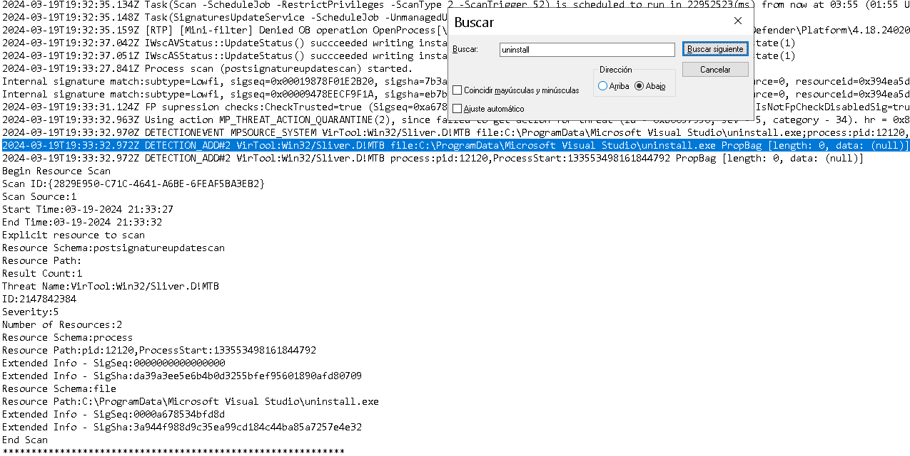

<p style="color: #9FEF00;">¿Qué hizo Alex para integrar el supuesto paquete que ahorra tiempo en el proceso de despliegue? (proporcione el comando completo) </p>

Bien, para esto podemos analizar el historial de powershell, que después de powershell 5.0 se guarda en la siguiente ruta:  

```bash 
%userprofile%\AppData\Roaming\Microsoft\Windows\PowerShell\PSReadline\ConsoleHost_history.txt
```
No hay un usuario llamado `Alex`, así que podemos pensar que los comandos se ejecutaron como administrador. 

Visitamor la ruta anterior para el usuario ´Administrador`y podemos ver lo siguiente: 


---
<p style="color: #9FEF00;">Identifica la URL desde la que se descargó el paquete.</p>

Esto podemos encontrarlo de en el historial del navegador y en el Zone Identifier, es una parte de una característica de Windows conocida como Alternate Data Streams (ADS) del sistema de archivos NTFS, y es en el MTF donde podeos encontrarlo

Cuando se descarga un archivo desde Internet (por ejemplo, usando un navegador), **Windows agrega un metadato oculto** al archivo que se llama:

```
Zone.Identifier
```

Este metadato indica desde qué "zona" de seguridad se descargó el archivo. Esto permite a Windows (y a software de seguridad) decidir si debe mostrar advertencias, bloquear su ejecución, etc.


Esto se guarda como un **Alternate Data Stream** (ADS), que es una especie de flujo oculto en el archivo, separado del contenido principal. No lo verás en el explorador de archivos, pero puedes verlo desde la línea de comandos.

Por ejemplo, si tenemos un fichero descargado llamado `archivo.exe`, el Zone Identifier se guarda así:

```
archivo.exe:Zone.Identifier:$DATA
```

### Se ve algo así:

```
neTransfer]
ZoneId=3
ReferrerUrl=https://ejemplo.com
HostUrl=https://ejemplo.com/descarga/archivo.exe
```
* `ZoneId=3` → significa que se descargó desde Internet.
* `HostUrl` → es la **URL exacta** desde donde se descargó el archivo.
* `ReferrerUrl` → indica desde qué página fuiste redirigido (si aplica).


### Zonas comunes (ZoneId):

| ZoneId | Zona                     |
| ------ | ------------------------ |
| 0      | Mi equipo                |
| 1      | Zona local intranet      |
| 2      | Zona sitios de confianza |
| 3      | Zona Internet            |
| 4      | Zona sitios restringidos |


### Para ver el Zone Identifier:

1. En PowerShell:

```powershell
Get-Content -Path .\archivo.exe -Stream Zone.Identifier
```

2. En CMD:

```cmd
more < archivo.exe:Zone.Identifier
```

Pero aún después de toda esta explciación, la forma más facil de encontrar en el historial de `Chrome` en la sigiuente ruta: 

```bash
...\nuts\C\Users\Administrator\AppData\Local\Google\Chrome\User Data\Default
```

Y aplicando un filtro:


---
<p style="color: #9FEF00;">¿Quién es el actor de la amenaza responsable de la publicación del paquete malicioso? (el nombre del editor del paquete) </p>

Para esto podemos ir visitar la URL que encontramos en la pregunta pasada, en la sección de `Owners`


---
<p style="color: #9FEF00;">¿Cuándo inició el atacante la descarga del paquete? Indique la fecha y hora en formato UTC (AAAA-MM-DD HH:MM). </p>

Para esto tenemos que analizar el $MFT proporcionado, usé `MFTEcmd` y `TimeLine Exlorer`, ambas herramietnas de Eric Zimmerman. 

Para parsear el MFT a un csv usamos el siguiente comando: 

```powershell
PS C:\Users\Lenovo\Downloads\compartida\MFTECmd> .\MFTECmd.exe -f "C:\Ruta\Al\`$MFT" --csv "C:\Ruta\Salida" --csvf mft.csv 
```

Abrimos el CSV con timeline explorer y filtramos por el nombre del fichero:


Podremos ver dos ´Created`: 

1. **Created (x10)**

   * Proviene del atributo `$STANDARD_INFORMATION` (ID 0x10) en la entrada del MFT.
   * Es el timestamp que Windows utiliza por defecto (lo que se ve en el Explorador de archivos).
   * Puede ser manipulado con timestomping, ya que los atacantes suelen cambiar este valor para ocultar actividad.

2. **Created (x30)**

   * Proviene del atributo `$FILE_NAME` (ID 0x30).
   * Contiene los timestamps asociados a la propia entrada del nombre de fichero (incluye long y short name).
   * Normalmente no se sobrescribe cuando se hace timestomping, por lo que sirve como “récord de respaldo” para detectar manipulaciones en el timestamp estándar.

---
<p style="color: #9FEF00;">A pesar de las restricciones, el atacante logró subir el archivo malicioso al sitio oficial alterando un detalle clave. Cuál es el ID de paquete modificado del paquete malicioso? </p>

Para esto podemos explorar el sitio, vemos que hay un paquete con un nombre similar, el atacante subió el fichero malicioso modificando el nombre: 


---
<p style="color: #9FEF00;">¿Qué técnica engañosa empleó el atacante durante la fase de acceso inicial para manipular la percepción del usuario? (nombre de la técnica) </p>

Esto se conoce como  `typo squatting` (también conocida como URL hijacking o typosquatting) es una táctica de ingeniería social que explota errores tipográficos comunes que los usuarios cometen al escribir la URL de un sitio web legítimo.

El atacante registra un dominio que se parece mucho al de una página popular, pero con errores intencionales.

---
<p style="color: #9FEF00;">Determine la ruta completa del archivo dentro del paquete que contiene el código malicioso. </p>


Para esto podemos explorar la siguiente ruta, que es donde se guardaron los ficheros de esta versión maliciosa: 

```bash 
C:\Users\Lenovo\Downloads\compartida\nuts\C\Users\Administrator\.nuget
```

Si seguimos explorando esta ruta eventualmente vamos a llegar al sigiente fichero: 


Este script desactiva el antivirus, crea una carpeta oculta, descarga un archivo malicioso desde un servidor remoto, y lo ejecuta, todo mientras limpia la consola para ocultar rastros.

```powershell
Set-MpPreference -DisableRealtimeMonitoring $true
```
**Desactiva el antivirus de Windows Defender en tiempo real**.

```powershell
Set-MpPreference -DisableScanningMappedNetworkDrivesForFullScan $true
```
Desactiva el escaneo de unidades de red durante un análisis completo.

```powershell
Clear-Host
```
Limpia la consola de PowerShell para que el usuario no vea lo que se está ejecutando.

---
<p style="color: #9FEF00;">Al manipular la configuración de seguridad del sistema, ¿qué comando empleó el atacante? </p>

```powershell
Set-MpPreference -DisableRealtimeMonitoring $true
```
Que desactiva el antivirus. 

---
<p style="color: #9FEF00;">Tras la alteración de la configuración de seguridad, el atacante descargó un archivo malicioso para asegurarse el acceso continuado al sistema. Proporcione el hash SHA1 de este archivo. </p>

Para esto podemos ir al directorio donde se descarga el fichero:
```bash 
C\ProgramData\Microsoft Visual Studio
```

Pero no hay nada en este directorio, entonces podemos revisar los logs del windows defender a ver si fue movido ahí, y encontramos lo siguiente: 


---
<p style="color: #9FEF00;">identifica el framework utilizado por el archivo malicioso para la comunicación de mando y control. </p>

Esto también lo podemos encontrar en el fichero con los logs de windos defender: 



**Sliver** es un **framework de Command and Control (C2)** de **código abierto**, desarrollado por Bishop Fox. Es una alternativa a Cobalt Strike, muy usado por red teams, pentesters… y ahora cada vez más por actores maliciosos.

### Características de Sliver:

*  Escrito en **Go (Golang)** → se compila para Windows, Linux y macOS fácilmente.
*  Usa múltiples canales de comunicación: HTTP(S), mTLS, DNS, WireGuard.
*  Permite ejecución de comandos, exfiltración de datos, persistencia, captura de pantalla, etc.
*  Soporta **agentes (implants)** que se inyectan en memoria o corren como procesos.
*  Muy evasivo frente a antivirus (usa técnicas de ofuscación y ejecución en memoria).

### Análisis del Log:

```
2024-03-19T19:33:32.970Z DETECTIONEVENT MPSOURCE_SYSTEM 
VirTool:Win32/Sliver.D!MTB 
file:C:\ProgramData\Microsoft Visual Studio\uninstall.exe;
process:pid:12120,ProcessStart:133553498161844792;
```

* **VirTool\:Win32/Sliver.D!MTB** → Es la **firma de detección** usada por Defender. El `D!MTB` indica una variante del Sliver implant clasificada como “Malicious Tool B”.
* **Ruta**: `C:\ProgramData\Microsoft Visual Studio\uninstall.exe` — justo donde el script lo descargó.
* **PID / Tiempo**: El proceso corrió con PID 12120 en ese momento exacto.
```

---
<p style="color: #9FEF00;">¿En que preciso momento fue ejecutado el malware? </p>

Para esto podemos buscar en el `prefetch`, que es una característica de optimización del sistema operativo Windows. Su objetivo es acelerar el arranque de aplicaciones que se ejecutan con frecuencia.

Cuando se ejecuta por primera vez un programa, Windows:
- Crea un archivo .pf en C:\Windows\Prefetch
- Guarda datos sobre el ejecutable: nombre, ruta, frecuencia de uso, y hora de la última ejecución

Puede incluir: 

| Campo                      | Descripción                                      |
| -------------------------- | ------------------------------------------------ |
| Nombre del ejecutable      | Por ejemplo, `UNINSTALL.EXE`                     |
| Ruta de ejecución          | Donde se encontraba en disco                     |
| Tiempo de última ejecución | Timestamp de la última vez que fue ejecutado     |
| Conteo de ejecuciones      | Cuántas veces se ejecutó ese archivo             |
| DLLs y archivos accedidos  | Archivos relacionados cargados durante ejecución |

Para ver esto vamos al directorio `C\Windows\prefetch` y con `PECmd.exe` parseamos todo a .csv: 

```powershell
.\PECmd.exe -d "C:\Ruta\C\Windows\prefetch" --csv "C:\Ruta\Salida" --csvf prefetch.csv  
```

Lo abrimos con timeline explorer, aplicamos un filtro y lo encontramos: 


---
<p style="color: #9FEF00;">El atacante cometió un error y no detuvo todas las funciones de las medidas de seguridad de la máquina. ¿Cuándo se detectó el archivo malicioso? Indique la fecha y hora en UTC.</p>


Esto podemos encontrarlo en los registro de Windwos defender que ya habíamos explorado antes, aplicamos un filtro por el nombre del ejecutable y tomamos la fecha de la primera coincidencia. 


---
<p style="color: #9FEF00;">Tras establecer una conexión con el servidor C2, ¿cuál fue la primera acción realizada por el atacante para enumerar el entorno? Indique el nombre del proceso.</p> 


Esto podemos verlo de varias forma, la más fácil sería explorar eldirectorio del prefetch:
```bash 
C\Windows\Prefetch
```

Pero también podeos verlo en los registros que parseamos a csv, solo revisemos los registros depués del `uninstall.exe`


comando `whoami` usado comunmente por los atacantes para comprobrar que se ha logrado acceso al sistema.

---
<p style="color: #9FEF00;"> Para asegurar el acceso continuo a la máquina comprometida, el atacante creó una tarea programada. ¿Cuál es el nombre de la tarea creada?</p>

Para esto podemos ir al directorio: 

```bash 

C\Windows\System32\Tasks
```

Vemos varios, algunos de Google, algunos de Edge, pero siempre hay que correlacionar eventos basándonos en los timestamps, finalmente encontramos la siguiente: 


---
<p style="color: #9FEF00;">¿Cuándo se creó la tarea programada? Indique la fecha y hora en UTC.</p>

Esto podemos verlo en la imagen de la pregunta anterior. 

---
 <p style="color: #9FEF00;"> Al concluir la intrusión, el atacante dejó un archivo específico en el host comprometido. ¿Cuál es el nombre de este archivo?</p>

Esto podemos encontrarlo de dos formas, primero explorando el siguiente fichero:

```bash 
C\$Extend\$J
```

Que es un UsnJournal, pero primero vamosa entender un par de cosas: 

- NTFS (New Technology File System) es el sistema de ficheros que usan Windows (desde Windows NT en adelante).

- Un sistema de ficheros journaling guarda un pequeño registro (diario) de las operaciones que va a realizar antes de aplicarlas de verdad al disco.
  Si hay un fallo (por ejemplo, un corte de luz mientras escribimos), Windows puede “repasar” ese diario y asegurarse de que el disco no quede corrupto.
  Es como si, antes de mover un libro de un estante a otro, dejáramos una nota en un cuaderno: “Mañana muevo el libro X de la estantería A a la B”. Si algo sale mal, leemos la nota y sabemos qué estábamos intentando. 


* **USN** quiere decir **Update Sequence Number**.
  El **USN Journal** (o Change Journal) es un volumen especial dentro de NTFS donde Windows apunta **cada cambio** que ocurre: creación, borrado, renombrado o modificación de cualquier archivo o carpeta.
  Cada entrada del journal incluye:

  * Un número secuencial (el USN)
  * Fecha y hora del cambio
  * Tipo de cambio (creación, borrado…)
  * Referencia al archivo o carpeta afectada
  
  Analogía del USN Journal

  Imaginemos que nuestro sistema de archivos es una gran biblioteca. El USN Journal es el registro donde anotamos **en orden** cada vez que alguien:

   1. Saca un libro
   2. Pone un libro nuevo
   3. Cambia la cubierta de un libro
   4. Mueve un libro de estante

  Con ese registro podemos saber **exactamente** qué pasó y cuándo.


* Dentro de la “bodega” de NTFS hay una carpeta oculta llamada `\$Extend`. Ahí viven varios archivos de sistema, no accesibles como los documentos.
  Uno de esos archivos es `\$UsnJrnl` (el journal en sí) y su flujo de datos principal se nombra `\$J`.
  Por tanto, `\\<unidad>\$Extend\$J` es la ubicación interna donde NTFS almacena ese registro de cambios. No lo abrirías con el Bloc de notas, sino con **herramientas forenses** o con el comando `fsutil usn readjournal`.

> Diferencias con la mft: Pensemos en la MFT como el catálogo actual de la biblioteca (qué libros hay y dónde), y en el USN Journal ($J) como el diario de registro donde se anotó cada vez que alguien sacó, devolvió, movió o modificó un libro. Cada uno cumple un rol distinto, complementario, pero no es redundante.

Explicado esto, podemos parsear este USN Journal con la herramienta `MFTEcms.exe`, la abrimos en el timeline explorer y podemos acotar los resultados aplicando un filtro en el campo `Update Reasons` y basándonos en los timpe stamps que ya conocemos, siendo muy observadores encontraremos lo siguiente: 


También lo podemos encontrar explorando el prefetch:
```bash 
C\Windows\prefetch
```

---
<p style="color: #9FEF00;">Como medida antiforense. El actor de la amenaza cambió el nombre del archivo después de ejecutarlo. ¿Cuál es el nuevo nombre del archivo?</p>

Para esto simplemente podemos ir a la MFT que ya parseamos con `MFTEcmd.exe`, buscamos un .exe con el mismo timestamp que el fichero de la pregunta anterior. 


---
<p style="color: #9FEF00;">Identifique la familia de malware asociada al archivo mencionado en la pregunta anterior (17).</p>

Para esto necesitamos obtener el fichero, en la pregunta anterior podemos ver en la MFT la ruta en donde está, vamos a esa ruta, obtenemos el hash: 
```bash 
┌──(kali㉿kali)-[~/…/nuts/Nuts/C/ProgramData]
└─$ sha256sum Updater.exe
e4dcead9d58de1edb041678f4437de4a43dcef1ba6e16a6e3cf4cebc8250d6ac  Updater.exe
```

Lo subimos a virus total y tenemos que ir probrando hasta que obtengamos la respuesta correcta. 


**Investigando sobre malware 'Impala'**

El usuario quiere saber más acerca de la familia de malware 'Impala'. Parece que esta es una consulta sobre ciberseguridad, por lo que necesitaré hacer una búsqueda para obtener más información. Investigaré fuentes confiables como ESET o Kaspersky, que suelen publicar sobre malware. Luego, resumiré los detalles sobre su origen, técnicas, tácticas, procedimientos (TTPs), explotación y módulos involucrados. Proporcionaré una respuesta precisa sin entrar en mucha verbosidad.

La familia de malware **Impala**, más conocida como **Impala Stealer**, es un conjunto de payloads maliciosos diseñados para robar credenciales de criptomonederos y mantenerse persistentes en sistemas Windows (principalmente de desarrolladores .NET) mediante ataques a la cadena de suministro de paquetes NuGet. A continuación, sus características principales:

* **Origen y vector de distribución**

  * Descubierto por el equipo de JFrog Security en abril de 2023, formó parte de la primera campaña de paquetes maliciosos en NuGet, donde los atacantes usaron typosquatting para publicar 13 paquetes que imitaban nombres legítimos (por ejemplo, `Coinbase.Core`, `DiscordRichPresence.API`, etc.).
  * Cada paquete incluía un script PowerShell (`init.ps1`) que, al instalarse, descargaba y ejecutaba un binario nativo en .NET compilado Ahead-of-Time (AoT).

* **Componentes y funcionalidad**

  1. **Persistencia**

     * Al ejecutarse, verifica la existencia de `%USERPROFILE%\.nuget` para confirmar la instalación vía NuGet.
     * Instala un “updater” en `%LOCALAPPDATA%\Squirrel-2021\Updater.exe`, vinculándolo al inicio de sesión del usuario mediante una entrada en el registro (`HKCU\...\Run`).
  2. **Auto-actualización**

     * El “updater” descarga versiones nuevas del payload desde servidores remotos y las coloca en `%PROGRAMDATA%\XboxGameBar\RuntimeBroker.exe`, asegurando que la amenaza se mantenga vigente y sea difícil de erradicar.
  3. **Crypto-stealer**

     * Busca instalaciones de **Exodus Wallet** en `%LOCALAPPDATA%\exodus\app-<versión>\resources\app.asar`, extrae el archivo Electron Archive con Rasar, modifica varios ficheros JavaScript para inyectar código malicioso y exfiltrar credenciales tras el inicio de sesión del usuario.
     * El exfiltrado se realiza típicamente a un webhook de Discord incorporado en el código inyectado.

* **Técnicas de evasión e inyección**

  * Inyección de JavaScript en aplicaciones legítimas como **Discord** y **VS Code** para ejecutar el malware cada vez que se lanzan.
  * Compilación AoT de .NET para dificultar el análisis estático y la ingeniería inversa.

* **Recomendaciones**

  * **Verificar firmas y hashes** de paquetes NuGet antes de instalar.
  * **Restringir la ejecución de scripts** (`init.ps1`) en entornos de desarrollo.
  * Monitorizar actividad inusual en `%LOCALAPPDATA%` y entradas al registro de inicio automático.
  * Emplear soluciones de escaneo SCA (Software Composition Analysis) que detecten typosquatting y scripts post-instalación no autorizados.

En resumen, la familia Impala Stealer ejemplifica un sofisticado ataque a la cadena de suministro de desarrolladores .NET, combinando técnicas de typosquatting, persistencia y robo de criptomonedas en un único payload altamente dinámico.

---
<p style="color: #9FEF00;">¿Cuándo se descargó el archivo en el sistema? Indique la hora en UTC.</p>

Esto lo podemos encontrar en la MFT, para el fichero `file.txt`

