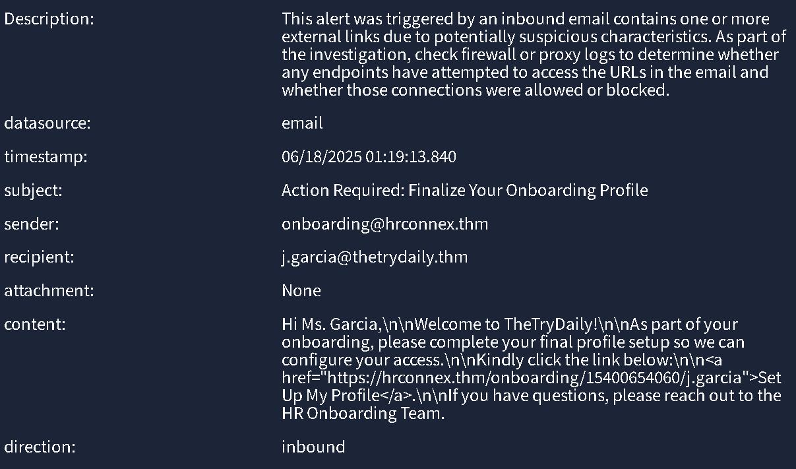
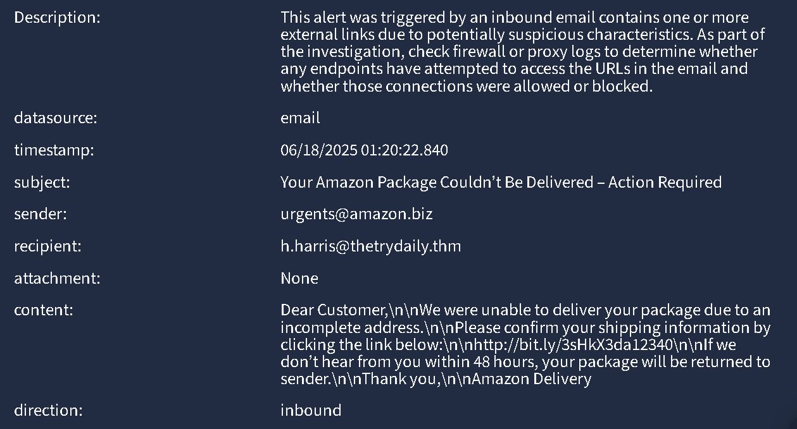
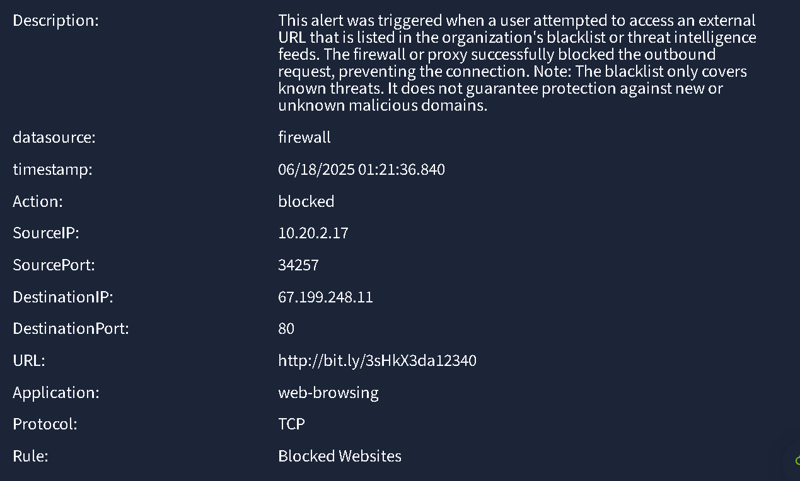

<h1 style="color: #b70f0f"> Introduction to Phishing: TryHackMe Laboratory Report </h3>

By Daniel Hernandez

17 June 2025

This report examines five phishing-related alerts to assess phishing awareness and accuracy in alert classification. Our objective was to determine whether each alert represented a true positive or a false positive. Upon review, we identified three true positives and two false positives.

Based on our findings, we offer several recommendations to enhance phishing detection and reduce false positives.

**Methodology**

**Data Sources**

- Splunk logs
- SPL queries for data extraction, validation, and event correlation

**Tools Used**

- SIEM Launcher for alert ingestion

**Classification Criteria**

- Attachment files: type and extension
- URLs: use of shorteners and domain validity
- Email domains: authenticity of sender domains
- Firewall rules: blocked vs. allowed traffic patterns

| ID   | Alert Rule                                             | Severity | Type     | Date                  |
| ---- | ------------------------------------------------------ | -------- | -------- | --------------------- |
| 8818 | Inbound Email Containing Suspicious External Link      | Medium   | Phishing | 16 June 2025 at 08:45 |
| 8817 | Inbound Email Containing Suspicious External Link      | Medium   | Phishing | 16 June 2025 at 08:44 |
| 8816 | Access to Blacklisted External URL Blocked by Firewall | High     | Firewall | 16 June 2025 at 08:43 |
| 8815 | Inbound Email Containing Suspicious External Link      | Medium   | Phishing | 16 June 2025 at 08:42 |
| 8814 | Inbound Email Containing Suspicious External Link      | Medium   | Phishing | 16 June 2025 at 08:41 |

---

## Alert IDs: 8814 and 8818

- **Rule**: Inbound Email Containing Suspicious External Link

- **Times**:

  - **8814**
    - Alert time: 16 June 2025 at 08:41
    - Log time: 06/16/2025 08:39:19.154
  - **8818**
    - Alert time: 16 June 2025 at 08:45
    - Log time: 06/16/2025 08:43:14.154

- **Description**:

  > This alert was triggered by an inbound email containing one or more external links with potentially suspicious characteristics. Investigators should check firewall or proxy logs to verify whether any endpoints attempted to access the URLs in the email and whether those connections were allowed or blocked.

- **Alert Details**:
  - Both alerts had the same content: 
    

- **Incident Classification**: False Positive

- **Related Entities**:

  - Sender: onboarding@hrconnex.thm
  - Recipient: j.garcia@thetrydaily.thm

- **Reason for Classification**: Both alerts correspond to a legitimate onboarding notification email. The sender’s address and URL domain match the organization’s branding and confirm the message’s authenticity.

---

## Alert ID: 8815

- **Rule**: Inbound Email Containing Suspicious External Link

- **Times**:

  - Alert time: 17 June 2025 at 00:31
  - Log time: 06/17/2025 00:29:52.501

- **Description**:

  > This alert was triggered by an inbound email containing one or more external links with potentially suspicious characteristics. Investigators should check firewall or proxy logs to verify whether any endpoints attempted to access the URLs in the email and whether those connections were allowed or blocked.

- **Incident Classification**: True Positive

- **Affected Entities**:

  - Sender: [urgents@amazon.biz](mailto\:urgents@amazon.biz)
  - Recipient: [h.harris@thetrydaily.thm](mailto\:h.harris@thetrydaily.thm)

- **Alert Details**:
  

- **Reason for Classification**:

  - The sender’s domain uses `.biz` instead of the legitimate `.com` and the email address `urgents@amazon.biz` conveys undue urgency.
  - The use of a URL shortener is typical of phishing attempts to conceal malicious destinations.

- **Escalation**: No escalation required; the firewall successfully blocked the email.

- **Recommended Remediation Actions**:

  - Conduct phishing awareness training for employees.
  - Monitor user activity for signs of credential disclosure.

- **Attack Indicators**:

  - Phishing techniques
  - URL shortener usage
  - Suspicious sender domain
  - Social engineering

---

## Alert ID: 8816

- **Rule**: Access to Blacklisted External URL Blocked by Firewall

- **Times**:

  - Alert time: 17 June 2025 at 04:42
  - Log time: 06/17/2025 04:40:20.279

- **Description**:

  > This alert was triggered when a user attempted to access a URL listed in the organization’s blacklist or threat intelligence feeds. The firewall blocked the outbound request, preventing a potential compromise.

- **Incident Classification**: True Positive

- **Affected Entities**:

  - Source IP: 10.20.2.17 (port 34257)
  - Destination IP: 67.199.248.11 (port 80)

- **Alert Details**:
  

- **Reason for Classification**: The URL shortener is commonly used to mask malicious destinations, and the firewall log confirms the block action.

- **Escalation**: No escalation required; the firewall successfully blocked the request.

- **Attack Indicators**:

  - Phishing techniques
  - URL shortener usage
  - Social engineering
  - Typosquatting

---

## Alert ID: 8817

- **Rule**: Inbound Email Containing Suspicious External Link

- **Times**:

  - Alert time: 17 June 2025 at 00:34
  - Log time: 06/17/2025 00:32:38.501

- **Description**:

  > This alert was triggered by an inbound email containing one or more external links with potentially suspicious characteristics. Investigators should check firewall or proxy logs to verify whether any endpoints attempted to access the URLs in the email and whether those connections were allowed or blocked.

- **Incident Classification**: True Positive

- **Affected Entities**:

  - Sender: [no-reply@m1crosoftsupport.co](mailto\:no-reply@m1crosoftsupport.co)
  - Recipient: [c.allen@thetrydaily.thm](mailto\:c.allen@thetrydaily.thm)

- **Alert Details**: 
  

- **Reason for Classification**:

  - The sender’s domain (`m1crosoftsupport.co`) impersonates Microsoft through typosquatting.
  - The email originates from an unexpected geolocation (Nigeria).

- **Escalation**: The firewall did not block this email. Escalation is required to review and enhance content-filtering rules.

- **Recommended Remediation Actions**:

  - Review and update firewall and email filtering policies.
  - Block known typosquatting domains.

- **Attack Indicators**:

  - Typosquatting
  - Phishing techniques
  - Social engineering

