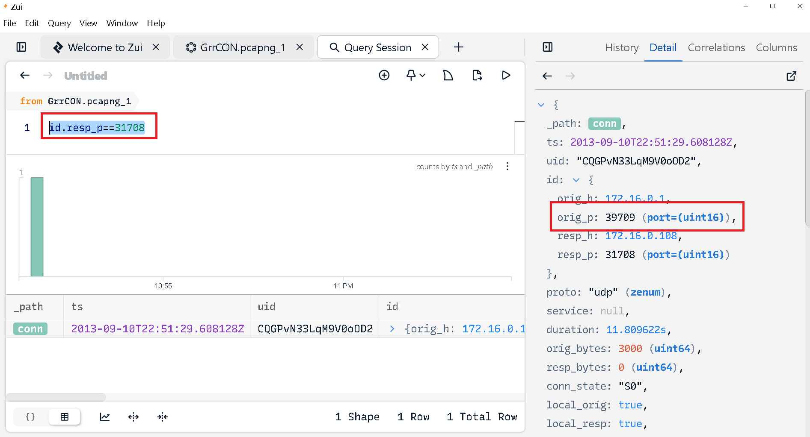

Se nos proporcionan los siguiente ficheros: 

```bash 
┌──(kali㉿kali)-[~/blue-labs/grr]
└─$ tree temp_extract_dir
temp_extract_dir
├── GrrCON.pcapng
├── IR-Alert.png
└── Ubuntu10-4
    ├── DFIRwebsvr.zip
    └── webserver.vmss
```

Así que podemos pasar con las preguntas: 


<h3 style="color: #0d6efd;">Q1. PCAP: Development.wse.local is a critical asset for the Wayne and Stark Enterprises, where the company stores new top-secret designs on weapons. Jon Smith has access to the website and we believe it may have been compromised, according to the IDS alert we received earlier today. First, determine the Public IP Address of the webserver? </h3>

Bien, de nuestro análisis con zeek, podemos ver la información del análisis del tráfico http. 

```bash 
root@f267abe59dde:/mnt# zeek-cut id.orig_h id.resp_h < http.log
172.16.0.1      172.16.0.108
172.16.0.1      172.16.0.108
172.16.0.1      172.16.0.108
172.16.0.109    204.95.26.216
172.16.0.109    204.79.197.200
172.16.0.109    204.79.197.200
172.16.0.109    204.79.197.200
<SNIP>
```

Algunas ip privadas sugieren que se está dentro de un contenedor, para obtener la ip tenemos que movernos a wireshark para 


Podemos ver en el campo `host` la ip perteneciente al servidor.

----

<h3 style="color: #0d6efd;">Q2. PCAP: Alright, now we need you to determine a starting point for the timeline that will be useful in mapping out the incident. Please determine the arrival time of frame 1 in the "GrrCON.pcapng" evidence file. </h3>


------

<h3 style="color: #0d6efd;">Q3. PCAP: What version number of PHP is the development.wse.local server running? </h3>

Para esto podemos aplicar el siguiente filtro: `http and frame contains "php"` para acotar más los resultados. 


El campode la cabecera que nos importa es el `X-Powered-By`, con esto podemos conocer las versiones de software que usa el servidor para entender el ataque. 

------

<h3 style="color: #0d6efd;">Q4. PCAP: What version number of Apache is the development.wse.local web server using? </h3>

También lo podemos ver en el paquete anterior.


-----

<h3 style="color: #0d6efd;">Q5. IR: What is the common name of the malware reported by the IDS alert provided? </h3>

Para esto abrimos la imagen `IR-Alert` y observamos que la detección está relacionada con un troyano de nombre `Zeus`

El troyano Zeus (también conocido como Zbot) es uno de los malware de tipo banker más notables y longevos en la historia de la ciberdelincuencia. Apareció por primera vez alrededor de 2007 y, a lo largo de los años, ha evolucionado a múltiples variantes (como Gameover Zeus, Zeus Panda, entre otros) que han apuntado principalmente a víctimas con el objetivo de robar credenciales bancarias y otra información sensible.


-----

<h3 style="color: #0d6efd;">Q6. PCAP: Please identify the Gateway IP address of the LAN because the infrastructure team reported a potential problem with the IDS server that could have corrupted the PCAP </h3>

Bien, ya sabemos que estamos dentro de un contenedor o una máquina virtual, sabemos que nuestro servidor tiene la ip privada `127.16.0.108`, y la ip del gateway normalmente es la primera dirección de un rango de red, en este caso, la `127.16.0.1`.

-----

<h3 style="color: #0d6efd;">Q7. IR: According to the IDS alert, the Zeus bot attempted to ping an external website to verify connectivity. What was the IP address of the website pinged? </h3>

Abriendo la imagen, vemos que la descripción de la firma es `ET TROJAN Zeus Bot GET to Google checking Internet connectivity`

- IP Header Information
- Source (Origen): 172.16.0.109
- Destination (Destino): 74.125.225.112
- Ver: 4 (IPv4)
- Hlen, Tos, Len, ID, Flags, Off, TTL, Proto, Csum:
    Campos típicos del encabezado IP. Lo más importante para nosotros: el campo Destination indica a qué IP el host infectado está enviando tráfico.

La IP pertenece a los servidores de google, esta es una técnica para revisar primero si se tiene conexión a internet, que a su vez evita levantar sospechas si primero se intenta conectar con el C2. 

-----

<h3 style="color: #0d6efd;">Q8. PCAP: It’s critical to the infrastructure team to identify the Zeus Bot CNC server IP address so they can block communication in the firewall as soon as possible. Please provide the IP address? </h3>

Para esto, usamos la herramienta `Zui`, una herramienta que permite analizar ficheros .pcap y encontrar alertas de seguridad basadas en firmas de actividad sospechosa bien conocidas.

Ahora, ya sabemos que el host comprometido es `172.16.0.19`. 
Así que aplicamos el siguiente filtro: `event_type == "alert" alert.severity == 1  alert.category == "Malware Command and Control Activity Detected"`


-------

<h3 style="color: #0d6efd;">Q9. PCAP: The infrastructure team also requests that you identify the filename of the “.bin” configuration file that the Zeus bot downloaded right after the infection. Please provide the file name? </h3>

Bien, ya tenemos la ip del C2, así que buscamos tráfico relacionado con este servidor. 


------

<h3 style="color: #0d6efd;">Q10. PCAP: No other users accessed the development.wse.local WordPress site during the timeline of the incident and the reports indicate that an account successfully logged in from the external interface. Please provide the password they used to log in to the WordPress page around 6:59 PM EST? </h3>

Para esto filtramos por paquetes http y por la ip del servidor, buscamos paquete relacionados con login's y que tengan el método POST: 


------

<h3 style="color: #0d6efd;">Q11. PCAP: After reporting that the WordPress page was indeed accessed from an external connection, your boss comes to you in a rage over the potential loss of confidential top-secret documents. He calms down enough to admit that the design's page has a separate access code outside to ensure the security of their information. Before storming off he provided the password to the designs page “1qBeJ2Az” and told you to find a timestamp of the access time or you will be fired. Please provide the time of the accessed Designs page? </h3>

Para esto, aplicamos el siguiente filtro para encontrar otros accesos, y encontramos lo siguiente: 


-----

<h3 style="color: #0d6efd;">Q12. PCAP: What is the source port number in the shellcode exploit? Dest Port was 31708 IDS Signature GPL SHELLCODE x86 inc ebx NOOP </h3>

La firma de la que nos hablan se refiere a: 

- “GPL SHELLCODE x86”: indica que el IDS está buscando patrones de bytes (firmas) que coincidan con código de shellcode escrito para arquitectura x86.
- “inc ebx” y “NOOP”: son instrucciones muy frecuentes dentro de un bloque de shellcode que, tradicionalmente, se utilizan para rellenar (padding) o desviar la ejecución de manera muy característica. El IDS, al ver esa secuencia de instrucciones (por ejemplo, opcode 43 para inc ebx, seguido de muchos 90 para NOP), concluye “esto parece un trozo de shellcode x86” y dispara la alerta.

Aplicamos el siguiente filtro en Zui: 



Igual podriamos intentar obtener esto con wireshark filtranco con puertos TCP o UDP en este caso: `udp.port == 31708`, `tcp.port == 31708`

-------

<h3 style="color: #0d6efd;">Q13. PCAP: What was the Linux kernel version returned from the meterpreter sysinfo command run by the attacker? </h3>

Para esto podemos aplicar directamente el siguiente filtro: `frame contains "sysinfo"`

En el primer paquete que nos devuelve el filtro seguimos el flujo TCP y podremos encontrar lo siguiente: 


----

<h3 style="color: #0d6efd;">Q14. PCAP: What is the value of the token passed in frame 3897? </h3>

Vamos a este paquete, y podemos encontrar lo siguiente: 


Si seguimos el flujo http, podemos ver que se trata de phpMyadmin, un panel de administración muy conocido para administrar servidores web. 

-----

<h3 style="color: #0d6efd;">Q15. PCAP: What was the tool that was used to download a compressed file from the webserver? </h3>

En esto podemos pensar rápidamente en la herramienta `wget`, muy típica para descargar contenido desde un servidor en internet.
Podemos confirmalo con lo siguiente: 

Podemos verlo con el siguiente filtro en Zui: `_path=="http" | count() by user_agent

Lo confirmamos con wireshark:


-----

<h3 style="color: #0d6efd;">Q16. PCAP: What is the download file name the user launched the Zeus bot? </h3>

Para esto, podemos aplicar el siguiente filtro: 


Vemos un par de `.exe`, desafortunadamente no podemos obtener el .exe directamente desde el pcap.

----

<h3 style="color: #0d6efd;">Q17. Memory: What is the full file path of the system shell spawned through the attacker's meterpreter session? </h3>

Para esto copiamos el perfil que nos proporciona el laboratorio en la siguiente ruta: 
```bash 
┌──(kali㉿kali)-[~/blue-labs/grr/temp_extract_dir/Ubuntu10-4]
└─$ cp DFIRwebsvr.zip ../../../volatility/volatility/plugins/overlays/linux
```

En este caso, estamos usando volatility2, con esto ya podemos pasar a analizar el volcado de memoria con el siguiente comando:

```bash 
┌──(venv)─(kali㉿kali)-[~/blue-labs/volatility]
└─$ python2 vol.py -f ../grr/temp_extract_dir/Ubuntu10-4/webserver.vmss --profile=LinuxDFIRwebsvrx64 linux_psaux
```

Y podemos ver en la salida lo siguiente: 


`-c`: Indica que el argumento que sigue es una cadena de comandos a ejecutar.

Otra cosa interesante es el `Uid`, que es el 33, pertenece al usuario `www-data`: 

`www-data:x:33:33:www-data:/var/www:/usr/sbin/nologin`

Usuario usado normalmente para servicios web en sistemas linux basados en debian. Parece que un atacante logró acceder alservidor e inició una shell con este usuario. 

----

<h3 style="color: #0d6efd;">Q18. Memory: What is the Parent Process ID of the two 'sh' sessions? </h3>

Para esto aplicamos el siguiente filtro:

```bash 
┌──(venv)─(kali㉿kali)-[~/blue-labs/volatility]
└─$ python2 vol.py -f ../grr/temp_extract_dir/Ubuntu10-4/webserver.vmss --profile=LinuxDFIRwebsvrx64 linux_pslist
```

Vemos las 2 sesiones ssh, la segunda, hija de la primera, y la primera hija del proceso `Apache`, lo cual tiene sentido porque es un servidor web el que investigamos. 

-------

<h3 style="color: #0d6efd;">Q19. Memory: What is the latency_record_count for PID 1274? </h3>

- En Windows, cada proceso (EPROCESS) puede tener varios hilos (KTHREAD).
- Los hilos, a su vez, tienen campos que el kernel utiliza para llevar estadísticas de rendimiento y programación (scheduler).
- Uno de esos campos se llama LatencyRecordCount (o LatencyRecords), y básicamente es un contador de cuántos “registros de latencia” se han acumulado para ese hilo. Estos registros se usan internamente (principalmente en Windows Server o versiones con perfil de “traceo de rendimiento”) para diagnosticar en qué momentos un thread estuvo esperando mucho tiempo en la cola de ejecución o sufrió retardos.

Los latency records son entradas que Windows puede generar internamente para llevar un historial de:

- Cuándo un hilo fue suspendido.
- Cuánto tiempo estuvo esperando antes de volver a ejecutarse.
- Qué evento o causa provocó esa espera (bloqueo, I/O, espera en mutex, etc.).

> Se utilizan principalmente en escenarios de diagnóstico, trazado de rendimiento o en versiones de servidor (como Windows Server), y son parte del sistema de “scheduler instrumentation”.Los latency records son entradas que Windows puede generar internamente para llevar un historial de:

Para esto hacemos lo sigiente: 

Obtenemos el `offset`

```bash 
┌──(venv)─(kali㉿kali)-[~/blue-labs/volatility]
└─$ grep 1274 pslist
0xffff880006dd8000 sh                   1274            1042            33              33     0x0000000006d94000 2013-09-10 22:55:40 UTC+0000
0xffff88000a9b1700 sh                   1275            1274            33              33     0x0000000006eb3000 2013-09-10 22:55:40 UTC+0000
```

Es el `0xffff880006dd8000`, con esto ahora usamos la herramienta `linux_volshell`, que nos abre una consola: 

```bash 
┌──(venv)─(kali㉿kali)-[~/blue-labs/grr/temp_extract_dir/Ubuntu10-4]
└─$ python2 ../../../volatility/vol.py -f webserver.vmss --profile=LinuxDFIRwebsvrx64 linux_volshell
Volatility Foundation Volatility Framework 2.6.1
Current context: process init, pid=1 DTB=0x176ba000
Welcome to volshell! Current memory image is:
file:///home/kali/blue-labs/grr/temp_extract_dir/Ubuntu10-4/webserver.vmss
To get help, type 'hh()'
>>>
```

Y ejecutamos lo siguiente para obtener la información de este Offset: `dt("task_struct", 0xffff880006dd8000)`.

Obtenemos lo siguiente: 


- 0x7b0: Es la dirección de memoria o el offset dentro de la estructura del hilo (_KTHREAD) donde se encuentra el campo latency_record_count.
    Esto es útil para herramientas como Volatility o Rekall, que leen directamente estructuras en memoria RAM.
- El valor hexadecimal 0x7b0 indica en qué parte de la estructura está ubicado este contador.
- latency_record_count: Es el nombre del campo. Este contador indica cuántos latency records (registros de latencia) están asociados al hilo.
- 0: Significa que no se han registrado retardos o eventos de latencia para este hilo desde que se inició (o desde que se limpiaron los contadores).

----

<h3 style="color: #0d6efd;">Q21. Memory: For the PID 1274, what is the first mapped file path? </h3>

Buscamos

```bash 
┌──(venv)─(kali㉿kali)-[~/blue-labs/grr/temp_extract_dir/Ubuntu10-4]
└─$ python2 ../../../volatility/vol.py -f webserver.vmss --profile=LinuxDFIRwebsvrx64 linux_proc_maps > proc_maps
Volatility Foundation Volatility Framework 2.6.1
```

Y buscamos esto: 
```bash 
┌──(venv)─(kali㉿kali)-[~/blue-labs/grr/temp_extract_dir/Ubuntu10-4]
└─$ grep 1274 proc_maps
0xffff880006dd8000     1274 sh                   0x0000000000400000 0x0000000000418000 r-x                   0x0      8      1     651536 /bin/dash
0xffff880006dd8000     1274 sh                   0x0000000000617000 0x0000000000618000 r--               0x17000      8      1     651536 /bin/dash
0xffff880006dd8000     1274 sh                   0x0000000000618000 0x0000000000619000 rw-               0x18000      8      1     651536 /bin/dash
<SNIP>
```

/bin/dash es un intérprete de comandos (shell), específicamente la Debian Almquist Shell, una versión simplificada y muy eficiente de la tradicional Bourne shell (sh).

-> linux_pslist

Este plugin de Volatility:
 - Lista los procesos activos en el sistema Linux al momento del volcado de memoria.
 - Recupera procesos a partir de la estructura task_struct, que es el descriptor principal del kernel para los procesos.
 - Muestra información como:
    - PID, nombre del proceso, estado, PPID, tiempo de ejecución, etc.

 Uso típico:
    - Enumerar todos los procesos activos.
    - Ver relaciones padre-hijo entre procesos.
    - Detectar procesos maliciosos o anómalos.

-> linux_proc_maps

Este plugin:

Muestra las regiones de memoria mapeadas para cada proceso (usualmente representadas en /proc/[pid]/maps en sistemas vivos).

Extrae:
 - Rangos de direcciones virtuales.
 - Permisos (rwx).
 - Tamaño.
 - Offset.
 - Ruta del binario o archivo asociado (si lo hay).

 Uso típico:
    - Ver qué archivos están cargados en memoria por un proceso (por ejemplo, /bin/bash, /usr/lib/..., etc.).
    - Identificar inyecciones de código (cuando hay regiones r-x sin nombre o con nombre sospechoso).
    - Ver si un proceso tiene una shell o binario inyectado en memoria.

-----

<h3 style="color: #0d6efd;">Q21. Memory:What is the md5hash of the receive.1105.3 file out of the per-process packet queue? </h3>

```bash 
┌──(venv)─(kali㉿kali)-[~/blue-labs/grr/temp_extract_dir/Ubuntu10-4]
└─$ mkdir dump

┌──(venv)─(kali㉿kali)-[~/blue-labs/grr/temp_extract_dir/Ubuntu10-4]
└─$ python2 ../../../volatility/vol.py -f webserver.vmss --profile=LinuxDFIRwebsvrx64 linux_pkt_queues -D dump/
Volatility Foundation Volatility Framework 2.6.1
Wrote 32 bytes to receive.930.10
Wrote 32 bytes to receive.1105.3

┌──(venv)─(kali㉿kali)-[~/blue-labs/grr/temp_extract_dir/Ubuntu10-4]
└─$ md5sum dump/*
1fe2f3c29e6b5ce87f3228ba1c7b271c  dump/receive.930.10
184c8748cfcfe8c0e24d7d80cac6e9bd  dump/receive.1105.3
```

Este plugin inspecciona los buffers de red internos por proceso en memoria RAM. En sistemas Linux, cada proceso que abre un socket de red tiene una cola (queue) donde se almacenan temporalmente los paquetes entrantes antes de que el proceso los consuma.

El plugin linux_pkt_queues permite:

- Extraer esos datos de red sin depender de pcap o Wireshark.
- Obtener el contenido bruto de paquetes recibidos por un proceso (por ejemplo, un payload, una shellcode o incluso comandos interactivos).
- Volcar esos datos a archivos como receive.PID.index.
- Analizar el contenido de posibles payloads maliciosos, exploits o shells interactivas.


Cada archivo contiene el contenido de un paquete recibido por ese proceso. Estos paquetes están en bruto (raw) y pueden incluir:
- Peticiones HTTP
- Comandos de shell enviados desde una reverse shell
- Shellcode recibido a través de un exploit
- Archivos transmitidos por sockets

Parece que no contienen nada interesante: 

```bash 
┌──(venv)─(kali㉿kali)-[~/blue-labs/grr/temp_extract_dir/Ubuntu10-4]
└─$ hexdump -C dump/receive.1105.3
00000000  22 c7 10 00 01 08 f8 00  05 c7 91 30 ff 7f 00 00  |"..........0....|
00000010  07 c7 91 30 ff 7f 00 00  04 c7 91 30 ff 7f 00 00  |...0.......0....|
00000020

┌──(venv)─(kali㉿kali)-[~/blue-labs/grr/temp_extract_dir/Ubuntu10-4]
└─$ hexdump -C dump/receive.930.10
00000000  22 c7 0f 00 01 08 f8 00  05 c7 91 30 ff 7f 00 00  |"..........0....|
00000010  07 c7 91 30 ff 7f 00 00  04 c7 91 30 ff 7f 00 00  |...0.......0....|
00000020
```
