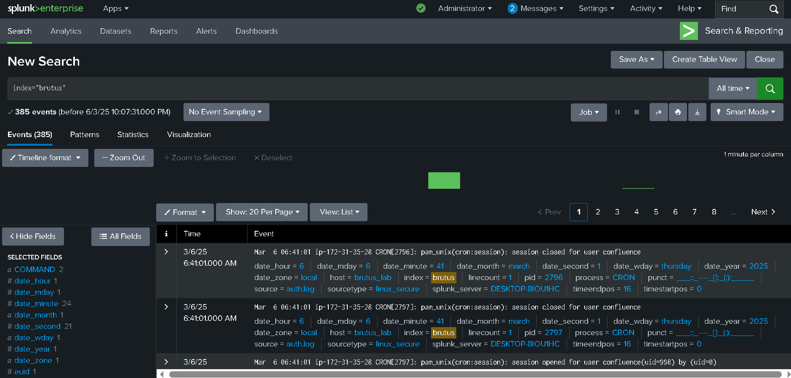
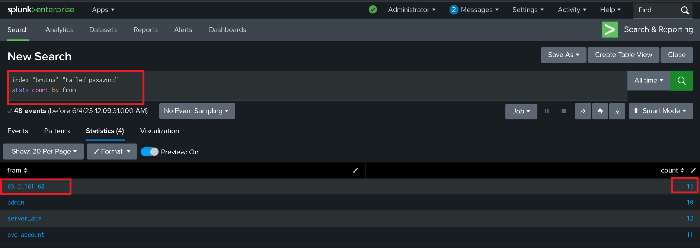
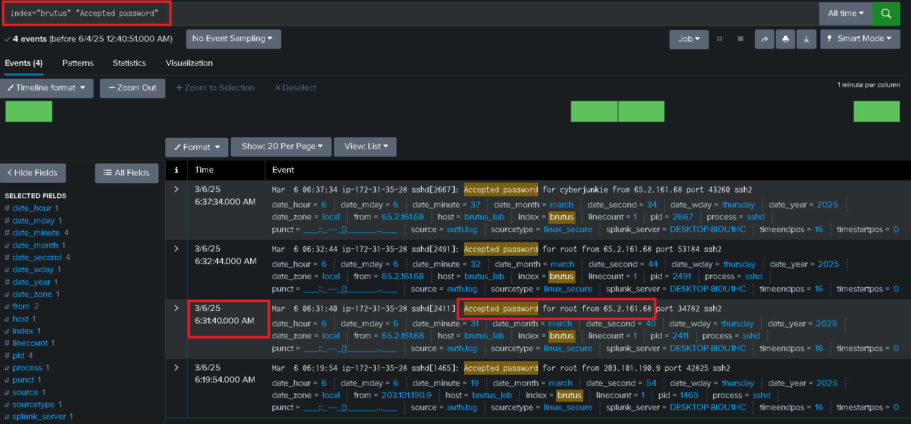
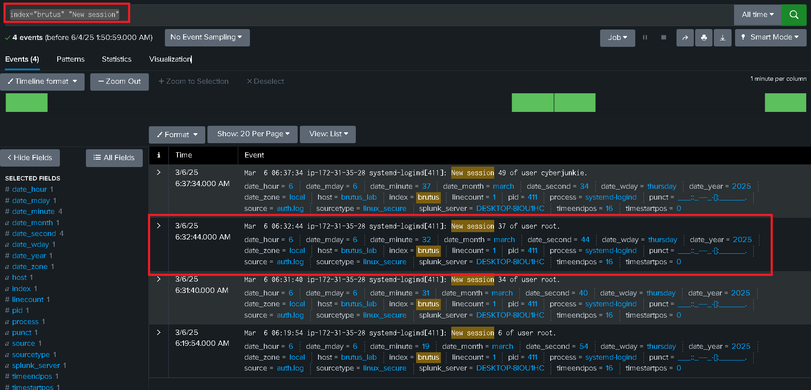
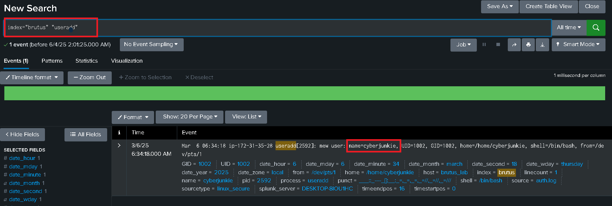
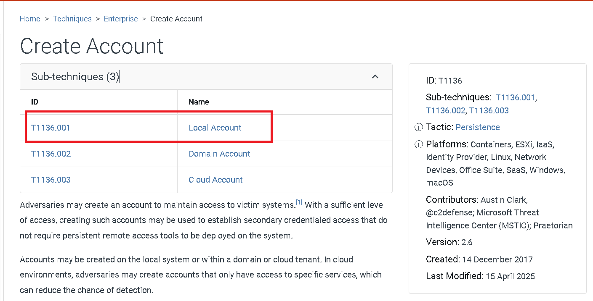
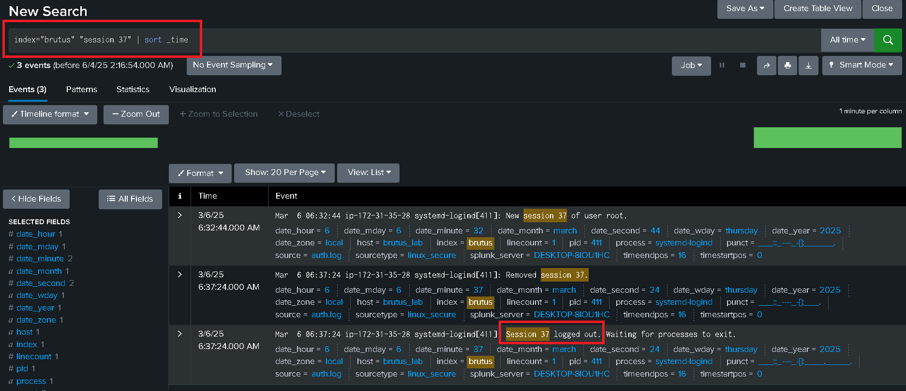
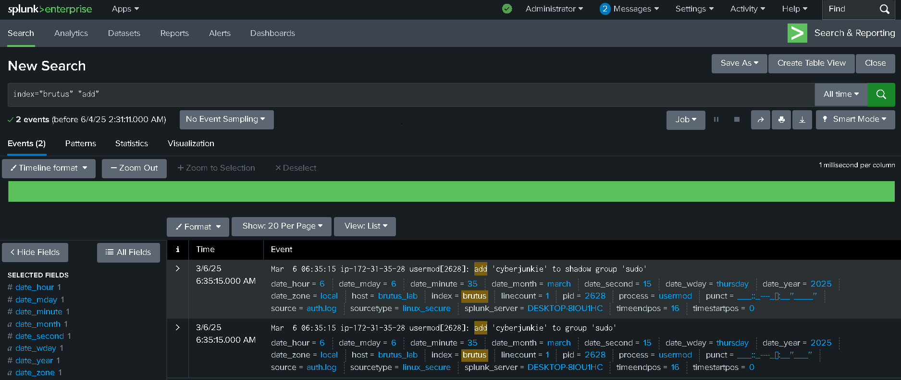
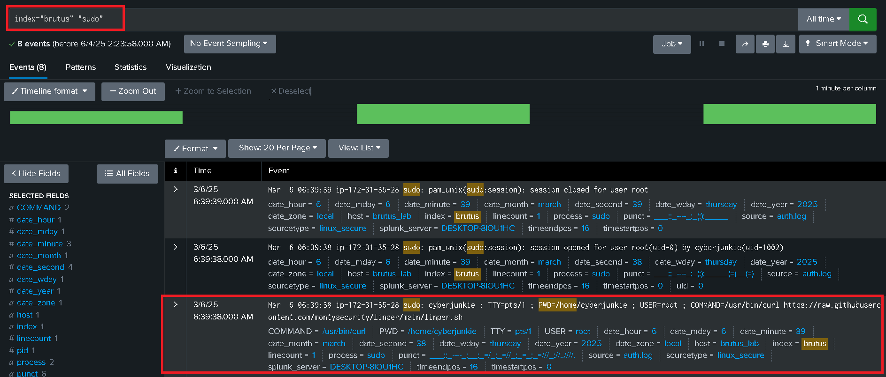

Estaremos realizando este laboratorio usando splunk, que no es la forma del todo óptima, pero sirve para practicar splunk. 


Primeramente tenemos que crear un índice, esto lo podemos hacer dentro de la interfaz en `Settings >Indexes(En la sección de data) >  New Index`, en mi caso decidí llamarlo "brutus".

Después ya podemos ingestar el fichero `auth.log` en `settings > add data` y ya podríamos ver los datos: 



Con esto podemos pasar rápidente a las preguntas.

----

<h3 style="color: #9FEF00;">Task 1. Analyze the auth.log. What is the IP address used by the attacker to carry out a brute force attack? </h3>

Podemos usar el siguiente comando en splunk: 



> para esto necesitamos seleccionar un campo en `Extract New Fields`

Alternativamente podemos encontrarlo con la terminal: 

```bash
└─$ grep sshd auth.log | grep -v pam_unix | grep -oP '[0-9]{1,3}\.[0-9]{1,3}\.[0-9]{1,3}\.[0-9]{1,3}' | sort | uniq -c

170 65.2.161.68
```

----

<h3 style="color: #9FEF00;">Task 2. The bruteforce attempts were successful and attacker gained access to an account on the server. What is the username of the account? </h3>

Podemos aplicar el siguiente filtro en splunk: 



Con la terminal: 

```bash 
└─$ grep sshd auth.log | grep -v pam_unix | grep 'Accepted password' | grep 65.2.161.68
└─$ grep sshd auth.log | grep -v pam_unix | grep 65.2.161.68 | grep -A3 'Accepted password'
```

------

<h3 style="color: #9FEF00;">Task 3. Identify the UTC timestamp when the attacker logged in manually to the server and established a terminal session to carry out their objectives. The login time will be different than the authentication time, and can be found in the wtmp artifact. </h3>

El archivo wtmp en sistemas Linux es un archivo de registro binario que guarda información sobre los inicios y cierres de sesión de los usuarios, así como los reinicios del sistema. No es un archivo de texto, sino binario, y solo puede leerse con herramientas como last, que interpretan su formato.
Generalmente, wtmp se encuentra en /var/log/wtmp.

Así que, en la captura anterior podemos ver en qué rango de tiempo ocurrió el ataque de fuerza bruta, y  nos fijamos en un loggin que se encuentré fuera de este rango de tiempo proveniente de la ip que ya conocemos. 

Podemos encontrarlo de la siguiente forma con la terminal:

```bash 
TZ=utc last -f wtmp -F
```

- Revisamos los logs, verificamos los logs con la ip del atacante: 65.2.161.68
- Revisamos los tiempos, cuando logro obtener las credenciales y cuando ingresó manualmente. 

----

<h3 style="color: #9FEF00;">Task 4. SSH login sessions are tracked and assigned a session number upon login. What is the session number assigned to the attacker's session for the user account from Question 2? </h3>

Para esto podríamos aplicar el siguiente filtro en splunk: 



solo bastaría correlacionar eventos.

-----

<h3 style="color: #9FEF00;">Task 5. The attacker added a new user as part of their persistence strategy on the server and gave this new user account higher privileges. What is the name of this account? </h3>




-----

<h3 style="color: #9FEF00;">Task 6. What is the MITRE ATT&CK sub-technique ID used for persistence by creating a new account? </h3>




-----

<h3 style="color: #9FEF00;">Task 7. What time did the attacker's first SSH session end according to auth.log? </h3>

Bien, estamos siguiente la sesión 37, así que podemos filtrar por ésta para ver la actividad: 



-----

<h3 style="color: #9FEF00;">Task 8. The attacker logged into their backdoor account and utilized their higher privileges to download a script. What is the full command executed using sudo? </h3>

Mencionan que usó el comando "sudo", podríamos ver eventos interesantes como el usuario añadiéndose al grupo `sudo`




Es importante saber esto para seguir la actividad del usuario, ya podemo pasar a buscar lo que nos preguntan: 


