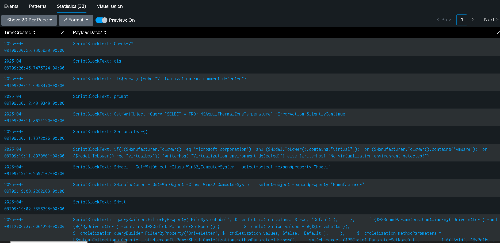
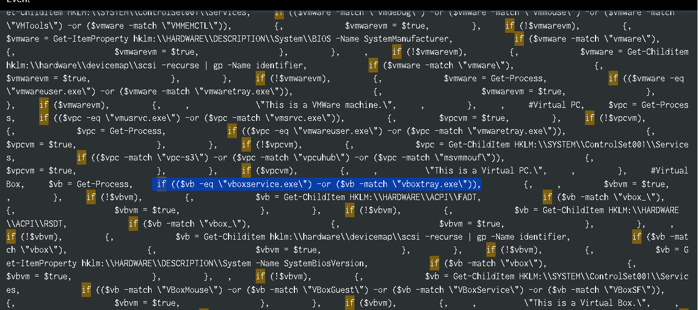

Para este laboratorio se nos proporcionan ficheros .evtx, que podemos parsear a formato json con `.evtx` o con `chainsaw`, en este laboratorio usaré ambas herramientas, para resolverlo con `splunk` y con `jq`. 


Nos dan el siguiente escenario:
Talion suspects that the threat actor carried out anti-virtualization checks to avoid detection in sandboxed environments. Your task is to analyze the event logs and identify the specific techniques used for virtualization detection. Byte Doctor requires evidence of the registry checks or processes the attacker executed to perform these checks.

Con EvtxEcm podemos parsearlo con el siguiente comando: 
```powershell
.\EvtxECmd.exe -d "C:\Ruta\evtx's\" --json "C:\Ruta\salida\phantom"
```

O con chainsaw: 
```bash 
┌──(kali㉿kali)-[~/blue-labs/phantom]
└─$ /opt/chainsaw/target/release/chainsaw dump *.evtx --jsonl > security_results.jsonl
```

En splunk creamos un nuevo indice, subimos los datos y podemos pasar a las preguntas: 

------

<h3 style="color: #9FEF00;">Task 1. Which WMI class did the attacker use to retrieve model and manufacturer information for virtualization detection?</h3>


Al investigar incidentes o realizar análisis forense en Windows, es fundamental identificar todas las acciones que un atacante pudo haber ejecutado mediante PowerShell, ya que es una herramienta nativa muy poderosa. Así que podemos filtrar por el identificador de evento 4104 pertenece al canal Microsoft‑Windows‑PowerShell/Operational y corresponde a la categoría “Script Block Logging”, que registra el contenido completo de los bloques de script ejecutados por PowerShell.

En Slunkp podemos aplicar el siguietne filtro: 

```bash
index="phantom" EventId=4104
| table TimeCreated, PayloadData2
| dedup PayloadData2
| sort -TimeCreated
```



Podemos ver que se emplea `$Model = Get-WmiObject -Class Win32_ComputerSystem | Select-Object -ExpandProperty "Model"`. 
Esto invoca el proveedor WMI (Get-WmiObject)

- Get-WmiObject es un cmdlet de PowerShell que consulta la infraestructura de administración de Windows (WMI, Windows Management Instrumentation).
- Especifica la clase WMI (-Class Win32_ComputerSystem)
  Win32_ComputerSystem es una de las clases más utilizadas para detectar características del equipo. Entre sus propiedades están, por ejemplo, Manufacturer (fabricante) y Model (modelo), que suelen revelar si el equipo corre sobre un hipervisor (VMware, VirtualBox, Hyper‑V, etc.) o es hardware físico.

- Un equipo físico puede devolver algo como "Latitude 5420" o "EliteDesk 800 G6".
- Una VM, en cambio, suele devolver:
    - "VMware Virtual Platform"
    - "VirtualBox"
    - "KVM"
    - "Virtual Machine" (Hyper‑V)

Con `jq` podemos ver lo siguiente: 

```bash 
┌──(kali㉿kali)-[~/blue-labs/phantom]
└─$ cat security_results.jsonl| jq '.Event | select(.System.EventID == 4104) | .EventData.ScriptBlockText' | grep -i "get-wmiobject"
"$Manufacturer = Get-WmiObject -Class Win32_ComputerSystem | select-object -expandproperty \"Manufacturer\""
"$Model = Get-WmiObject -Class Win32_ComputerSystem | select-object -expandproperty \"Model\""
"Get-WmiObject -Query \"SELECT * FROM MSAcpi_ThermalZoneTemperature\" -ErrorAction SilentlyContinue"
```

--------

<h3 style="color: #9FEF00;">Task 2. Which WMI query did the attacker execute to retrieve the current temperature value of the machine? </h3>

Esto podemos verlo en la misma tabla que generamos con la consulta anterior, podemos ver el siguiente comando: 

`ScriptBlockText: Get-WmiObject -Query "SELECT * FROM MSAcpi_ThermalZoneTemperature" -ErrorAction SilentlyContinue`

Esto es una clase dentro del espacio de nombres root\WMI (es decir, no en root\cimv2 sino en el repositorio WMI dedicado a ACPI). Expone información sobre las zonas térmicas gestionadas por ACPI (Advanced Configuration and Power Interface), incluyendo la temperatura actual medida por el sensor.

- -Query "SELECT * FROM …": aquí se usa WQL (WMI Query Language), muy parecido a SQL.
- Algunos malware o scripts de Fingerprinting comprueban la temperatura para distinguir un sandbox o entorno de análisis de un sistema real.
- Un entorno de laboratorio virtual puede devolver siempre la misma temperatura o un valor por defecto, mientras que en un equipo real la temperatura varía con la carga.
- Si el malware detecta temperaturas anormalmente bajas (p. ej. todo el tiempo 19 °C), puede deducir que está en un entorno de testing y abortar.
- También podría esperar a que la CPU suba de cierta temperatura antes de ejecutar payloads ruidosos, para simular un uso humano legítimo.

--------

<h3 style="color: #9FEF00;">Task 3. The attacker loaded a PowerShell script to detect virtualization. What is the function name of the script? </h3>

Esto lo podemos ver en la salida del query con splunk, lo primero que se nos muestra en el `ScriptBlockText` es "Check-VM", claramente un nombre de función. 

Con `jq` esto nos sale hasta el final con el siguiente comando: 

```bash
┌──(kali㉿kali)-[~/blue-labs/phantom]
└─$ cat security_results.jsonl| jq '.Event | select(.System.EventID == 4104) | .EventData.ScriptBlockText'
```

-----

<h3 style="color: #9FEF00;">Task 4. Which registry key did the above script query to retrieve service details for virtualization detection? </h3>

Para esto filtramos por el EventId 4103, 

El EventId 4103: 

 - Pertenece también al canal Microsoft‑Windows‑PowerShell/Operational.

 - “CommandInvocation”: cada vez que PowerShell ejecuta un cmdlet o una función, crea un registro 4103 con el nombre del comando (CommandInvocation), seguido por cada parámetro y su valor (ParameterBinding).

 - Es invaluable para ver qué parámetros usó un script en cada invocación, algo que el 4104 no detalla línea por línea. EL EventId 4104 (Script Block Logging) captura bloques enteros de código PowerShell cuando se ejecutan o “compilan”. Con él vimos invocaciones globales de funciones y consultas WMI completas.

Entre las líneas que obtenemos en splunk podemos ver lo siguiente:

`Payload: CommandInvocation(Get-ChildItem): "Get-ChildItem", ParameterBinding(Get-ChildItem): name="Path"; value="HKLM:\SYSTEM\ControlSet001\Services",`


- Bajo HKLM:\SYSTEM\ControlSet001\Services (y también en ControlSet002 o CurrentControlSet), Windows almacena las definiciones de todos los servicios instalados, incluidos los controladores de hipervisor y herramientas de integración de VM.

- Ejemplos de servicios indicativos de entornos virtuales:
     - VMware Tools: VMMouse, VMTools, etc.
     - Hyper‑V Integration Services: hvservice, vmicvss, vmicshutdown, ...
     - VirtualBox Guest Additions: VBoxService, VBoxGuest.

- Al listar (Get-ChildItem) esa ruta, el atacante puede buscar carpetas (subclaves) o propiedades concretas en servicios cuyo nombre coincida con patrones de máquinas virtuales.
-----

<h3 style="color: #9FEF00;">Task 5. The VM detection script can also identify VirtualBox. Which processes is it comparing to determine if the system is running VirtualBox? </h3>

Para esto no encontré nada en los eventid 4103 y 4104, así que filtré directamente por la palabra "if" con lo siguiente: 

`index="phantom" "if"`

Y encontré un registro, sin EventId u otro identificador de splunk, unicamente el script. Analizándolo, podemmos ver las comparaciones.

 

- vboxservice.exe: Es el servicio principal de las Guest Additions de VirtualBox.
_____

<h3 style="color: #9FEF00;">Task 6. The VM detection script prints any detection with the prefix 'This is a'. Which two virtualization platforms did the script detect? </h3>

Usamos el EventId 800 porque es el único que registra la salida real de los pipelines de PowerShell (es decir, lo que el script envía al host para mostrar)

Aplicamos el siguiente filtro: `index="phantom" EventId=800 "This is"`

Y encontramos el siguiente registro: 

```bash 
{ [-]
   Channel: Windows PowerShell
   ChunkNumber: 15
   Computer: DESKTOP-M3AKJSD
   EventId: 800
   EventRecordId: 566
   ExtraDataOffset: 0
   HiddenRecord: false
   Keywords: 0x80000000000000
   Level: Info
   MapDescription: Pipeline Execution Details
   Payload: {"EventData":{"Data":"\tDetailSequence=1\n\tDetailTotal=1\n\n\tSequenceNumber=145\n\n\tUserId=DESKTOP-M3AKJSD\\User\n\tHostName=ConsoleHost\n\tHostVersion=5.1.26100.2161\n\tHostId=0fad0cf8-6cb6-4657-86f7-655ec22eed9f\n\tHostApplication=C:\\Windows\\SysWOW64\\WindowsPowerShell\\v1.0\\powershell.exe\n\tEngineVersion=5.1.26100.2161\n\tRunspaceId=2aeeba59-d0f6-4ce7-b41c-e07625b3beec\n\tPipelineId=43\n\tScriptName=\n\tCommandLine=, CommandInvocation(Out-Default): \"Out-Default\"\nParameterBinding(Out-Default): name=\"InputObject\"; value=\"This is a Hyper-V machine.\"\nParameterBinding(Out-Default): name=\"InputObject\"; value=\"This is a VMWare machine.\"\n","Binary":""}}
   PayloadData1: HostApplication=C:\Windows\SysWOW64\WindowsPowerShell\v1.0\powershell.exe

   PayloadData2: HostName=ConsoleHost

   PayloadData3: HostVersion=5.1.26100.2161

   ProcessId: 6064
   Provider: PowerShell
   RecordNumber: 566
   SourceFile: C:\Users\Lenovo\Downloads\compartida\compartida\Microsoft-Windows-Powershell.evtx
   ThreadId: 0
   TimeCreated: 2025-04-09T09:20:57.2769144+00:00
}
```

Entonces, si esto es lo que se muestra al usuario, vemos que mostró al atacante las siguientes plataformas de virtualización: Hyper‑V, VMWare. 
