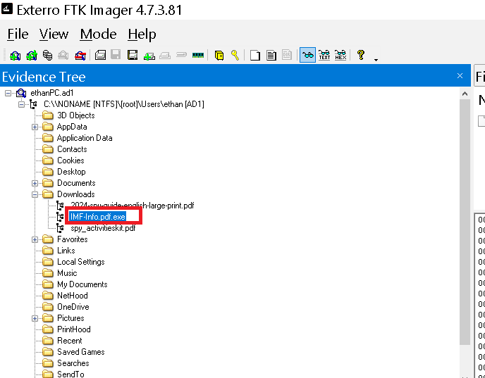
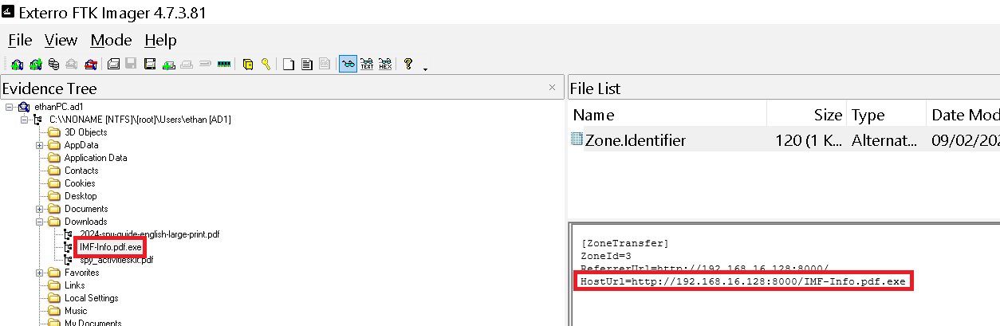
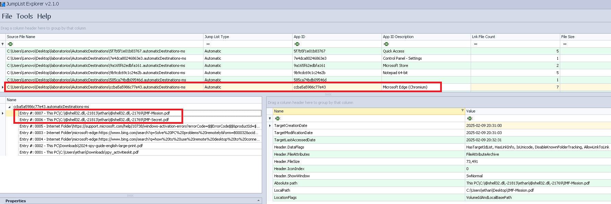
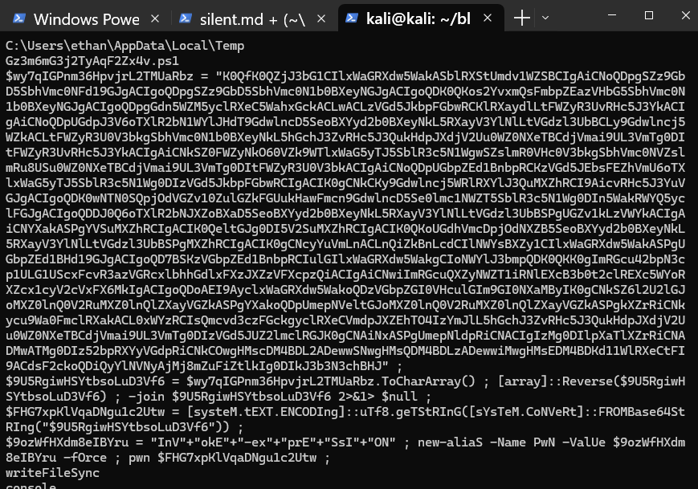

To this lab we have provided with a .ad1 file. I mounted this .ad1 on FTK. We can pass quickly move on to the questions. 

------

<h3 style="color: #0d6efd;"> Q1. What is the MD5 hash of the potentially malicious EXE file the user downloaded? </h3>

Exploring the .ad1 mounted, we found the following suspicious file: 



So, all we need to do is compute its hash.

```bash 
┌──(kali㉿kali)-[~/blue-labs/silent]
└─$ md5sum IMF-Info.pdf.exe
336a7cf476ebc7548c93507339196abb  IMF-Info.pdf.exe
```

-----

<h3 style="color: #0d6efd;"> Q2. What is the URL from which the file was downloaded? </h3>

I found this in the Zone.Identifier, which is an Alternate Data Stream (ADS) — a special type of metadata used by the NTFS file system in Windows. This stream is automatically added by the operating system when a file is downloaded from the internet or from an untrusted network, as a security measure.



-----

<h3 style="color: #0d6efd;"> Q3. What application did the user use to download this file? </h3>

In Windows, Jump Lists are the "recent.time" lists that appear in the Start Menú. These lists are generated automatically to spend up access to files, directories, or frequent tasks associated with each application. 
Windows stores this information in the user's profile, specifically in two directories located under: 

```bash 
C:\Users\<USER>\AppData\Roaming\Microsoft\Windows\Recent\
```

I loaded the `AutomaticDestinations`(Jump list generated autumattically by the system) into JumpList Explorer, a Zimerman tool. 




This corroborates that the user used Microsoft Edge to download and open the malicious PDF. 

-----

<h3 style="color: #0d6efd;"> Q4. By examining Windows Mail artifacts, we found an email address mentioning three IP addresses of servers that are at risk or compromised. What are the IP addresses? </h3>

I found this in `HxStore.hxd`, a property database file used by the Windows Mail(Mail & Calendar) app to store persistent user data, such as: 

- Emails (full or partial content)
- Email metadata (sender, subject, timestamps, etc.)
- Account configuration settings
- Conversations (if synchronized)
- Attachments (embedded content or references)

This file is under: 
```bash 
\Users\<usuario>\AppData\Local\Packages\microsoft.windowscommunicationsapps_8wekyb3d8bbwe\LocalState\HxStore.hxd
```

So I downloaded this file, and because it is a binary file, we need to use the `-a` flag with grep: 

```bash 
┌──(kali㉿kali)-[~/blue-labs/silent]
└─$ grep -aEo '([0-9]{1,3}\.){3}[0-9]{1,3}' HxStore.hxd | sort | uniq
145.67.29.88
192.168.16.128
212.33.10.112
```

------

<h3 style="color: #0d6efd;"> Q5. By examining the malicious executable, we found that it uses an obfuscated PowerShell script to decrypt specific files. What predefined password does the script use for encryption? </h3>

In the virustotal analisis we can see that actually the IMF-Info.pdf.exe drops a .ps1 file. In this case we could use the following command to search strings: 

`grep -i -C 20 "powershell" IMF.txt`



The script seems to be ofuscated and reversed, we can apply the following commands and find the answer: 

```bash 
┌──(kali㉿kali)-[~/blue-labs/silent]
└─$ echo "K0QfK0Q<SNIP>chBHJ" | rev | base64 -d > decoded
```

```bash 
┌──(kali㉿kali)-[~/blue-labs/silent]
└─$ head -n 5 decoded
$password = "Imf!nfo#2025Sec$"
$salt = [Byte[]](0x01,0x02,0x03,0x04,0x05,0x06,0x07,0x08)
$iterations = 10000
$keySize = 32
$ivSize = 16
```

-----

<h3 style="color: #0d6efd;"> Q6. After identifying how the script works, decrypt the files and submit the secret string. </h3>

I found the flag by modifiyng the script with gpt help: 

```powershell
$password = "Imf!nfo#2025Sec$"
$salt = [Byte[]](0x01,0x02,0x03,0x04,0x05,0x06,0x07,0x08)
$iterations = 10000
$keySize = 32 
$ivSize = 16
$deriveBytes = New-Object System.Security.Cryptography.Rfc2898DeriveBytes($password, $salt, $iterations)
$key = $deriveBytes.GetBytes($keySize)
$iv = $deriveBytes.GetBytes($ivSize)
$encryptedFiles = @(
 "C:\Users\Lenovo\Desktop\laboratorios\IMF-Mission.enc",
 "C:\Users\Lenovo\Desktop\laboratorios\IMF-Secret.enc"
)
foreach ($encFile in $encryptedFiles) {
    $outputFile = $encFile -replace '\.enc$', '.pdf'

    $aes = [System.Security.Cryptography.Aes]::Create()
    $aes.Key = $key
    $aes.IV  = $iv
    $aes.Mode    = [System.Security.Cryptography.CipherMode]::CBC
    $aes.Padding = [System.Security.Cryptography.PaddingMode]::PKCS7

    $decryptor  = $aes.CreateDecryptor()
    $encBytes   = [System.IO.File]::ReadAllBytes($encFile)
    $inStream   = New-Object System.IO.MemoryStream(,$encBytes)
    $cryptoStream = New-Object System.Security.Cryptography.CryptoStream(
        $inStream, $decryptor, [System.Security.Cryptography.CryptoStreamMode]::Read
    )

    $outBytes   = New-Object byte[] $encBytes.Length
    $bytesRead  = $cryptoStream.Read($outBytes, 0, $outBytes.Length)

    $cryptoStream.Close()
    $inStream.Close()

    [System.IO.File]::WriteAllBytes($outputFile, $outBytes[0..($bytesRead - 1)])
}

```

This script creates 2 PDF files, the answer is in `IMF-MISSION.PDF`

