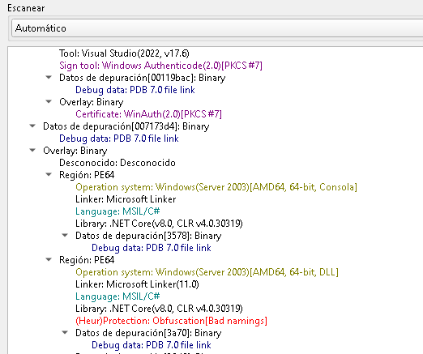
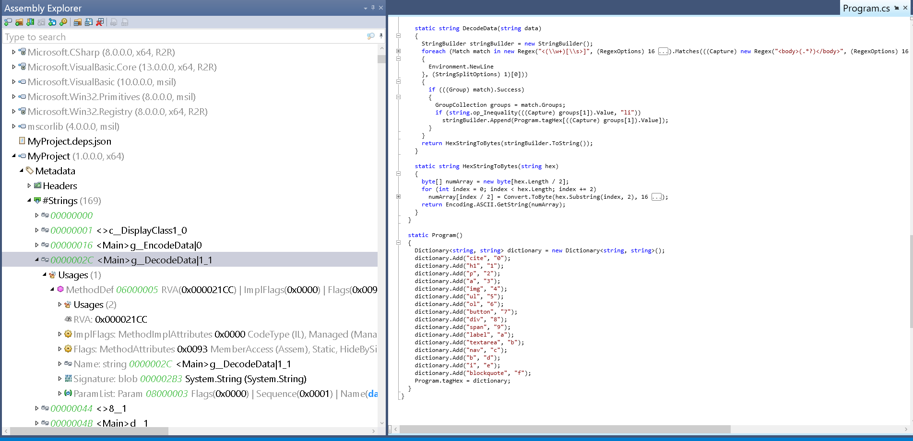

We were provided with two files: a .pcapng capture and a Windows executable (.exe).

When analyzing the .pcapng in Wireshark, we observe HTTP traffic. By following each tcp.stream and examining the HTTP streams:


we can infer that the payload is Base64-encoded, based on the structure of the data.

All we need to do is copy the contents of every POST request from the .pcapng into a text file and feed it to our decoding script. The script will output a Base64 string, which we can decode with:

```python
#!/usr/bin/env python3

import sys

def extract_first_letter():

    result = ""

    try:

        if len(sys.argv) != 2:
            print(f"[!] Usage: python3 {sys.argv[0]} file_path")

        file_path = sys.argv[1]

        with open(file_path, 'r') as file:
            content = file.read()

        words = content.split()

        for word in words:
            if word[0].isalpha():
                result += word[0]
            else:
                result += word[0]

        print("Extracted String: ", result)
    except FileNotFoundError:
        print(f"Error: file '{file_path}' not found.")
    except Exception as e:
        print(f"An error occurred: {e}")


if __name__ == "__main__":
    extract_first_letter()
```

All we need to do is copying all the information subbmited via POST requests in the .pcapng and paste it into a file and apply the script to this file. This will give us a base64 string that we can read with: 

```bash 
echo "<string>" | base64 -d; echo

windows-instanc\pakcyberbot
 Volume in drive C has no label.
 Volume Serial Number is A079-ADFB

 Directory of C:\Temp

05/07/2024  09:22 AM    <DIR>          .
05/07/2024  09:22 AM    <DIR>          ..
05/07/2024  07:23 AM        67,515,744 smphost.exe
               1 File(s)     67,515,744 bytes
               2 Dir(s)  29,638,520,832 bytes free
'h77P_s73417hy_revSHELL}'

Host Name:                 WINDOWS-INSTANC
OS Name:                   Microsoft Windows Server 2016 Datacenter
OS Version:                10.0.14393 N/A Build 14393
OS Manufacturer:           Microsoft Corporation
OS Configuration:          Standalone Server
OS Build Type:             Multiprocessor Free
Registered Owner:          N/A
Registered Organization:   N/A
Product ID:                00376-40000-00000-AA673
<SNIP>
```

This seems to be the result of a .bat script: 

```bat
whoami
Get-ChildItem C:\Temp
Get-Content C:\Temp\notes.txt
Get-ComputerInfo
```

**Now we have one part of the flag**

--------

Next, to obtain the remaining portion of the flag, we must analyze the .exe file. First, we can identify its characteristics using Detect It Easy:



Since this is a .NET binary, we decompile it with dotPeek. This converts the compiled .exe or .dll back into readable C# source code.

We then search the decompiled code for functions responsible for string deobfuscation:



These snippets reveal that strings enclosed within HTML tags are further obfuscated. We can apply a second script to deobfuscate them.

```bash 
#!/usr/bin/env python3

import base64
import random
import re
import sys

if len(sys.argv) != 2:
    print(f"\n[!] Usage: python3 '{sys.argv[0]}' file_path")
    sys.exit(1)

tag_hex = {
    "cite": "0", "h1": "1", "p": "2", "a": "3", "img": "4", "ul": "5", "ol": "6",
    "button": "7", "div": "8", "span": "9", "label": "a", "textarea": "b",
    "nav": "c", "b": "d", "i": "e", "blockquote": "f"
}

def decode_data(data):
    decoded_str = ""
    matches = re.findall(r'<(\w+)[\s>]', data)

    for match in matches:  # nombre corregido
        if match in tag_hex:
            decoded_str += tag_hex[match]

    print("Hex String:", decoded_str)

    try:
        decoded_bytes = bytes.fromhex(decoded_str)
        decoded_ascii = decoded_bytes.decode('ascii')
        return decoded_bytes, decoded_ascii
    except ValueError as e:
        return f"Error decoding hex: {str(e)}", None

def decode_html(input_file):
    with open(input_file, 'r') as f:
        html_content = f.read()
    return decode_data(html_content)

def main():
    file = sys.argv[1]
    decoded_bytes, decoded_html = decode_html(file)

    if decoded_html:
        print("\nDecoded ASCII:")
        print(decoded_html)
        print("\nDecoded Bytes:")
        print(decoded_bytes)

if __name__ == "__main__":
    main()
```

With that, we extract the second part of the flag.
