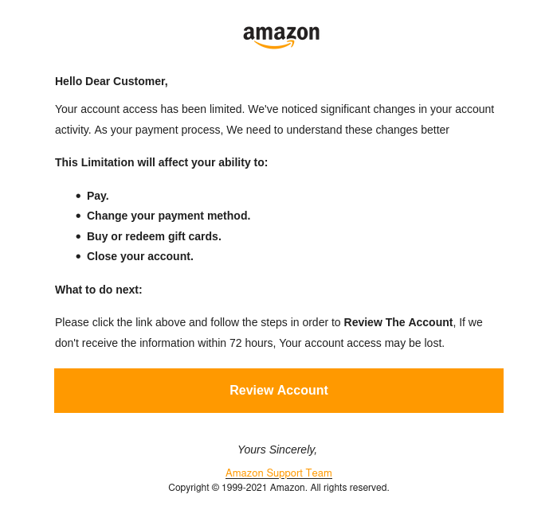
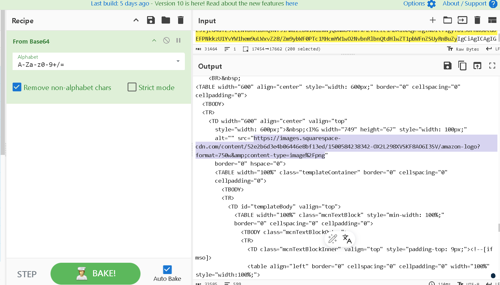
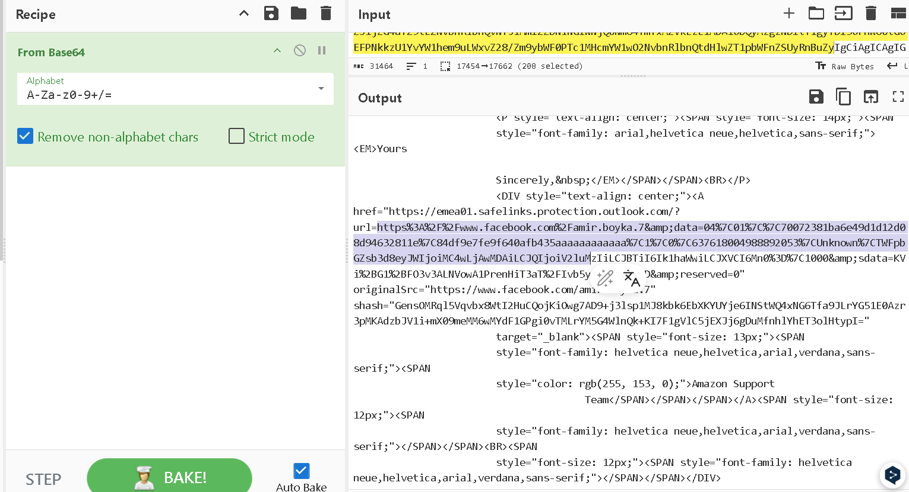

Scenario

Put your phishing analysis skils to the test by triaging and collecting information about a recent phishing campaign.

Para este laboratorio se nos proporciona unicamente un fichero: 

```bash 
┌──(kali㉿kali)-[~]
└─$ ls blue-labs/btlo
Your_Account_has_been_locked.eml
```

Así que pasamos rápidamente a las preguntas.

------

What is the sending email address?

Bien, para esto podemos abrir el fichero con thunderbird: 

```bash 
┌──(kali㉿kali)-[~/blue-labs/btlo]
└─$ thunderbird Your_Account_has_been_locked.eml
```

Vemos lo siguiente: 



Por lo que vemos, el que envía el correo es `amazon@zyevantoby.cn`, un intento de phishing con todas las de la ley. 

------

What is the recipient email address?

Por lo imagen de la pregunta anterior podemos ver que el que recibe el email es `saintington73@outlook.com`

------

What is the subject line of the email?

Vemos que contiene el texto `Your Account has been locked`, un intento de sentido de urgencia para caer en el phishing. 

------

What company is the attacker trying to imitate?

Podemos ver que se trata de amazon, un famoso servicio de paquetería. 

-----

What is the date and time the email was sent? (As copied from a text editor)

Para esto tenemos que leer el contenido con el comando `cat` por ejemplo. 

```bash 
┌──(kali㉿kali)-[~/blue-labs/btlo]
└─$ cat Your_Account_has_been_locked.eml
<SNIP>
From: Amazn <amazon@zyevantoby.cn>
To: saintington73 <saintington73@outlook.com>
Subject: Your Account has been locked
Date: Wed, 14 Jul 2021 01:40:32 +0900
<SNIP>
```

-------

What is the URL of the main call-to-action button?

Para esto podemos hacer click derecho sobre el botón de `Review Account` y copiar el link: 

`https://emea01.safelinks.protection.outlook.com/?url=https%3A%2F%2Famaozn.zzyuchengzhika.cn%2F%3Fmailtoken%3Dsaintington73%40outlook.com&data=04%7C01%7C%7C70072381ba6e49d1d12d08d94632811e%7C84df9e7fe9f640afb435aaaaaaaaaaaa%7C1%7C0%7C637618004988892053%7CUnknown%7CTWFpbGZsb3d8eyJWIjoiMC4wLjAwMDAiLCJQIjoiV2luMzIiLCJBTiI6Ik1haWwiLCJXVCI6Mn0%3D%7C1000&sdata=oPvTW08ASiViZTLfMECsvwDvguT6ODYKPQZNK3203m0%3D&reserved=0`

------

Look at the URL using URL2PNG. What is the first sentence (heading) displayed on this site? (regardless of whether you think the site is malicious or not)

Para esto tenemos que visitar `https://www.url2png.com/` y poner la url anterior, pero me lanza un error, la respuestá la encontré en otro writeup. 

-----

When looking at the main body content in a text editor, what encoding scheme is being used?

Para esto podemos buscar por el tipo de encoding que se usa en el correo: 

```bash 
┌──(kali㉿kali)-[~/blue-labs/btlo]
└─$ cat Your_Account_has_been_locked.eml | grep -i "encoding"
Content-Transfer-Encoding: base64
Content-Transfer-Encoding: base64
```

------

What is the URL used to retrieve the company's logo in the email?

Para esto podemos copiar el segundo fragmento de base64 y pegarlo en cyberchef: 



--------

For some unknown reason one of the URLs contains a Facebook profile URL. What is the username (not necessarily the display name) of this account, based on the URL?

Un poco más abajo en la salida de cyberchef podemos ver el perfil:



