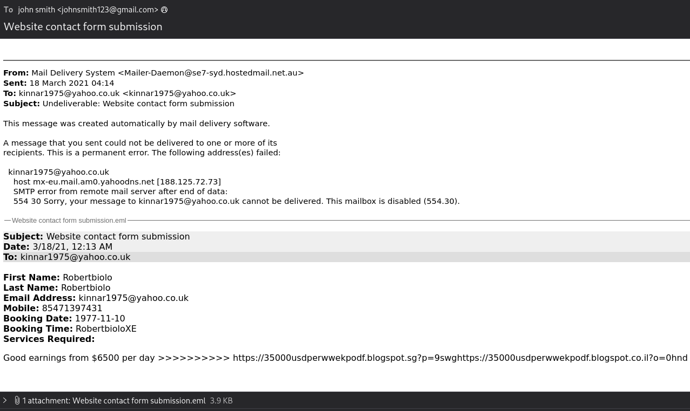
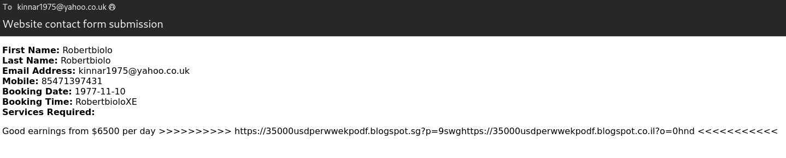
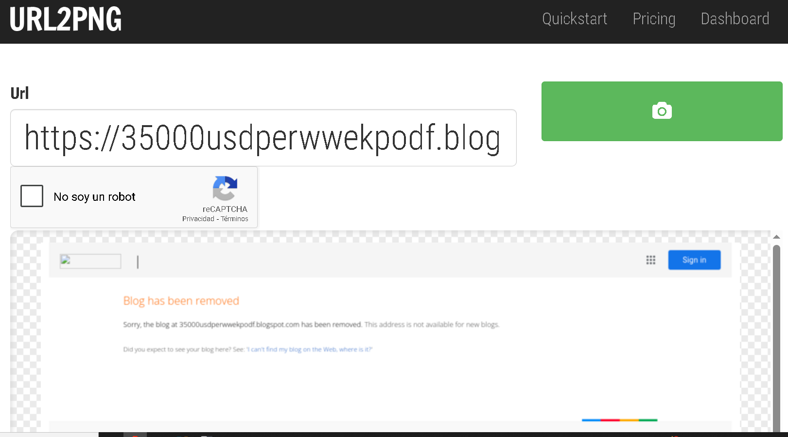

Scenario

A user has received a phishing email and forwarded it to the SOC. Can you investigate the email and attachment to collect useful artifacts?

Para este laboratorio se nos proporcionan los siguientes ficheros: 

```bash 
┌──(kali㉿kali)-[~/blue-labs/btlo]
└─$ ls
'Website contact form submission.eml'
```

Así que podemos pasar a las preguntas.

-----

Who is the primary recipient of this email?

Para esto tenemos que abrir el email, podemos usar thunderbird con el siguiente comando: 

```bash 
┌──(kali㉿kali)-[~/blue-labs/btlo]
└─$ thunderbird Website\ contact\ form\ submission.eml
```

Aquí vemos que el email va dirigido a `kinnar1975@yahoo.co.uk`



------

What is the subject of this email?

Esto lo podemos ver en el apartado de `Subject: Undeliverable: Website contact form submission`

------------

What is the date and time the email was sent?

Esto lo podemos ver en el apartado de `Sent: 18 March 2021 04:14`

------

What is the Originating IP?

Para esto leí el contenido del .eml con cat: 

```bash 
┌──(kali㉿kali)-[~/blue-labs/btlo]
└─$ cat Website\ contact\ form\ submission.eml
<SNIP>
Received: from c5s2-1e-syd.hosting-services.net.au ([103.9.171.10])
        by se7-syd.hostedmail.net.au with esmtps (TLSv1.2:AES128-GCM-SHA256:128)
        (Exim 4.92)
        id 1lMk2r-0007vB-6O
        for kinnar1975@yahoo.co.uk; Thu, 18 Mar 2021 15:14:06 +1100
```

---------

Perform reverse DNS on this IP address, what is the resolved host?

Un PTR (Pointer) record es un tipo de registro DNS cuyo propósito es mapear una dirección IP a un nombre de host (contrario al registro A/AAAA que mapea nombre → IP). Es la pieza fundamental del DNS inverso (reverse DNS). 

El DNS tiene dos direcciones de consulta:
- Forward DNS: nombre → A/AAAA → dirección IP.
- Reverse DNS: dirección IP → PTR → nombre.

Esto podemos encontrarlo con distintos comandos: 

```bash 
┌──(kali㉿kali)-[~/blue-labs/btlo]
└─$ dig -x 103.9.171.10 +short
c5s2-1e-syd.hosting-services.net.au.

┌──(kali㉿kali)-[~/blue-labs/btlo]
└─$ host 103.9.171.10
10.171.9.103.in-addr.arpa domain name pointer c5s2-1e-syd.hosting-services.net.au.

┌──(kali㉿kali)-[~/blue-labs/btlo]
└─$ nslookup 103.9.171.10
10.171.9.103.in-addr.arpa       name = c5s2-1e-syd.hosting-services.net.au.

Authoritative answers can be found from:
```

Muchos servidores SMTP verifican que el servidor que conecta tenga un PTR válido y, preferentemente, que el nombre devuelto por el PTR resuelva de nuevo a la misma IP (esto se llama Forward-confirmed reverse DNS o FCrDNS). Si no hay coincidencia puede aumentar la probabilidad de que un correo sea marcado como spam o rechazado.

Podemos comparar distintos resolvers (para caché / discrepancias)

```bash 
dig -x 103.9.171.10 @8.8.8.8 +short      # Google
dig -x 103.9.171.10 @1.1.1.1 +short      # Cloudflare
dig -x 103.9.171.10 @9.9.9.9 +short      # Quad9 (opcional)
```

--------

What is the name of the attached file?

Por lo que vemos en la captura del principio, el fichero se llama `Website contact form submission.eml`. 

-----

What is the URL found inside the attachment?

Para esto tenemos que descargar el archivo adjunto, ponerle otro nombre y abrirlo también con thunderbird: 



La ruta es `https://35000usdperwwekpodf.blogspot.sg?p=9swghttps://35000usdperwwekpodf.blogspot.co.il?o=0hnd`. 

------

What service is this webpage hosted on?

Por el dominio podemos ber que se trata de blogspot, que es un proveedor de dominios gratuitos utilizado exclusivamente para blogs creados con la plataforma Blogger, que es propiedad de Google.Es un servicio que permite alojar blogs en el subdominio blogspot.com, siendo la opción predeterminada y gratuita para los usuarios que crean blogs en Blogger.

-------

Using URL2PNG, what is the heading text on this page? (Doesn't matter if the page has been taken down!)

Para esto vamos a `https://www.url2png.com/`, colocamos la URL encontrada y vemos que lo que tenemos al principio es el mensaje `blog has been removed`. 


