Advent of The Relics 2 - Operation Winter Blackout
Read the campaign introduction and supporting information at https://github.com/hackthebox/advent-of-the-relics

A phishing attack on a logistics company has led investigators to a private criminal forum. The crew behind it has been planning something big for months. Your job is to dig through their communications and uncover who they are, what they're targeting, and how they plan to disappear.

The forum can be accessed at: https://advent-of-the-relics-forum.htb.blue

First, you will need to gain access to the forum using the password SnowBlackOut_2026!, which you found in your previous investigation, to unlock the intel inside.

The scenario portrayed in this challenge is entirely fictional and created solely for educational and entertainment purposes. Any resemblance to actual persons, living or dead, organizations, or real events is purely coincidental and unintentional. All characters, scenarios, and data presented are products of imagination.

----------------

Q1.- How many suspects are using this forum?

Para esto podemos ir a la sección de `Members` en la parte superior derecha del sitio: 

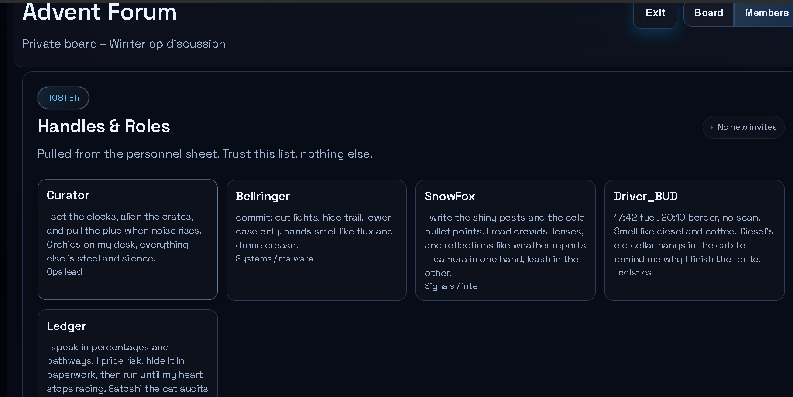

Contamos 5 usuarios. 

Q2.- What is the username of the group's leader?

Por la descripción de los usuarios, parece que el usuario `Curator` es el lider. 

Q3.- What is Driver_BUD's real first name?

Para esto podemos poner " Driver_BUD" en el buscador de la sección `Board` del blog. 
Encontraremos varias conversaciones, en la siguiente llaman por su nombre a " Driver_BUD": 

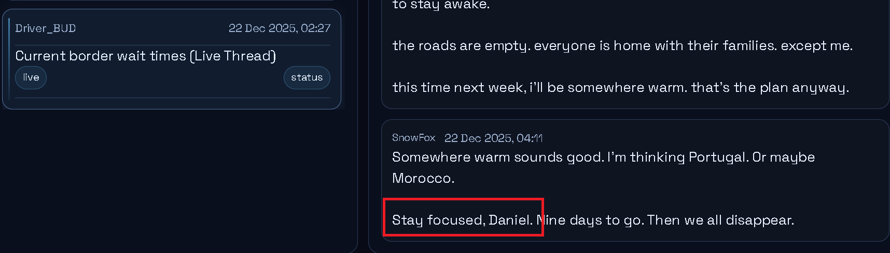

Q4.- What is the codename of the operation?

En la categoría de `Operations` podemos ver lo siguiente: 

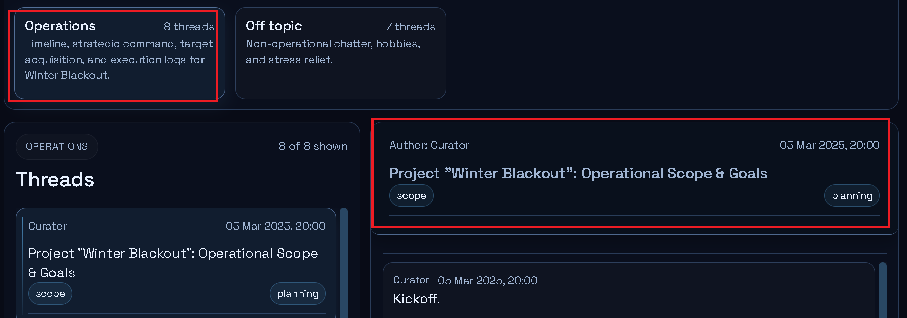

Q5.- What single word is the trigger code that activates all nodes?

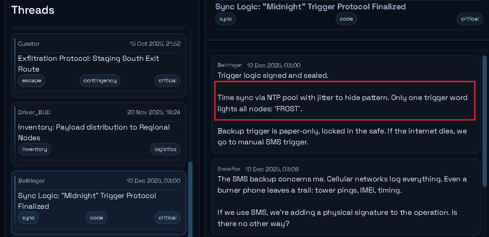 

Q6.- What is the name of the fake exhibition used as cover for the heist?

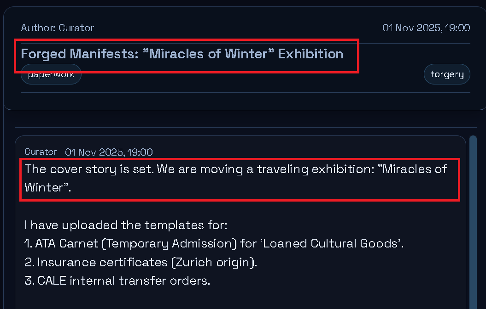

Q7.- What time was the single word trigger scheduled to execute on New Year's Eve?

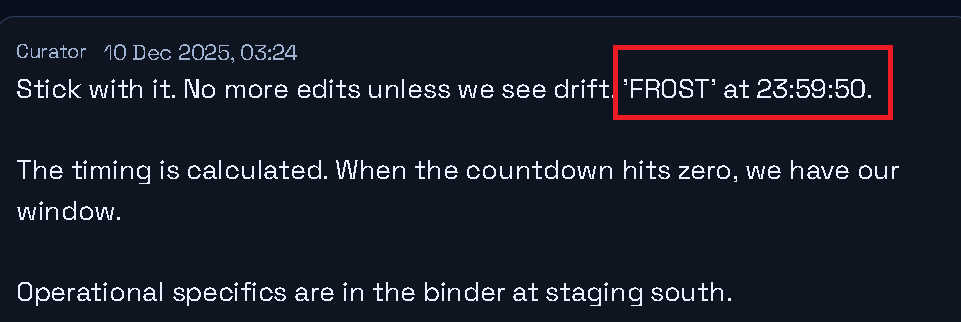

Q8.- What is the full name of the phishing target at CALE?

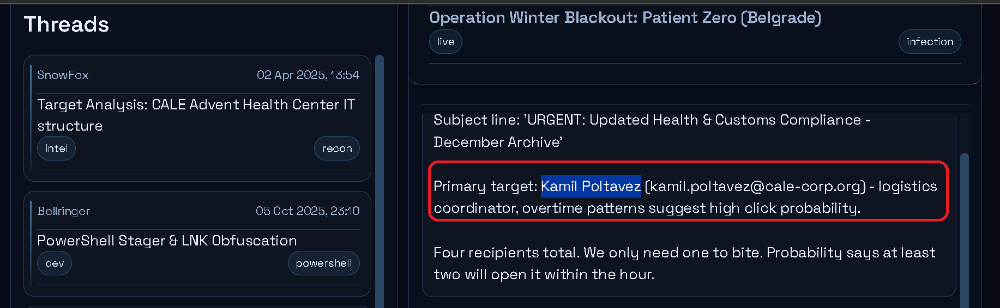

Q9.- What make and model is the truck used for transport?

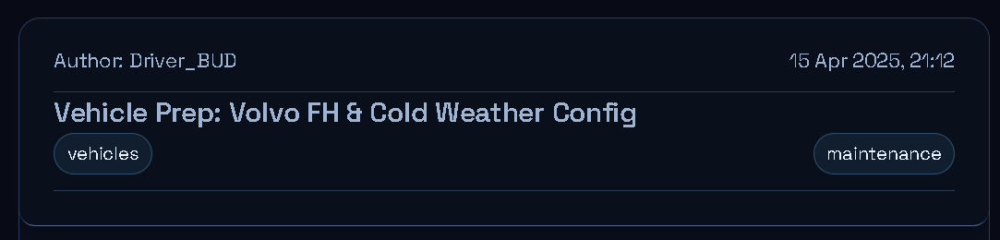

Q10.- What is the name of Ledgers cat?

Esto lo encontramos en la descripción de `Ledgers` en la sección de `Members`

Q11.- What is the primary C2 domain used for beacon check-ins?

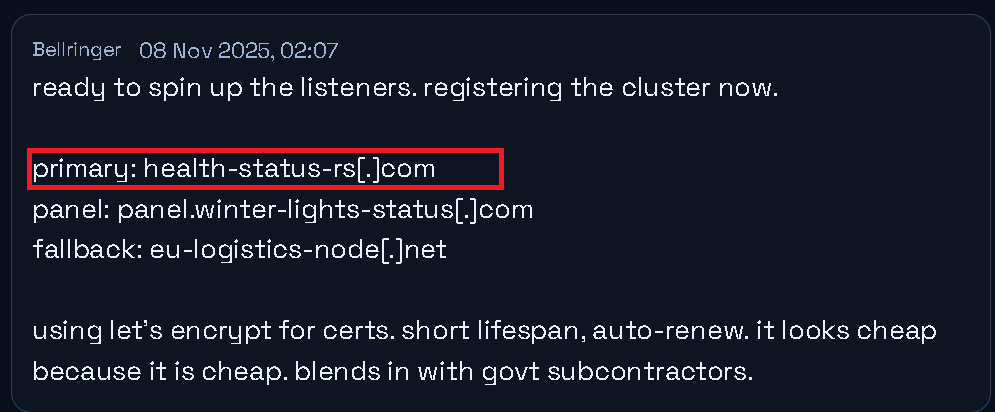

Q12.- In which city is the VPS server hosting the C2 panel?

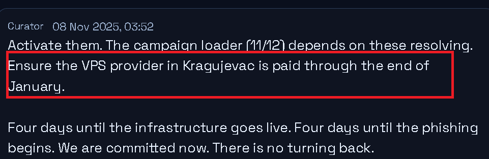

Q13.- On what date did the C2 listeners go live?

En la captura de la pregunta anterior mencionan que los servidores estarán funcionando en 4 días: `2025-11-12`. 

Q14.- In which city is the document forger located?

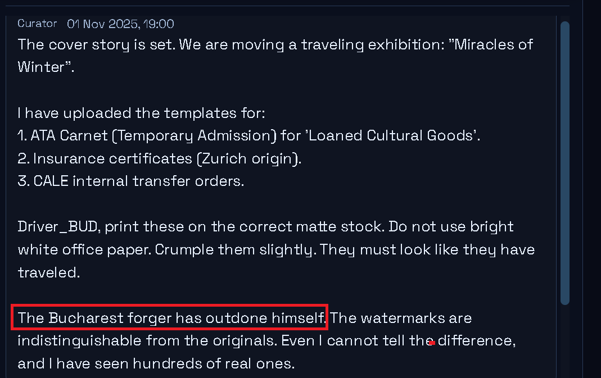

Q15.- What shell company was used as a backup cover story?

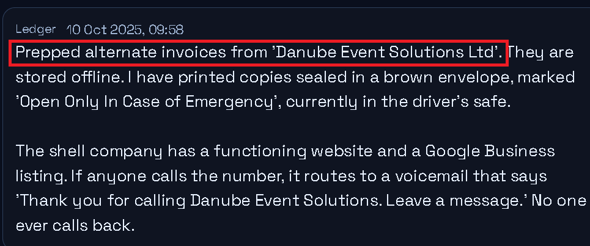

Q16.- What is the filename of the wipe script used to destroy evidence?


LUKS(Linux Unifieid Key Setup) es el estándar de Linux para cifrado de discos completos.

Se utiliza normalmente con cryptsetup.

Un disco LUKS contiene:

- Cabecera LUKS (headers)
    - Información del cifrado
    - Slots de claves
    - Parámetros criptográficos
- Datos cifrados
Sin la cabecera, los datos son irrecuperables, aunque físicamente sigan en el disco.

### **La opción --wipe sobrescribe la cabecera LUKS, eliminando:**

- Keyslots
- Metadatos de cifrado
- Información necesaria para descifrar el volumen

En términos prácticos:

> El disco queda permanentemente inutilizable desde el punto de vista criptográfico.

**No es un borrado lógico de archivos, sino una destrucción del acceso a los datos.**

Esto es extremadamente efectivo para anti-forensics, porque:

- Es rápido
- No requiere sobrescribir todo el disco
- Hace imposible recuperar datos incluso con análisis físico

Q17.- What is the name of the escape vessel?


Q18.- What is the captain's name?

En el mensaje anterior podremos leer lo siguiente: `Ask for Stavros. He speaks Serbian. Pay him €800 in cash`. 

Q19.- What are the GPS coordinates of the emergency extraction point for Driver_BUD?

Esta fue interesante, primero nos encontramos con el siguiente mensaje: 

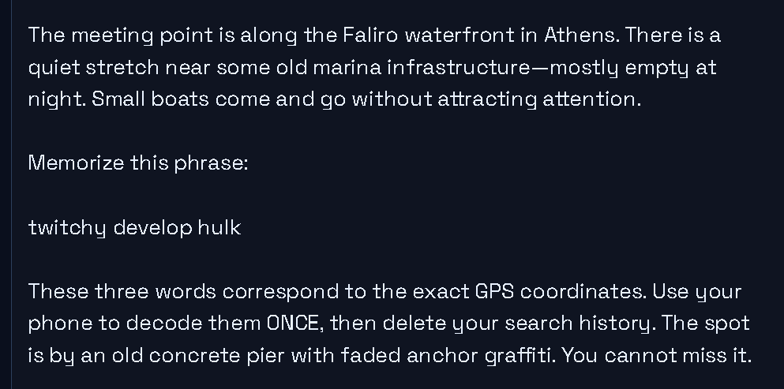

Tres palabras para conocer la ubicación. 

Buscando y preguntando a GTP supe lo siguiente: 

Eso es casi con certeza un código de geolocalización tipo three-word address, concretamente del sistema what3words.

Este sistema:

- Divide toda la superficie del planeta en cuadrados de 3 m × 3 m
- A cada cuadrado le asigna una combinación única de tres palabras
> Ejemplo: `filled.count.soap → una coordenada exacta en el mundo`

Así que podemos visitar el siguinte sitio para introducir las palabras: 

```bash 
https://what3words.com
```

Introduciendo `twitchy.develop.hulk` nos dará 3 posibles ubicaciones: 


Dando click al recuado marcado podemos elegir la opción de `Indicaciones`, nos da la opción de abrirlo con googlemaps y revisando la direccion del sitio podemos ver algo como lo siguiente: 

```bash 
https://www.google.com/maps/dir/47.3516912, 88.1695832/37.936489,23.68644/@6.6204667,-861.9591877,3z/data=!3m1!4b1!4m4!e1!1m0?entry=ttu&g_ep=EgoyMDI2MDEwNy4wIKXMDSoKLDEwMDc5hj378vn389s%3D
```

El primer par de números es nuestra ubicación, el segundo par de números es el destino, este par es el que buscamos: 
```bash 
37.936489,23.68644
```

Q20.- What are the GPS coordinates of the farmhouse hideout?


